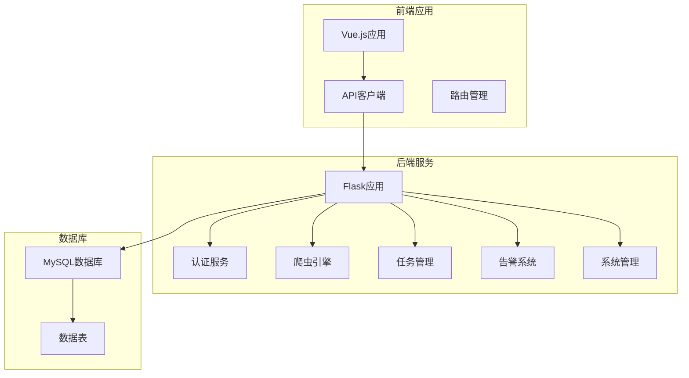
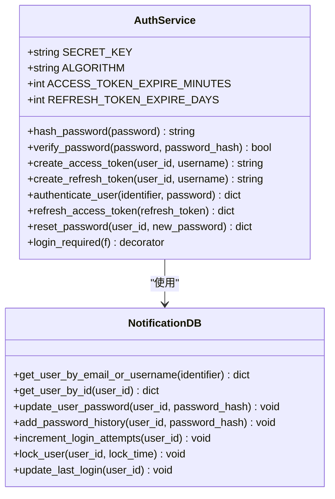
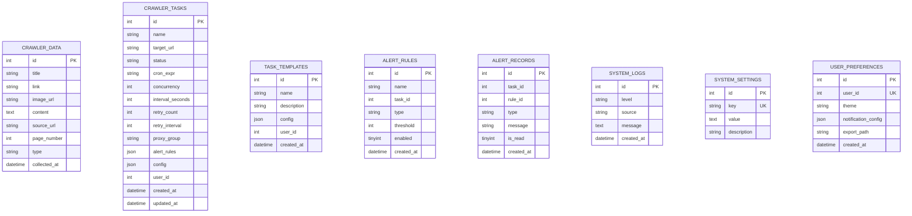
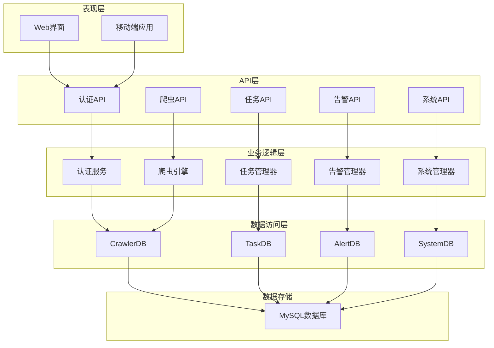
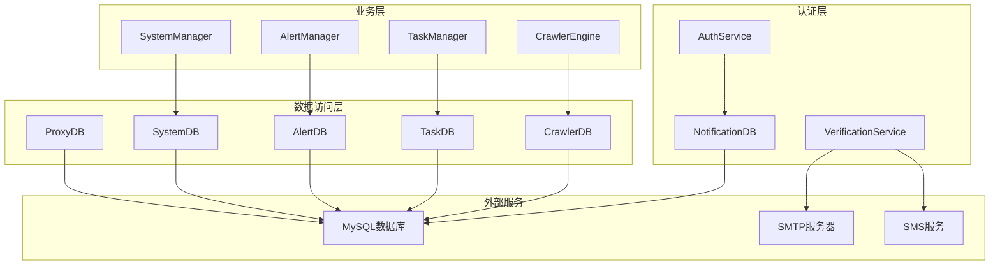

# API接口文档

<cite>
**本文档引用的文件**
- [app.py](file://python/app.py)
- [auth_server.py](file://python/auth_server.py)
- [src/auth_service.py](file://python/src/auth_service.py)
- [src/notifications/verification_service.py](file://python/src/notifications/verification_service.py)
- [src/notification_db.py](file://python/src/notification_db.py)
- [crawler_db.py](file://python/crawler_db.py)
- [task_db.py](file://python/task_db.py)
- [alert_db.py](file://python/alert_db.py)
- [system_db.py](file://python/system_db.py)
- [proxy_db.py](file://python/proxy_db.py)
- [crawler_engine.py](file://python/crawler_engine.py)
- [python-web/src/api/index.js](file://python-web/src/api/index.js)
- [python-web/src/api/student.js](file://python-web/src/api/student.js)
- [python-web/src/api/task.js](file://python-web/src/api/task.js)
- [python-web/src/api/crawler.js](file://python-web/src/api/crawler.js)
- [python-web/src/api/system.js](file://python-web/src/api/system.js)
- [python-web/src/api/proxy.js](file://python-web/src/api/proxy.js)
- [python-web/src/router/index.js](file://python-web/src/router/index.js)
</cite>

## 目录
1. [简介](#简介)
2. [项目结构](#项目结构)
3. [核心组件](#核心组件)
4. [架构概览](#架构概览)
5. [详细组件分析](#详细组件分析)
6. [依赖关系分析](#依赖关系分析)
7. [性能考虑](#性能考虑)
8. [故障排除指南](#故障排除指南)
9. [结论](#结论)
10. [附录](#附录)

## 简介

本项目是一个基于Flask的爬虫管理系统，提供了完整的RESTful API接口，包括认证API、用户管理API、爬虫API、任务管理API、告警管理API、系统管理API等。系统采用JWT令牌认证机制，支持用户注册、登录、密码管理、任务调度、数据采集等功能。

## 项目结构

项目采用前后端分离架构，后端使用Python Flask框架，前端使用Vue.js构建。



**图表来源**
- [app.py:18-28](file://python/app.py#L18-L28)
- [auth_server.py:9-17](file://python/auth_server.py#L9-L17)

**章节来源**
- [app.py:1-50](file://python/app.py#L1-L50)
- [auth_server.py:1-50](file://python/auth_server.py#L1-L50)

## 核心组件

### 认证服务组件

认证服务使用JWT令牌进行用户身份验证，支持访问令牌和刷新令牌机制。



**图表来源**
- [src/auth_service.py:9-187](file://python/src/auth_service.py#L9-L187)
- [src/notification_db.py](file://python/src/notification_db.py)

### 数据库组件

系统使用PyMySQL连接MySQL数据库，包含多个数据表用于存储不同类型的业务数据。



**图表来源**
- [crawler_db.py:54-81](file://python/crawler_db.py#L54-L81)
- [task_db.py:52-111](file://python/task_db.py#L52-L111)
- [alert_db.py:51-81](file://python/alert_db.py#L51-L81)
- [system_db.py:52-87](file://python/system_db.py#L52-L87)

**章节来源**
- [src/auth_service.py:1-187](file://python/src/auth_service.py#L1-L187)
- [crawler_db.py:1-238](file://python/crawler_db.py#L1-L238)
- [task_db.py:1-533](file://python/task_db.py#L1-L533)

## 架构概览

系统采用分层架构设计，包含表现层、业务逻辑层、数据访问层和数据库层。



**图表来源**
- [app.py:49-800](file://python/app.py#L49-L800)
- [auth_server.py:47-431](file://python/auth_server.py#L47-L431)

## 详细组件分析

### 认证API

#### 用户注册
- **HTTP方法**: POST
- **URL模式**: `/api/auth/register`
- **请求参数**:
  - username: 用户名 (必填，最少3个字符)
  - email: 邮箱地址 (可选)
  - phone: 手机号码 (可选)
  - password: 密码 (必填，最少6个字符)

- **响应格式**:
  ```json
  {
    "success": true,
    "message": "注册成功",
    "data": {
      "user_id": 123
    }
  }
  ```

- **状态码**:
  - 201: 注册成功
  - 400: 参数验证失败
  - 500: 服务器内部错误

#### 用户登录
- **HTTP方法**: POST
- **URL模式**: `/api/auth/login`
- **请求参数**:
  - identifier: 用户名或邮箱 (必填)
  - password: 密码 (必填)

- **响应格式**:
  ```json
  {
    "success": true,
    "message": "登录成功",
    "data": {
      "access_token": "jwt_token",
      "refresh_token": "jwt_token",
      "user": {
        "id": 123,
        "username": "john_doe",
        "email": "john@example.com",
        "phone": "13800138000"
      }
    }
  }
  ```

- **状态码**:
  - 200: 登录成功
  - 400: 参数缺失或密码错误
  - 401: 认证失败
  - 500: 服务器内部错误

#### 刷新令牌
- **HTTP方法**: POST
- **URL模式**: `/api/auth/refresh`
- **请求参数**:
  - refresh_token: 刷新令牌 (必填)

- **响应格式**:
  ```json
  {
    "success": true,
    "data": {
      "access_token": "new_jwt_token"
    }
  }
  ```

- **状态码**:
  - 200: 刷新成功
  - 400: 缺少刷新令牌
  - 401: 令牌无效
  - 500: 服务器内部错误

#### 忘记密码 - 发送验证码
- **HTTP方法**: POST
- **URL模式**: `/api/auth/forgot-password/send-code`
- **请求参数**:
  - target: 邮箱或手机号 (必填)

- **响应格式**:
  ```json
  {
    "success": true,
    "message": "验证码发送成功"
  }
  ```

- **状态码**:
  - 200: 发送成功
  - 400: 参数无效
  - 500: 发送失败

#### 忘记密码 - 验证验证码
- **HTTP方法**: POST
- **URL模式**: `/api/auth/forgot-password/verify-code`
- **请求参数**:
  - user_id: 用户ID (必填)
  - code: 验证码 (必填)
  - target: 邮箱或手机号 (必填)

- **响应格式**:
  ```json
  {
    "success": true,
    "message": "验证码验证成功"
  }
  ```

- **状态码**:
  - 200: 验证成功
  - 400: 参数缺失或验证码错误
  - 500: 验证失败

#### 忘记密码 - 重置密码
- **HTTP方法**: POST
- **URL模式**: `/api/auth/forgot-password/reset`
- **请求参数**:
  - user_id: 用户ID (必填)
  - new_password: 新密码 (必填，最少6个字符)

- **响应格式**:
  ```json
  {
    "success": true,
    "message": "密码重置成功"
  }
  ```

- **状态码**:
  - 200: 重置成功
  - 400: 参数无效
  - 500: 重置失败

#### 修改密码
- **HTTP方法**: POST
- **URL模式**: `/api/auth/change-password`
- **请求参数**:
  - old_password: 旧密码 (必填)
  - new_password: 新密码 (必填，最少6个字符)

- **响应格式**:
  ```json
  {
    "success": true,
    "message": "密码修改成功"
  }
  ```

- **状态码**:
  - 200: 修改成功
  - 400: 参数无效或旧密码错误
  - 500: 修改失败

#### 获取用户资料
- **HTTP方法**: GET
- **URL模式**: `/api/user/profile`

- **响应格式**:
  ```json
  {
    "success": true,
    "data": {
      "id": 123,
      "username": "john_doe",
      "email": "john@example.com",
      "phone": "13800138000",
      "last_login_at": "2023-12-01 10:30:00",
      "created_at": "2023-12-01 09:15:00"
    }
  }
  ```

- **状态码**:
  - 200: 获取成功
  - 404: 用户不存在
  - 500: 获取失败

**章节来源**
- [app.py:49-271](file://python/app.py#L49-L271)
- [auth_server.py:47-424](file://python/auth_server.py#L47-L424)
- [src/auth_service.py:76-183](file://python/src/auth_service.py#L76-L183)

### 爬虫API

#### 启动爬虫任务
- **HTTP方法**: POST
- **URL模式**: `/api/crawler/start`
- **请求参数**:
  - target_url: 目标网址 (必填，必须以http://或https://开头)
  - total_pages: 爬取页数 (必填，1-100之间)
  - interval_seconds: 请求间隔 (必填，1-60秒之间)
  - crawl_mode: 爬取模式 (可选，默认link，可选值: link, image, mixed)

- **响应格式**:
  ```json
  {
    "success": true,
    "message": "爬虫启动成功"
  }
  ```

- **状态码**:
  - 200: 启动成功
  - 400: 参数验证失败
  - 500: 启动失败

#### 停止爬虫任务
- **HTTP方法**: POST
- **URL模式**: `/api/crawler/stop`

- **响应格式**:
  ```json
  {
    "success": true,
    "message": "爬虫停止成功"
  }
  ```

- **状态码**:
  - 200: 停止成功
  - 400: 停止失败

#### 获取爬虫状态
- **HTTP方法**: GET
- **URL模式**: `/api/crawler/status`

- **响应格式**:
  ```json
  {
    "success": true,
    "data": {
      "status": "RUNNING",
      "current_page": 5,
      "total_pages": 10,
      "processed_count": 150,
      "error_count": 0
    }
  }
  ```

- **状态码**:
  - 200: 获取成功
  - 500: 获取失败

#### 查询爬虫数据
- **HTTP方法**: GET
- **URL模式**: `/api/crawler/data`
- **查询参数**:
  - page: 页码 (可选，默认1)
  - page_size: 每页大小 (可选，默认20，最大100)
  - keyword: 搜索关键词 (可选)

- **响应格式**:
  ```json
  {
    "success": true,
    "data": {
      "list": [
        {
          "id": 1,
          "title": "示例标题",
          "link": "https://example.com",
          "content": "内容摘要",
          "source_url": "https://example.com",
          "page_number": 1,
          "type": "link",
          "collected_at": "2023-12-01 10:30:00"
        }
      ],
      "total": 150,
      "page": 1,
      "page_size": 20
    }
  }
  ```

- **状态码**:
  - 200: 查询成功
  - 500: 查询失败

#### 清空爬虫数据
- **HTTP方法**: DELETE
- **URL模式**: `/api/crawler/data`

- **响应格式**:
  ```json
  {
    "success": true,
    "message": "数据清空成功"
  }
  ```

- **状态码**:
  - 200: 清空成功
  - 500: 清空失败

#### 导出爬虫数据
- **HTTP方法**: GET
- **URL模式**: `/api/crawler/export`

- **响应格式**: CSV文件下载

- **状态码**:
  - 200: 导出成功
  - 400: 无数据可导出
  - 500: 导出失败

**章节来源**
- [app.py:302-462](file://python/app.py#L302-L462)
- [crawler_db.py:96-238](file://python/crawler_db.py#L96-L238)

### 任务管理API

#### 获取任务列表
- **HTTP方法**: GET
- **URL模式**: `/api/tasks`
- **查询参数**:
  - status: 任务状态 (可选)
  - keyword: 搜索关键词 (可选)
  - page: 页码 (可选，默认1)
  - page_size: 每页大小 (可选，默认20，最大100)

- **响应格式**:
  ```json
  {
    "success": true,
    "data": {
      "list": [
        {
          "id": 1,
          "name": "示例任务",
          "target_url": "https://example.com",
          "status": "PENDING",
          "cron_expr": "",
          "concurrency": 1,
          "interval_seconds": 0,
          "retry_count": 0,
          "retry_interval": 60,
          "proxy_group": "",
          "alert_rules": null,
          "config": null,
          "user_id": 123,
          "created_at": "2023-12-01 09:15:00",
          "updated_at": "2023-12-01 10:30:00"
        }
      ],
      "total": 10,
      "page": 1,
      "page_size": 20
    }
  }
  ```

- **状态码**:
  - 200: 获取成功
  - 500: 获取失败

#### 创建任务
- **HTTP方法**: POST
- **URL模式**: `/api/tasks`
- **请求参数**:
  - name: 任务名称 (必填)
  - task_type: 任务类型 (必填)
  - config: 任务配置 (可选)
  - description: 任务描述 (可选)
  - template_id: 模板ID (可选)

- **响应格式**:
  ```json
  {
    "success": true,
    "message": "创建任务成功",
    "data": {
      "task_id": 456
    }
  }
  ```

- **状态码**:
  - 201: 创建成功
  - 400: 参数无效
  - 500: 创建失败

#### 获取任务详情
- **HTTP方法**: GET
- **URL模式**: `/api/tasks/{task_id}`

- **响应格式**:
  ```json
  {
    "success": true,
    "data": {
      "id": 1,
      "name": "示例任务",
      "target_url": "https://example.com",
      "status": "PENDING",
      "config": {},
      "user_id": 123,
      "created_at": "2023-12-01 09:15:00",
      "updated_at": "2023-12-01 10:30:00"
    }
  }
  ```

- **状态码**:
  - 200: 获取成功
  - 404: 任务不存在
  - 500: 获取失败

#### 更新任务
- **HTTP方法**: PUT
- **URL模式**: `/api/tasks/{task_id}`
- **请求参数**:
  - name: 任务名称 (可选)
  - task_type: 任务类型 (可选)
  - config: 任务配置 (可选)
  - description: 任务描述 (可选)

- **响应格式**:
  ```json
  {
    "success": true,
    "message": "更新任务成功"
  }
  ```

- **状态码**:
  - 200: 更新成功
  - 404: 任务不存在
  - 500: 更新失败

#### 删除任务
- **HTTP方法**: DELETE
- **URL模式**: `/api/tasks/{task_id}`

- **响应格式**:
  ```json
  {
    "success": true,
    "message": "删除任务成功"
  }
  ```

- **状态码**:
  - 200: 删除成功
  - 404: 任务不存在
  - 500: 删除失败

#### 启动任务
- **HTTP方法**: POST
- **URL模式**: `/api/tasks/{task_id}/start`

- **响应格式**:
  ```json
  {
    "success": true,
    "message": "任务启动成功"
  }
  ```

- **状态码**:
  - 200: 启动成功
  - 404: 任务不存在
  - 400: 启动失败
  - 500: 启动异常

#### 停止任务
- **HTTP方法**: POST
- **URL模式**: `/api/tasks/{task_id}/stop`

- **响应格式**:
  ```json
  {
    "success": true,
    "message": "任务停止成功"
  }
  ```

- **状态码**:
  - 200: 停止成功
  - 404: 任务不存在
  - 400: 停止失败
  - 500: 停止异常

#### 获取任务模板列表
- **HTTP方法**: GET
- **URL模式**: `/api/tasks/templates`

- **响应格式**:
  ```json
  {
    "success": true,
    "data": [
      {
        "id": 1,
        "name": "示例模板",
        "description": "模板描述",
        "config": {},
        "user_id": 123,
        "created_at": "2023-12-01 09:15:00"
      }
    ]
  }
  ```

- **状态码**:
  - 200: 获取成功
  - 500: 获取失败

#### 创建任务模板
- **HTTP方法**: POST
- **URL模式**: `/api/tasks/templates`
- **请求参数**:
  - name: 模板名称 (必填)
  - task_type: 任务类型 (必填)
  - config: 模板配置 (可选)
  - description: 模板描述 (可选)

- **响应格式**:
  ```json
  {
    "success": true,
    "message": "创建模板成功",
    "data": {
      "template_id": 789
    }
  }
  ```

- **状态码**:
  - 201: 创建成功
  - 400: 参数无效
  - 500: 创建失败

#### 获取模板详情
- **HTTP方法**: GET
- **URL模式**: `/api/tasks/templates/{template_id}`

- **响应格式**:
  ```json
  {
    "success": true,
    "data": {
      "id": 1,
      "name": "示例模板",
      "description": "模板描述",
      "config": {},
      "user_id": 123,
      "created_at": "2023-12-01 09:15:00"
    }
  }
  ```

- **状态码**:
  - 200: 获取成功
  - 404: 模板不存在
  - 500: 获取失败

#### 删除模板
- **HTTP方法**: DELETE
- **URL模式**: `/api/tasks/templates/{template_id}`

- **响应格式**:
  ```json
  {
    "success": true,
    "message": "删除模板成功"
  }
  ```

- **状态码**:
  - 200: 删除成功
  - 404: 模板不存在
  - 500: 删除失败

#### 获取任务版本列表
- **HTTP方法**: GET
- **URL模式**: `/api/tasks/{task_id}/versions`

- **响应格式**:
  ```json
  {
    "success": true,
    "data": [
      {
        "id": 1,
        "task_id": 1,
        "version_index": 1,
        "config": {},
        "change_log": "初始版本",
        "created_at": "2023-12-01 09:15:00"
      }
    ]
  }
  ```

- **状态码**:
  - 200: 获取成功
  - 404: 任务不存在
  - 500: 获取失败

#### 版本回滚
- **HTTP方法**: POST
- **URL模式**: `/api/tasks/{task_id}/versions/rollback`
- **请求参数**:
  - version_id: 版本ID (必填)

- **响应格式**:
  ```json
  {
    "success": true,
    "message": "版本回滚成功"
  }
  ```

- **状态码**:
  - 200: 回滚成功
  - 400: 参数无效
  - 404: 任务不存在
  - 500: 回滚失败

#### 获取收藏任务
- **HTTP方法**: GET
- **URL模式**: `/api/tasks/favorites`

- **响应格式**:
  ```json
  {
    "success": true,
    "data": [
      {
        "id": 1,
        "name": "示例任务",
        "target_url": "https://example.com",
        "status": "PENDING",
        "user_id": 123,
        "created_at": "2023-12-01 09:15:00",
        "updated_at": "2023-12-01 10:30:00"
      }
    ]
  }
  ```

- **状态码**:
  - 200: 获取成功
  - 500: 获取失败

**章节来源**
- [app.py:471-800](file://python/app.py#L471-L800)
- [task_db.py:1-533](file://python/task_db.py#L1-L533)

### 告警管理API

#### 获取告警规则
- **HTTP方法**: GET
- **URL模式**: `/api/alerts/rules`
- **查询参数**:
  - task_id: 任务ID (可选)
  - enabled: 是否启用 (可选)

- **响应格式**:
  ```json
  {
    "success": true,
    "data": [
      {
        "id": 1,
        "name": "示例规则",
        "task_id": 0,
        "type": "FAILED",
        "threshold": 5,
        "enabled": 1,
        "created_at": "2023-12-01 09:15:00"
      }
    ]
  }
  ```

- **状态码**:
  - 200: 获取成功
  - 500: 获取失败

#### 创建告警规则
- **HTTP方法**: POST
- **URL模式**: `/api/alerts/rules`
- **请求参数**:
  - name: 规则名称 (必填)
  - task_id: 任务ID (可选，默认0表示全局规则)
  - type: 告警类型 (必填)
  - threshold: 阈值 (必填)
  - enabled: 是否启用 (可选，默认1)

- **响应格式**:
  ```json
  {
    "success": true,
    "message": "创建规则成功",
    "data": {
      "rule_id": 101
    }
  }
  ```

- **状态码**:
  - 201: 创建成功
  - 400: 参数无效
  - 500: 创建失败

#### 更新告警规则
- **HTTP方法**: PUT
- **URL模式**: `/api/alerts/rules/{rule_id}`
- **请求参数**:
  - name: 规则名称 (可选)
  - task_id: 任务ID (可选)
  - type: 告警类型 (可选)
  - threshold: 阈值 (可选)
  - enabled: 是否启用 (可选)

- **响应格式**:
  ```json
  {
    "success": true,
    "message": "更新规则成功"
  }
  ```

- **状态码**:
  - 200: 更新成功
  - 404: 规则不存在
  - 500: 更新失败

#### 删除告警规则
- **HTTP方法**: DELETE
- **URL模式**: `/api/alerts/rules/{rule_id}`

- **响应格式**:
  ```json
  {
    "success": true,
    "message": "删除规则成功"
  }
  ```

- **状态码**:
  - 200: 删除成功
  - 404: 规则不存在
  - 500: 删除失败

#### 获取告警记录
- **HTTP方法**: GET
- **URL模式**: `/api/alerts/records`
- **查询参数**:
  - task_id: 任务ID (可选)
  - rule_id: 规则ID (可选)
  - type: 告警类型 (可选)
  - is_read: 是否已读 (可选)
  - page: 页码 (可选，默认1)
  - page_size: 每页大小 (可选，默认20)

- **响应格式**:
  ```json
  {
    "success": true,
    "data": {
      "list": [
        {
          "id": 1,
          "task_id": 1,
          "rule_id": 101,
          "type": "FAILED",
          "message": "任务执行失败",
          "is_read": 0,
          "created_at": "2023-12-01 10:30:00"
        }
      ],
      "total": 5,
      "page": 1,
      "page_size": 20
    }
  }
  ```

- **状态码**:
  - 200: 获取成功
  - 500: 获取失败

#### 标记为已读
- **HTTP方法**: POST
- **URL模式**: `/api/alerts/records/{record_id}/read`

- **响应格式**:
  ```json
  {
    "success": true,
    "message": "标记为已读成功"
  }
  ```

- **状态码**:
  - 200: 标记成功
  - 404: 记录不存在
  - 500: 标记失败

#### 获取未读数量
- **HTTP方法**: GET
- **URL模式**: `/api/alerts/unread-count`

- **响应格式**:
  ```json
  {
    "success": true,
    "data": {
      "count": 3
    }
  }
  ```

- **状态码**:
  - 200: 获取成功
  - 500: 获取失败

**章节来源**
- [alert_db.py:1-314](file://python/alert_db.py#L1-L314)

### 系统管理API

#### 获取系统日志
- **HTTP方法**: GET
- **URL模式**: `/api/system/logs`
- **查询参数**:
  - level: 日志级别 (可选)
  - source: 日志来源 (可选)
  - page: 页码 (可选，默认1)
  - page_size: 每页大小 (可选，默认50)

- **响应格式**:
  ```json
  {
    "success": true,
    "data": {
      "list": [
        {
          "id": 1,
          "level": "INFO",
          "source": "auth",
          "message": "用户登录成功",
          "created_at": "2023-12-01 10:30:00"
        }
      ],
      "total": 100,
      "page": 1,
      "page_size": 50
    }
  }
  ```

- **状态码**:
  - 200: 获取成功
  - 500: 获取失败

#### 清空系统日志
- **HTTP方法**: DELETE
- **URL模式**: `/api/system/logs`
- **请求参数**:
  - before_days: 保留天数 (可选，默认0表示清空所有)

- **响应格式**:
  ```json
  {
    "success": true,
    "message": "清空日志成功"
  }
  ```

- **状态码**:
  - 200: 清空成功
  - 500: 清空失败

#### 获取系统资源
- **HTTP方法**: GET
- **URL模式**: `/api/system/resources`

- **响应格式**:
  ```json
  {
    "success": true,
    "data": {
      "cpu_percent": 15.5,
      "memory_percent": 45.2,
      "disk_percent": 60.8,
      "uptime": "2 days, 10:30:15"
    }
  }
  ```

- **状态码**:
  - 200: 获取成功
  - 500: 获取失败

#### 获取系统设置
- **HTTP方法**: GET
- **URL模式**: `/api/system/settings`

- **响应格式**:
  ```json
  {
    "success": true,
    "data": [
      {
        "id": 1,
        "key": "system_name",
        "value": "爬虫管理系统",
        "description": "系统名称"
      }
    ]
  }
  ```

- **状态码**:
  - 200: 获取成功
  - 500: 获取失败

#### 更新系统设置
- **HTTP方法**: PUT
- **URL模式**: `/api/system/settings/{key}`
- **请求参数**:
  - value: 设置值 (必填)
  - description: 描述 (可选)

- **响应格式**:
  ```json
  {
    "success": true,
    "message": "更新设置成功"
  }
  ```

- **状态码**:
  - 200: 更新成功
  - 404: 设置不存在
  - 500: 更新失败

#### 获取用户偏好设置
- **HTTP方法**: GET
- **URL模式**: `/api/system/preferences`

- **响应格式**:
  ```json
  {
    "success": true,
    "data": {
      "id": 1,
      "user_id": 123,
      "theme": "light",
      "notification_config": {},
      "export_path": "/exports",
      "created_at": "2023-12-01 09:15:00"
    }
  }
  ```

- **状态码**:
  - 200: 获取成功
  - 500: 获取失败

#### 保存用户偏好设置
- **HTTP方法**: POST
- **URL模式**: `/api/system/preferences`
- **请求参数**:
  - theme: 主题 (可选，默认light)
  - notification_config: 通知配置 (可选)
  - export_path: 导出路径 (可选)

- **响应格式**:
  ```json
  {
    "success": true,
    "message": "保存偏好设置成功"
  }
  ```

- **状态码**:
  - 200: 保存成功
  - 500: 保存失败

**章节来源**
- [system_db.py:1-317](file://python/system_db.py#L1-L317)

### 代理管理API

#### 获取代理列表
- **HTTP方法**: GET
- **URL模式**: `/api/proxies`
- **查询参数**:
  - page: 页码 (可选，默认1)
  - page_size: 每页大小 (可选，默认20)
  - group: 代理组 (可选)

- **响应格式**:
  ```json
  {
    "success": true,
    "data": {
      "list": [
        {
          "id": 1,
          "ip": "192.168.1.100",
          "port": 8080,
          "protocol": "http",
          "group": "default",
          "status": "active",
          "latency": 150,
          "last_used": "2023-12-01 10:30:00"
        }
      ],
      "total": 50,
      "page": 1,
      "page_size": 20
    }
  }
  ```

- **状态码**:
  - 200: 获取成功
  - 500: 获取失败

#### 添加代理
- **HTTP方法**: POST
- **URL模式**: `/api/proxies`
- **请求参数**:
  - ip: IP地址 (必填)
  - port: 端口 (必填)
  - protocol: 协议 (可选，默认http)
  - group: 代理组 (可选，默认default)

- **响应格式**:
  ```json
  {
    "success": true,
    "message": "添加代理成功",
    "data": {
      "proxy_id": 201
    }
  }
  ```

- **状态码**:
  - 201: 添加成功
  - 400: 参数无效
  - 500: 添加失败

#### 删除代理
- **HTTP方法**: DELETE
- **URL模式**: `/api/proxies/{id}`

- **响应格式**:
  ```json
  {
    "success": true,
    "message": "删除代理成功"
  }
  ```

- **状态码**:
  - 200: 删除成功
  - 404: 代理不存在
  - 500: 删除失败

#### 刷新代理
- **HTTP方法**: POST
- **URL模式**: `/api/proxies/{id}/refresh`

- **响应格式**:
  ```json
  {
    "success": true,
    "message": "刷新代理成功"
  }
  ```

- **状态码**:
  - 200: 刷新成功
  - 404: 代理不存在
  - 500: 刷新失败

#### 获取代理组
- **HTTP方法**: GET
- **URL模式**: `/api/proxies/groups`

- **响应格式**:
  ```json
  {
    "success": true,
    "data": [
      {
        "id": 1,
        "name": "default",
        "description": "默认代理组",
        "created_at": "2023-12-01 09:15:00"
      }
    ]
  }
  ```

- **状态码**:
  - 200: 获取成功
  - 500: 获取失败

#### 创建代理组
- **HTTP方法**: POST
- **URL模式**: `/api/proxies/groups`
- **请求参数**:
  - name: 组名称 (必填)
  - description: 描述 (可选)

- **响应格式**:
  ```json
  {
    "success": true,
    "message": "创建代理组成功",
    "data": {
      "group_id": 301
    }
  }
  ```

- **状态码**:
  - 201: 创建成功
  - 400: 参数无效
  - 500: 创建失败

#### 分配代理到组
- **HTTP方法**: POST
- **URL模式**: `/api/proxies/assign`
- **请求参数**:
  - proxy_id: 代理ID (必填)
  - group_id: 组ID (必填)

- **响应格式**:
  ```json
  {
    "success": true,
    "message": "分配代理成功"
  }
  ```

- **状态码**:
  - 200: 分配成功
  - 404: 代理或组不存在
  - 500: 分配失败

#### 获取黑名单
- **HTTP方法**: GET
- **URL模式**: `/api/proxies/blacklist`

- **响应格式**:
  ```json
  {
    "success": true,
    "data": [
      {
        "id": 1,
        "ip": "192.168.1.200",
        "reason": "违规使用",
        "created_at": "2023-12-01 09:15:00"
      }
    ]
  }
  ```

- **状态码**:
  - 200: 获取成功
  - 500: 获取失败

#### 添加黑名单
- **HTTP方法**: POST
- **URL模式**: `/api/proxies/blacklist`
- **请求参数**:
  - ip: IP地址 (必填)
  - reason: 原因 (可选)

- **响应格式**:
  ```json
  {
    "success": true,
    "message": "添加黑名单成功"
  }
  ```

- **状态码**:
  - 201: 添加成功
  - 400: 参数无效
  - 500: 添加失败

#### 移除黑名单
- **HTTP方法**: DELETE
- **URL模式**: `/api/proxies/blacklist/{id}`

- **响应格式**:
  ```json
  {
    "success": true,
    "message": "移除黑名单成功"
  }
  ```

- **状态码**:
  - 200: 移除成功
  - 404: 黑名单不存在
  - 500: 移除失败

#### 获取白名单
- **HTTP方法**: GET
- **URL模式**: `/api/proxies/whitelist`

- **响应格式**:
  ```json
  {
    "success": true,
    "data": [
      {
        "id": 1,
        "ip": "192.168.1.50",
        "reason": "授权使用",
        "created_at": "2023-12-01 09:15:00"
      }
    ]
  }
  ```

- **状态码**:
  - 200: 获取成功
  - 500: 获取失败

#### 添加白名单
- **HTTP方法**: POST
- **URL模式**: `/api/proxies/whitelist`
- **请求参数**:
  - ip: IP地址 (必填)
  - reason: 原因 (可选)

- **响应格式**:
  ```json
  {
    "success": true,
    "message": "添加白名单成功"
  }
  ```

- **状态码**:
  - 201: 添加成功
  - 400: 参数无效
  - 500: 添加失败

#### 移除白名单
- **HTTP方法**: DELETE
- **URL模式**: `/api/proxies/whitelist/{id}`

- **响应格式**:
  ```json
  {
    "success": true,
    "message": "移除白名单成功"
  }
  ```

- **状态码**:
  - 200: 移除成功
  - 404: 白名单不存在
  - 500: 移除失败

#### 获取速率限制
- **HTTP方法**: GET
- **URL模式**: `/api/proxies/rate-limits`

- **响应格式**:
  ```json
  {
    "success": true,
    "data": [
      {
        "id": 1,
        "group": "default",
        "requests_per_minute": 60,
        "concurrent_limit": 10,
        "created_at": "2023-12-01 09:15:00"
      }
    ]
  }
  ```

- **状态码**:
  - 200: 获取成功
  - 500: 获取失败

#### 设置速率限制
- **HTTP方法**: POST
- **URL模式**: `/api/proxies/rate-limits`
- **请求参数**:
  - group: 代理组 (必填)
  - requests_per_minute: 每分钟请求数 (必填)
  - concurrent_limit: 并发限制 (必填)

- **响应格式**:
  ```json
  {
    "success": true,
    "message": "设置速率限制成功"
  }
  ```

- **状态码**:
  - 201: 设置成功
  - 400: 参数无效
  - 500: 设置失败

**章节来源**
- [proxy_db.py](file://python/proxy_db.py)
- [python-web/src/api/proxy.js:1-63](file://python-web/src/api/proxy.js#L1-L63)

## 依赖关系分析

系统各组件之间的依赖关系如下：



**图表来源**
- [src/auth_service.py:1-187](file://python/src/auth_service.py#L1-L187)
- [src/notifications/verification_service.py](file://python/src/notifications/verification_service.py)
- [crawler_engine.py](file://python/crawler_engine.py)
- [task_db.py:1-533](file://python/task_db.py#L1-L533)

**章节来源**
- [app.py:1-50](file://python/app.py#L1-L50)
- [auth_server.py:1-50](file://python/auth_server.py#L1-L50)

## 性能考虑

### 认证性能优化
- JWT令牌缓存：访问令牌有效期较短(30分钟)，减少频繁验证开销
- 刷新令牌：7天有效期，平衡安全性和用户体验
- 密码哈希：使用bcrypt，安全性高但计算成本较高
- 登录尝试限制：5次失败后锁定15分钟，防止暴力破解

### 数据库性能优化
- 索引优化：关键查询字段建立适当索引
- 连接池：使用连接池减少连接开销
- 分页查询：默认每页20条，最大100条，避免大数据量查询
- 批量操作：爬虫数据批量插入提升性能

### 爬虫性能优化
- 并发控制：任务并发数可配置，默认1
- 速率限制：请求间隔1-60秒可调
- 代理轮换：支持代理池和轮换策略
- 错误重试：可配置重试次数和间隔

### 前端性能优化
- API拦截器：统一处理认证和错误
- 自动刷新：401错误时自动刷新令牌
- 缓存策略：合理利用浏览器缓存

## 故障排除指南

### 认证相关问题
- **401 未授权**：检查Bearer令牌格式和有效性
- **403 禁止访问**：确认用户权限和令牌状态
- **429 请求过多**：检查速率限制配置
- **500 服务器错误**：查看服务器日志和数据库连接

### 爬虫相关问题
- **启动失败**：检查目标URL格式和网络连通性
- **数据为空**：确认爬虫配置和目标网站结构
- **性能问题**：调整并发数和请求间隔
- **代理问题**：检查代理可用性和配置

### 任务管理问题
- **任务状态异常**：检查任务配置和依赖服务
- **版本回滚失败**：确认版本存在性和配置正确性
- **模板不可用**：检查模板配置和任务类型匹配

### 数据库连接问题
- **连接超时**：检查数据库服务状态和网络连通性
- **表结构不匹配**：运行数据库初始化脚本
- **权限不足**：检查数据库用户权限配置

**章节来源**
- [src/auth_service.py:58-183](file://python/src/auth_service.py#L58-L183)
- [crawler_db.py:96-139](file://python/crawler_db.py#L96-L139)
- [task_db.py:172-210](file://python/task_db.py#L172-L210)

## 结论

本项目提供了一个功能完整、架构清晰的爬虫管理系统API接口。系统采用现代化的技术栈，具有良好的扩展性和维护性。主要特点包括：

1. **完整的认证体系**：支持多种认证方式和安全机制
2. **灵活的任务管理**：支持模板化任务和版本控制
3. **强大的爬虫功能**：支持多种爬取模式和代理管理
4. **完善的监控告警**：实时监控系统状态和异常告警
5. **友好的开发体验**：清晰的API设计和错误处理

建议在生产环境中进一步完善：
- 添加详细的API文档和示例
- 实现更严格的输入验证和安全防护
- 优化数据库查询性能和索引设计
- 增加更多的监控指标和日志记录

## 附录

### API使用示例

#### JavaScript SDK使用
```javascript
// 安装依赖
npm install axios

// 基础配置
const api = axios.create({
  baseURL: 'http://localhost:5000/api',
  timeout: 10000,
  headers: {
    'Content-Type': 'application/json'
  }
})

// 添加认证拦截器
api.interceptors.request.use(
  config => {
    const token = localStorage.getItem('access_token')
    if (token) {
      config.headers.Authorization = `Bearer ${token}`
    }
    return config
  }
)
```

#### Python SDK使用
```python
import requests
import json

class APIClient:
    def __init__(self, base_url='http://localhost:5000/api'):
        self.base_url = base_url
        self.session = requests.Session()
    
    def set_auth_token(self, token):
        self.session.headers['Authorization'] = f'Bearer {token}'
    
    def post(self, endpoint, data):
        response = self.session.post(f'{self.base_url}{endpoint}', 
                                 json=data)
        return response.json()
    
    def get(self, endpoint, params=None):
        response = self.session.get(f'{self.base_url}{endpoint}', 
                                params=params)
        return response.json()

# 使用示例
client = APIClient()
client.set_auth_token('your_access_token')

# 登录
result = client.post('/auth/login', {
    'identifier': 'username',
    'password': 'password'
})

if result['success']:
    # 使用刷新令牌
    refresh_result = client.post('/auth/refresh', {
        'refresh_token': result['data']['refresh_token']
    })
```

### 集成最佳实践

1. **错误处理**：始终检查`success`字段和`code`状态码
2. **认证管理**：妥善保管访问令牌和刷新令牌
3. **重试机制**：对临时性错误实现指数退避重试
4. **超时设置**：根据API特性设置合理的超时时间
5. **日志记录**：记录关键API调用和错误信息
6. **安全考虑**：避免在客户端存储敏感信息
7. **版本兼容**：遵循API版本控制和向后兼容原则

### 环境变量配置

- `DB_HOST`: 数据库主机地址 (默认: localhost)
- `DB_PORT`: 数据库端口号 (默认: 3308)
- `DB_USER`: 数据库用户名 (默认: root)
- `DB_PASSWORD`: 数据库密码 (默认: Pxc7890.)
- `DB_NAME`: 数据库名称 (默认: crawler_manager)