# 任务管理API

<cite>
**本文档引用的文件**
- [app.py](file://python/app.py)
- [task_db.py](file://python/task_db.py)
- [task.js](file://python-web/src/api/task.js)
- [Tasks.vue](file://python-web/src/views/Tasks.vue)
- [TaskDetail.vue](file://python-web/src/views/TaskDetail.vue)
- [TaskTemplates.vue](file://python-web/src/views/TaskTemplates.vue)
- [TaskVersions.vue](file://python-web/src/views/TaskVersions.vue)
- [index.js](file://python-web/src/router/index.js)
- [auth.js](file://python-web/src/stores/auth.js)
- [index.js](file://python-web/src/api/index.js)
- [requirements.txt](file://python/requirements.txt)
</cite>

## 目录
1. [项目概述](#项目概述)
2. [系统架构](#系统架构)
3. [核心组件](#核心组件)
4. [任务生命周期管理](#任务生命周期管理)
5. [任务模板管理](#任务模板管理)
6. [版本控制与回滚](#版本控制与回滚)
7. [调度配置](#调度配置)
8. [执行状态监控](#执行状态监控)
9. [依赖关系管理](#依赖关系管理)
10. [最佳实践](#最佳实践)
11. [错误处理](#错误处理)
12. [性能优化](#性能优化)
13. [故障排除指南](#故障排除指南)
14. [总结](#总结)

## 项目概述

这是一个基于Flask和Vue.js构建的爬虫任务管理系统，提供了完整的任务生命周期管理、模板管理和版本控制功能。系统采用前后端分离架构，后端使用Python Flask提供RESTful API服务，前端使用Vue.js构建响应式的用户界面。

### 主要功能特性

- **任务生命周期管理**：创建、启动、停止、删除任务的完整生命周期
- **模板管理**：任务模板的创建、使用和管理
- **版本控制**：任务配置的历史版本跟踪和回滚机制
- **调度配置**：基于Cron表达式的定时任务调度
- **执行监控**：实时任务状态监控和日志查看
- **依赖管理**：任务间的依赖关系和优先级管理

## 系统架构

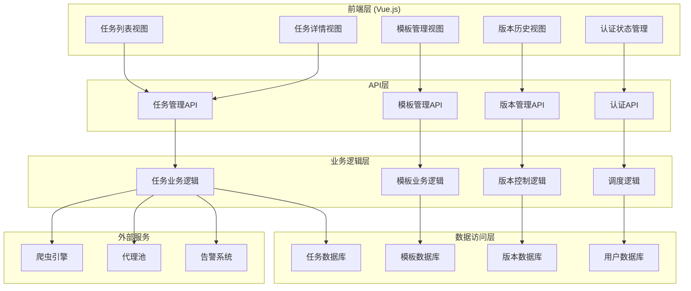
```mermaid
graph TB
subgraph "前端层 (Vue.js)"
FE1[任务列表视图]
FE2[任务详情视图]
FE3[模板管理视图]
FE4[版本历史视图]
FE5[认证状态管理]
end
subgraph "API层"
API1[任务管理API]
API2[模板管理API]
API3[版本管理API]
API4[认证API]
end
subgraph "业务逻辑层"
BL1[任务业务逻辑]
BL2[模板业务逻辑]
BL3[版本控制逻辑]
BL4[调度逻辑]
end
subgraph "数据访问层"
DA1[任务数据库]
DA2[模板数据库]
DA3[版本数据库]
DA4[用户数据库]
end
subgraph "外部服务"
ES1[爬虫引擎]
ES2[代理池]
ES3[告警系统]
end
FE1 --> API1
FE2 --> API1
FE3 --> API2
FE4 --> API3
FE5 --> API4
API1 --> BL1
API2 --> BL2
API3 --> BL3
API4 --> BL4
BL1 --> DA1
BL2 --> DA2
BL3 --> DA3
BL4 --> DA4
BL1 --> ES1
BL1 --> ES2
BL1 --> ES3
```

**图表来源**
- [app.py:473-797](file://python/app.py#L473-L797)
- [task_db.py:7-533](file://python/task_db.py#L7-L533)

## 核心组件

### 后端核心组件

#### 任务数据库管理器

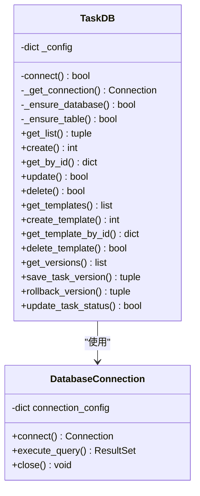
```mermaid
classDiagram
class TaskDB {
-dict _config
-connect() bool
-_get_connection() Connection
-_ensure_database() bool
-_ensure_table() bool
+get_list() tuple
+create() int
+get_by_id() dict
+update() bool
+delete() bool
+get_templates() list
+create_template() int
+get_template_by_id() dict
+delete_template() bool
+get_versions() list
+save_task_version() tuple
+rollback_version() tuple
+update_task_status() bool
}
class DatabaseConnection {
-dict connection_config
+connect() Connection
+execute_query() ResultSet
+close() void
}
TaskDB --> DatabaseConnection : "使用"
```

**图表来源**
- [task_db.py:7-533](file://python/task_db.py#L7-L533)

#### 任务管理API控制器

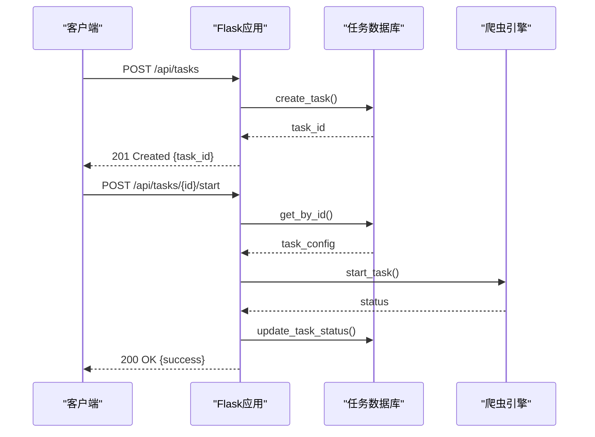
```mermaid
sequenceDiagram
participant Client as "客户端"
participant API as "Flask应用"
participant TaskDB as "任务数据库"
participant Engine as "爬虫引擎"
Client->>API : POST /api/tasks
API->>TaskDB : create_task()
TaskDB-->>API : task_id
API-->>Client : 201 Created {task_id}
Client->>API : POST /api/tasks/{id}/start
API->>TaskDB : get_by_id()
TaskDB-->>API : task_config
API->>Engine : start_task()
Engine-->>API : status
API->>TaskDB : update_task_status()
API-->>Client : 200 OK {success}
```

**图表来源**
- [app.py:513-642](file://python/app.py#L513-L642)
- [task_db.py:172-210](file://python/task_db.py#L172-L210)

**章节来源**
- [app.py:473-797](file://python/app.py#L473-L797)
- [task_db.py:7-533](file://python/task_db.py#L7-L533)

## 任务生命周期管理

### 任务创建流程

任务创建是整个系统的核心功能，涉及多个步骤和验证过程：

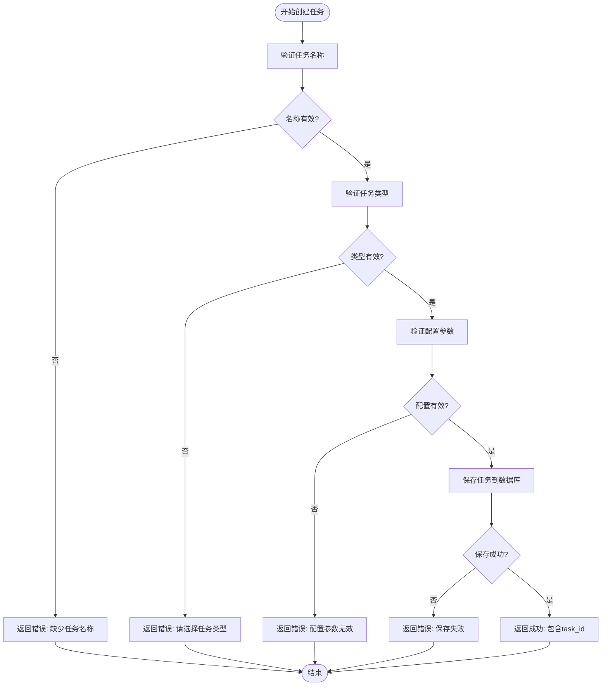
```mermaid
flowchart TD
Start([开始创建任务]) --> ValidateName["验证任务名称"]
ValidateName --> NameValid{"名称有效?"}
NameValid --> |否| ReturnError["返回错误: 缺少任务名称"]
NameValid --> |是| ValidateType["验证任务类型"]
ValidateType --> TypeValid{"类型有效?"}
TypeValid --> |否| ReturnError2["返回错误: 请选择任务类型"]
TypeValid --> |是| ValidateConfig["验证配置参数"]
ValidateConfig --> ConfigValid{"配置有效?"}
ConfigValid --> |否| ReturnError3["返回错误: 配置参数无效"]
ConfigValid --> |是| SaveTask["保存任务到数据库"]
SaveTask --> SaveSuccess{"保存成功?"}
SaveSuccess --> |否| ReturnError4["返回错误: 保存失败"]
SaveSuccess --> |是| ReturnSuccess["返回成功: 包含task_id"]
ReturnError --> End([结束])
ReturnError2 --> End
ReturnError3 --> End
ReturnError4 --> End
ReturnSuccess --> End
```

**图表来源**
- [app.py:515-550](file://python/app.py#L515-L550)
- [task_db.py:172-210](file://python/task_db.py#L172-L210)

### 任务启动流程

任务启动涉及状态检查、配置验证和引擎交互：

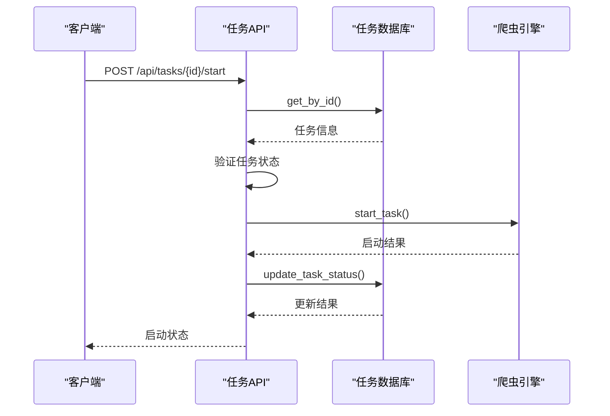
```mermaid
sequenceDiagram
participant Client as "客户端"
participant API as "任务API"
participant DB as "任务数据库"
participant Engine as "爬虫引擎"
Client->>API : POST /api/tasks/{id}/start
API->>DB : get_by_id()
DB-->>API : 任务信息
API->>API : 验证任务状态
API->>Engine : start_task()
Engine-->>API : 启动结果
API->>DB : update_task_status()
DB-->>API : 更新结果
API-->>Client : 启动状态
```

**图表来源**
- [app.py:625-642](file://python/app.py#L625-L642)
- [task_db.py:515-530](file://python/task_db.py#L515-L530)

### 任务停止流程

任务停止需要确保安全关闭，避免数据丢失：

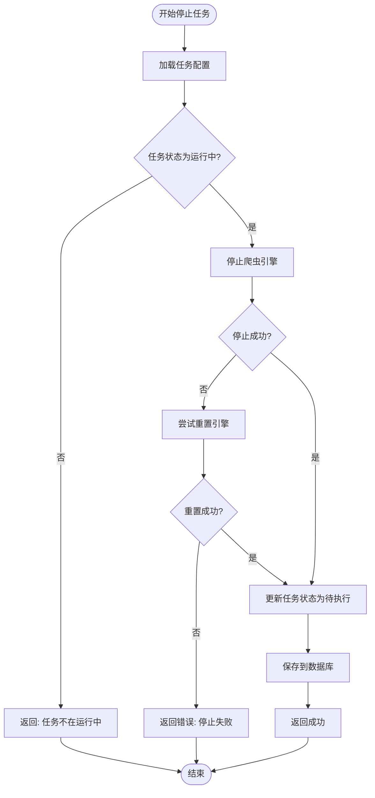
```mermaid
flowchart TD
StartStop([开始停止任务]) --> LoadTask["加载任务配置"]
LoadTask --> CheckRunning{"任务状态为运行中?"}
CheckRunning --> |否| ReturnNotRunning["返回: 任务不在运行中"]
CheckRunning --> |是| StopEngine["停止爬虫引擎"]
StopEngine --> StopSuccess{"停止成功?"}
StopSuccess --> |否| TryReset["尝试重置引擎"]
StopSuccess --> |是| UpdateStatus["更新任务状态为待执行"]
TryReset --> ResetSuccess{"重置成功?"}
ResetSuccess --> |否| ReturnError["返回错误: 停止失败"]
ResetSuccess --> |是| UpdateStatus
UpdateStatus --> SaveToDB["保存到数据库"]
SaveToDB --> ReturnSuccess["返回成功"]
ReturnNotRunning --> End([结束])
ReturnError --> End
ReturnSuccess --> End
```

**图表来源**
- [app.py:645-662](file://python/app.py#L645-L662)
- [task_db.py:515-530](file://python/task_db.py#L515-L530)

**章节来源**
- [app.py:513-662](file://python/app.py#L513-L662)
- [task_db.py:172-283](file://python/task_db.py#L172-L283)

## 任务模板管理

### 模板创建流程

模板管理允许用户创建可复用的任务配置，提高工作效率：

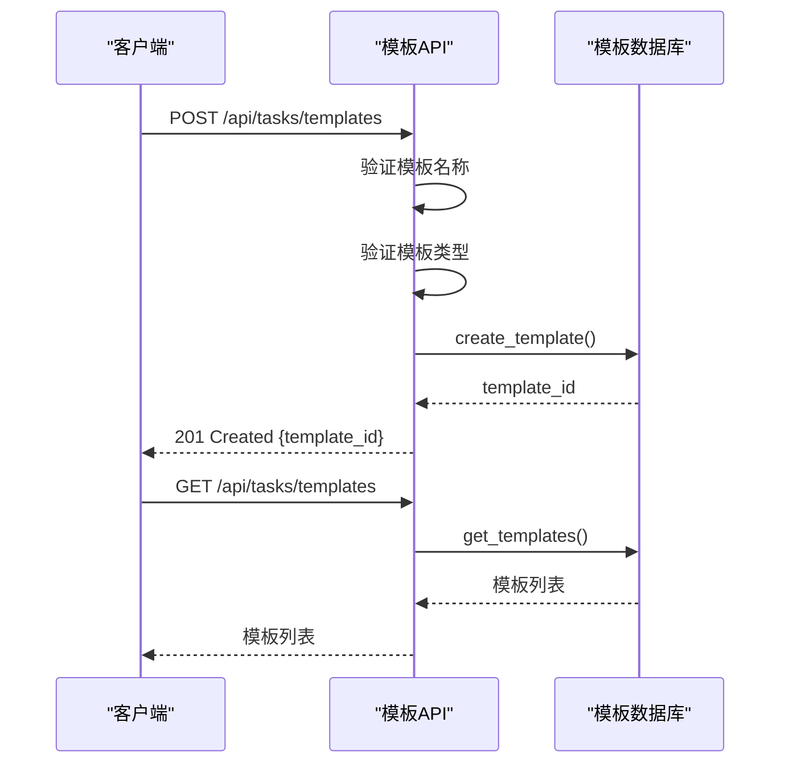
```mermaid
sequenceDiagram
participant Client as "客户端"
participant API as "模板API"
participant DB as "模板数据库"
Client->>API : POST /api/tasks/templates
API->>API : 验证模板名称
API->>API : 验证模板类型
API->>DB : create_template()
DB-->>API : template_id
API-->>Client : 201 Created {template_id}
Client->>API : GET /api/tasks/templates
API->>DB : get_templates()
DB-->>API : 模板列表
API-->>Client : 模板列表
```

**图表来源**
- [app.py:679-748](file://python/app.py#L679-L748)
- [task_db.py:305-345](file://python/task_db.py#L305-L345)

### 模板使用流程

模板使用支持一键创建基于模板的新任务：

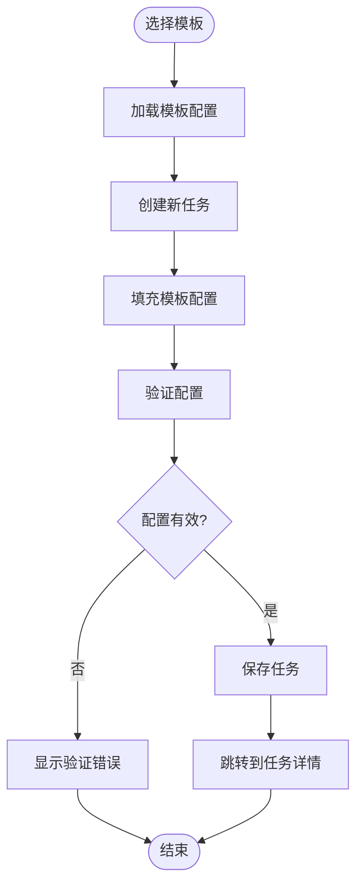
```mermaid
flowchart TD
Start([选择模板]) --> LoadTemplate["加载模板配置"]
LoadTemplate --> CreateTask["创建新任务"]
CreateTask --> FillConfig["填充模板配置"]
FillConfig --> ValidateConfig["验证配置"]
ValidateConfig --> ConfigValid{"配置有效?"}
ConfigValid --> |否| ShowErrors["显示验证错误"]
ConfigValid --> |是| SaveTask["保存任务"]
SaveTask --> NavigateDetail["跳转到任务详情"]
ShowErrors --> End([结束])
NavigateDetail --> End
```

**图表来源**
- [TaskTemplates.vue:159-170](file://python-web/src/views/TaskTemplates.vue#L159-L170)
- [TaskDetail.vue:208-247](file://python-web/src/views/TaskDetail.vue#L208-L247)

**章节来源**
- [app.py:665-748](file://python/app.py#L665-L748)
- [task_db.py:284-365](file://python/task_db.py#L284-L365)
- [TaskTemplates.vue:159-187](file://python-web/src/views/TaskTemplates.vue#L159-L187)

## 版本控制与回滚

### 版本管理架构

系统实现了完整的版本控制系统，支持任务配置的历史记录和安全回滚：

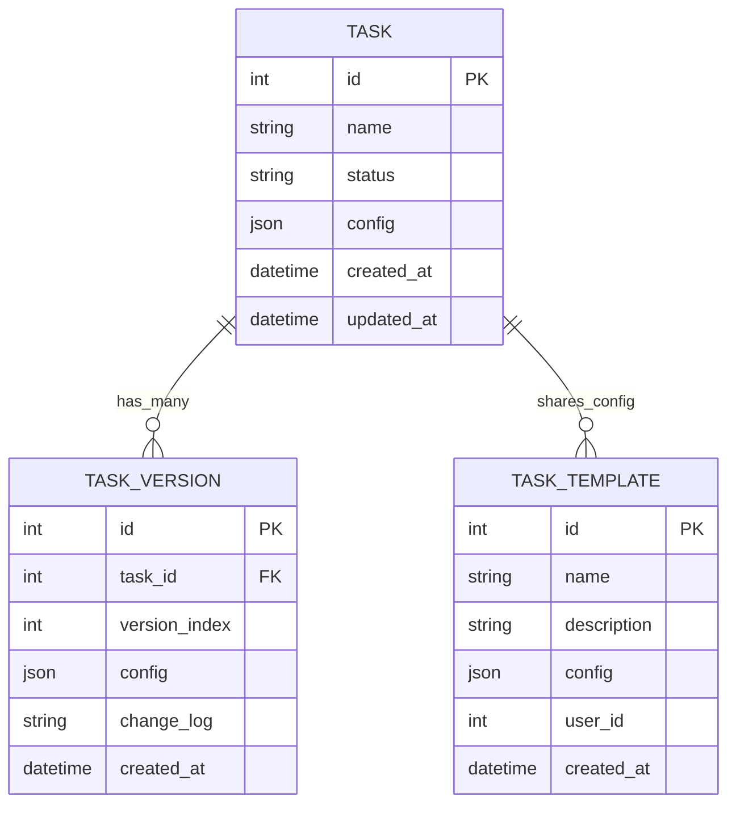
```mermaid
erDiagram
TASK {
int id PK
string name
string status
json config
datetime created_at
datetime updated_at
}
TASK_TEMPLATE {
int id PK
string name
string description
json config
int user_id
datetime created_at
}
TASK_VERSION {
int id PK
int task_id FK
int version_index
json config
string change_log
datetime created_at
}
TASK ||--o{ TASK_VERSION : has_many
TASK ||--o{ TASK_TEMPLATE : shares_config
```

**图表来源**
- [task_db.py:51-99](file://python/task_db.py#L51-L99)

### 版本保存流程

每次任务配置修改都会自动保存为新的版本：

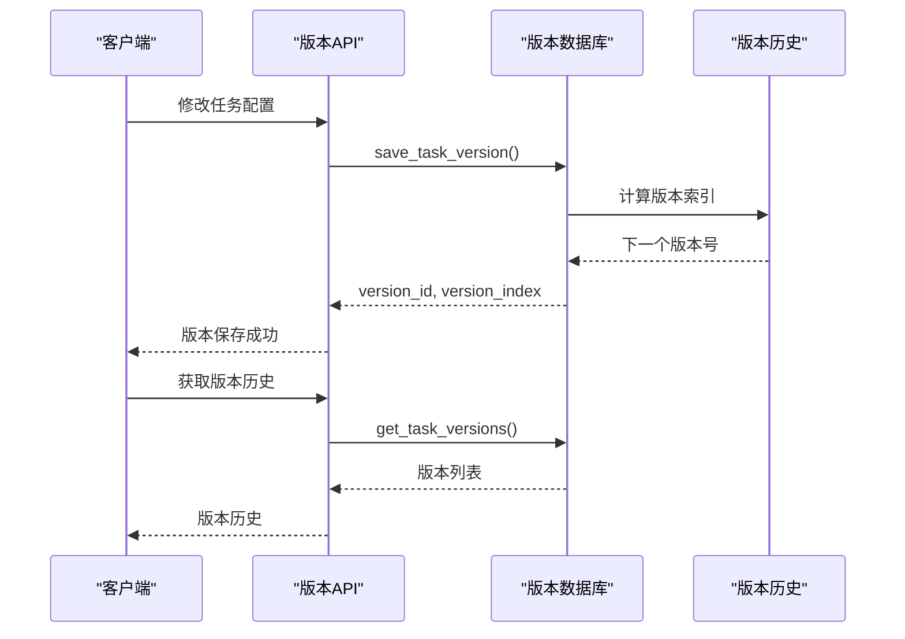
```mermaid
sequenceDiagram
participant Client as "客户端"
participant API as "版本API"
participant DB as "版本数据库"
participant History as "版本历史"
Client->>API : 修改任务配置
API->>DB : save_task_version()
DB->>History : 计算版本索引
History-->>DB : 下一个版本号
DB-->>API : version_id, version_index
API-->>Client : 版本保存成功
Client->>API : 获取版本历史
API->>DB : get_task_versions()
DB-->>API : 版本列表
API-->>Client : 版本历史
```

**图表来源**
- [app.py:751-768](file://python/app.py#L751-L768)
- [task_db.py:367-418](file://python/task_db.py#L367-L418)

### 版本回滚机制

版本回滚是一个安全的操作，会创建新的版本记录：

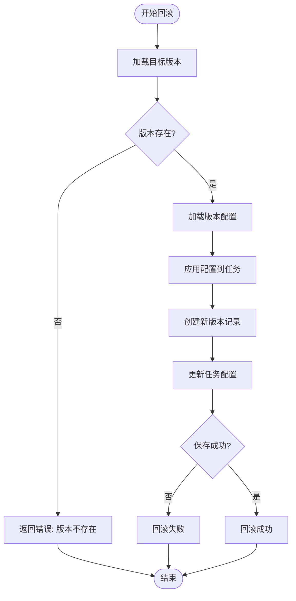
```mermaid
flowchart TD
Start([开始回滚]) --> LoadVersion["加载目标版本"]
LoadVersion --> VerifyVersion{"版本存在?"}
VerifyVersion --> |否| ReturnError["返回错误: 版本不存在"]
VerifyVersion --> |是| LoadConfig["加载版本配置"]
LoadConfig --> ApplyConfig["应用配置到任务"]
ApplyConfig --> CreateNewVersion["创建新版本记录"]
CreateNewVersion --> UpdateTask["更新任务配置"]
UpdateTask --> SaveSuccess{"保存成功?"}
SaveSuccess --> |否| RollbackFailed["回滚失败"]
SaveSuccess --> |是| ReturnSuccess["回滚成功"]
ReturnError --> End([结束])
RollbackFailed --> End
ReturnSuccess --> End
```

**图表来源**
- [app.py:771-796](file://python/app.py#L771-L796)
- [task_db.py:420-444](file://python/task_db.py#L420-L444)

**章节来源**
- [app.py:751-796](file://python/app.py#L751-L796)
- [task_db.py:367-444](file://python/task_db.py#L367-L444)
- [TaskVersions.vue:191-203](file://python-web/src/views/TaskVersions.vue#L191-L203)

## 调度配置

### Cron表达式支持

系统支持基于Cron表达式的定时任务调度：

| Cron字段 | 允许值 | 描述 |
|---------|--------|------|
| 秒 | 0-59 | 可选，默认为0 |
| 分钟 | 0-59 | 必填 |
| 小时 | 0-23 | 必填 |
| 日期 | 1-31 | 必填 |
| 月份 | 1-12 | 必填 |
| 星期 | 0-7 | 0和7都表示星期日 |

### 调度配置示例

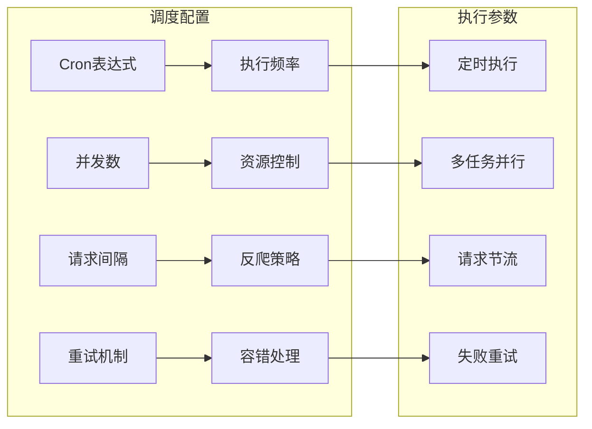
```mermaid
graph LR
subgraph "调度配置"
A[Cron表达式] --> B[执行频率]
C[并发数] --> D[资源控制]
E[请求间隔] --> F[反爬策略]
G[重试机制] --> H[容错处理]
end
subgraph "执行参数"
B --> I[定时执行]
D --> J[多任务并行]
F --> K[请求节流]
H --> L[失败重试]
end
```

**图表来源**
- [TaskDetail.vue:58-75](file://python-web/src/views/TaskDetail.vue#L58-L75)
- [TaskTemplates.vue:114-126](file://python-web/src/views/TaskTemplates.vue#L114-L126)

**章节来源**
- [TaskDetail.vue:58-81](file://python-web/src/views/TaskDetail.vue#L58-L81)
- [TaskTemplates.vue:114-133](file://python-web/src/views/TaskTemplates.vue#L114-L133)

## 执行状态监控

### 实时状态监控

系统提供实时的任务执行状态监控：

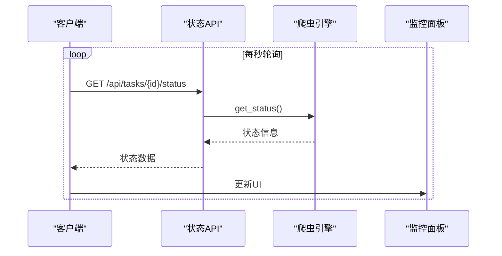
```mermaid
sequenceDiagram
participant Client as "客户端"
participant API as "状态API"
participant Engine as "爬虫引擎"
participant Monitor as "监控面板"
loop 每秒轮询
Client->>API : GET /api/tasks/{id}/status
API->>Engine : get_status()
Engine-->>API : 状态信息
API-->>Client : 状态数据
Client->>Monitor : 更新UI
end
```

**图表来源**
- [app.py:665-662](file://python/app.py#L665-L662)

### 日志系统

系统内置了完整的日志系统，支持实时日志查看和过滤：

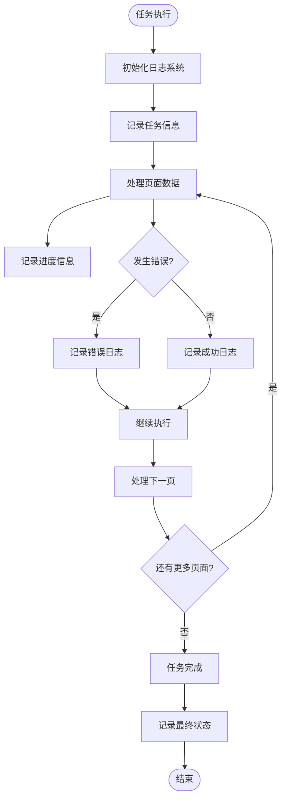
```mermaid
flowchart TD
Start([任务执行]) --> InitLog["初始化日志系统"]
InitLog --> LogInfo["记录任务信息"]
LogInfo --> ProcessPage["处理页面数据"]
ProcessPage --> LogProgress["记录进度信息"]
ProcessPage --> CheckError{"发生错误?"}
CheckError --> |是| LogError["记录错误日志"]
CheckError --> |否| LogSuccess["记录成功日志"]
LogError --> Continue["继续执行"]
LogSuccess --> Continue
Continue --> NextPage["处理下一页"]
NextPage --> MorePages{"还有更多页面?"}
MorePages --> |是| ProcessPage
MorePages --> |否| Complete["任务完成"]
Complete --> FinalLog["记录最终状态"]
FinalLog --> End([结束])
```

**图表来源**
- [TaskDetail.vue:273-294](file://python-web/src/views/TaskDetail.vue#L273-L294)

**章节来源**
- [TaskDetail.vue:112-169](file://python-web/src/views/TaskDetail.vue#L112-L169)
- [TaskDetail.vue:273-314](file://python-web/src/views/TaskDetail.vue#L273-L314)

## 依赖关系管理

### 任务依赖模型

系统支持任务间的依赖关系管理，确保任务按照正确的顺序执行：

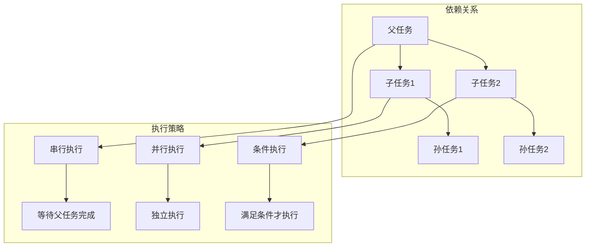
```mermaid
graph TB
subgraph "依赖关系"
A[父任务] --> B[子任务1]
A --> C[子任务2]
B --> D[孙任务1]
C --> E[孙任务2]
end
subgraph "执行策略"
F[串行执行] --> G[等待父任务完成]
H[并行执行] --> I[独立执行]
J[条件执行] --> K[满足条件才执行]
end
A --> F
B --> H
C --> J
```

### 依赖验证流程

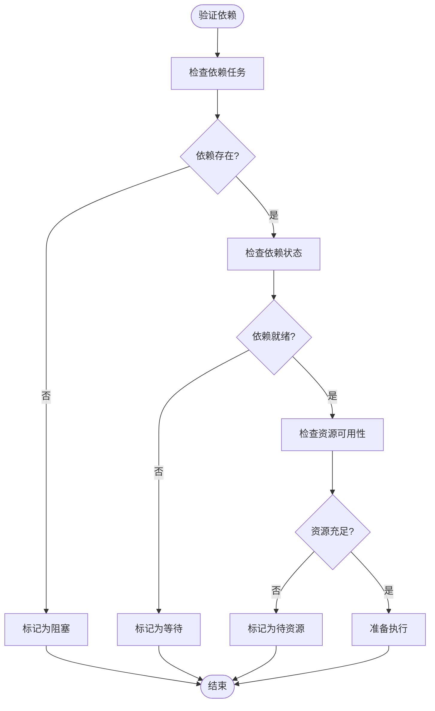
```mermaid
flowchart TD
Start([验证依赖]) --> CheckDeps["检查依赖任务"]
CheckDeps --> DepsExist{"依赖存在?"}
DepsExist --> |否| MarkBlocked["标记为阻塞"]
DepsExist --> |是| CheckStatus["检查依赖状态"]
CheckStatus --> StatusReady{"依赖就绪?"}
StatusReady --> |否| MarkWaiting["标记为等待"]
StatusReady --> |是| CheckResources["检查资源可用性"]
CheckResources --> ResourcesOK{"资源充足?"}
ResourcesOK --> |否| MarkPending["标记为待资源"]
ResourcesOK --> |是| ReadyToExecute["准备执行"]
MarkBlocked --> End([结束])
MarkWaiting --> End
MarkPending --> End
ReadyToExecute --> End
```

## 最佳实践

### 任务设计最佳实践

1. **合理的任务粒度**
   - 每个任务应该专注于单一职责
   - 避免创建过于复杂或过简单的任务

2. **配置参数优化**
   - 设置合适的并发数（建议1-10）
   - 合理的请求间隔（建议1-10秒）
   - 适当的重试次数（建议1-3次）

3. **监控和告警**
   - 为重要任务设置监控告警
   - 定期检查任务执行状态
   - 建立日志分析机制

### 性能优化建议

1. **数据库优化**
   - 为常用查询字段建立索引
   - 定期清理历史数据
   - 使用连接池管理数据库连接

2. **缓存策略**
   - 缓存频繁访问的配置数据
   - 使用Redis缓存热点数据
   - 合理设置缓存过期时间

3. **异步处理**
   - 使用Celery进行长时间任务处理
   - 异步发送通知和邮件
   - 非关键任务异步执行

### 安全考虑

1. **输入验证**
   - 对所有用户输入进行严格验证
   - 防止SQL注入和XSS攻击
   - 限制文件上传大小和类型

2. **权限控制**
   - 实施细粒度的权限控制
   - 定期审计用户操作日志
   - 最小权限原则

## 错误处理

### 错误分类

系统将错误分为以下几类：

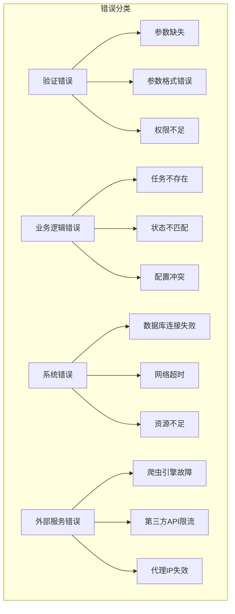
```mermaid
graph TD
subgraph "错误分类"
A[验证错误] --> A1[参数缺失]
A --> A2[参数格式错误]
A --> A3[权限不足]
B[业务逻辑错误] --> B1[任务不存在]
B --> B2[状态不匹配]
B --> B3[配置冲突]
C[系统错误] --> C1[数据库连接失败]
C --> C2[网络超时]
C --> C3[资源不足]
D[外部服务错误] --> D1[爬虫引擎故障]
D --> D2[第三方API限流]
D --> D3[代理IP失效]
end
```

### 错误处理策略

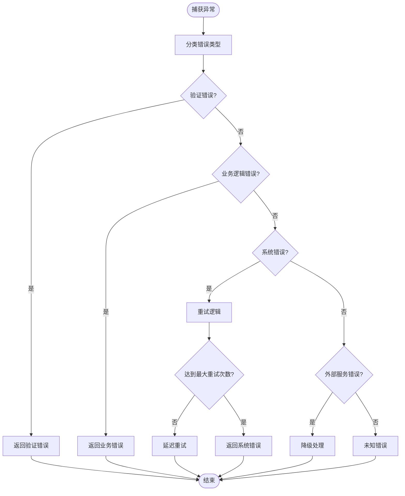
```mermaid
flowchart TD
Start([捕获异常]) --> Classify["分类错误类型"]
Classify --> Validation{"验证错误?"}
Validation --> |是| ReturnValidation["返回验证错误"]
Validation --> |否| Business{"业务逻辑错误?"}
Business --> |是| ReturnBusiness["返回业务错误"]
Business --> |否| System{"系统错误?"}
System --> |是| RetryLogic["重试逻辑"]
System --> |否| External{"外部服务错误?"}
External --> |是| Fallback["降级处理"]
External --> |否| Unknown["未知错误"]
RetryLogic --> CheckRetry{"达到最大重试次数?"}
CheckRetry --> |否| Delay["延迟重试"]
CheckRetry --> |是| ReturnSystem["返回系统错误"]
Delay --> End([结束])
Fallback --> End
Unknown --> End
ReturnValidation --> End
ReturnBusiness --> End
ReturnSystem --> End
```

**章节来源**
- [app.py:515-550](file://python/app.py#L515-L550)
- [task_db.py:165-167](file://python/task_db.py#L165-L167)

## 性能优化

### 数据库性能优化

1. **查询优化**
   ```sql
   -- 为常用查询字段建立索引
   CREATE INDEX idx_task_status ON crawler_tasks(status);
   CREATE INDEX idx_task_user_id ON crawler_tasks(user_id);
   CREATE INDEX idx_task_created_at ON crawler_tasks(created_at);
   ```

2. **连接池配置**
   - 使用连接池减少连接开销
   - 合理设置连接池大小
   - 实现连接健康检查

### 前端性能优化

1. **懒加载**
   - 路由级别的代码分割
   - 组件级别的动态导入
   - 图片和资源的延迟加载

2. **缓存策略**
   - HTTP缓存头配置
   - 浏览器缓存策略
   - 应用内缓存管理

### 系统监控

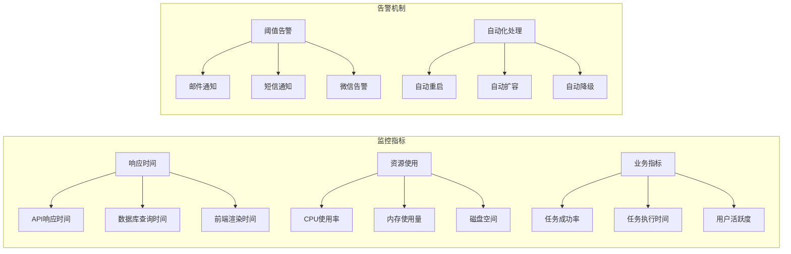
```mermaid
graph LR
subgraph "监控指标"
A[响应时间] --> A1[API响应时间]
A --> A2[数据库查询时间]
A --> A3[前端渲染时间]
B[资源使用] --> B1[CPU使用率]
B --> B2[内存使用量]
B --> B3[磁盘空间]
C[业务指标] --> C1[任务成功率]
C --> C2[任务执行时间]
C --> C3[用户活跃度]
end
subgraph "告警机制"
D[阈值告警] --> E[邮件通知]
D --> F[短信通知]
D --> G[微信告警]
H[自动化处理] --> I[自动重启]
H --> J[自动扩容]
H --> K[自动降级]
end
```

## 故障排除指南

### 常见问题诊断

1. **任务无法启动**
   - 检查任务配置是否正确
   - 验证目标URL可达性
   - 查看爬虫引擎状态

2. **任务执行失败**
   - 检查网络连接状态
   - 验证代理IP有效性
   - 查看错误日志详情

3. **版本回滚失败**
   - 确认目标版本存在
   - 检查数据库连接
   - 验证配置格式

### 调试工具

1. **API调试**
   - 使用Postman测试API接口
   - 启用详细日志记录
   - 检查HTTP状态码

2. **数据库调试**
   - 使用MySQL Workbench
   - 执行EXPLAIN分析查询
   - 监控慢查询日志

3. **前端调试**
   - 使用浏览器开发者工具
   - 检查网络请求
   - 监控JavaScript错误

### 性能分析

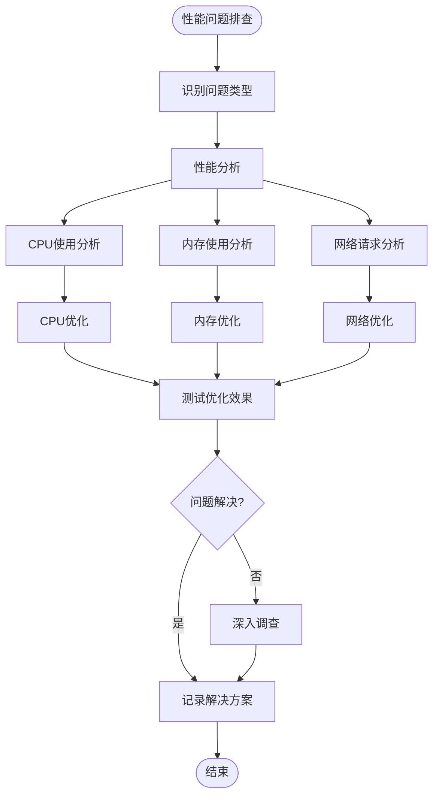
```mermaid
flowchart TD
Start([性能问题排查]) --> Identify["识别问题类型"]
Identify --> Profile["性能分析"]
Profile --> CPUProfile["CPU使用分析"]
Profile --> MemoryProfile["内存使用分析"]
Profile --> NetworkProfile["网络请求分析"]
CPUProfile --> OptimizeCPU["CPU优化"]
MemoryProfile --> OptimizeMemory["内存优化"]
NetworkProfile --> OptimizeNetwork["网络优化"]
OptimizeCPU --> Test["测试优化效果"]
OptimizeMemory --> Test
OptimizeNetwork --> Test
Test --> Verify{"问题解决?"}
Verify --> |是| Document["记录解决方案"]
Verify --> |否| Investigate["深入调查"]
Investigate --> Document
Document --> End([结束])
```

## 总结

任务管理API系统提供了完整的爬虫任务生命周期管理功能，包括：

### 核心优势

1. **完整的生命周期管理**：从创建到删除的全流程支持
2. **灵活的模板系统**：提高任务创建效率
3. **强大的版本控制**：确保配置变更的可追溯性和安全性
4. **实时监控能力**：提供任务执行状态的实时监控
5. **安全可靠的架构**：采用多层防护和错误处理机制

### 技术特点

- **前后端分离**：采用现代Web技术栈
- **模块化设计**：清晰的组件划分和职责分离
- **可扩展性**：支持功能扩展和性能优化
- **易维护性**：良好的代码结构和文档

### 发展方向

1. **微服务化**：将功能模块拆分为独立的服务
2. **容器化部署**：使用Docker和Kubernetes进行部署
3. **云原生支持**：集成云服务和弹性伸缩
4. **AI辅助**：引入机器学习优化任务调度

该系统为企业级爬虫任务管理提供了坚实的技术基础，能够满足各种复杂的业务需求。