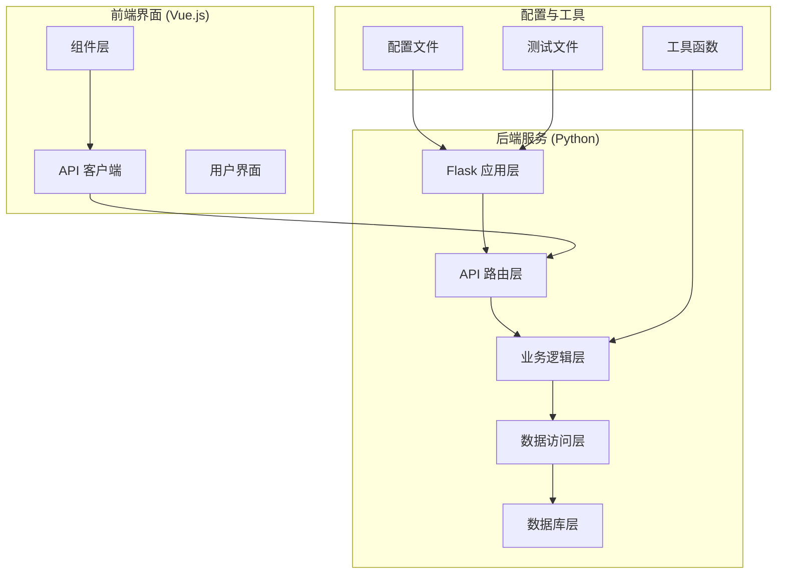
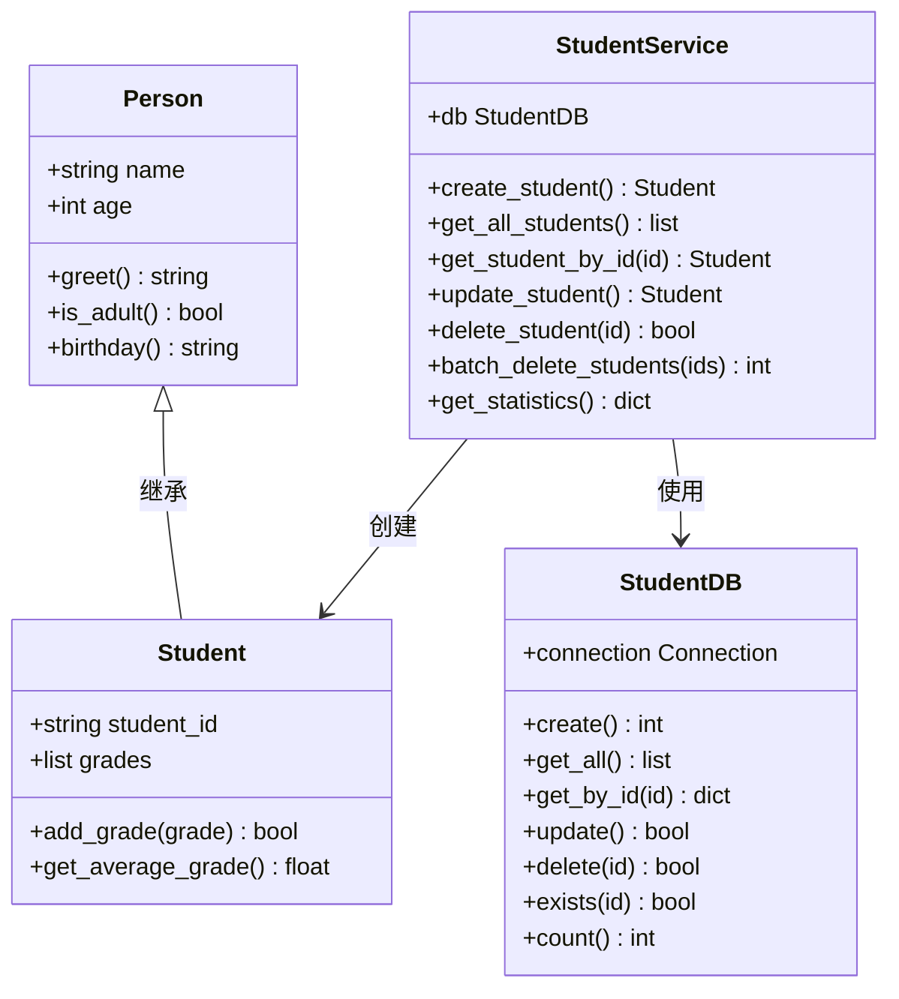
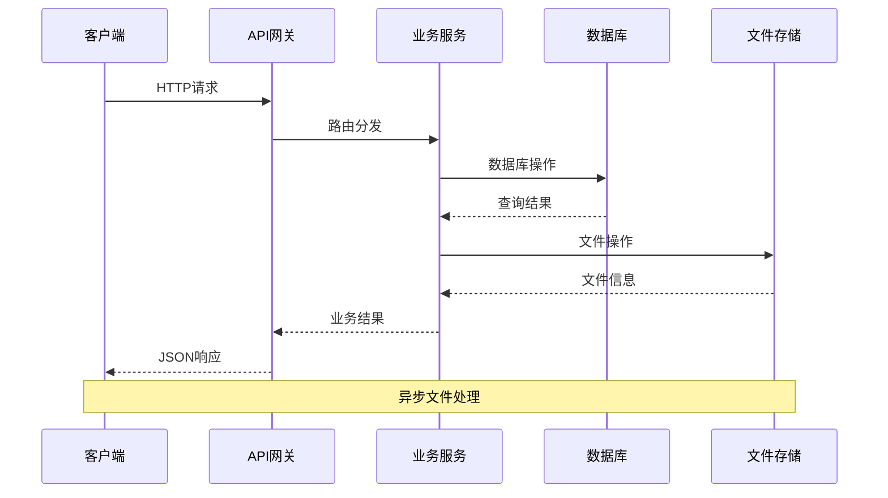
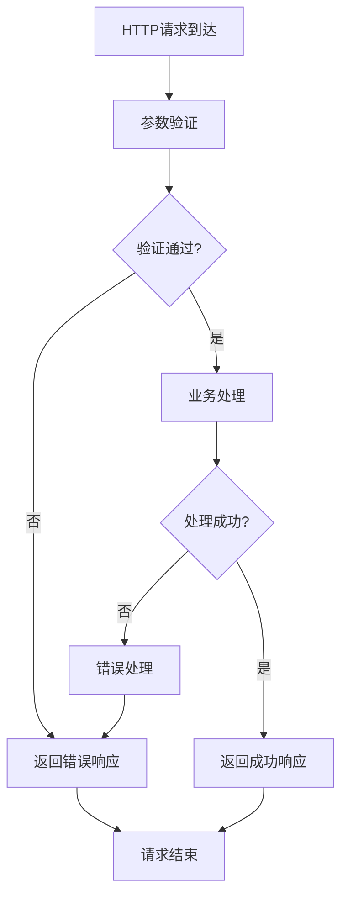
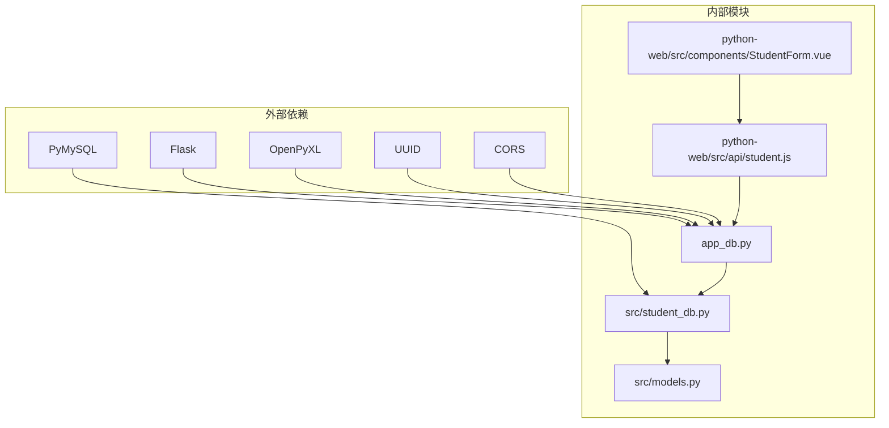
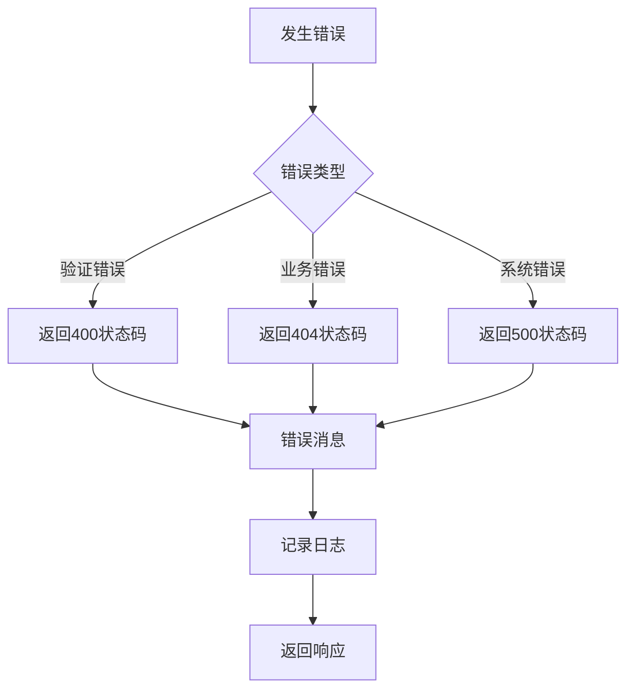

# 学生数据API

<cite>
**本文档引用的文件**
- [app_db.py](file://python/app_db.py)
- [student_db.py](file://python/src/student_db.py)
- [models.py](file://python/src/models.py)
- [student.js](file://python-web/src/api/student.js)
- [StudentForm.vue](file://python-web/src/components/StudentForm.vue)
- [test_models.py](file://python/tests/test_models.py)
- [test_utils.py](file://python/tests/test_utils.py)
</cite>

## 目录
1. [简介](#简介)
2. [项目结构](#项目结构)
3. [核心组件](#核心组件)
4. [架构概览](#架构概览)
5. [详细组件分析](#详细组件分析)
6. [依赖关系分析](#依赖关系分析)
7. [性能考虑](#性能考虑)
8. [故障排除指南](#故障排除指南)
9. [结论](#结论)

## 简介

学生数据API是一个基于Flask的RESTful Web服务，专门用于管理学生信息数据。该系统提供了完整的CRUD操作、批量导入导出、数据验证和统计分析功能。系统采用前后端分离架构，后端使用Python Flask提供API服务，前端使用Vue.js构建用户界面。

该API支持以下核心功能：
- 学生信息的增删改查操作
- 批量数据导入导出
- 实时数据验证和约束检查
- 统计数据分析
- 头像文件上传和管理
- 前端交互式表单组件

## 项目结构

项目采用模块化设计，主要分为以下几个部分：

**图表来源**
- [app_db.py:1-726](file://python/app_db.py#L1-L726)
- [student_db.py:1-259](file://python/src/student_db.py#L1-L259)

### 后端架构层次

**应用层 (App Layer)**
- Flask应用实例和CORS配置
- 全局中间件和请求处理
- 错误处理和响应格式化

**API路由层 (API Routing Layer)**
- 学生管理相关路由
- 用户认证路由
- 文件上传路由
- 健康检查路由

**业务逻辑层 (Business Logic Layer)**
- 学生服务类封装业务逻辑
- 数据验证和转换
- 统计计算和分析

**数据访问层 (Data Access Layer)**
- MySQL数据库连接管理
- CRUD操作实现
- 数据库查询和事务处理

**前端架构层次**

**组件层 (Component Layer)**
- 可复用的Vue组件
- 表单验证和用户交互
- 状态管理和生命周期

**API客户端层 (API Client Layer)**
- HTTP请求封装
- 错误处理和重试机制
- 响应数据转换

**图表来源**
- [student.js:1-102](file://python-web/src/api/student.js#L1-L102)
- [StudentForm.vue:1-201](file://python-web/src/components/StudentForm.vue#L1-L201)

**章节来源**
- [app_db.py:36-44](file://python/app_db.py#L36-L44)
- [student_db.py:5-16](file://python/src/student_db.py#L5-L16)

## 核心组件

### 数据模型设计

系统采用面向对象的设计模式，定义了清晰的数据模型结构：

**图表来源**
- [models.py:1-59](file://python/src/models.py#L1-L59)
- [student_db.py:140-259](file://python/src/student_db.py#L140-L259)

### 数据库架构

系统使用MySQL作为数据存储，定义了标准化的学生数据表结构：

| 字段名 | 数据类型 | 约束条件 | 描述 |
|--------|----------|----------|------|
| id | INT | PRIMARY KEY, AUTO_INCREMENT | 主键标识符 |
| name | VARCHAR(100) | NOT NULL | 学生姓名 |
| age | INT | NOT NULL | 学生年龄 (1-150) |
| grade | DOUBLE | NOT NULL | 成绩 (0-100) |
| avatar_url | VARCHAR(500) | NULL | 头像图片URL |
| create_time | DATETIME | NULL | 记录创建时间 |
| update_time | DATETIME | NULL | 记录更新时间 |

**章节来源**
- [student_db.py:17-30](file://python/src/student_db.py#L17-L30)
- [student_db.py:140-157](file://python/src/student_db.py#L140-L157)

## 架构概览

系统采用分层架构设计，确保关注点分离和代码可维护性：

**图表来源**
- [app_db.py:338-461](file://python/app_db.py#L338-L461)
- [student_db.py:160-259](file://python/src/student_db.py#L160-L259)

### 请求处理流程

系统采用统一的请求处理模式，确保一致的错误处理和响应格式：

**图表来源**
- [app_db.py:376-432](file://python/app_db.py#L376-L432)
- [student_db.py:164-228](file://python/src/student_db.py#L164-L228)

## 详细组件分析

### 学生管理API

#### CRUD操作接口

系统提供了完整的CRUD操作接口，支持RESTful设计原则：

**获取所有学生**
- 方法: GET `/students`
- 功能: 分页获取所有学生信息
- 参数: 无
- 响应: 学生列表数组

**获取特定学生**
- 方法: GET `/students/{id}`
- 功能: 根据ID获取单个学生信息
- 参数: student_id (路径参数)
- 响应: 学生对象

**创建学生**
- 方法: POST `/students`
- 功能: 创建新的学生记录
- 请求体: 包含姓名、年龄、成绩等字段
- 响应: 新创建的学生对象

**更新学生**
- 方法: PUT `/students/{id}`
- 功能: 更新现有学生信息
- 参数: student_id (路径参数)
- 请求体: 可选的姓名、年龄、成绩等字段
- 响应: 更新后的学生对象

**删除学生**
- 方法: DELETE `/students/{id}`
- 功能: 删除指定学生记录
- 参数: student_id (路径参数)
- 响应: 删除确认信息

**批量删除**
- 方法: DELETE `/students/batch`
- 功能: 批量删除多个学生
- 请求体: 包含ID数组
- 响应: 删除统计信息

**章节来源**
- [app_db.py:338-461](file://python/app_db.py#L338-L461)

#### 搜索和过滤功能

系统支持基于姓名的模糊搜索功能：

**搜索接口**
- 方法: GET `/students/search`
- 功能: 按姓名搜索学生
- 参数: name (查询参数)
- 响应: 匹配的学生列表

**章节来源**
- [app_db.py:365-373](file://python/app_db.py#L365-L373)
- [student_db.py:70-81](file://python/src/student_db.py#L70-L81)

#### 数据验证和约束

系统实现了多层次的数据验证机制：

**后端验证规则**
- 姓名: 必填，非空字符串
- 年龄: 1-150之间的整数
- 成绩: 0-100之间的数值
- 头像URL: 可选的URL格式

**前端验证规则**
- 实时表单验证
- 错误提示显示
- 提交前完整性检查

**章节来源**
- [student_db.py:164-173](file://python/src/student_db.py#L164-L173)
- [StudentForm.vue:163-185](file://python-web/src/components/StudentForm.vue#L163-L185)

### 批量导入导出功能

#### 导入功能

系统支持CSV文件批量导入学生数据：

**导入流程**
1. 文件上传到服务器
2. CSV文件解析
3. 数据验证和转换
4. 批量插入数据库
5. 返回导入统计结果

**导入格式要求**
- 文件类型: CSV
- 字段顺序: 姓名, 年龄, 成绩
- 编码格式: UTF-8-SIG

**章节来源**
- [app_db.py:539-607](file://python/app_db.py#L539-L607)

#### 导出功能

系统支持Excel格式的批量数据导出：

**导出特性**
- Excel格式 (.xlsx)
- 自动工作表命名
- 时间戳文件名
- 流式文件传输

**导出数据结构**
- ID, 姓名, 年龄, 成绩, 创建时间, 测试列

**章节来源**
- [app_db.py:508-536](file://python/app_db.py#L508-L536)

### 统计分析功能

系统提供了全面的统计数据分析：

**统计指标**
- 总学生数
- 平均年龄
- 平均成绩
- 最高成绩
- 最低成绩

**计算逻辑**
- 基于所有学生记录的聚合计算
- 精确的数值处理
- 边界值处理

**章节来源**
- [student_db.py:236-256](file://python/src/student_db.py#L236-L256)

### 文件上传管理

#### 头像上传

系统支持学生头像的上传和管理：

**上传流程**
1. 前端选择图片文件
2. 文件大小和类型验证
3. 服务器接收和保存
4. 返回文件URL给前端

**文件限制**
- 支持格式: PNG, JPG, JPEG, GIF
- 最大文件大小: 5MB
- 文件名生成: UUID加密

**章节来源**
- [StudentForm.vue:128-161](file://python-web/src/components/StudentForm.vue#L128-L161)
- [app_db.py:464-500](file://python/app_db.py#L464-L500)

## 依赖关系分析

系统采用模块化设计，各组件间依赖关系清晰：

**图表来源**
- [app_db.py:1-16](file://python/app_db.py#L1-L16)
- [student_db.py:1-5](file://python/src/student_db.py#L1-L5)

### 数据流依赖

系统中的数据流向体现了清晰的职责分离：

**读取流程**
API路由 → 业务服务 → 数据库访问 → 数据模型

**写入流程**
API路由 → 业务服务 → 数据验证 → 数据库访问 → 文件存储

**章节来源**
- [app_db.py:338-461](file://python/app_db.py#L338-L461)
- [student_db.py:160-259](file://python/src/student_db.py#L160-L259)

## 性能考虑

### 数据库优化

**索引策略**
- 主键索引: 自动创建
- 唯一约束: 姓名唯一性
- 查询优化: LIKE操作的性能考虑

**连接管理**
- 连接池配置
- 事务处理
- 超时设置

### 缓存策略

系统目前采用直接数据库访问模式，可根据需求添加缓存层：

**潜在缓存点**
- 频繁查询的统计数据
- 配置信息
- 用户会话数据

### 并发控制

**数据库层面**
- 事务隔离级别
- 死锁检测和处理
- 连接超时设置

**应用层面**
- 请求队列管理
- 资源竞争处理
- 错误恢复机制

## 故障排除指南

### 常见错误类型

**数据验证错误**
- 姓名为空或格式不正确
- 年龄超出有效范围
- 成绩不在标准范围内

**数据库操作错误**
- 连接失败
- 重复主键
- 外键约束冲突

**文件操作错误**
- 文件类型不支持
- 文件大小超限
- 磁盘空间不足

### 错误处理机制

系统采用统一的错误处理模式：

**图表来源**
- [app_db.py:389-432](file://python/app_db.py#L389-L432)

### 调试和监控

**日志记录**
- 请求和响应日志
- 错误堆栈跟踪
- 性能指标监控

**健康检查**
- 数据库连接状态
- 文件系统可用性
- 服务可用性检测

**章节来源**
- [app_db.py:610-627](file://python/app_db.py#L610-L627)

## 结论

学生数据API系统提供了一个完整、健壮且易于使用的数据管理解决方案。系统的主要优势包括：

**架构优势**
- 清晰的分层设计
- 模块化的组件结构
- 统一的错误处理机制

**功能特性**
- 完整的CRUD操作支持
- 批量数据处理能力
- 实时数据验证
- 统计分析功能

**扩展性**
- 易于添加新功能
- 支持多种数据格式
- 可扩展的文件存储系统

**改进方向**
- 添加分页查询功能
- 实现更复杂的数据过滤
- 增强并发控制机制
- 优化数据库查询性能

该系统为学生信息管理提供了一个坚实的技术基础，可以根据具体需求进行进一步的功能扩展和性能优化。