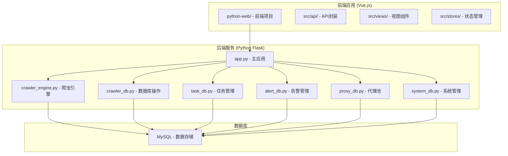
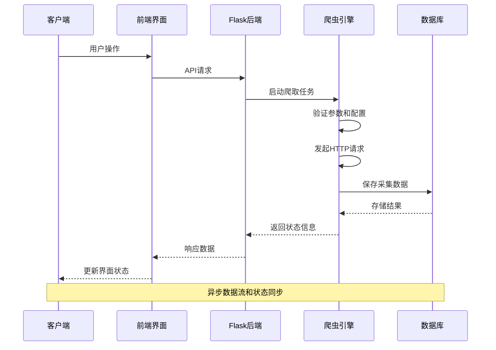
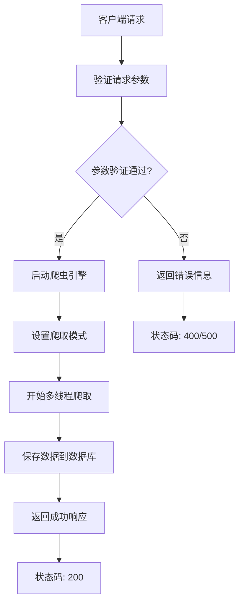
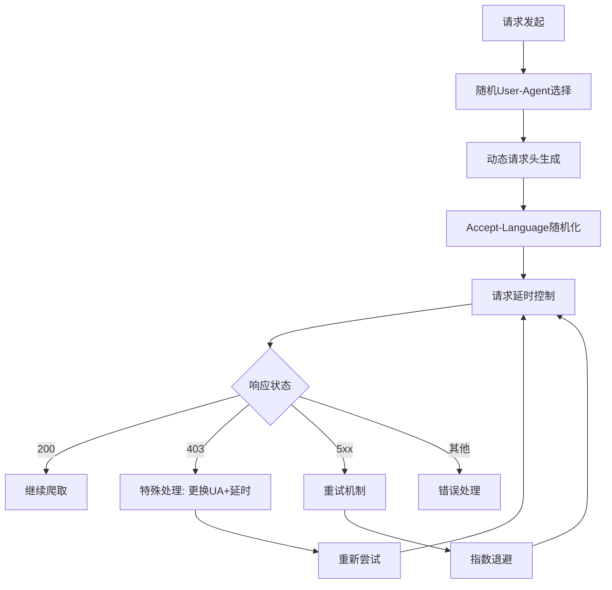
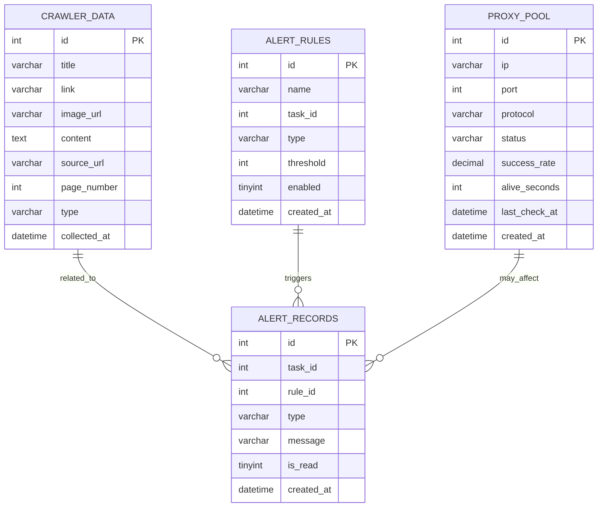
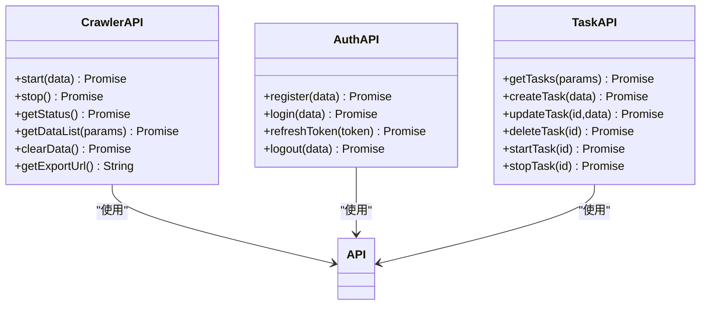
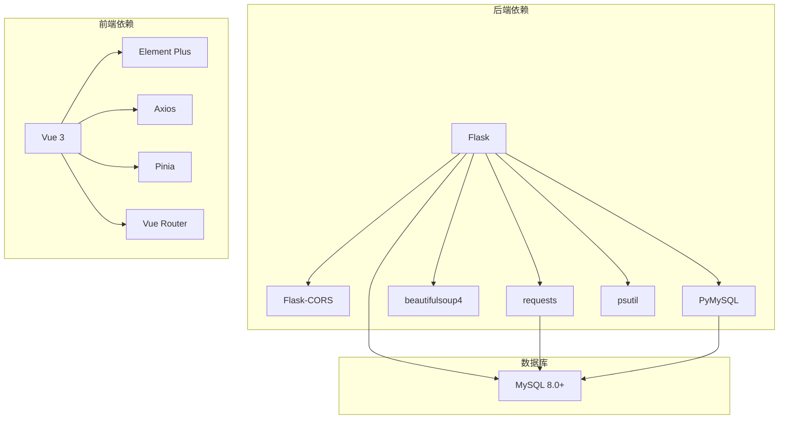

# 爬虫系统API

<cite>
**本文档引用的文件**
- [app.py](file://python/app.py)
- [crawler_engine.py](file://python/crawler_engine.py)
- [crawler_db.py](file://python/crawler_db.py)
- [task_db.py](file://python/task_db.py)
- [alert_db.py](file://python/alert_db.py)
- [proxy_db.py](file://python/proxy_db.py)
- [system_db.py](file://python/system_db.py)
- [crawler.js](file://python-web/src/api/crawler.js)
- [index.js](file://python-web/src/api/index.js)
- [Crawler.vue](file://python-web/src/views/Crawler.vue)
- [DataExport.vue](file://python-web/src/views/DataExport.vue)
- [SystemMonitor.vue](file://python-web/src/views/SystemMonitor.vue)
- [package.json](file://python-web/package.json)
</cite>

## 目录
1. [简介](#简介)
2. [项目结构](#项目结构)
3. [核心组件](#核心组件)
4. [架构概览](#架构概览)
5. [详细组件分析](#详细组件分析)
6. [依赖关系分析](#依赖关系分析)
7. [性能考虑](#性能考虑)
8. [故障排除指南](#故障排除指南)
9. [结论](#结论)

## 简介

这是一个基于Python Flask和Vue.js开发的爬虫管理系统，提供了完整的爬虫任务生命周期管理、数据采集、存储和导出功能。系统采用前后端分离架构，后端使用Flask提供RESTful API，前端使用Vue.js构建用户界面。

主要功能包括：
- 爬虫任务的启动、停止、状态查询
- 多种爬取模式（链接、图片、混合）
- 数据采集和存储
- 数据导出功能
- 代理池管理和反爬虫策略
- 系统监控和告警机制

## 项目结构

**图表来源**
- [app.py:1-50](file://python/app.py#L1-L50)
- [crawler_engine.py:1-50](file://python/crawler_engine.py#L1-L50)
- [crawler_db.py:1-50](file://python/crawler_db.py#L1-L50)

**章节来源**
- [app.py:1-100](file://python/app.py#L1-L100)
- [package.json:1-24](file://python-web/package.json#L1-L24)

## 核心组件

### 爬虫引擎 (CrawlerEngine)

爬虫引擎是系统的核心组件，负责实际的数据采集工作。它支持多线程爬取、多种爬取模式和反爬虫策略。

**主要特性：**
- 多线程异步爬取机制
- 三种爬取模式：链接模式、图片模式、混合模式
- 反爬虫策略：随机User-Agent、请求头伪装、延时控制
- 错误处理和恢复机制

**章节来源**
- [crawler_engine.py:10-533](file://python/crawler_engine.py#L10-L533)

### 数据库层

系统使用PyMySQL连接MySQL数据库，提供统一的数据访问接口：

**核心数据库模块：**
- **CrawlerDB**: 爬虫数据存储和查询
- **TaskDB**: 任务管理数据库操作
- **AlertDB**: 告警规则和记录管理
- **ProxyDB**: 代理池管理
- **SystemDB**: 系统日志和设置管理

**章节来源**
- [crawler_db.py:6-238](file://python/crawler_db.py#L6-L238)
- [task_db.py:7-533](file://python/task_db.py#L7-L533)
- [alert_db.py:6-314](file://python/alert_db.py#L6-L314)
- [proxy_db.py:6-528](file://python/proxy_db.py#L6-L528)
- [system_db.py:7-317](file://python/system_db.py#L7-L317)

### 前端界面

前端使用Vue.js构建，提供直观的用户界面：

**主要视图组件：**
- **Crawler.vue**: 爬虫任务控制面板
- **DataExport.vue**: 数据导出功能
- **SystemMonitor.vue**: 系统监控界面

**章节来源**
- [Crawler.vue:1-544](file://python-web/src/views/Crawler.vue#L1-L544)
- [DataExport.vue:1-507](file://python-web/src/views/DataExport.vue#L1-L507)
- [SystemMonitor.vue:1-389](file://python-web/src/views/SystemMonitor.vue#L1-L389)

## 架构概览

**图表来源**
- [app.py:306-380](file://python/app.py#L306-L380)
- [crawler_engine.py:464-497](file://python/crawler_engine.py#L464-L497)
- [crawler_db.py:96-139](file://python/crawler_db.py#L96-L139)

## 详细组件分析

### 爬虫API接口设计

#### 启动爬虫任务

**图表来源**
- [app.py:306-352](file://python/app.py#L306-L352)
- [crawler_engine.py:464-497](file://python/crawler_engine.py#L464-L497)

#### 爬取模式说明

系统支持三种爬取模式：

**链接模式 (link)**
- 仅提取网页中的链接
- 适用于内容聚合和导航发现
- 自动去重和父元素内容提取

**图片模式 (image)**
- 专门提取网页中的图片资源
- 支持多种懒加载场景
- 包括CSS背景图片和data-bg属性

**混合模式 (mixed)**
- 同时执行链接和图片提取
- 全面的数据采集
- 适合综合性的内容分析

**章节来源**
- [app.py:314-341](file://python/app.py#L314-L341)
- [crawler_engine.py:21-23](file://python/crawler_engine.py#L21-L23)

### 反爬虫策略实现

**图表来源**
- [crawler_engine.py:90-111](file://python/crawler_engine.py#L90-L111)
- [crawler_engine.py:113-169](file://python/crawler_engine.py#L113-L169)

**反爬虫策略包括：**
- **User-Agent轮换**: 8种不同的浏览器标识
- **请求头伪装**: Accept、Accept-Language等动态变化
- **请求延时**: 随机间隔避免被识别为机器人
- **重试机制**: 对临时性错误进行智能重试
- **错误处理**: 针对不同HTTP状态码的差异化处理

**章节来源**
- [crawler_engine.py:25-50](file://python/crawler_engine.py#L25-L50)
- [crawler_engine.py:113-169](file://python/crawler_engine.py#L113-L169)

### 数据存储机制

**图表来源**
- [crawler_db.py:54-81](file://python/crawler_db.py#L54-L81)
- [alert_db.py:50-81](file://python/alert_db.py#L50-L81)
- [proxy_db.py:50-120](file://python/proxy_db.py#L50-L120)

**数据存储特点：**
- **自动表结构管理**: 运行时自动创建和升级表结构
- **索引优化**: 关键字段建立适当索引提升查询性能
- **数据完整性**: JSON字段支持灵活的数据结构
- **历史追踪**: 自动记录数据采集时间和来源

**章节来源**
- [crawler_db.py:48-87](file://python/crawler_db.py#L48-L87)
- [crawler_db.py:96-139](file://python/crawler_db.py#L96-L139)

### 任务管理系统

任务管理系统提供完整的任务生命周期管理：

**任务状态流转：**
- PENDING → RUNNING → COMPLETED/FAILED
- 支持手动停止和自动完成
- 任务版本控制和回滚机制

**任务配置：**
- Cron表达式定时执行
- 并发数和重试策略
- 代理组配置
- 告警规则设置

**章节来源**
- [task_db.py:51-111](file://python/task_db.py#L51-L111)
- [task_db.py:367-397](file://python/task_db.py#L367-L397)

### 前端API封装

**图表来源**
- [crawler.js:3-22](file://python-web/src/api/crawler.js#L3-L22)
- [index.js:61-95](file://python-web/src/api/index.js#L61-L95)

**前端交互流程：**

**章节来源**
- [crawler.js:1-22](file://python-web/src/api/crawler.js#L1-L22)
- [index.js:1-95](file://python-web/src/api/index.js#L1-L95)

## 依赖关系分析

**图表来源**
- [app.py:1-12](file://python/app.py#L1-L12)
- [package.json:11-18](file://python-web/package.json#L11-L18)

**核心依赖说明：**
- **Flask**: Web框架，提供RESTful API服务
- **requests**: HTTP客户端，处理网页请求
- **BeautifulSoup4**: HTML解析库，提取页面内容
- **PyMySQL**: MySQL数据库驱动
- **Vue.js**: 前端框架，构建用户界面
- **Element Plus**: UI组件库
- **Axios**: HTTP客户端，前端API调用

**章节来源**
- [app.py:1-12](file://python/app.py#L1-L12)
- [package.json:11-18](file://python-web/package.json#L11-L18)

## 性能考虑

### 爬取性能优化

1. **异步爬取**: 使用多线程避免阻塞
2. **连接复用**: requests.Session减少TCP连接开销
3. **智能延时**: 随机延时避免被识别为机器人
4. **内存管理**: 及时清理解析结果和数据库连接

### 数据库性能

1. **索引优化**: 关键查询字段建立索引
2. **批量插入**: 使用事务批量提交数据
3. **连接池**: 合理管理数据库连接
4. **查询优化**: 分页查询避免大数据量传输

### 前端性能

1. **虚拟滚动**: 大数据量表格使用虚拟滚动
2. **懒加载**: 图片和组件按需加载
3. **缓存策略**: API响应缓存和本地存储
4. **组件优化**: Vue组件的响应式更新优化

## 故障排除指南

### 常见问题及解决方案

**爬虫启动失败**
- 检查目标URL格式是否正确
- 验证网络连接和防火墙设置
- 查看代理配置是否有效
- 检查数据库连接状态

**数据采集异常**
- 检查网站反爬虫策略
- 调整请求头和延时设置
- 验证代理IP有效性
- 查看错误日志获取详细信息

**数据库连接问题**
- 检查MySQL服务状态
- 验证连接参数配置
- 查看数据库权限设置
- 检查网络连通性

**前端界面异常**
- 检查API服务状态
- 验证Token有效性
- 查看浏览器控制台错误
- 确认CORS配置正确

**章节来源**
- [app.py:348-351](file://python/app.py#L348-L351)
- [crawler_engine.py:508-517](file://python/crawler_engine.py#L508-L517)

## 结论

本爬虫系统提供了完整的数据采集解决方案，具有以下优势：

1. **功能完整**: 覆盖爬虫任务管理的全生命周期
2. **架构清晰**: 前后端分离，职责明确
3. **扩展性强**: 模块化设计便于功能扩展
4. **用户体验好**: 直观的前端界面和实时状态反馈
5. **可靠性高**: 完善的错误处理和恢复机制

系统适用于各种数据采集场景，包括内容聚合、价格监控、舆情分析等应用。通过合理的配置和优化，可以满足不同规模和复杂度的爬取需求。

建议在生产环境中：
- 配置适当的代理池和反爬虫策略
- 设置合理的超时和重试机制
- 建立完善的监控和告警系统
- 定期备份数据库和重要配置
- 遵守相关法律法规和网站服务条款