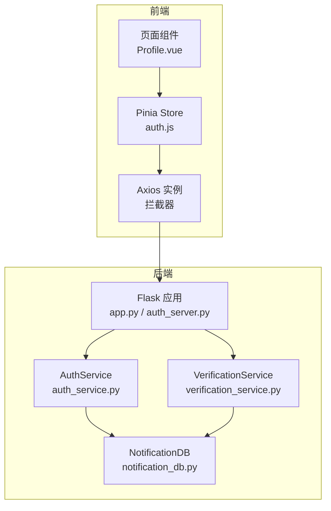
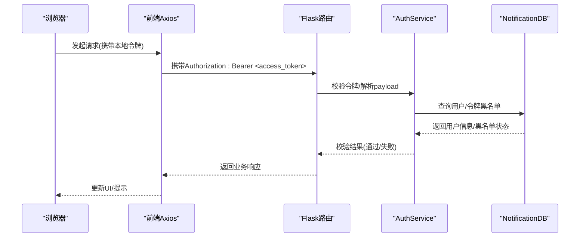
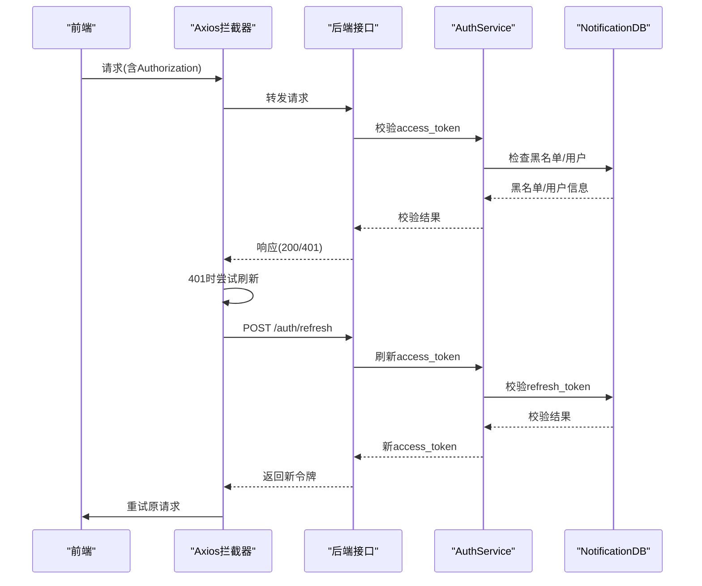
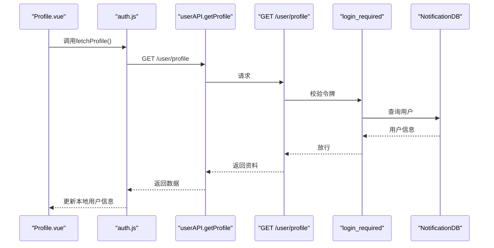
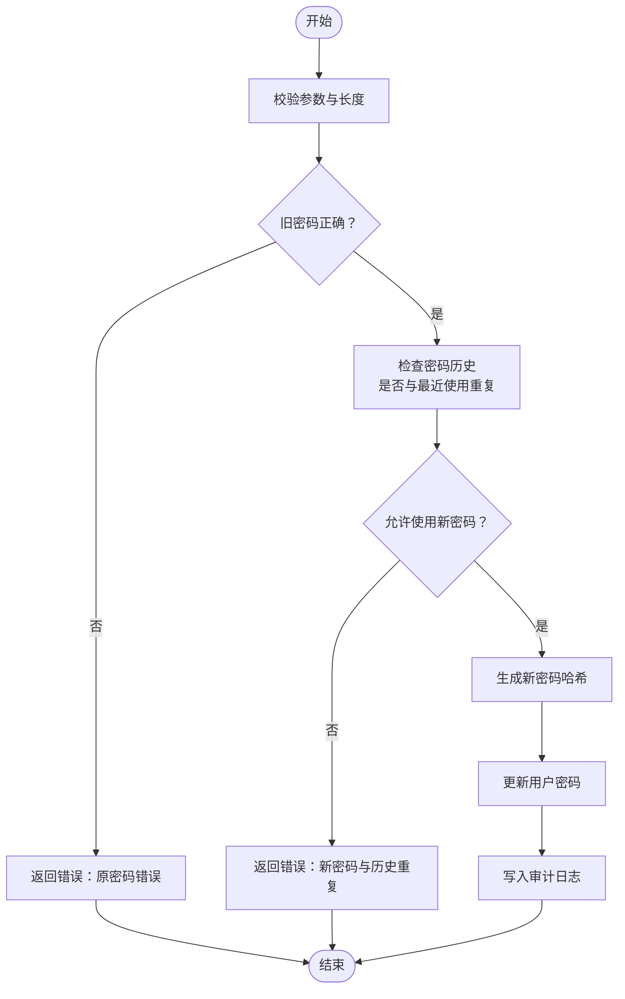
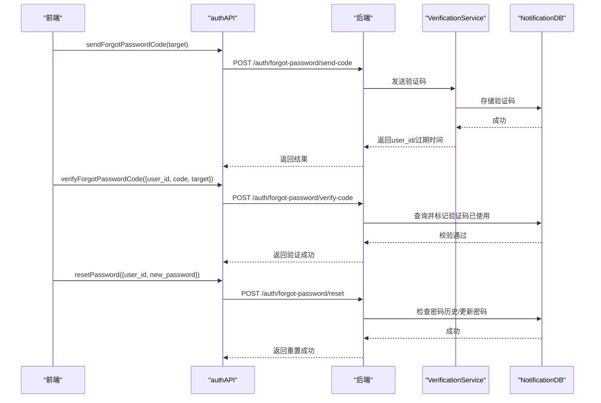
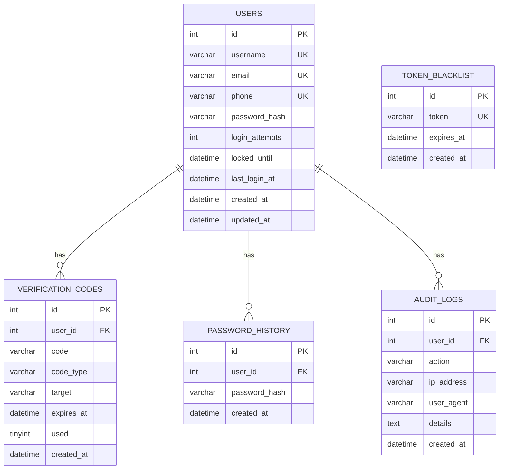
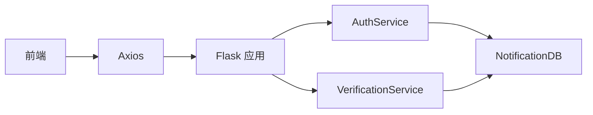

# 用户管理API

<cite>
**本文引用的文件**
- [app.py](file://python/app.py)
- [auth_server.py](file://python/auth_server.py)
- [auth_service.py](file://python/src/auth_service.py)
- [notification_db.py](file://python/src/notification_db.py)
- [verification_service.py](file://python/src/notifications/verification_service.py)
- [Profile.vue](file://python-web/src/views/Profile.vue)
- [auth.js](file://python-web/src/stores/auth.js)
- [index.js](file://python-web/src/api/index.js)
- [requirements.txt](file://python/requirements.txt)
</cite>

## 目录
1. [简介](#简介)
2. [项目结构](#项目结构)
3. [核心组件](#核心组件)
4. [架构总览](#架构总览)
5. [详细组件分析](#详细组件分析)
6. [依赖关系分析](#依赖关系分析)
7. [性能考虑](#性能考虑)
8. [故障排除指南](#故障排除指南)
9. [结论](#结论)
10. [附录](#附录)

## 简介
本文件面向用户管理API，覆盖以下能力：
- 用户资料查询：获取当前登录用户的个人资料
- 密码修改：在已登录状态下修改密码
- 忘记密码：通过邮箱/短信验证码重置密码
- 会话与权限：基于JWT的访问令牌与刷新令牌、黑名单、登录限制
- 审计日志：注册、登录、登出、密码变更与重置等操作的审计记录
- 数据安全：密码哈希、验证码有效期、令牌黑名单、防暴力破解策略

## 项目结构
后端采用Flask微服务，前端使用Vue 3 + Pinia + Axios，API统一前缀为 /api。数据库层通过NotificationDB封装MySQL连接与表结构。

图表来源
- [app.py:1-120](file://python/app.py#L1-L120)
- [auth_server.py:1-60](file://python/auth_server.py#L1-L60)
- [auth_service.py:1-60](file://python/src/auth_service.py#L1-L60)
- [notification_db.py:1-120](file://python/src/notification_db.py#L1-L120)
- [verification_service.py:1-60](file://python/src/notifications/verification_service.py#L1-L60)
- [index.js:1-60](file://python-web/src/api/index.js#L1-L60)
- [auth.js:1-40](file://python-web/src/stores/auth.js#L1-L40)
- [Profile.vue:140-280](file://python-web/src/views/Profile.vue#L140-L280)

章节来源
- [app.py:1-120](file://python/app.py#L1-L120)
- [auth_server.py:1-60](file://python/auth_server.py#L1-L60)
- [notification_db.py:40-120](file://python/src/notification_db.py#L40-L120)

## 核心组件
- Flask应用与路由：提供认证、用户资料、任务、爬虫等REST接口
- AuthService：密码哈希/校验、JWT签发/解码、令牌黑名单、登录限制、密码历史校验
- NotificationDB：用户表、验证码表、令牌黑名单、密码历史、审计日志的数据库访问
- VerificationService：验证码生成、存储、发送与校验
- 前端Axios实例：统一拦截器注入Authorization头、自动刷新访问令牌
- Pinia Store：本地持久化令牌与用户信息、统一登录/登出流程
- Vue页面组件：展示用户资料、触发密码修改

章节来源
- [auth_service.py:1-187](file://python/src/auth_service.py#L1-L187)
- [notification_db.py:1-357](file://python/src/notification_db.py#L1-L357)
- [verification_service.py:1-108](file://python/src/notifications/verification_service.py#L1-L108)
- [index.js:1-95](file://python-web/src/api/index.js#L1-L95)
- [auth.js:1-74](file://python-web/src/stores/auth.js#L1-L74)
- [Profile.vue:140-280](file://python-web/src/views/Profile.vue#L140-L280)

## 架构总览
用户管理API围绕“认证-授权-审计”展开，前后端通过Bearer Token进行鉴权，后端通过AuthService与NotificationDB实现业务逻辑与数据持久化。

图表来源
- [index.js:11-59](file://python-web/src/api/index.js#L11-L59)
- [auth_service.py:158-184](file://python/src/auth_service.py#L158-L184)
- [notification_db.py:307-312](file://python/src/notification_db.py#L307-L312)

## 详细组件分析

### 认证与会话管理
- 访问令牌与刷新令牌：登录成功返回access_token与refresh_token，前者短期有效，后者长期有效用于刷新
- 令牌黑名单：登出时将access_token/refresh_token加入黑名单；后续请求若命中黑名单则视为无效
- 登录限制：连续错误达到阈值将临时锁定账户
- 自动刷新：前端拦截器在401且非刷新接口时自动使用refresh_token刷新access_token

图表来源
- [index.js:22-59](file://python-web/src/api/index.js#L22-L59)
- [auth_server.py:161-186](file://python/auth_server.py#L161-L186)
- [auth_service.py:120-137](file://python/src/auth_service.py#L120-L137)
- [notification_db.py:307-312](file://python/src/notification_db.py#L307-L312)

章节来源
- [auth_server.py:123-186](file://python/auth_server.py#L123-L186)
- [auth_service.py:27-45](file://python/src/auth_service.py#L27-L45)
- [auth_service.py:58-66](file://python/src/auth_service.py#L58-L66)
- [auth_service.py:82-98](file://python/src/auth_service.py#L82-L98)
- [index.js:22-59](file://python-web/src/api/index.js#L22-L59)

### 用户资料查询
- 接口：GET /api/user/profile
- 权限：需要Bearer access_token
- 返回：用户基本信息（id、username、email、phone、last_login_at、created_at）
- 错误：用户不存在返回404，异常返回500

图表来源
- [Profile.vue:265-278](file://python-web/src/views/Profile.vue#L265-L278)
- [auth.js:53-60](file://python-web/src/stores/auth.js#L53-L60)
- [index.js:88-92](file://python-web/src/api/index.js#L88-L92)
- [app.py:277-299](file://python/app.py#L277-L299)
- [auth_service.py:158-184](file://python/src/auth_service.py#L158-L184)
- [notification_db.py:190-207](file://python/src/notification_db.py#L190-L207)

章节来源
- [app.py:277-299](file://python/app.py#L277-L299)
- [Profile.vue:265-278](file://python-web/src/views/Profile.vue#L265-L278)
- [auth.js:53-60](file://python-web/src/stores/auth.js#L53-L60)

### 密码修改流程
- 接口：POST /api/auth/change-password
- 参数：old_password、new_password
- 规则：新密码长度不少于6位；需校验旧密码正确；禁止与历史密码重复
- 审计：成功后写入审计日志

图表来源
- [app.py:242-274](file://python/app.py#L242-L274)
- [auth_service.py:138-156](file://python/src/auth_service.py#L138-L156)
- [notification_db.py:323-332](file://python/src/notification_db.py#L323-L332)
- [notification_db.py:334-342](file://python/src/notification_db.py#L334-L342)

章节来源
- [app.py:242-274](file://python/app.py#L242-L274)
- [auth_service.py:138-156](file://python/src/auth_service.py#L138-L156)
- [notification_db.py:323-342](file://python/src/notification_db.py#L323-L342)

### 忘记密码流程
- 步骤一：发送验证码
  - 接口：POST /api/auth/forgot-password/send-code
  - 参数：target（邮箱或手机号）
  - 行为：根据类型选择邮件或短信发送验证码，并存入数据库
- 步骤二：校验验证码
  - 接口：POST /api/auth/forgot-password/verify-code
  - 参数：user_id、code、target
  - 行为：校验未过期且未使用
- 步骤三：重置密码
  - 接口：POST /api/auth/forgot-password/reset
  - 参数：user_id、new_password
  - 行为：新密码不可与历史重复，成功后写入审计日志

图表来源
- [auth_server.py:225-336](file://python/auth_server.py#L225-L336)
- [verification_service.py:25-101](file://python/src/notifications/verification_service.py#L25-L101)
- [notification_db.py:147-189](file://python/src/notification_db.py#L147-L189)
- [notification_db.py:323-332](file://python/src/notification_db.py#L323-L332)
- [notification_db.py:334-342](file://python/src/notification_db.py#L334-L342)

章节来源
- [auth_server.py:225-336](file://python/auth_server.py#L225-L336)
- [verification_service.py:25-101](file://python/src/notifications/verification_service.py#L25-L101)
- [notification_db.py:147-189](file://python/src/notification_db.py#L147-L189)
- [notification_db.py:323-342](file://python/src/notification_db.py#L323-L342)

### 审计日志
- 记录动作：REGISTER、LOGIN、LOGOUT、RESET_PASSWORD、CHANGE_PASSWORD
- 字段：user_id、action、ip_address、user_agent、details、created_at
- 写入时机：各关键操作完成后写入

章节来源
- [notification_db.py:334-342](file://python/src/notification_db.py#L334-L342)
- [app.py:85-91](file://python/app.py#L85-L91)
- [app.py:112-118](file://python/app.py#L112-L118)
- [app.py:156-162](file://python/app.py#L156-L162)
- [app.py:228-234](file://python/app.py#L228-L234)
- [app.py:263-269](file://python/app.py#L263-L269)

### 数据模型与表结构

图表来源
- [notification_db.py:44-103](file://python/src/notification_db.py#L44-L103)

章节来源
- [notification_db.py:44-103](file://python/src/notification_db.py#L44-L103)

## 依赖关系分析
- 后端依赖：Flask、Flask-CORS、PyMySQL、bcrypt、PyJWT、psutil
- 前端依赖：axios、pinia、vue
- 关键耦合点：AuthService与NotificationDB紧密耦合；VerificationService依赖NotificationDB与外部邮件/短信发送器

图表来源
- [requirements.txt:1-14](file://python/requirements.txt#L1-L14)
- [auth_service.py:1-20](file://python/src/auth_service.py#L1-L20)
- [notification_db.py:1-20](file://python/src/notification_db.py#L1-L20)
- [verification_service.py:1-20](file://python/src/notifications/verification_service.py#L1-L20)
- [index.js:1-10](file://python-web/src/api/index.js#L1-L10)

章节来源
- [requirements.txt:1-14](file://python/requirements.txt#L1-L14)
- [auth_service.py:1-20](file://python/src/auth_service.py#L1-L20)
- [notification_db.py:1-20](file://python/src/notification_db.py#L1-L20)
- [verification_service.py:1-20](file://python/src/notifications/verification_service.py#L1-L20)
- [index.js:1-10](file://python-web/src/api/index.js#L1-L10)

## 性能考虑
- 数据库连接：NotificationDB在每次操作前确保连接可用，必要时重连，避免长事务
- JWT负载：仅包含必要字段（sub、username、type、exp），减少令牌体积
- 登录限制：通过数据库计数与锁定时间降低暴力破解风险
- 前端缓存：Pinia Store本地持久化令牌与用户信息，减少重复请求

## 故障排除指南
- 401 未提供认证令牌或令牌无效
  - 检查Authorization头格式是否为Bearer
  - 使用刷新接口获取新令牌
- 400 参数缺失或非法
  - 确认必填字段：identifier/password、old_password/new_password、target等
  - 邮箱/手机号格式校验
- 400 密码不符合规则
  - 新密码长度不少于6位
  - 不得与历史密码重复
- 400 验证码无效或已过期
  - 验证码有效期为5分钟
  - 验证码仅能使用一次
- 423 账户被锁定
  - 连续多次错误登录导致临时锁定
  - 等待锁定时间结束后重试

章节来源
- [auth_server.py:130-159](file://python/auth_server.py#L130-L159)
- [auth_service.py:82-98](file://python/src/auth_service.py#L82-L98)
- [verification_service.py:83-101](file://python/src/notifications/verification_service.py#L83-L101)
- [notification_db.py:158-189](file://python/src/notification_db.py#L158-L189)

## 结论
该用户管理API通过清晰的模块划分与完善的鉴权、审计与安全策略，提供了稳定可靠的用户资料查询与密码管理能力。建议在生产环境中：
- 更换默认密钥并妥善保管
- 引入HTTPS与CORS白名单
- 对敏感接口增加频率限制
- 定期清理过期验证码与审计日志

## 附录

### API定义与调用示例

- 获取用户资料
  - 方法：GET
  - 路径：/api/user/profile
  - 头部：Authorization: Bearer <access_token>
  - 成功响应：包含用户基础信息
  - 参考路径：[app.py:277-299](file://python/app.py#L277-L299)，[Profile.vue:265-278](file://python-web/src/views/Profile.vue#L265-L278)

- 修改密码
  - 方法：POST
  - 路径：/api/auth/change-password
  - 请求体：{ old_password, new_password }
  - 成功响应：{ success: true, message }
  - 参考路径：[app.py:242-274](file://python/app.py#L242-L274)，[Profile.vue:239-263](file://python-web/src/views/Profile.vue#L239-L263)

- 忘记密码-发送验证码
  - 方法：POST
  - 路径：/api/auth/forgot-password/send-code
  - 请求体：{ target }
  - 成功响应：{ success, message, data.user_id, data.expires_in }
  - 参考路径：[auth_server.py:225-260](file://python/auth_server.py#L225-L260)

- 忘记密码-校验验证码
  - 方法：POST
  - 路径：/api/auth/forgot-password/verify-code
  - 请求体：{ user_id, code, target }
  - 成功响应：{ success, message, data.verified }
  - 参考路径：[auth_server.py:262-291](file://python/auth_server.py#L262-L291)

- 忘记密码-重置密码
  - 方法：POST
  - 路径：/api/auth/forgot-password/reset
  - 请求体：{ user_id, new_password }
  - 成功响应：{ success, message }
  - 参考路径：[auth_server.py:293-336](file://python/auth_server.py#L293-L336)

- 登录
  - 方法：POST
  - 路径：/api/auth/login
  - 请求体：{ identifier, password }
  - 成功响应：{ success, message, data.access_token, data.refresh_token, data.user }
  - 参考路径：[auth_server.py:123-159](file://python/auth_server.py#L123-L159)

- 刷新令牌
  - 方法：POST
  - 路径：/api/auth/refresh
  - 请求体：{ refresh_token }
  - 成功响应：{ success, data.access_token }
  - 参考路径：[auth_server.py:161-186](file://python/auth_server.py#L161-L186)

- 登出
  - 方法：POST
  - 路径：/api/auth/logout
  - 请求体：{ refresh_token }
  - 成功响应：{ success, message }
  - 参考路径：[auth_server.py:188-223](file://python/auth_server.py#L188-L223)

### 前端集成要点
- Axios拦截器自动注入Authorization头并处理401刷新
- Pinia Store负责令牌与用户信息的本地持久化
- 页面组件通过store触发API调用并更新UI

章节来源
- [index.js:11-59](file://python-web/src/api/index.js#L11-L59)
- [auth.js:12-29](file://python-web/src/stores/auth.js#L12-L29)
- [Profile.vue:239-263](file://python-web/src/views/Profile.vue#L239-L263)