# 系统监控API

<cite>
**本文档引用的文件**
- [app.py](file://python/app.py)
- [system_db.py](file://python/system_db.py)
- [alert_db.py](file://python/alert_db.py)
- [system.js](file://python-web/src/api/system.js)
- [index.js](file://python-web/src/api/index.js)
- [system.js](file://python-web/src/stores/system.js)
- [SystemMonitor.vue](file://python-web/src/views/SystemMonitor.vue)
- [SystemLogs.vue](file://python-web/src/views/SystemLogs.vue)
- [Alerts.vue](file://python-web/src/views/Alerts.vue)
</cite>

## 目录
1. [简介](#简介)
2. [项目结构](#项目结构)
3. [核心组件](#核心组件)
4. [架构概览](#架构概览)
5. [详细组件分析](#详细组件分析)
6. [依赖关系分析](#依赖关系分析)
7. [性能考虑](#性能考虑)
8. [故障排除指南](#故障排除指南)
9. [结论](#结论)

## 简介

系统监控API是一个完整的监控解决方案，提供健康检查、系统日志管理、告警管理和系统资源监控功能。该系统采用前后端分离架构，后端基于Flask框架实现RESTful API，前端使用Vue.js构建用户界面。

系统监控API的核心功能包括：
- 健康检查：实时监控系统运行状态
- 系统日志：收集、查询和管理各类系统日志
- 告警管理：配置告警规则和处理告警事件
- 资源监控：监控CPU、内存、磁盘等系统资源使用情况
- 设置管理：系统配置和用户偏好设置

## 项目结构

该项目采用模块化的项目结构，主要分为Python后端和Vue.js前端两个部分：

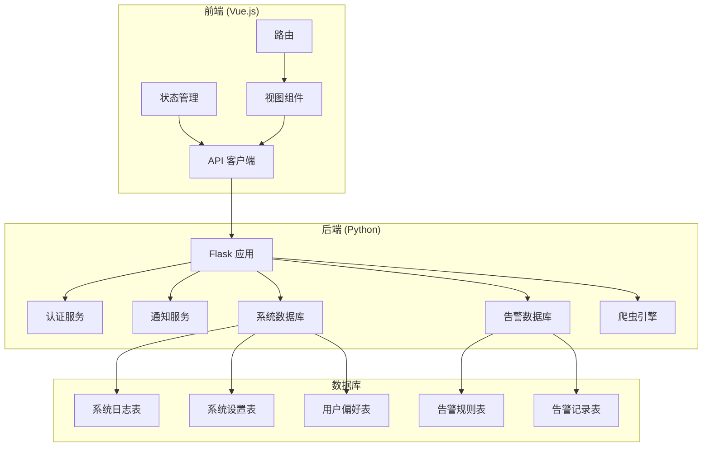

**图表来源**
- [app.py:1-50](file://python/app.py#L1-L50)
- [system_db.py:1-50](file://python/system_db.py#L1-L50)
- [alert_db.py:1-50](file://python/alert_db.py#L1-L50)

**章节来源**
- [app.py:1-50](file://python/app.py#L1-L50)
- [system_db.py:1-50](file://python/system_db.py#L1-L50)
- [alert_db.py:1-50](file://python/alert_db.py#L1-L50)

## 核心组件

系统监控API由以下核心组件构成：

### 后端核心组件

1. **Flask应用服务器**：提供RESTful API接口
2. **认证服务**：处理用户身份验证和授权
3. **系统数据库层**：管理日志、设置和用户偏好
4. **告警数据库层**：管理告警规则和告警记录
5. **通知服务**：处理邮件和短信通知

### 前端核心组件

1. **API客户端**：封装HTTP请求和响应处理
2. **状态管理**：使用Pinia管理全局状态
3. **视图组件**：提供用户界面交互
4. **路由系统**：管理页面导航

**章节来源**
- [app.py:1553-1719](file://python/app.py#L1553-L1719)
- [system_db.py:1-100](file://python/system_db.py#L1-L100)
- [alert_db.py:1-100](file://python/alert_db.py#L1-L100)

## 架构概览

系统采用分层架构设计，确保各组件职责清晰、耦合度低：

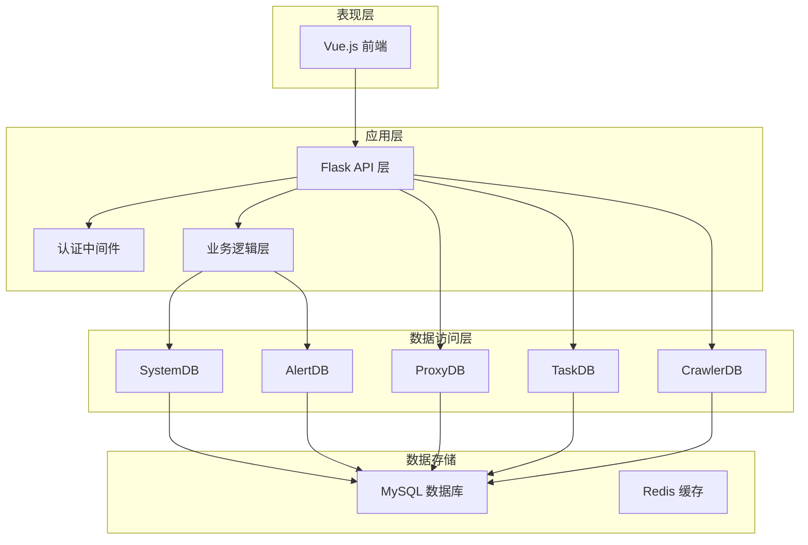

**图表来源**
- [app.py:1-35](file://python/app.py#L1-L35)
- [system_db.py:1-317](file://python/system_db.py#L1-L317)
- [alert_db.py:1-314](file://python/alert_db.py#L1-L314)

### 数据流架构

系统监控API的数据流遵循标准的RESTful架构模式：

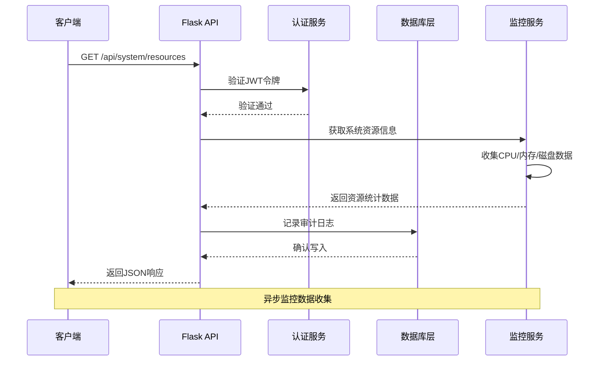

**图表来源**
- [app.py:1554-1591](file://python/app.py#L1554-L1591)
- [system_db.py:99-122](file://python/system_db.py#L99-L122)

**章节来源**
- [app.py:1554-1719](file://python/app.py#L1554-L1719)

## 详细组件分析

### 系统资源监控组件

系统资源监控组件负责实时收集和展示系统硬件资源使用情况：

#### 资源监控接口

| 接口 | 方法 | 描述 | 请求参数 | 响应数据 |
|------|------|------|----------|----------|
| `/api/system/resources` | GET | 获取系统资源使用情况 | 无 | CPU、内存、磁盘使用率和容量信息 |
| `/api/system/logs` | GET | 获取系统日志列表 | level, page, page_size | 分页的日志记录 |
| `/api/system/logs/clear` | POST | 清理历史日志 | days | 清理结果 |

#### 资源监控数据模型

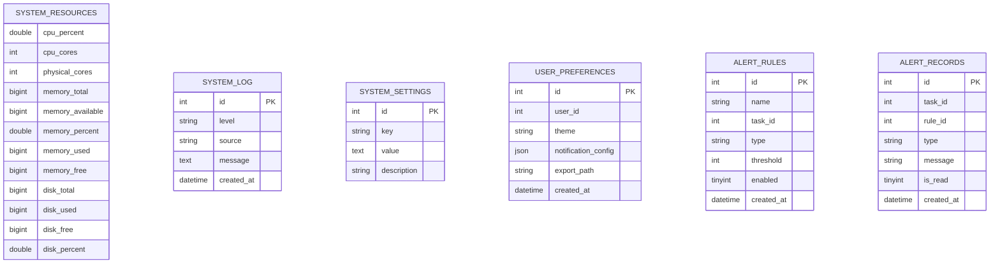

**图表来源**
- [system_db.py:51-87](file://python/system_db.py#L51-L87)
- [alert_db.py:50-81](file://python/alert_db.py#L50-L81)

#### 资源监控流程

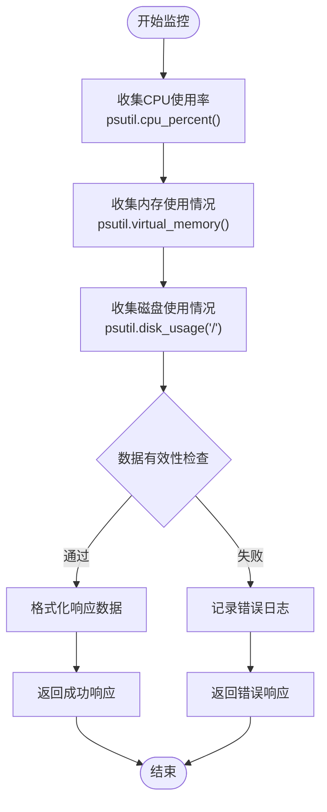

**图表来源**
- [app.py:1555-1591](file://python/app.py#L1555-L1591)

**章节来源**
- [app.py:1554-1591](file://python/app.py#L1554-L1591)
- [system_db.py:99-183](file://python/system_db.py#L99-L183)

### 系统日志管理组件

系统日志管理组件提供完整的日志收集、查询和管理功能：

#### 日志管理接口

| 接口 | 方法 | 描述 | 请求参数 | 响应数据 |
|------|------|------|----------|----------|
| `/api/system/logs` | GET | 查询系统日志 | level, page, page_size | 分页日志列表 |
| `/api/system/logs/clear` | POST | 清理历史日志 | days | 清理结果 |
| `/api/system/settings` | GET | 获取系统设置 | 无 | 系统设置列表 |
| `/api/system/settings/{key}` | PUT | 更新系统设置 | value | 更新结果 |

#### 日志查询流程

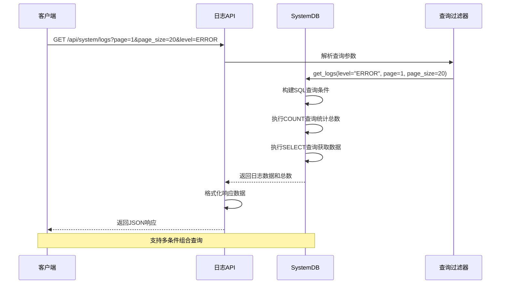

**图表来源**
- [app.py:1593-1627](file://python/app.py#L1593-L1627)
- [system_db.py:123-168](file://python/system_db.py#L123-L168)

#### 日志清理机制

系统提供智能的日志清理功能，支持按时间范围清理历史日志：

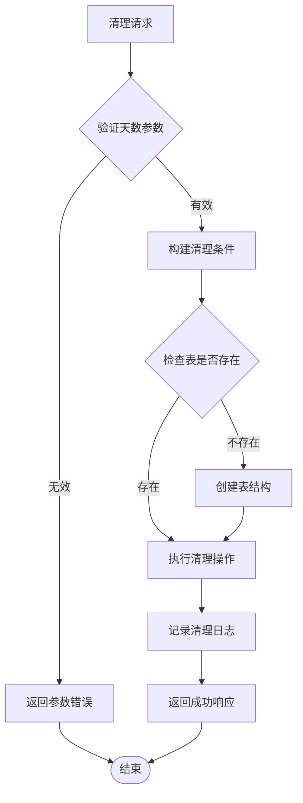

**图表来源**
- [app.py:1629-1648](file://python/app.py#L1629-L1648)
- [system_db.py:170-183](file://python/system_db.py#L170-L183)

**章节来源**
- [app.py:1593-1684](file://python/app.py#L1593-L1684)
- [system_db.py:123-254](file://python/system_db.py#L123-L254)

### 告警管理组件

告警管理组件提供灵活的告警规则配置和告警事件处理功能：

#### 告警管理接口

| 接口 | 方法 | 描述 | 请求参数 | 响应数据 |
|------|------|------|----------|----------|
| `/api/alerts` | GET | 获取告警列表 | task_id, type, is_read, page, page_size | 分页告警列表 |
| `/api/alerts/{id}` | PUT | 标记告警为已读 | 无 | 标记结果 |
| `/api/alerts/rules` | GET | 获取告警规则 | task_id, enabled | 告警规则列表 |
| `/api/alerts/rules` | POST | 创建告警规则 | name, type, threshold, enabled | 新建规则ID |
| `/api/alerts/rules/{id}` | PUT | 更新告警规则 | 任意字段 | 更新结果 |
| `/api/alerts/rules/{id}` | DELETE | 删除告警规则 | 无 | 删除结果 |

#### 告警规则配置

系统支持多种类型的告警规则：

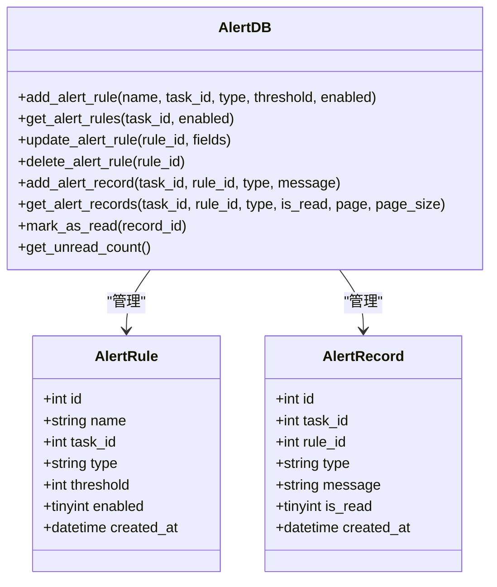

**图表来源**
- [alert_db.py:6-91](file://python/alert_db.py#L6-L91)
- [alert_db.py:93-198](file://python/alert_db.py#L93-L198)

#### 告警处理流程

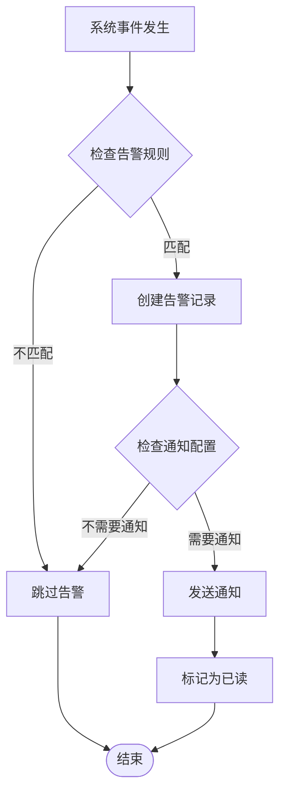

**图表来源**
- [alert_db.py:199-223](file://python/alert_db.py#L199-L223)

**章节来源**
- [alert_db.py:93-314](file://python/alert_db.py#L93-L314)

### 前端监控组件

前端监控组件提供直观的可视化界面，展示系统状态和监控数据：

#### 监控仪表板组件

系统监控仪表板包含以下核心组件：

1. **资源仪表盘**：显示CPU、内存、磁盘使用率
2. **历史趋势图**：展示资源使用历史变化
3. **任务资源排名**：显示各个任务的资源占用情况
4. **告警阈值设置**：允许用户自定义告警阈值

#### 前端数据流

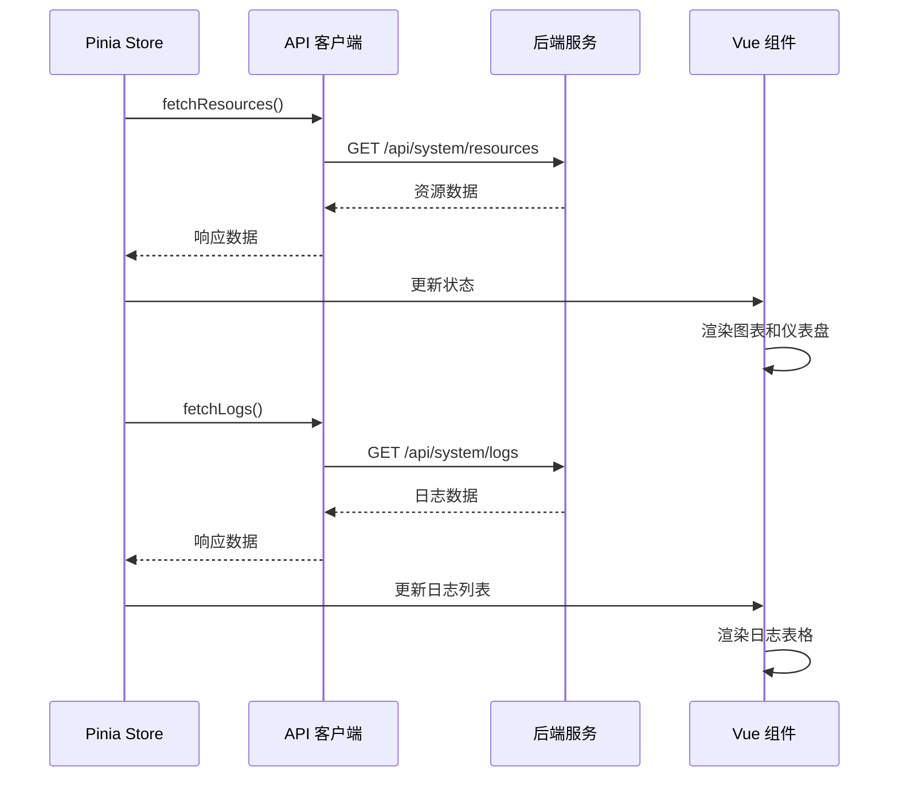

**图表来源**
- [system.js:135-139](file://python-web/src/stores/system.js#L135-L139)
- [system.js:121-125](file://python-web/src/stores/system.js#L121-L125)

#### 用户界面组件

前端使用Element Plus组件库构建用户界面，提供现代化的用户体验：

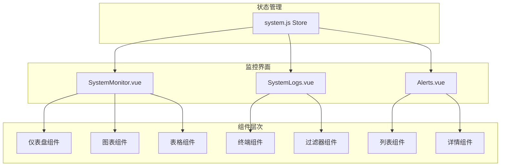

**图表来源**
- [SystemMonitor.vue:1-117](file://python-web/src/views/SystemMonitor.vue#L1-L117)
- [SystemLogs.vue:1-96](file://python-web/src/views/SystemLogs.vue#L1-L96)
- [Alerts.vue:1-50](file://python-web/src/views/Alerts.vue#L1-L50)

**章节来源**
- [SystemMonitor.vue:1-237](file://python-web/src/views/SystemMonitor.vue#L1-L237)
- [SystemLogs.vue:1-220](file://python-web/src/views/SystemLogs.vue#L1-L220)
- [Alerts.vue:1-220](file://python-web/src/views/Alerts.vue#L1-L220)
- [system.js:1-168](file://python-web/src/stores/system.js#L1-L168)

## 依赖关系分析

系统监控API的依赖关系呈现清晰的分层结构：

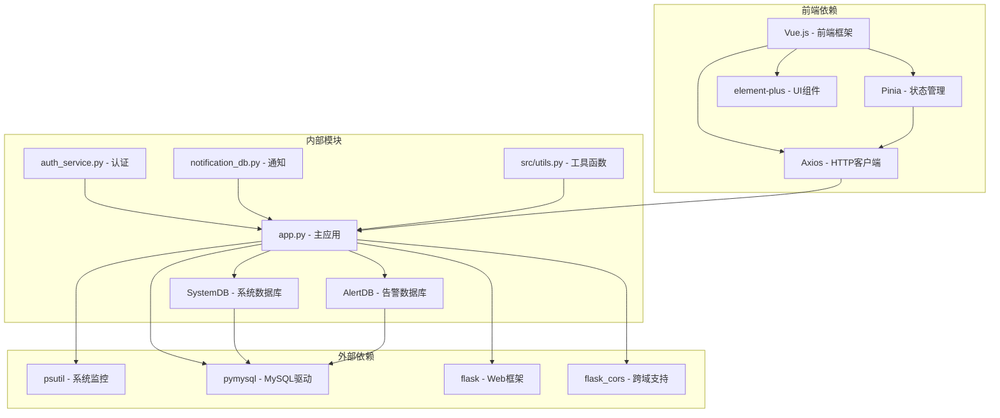

**图表来源**
- [app.py:1-18](file://python/app.py#L1-L18)
- [system_db.py:1-5](file://python/system_db.py#L1-L5)
- [alert_db.py:1-5](file://python/alert_db.py#L1-L5)

### 数据库依赖关系

系统使用MySQL作为主要数据存储，采用PyMySQL驱动进行数据库操作：

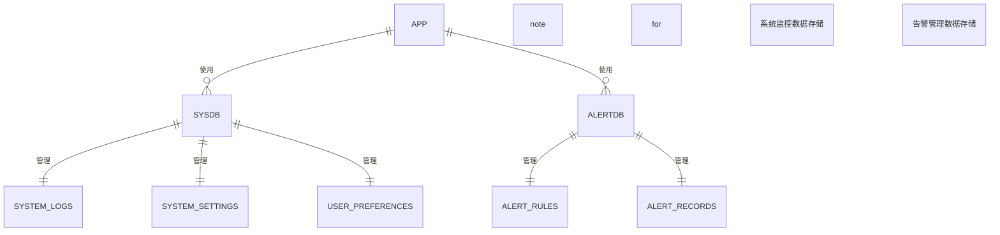

**图表来源**
- [system_db.py:51-87](file://python/system_db.py#L51-L87)
- [alert_db.py:50-81](file://python/alert_db.py#L50-L81)

**章节来源**
- [app.py:1-35](file://python/app.py#L1-L35)
- [system_db.py:1-98](file://python/system_db.py#L1-L98)
- [alert_db.py:1-91](file://python/alert_db.py#L1-L91)

## 性能考虑

系统监控API在设计时充分考虑了性能优化和扩展性：

### 性能优化策略

1. **异步处理**：使用异步I/O操作避免阻塞
2. **连接池管理**：合理管理数据库连接，避免连接泄漏
3. **缓存机制**：使用Redis缓存热点数据
4. **分页查询**：对大量数据采用分页查询减少内存压力
5. **索引优化**：为常用查询字段建立数据库索引

### 扩展性设计

1. **微服务架构**：支持将监控功能拆分为独立服务
2. **水平扩展**：支持多实例部署和负载均衡
3. **插件机制**：支持自定义监控指标和告警规则
4. **配置驱动**：通过配置文件管理监控参数

### 监控指标

系统提供以下关键性能指标：

- **响应时间**：API请求的平均响应时间
- **吞吐量**：每秒处理的请求数量
- **资源利用率**：CPU、内存、磁盘的使用率
- **错误率**：API调用失败的比例
- **数据库性能**：查询响应时间和连接数

## 故障排除指南

### 常见问题及解决方案

#### 数据库连接问题

**问题症状**：API调用返回数据库连接错误

**解决步骤**：
1. 检查数据库服务状态
2. 验证数据库连接配置
3. 查看数据库连接池状态
4. 检查防火墙设置

#### 性能问题

**问题症状**：API响应缓慢或超时

**解决步骤**：
1. 分析慢查询日志
2. 优化数据库索引
3. 调整缓存策略
4. 实施查询优化

#### 前端通信问题

**问题症状**：前端无法获取监控数据

**解决步骤**：
1. 检查CORS配置
2. 验证JWT令牌有效性
3. 查看浏览器开发者工具
4. 检查网络连接状态

### 调试工具

系统提供了完善的调试和诊断工具：

1. **日志分析**：详细的系统日志记录
2. **性能监控**：实时性能指标监控
3. **错误追踪**：异常堆栈跟踪
4. **API测试**：Postman集合测试

**章节来源**
- [app.py:468-471](file://python/app.py#L468-L471)
- [system_db.py:99-122](file://python/system_db.py#L99-L122)

## 结论

系统监控API提供了一个完整、可扩展的监控解决方案，具有以下特点：

### 技术优势

1. **模块化设计**：清晰的分层架构便于维护和扩展
2. **实时监控**：提供准确的系统状态信息
3. **灵活配置**：支持自定义告警规则和监控参数
4. **用户友好**：直观的前端界面和丰富的可视化组件

### 应用价值

1. **运维效率**：帮助运维人员及时发现和解决问题
2. **系统稳定性**：通过告警机制预防系统故障
3. **性能优化**：提供性能瓶颈分析和优化建议
4. **成本控制**：通过资源监控优化资源配置

### 发展方向

1. **AI集成**：引入机器学习算法进行智能告警
2. **云原生**：支持容器化部署和Kubernetes编排
3. **多租户**：支持多组织和多项目的监控需求
4. **国际化**：支持多语言界面和本地化配置

该系统监控API为企业级应用提供了可靠的监控基础设施，能够满足不同规模企业的监控需求。