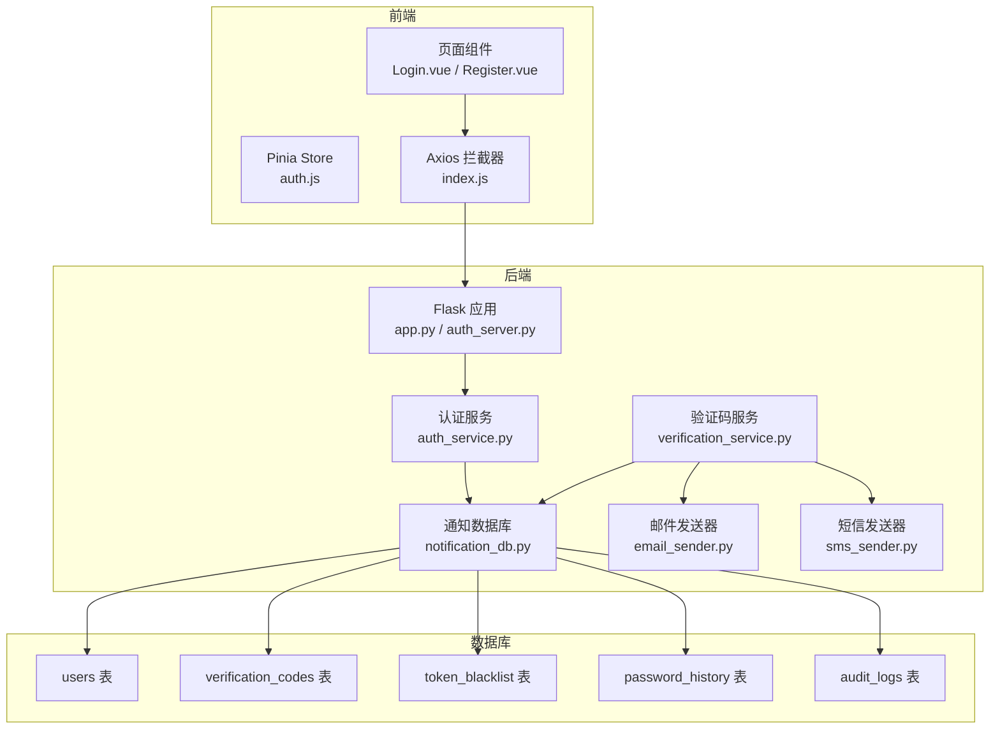
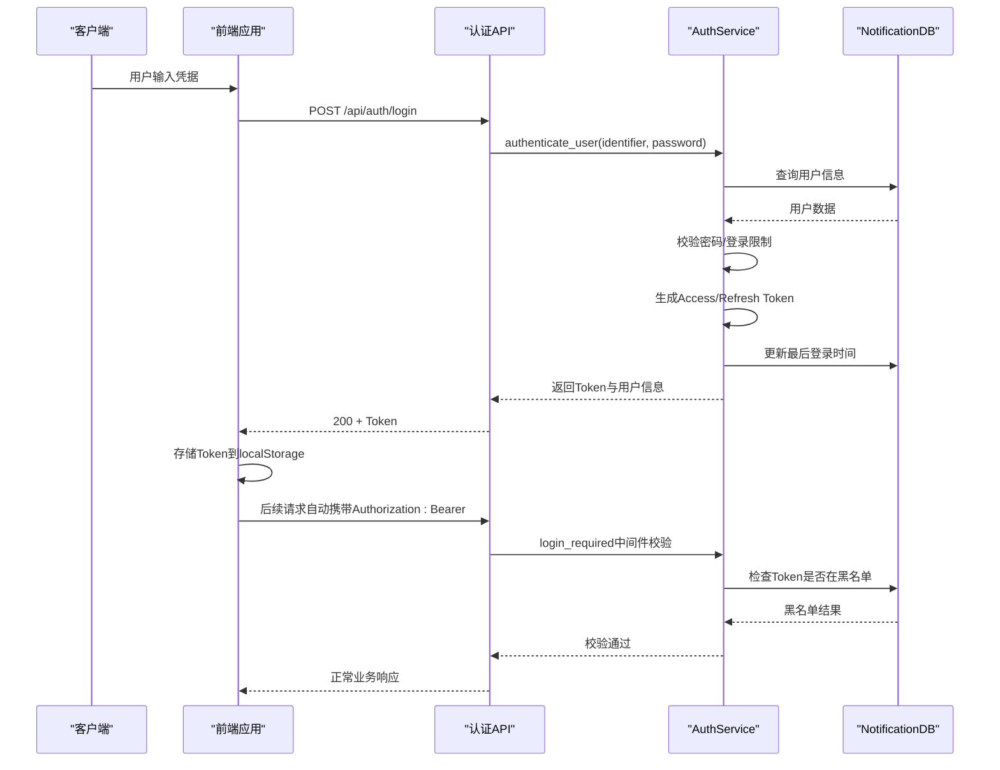
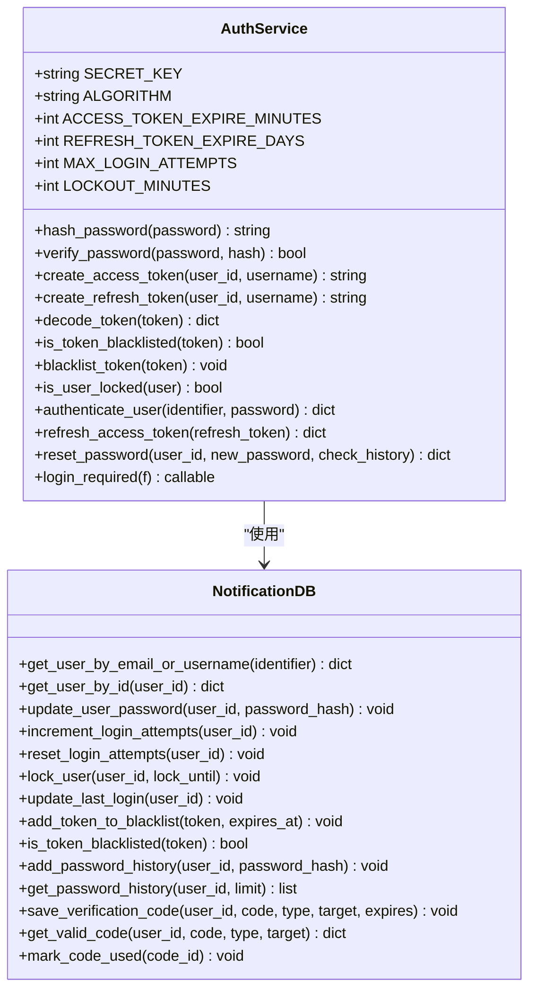
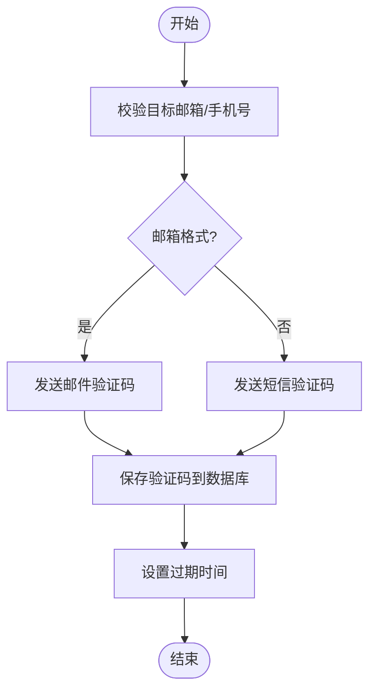
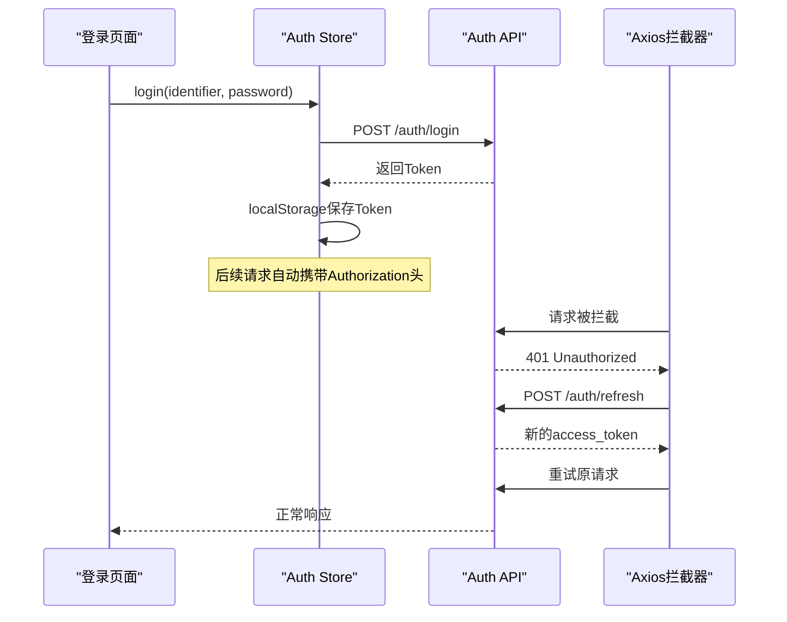
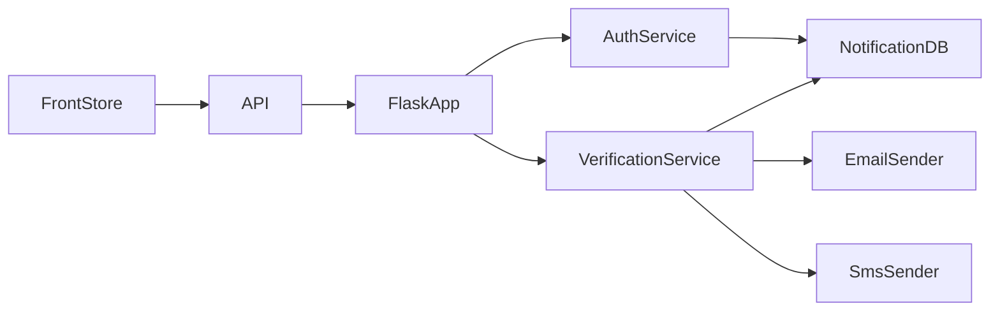

# 认证API

<cite>
**本文档引用的文件**
- [app.py](file://python/app.py)
- [auth_server.py](file://python/auth_server.py)
- [auth_service.py](file://python/src/auth_service.py)
- [notification_db.py](file://python/src/notification_db.py)
- [verification_service.py](file://python/src/notifications/verification_service.py)
- [email_sender.py](file://python/src/notifications/email_sender.py)
- [sms_sender.py](file://python/src/notifications/sms_sender.py)
- [auth.js](file://python-web/src/stores/auth.js)
- [index.js](file://python-web/src/api/index.js)
- [Login.vue](file://python-web/src/views/Login.vue)
- [Register.vue](file://python-web/src/views/Register.vue)
</cite>

## 目录
1. [简介](#简介)
2. [项目结构](#项目结构)
3. [核心组件](#核心组件)
4. [架构总览](#架构总览)
5. [详细组件分析](#详细组件分析)
6. [依赖关系分析](#依赖关系分析)
7. [性能考虑](#性能考虑)
8. [故障排除指南](#故障排除指南)
9. [结论](#结论)

## 简介
本文件为认证API的完整技术文档，覆盖用户注册、登录、Token刷新、登出、忘记密码等核心功能。文档详细说明了每个端点的HTTP方法、URL路径、请求参数、响应格式、状态码，并深入解析JWT认证机制、密码加密策略、验证码发送与验证流程。同时提供完整的请求/响应示例、错误码说明、安全考虑以及认证中间件与Token黑名单机制的工作原理。

## 项目结构
认证系统采用前后端分离架构：
- 后端：基于Flask的Python服务，提供REST API接口
- 前端：基于Vue.js + Pinia的状态管理，Axios拦截器实现自动刷新
- 数据层：MySQL数据库，包含用户表、验证码表、Token黑名单、密码历史、审计日志等

**图表来源**
- [app.py:1-800](file://python/app.py#L1-L800)
- [auth_service.py:1-187](file://python/src/auth_service.py#L1-L187)
- [notification_db.py:1-357](file://python/src/notification_db.py#L1-L357)
- [verification_service.py:1-108](file://python/src/notifications/verification_service.py#L1-L108)

**章节来源**
- [app.py:1-800](file://python/app.py#L1-L800)
- [auth_server.py:1-431](file://python/auth_server.py#L1-L431)

## 核心组件
- 认证服务（AuthService）：负责密码哈希、JWT生成与解码、Token黑名单检查、登录限制、密码重置历史校验
- 通知数据库（NotificationDB）：封装MySQL操作，提供用户、验证码、Token黑名单、密码历史、审计日志等CRUD
- 验证码服务（VerificationService）：生成6位数字验证码，支持邮箱/短信发送，带过期控制
- 发送器（EmailSender/SmsSender）：集成阿里云服务发送邮件/短信
- 前端存储（auth.js）：管理Token与用户信息，持久化到localStorage
- Axios拦截器（index.js）：自动添加Authorization头，401时自动刷新Token

**章节来源**
- [auth_service.py:1-187](file://python/src/auth_service.py#L1-L187)
- [notification_db.py:1-357](file://python/src/notification_db.py#L1-L357)
- [verification_service.py:1-108](file://python/src/notifications/verification_service.py#L1-L108)
- [email_sender.py:1-67](file://python/src/notifications/email_sender.py#L1-L67)
- [sms_sender.py:1-65](file://python/src/notifications/sms_sender.py#L1-L65)
- [auth.js:1-74](file://python-web/src/stores/auth.js#L1-L74)
- [index.js:1-95](file://python-web/src/api/index.js#L1-L95)

## 架构总览
认证API遵循JWT无状态认证模型，配合Redis/数据库实现Token黑名单与登录限制。前端通过Axios拦截器统一处理认证头与Token刷新。

**图表来源**
- [app.py:99-124](file://python/app.py#L99-L124)
- [auth_service.py:76-118](file://python/src/auth_service.py#L76-L118)
- [auth_service.py:158-183](file://python/src/auth_service.py#L158-L183)

## 详细组件分析

### 认证服务（AuthService）
- 密码加密：使用bcrypt进行盐值生成与哈希存储
- JWT配置：HS256算法，Access Token 30分钟，Refresh Token 7天
- 登录限制：最大5次失败尝试，锁定15分钟
- Token黑名单：基于数据库存储，按过期时间过滤
- 密码历史：防止重复使用最近5条密码

**图表来源**
- [auth_service.py:9-187](file://python/src/auth_service.py#L9-L187)
- [notification_db.py:6-357](file://python/src/notification_db.py#L6-L357)

**章节来源**
- [auth_service.py:1-187](file://python/src/auth_service.py#L1-L187)
- [notification_db.py:1-357](file://python/src/notification_db.py#L1-L357)

### 验证码服务（VerificationService）
- 验证码生成：6位数字随机码
- 过期控制：默认5分钟有效期
- 多渠道支持：邮箱与短信双通道
- 临时用户：未注册邮箱/手机号可创建临时用户用于找回密码

**图表来源**
- [verification_service.py:25-81](file://python/src/notifications/verification_service.py#L25-L81)

**章节来源**
- [verification_service.py:1-108](file://python/src/notifications/verification_service.py#L1-L108)
- [email_sender.py:1-67](file://python/src/notifications/email_sender.py#L1-L67)
- [sms_sender.py:1-65](file://python/src/notifications/sms_sender.py#L1-L65)

### 前端认证流程
- Token管理：localStorage持久化存储access_token/refresh_token/user
- 自动刷新：拦截器检测401，自动调用刷新接口
- 中间件：路由守卫结合Pinia store判断登录状态

**图表来源**
- [auth.js:30-51](file://python-web/src/stores/auth.js#L30-L51)
- [index.js:11-59](file://python-web/src/api/index.js#L11-L59)

**章节来源**
- [auth.js:1-74](file://python-web/src/stores/auth.js#L1-L74)
- [index.js:1-95](file://python-web/src/api/index.js#L1-L95)
- [Login.vue:100-119](file://python-web/src/views/Login.vue#L100-L119)

## 依赖关系分析
- 组件耦合：AuthService高度依赖NotificationDB；VerificationService依赖EmailSender/SmsSender与NotificationDB
- 外部依赖：bcrypt（密码哈希）、PyJWT（Token）、PyMySQL（数据库）、阿里云SDK（邮件/短信）
- 安全边界：密码与Token均不暴露在前端；验证码仅在服务端有效期内可用

**图表来源**
- [auth_service.py:1-187](file://python/src/auth_service.py#L1-L187)
- [verification_service.py:1-108](file://python/src/notifications/verification_service.py#L1-L108)
- [auth.js:1-74](file://python-web/src/stores/auth.js#L1-L74)
- [index.js:1-95](file://python-web/src/api/index.js#L1-L95)

**章节来源**
- [auth_service.py:1-187](file://python/src/auth_service.py#L1-L187)
- [verification_service.py:1-108](file://python/src/notifications/verification_service.py#L1-L108)
- [auth.js:1-74](file://python-web/src/stores/auth.js#L1-L74)
- [index.js:1-95](file://python-web/src/api/index.js#L1-L95)

## 性能考虑
- Token过期时间：Access Token短周期减少泄露风险；Refresh Token长周期降低频繁登录成本
- 登录限制：防暴力破解，保护账户安全
- 数据库索引：users表对username/email/phone建立唯一索引，verification_codes表对user_id/code/target建立索引
- 缓存策略：建议在高并发场景下引入Redis缓存常用用户信息与验证码

## 故障排除指南
常见错误码与处理建议：
- INVALID_USERNAME：用户名长度不足3位
- INVALID_PASSWORD：密码长度不足6位或与历史密码重复
- USERNAME_EXISTS/EMAIL_EXISTS/PHONE_EXISTS：注册时唯一性冲突
- MISSING_CREDENTIALS/MISSING_TOKEN：缺少必要参数
- USER_NOT_FOUND/INVALID_PASSWORD：用户不存在或密码错误
- ACCOUNT_LOCKED：登录失败超过阈值被锁定
- TOKEN_INVALID/TOKEN_MISSING：Token缺失或已失效
- SEND_CODE_FAILED/VERIFY_FAILED/RESET_FAILED：验证码发送/验证/重置失败

**章节来源**
- [app.py:53-96](file://python/app.py#L53-L96)
- [auth_service.py:76-118](file://python/src/auth_service.py#L76-L118)
- [auth_service.py:120-136](file://python/src/auth_service.py#L120-L136)

## 结论
该认证系统提供了完整的用户生命周期管理能力，包括注册、登录、Token刷新、登出、忘记密码等核心功能。通过JWT无状态认证与Token黑名单机制，实现了高安全性与良好的用户体验。建议在生产环境中进一步完善：
- 使用环境变量管理密钥与配置
- 引入Redis缓存提升性能
- 增加更细粒度的权限控制
- 完善监控与审计日志