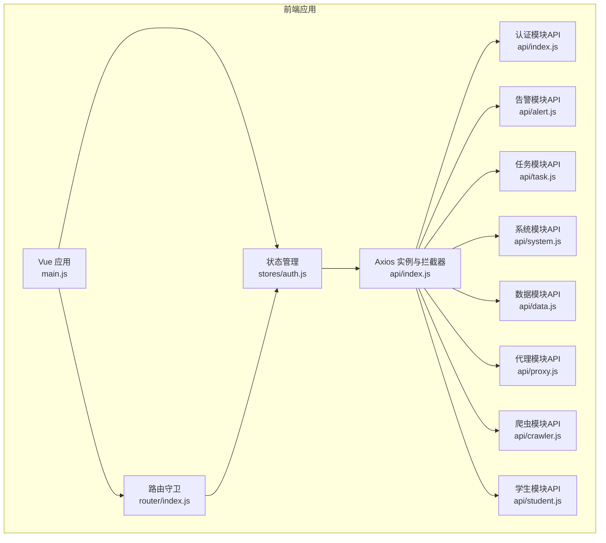
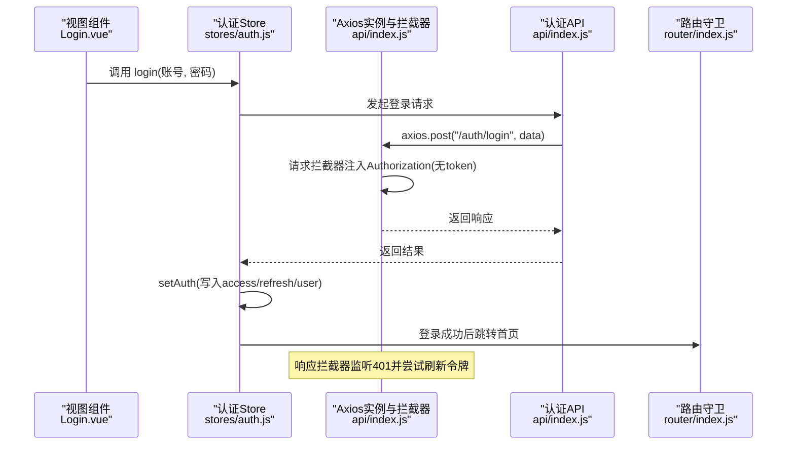
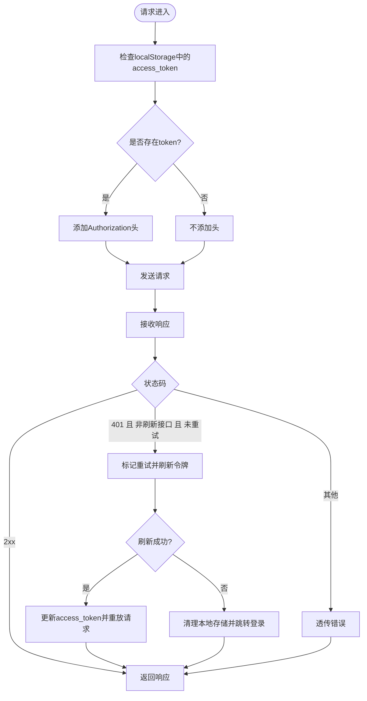
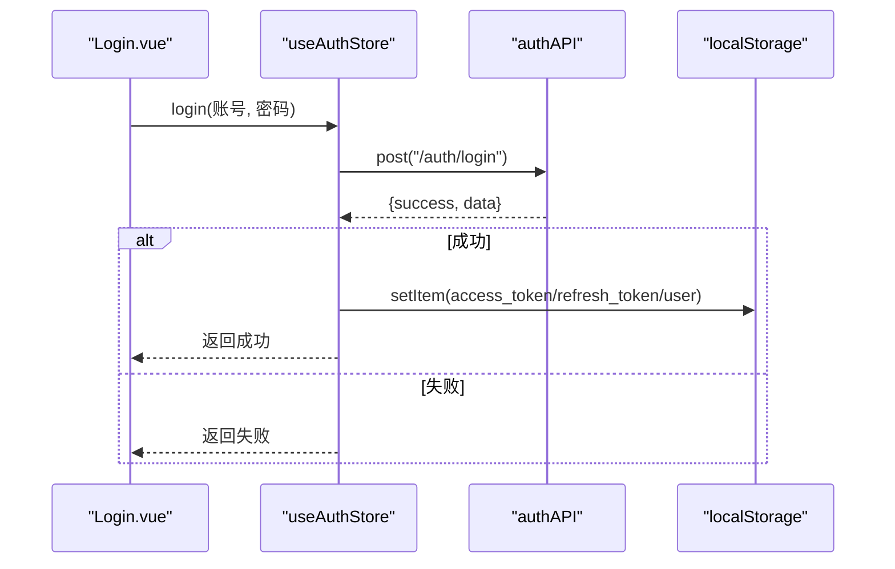
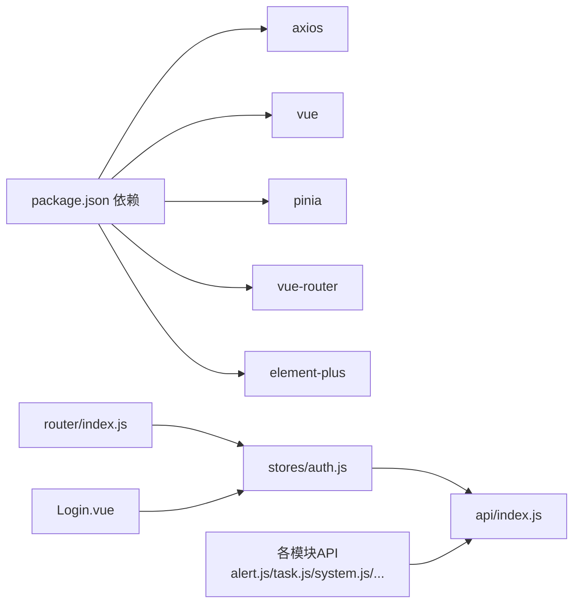

# API集成

<cite>
**本文引用的文件**
- [python-web/src/api/index.js](file://python-web/src/api/index.js)
- [python-web/src/stores/auth.js](file://python-web/src/stores/auth.js)
- [python-web/src/router/index.js](file://python-web/src/router/index.js)
- [python-web/src/views/Login.vue](file://python-web/src/views/Login.vue)
- [python-web/src/api/alert.js](file://python-web/src/api/alert.js)
- [python-web/src/api/student.js](file://python-web/src/api/student.js)
- [python-web/src/api/system.js](file://python-web/src/api/system.js)
- [python-web/src/api/task.js](file://python-web/src/api/task.js)
- [python-web/src/api/data.js](file://python-web/src/api/data.js)
- [python-web/src/api/proxy.js](file://python-web/src/api/proxy.js)
- [python-web/src/api/crawler.js](file://python-web/src/api/crawler.js)
- [python-web/package.json](file://python-web/package.json)
- [python-web/vite.config.js](file://python-web/vite.config.js)
</cite>

## 目录
1. [简介](#简介)
2. [项目结构](#项目结构)
3. [核心组件](#核心组件)
4. [架构总览](#架构总览)
5. [详细组件分析](#详细组件分析)
6. [依赖关系分析](#依赖关系分析)
7. [性能考虑](#性能考虑)
8. [故障排查指南](#故障排查指南)
9. [结论](#结论)
10. [附录](#附录)

## 简介
本文件面向前后端API对接的开发者，系统性梳理前端Vue3应用中的API集成方案。内容覆盖Axios配置与拦截器、请求与响应处理、认证与令牌管理、错误处理策略、请求重试机制、API版本控制建议、缓存策略、批量请求与请求取消、超时控制、调试工具与网络错误处理、离线状态处理等主题，并通过图示展示关键流程与组件关系。

## 项目结构
前端采用Vue3 + Pinia + Axios + Element Plus 的技术栈，API层按功能模块拆分，统一通过一个Axios实例进行配置与拦截，路由守卫结合认证状态进行访问控制。

**图表来源**
- [python-web/src/main.js:1-16](file://python-web/src/main.js#L1-L16)
- [python-web/src/router/index.js:1-150](file://python-web/src/router/index.js#L1-L150)
- [python-web/src/stores/auth.js:1-74](file://python-web/src/stores/auth.js#L1-L74)
- [python-web/src/api/index.js:1-95](file://python-web/src/api/index.js#L1-L95)
- [python-web/src/api/alert.js:1-35](file://python-web/src/api/alert.js#L1-L35)
- [python-web/src/api/task.js:1-67](file://python-web/src/api/task.js#L1-L67)
- [python-web/src/api/system.js:1-23](file://python-web/src/api/system.js#L1-L23)
- [python-web/src/api/data.js:1-27](file://python-web/src/api/data.js#L1-L27)
- [python-web/src/api/proxy.js:1-63](file://python-web/src/api/proxy.js#L1-L63)
- [python-web/src/api/crawler.js:1-22](file://python-web/src/api/crawler.js#L1-L22)
- [python-web/src/api/student.js:1-102](file://python-web/src/api/student.js#L1-L102)

**章节来源**
- [python-web/src/main.js:1-16](file://python-web/src/main.js#L1-L16)
- [python-web/src/router/index.js:1-150](file://python-web/src/router/index.js#L1-L150)
- [python-web/src/stores/auth.js:1-74](file://python-web/src/stores/auth.js#L1-L74)
- [python-web/src/api/index.js:1-95](file://python-web/src/api/index.js#L1-L95)

## 核心组件
- Axios实例与全局配置：基础URL、超时、默认头。
- 请求拦截器：自动注入Authorization头。
- 响应拦截器：统一处理401未授权并触发刷新令牌流程；其他错误透传。
- 认证模块API：注册、登录、刷新、注销、忘记密码系列接口。
- 用户资料API：获取个人资料。
- 功能模块API：告警、任务、系统、数据、代理、爬虫、学生等。
- 认证状态管理：Pinia Store维护令牌与用户信息，持久化到localStorage。
- 路由守卫：基于认证状态控制页面访问。

**章节来源**
- [python-web/src/api/index.js:1-95](file://python-web/src/api/index.js#L1-L95)
- [python-web/src/stores/auth.js:1-74](file://python-web/src/stores/auth.js#L1-L74)
- [python-web/src/router/index.js:129-147](file://python-web/src/router/index.js#L129-L147)

## 架构总览
下图展示了从视图到API再到后端的整体调用链路，以及认证与拦截器在其中的关键作用。

**图表来源**
- [python-web/src/views/Login.vue:100-119](file://python-web/src/views/Login.vue#L100-L119)
- [python-web/src/stores/auth.js:30-41](file://python-web/src/stores/auth.js#L30-L41)
- [python-web/src/api/index.js:11-59](file://python-web/src/api/index.js#L11-L59)
- [python-web/src/router/index.js:134-147](file://python-web/src/router/index.js#L134-L147)

## 详细组件分析

### Axios配置与拦截器
- 基础配置
  - 基础URL指向后端服务地址。
  - 默认超时时间设置为10秒。
  - Content-Type默认为application/json。
- 请求拦截器
  - 在发送前从localStorage读取access_token，存在则附加到Authorization头。
- 响应拦截器
  - 对401未授权且非刷新接口、未发生过重试的情况：
    - 标记重试标志，使用refresh_token调用刷新接口。
    - 刷新成功：更新access_token并重放原始请求。
    - 刷新失败或无refresh_token：清理本地存储并跳转登录页。
  - 其他错误直接透传，便于上层统一处理。

**图表来源**
- [python-web/src/api/index.js:3-59](file://python-web/src/api/index.js#L3-L59)

**章节来源**
- [python-web/src/api/index.js:3-59](file://python-web/src/api/index.js#L3-L59)

### 认证与令牌管理
- 令牌存储
  - access_token、refresh_token、user信息持久化至localStorage。
- Store方法
  - setAuth：写入令牌与用户信息。
  - clearAuth：清除令牌与用户信息。
  - login：调用authAPI.login，成功后setAuth。
  - logout：可选调用后端logout，最终clearAuth。
  - fetchProfile：拉取并更新用户信息。
- 视图交互
  - Login.vue表单校验后调用store.login，根据返回结果跳转或提示错误。

**图表来源**
- [python-web/src/views/Login.vue:100-119](file://python-web/src/views/Login.vue#L100-L119)
- [python-web/src/stores/auth.js:30-41](file://python-web/src/stores/auth.js#L30-L41)

**章节来源**
- [python-web/src/stores/auth.js:1-74](file://python-web/src/stores/auth.js#L1-L74)
- [python-web/src/views/Login.vue:1-121](file://python-web/src/views/Login.vue#L1-L121)

### 错误处理策略
- 统一错误处理
  - 响应拦截器对401进行刷新与重放，其他错误透传。
  - 视图层捕获异常并展示友好提示。
- 错误分类
  - 网络错误：axios抛出异常，视图层捕获并提示。
  - 业务错误：后端返回的错误信息，统一展示。
- 建议
  - 在Store或API层增加统一的错误上报与埋点。
  - 对可恢复错误（如网络抖动）可引入指数退避重试。

**章节来源**
- [python-web/src/api/index.js:22-59](file://python-web/src/api/index.js#L22-L59)
- [python-web/src/views/Login.vue:114-118](file://python-web/src/views/Login.vue#L114-L118)

### 请求重试机制
- 内置重试
  - 响应拦截器对401在未重试情况下自动触发刷新并重放一次请求。
- 扩展建议
  - 对特定接口（如弱一致性的读取）可增加指数退避重试。
  - 使用取消令牌避免并发重复请求导致的资源浪费。

**章节来源**
- [python-web/src/api/index.js:27-56](file://python-web/src/api/index.js#L27-L56)

### API版本控制
- 当前实现
  - 基于Axios实例的baseURL统一前缀，未显式在URL中体现版本号。
- 版本控制建议
  - 在baseURL中加入版本前缀，如 http://localhost:5000/api/v1。
  - 或在请求头中加入X-API-Version字段，便于后端路由区分。
  - 保持向后兼容，逐步迁移旧接口。

**章节来源**
- [python-web/src/api/index.js:4-4](file://python-web/src/api/index.js#L4-L4)

### 缓存策略
- 当前实现
  - 未见显式的前端缓存逻辑。
- 建议
  - GET请求可采用内存缓存或IndexedDB缓存，结合ETag/Last-Modified做失效控制。
  - 对高频读取的数据（如系统设置、统计数据）启用短期缓存。
  - 清除缓存的时机：登录成功、退出登录、关键数据变更后。

**章节来源**
- [python-web/src/api/system.js:16-22](file://python-web/src/api/system.js#L16-L22)

### 批量请求与请求取消
- 批量请求
  - 可使用Promise.all并发发起多个请求，统一处理结果与错误。
- 请求取消
  - 使用CancelToken或AbortController取消正在进行的请求，避免竞态条件。
  - 在组件卸载或路由切换时主动取消未完成请求。

**章节来源**
- [python-web/src/api/index.js:5-5](file://python-web/src/api/index.js#L5-L5)

### 超时控制
- 当前实现
  - Axios默认超时为10秒。
- 建议
  - 不同接口设置差异化超时：长耗时任务（如导出、上传）适当延长。
  - 对弱网环境提供重试与降级策略。

**章节来源**
- [python-web/src/api/index.js:5-5](file://python-web/src/api/index.js#L5-L5)

### API客户端封装
- 统一入口
  - 所有模块API均通过同一Axios实例发起请求，确保拦截器生效。
- 模块划分
  - 认证、告警、任务、系统、数据、代理、爬虫、学生等模块分别封装对应API方法。
- 参数传递
  - GET参数通过params传递；删除/更新携带body时使用data字段。

**章节来源**
- [python-web/src/api/alert.js:1-35](file://python-web/src/api/alert.js#L1-L35)
- [python-web/src/api/task.js:1-67](file://python-web/src/api/task.js#L1-L67)
- [python-web/src/api/system.js:1-23](file://python-web/src/api/system.js#L1-L23)
- [python-web/src/api/data.js:1-27](file://python-web/src/api/data.js#L1-L27)
- [python-web/src/api/proxy.js:1-63](file://python-web/src/api/proxy.js#L1-L63)
- [python-web/src/api/crawler.js:1-22](file://python-web/src/api/crawler.js#L1-L22)
- [python-web/src/api/student.js:1-102](file://python-web/src/api/student.js#L1-L102)

### 认证与路由守卫
- 认证Store
  - 维护access_token、refresh_token、user，计算isAuthenticated。
- 路由守卫
  - requiresAuth页面未登录则跳转登录。
  - 已登录用户访问登录/注册页则跳转首页。
  - 与localStorage中的令牌状态联动判断。

**章节来源**
- [python-web/src/stores/auth.js:1-74](file://python-web/src/stores/auth.js#L1-L74)
- [python-web/src/router/index.js:134-147](file://python-web/src/router/index.js#L134-L147)

### 离线状态处理
- 当前实现
  - 未见显式的离线检测与缓存回退逻辑。
- 建议
  - 使用navigator.onLine监听在线状态。
  - 离线时优先读取缓存，待联网后同步至后端。
  - 对关键写操作提供本地队列，联网后重试。

**章节来源**
- [python-web/src/api/index.js:1-95](file://python-web/src/api/index.js#L1-L95)

### API调试工具使用
- 浏览器开发者工具
  - Network面板观察请求头、响应体、状态码与拦截器行为。
- 控制台
  - 打印Axios实例与拦截器配置，验证Authorization头是否正确注入。
- Vite开发服务器
  - 本地开发端口与自动打开配置便于联调。

**章节来源**
- [python-web/vite.config.js:1-11](file://python-web/vite.config.js#L1-L11)

## 依赖关系分析

**图表来源**
- [python-web/package.json:11-17](file://python-web/package.json#L11-L17)
- [python-web/src/stores/auth.js:1-74](file://python-web/src/stores/auth.js#L1-L74)
- [python-web/src/router/index.js:1-150](file://python-web/src/router/index.js#L1-L150)
- [python-web/src/views/Login.vue:1-121](file://python-web/src/views/Login.vue#L1-L121)
- [python-web/src/api/index.js:1-95](file://python-web/src/api/index.js#L1-L95)

**章节来源**
- [python-web/package.json:1-24](file://python-web/package.json#L1-L24)

## 性能考虑
- 并发优化
  - 对独立且不相关的请求使用并发，减少总等待时间。
- 资源复用
  - 复用Axios实例，避免重复创建拦截器与配置。
- 超时与重试
  - 合理设置超时与重试策略，避免长时间阻塞UI。
- 缓存与懒加载
  - 对静态或低频数据启用缓存；路由组件按需加载。

## 故障排查指南
- 无法登录
  - 检查请求拦截器是否正确附加Authorization头。
  - 查看响应拦截器对401的处理逻辑与刷新流程。
- 401频繁出现
  - 核对refresh_token是否有效与后端刷新接口是否正常。
  - 确认localStorage中的令牌未被意外清除。
- 网络错误
  - 检查Vite开发服务器端口与跨域配置。
  - 使用浏览器Network面板定位具体接口与错误原因。
- 路由跳转异常
  - 核对路由守卫逻辑与isAuthenticated计算方式。

**章节来源**
- [python-web/src/api/index.js:11-59](file://python-web/src/api/index.js#L11-L59)
- [python-web/src/router/index.js:134-147](file://python-web/src/router/index.js#L134-L147)
- [python-web/src/views/Login.vue:100-119](file://python-web/src/views/Login.vue#L100-L119)

## 结论
该前端API集成方案以Axios为核心，通过统一实例与拦截器实现了认证、错误处理与刷新令牌的自动化；配合Pinia Store与路由守卫，构建了清晰的认证与访问控制体系。建议后续补充版本控制、缓存策略、批量请求与请求取消、离线处理与更完善的调试工具支持，以进一步提升稳定性与可维护性。

## 附录
- 学生模块API采用原生fetch实现，与Axios实例形成互补，适用于特定场景（如文件上传/下载）。
- 各模块API均遵循统一的命名与参数传递规范，便于扩展与维护。

**章节来源**
- [python-web/src/api/student.js:1-102](file://python-web/src/api/student.js#L1-L102)