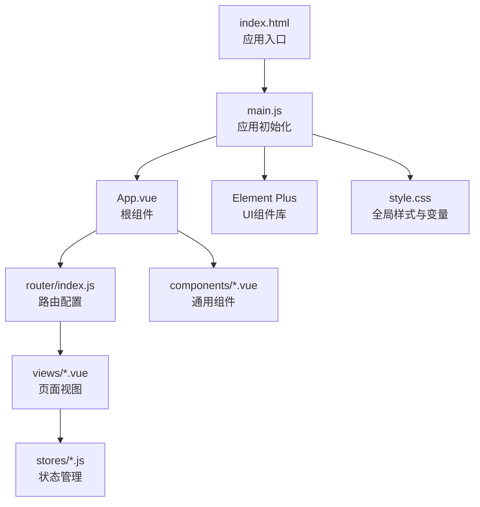
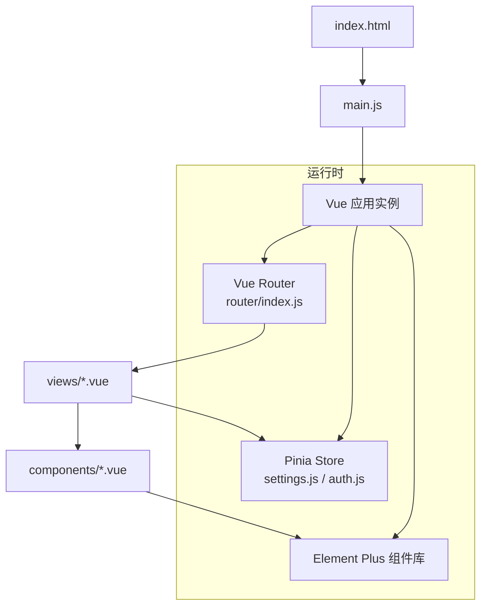
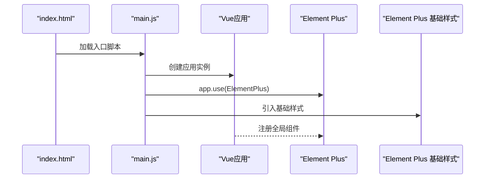
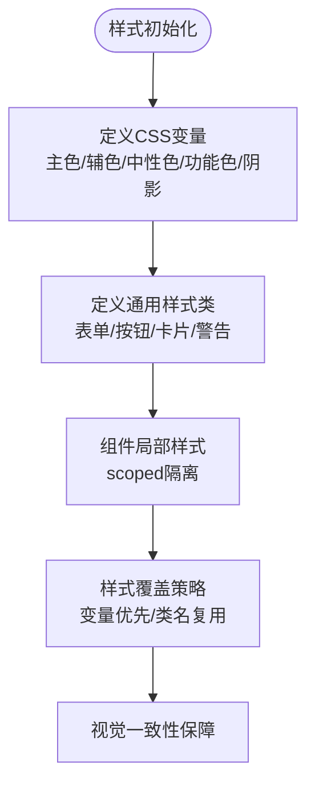
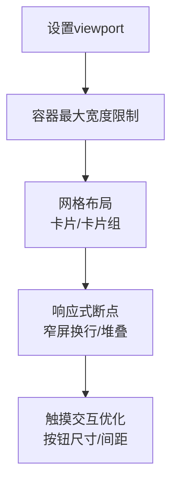
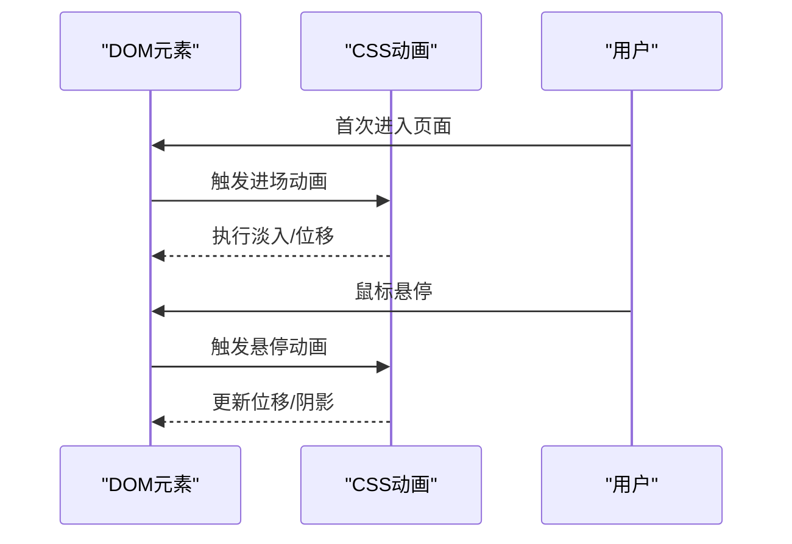
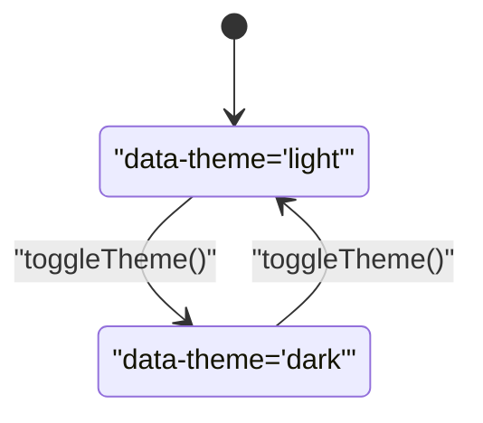
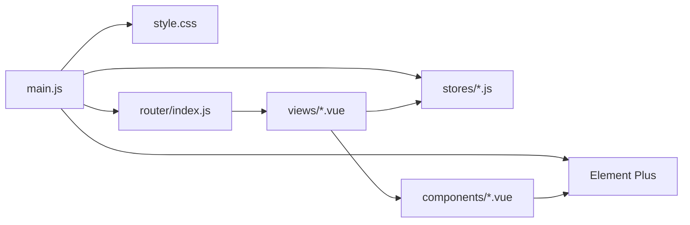

# UI设计系统

<cite>
**本文档引用的文件**
- [package.json](file://python-web/package.json)
- [vite.config.js](file://python-web/vite.config.js)
- [index.html](file://python-web/index.html)
- [main.js](file://python-web/src/main.js)
- [style.css](file://python-web/src/style.css)
- [App.vue](file://python-web/src/App.vue)
- [NavBar.vue](file://python-web/src/components/NavBar.vue)
- [StudentForm.vue](file://python-web/src/components/StudentForm.vue)
- [settings.js](file://python-web/src/stores/settings.js)
- [auth.js](file://python-web/src/stores/auth.js)
- [router/index.js](file://python-web/src/router/index.js)
- [Home.vue](file://python-web/src/views/Home.vue)
- [Login.vue](file://python-web/src/views/Login.vue)
</cite>

## 目录
1. [简介](#简介)
2. [项目结构](#项目结构)
3. [核心组件](#核心组件)
4. [架构总览](#架构总览)
5. [详细组件分析](#详细组件分析)
6. [依赖关系分析](#依赖关系分析)
7. [性能考虑](#性能考虑)
8. [故障排查指南](#故障排查指南)
9. [结论](#结论)
10. [附录](#附录)

## 简介
本项目为基于Vue 3与Vite的前端应用，采用Element Plus作为UI组件库，结合自定义CSS变量体系与渐进式动画，构建统一的设计语言与交互体验。系统支持主题切换（明/暗）、响应式布局、组件样式规范与可维护的样式组织方式，并通过Pinia进行状态管理，保障主题偏好与用户认证信息的持久化与跨页面共享。

## 项目结构
前端工程位于python-web目录，采用Vue单页应用架构，主要文件职责如下：
- 构建与环境：Vite配置、入口HTML、应用入口JS
- 核心样式：全局CSS变量与通用样式类
- 组件层：通用导航栏等可复用UI组件
- 视图层：页面级组件（如登录、首页）
- 状态管理：主题与用户认证状态
- 路由：页面路由与鉴权守卫

图表来源
- [index.html:1-13](file://python-web/index.html#L1-L13)
- [main.js:1-16](file://python-web/src/main.js#L1-L16)
- [router/index.js:1-150](file://python-web/src/router/index.js#L1-L150)
- [style.css:1-375](file://python-web/src/style.css#L1-L375)

章节来源
- [package.json:1-24](file://python-web/package.json#L1-L24)
- [vite.config.js:1-11](file://python-web/vite.config.js#L1-L11)
- [index.html:1-13](file://python-web/index.html#L1-L13)
- [main.js:1-16](file://python-web/src/main.js#L1-L16)

## 核心组件
- Element Plus集成：在应用入口引入Element Plus并加载其基础样式，确保全局组件可用。
- 全局样式与变量：通过CSS自定义属性定义主色、辅助色、中性色、功能色与阴影，形成统一设计令牌。
- 导航组件：提供响应式导航栏，包含下拉菜单、用户信息与登出流程。
- 页面组件：登录页与首页等页面组件，复用通用样式类与Element Plus组件。
- 状态管理：主题切换与用户认证状态持久化，支持跨页面共享。

章节来源
- [main.js:1-16](file://python-web/src/main.js#L1-L16)
- [style.css:1-375](file://python-web/src/style.css#L1-L375)
- [NavBar.vue:1-352](file://python-web/src/components/NavBar.vue#L1-L352)
- [Login.vue:1-121](file://python-web/src/views/Login.vue#L1-L121)
- [Home.vue:1-1055](file://python-web/src/views/Home.vue#L1-L1055)
- [settings.js:1-59](file://python-web/src/stores/settings.js#L1-L59)
- [auth.js:1-74](file://python-web/src/stores/auth.js#L1-L74)

## 架构总览
系统采用“入口初始化 → 路由分发 → 视图渲染 → 组件交互”的典型Vue SPA架构。Element Plus提供基础UI能力，全局CSS变量支撑视觉一致性，Pinia负责主题与用户状态管理，路由守卫保障访问控制。

图表来源
- [main.js:1-16](file://python-web/src/main.js#L1-L16)
- [router/index.js:1-150](file://python-web/src/router/index.js#L1-L150)
- [settings.js:1-59](file://python-web/src/stores/settings.js#L1-L59)
- [auth.js:1-74](file://python-web/src/stores/auth.js#L1-L74)

## 详细组件分析

### Element Plus集成与主题定制
- 全局引入：在应用入口导入Element Plus并加载其基础样式，保证全局组件可用。
- 主题变量：项目未显式覆盖Element Plus主题变量文件，采用默认主题；如需定制可在构建阶段引入自定义CSS变量覆盖文件或在应用内通过CSS变量进行补充覆盖。
- 组件使用：页面组件中直接使用Element Plus组件（如消息提示），遵循组件库的默认样式与交互行为。

图表来源
- [main.js:1-16](file://python-web/src/main.js#L1-L16)

章节来源
- [main.js:1-16](file://python-web/src/main.js#L1-L16)

### CSS变量体系与样式覆盖策略
- 设计令牌：通过CSS自定义属性定义主色、辅助色、中性色、功能色与阴影，形成统一的视觉语言。
- 通用样式类：提供表单、按钮、卡片、警告等通用样式类，便于组件快速复用。
- 样式覆盖：通过局部作用域样式与全局样式的组合，确保组件样式隔离与全局一致性的平衡。

图表来源
- [style.css:1-375](file://python-web/src/style.css#L1-L375)

章节来源
- [style.css:1-375](file://python-web/src/style.css#L1-L375)

### 响应式断点与布局系统
- 断点策略：导航组件在窄屏设备上启用换行与堆叠布局，确保移动端可用性。
- 布局容器：页面采用最大宽度约束与居中对齐，配合卡片与网格布局提升内容密度与层次感。
- 视口配置：HTML头部设置viewport元标签，确保移动端缩放与字体渲染一致性。

图表来源
- [index.html:1-13](file://python-web/index.html#L1-L13)
- [NavBar.vue:338-351](file://python-web/src/components/NavBar.vue#L338-L351)

章节来源
- [index.html:1-13](file://python-web/index.html#L1-L13)
- [NavBar.vue:338-351](file://python-web/src/components/NavBar.vue#L338-L351)

### 动画效果实现
- 进场动画：首页欢迎区域与功能卡片采用淡入与位移动画，配合缓动函数增强流畅度。
- 悬停反馈：卡片悬停时的位移与阴影变化，指示可交互性。
- 脉冲指示器：通知卡片的脉冲动画用于状态提示。
- 加载动画：登录页的旋转加载指示器，提升用户感知。

图表来源
- [Home.vue:394-520](file://python-web/src/views/Home.vue#L394-L520)
- [Home.vue:585-588](file://python-web/src/views/Home.vue#L585-L588)
- [Login.vue:270-285](file://python-web/src/views/Login.vue#L270-L285)

章节来源
- [Home.vue:394-520](file://python-web/src/views/Home.vue#L394-L520)
- [Home.vue:585-588](file://python-web/src/views/Home.vue#L585-L588)
- [Login.vue:270-285](file://python-web/src/views/Login.vue#L270-L285)

### 组件样式规范
- 表单控件：输入框统一边框、圆角、过渡与聚焦态，错误/成功态以颜色与背景区分。
- 按钮：主按钮采用渐变背景与阴影，悬停与激活态提供位移反馈；禁用态降低透明度。
- 卡片：统一圆角、阴影与背景，配合模糊滤镜与边框，营造层级感。
- 链接与文本：链接提供悬停下划线与颜色变化，文本对齐与间距保持一致性。

章节来源
- [style.css:87-232](file://python-web/src/style.css#L87-L232)

### 布局系统设计
- 页面容器：最大宽度约束与居中对齐，提供稳定的阅读与操作区域。
- 导航布局：固定顶部、模糊背景与分组链接，支持下拉菜单与用户信息展示。
- 内容网格：首页采用网格布局承载功能卡片与数据卡片，提升信息密度。

章节来源
- [style.css:61-65](file://python-web/src/style.css#L61-L65)
- [NavBar.vue:123-143](file://python-web/src/components/NavBar.vue#L123-L143)
- [Home.vue:494-499](file://python-web/src/views/Home.vue#L494-L499)

### 颜色体系定义
- 主色调：深邃蓝灰系，用于强调与品牌色，提供多级透明度与渐变支持。
- 辅助色：琥珀金，用于点缀与高亮。
- 中性色：从浅灰到深灰的完整谱系，满足背景、边框与文字层级。
- 功能色：成功、错误、警告，用于状态反馈与错误提示。
- 渐变：深色背景下的线性渐变，增强视觉层次。

章节来源
- [style.css:1-45](file://python-web/src/style.css#L1-L45)

### 暗色模式支持
- 切换机制：通过Pinia store维护主题状态，切换时写入本地存储并在根节点设置data-theme属性。
- 根节点标记：通过data-theme选择器可对不同主题应用差异化样式（当前项目未实现针对Element Plus的深色变量覆盖，建议在构建阶段引入对应CSS变量文件或在应用内补充覆盖规则）。

图表来源
- [settings.js:43-47](file://python-web/src/stores/settings.js#L43-L47)

章节来源
- [settings.js:1-59](file://python-web/src/stores/settings.js#L1-L59)

### 国际化样式处理
- 文案与排版：当前项目采用中文文案，未见专门的国际化样式处理逻辑；建议在需要时通过CSS逻辑（如dir属性）或组件层动态切换文本方向与字距调整。

（本节为概念性说明，不直接分析具体文件）

### 浏览器兼容性方案
- 现代特性：广泛使用CSS变量、backdrop-filter、CSS Grid与Flexbox，适用于主流现代浏览器。
- 字体平滑：开启webkit与moz字体平滑，提升文本可读性。
- 渐进增强：对不支持的特性提供降级方案（如无backdrop-filter时的纯色背景）。

章节来源
- [style.css:53-59](file://python-web/src/style.css#L53-L59)
- [NavBar.vue:128-130](file://python-web/src/components/NavBar.vue#L128-L130)

### 样式性能优化
- 变量驱动：集中定义CSS变量，减少重复计算与样式冲突。
- 局部作用域：组件scoped样式避免全局污染，同时控制样式体积。
- 动画优化：使用transform与opacity等可触发GPU加速的属性，减少重排重绘。
- 构建优化：通过Vite按需打包与Tree Shaking，减少未使用样式与脚本。

章节来源
- [vite.config.js:1-11](file://python-web/vite.config.js#L1-L11)
- [package.json:1-24](file://python-web/package.json#L1-L24)

### CSS模块化与组织
- 全局样式：集中于style.css，定义变量与通用类。
- 组件样式：每个组件独立scoped样式，避免样式泄漏。
- 视图样式：页面组件包含自身样式，便于按页面维度维护。

章节来源
- [style.css:1-375](file://python-web/src/style.css#L1-L375)
- [NavBar.vue:123-351](file://python-web/src/components/NavBar.vue#L123-L351)
- [Home.vue:359-1055](file://python-web/src/views/Home.vue#L359-L1055)

### 样式调试技巧
- 变量检查：在浏览器开发者工具中检查CSS变量是否正确生效。
- 作用域定位：利用scoped样式与组件层级快速定位问题样式。
- 动画调试：使用浏览器动画面板观察关键帧与性能指标。
- 移动端调试：通过设备模式与断点验证响应式表现。

（本节为通用实践说明，不直接分析具体文件）

## 依赖关系分析
- 应用入口依赖Element Plus与全局样式，路由与状态管理贯穿各页面。
- 组件依赖Element Plus基础样式与全局变量，确保视觉一致性。
- 路由守卫依赖认证状态，保障受保护页面的安全访问。

图表来源
- [main.js:1-16](file://python-web/src/main.js#L1-L16)
- [router/index.js:1-150](file://python-web/src/router/index.js#L1-L150)
- [settings.js:1-59](file://python-web/src/stores/settings.js#L1-L59)
- [auth.js:1-74](file://python-web/src/stores/auth.js#L1-L74)

章节来源
- [main.js:1-16](file://python-web/src/main.js#L1-L16)
- [router/index.js:1-150](file://python-web/src/router/index.js#L1-L150)
- [settings.js:1-59](file://python-web/src/stores/settings.js#L1-L59)
- [auth.js:1-74](file://python-web/src/stores/auth.js#L1-L74)

## 性能考虑
- 使用CSS变量与局部作用域样式，减少全局样式冲突与重绘。
- 合理使用transform与opacity动画，避免昂贵的布局与绘制属性。
- 通过Vite的按需加载与Tree Shaking，减少初始包体。
- 在移动端启用合适的断点与触摸目标尺寸，提升交互性能。

（本节提供通用指导，不直接分析具体文件）

## 故障排查指南
- 主题切换无效：检查store中的toggleTheme方法是否正确写入本地存储与根节点属性。
- 登录页样式异常：确认全局样式与组件scoped样式的优先级关系，避免意外覆盖。
- 导航在移动端显示错位：检查断点条件与flex布局参数，确保在窄屏下的自适应表现。

章节来源
- [settings.js:43-47](file://python-web/src/stores/settings.js#L43-L47)
- [Login.vue:1-121](file://python-web/src/views/Login.vue#L1-L121)
- [NavBar.vue:338-351](file://python-web/src/components/NavBar.vue#L338-L351)

## 结论
本UI设计系统以Element Plus为基础，结合统一的CSS变量体系与组件化样式组织，实现了清晰的主题切换、响应式布局与流畅的动画体验。通过Pinia的状态管理与路由守卫，保障了用户体验与安全性。建议后续在构建阶段引入Element Plus深色主题变量覆盖，进一步完善暗色模式的视觉一致性与可维护性。

## 附录
- Element Plus版本：2.9.0
- Vue版本：3.4.0
- Vite版本：4.0.0
- 构建与开发命令：dev/build/preview

章节来源
- [package.json:1-24](file://python-web/package.json#L1-L24)
- [vite.config.js:1-11](file://python-web/vite.config.js#L1-L11)