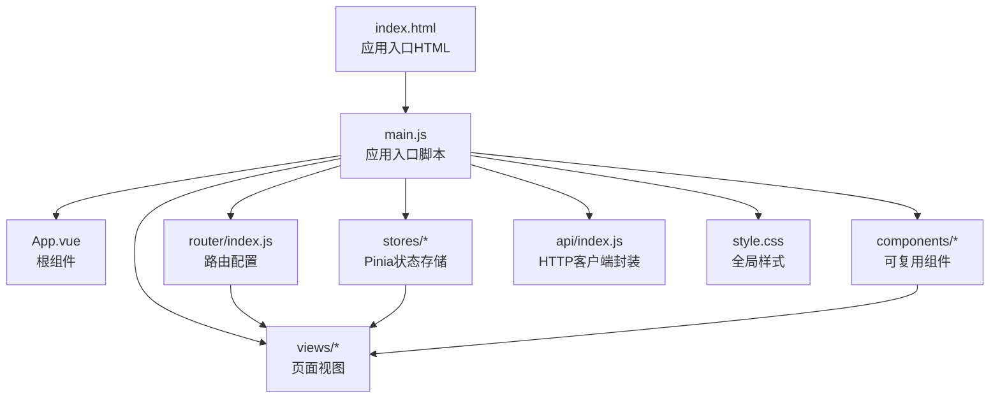
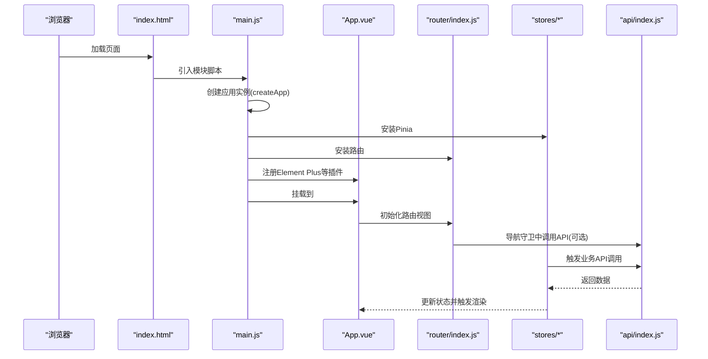
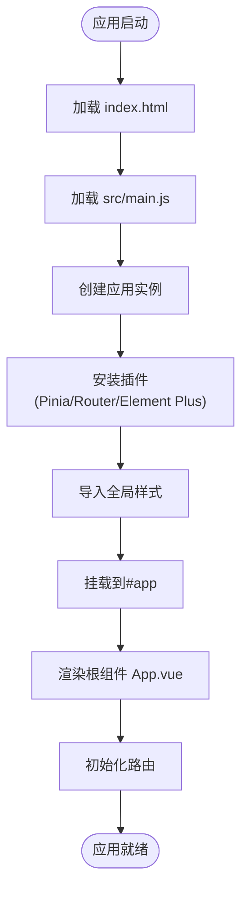
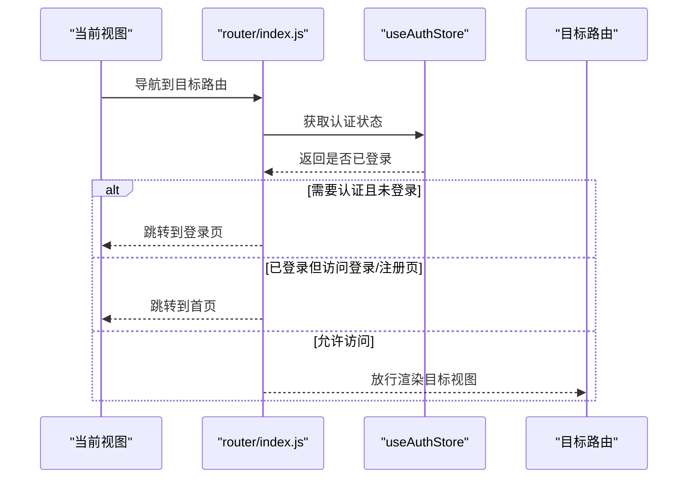
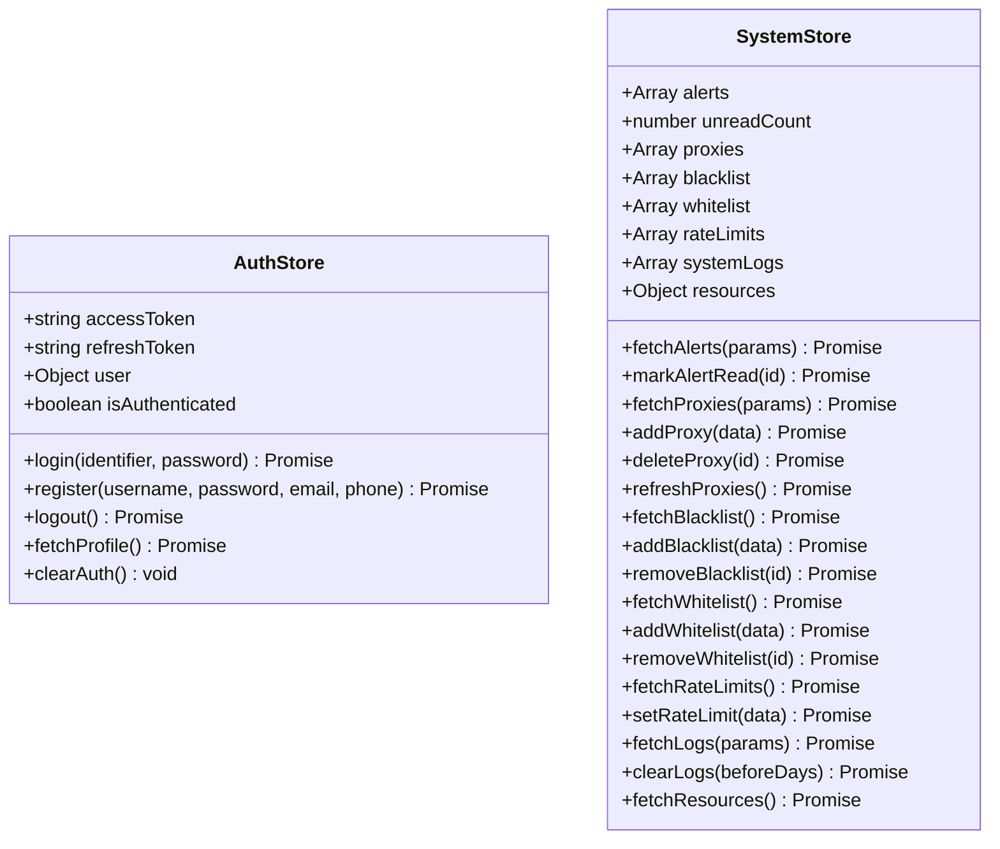
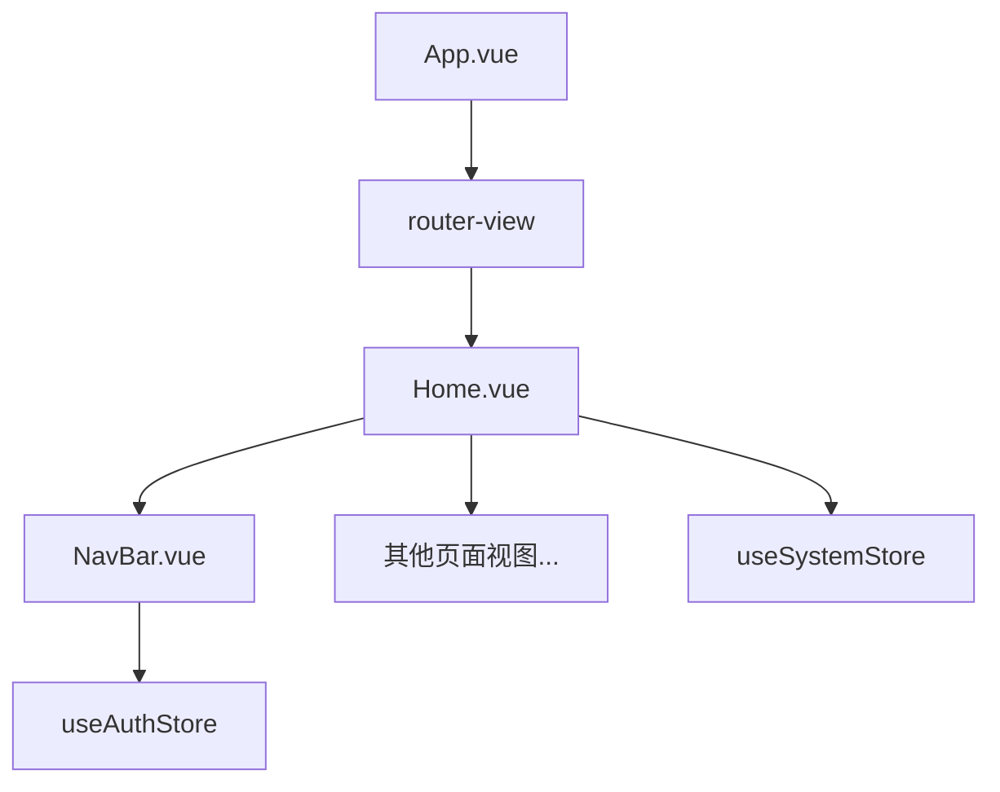
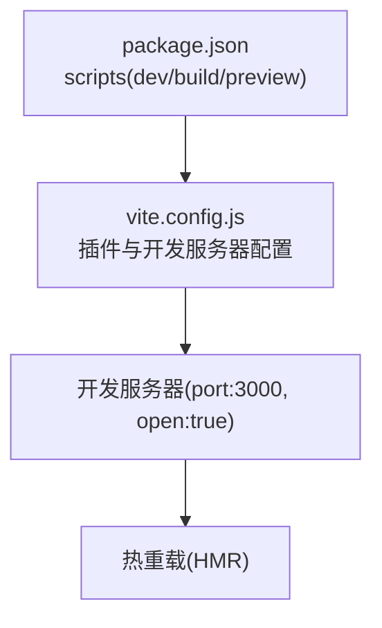
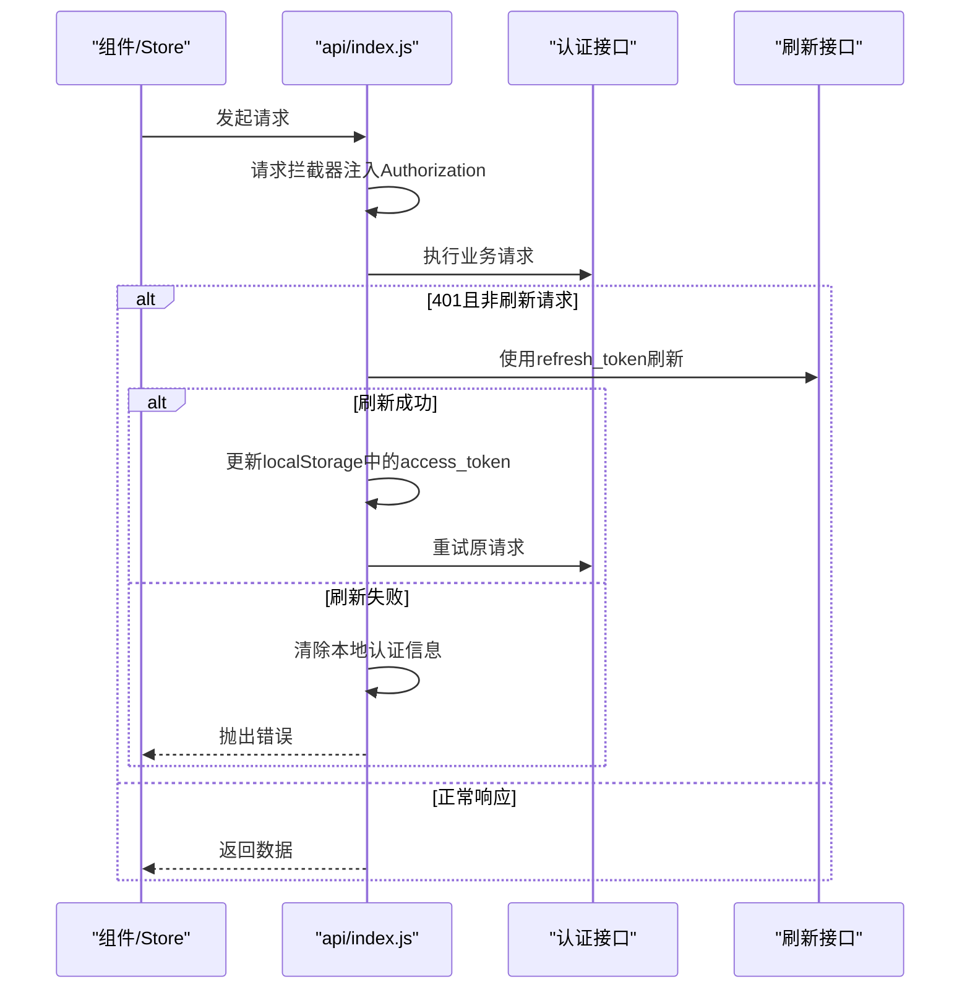
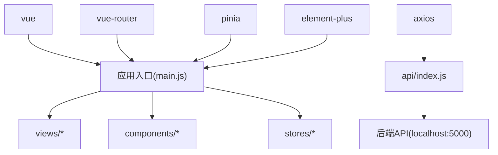

# Vue应用架构

<cite>
**本文档引用的文件**
- [package.json](file://python-web/package.json)
- [vite.config.js](file://python-web/vite.config.js)
- [index.html](file://python-web/index.html)
- [main.js](file://python-web/src/main.js)
- [App.vue](file://python-web/src/App.vue)
- [router/index.js](file://python-web/src/router/index.js)
- [stores/auth.js](file://python-web/src/stores/auth.js)
- [stores/system.js](file://python-web/src/stores/system.js)
- [components/NavBar.vue](file://python-web/src/components/NavBar.vue)
- [views/Home.vue](file://python-web/src/views/Home.vue)
- [api/index.js](file://python-web/src/api/index.js)
- [style.css](file://python-web/src/style.css)
</cite>

## 目录
1. [简介](#简介)
2. [项目结构](#项目结构)
3. [核心组件](#核心组件)
4. [架构总览](#架构总览)
5. [详细组件分析](#详细组件分析)
6. [依赖关系分析](#依赖关系分析)
7. [性能考虑](#性能考虑)
8. [故障排除指南](#故障排除指南)
9. [结论](#结论)
10. [附录](#附录)

## 简介
本文件面向希望深入理解Vue3应用整体架构的开发者，围绕应用初始化、应用实例创建、插件注册机制展开；同时覆盖Vite构建配置、开发服务器与热重载机制；并提供应用启动流程图、组件树结构说明、性能优化建议、构建产物分析与开发调试技巧。内容基于仓库中的实际代码进行梳理与可视化呈现。

## 项目结构
该Vue3前端项目采用典型的单页应用（SPA）组织方式，入口HTML通过模块脚本加载应用入口文件，应用通过Vue3运行时创建应用实例并挂载到DOM节点。路由采用Vue Router 4，状态管理采用Pinia，UI组件库使用Element Plus。

**图表来源**
- [index.html:1-13](file://python-web/index.html#L1-L13)
- [main.js:1-16](file://python-web/src/main.js#L1-L16)
- [App.vue:1-10](file://python-web/src/App.vue#L1-L10)
- [router/index.js:1-150](file://python-web/src/router/index.js#L1-L150)
- [stores/auth.js:1-74](file://python-web/src/stores/auth.js#L1-L74)
- [stores/system.js:1-168](file://python-web/src/stores/system.js#L1-L168)
- [components/NavBar.vue:1-352](file://python-web/src/components/NavBar.vue#L1-L352)
- [views/Home.vue:1-800](file://python-web/src/views/Home.vue#L1-L800)
- [api/index.js:1-95](file://python-web/src/api/index.js#L1-L95)
- [style.css:1-375](file://python-web/src/style.css#L1-L375)

**章节来源**
- [package.json:1-24](file://python-web/package.json#L1-L24)
- [vite.config.js:1-11](file://python-web/vite.config.js#L1-L11)
- [index.html:1-13](file://python-web/index.html#L1-L13)
- [main.js:1-16](file://python-web/src/main.js#L1-L16)

## 核心组件
- 应用入口与初始化
  - 入口HTML定义挂载点，通过模块脚本引入应用入口JS。
  - 入口JS负责创建Vue应用实例、安装插件（Pinia、Router、Element Plus）、导入全局样式并挂载应用。
- 路由系统
  - 基于History模式的路由配置，支持动态导入视图组件，并在导航守卫中实现鉴权控制。
- 状态管理
  - 使用Pinia定义多个store，包括认证store与系统store，提供异步API调用与本地持久化。
- 组件体系
  - 可复用组件如导航栏，页面视图组件丰富，配合Element Plus提供UI能力。
- API封装
  - 基于Axios封装统一的HTTP客户端，内置请求/响应拦截器，处理鉴权与自动刷新逻辑。

**章节来源**
- [main.js:1-16](file://python-web/src/main.js#L1-L16)
- [router/index.js:1-150](file://python-web/src/router/index.js#L1-L150)
- [stores/auth.js:1-74](file://python-web/src/stores/auth.js#L1-L74)
- [stores/system.js:1-168](file://python-web/src/stores/system.js#L1-L168)
- [components/NavBar.vue:1-352](file://python-web/src/components/NavBar.vue#L1-L352)
- [views/Home.vue:1-800](file://python-web/src/views/Home.vue#L1-L800)
- [api/index.js:1-95](file://python-web/src/api/index.js#L1-L95)

## 架构总览
下图展示了从浏览器加载到应用渲染的关键路径，以及插件注册与路由导航的核心交互。

**图表来源**
- [index.html:1-13](file://python-web/index.html#L1-L13)
- [main.js:1-16](file://python-web/src/main.js#L1-L16)
- [App.vue:1-10](file://python-web/src/App.vue#L1-L10)
- [router/index.js:1-150](file://python-web/src/router/index.js#L1-L150)
- [stores/auth.js:1-74](file://python-web/src/stores/auth.js#L1-L74)
- [stores/system.js:1-168](file://python-web/src/stores/system.js#L1-L168)
- [api/index.js:1-95](file://python-web/src/api/index.js#L1-L95)

## 详细组件分析

### 应用初始化与入口流程
- 初始化步骤
  - 在入口HTML中定义挂载点，通过模块脚本加载入口JS。
  - 入口JS创建Vue应用实例，安装Pinia、Router与Element Plus，导入全局样式，最后挂载到DOM。
- 插件注册机制
  - Pinia用于状态管理，提供响应式store。
  - Router用于页面导航与鉴权守卫。
  - Element Plus提供UI组件库与主题样式。
- 启动流程图

**图表来源**
- [index.html:1-13](file://python-web/index.html#L1-L13)
- [main.js:1-16](file://python-web/src/main.js#L1-L16)
- [App.vue:1-10](file://python-web/src/App.vue#L1-L10)

**章节来源**
- [index.html:1-13](file://python-web/index.html#L1-L13)
- [main.js:1-16](file://python-web/src/main.js#L1-L16)

### 路由系统与导航守卫
- 路由配置
  - 使用History模式，定义多条路由，部分路由标记requiresAuth元信息。
  - 路由组件采用动态导入以实现按需加载。
- 导航守卫
  - beforeEach中根据认证状态与路由元信息决定放行或跳转登录页。
  - 支持已登录用户访问登录/注册页时自动跳转首页。
- 路由序列图

**图表来源**
- [router/index.js:134-147](file://python-web/src/router/index.js#L134-L147)
- [stores/auth.js:1-74](file://python-web/src/stores/auth.js#L1-L74)

**章节来源**
- [router/index.js:1-150](file://python-web/src/router/index.js#L1-L150)
- [stores/auth.js:1-74](file://python-web/src/stores/auth.js#L1-L74)

### 状态管理（Pinia Store）
- 认证Store
  - 维护访问令牌、刷新令牌与用户信息，支持登录、注册、登出、获取个人资料等操作。
  - 使用localStorage进行持久化，便于刷新后恢复状态。
- 系统Store
  - 提供告警、代理、黑名单/白名单、速率限制、系统日志、资源信息等数据的获取与更新方法。
  - 将API调用结果映射到store状态，供视图组件订阅。
- Store类图

**图表来源**
- [stores/auth.js:1-74](file://python-web/src/stores/auth.js#L1-L74)
- [stores/system.js:1-168](file://python-web/src/stores/system.js#L1-L168)

**章节来源**
- [stores/auth.js:1-74](file://python-web/src/stores/auth.js#L1-L74)
- [stores/system.js:1-168](file://python-web/src/stores/system.js#L1-L168)

### 组件树结构说明
- 根组件App.vue
  - 作为路由出口容器，内部仅包含router-view，负责承载各页面视图。
- 页面视图组件
  - 如Home.vue等，组合使用可复用组件（如NavBar），并通过store与API交互。
- 可复用组件
  - NavBar.vue提供导航与用户操作，内部使用路由与认证store。
- 组件树示意

**图表来源**
- [App.vue:1-10](file://python-web/src/App.vue#L1-L10)
- [views/Home.vue:1-800](file://python-web/src/views/Home.vue#L1-L800)
- [components/NavBar.vue:1-352](file://python-web/src/components/NavBar.vue#L1-L352)
- [stores/auth.js:1-74](file://python-web/src/stores/auth.js#L1-L74)
- [stores/system.js:1-168](file://python-web/src/stores/system.js#L1-L168)

**章节来源**
- [App.vue:1-10](file://python-web/src/App.vue#L1-L10)
- [views/Home.vue:1-800](file://python-web/src/views/Home.vue#L1-L800)
- [components/NavBar.vue:1-352](file://python-web/src/components/NavBar.vue#L1-L352)

### Vite构建配置与开发服务器
- 构建脚本
  - package.json中定义了dev/build/preview脚本，分别对应Vite开发、生产构建与本地预览。
- 开发服务器
  - vite.config.js启用Vue插件，配置开发服务器端口与自动打开浏览器。
- 环境变量处理
  - 项目未显式配置Vite环境变量文件，API基础地址在API封装中硬编码为本地服务地址。
- Vite配置图

**图表来源**
- [package.json:1-24](file://python-web/package.json#L1-L24)
- [vite.config.js:1-11](file://python-web/vite.config.js#L1-L11)

**章节来源**
- [package.json:1-24](file://python-web/package.json#L1-L24)
- [vite.config.js:1-11](file://python-web/vite.config.js#L1-L11)

### API封装与鉴权拦截
- Axios实例
  - 创建带基础URL、超时与默认头的Axios实例。
- 请求拦截器
  - 自动从localStorage读取访问令牌并注入Authorization头。
- 响应拦截器
  - 处理401未授权错误，尝试使用刷新令牌刷新访问令牌；若失败则清除本地认证信息并跳转登录页。
- API交互序列图

**图表来源**
- [api/index.js:1-95](file://python-web/src/api/index.js#L1-L95)

**章节来源**
- [api/index.js:1-95](file://python-web/src/api/index.js#L1-L95)

## 依赖关系分析
- 运行时依赖
  - Vue3、Vue Router 4、Pinia、Element Plus、Axios。
- 开发时依赖
  - @vitejs/plugin-vue、vite。
- 依赖关系图

**图表来源**
- [package.json:11-22](file://python-web/package.json#L11-L22)
- [main.js:1-16](file://python-web/src/main.js#L1-L16)
- [api/index.js:1-95](file://python-web/src/api/index.js#L1-L95)

**章节来源**
- [package.json:1-24](file://python-web/package.json#L1-L24)

## 性能考虑
- 代码分割与懒加载
  - 路由组件采用动态导入，实现按需加载，减少首屏体积。
- 组件级样式作用域
  - 大量使用scoped样式，避免样式冲突，但需关注选择器复杂度。
- 图表与动画
  - 视图中使用SVG绘制图表与动画，建议在大数据量场景下考虑虚拟滚动或采样策略。
- 状态粒度
  - 将不同业务域拆分至独立store，降低不必要的响应式开销。
- 构建优化建议
  - 生产构建时开启压缩与Tree Shaking；合理配置静态资源缓存策略。
  - 对第三方UI库按需引入，避免全量打包。

[本节为通用性能指导，不直接分析具体文件，故无“章节来源”]

## 故障排除指南
- 登录后仍被重定向到登录页
  - 检查localStorage中是否存在有效的访问令牌与用户信息；确认导航守卫逻辑与路由元信息配置。
- 401错误频繁出现
  - 检查刷新令牌是否有效；确认响应拦截器是否正确处理刷新流程并更新localStorage。
- 开发服务器无法热重载
  - 确认Vite开发服务器端口未被占用；检查浏览器控制台是否有编译错误。
- 样式异常或组件显示问题
  - 检查全局样式与组件scoped样式的优先级；确认Element Plus主题样式是否正确引入。

**章节来源**
- [router/index.js:134-147](file://python-web/src/router/index.js#L134-L147)
- [api/index.js:22-59](file://python-web/src/api/index.js#L22-L59)
- [vite.config.js:6-9](file://python-web/vite.config.js#L6-L9)

## 结论
该Vue3应用采用清晰的分层架构：入口脚本负责应用实例创建与插件注册，路由系统结合导航守卫实现鉴权控制，Pinia提供模块化的状态管理，Element Plus与自定义组件构成UI层，Axios封装统一处理HTTP请求与鉴权刷新。Vite提供高效的开发体验与热重载能力。通过合理的代码分割、状态拆分与样式管理，应用具备良好的可维护性与扩展性。

[本节为总结性内容，不直接分析具体文件，故无“章节来源”]

## 附录
- 关键文件清单
  - 应用入口：index.html、main.js
  - 根组件：App.vue
  - 路由：router/index.js
  - 状态：stores/auth.js、stores/system.js
  - 组件：components/NavBar.vue、views/Home.vue
  - API：api/index.js
  - 样式：style.css
  - 构建：package.json、vite.config.js

[本节为概览性内容，不直接分析具体文件，故无“章节来源”]