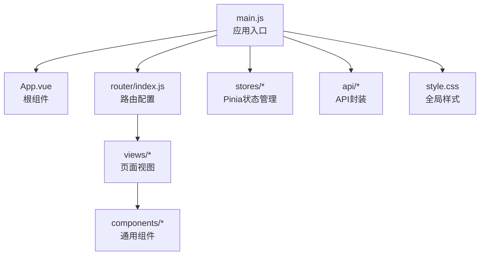
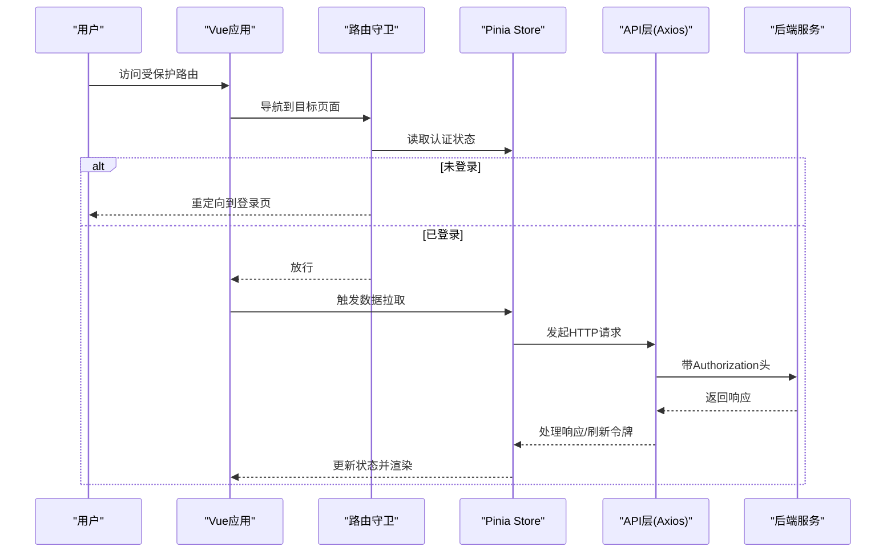
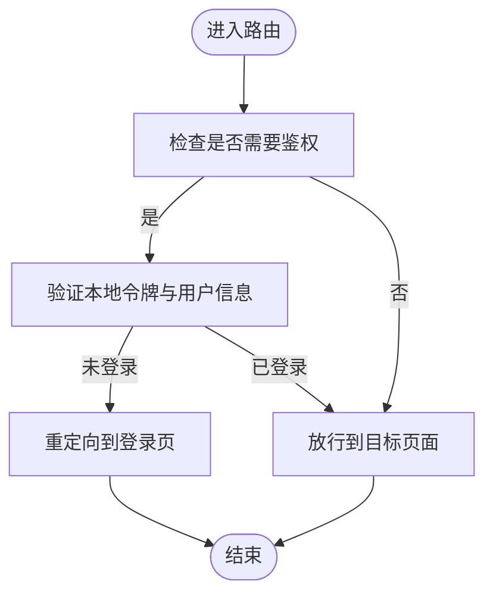
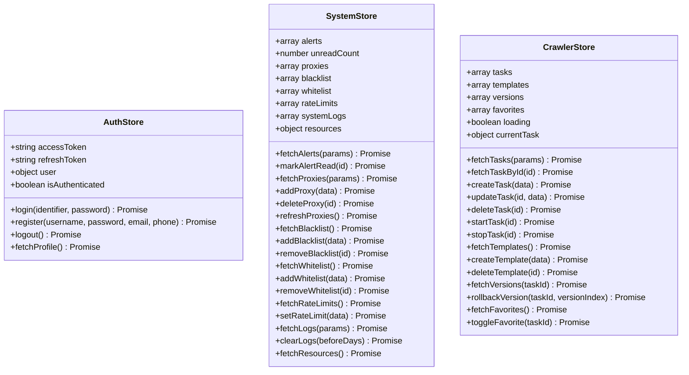
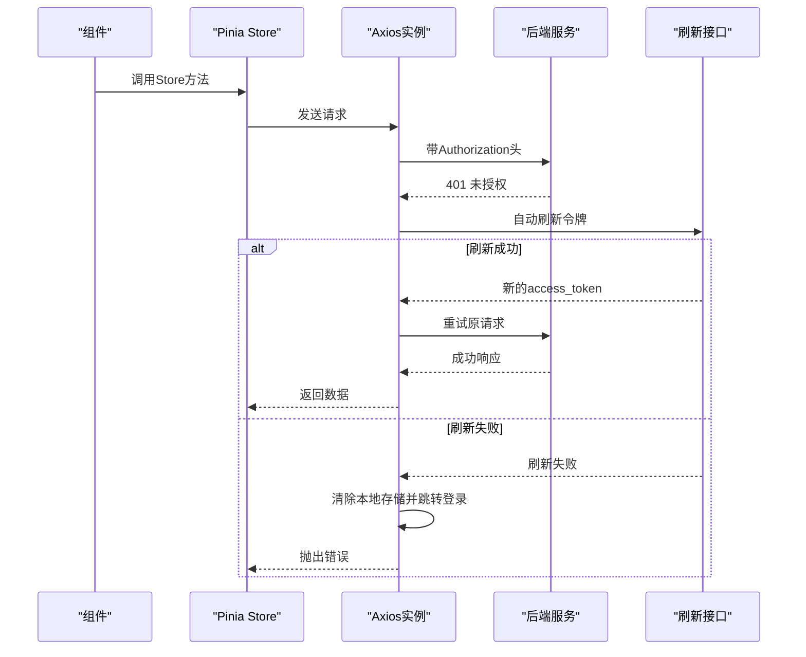
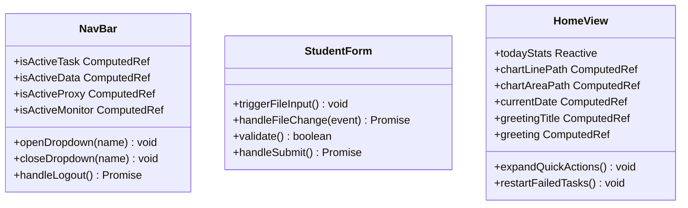
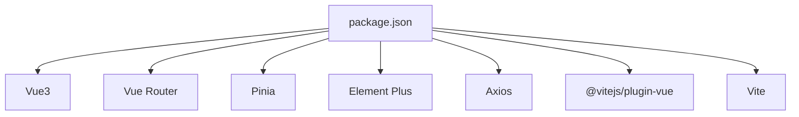

# 前端开发指南

<cite>
**本文档引用的文件**
- [package.json](file://python-web/package.json)
- [vite.config.js](file://python-web/vite.config.js)
- [main.js](file://python-web/src/main.js)
- [App.vue](file://python-web/src/App.vue)
- [style.css](file://python-web/src/style.css)
- [router/index.js](file://python-web/src/router/index.js)
- [stores/auth.js](file://python-web/src/stores/auth.js)
- [stores/system.js](file://python-web/src/stores/system.js)
- [stores/crawler.js](file://python-web/src/stores/crawler.js)
- [api/index.js](file://python-web/src/api/index.js)
- [api/alert.js](file://python-web/src/api/alert.js)
- [api/student.js](file://python-web/src/api/student.js)
- [components/NavBar.vue](file://python-web/src/components/NavBar.vue)
- [components/StudentForm.vue](file://python-web/src/components/StudentForm.vue)
- [views/Home.vue](file://python-web/src/views/Home.vue)
</cite>

## 目录
1. [简介](#简介)
2. [项目结构](#项目结构)
3. [核心组件](#核心组件)
4. [架构总览](#架构总览)
5. [详细组件分析](#详细组件分析)
6. [依赖关系分析](#依赖关系分析)
7. [性能考虑](#性能考虑)
8. [故障排除指南](#故障排除指南)
9. [结论](#结论)
10. [附录](#附录)

## 简介
本指南面向具备Vue.js基础的前端开发者，聚焦于基于Vue3 Composition API的现代前端开发实践。项目采用Vue3 + Pinia + Element Plus + Vue Router + Vite技术栈，结合Axios进行API通信，提供从组件设计到状态管理、路由配置、样式体系、响应式布局、错误处理与加载状态管理的完整开发规范与最佳实践。

## 项目结构
项目采用按功能域分层的组织方式：
- 根目录包含Python后端与前端子项目，前端位于 python-web 目录
- 前端采用单页应用结构，核心入口为 src/main.js，根组件为 src/App.vue
- 路由集中配置在 src/router/index.js，状态管理采用Pinia Store，API封装在 src/api 下
- 组件按功能拆分为通用组件与页面视图，如导航栏组件、表单组件等

**图表来源**
- [main.js:1-16](file://python-web/src/main.js#L1-L16)
- [App.vue:1-10](file://python-web/src/App.vue#L1-L10)
- [router/index.js:1-150](file://python-web/src/router/index.js#L1-L150)

**章节来源**
- [package.json:1-24](file://python-web/package.json#L1-L24)
- [vite.config.js:1-11](file://python-web/vite.config.js#L1-L11)
- [main.js:1-16](file://python-web/src/main.js#L1-L16)
- [App.vue:1-10](file://python-web/src/App.vue#L1-L10)

## 核心组件
本节概述项目的关键模块及其职责：
- 应用入口与插件注册：在入口文件中完成Vue实例创建、Pinia、路由、Element Plus的安装与挂载
- 全局样式与主题变量：通过CSS自定义属性定义主色调、辅助色、中性色、功能色与阴影，统一UI风格
- 路由守卫与权限控制：基于meta.requiresAuth与本地存储令牌实现登录态校验与跳转策略
- 状态管理：使用Composition API风格的Pinia Store，集中管理认证、系统资源、爬虫任务等状态
- API层：基于Axios封装请求与响应拦截器，自动注入Authorization头并处理401刷新逻辑
- 组件体系：通用组件（如导航栏）与页面视图（如首页）分离，组件间通过props/emit与store交互

**章节来源**
- [main.js:1-16](file://python-web/src/main.js#L1-L16)
- [style.css:1-375](file://python-web/src/style.css#L1-L375)
- [router/index.js:134-147](file://python-web/src/router/index.js#L134-L147)
- [stores/auth.js:1-74](file://python-web/src/stores/auth.js#L1-L74)
- [stores/system.js:1-168](file://python-web/src/stores/system.js#L1-L168)
- [stores/crawler.js:1-174](file://python-web/src/stores/crawler.js#L1-L174)
- [api/index.js:1-95](file://python-web/src/api/index.js#L1-L95)

## 架构总览
下图展示从前端到后端的整体调用链路与关键交互点：

**图表来源**
- [router/index.js:134-147](file://python-web/src/router/index.js#L134-L147)
- [stores/auth.js:10-28](file://python-web/src/stores/auth.js#L10-L28)
- [api/index.js:11-59](file://python-web/src/api/index.js#L11-L59)

## 详细组件分析

### 路由与权限控制
- 路由配置：采用动态导入视图组件，减少首屏体积；为需要鉴权的页面设置meta.requiresAuth
- 导航守卫：在beforeEach中检查本地存储中的令牌与用户信息，未登录时重定向至登录页；已登录访问登录/注册页则重定向至首页
- 登出流程：调用后端登出接口（若存在），清理本地存储并重定向

**图表来源**
- [router/index.js:4-127](file://python-web/src/router/index.js#L4-L127)
- [router/index.js:134-147](file://python-web/src/router/index.js#L134-L147)

**章节来源**
- [router/index.js:1-150](file://python-web/src/router/index.js#L1-L150)

### 状态管理（Pinia）
- 认证状态：使用ref维护令牌与用户信息，computed计算登录态；支持登录、注册、登出、获取资料
- 系统状态：集中管理告警、代理、黑名单/白名单、速率限制、系统日志、资源信息等
- 爬虫任务：管理任务列表、模板、版本回滚、收藏等

**图表来源**
- [stores/auth.js:5-73](file://python-web/src/stores/auth.js#L5-L73)
- [stores/system.js:7-167](file://python-web/src/stores/system.js#L7-L167)
- [stores/crawler.js:5-173](file://python-web/src/stores/crawler.js#L5-L173)

**章节来源**
- [stores/auth.js:1-74](file://python-web/src/stores/auth.js#L1-L74)
- [stores/system.js:1-168](file://python-web/src/stores/system.js#L1-L168)
- [stores/crawler.js:1-174](file://python-web/src/stores/crawler.js#L1-L174)

### API层与错误处理
- Axios实例：统一baseURL、超时、Content-Type；请求拦截器自动附加Authorization头
- 响应拦截器：处理401未授权，尝试刷新令牌；刷新失败或非刷新接口再次401时清空本地存储并跳转登录
- 模块化API：按业务拆分模块（如alert、student），便于维护与复用

**图表来源**
- [api/index.js:11-59](file://python-web/src/api/index.js#L11-L59)

**章节来源**
- [api/index.js:1-95](file://python-web/src/api/index.js#L1-L95)
- [api/alert.js:1-35](file://python-web/src/api/alert.js#L1-L35)
- [api/student.js:1-102](file://python-web/src/api/student.js#L1-L102)

### 组件设计模式
- 导航栏组件：使用Composition API管理下拉菜单状态、路由高亮与用户信息展示；通过事件触发登出
- 表单组件：通过props接收数据，watch监听变化；内置校验规则与文件上传逻辑；通过emit向上抛出提交事件
- 页面视图：以Home为例，组合多个卡片与图表，使用计算属性生成图表路径，提供问候语与统计数据展示

**图表来源**
- [components/NavBar.vue:84-121](file://python-web/src/components/NavBar.vue#L84-L121)
- [components/StudentForm.vue:70-201](file://python-web/src/components/StudentForm.vue#L70-L201)
- [views/Home.vue:269-357](file://python-web/src/views/Home.vue#L269-L357)

**章节来源**
- [components/NavBar.vue:1-352](file://python-web/src/components/NavBar.vue#L1-L352)
- [components/StudentForm.vue:1-201](file://python-web/src/components/StudentForm.vue#L1-L201)
- [views/Home.vue:1-1055](file://python-web/src/views/Home.vue#L1-L1055)

### 样式管理与响应式设计
- 设计系统：通过CSS自定义属性定义主色调、辅助色、中性色、功能色与阴影，确保主题一致性
- 通用样式类：提供表单、按钮、卡片、提示等通用样式，便于复用
- 响应式断点：在导航栏组件中针对窄屏设备调整布局与间距
- 视觉效果：使用渐变背景、毛玻璃效果、阴影与动画增强用户体验

**章节来源**
- [style.css:1-375](file://python-web/src/style.css#L1-L375)
- [components/NavBar.vue:338-352](file://python-web/src/components/NavBar.vue#L338-L352)

### 与后端API的集成方式
- 统一基地址：前端通过Axios实例设置baseURL，所有API调用基于相对路径
- 认证集成：请求拦截器自动附加Authorization头；响应拦截器处理401并刷新令牌
- 模块化封装：按业务拆分API模块，如告警、学生、任务等，便于扩展与维护
- 文件上传：提供独立的上传与导出函数，支持Blob下载与Content-Disposition解析

**章节来源**
- [api/index.js:3-9](file://python-web/src/api/index.js#L3-L9)
- [api/student.js:59-102](file://python-web/src/api/student.js#L59-L102)

## 依赖关系分析
- 运行时依赖：Vue3、Vue Router、Pinia、Element Plus、Axios
- 开发依赖：Vite、@vitejs/plugin-vue
- 插件与工具：Vite作为构建工具，Element Plus提供UI组件库

**图表来源**
- [package.json:11-22](file://python-web/package.json#L11-L22)

**章节来源**
- [package.json:1-24](file://python-web/package.json#L1-L24)

## 性能考虑
- 代码分割：路由采用动态导入，减少首屏加载体积
- 组件懒加载：视图组件按需加载，提升初始渲染速度
- 状态缓存：Pinia Store集中管理数据，避免重复请求
- 图表优化：使用SVG绘制图表，减少DOM节点与重绘开销
- 样式优化：统一使用CSS变量与原子化类名，降低样式体积与冲突

## 故障排除指南
- 登录后仍被重定向到登录页
  - 检查本地存储中access_token与user是否存在
  - 确认路由守卫逻辑与meta.requiresAuth配置
- 401未授权频繁出现
  - 检查响应拦截器刷新逻辑与后端刷新接口
  - 确认刷新令牌是否有效且未过期
- 请求超时或网络错误
  - 检查baseURL与网络连通性
  - 查看请求头Authorization是否正确注入
- 文件上传失败
  - 检查文件类型与大小限制
  - 确认后端上传接口与CORS配置

**章节来源**
- [router/index.js:134-147](file://python-web/src/router/index.js#L134-L147)
- [api/index.js:22-59](file://python-web/src/api/index.js#L22-L59)
- [components/StudentForm.vue:128-161](file://python-web/src/components/StudentForm.vue#L128-L161)

## 结论
本指南总结了Vue3前端项目的开发实践，涵盖路由、状态管理、API集成、组件设计与样式体系等方面。建议在实际开发中遵循本文档的规范与最佳实践，持续优化性能与可维护性，确保团队协作的一致性与效率。

## 附录
- 开发环境启动：使用Vite提供的dev命令启动本地服务，默认端口3000
- 构建与预览：使用build与preview命令进行生产构建与本地预览
- Element Plus集成：在入口文件中安装Element Plus即可全局使用其组件与图标

**章节来源**
- [vite.config.js:4-10](file://python-web/vite.config.js#L4-L10)
- [main.js:3-14](file://python-web/src/main.js#L3-L14)