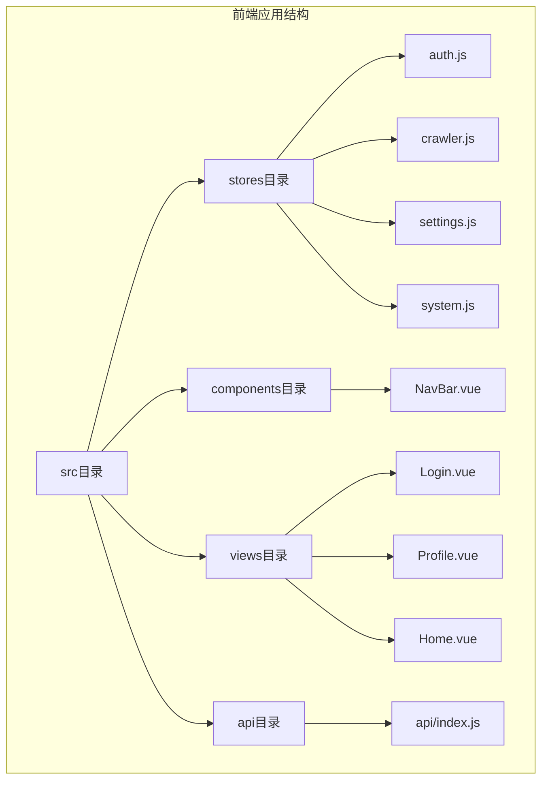
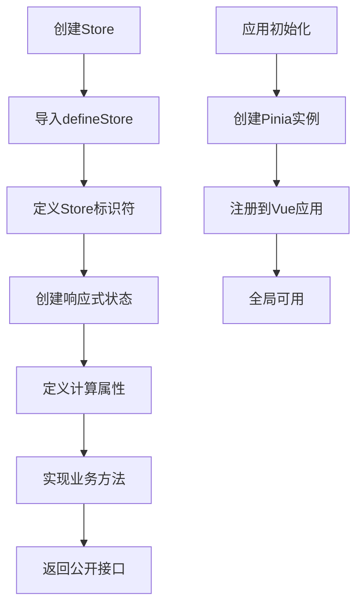
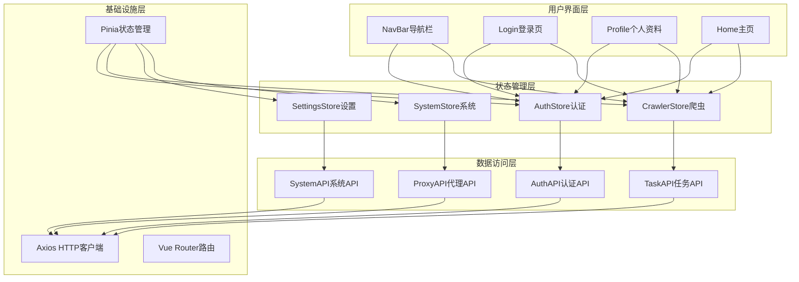
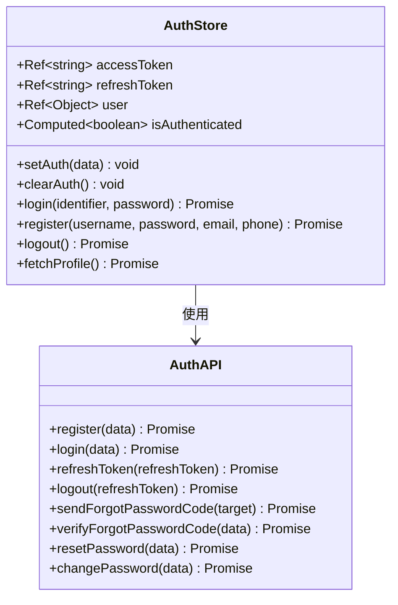
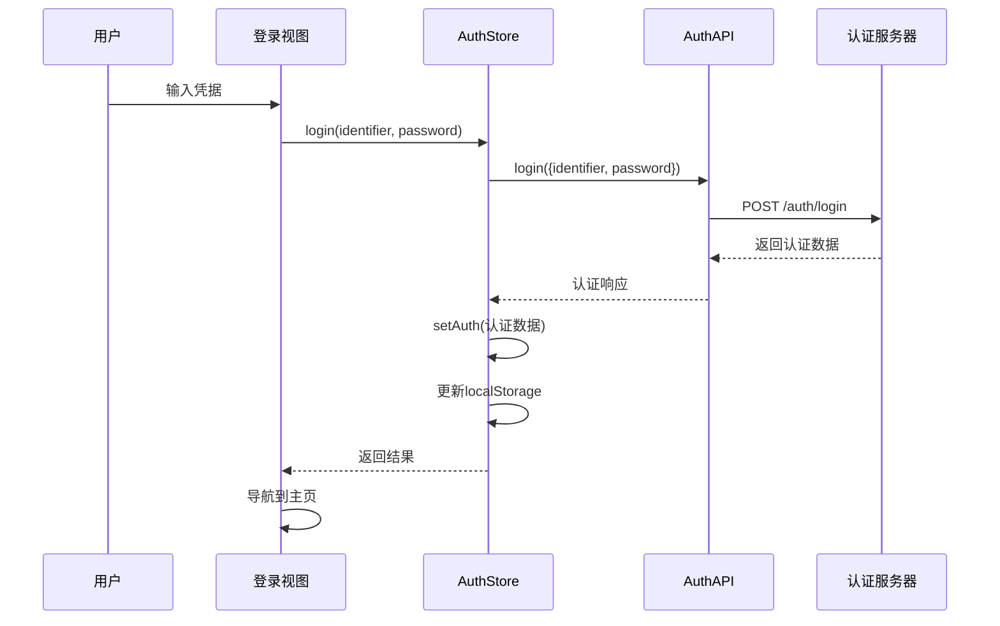
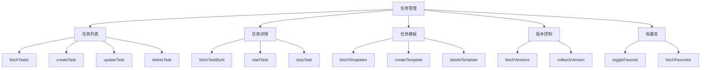
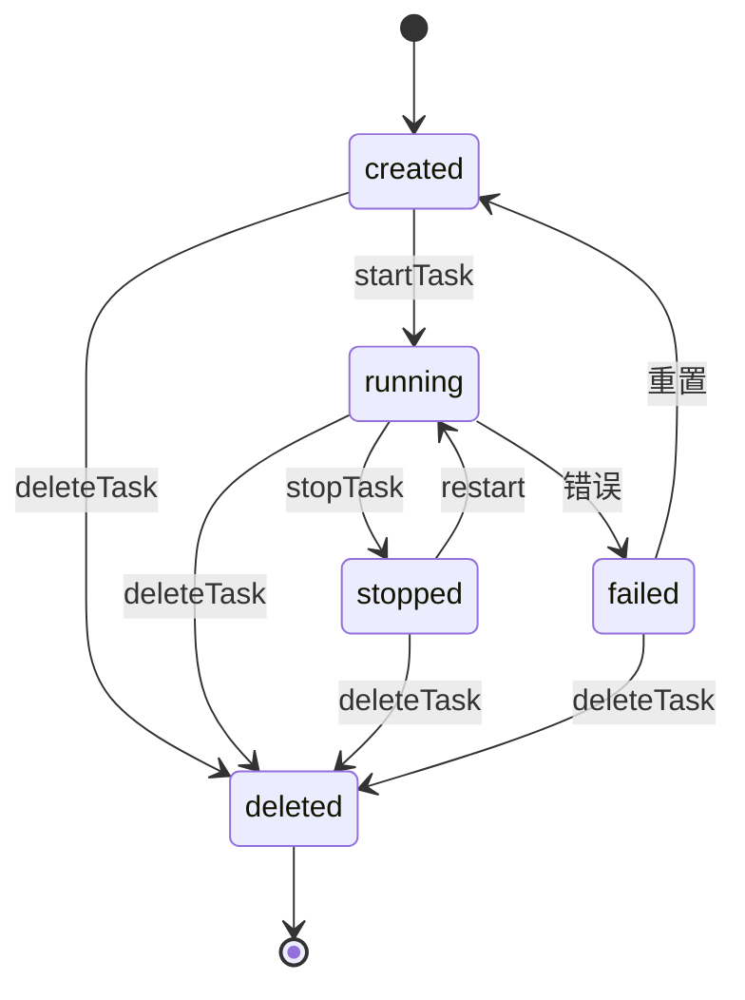
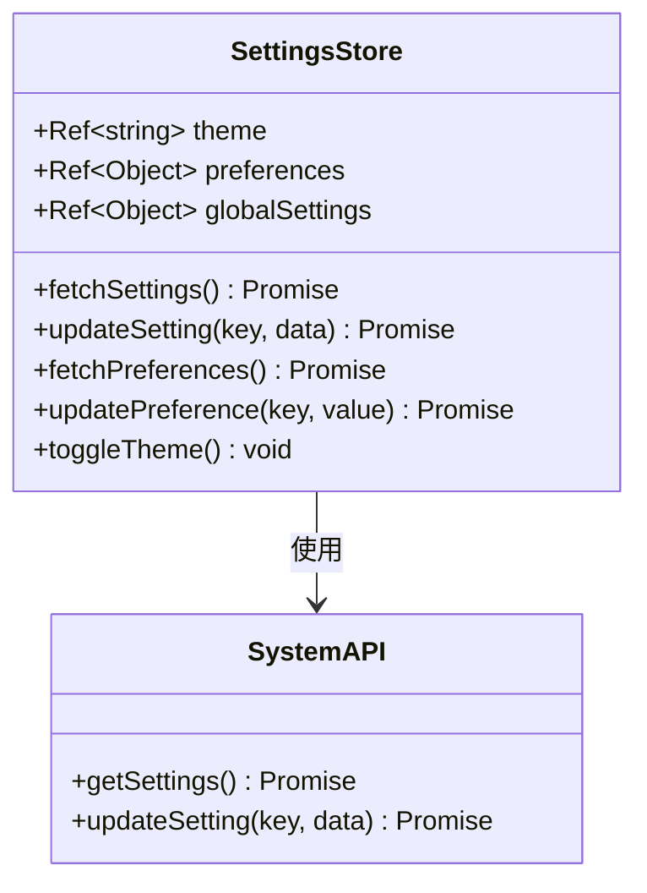
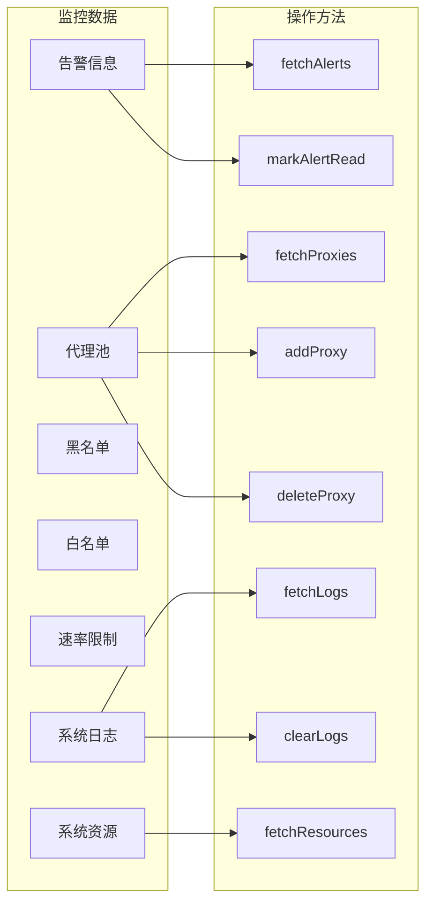
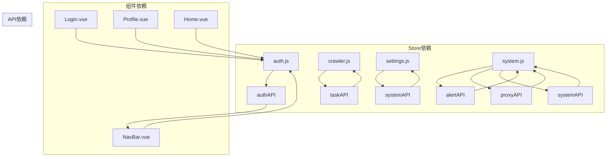

# Store设计模式

<cite>
**本文档引用的文件**
- [auth.js](file://python-web/src/stores/auth.js)
- [crawler.js](file://python-web/src/stores/crawler.js)
- [settings.js](file://python-web/src/stores/settings.js)
- [system.js](file://python-web/src/stores/system.js)
- [main.js](file://python-web/src/main.js)
- [index.js](file://python-web/src/api/index.js)
- [NavBar.vue](file://python-web/src/components/NavBar.vue)
- [Login.vue](file://python-web/src/views/Login.vue)
- [Profile.vue](file://python-web/src/views/Profile.vue)
- [Home.vue](file://python-web/src/views/Home.vue)
- [package.json](file://python-web/package.json)
</cite>

## 目录
1. [简介](#简介)
2. [项目结构](#项目结构)
3. [核心组件](#核心组件)
4. [架构概览](#架构概览)
5. [详细组件分析](#详细组件分析)
6. [依赖关系分析](#依赖关系分析)
7. [性能考虑](#性能考虑)
8. [故障排除指南](#故障排除指南)
9. [结论](#结论)

## 简介

本项目展示了现代Vue 3应用中Pinia状态管理的最佳实践。通过四个核心Store模块（认证、爬虫任务、系统设置、系统监控），演示了如何使用Composition API模式构建可维护、可扩展的状态管理解决方案。

Pinia作为Vue 3官方推荐的状态管理库，提供了TypeScript友好的API、直观的开发体验和强大的功能特性。本项目采用defineStore函数配合Composition API，实现了响应式状态管理、计算属性、异步操作等核心功能。

## 项目结构

项目采用模块化的Store组织方式，每个功能域都有独立的Store文件，便于维护和扩展：

**图表来源**
- [main.js:1-16](file://python-web/src/main.js#L1-L16)
- [auth.js:1-74](file://python-web/src/stores/auth.js#L1-L74)
- [crawler.js:1-174](file://python-web/src/stores/crawler.js#L1-L174)

**章节来源**
- [main.js:1-16](file://python-web/src/main.js#L1-L16)
- [package.json:1-24](file://python-web/package.json#L1-L24)

## 核心组件

### Store创建与初始化

项目中的所有Store都遵循统一的创建模式，使用defineStore函数配合Composition API：

**图表来源**
- [auth.js:5-73](file://python-web/src/stores/auth.js#L5-L73)
- [main.js:9-15](file://python-web/src/main.js#L9-L15)

### 响应式状态管理

所有Store都使用ref和computed来创建响应式状态：

| Store类型 | 状态类型 | 示例状态 |
|-----------|----------|----------|
| 认证Store | 用户信息、令牌 | `accessToken`, `refreshToken`, `user` |
| 爬虫Store | 任务列表、模板 | `tasks`, `templates`, `versions` |
| 设置Store | 主题、偏好设置 | `theme`, `preferences`, `globalSettings` |
| 系统Store | 警报、代理池 | `alerts`, `proxies`, `systemLogs` |

**章节来源**
- [auth.js:6-28](file://python-web/src/stores/auth.js#L6-L28)
- [crawler.js:6-11](file://python-web/src/stores/crawler.js#L6-L11)
- [settings.js:6-8](file://python-web/src/stores/settings.js#L6-L8)
- [system.js:8-15](file://python-web/src/stores/system.js#L8-L15)

## 架构概览

项目采用分层架构设计，Store层负责状态管理，API层处理数据访问，组件层负责UI逻辑：

**图表来源**
- [NavBar.vue:84-121](file://python-web/src/components/NavBar.vue#L84-L121)
- [Login.vue:66-121](file://python-web/src/views/Login.vue#L66-L121)
- [Profile.vue:145-280](file://python-web/src/views/Profile.vue#L145-L280)
- [auth.js:1-4](file://python-web/src/stores/auth.js#L1-L4)
- [index.js:61-95](file://python-web/src/api/index.js#L61-L95)

## 详细组件分析

### 认证Store分析

认证Store是整个应用的核心，负责用户身份验证和会话管理：

**图表来源**
- [auth.js:5-73](file://python-web/src/stores/auth.js#L5-L73)
- [index.js:61-86](file://python-web/src/api/index.js#L61-L86)

#### 认证流程序列图

**图表来源**
- [Login.vue:100-119](file://python-web/src/views/Login.vue#L100-L119)
- [auth.js:30-41](file://python-web/src/stores/auth.js#L30-L41)
- [index.js:65-67](file://python-web/src/api/index.js#L65-L67)

**章节来源**
- [auth.js:1-74](file://python-web/src/stores/auth.js#L1-L74)
- [Login.vue:66-121](file://python-web/src/views/Login.vue#L66-L121)

### 爬虫任务Store分析

爬虫任务Store管理任务生命周期和相关操作：

**图表来源**
- [crawler.js:5-174](file://python-web/src/stores/crawler.js#L5-L174)

#### 任务状态转换图

**图表来源**
- [crawler.js:68-94](file://python-web/src/stores/crawler.js#L68-L94)

**章节来源**
- [crawler.js:1-174](file://python-web/src/stores/crawler.js#L1-L174)

### 系统设置Store分析

系统设置Store负责主题切换和用户偏好管理：

**图表来源**
- [settings.js:5-59](file://python-web/src/stores/settings.js#L5-L59)
- [index.js:113-114](file://python-web/src/api/index.js#L113-L114)

**章节来源**
- [settings.js:1-59](file://python-web/src/stores/settings.js#L1-L59)

### 系统监控Store分析

系统监控Store管理告警、代理和系统资源：

**图表来源**
- [system.js:7-168](file://python-web/src/stores/system.js#L7-L168)

**章节来源**
- [system.js:1-168](file://python-web/src/stores/system.js#L1-L168)

## 依赖关系分析

### 外部依赖

项目使用的主要依赖包括：

| 依赖包 | 版本 | 用途 |
|--------|------|------|
| vue | ^3.4.0 | 前端框架 |
| pinia | ^2.1.0 | 状态管理 |
| vue-router | ^4.2.0 | 路由管理 |
| axios | ^1.6.0 | HTTP客户端 |
| element-plus | ^2.9.0 | UI组件库 |

### 内部依赖关系

**图表来源**
- [auth.js:1-3](file://python-web/src/stores/auth.js#L1-L3)
- [crawler.js:1-3](file://python-web/src/stores/crawler.js#L1-L3)
- [settings.js:1-3](file://python-web/src/stores/settings.js#L1-L3)
- [system.js:1-5](file://python-web/src/stores/system.js#L1-L5)

**章节来源**
- [package.json:11-18](file://python-web/package.json#L11-L18)

## 性能考虑

### 响应式更新优化

1. **细粒度更新**：使用ref而非reactive，避免不必要的深度监听
2. **计算属性缓存**：利用computed的自动缓存机制
3. **批量更新**：在异步操作中合理使用loading状态

### 存储策略

1. **本地存储同步**：关键状态同时写入localStorage
2. **内存优先**：优先使用内存状态，必要时持久化
3. **清理策略**：定期清理过期数据

### 网络请求优化

1. **请求去重**：避免重复发起相同请求
2. **错误重试**：实现智能的错误重试机制
3. **超时控制**：设置合理的请求超时时间

## 故障排除指南

### 常见问题及解决方案

#### 认证问题
- **问题**：登录后状态不更新
- **原因**：localStorage未正确更新
- **解决**：检查setAuth方法的localStorage写入逻辑

#### 异步操作问题
- **问题**：loading状态不消失
- **原因**：finally块执行异常
- **解决**：确保所有异步操作都有正确的finally处理

#### 数据同步问题
- **问题**：UI与实际数据不一致
- **原因**：状态更新时机不当
- **解决**：使用Vue的响应式系统确保数据驱动更新

**章节来源**
- [auth.js:12-28](file://python-web/src/stores/auth.js#L12-L28)
- [crawler.js:13-22](file://python-web/src/stores/crawler.js#L13-L22)

## 结论

本项目展示了Pinia在Vue 3应用中的最佳实践，通过四个核心Store模块演示了：

1. **模块化设计**：按功能域划分Store，提高代码可维护性
2. **响应式状态管理**：充分利用Vue 3的响应式系统
3. **Composition API优势**：提供更好的TypeScript支持和代码组织
4. **异步操作处理**：合理处理网络请求和错误处理
5. **状态持久化**：结合localStorage实现状态持久化

这些模式为构建大型Vue应用提供了清晰的指导原则，既适合初学者理解Pinia核心概念，也为高级开发者提供了优化Store设计的参考方案。