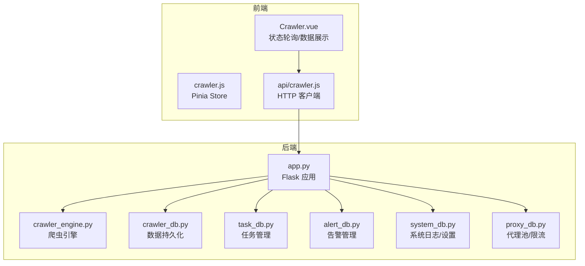
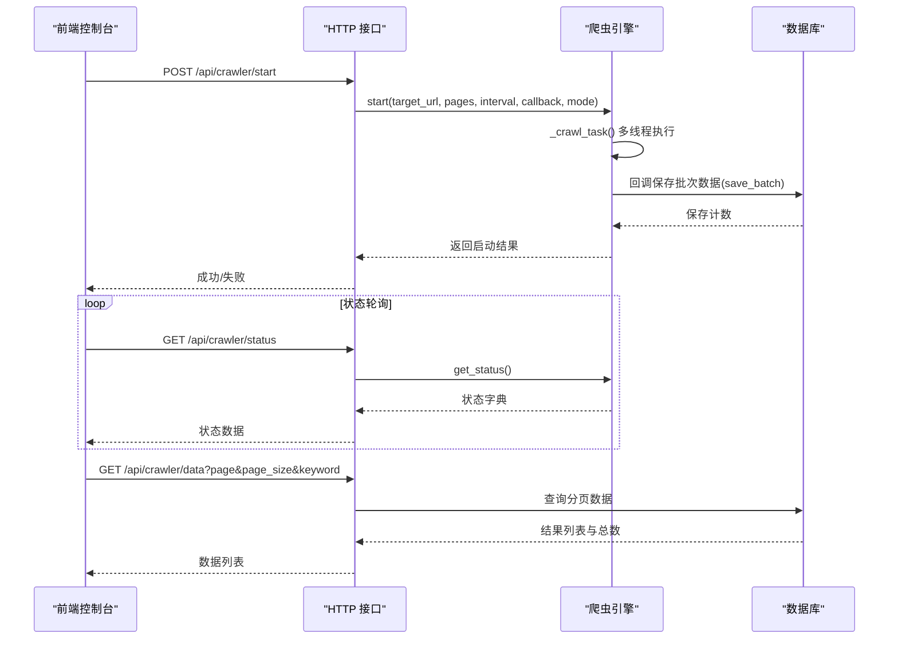
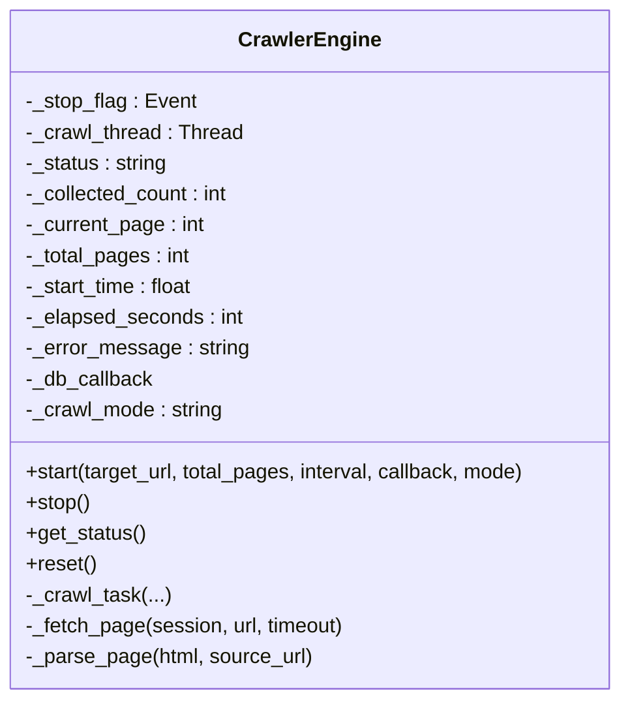
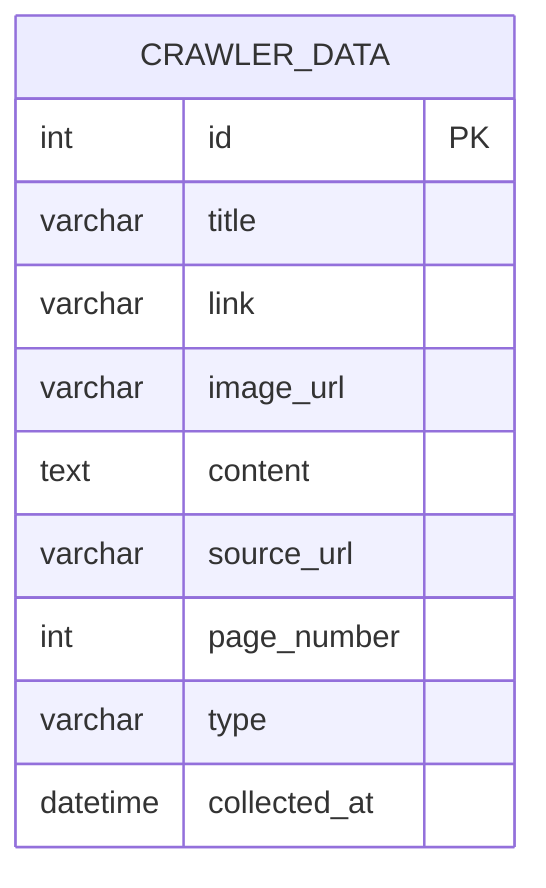
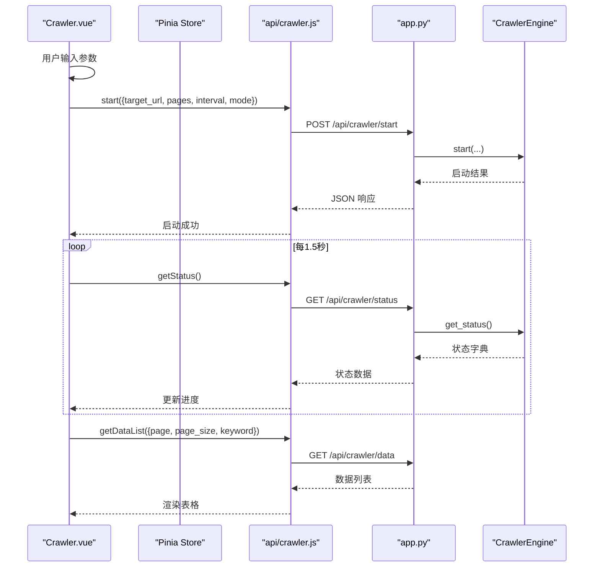
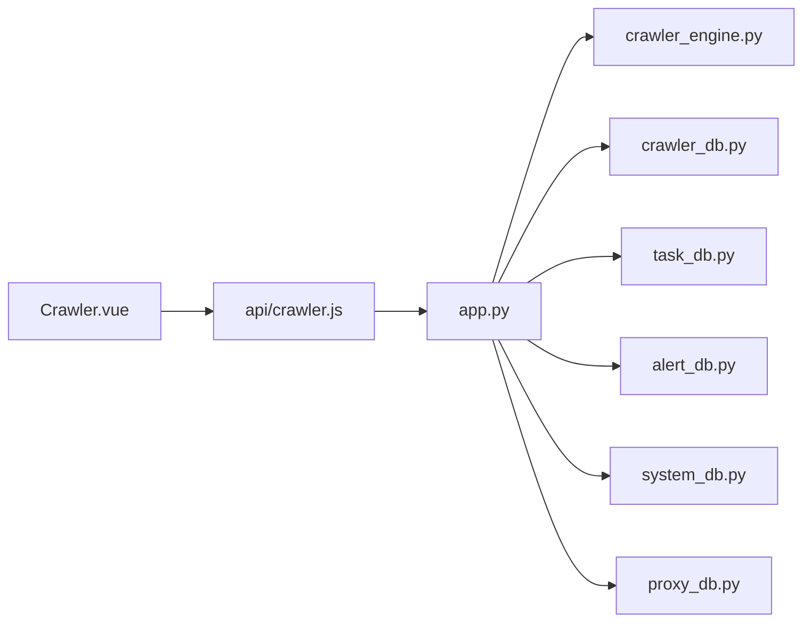

# 爬虫状态管理

<cite>
**本文档引用的文件**
- [crawler_engine.py](file://python/crawler_engine.py)
- [crawler_db.py](file://python/crawler_db.py)
- [task_db.py](file://python/task_db.py)
- [app.py](file://python/app.py)
- [Crawler.vue](file://python-web/src/views/Crawler.vue)
- [crawler.js](file://python-web/src/stores/crawler.js)
- [crawler.js](file://python-web/src/api/crawler.js)
- [alert_db.py](file://python/alert_db.py)
- [system_db.py](file://python/system_db.py)
- [proxy_db.py](file://python/proxy_db.py)
</cite>

## 目录
1. [简介](#简介)
2. [项目结构](#项目结构)
3. [核心组件](#核心组件)
4. [架构概览](#架构概览)
5. [详细组件分析](#详细组件分析)
6. [依赖关系分析](#依赖关系分析)
7. [性能考量](#性能考量)
8. [故障排查指南](#故障排查指南)
9. [结论](#结论)

## 简介
本项目提供了一个完整的爬虫状态管理系统，涵盖爬虫任务的启动/停止控制、状态跟踪与实时更新、结果缓存与持久化、错误恢复与告警、以及前端可视化界面。系统采用多线程异步爬取，支持链接与图片两类采集模式，并通过数据库实现结果缓存与查询。

## 项目结构
后端由 Flask 提供 REST API，包含爬虫引擎、数据库层、任务管理、告警与系统监控等模块；前端基于 Vue 3 + Element Plus 提供可视化控制台，支持状态轮询、数据列表展示与导出。

**图表来源**
- [app.py](file://python/app.py)
- [Crawler.vue](file://python-web/src/views/Crawler.vue)
- [crawler.js](file://python-web/src/api/crawler.js)

**章节来源**
- [app.py](file://python/app.py)
- [Crawler.vue](file://python-web/src/views/Crawler.vue)

## 核心组件
- 爬虫引擎（CrawlerEngine）：负责多线程爬取、UA/请求头伪装、请求延时、页面解析与结果回调。
- 数据库层（CrawlerDB）：提供批量保存、分页查询、清空与导出功能。
- 任务管理（TaskDB）：任务生命周期管理、模板与版本控制、收藏与调度。
- 前端控制台（Crawler.vue + Pinia Store + API）：状态轮询、参数配置、数据展示与导出。
- 告警与系统监控（AlertDB、SystemDB、ProxyDB）：告警规则与记录、系统日志、代理池与速率限制。

**章节来源**
- [crawler_engine.py](file://python/crawler_engine.py)
- [crawler_db.py](file://python/crawler_db.py)
- [task_db.py](file://python/task_db.py)
- [Crawler.vue](file://python-web/src/views/Crawler.vue)
- [crawler.js](file://python-web/src/stores/crawler.js)
- [crawler.js](file://python-web/src/api/crawler.js)
- [alert_db.py](file://python/alert_db.py)
- [system_db.py](file://python/system_db.py)
- [proxy_db.py](file://python/proxy_db.py)

## 架构概览
系统采用前后端分离架构：前端通过 HTTP 接口与后端交互，后端提供爬虫控制、状态查询、数据持久化与任务管理等能力。状态更新通过定时轮询实现，保证前端实时显示爬取进度与结果。

**图表来源**
- [app.py](file://python/app.py)
- [crawler_engine.py](file://python/crawler_engine.py)
- [crawler_db.py](file://python/crawler_db.py)
- [Crawler.vue](file://python-web/src/views/Crawler.vue)

## 详细组件分析

### 爬虫引擎（CrawlerEngine）
- 多线程爬取：使用线程事件标志控制停止，避免强制中断。
- 请求策略：随机 UA/请求头、延时与重试，针对 403/5xx 等错误进行退避处理。
- 解析能力：支持链接与图片提取，含多种懒加载与背景图场景。
- 状态属性：运行状态、已采集数、当前页/总页数、耗时、错误信息。
- 控制接口：启动、停止、状态查询、重置。

**图表来源**
- [crawler_engine.py](file://python/crawler_engine.py)

**章节来源**
- [crawler_engine.py](file://python/crawler_engine.py)

### 数据持久化（CrawlerDB）
- 表结构：包含标题、链接、图片 URL、内容摘要、来源 URL、页码、类型、采集时间等字段。
- 批量保存：逐条插入并统计实际保存数，兼容旧表结构自动补列。
- 查询接口：分页查询、关键字过滤、总数统计。
- 清空与导出：清空表、全量导出 CSV。

**图表来源**
- [crawler_db.py](file://python/crawler_db.py)

**章节来源**
- [crawler_db.py](file://python/crawler_db.py)

### 任务管理（TaskDB）
- 任务表：名称、目标 URL、状态、Cron 表达式、并发、间隔、重试、代理组、告警规则、配置、用户 ID。
- 模板与版本：模板创建/删除/查询、任务版本保存与回滚。
- 收藏与调度：收藏任务、按状态/关键词筛选。

**章节来源**
- [task_db.py](file://python/task_db.py)

### 前端控制台（Crawler.vue + Pinia Store + API）
- 参数配置：目标网址、页数、请求间隔、爬取模式。
- 状态轮询：每 1.5 秒轮询一次状态，动态更新进度与耗时。
- 数据展示：分页表格、图片预览、类型标签、采集时间。
- 操作按钮：开始/停止/清空/导出。

**图表来源**
- [Crawler.vue](file://python-web/src/views/Crawler.vue)
- [crawler.js](file://python-web/src/stores/crawler.js)
- [crawler.js](file://python-web/src/api/crawler.js)
- [app.py](file://python/app.py)
- [crawler_engine.py](file://python/crawler_engine.py)

**章节来源**
- [Crawler.vue](file://python-web/src/views/Crawler.vue)
- [crawler.js](file://python-web/src/stores/crawler.js)
- [crawler.js](file://python-web/src/api/crawler.js)

### 告警与系统监控
- 告警规则：类型（失败/超时/数据异常/IP 封禁）、阈值、启用状态。
- 告警记录：任务关联、规则关联、消息、是否已读、创建时间。
- 系统日志：级别、来源、消息、时间。
- 代理池与限流：代理 IP、协议、状态、成功率、存活时长、分组映射、速率限制配置。

**章节来源**
- [alert_db.py](file://python/alert_db.py)
- [system_db.py](file://python/system_db.py)
- [proxy_db.py](file://python/proxy_db.py)

## 依赖关系分析
- 后端 Flask 应用依赖爬虫引擎与数据库层，提供统一的 REST 接口。
- 前端通过封装的 API 模块与后端通信，状态轮询与数据渲染解耦。
- 数据库层独立管理表结构与连接，支持扩展与迁移。

**图表来源**
- [app.py](file://python/app.py)
- [crawler_engine.py](file://python/crawler_engine.py)
- [crawler_db.py](file://python/crawler_db.py)
- [task_db.py](file://python/task_db.py)
- [alert_db.py](file://python/alert_db.py)
- [system_db.py](file://python/system_db.py)
- [proxy_db.py](file://python/proxy_db.py)
- [Crawler.vue](file://python-web/src/views/Crawler.vue)
- [crawler.js](file://python-web/src/api/crawler.js)

**章节来源**
- [app.py](file://python/app.py)

## 性能考量
- 异步与并发：爬取在独立线程中执行，避免阻塞主线程；建议结合代理池与速率限制控制并发与请求频率。
- 内存管理：解析阶段使用 BeautifulSoup 并对结果进行批处理保存，减少大对象驻留内存；前端分页加载避免一次性渲染过多数据。
- 状态更新：前端每 1.5 秒轮询一次状态，可根据任务规模调整轮询周期以平衡实时性与资源消耗。
- 数据库写入：批量保存时逐条插入并统计保存数，建议在高并发场景下评估数据库写入压力并考虑分批提交或异步写入。

[本节为通用指导，无需特定文件引用]

## 故障排查指南
- 启动失败：检查目标 URL 格式、页数与间隔参数范围；查看后端返回的错误码与消息。
- 爬取异常：关注状态接口中的错误信息字段，定位具体页码与错误类型（如 403/超时/解析失败）。
- 数据缺失：确认解析模式（链接/图片/混合）与目标站点结构变化；检查数据库保存回调是否抛出异常。
- 前端无状态更新：检查轮询定时器是否正常启动与停止，确认网络连通性与跨域配置。
- 告警与日志：通过告警记录与系统日志定位异常根因，结合代理池状态与速率限制配置优化策略。

**章节来源**
- [app.py](file://python/app.py)
- [Crawler.vue](file://python-web/src/views/Crawler.vue)
- [alert_db.py](file://python/alert_db.py)
- [system_db.py](file://python/system_db.py)
- [proxy_db.py](file://python/proxy_db.py)

## 结论
本系统提供了从爬取控制、状态跟踪、结果缓存到前端可视化的完整链路。通过多线程异步爬取与数据库持久化，配合前端轮询与分页展示，能够满足复杂爬虫任务的状态管理需求。建议在生产环境中结合代理池与限流策略，完善告警与日志体系，持续优化性能与稳定性。