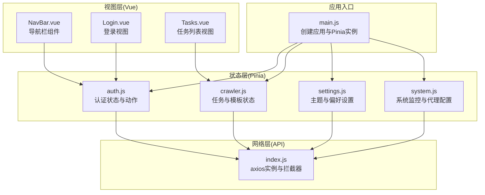
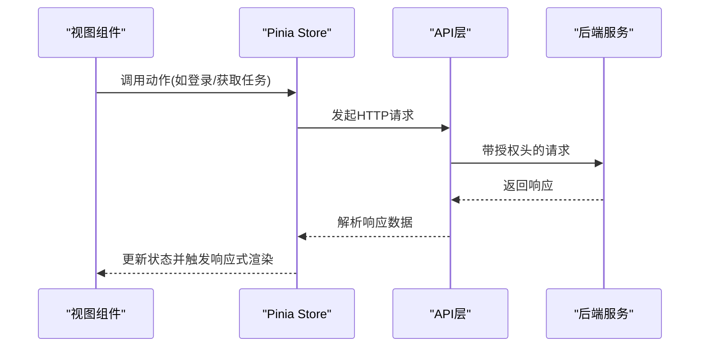
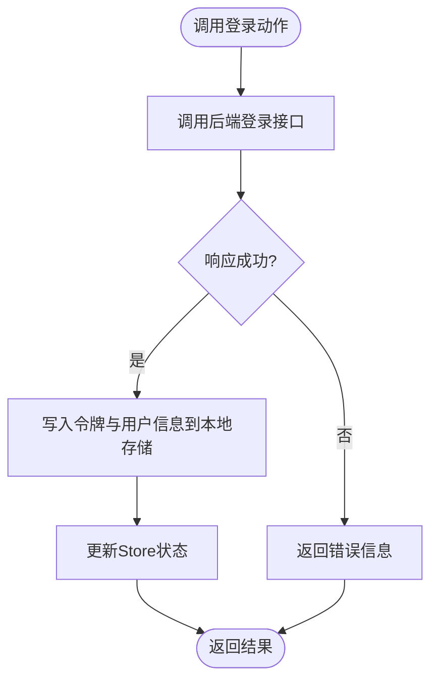
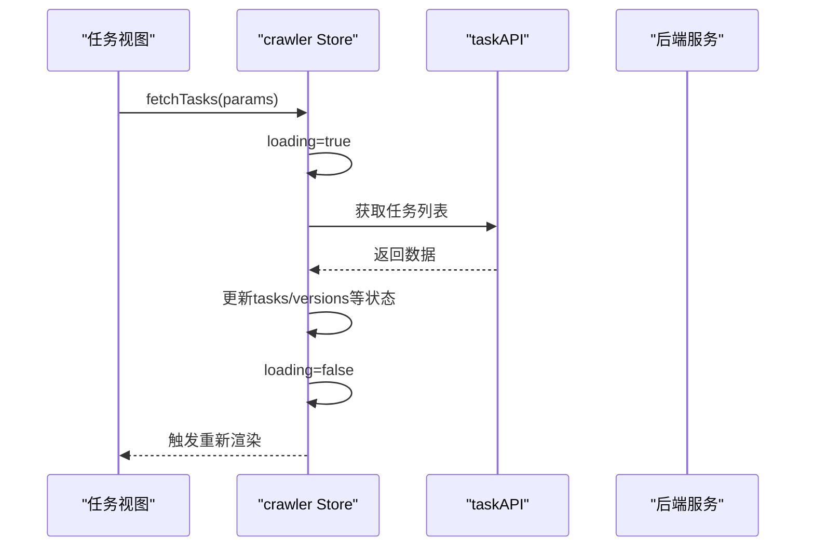
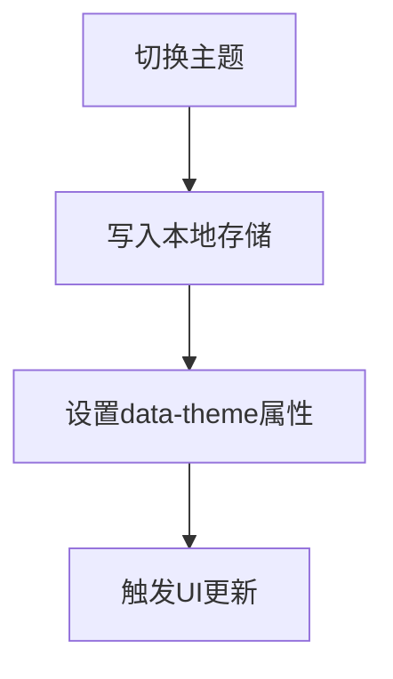
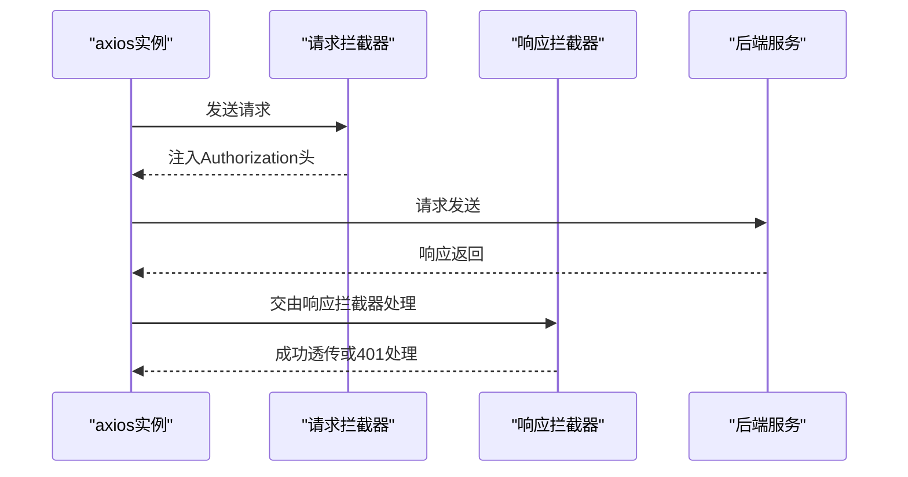
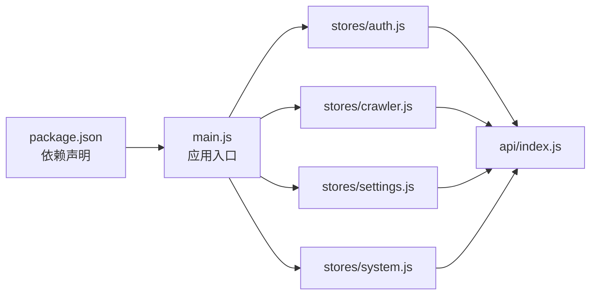

# 状态管理

<cite>
**本文引用的文件**
- [main.js](file://python-web/src/main.js)
- [auth.js](file://python-web/src/stores/auth.js)
- [crawler.js](file://python-web/src/stores/crawler.js)
- [settings.js](file://python-web/src/stores/settings.js)
- [system.js](file://python-web/src/stores/system.js)
- [index.js](file://python-web/src/api/index.js)
- [NavBar.vue](file://python-web/src/components/NavBar.vue)
- [Login.vue](file://python-web/src/views/Login.vue)
- [Tasks.vue](file://python-web/src/views/Tasks.vue)
- [package.json](file://python-web/package.json)
</cite>

## 目录
1. [简介](#简介)
2. [项目结构](#项目结构)
3. [核心组件](#核心组件)
4. [架构总览](#架构总览)
5. [详细组件分析](#详细组件分析)
6. [依赖关系分析](#依赖关系分析)
7. [性能考虑](#性能考虑)
8. [故障排查指南](#故障排查指南)
9. [结论](#结论)
10. [附录](#附录)

## 简介
本文件面向学习者，系统讲解基于 Pinia 的状态管理实践，围绕 Store 设计模式、状态定义、动作函数实现展开；覆盖模块化 Store 组织、状态持久化与同步、异步 Action 处理、状态派生计算、Store 间通信、调试与性能监控、内存泄漏预防、与 Vue 组件的绑定与响应式更新、以及状态重置策略等主题。内容以仓库中的真实代码为依据，配合可视化图示帮助理解。

## 项目结构
该前端项目采用 Vue 3 + Vite + Pinia 架构，状态管理集中在 src/stores 目录下，每个模块对应一个功能域 Store；API 层通过统一的 axios 实例封装请求与拦截器；应用入口在 main.js 中初始化 Pinia 并挂载到根组件。

图表来源
- [main.js:1-16](file://python-web/src/main.js#L1-L16)
- [auth.js:1-74](file://python-web/src/stores/auth.js#L1-L74)
- [crawler.js:1-174](file://python-web/src/stores/crawler.js#L1-L174)
- [settings.js:1-59](file://python-web/src/stores/settings.js#L1-L59)
- [system.js:1-168](file://python-web/src/stores/system.js#L1-L168)
- [index.js:1-95](file://python-web/src/api/index.js#L1-L95)
- [NavBar.vue:1-352](file://python-web/src/components/NavBar.vue#L1-L352)
- [Login.vue:1-121](file://python-web/src/views/Login.vue#L1-L121)
- [Tasks.vue:1-852](file://python-web/src/views/Tasks.vue#L1-L852)

章节来源
- [main.js:1-16](file://python-web/src/main.js#L1-L16)
- [package.json:1-24](file://python-web/package.json#L1-L24)

## 核心组件
- 应用入口与状态容器
  - 在入口文件中创建应用与 Pinia 实例，并将其注入到应用上下文中，确保所有组件可访问全局状态。
- 认证 Store(auth)
  - 负责令牌存储与用户信息持久化、登录/注册/登出、拉取个人资料等动作。
- 爬虫任务 Store(crawler)
  - 管理任务列表、模板、版本、收藏、当前任务及加载状态；提供增删改查与启停控制等异步动作。
- 设置 Store(settings)
  - 管理主题切换与本地持久化、全局设置与用户偏好的读取与更新。
- 系统 Store(system)
  - 管理告警、代理、黑白名单、速率限制、系统日志与资源信息等系统级数据与动作。
- API 层(index)
  - 统一的 axios 实例，内置请求/响应拦截器，处理鉴权头注入与 401 自动刷新逻辑。

章节来源
- [main.js:1-16](file://python-web/src/main.js#L1-L16)
- [auth.js:1-74](file://python-web/src/stores/auth.js#L1-L74)
- [crawler.js:1-174](file://python-web/src/stores/crawler.js#L1-L174)
- [settings.js:1-59](file://python-web/src/stores/settings.js#L1-L59)
- [system.js:1-168](file://python-web/src/stores/system.js#L1-L168)
- [index.js:1-95](file://python-web/src/api/index.js#L1-L95)

## 架构总览
Pinia 在本项目中承担“单一事实来源”的角色：各页面与组件通过 Store 暴露的状态与动作进行交互，API 层负责与后端通信，拦截器统一处理鉴权与错误。

图表来源
- [Login.vue:100-119](file://python-web/src/views/Login.vue#L100-L119)
- [auth.js:30-51](file://python-web/src/stores/auth.js#L30-L51)
- [index.js:11-59](file://python-web/src/api/index.js#L11-L59)

## 详细组件分析

### 认证 Store（auth）
- 设计模式
  - 使用组合式 Store 定义：返回响应式状态与动作，便于在组件中直接解构使用。
- 状态定义
  - 令牌与用户信息来自本地存储初始化，保证刷新后状态不丢失。
- 动作函数
  - 登录/注册/登出/获取个人资料等异步动作，均在成功后同步更新本地存储与 Store 状态。
- 状态持久化与同步
  - 所有关键状态变更都会写入 localStorage，实现跨会话持久化；组件读取时也优先从本地存储恢复。
- 异步处理
  - 使用 try/finally 或显式清理逻辑，确保异常场景也能正确清理本地存储。
- 与组件绑定
  - 导航栏组件直接消费认证状态与登出动作，登录页调用登录动作并跳转路由。

图表来源
- [auth.js:30-51](file://python-web/src/stores/auth.js#L30-L51)
- [index.js:61-86](file://python-web/src/api/index.js#L61-L86)

章节来源
- [auth.js:1-74](file://python-web/src/stores/auth.js#L1-L74)
- [NavBar.vue:84-121](file://python-web/src/components/NavBar.vue#L84-L121)
- [Login.vue:66-120](file://python-web/src/views/Login.vue#L66-L120)

### 爬虫任务 Store（crawler）
- 设计模式
  - 组合式 Store + 大量异步动作，集中管理任务生命周期与相关资源。
- 状态定义
  - 包含任务列表、模板、版本、收藏、当前任务与加载标志。
- 动作函数
  - 提供任务的查询、创建、更新、删除、启停控制、模板管理、版本回滚、收藏切换等功能。
- 异步处理
  - 每个动作都封装了加载状态控制与响应数据合并逻辑，保证 UI 反馈一致。
- 与组件绑定
  - 任务列表视图通过 Store 动作获取数据并展示，支持筛选、分页与收藏切换。

图表来源
- [crawler.js:13-22](file://python-web/src/stores/crawler.js#L13-L22)
- [Tasks.vue:238-260](file://python-web/src/views/Tasks.vue#L238-L260)

章节来源
- [crawler.js:1-174](file://python-web/src/stores/crawler.js#L1-L174)
- [Tasks.vue:178-261](file://python-web/src/views/Tasks.vue#L178-L261)

### 设置 Store（settings）
- 设计模式
  - 组合式 Store，聚焦主题与偏好设置的读取与更新。
- 状态定义
  - 主题、用户偏好、全局设置对象。
- 动作函数
  - 获取/更新设置与偏好，主题切换时同步写入本地存储并设置 DOM 属性。
- 状态持久化
  - 主题通过本地存储持久化，刷新后仍保持用户选择。

图表来源
- [settings.js:43-47](file://python-web/src/stores/settings.js#L43-L47)

章节来源
- [settings.js:1-59](file://python-web/src/stores/settings.js#L1-L59)

### 系统 Store（system）
- 设计模式
  - 组合式 Store，聚合系统监控、代理与日志等多类数据。
- 状态定义
  - 告警、未读数、代理、黑白名单、速率限制、系统日志、资源信息等。
- 动作函数
  - 提供告警标记已读、代理增删改查、黑名单/白名单维护、速率限制设置、日志获取与清理、资源信息获取等。
- 异步处理
  - 每个动作封装请求与状态更新，部分动作在成功后刷新相关集合。

章节来源
- [system.js:1-168](file://python-web/src/stores/system.js#L1-L168)

### API 层（index）
- 设计模式
  - 单例 axios 实例，集中处理请求与响应拦截。
- 请求拦截
  - 自动从本地存储读取访问令牌并附加到 Authorization 头。
- 响应拦截
  - 处理 401 未授权：尝试使用刷新令牌刷新访问令牌；若失败则清空本地存储并跳转登录页。
- 导出模块
  - 将认证、用户、系统、任务、代理、告警等 API 方法统一导出，供 Store 调用。

图表来源
- [index.js:11-59](file://python-web/src/api/index.js#L11-L59)

章节来源
- [index.js:1-95](file://python-web/src/api/index.js#L1-L95)

## 依赖关系分析
- 入口依赖
  - main.js 依赖 Pinia 与 Vue，完成应用初始化与插件注册。
- Store 依赖
  - 各 Store 依赖 API 模块提供的方法；组件依赖 Store 暴露的状态与动作。
- 外部依赖
  - package.json 明确 Pinia、Vue、axios 等核心依赖版本。

图表来源
- [package.json:11-17](file://python-web/package.json#L11-L17)
- [main.js:1-16](file://python-web/src/main.js#L1-L16)
- [auth.js:1-3](file://python-web/src/stores/auth.js#L1-L3)
- [crawler.js:1-3](file://python-web/src/stores/crawler.js#L1-L3)
- [settings.js:1-3](file://python-web/src/stores/settings.js#L1-L3)
- [system.js:1-5](file://python-web/src/stores/system.js#L1-L5)
- [index.js:1-95](file://python-web/src/api/index.js#L1-L95)

章节来源
- [package.json:1-24](file://python-web/package.json#L1-L24)
- [main.js:1-16](file://python-web/src/main.js#L1-L16)

## 性能考虑
- 响应式粒度
  - 将大对象拆分为细粒度状态，减少不必要的渲染开销。
- 加载状态
  - 在异步动作中显式设置 loading 标志，避免重复请求与闪烁。
- 派生计算
  - 使用 computed 对过滤/排序/分页等逻辑进行缓存，降低每次渲染的计算成本。
- 本地存储
  - 仅对必要状态做持久化，避免过度写入导致的性能损耗。
- 内存泄漏预防
  - 在组件卸载或动作结束时，及时清理定时器、事件监听与临时引用。
- 调试与监控
  - 使用浏览器开发工具的 Vue DevTools/Pinia Devtools 观察状态变化与动作调用轨迹。

## 故障排查指南
- 登录后无法访问受保护资源
  - 检查请求拦截器是否正确注入 Authorization 头；确认本地存储中存在有效的访问令牌。
- 401 未授权自动跳转登录页
  - 检查刷新令牌是否有效；确认响应拦截器的刷新流程是否成功写入新令牌。
- 状态未更新或更新延迟
  - 确认动作中是否正确更新 Store 状态与本地存储；检查组件是否使用了正确的响应式引用。
- 主题切换无效
  - 检查主题切换动作是否写入本地存储并设置了 data-theme 属性。

章节来源
- [index.js:11-59](file://python-web/src/api/index.js#L11-L59)
- [auth.js:12-28](file://python-web/src/stores/auth.js#L12-L28)
- [settings.js:43-47](file://python-web/src/stores/settings.js#L43-L47)

## 结论
本项目以 Pinia 为核心实现了清晰的模块化状态管理：Store 聚焦单一职责、动作封装异步流程、API 层统一处理鉴权与错误、组件通过响应式绑定消费状态。结合本地存储与派生计算，既保证了用户体验，又具备良好的可维护性与扩展性。建议在实际项目中继续完善调试工具链、性能监控与内存泄漏检测机制。

## 附录
- 与 Vue 组件的绑定方式
  - 在组件中通过组合式 API 使用 Store，直接解构状态与动作，实现声明式的数据流与行为。
- 响应式更新机制
  - Store 状态为响应式引用，任何变更都会触发依赖该状态的组件重新渲染。
- 状态重置策略
  - 提供 clearAuth 等清理动作，清除本地存储与 Store 状态，实现完整的登出与重置。

章节来源
- [NavBar.vue:84-121](file://python-web/src/components/NavBar.vue#L84-L121)
- [Login.vue:66-120](file://python-web/src/views/Login.vue#L66-L120)
- [auth.js:21-28](file://python-web/src/stores/auth.js#L21-L28)