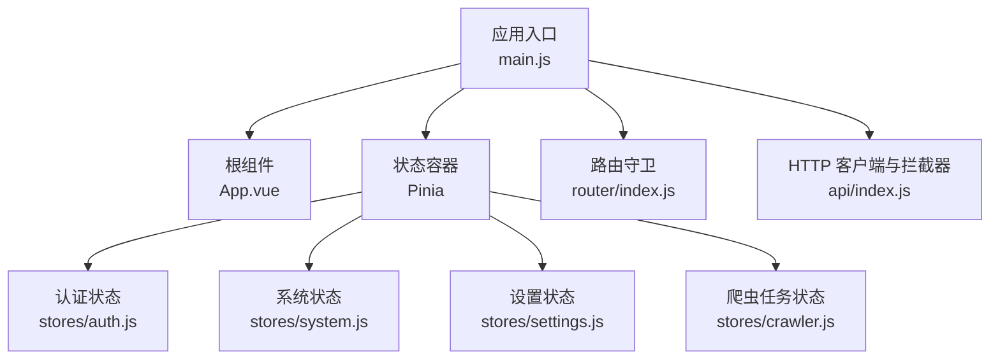
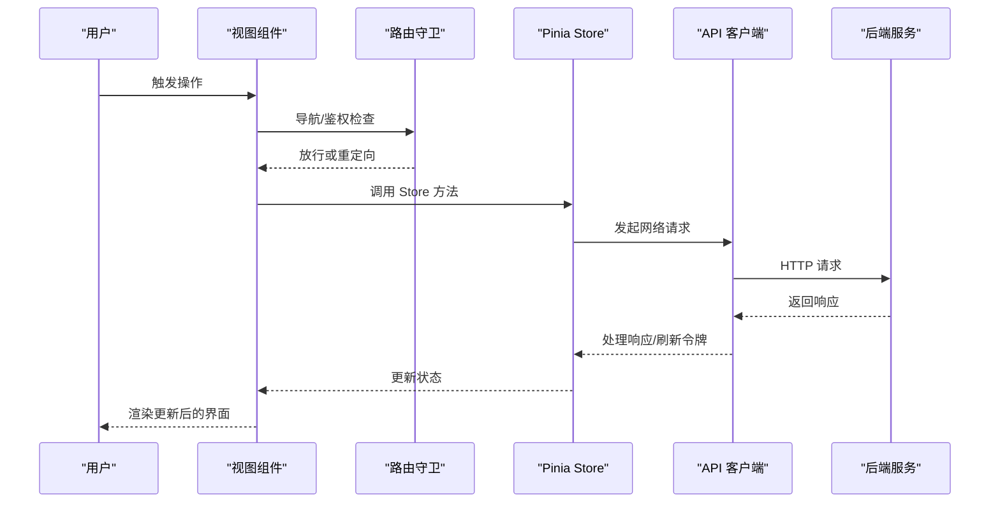
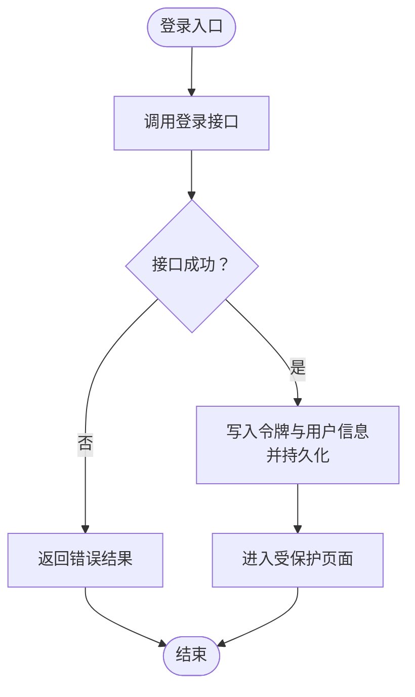
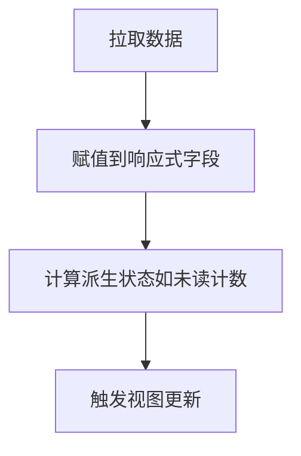
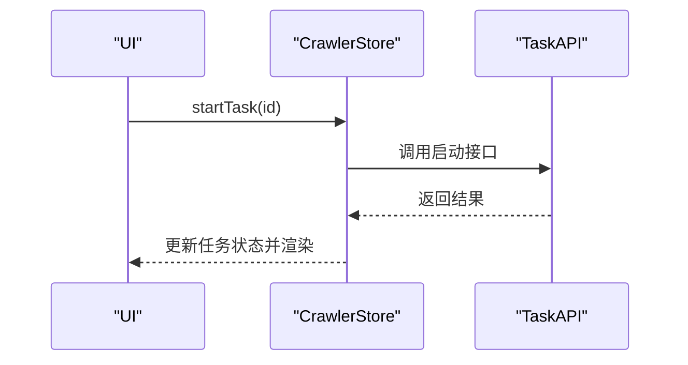
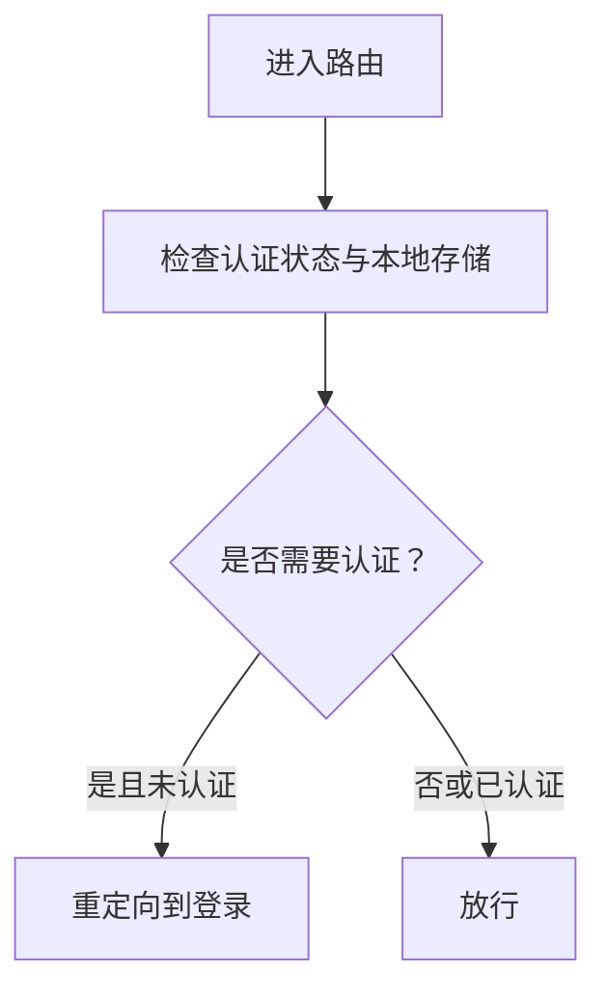
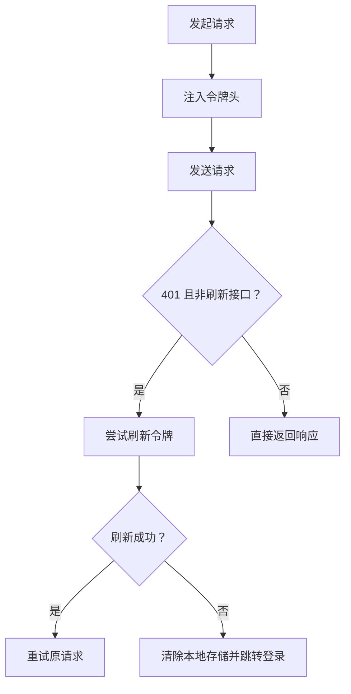
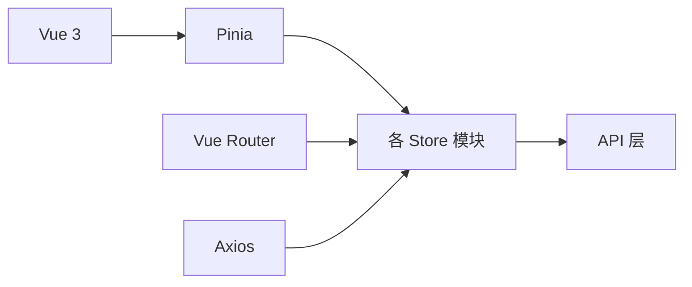

# 状态调试工具

<cite>
**本文引用的文件**
- [main.js](file://python-web/src/main.js)
- [App.vue](file://python-web/src/App.vue)
- [auth.js](file://python-web/src/stores/auth.js)
- [system.js](file://python-web/src/stores/system.js)
- [settings.js](file://python-web/src/stores/settings.js)
- [crawler.js](file://python-web/src/stores/crawler.js)
- [index.js](file://python-web/src/router/index.js)
- [index.js](file://python-web/src/api/index.js)
- [package.json](file://python-web/package.json)
- [vite.config.js](file://python-web/vite.config.js)
</cite>

## 目录
1. [简介](#简介)
2. [项目结构](#项目结构)
3. [核心组件](#核心组件)
4. [架构总览](#架构总览)
5. [详细组件分析](#详细组件分析)
6. [依赖关系分析](#依赖关系分析)
7. [性能考量](#性能考量)
8. [故障排查指南](#故障排查指南)
9. [结论](#结论)
10. [附录](#附录)

## 简介
本文件面向需要深入调试状态管理问题的开发者，围绕本项目的状态调试能力进行系统化说明。项目采用 Vue 3 + Pinia 的前端架构，状态通过 Store 进行集中管理；同时具备路由守卫与认证状态联动，便于在开发阶段进行状态变更追踪、时间旅行调试与副作用监控。本文将结合现有代码，给出可落地的调试配置、过滤器使用、性能分析建议，并覆盖生产环境限制与安全注意事项。

## 项目结构
本项目前端位于 python-web 目录，核心入口为应用挂载与 Pinia 注册，状态集中在 stores 目录下的多个模块，路由与 API 层分别位于 router 与 api 目录。整体结构清晰，便于在开发工具中定位状态来源与调用链路。

图表来源
- [main.js:1-16](file://python-web/src/main.js#L1-L16)
- [App.vue:1-10](file://python-web/src/App.vue#L1-L10)
- [auth.js:1-74](file://python-web/src/stores/auth.js#L1-L74)
- [system.js:1-168](file://python-web/src/stores/system.js#L1-L168)
- [settings.js:1-59](file://python-web/src/stores/settings.js#L1-L59)
- [crawler.js:1-174](file://python-web/src/stores/crawler.js#L1-L174)
- [index.js:1-150](file://python-web/src/router/index.js#L1-L150)
- [index.js:1-95](file://python-web/src/api/index.js#L1-L95)

章节来源
- [main.js:1-16](file://python-web/src/main.js#L1-L16)
- [package.json:1-24](file://python-web/package.json#L1-L24)

## 核心组件
- 应用入口与状态容器
  - 在应用入口完成 Pinia 的创建与挂载，确保全局状态可用。
  - 参考路径：[main.js:1-16](file://python-web/src/main.js#L1-L16)

- 认证状态模块
  - 管理访问令牌、刷新令牌与用户信息，支持登录、注册、登出与资料拉取。
  - 参考路径：[auth.js:1-74](file://python-web/src/stores/auth.js#L1-L74)

- 系统状态模块
  - 负责告警、代理、黑白名单、速率限制、系统日志与资源等数据的获取与更新。
  - 参考路径：[system.js:1-168](file://python-web/src/stores/system.js#L1-L168)

- 设置状态模块
  - 主题切换、偏好设置与全局设置的读写。
  - 参考路径：[settings.js:1-59](file://python-web/src/stores/settings.js#L1-L59)

- 爬虫任务状态模块
  - 任务列表、模板、版本、收藏与加载状态的管理。
  - 参考路径：[crawler.js:1-174](file://python-web/src/stores/crawler.js#L1-L174)

- 路由守卫与认证联动
  - 基于认证状态与本地存储判断页面访问权限。
  - 参考路径：[index.js:134-147](file://python-web/src/router/index.js#L134-L147)

- HTTP 客户端与拦截器
  - 统一请求头注入与 401 自动刷新逻辑。
  - 参考路径：[index.js:11-59](file://python-web/src/api/index.js#L11-L59)

章节来源
- [main.js:1-16](file://python-web/src/main.js#L1-L16)
- [auth.js:1-74](file://python-web/src/stores/auth.js#L1-L74)
- [system.js:1-168](file://python-web/src/stores/system.js#L1-L168)
- [settings.js:1-59](file://python-web/src/stores/settings.js#L1-L59)
- [crawler.js:1-174](file://python-web/src/stores/crawler.js#L1-L174)
- [index.js:134-147](file://python-web/src/router/index.js#L134-L147)
- [index.js:11-59](file://python-web/src/api/index.js#L11-L59)

## 架构总览
下图展示从用户交互到状态变更与渲染的整体流程，以及与 Pinia Store 的对应关系。

图表来源
- [index.js:134-147](file://python-web/src/router/index.js#L134-L147)
- [auth.js:1-74](file://python-web/src/stores/auth.js#L1-L74)
- [system.js:1-168](file://python-web/src/stores/system.js#L1-L168)
- [settings.js:1-59](file://python-web/src/stores/settings.js#L1-L59)
- [crawler.js:1-174](file://python-web/src/stores/crawler.js#L1-L174)
- [index.js:11-59](file://python-web/src/api/index.js#L11-L59)

## 详细组件分析

### 认证状态模块（auth）
- 关键职责
  - 维护访问令牌、刷新令牌与用户信息，提供登录、注册、登出、资料拉取等方法。
  - 使用本地存储持久化敏感信息，便于刷新与恢复。
- 调试要点
  - 登录/登出时观察令牌与用户对象的变化，验证本地存储同步。
  - 登录流程中的错误返回与异常分支，确保状态回滚正确。
- 典型调试场景
  - 登录后无法进入受保护页面：检查路由守卫与认证状态联动。
  - 刷新令牌失败导致强制登出：检查拦截器与本地存储清理逻辑。

图表来源
- [auth.js:30-41](file://python-web/src/stores/auth.js#L30-L41)

章节来源
- [auth.js:1-74](file://python-web/src/stores/auth.js#L1-L74)
- [index.js:134-147](file://python-web/src/router/index.js#L134-L147)

### 系统状态模块（system）
- 关键职责
  - 管理告警、代理、黑白名单、速率限制、系统日志与资源等多类数据。
  - 提供批量数据拉取、单项更新与状态计算（如未读计数）。
- 调试要点
  - 批量更新后检查数组替换与单项更新的差异，避免浅拷贝导致的渲染问题。
  - 未读计数的增减逻辑需与接口返回一致，防止计数不准确。
- 典型调试场景
  - 列表刷新后项丢失：检查数据赋值与过滤逻辑。
  - 未读计数异常：核对标记已读接口与计数更新的原子性。

图表来源
- [system.js:17-33](file://python-web/src/stores/system.js#L17-L33)

章节来源
- [system.js:1-168](file://python-web/src/stores/system.js#L1-L168)

### 设置状态模块（settings）
- 关键职责
  - 主题切换与偏好设置的读写，支持本地持久化。
- 调试要点
  - 主题切换时检查 DOM 属性更新与本地存储同步。
  - 偏好设置的合并策略，避免覆盖非目标键值。

章节来源
- [settings.js:1-59](file://python-web/src/stores/settings.js#L1-L59)

### 爬虫任务状态模块（crawler）
- 关键职责
  - 任务生命周期管理（创建、更新、删除、启动、停止）、模板与版本回滚、收藏管理。
  - 加载状态用于统一处理异步过程中的 UI 占位。
- 调试要点
  - 启停操作需同时更新列表与详情页的状态，避免视图不一致。
  - 版本回滚后需确认当前任务与历史版本的对比是否正确。

图表来源
- [crawler.js:68-94](file://python-web/src/stores/crawler.js#L68-L94)

章节来源
- [crawler.js:1-174](file://python-web/src/stores/crawler.js#L1-L174)

### 路由守卫与认证联动
- 关键职责
  - 基于认证状态与本地存储判断是否放行受保护路由。
- 调试要点
  - 登录态变化后路由跳转是否及时生效。
  - 已登录用户访问登录/注册页时的重定向行为。

图表来源
- [index.js:134-147](file://python-web/src/router/index.js#L134-L147)

章节来源
- [index.js:134-147](file://python-web/src/router/index.js#L134-L147)

### HTTP 客户端与拦截器
- 关键职责
  - 统一注入 Authorization 头，处理 401 并自动刷新令牌。
- 调试要点
  - 刷新令牌失败时的兜底逻辑（清除本地存储并跳转登录）。
  - 防止刷新循环与重复重试的控制。

图表来源
- [index.js:11-59](file://python-web/src/api/index.js#L11-L59)

章节来源
- [index.js:11-59](file://python-web/src/api/index.js#L11-L59)

## 依赖关系分析
- 模块耦合
  - 视图组件通过 Store 方法间接依赖 API 层，Store 再依赖 API 层，形成清晰的单向依赖。
  - 路由守卫依赖认证状态模块，实现鉴权控制。
- 外部依赖
  - Vue 3、Pinia、Element Plus、Vue Router、Axios 等。

图表来源
- [package.json:11-18](file://python-web/package.json#L11-L18)
- [main.js:1-16](file://python-web/src/main.js#L1-L16)

章节来源
- [package.json:1-24](file://python-web/package.json#L1-L24)
- [main.js:1-16](file://python-web/src/main.js#L1-L16)

## 性能考量
- 状态粒度与响应式开销
  - 将大列表拆分为多个独立状态，减少不必要的响应式追踪。
  - 对频繁更新的字段（如 loading）单独管理，避免影响主数据的渲染。
- 异步流程优化
  - 在 Store 中统一处理加载状态，减少组件内重复逻辑。
  - 对批量更新采用一次性赋值，避免多次渲染抖动。
- 网络层优化
  - 合理设置超时与重试策略，避免长时间阻塞 UI。
  - 对高频接口进行节流/防抖处理。

## 故障排查指南
- 登录后仍被重定向至登录页
  - 检查认证状态与本地存储是否同步写入。
  - 核对路由守卫的判定条件与优先级。
  - 参考路径：[auth.js:12-28](file://python-web/src/stores/auth.js#L12-L28)，[index.js:134-147](file://python-web/src/router/index.js#L134-L147)

- 刷新令牌失败导致无限跳转
  - 检查拦截器中刷新逻辑与本地存储清理顺序。
  - 确认非刷新接口的保护，避免刷新循环。
  - 参考路径：[index.js:27-56](file://python-web/src/api/index.js#L27-L56)

- 列表更新后视图不一致
  - 检查 Store 中的数据赋值方式，避免浅拷贝导致的引用不变。
  - 确认派生状态（如未读计数）的更新时机。
  - 参考路径：[system.js:23-33](file://python-web/src/stores/system.js#L23-L33)

- 主题切换无效
  - 检查主题写入本地存储与 DOM 属性更新的顺序。
  - 参考路径：[settings.js:43-47](file://python-web/src/stores/settings.js#L43-L47)

- 启停任务状态不同步
  - 确认列表与详情页的状态更新逻辑一致。
  - 参考路径：[crawler.js:68-94](file://python-web/src/stores/crawler.js#L68-L94)

章节来源
- [auth.js:12-28](file://python-web/src/stores/auth.js#L12-L28)
- [index.js:134-147](file://python-web/src/router/index.js#L134-L147)
- [index.js:27-56](file://python-web/src/api/index.js#L27-L56)
- [system.js:23-33](file://python-web/src/stores/system.js#L23-L33)
- [settings.js:43-47](file://python-web/src/stores/settings.js#L43-L47)
- [crawler.js:68-94](file://python-web/src/stores/crawler.js#L68-L94)

## 结论
本项目基于 Pinia 的状态管理结构清晰，配合路由守卫与 API 拦截器，能够满足日常开发与调试需求。通过合理划分状态粒度、统一异步处理与本地存储策略，可以有效降低调试复杂度。建议在开发阶段充分利用浏览器调试工具与 Pinia Devtools 进行状态变更追踪与时间旅行调试，以快速定位问题并优化性能。

## 附录

### 调试配置与最佳实践
- 开发环境调试
  - 使用 Vite 默认开发服务器端口与自动打开浏览器选项，便于联调。
  - 参考路径：[vite.config.js:1-11](file://python-web/vite.config.js#L1-L11)
- 状态快照与时间旅行
  - 在 Pinia Devtools 中启用“时间旅行”与“状态快照”，记录关键操作前后的状态变化。
  - 建议对登录、启停任务、列表刷新等关键路径进行快照保存。
- 过滤器使用
  - 在 Devtools 中按模块过滤（如 auth、system、crawler），聚焦问题域。
- 副作用监控
  - 关注 Store 方法中的副作用（如本地存储写入、路由跳转），确保幂等与可逆。
- 生产环境限制与安全
  - 生产构建默认关闭调试工具，避免泄露敏感状态。
  - 不要在状态中存储明文敏感信息，必要时仅存储最小必要标识。
  - 严格控制 API 拦截器中的错误处理与本地存储清理，防止状态污染。

章节来源
- [vite.config.js:1-11](file://python-web/vite.config.js#L1-L11)
- [auth.js:12-28](file://python-web/src/stores/auth.js#L12-L28)
- [index.js:27-56](file://python-web/src/api/index.js#L27-L56)