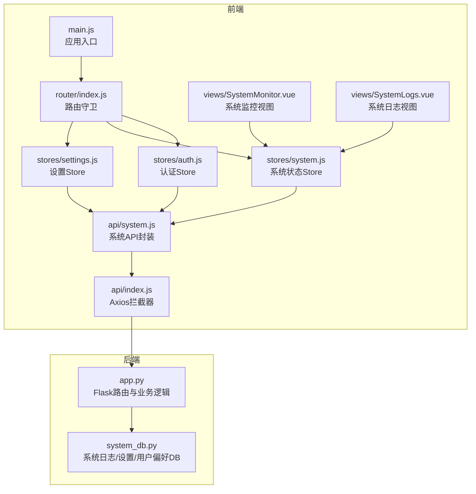
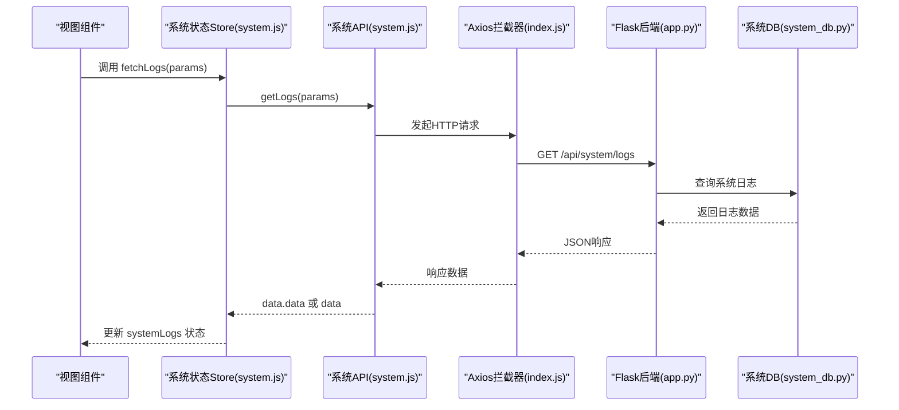
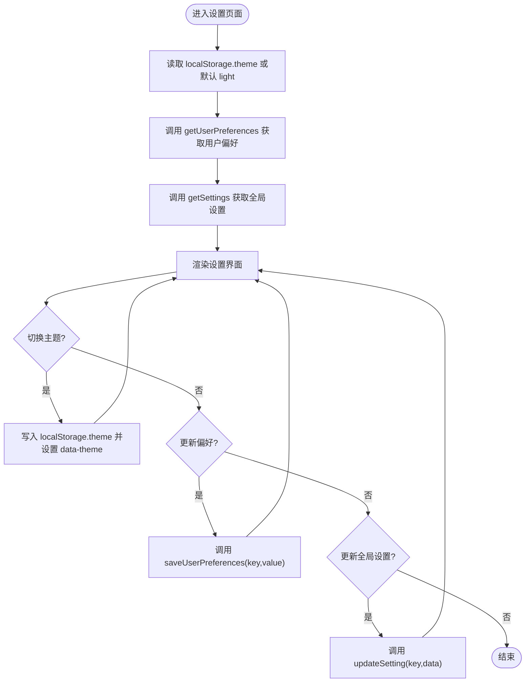
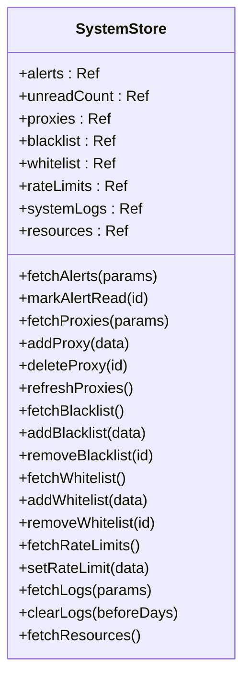
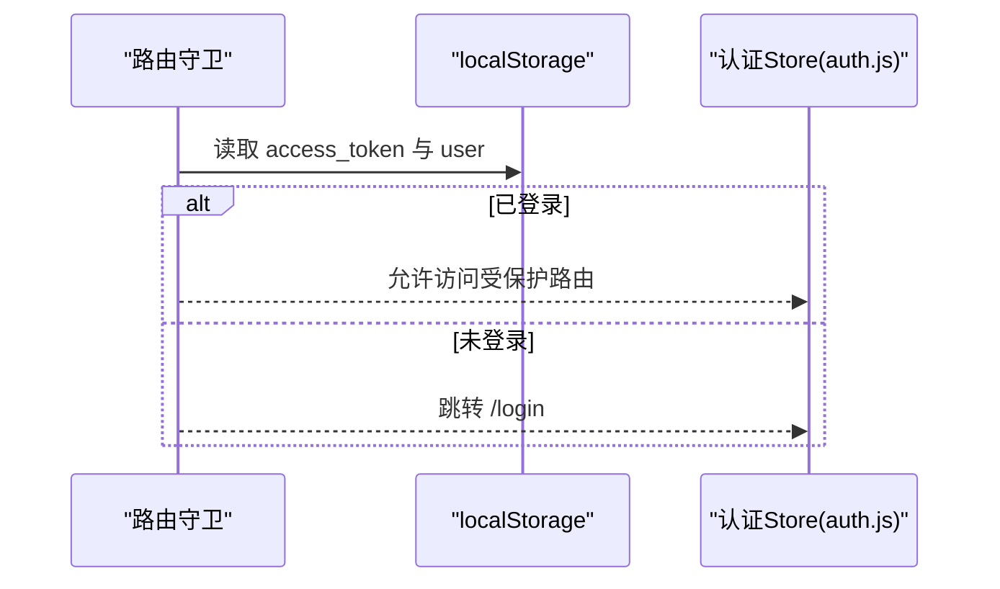
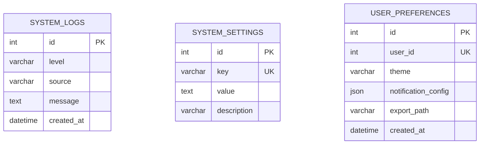
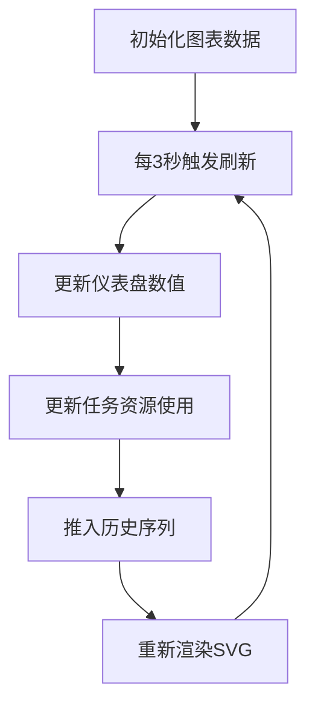
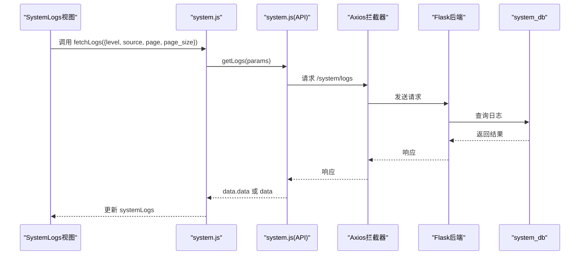
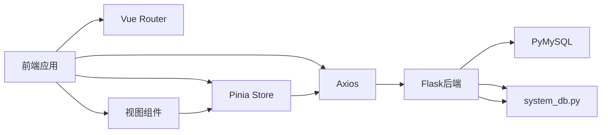

# 系统设置状态

<cite>
**本文引用的文件**
- [settings.js](file://python-web/src/stores/settings.js)
- [system.js](file://python-web/src/stores/system.js)
- [auth.js](file://python-web/src/stores/auth.js)
- [system.js](file://python-web/src/api/system.js)
- [index.js](file://python-web/src/api/index.js)
- [router/index.js](file://python-web/src/router/index.js)
- [main.js](file://python-web/src/main.js)
- [system_db.py](file://python/system_db.py)
- [app.py](file://python/app.py)
- [SystemMonitor.vue](file://python-web/src/views/SystemMonitor.vue)
- [SystemLogs.vue](file://python-web/src/views/SystemLogs.vue)
- [package.json](file://python-web/package.json)
</cite>

## 目录
1. [简介](#简介)
2. [项目结构](#项目结构)
3. [核心组件](#核心组件)
4. [架构总览](#架构总览)
5. [详细组件分析](#详细组件分析)
6. [依赖分析](#依赖分析)
7. [性能考虑](#性能考虑)
8. [故障排查指南](#故障排查指南)
9. [结论](#结论)
10. [附录](#附录)

## 简介
本文件面向需要管理复杂系统配置的开发者，系统性梳理“系统设置与系统状态”相关的前端 Store、后端数据库与接口设计，覆盖以下主题：
- 用户偏好设置管理：主题、通知配置、导出路径等
- 系统配置状态：全局设置、代理池、黑白名单、速率限制、系统资源与日志
- 全局状态同步：Pinia Store 与后端 API 的双向绑定
- 设置项定义与默认值处理：本地存储与接口返回的默认策略
- 配置持久化：前端本地存储与后端数据库
- 系统监控状态：资源仪表盘、历史趋势、任务资源排行
- 日志级别管理与性能指标跟踪：日志查询、过滤、统计
- 设置变更监听与热更新机制：Store 响应式更新
- 多用户设置隔离与权限控制：基于用户 ID 的偏好隔离
- 配置导入导出：前端导出日志、后端导出爬取数据
- 配置验证：前端输入校验与后端接口校验

## 项目结构
前端采用 Vue 3 + Pinia 架构，后端采用 Flask 提供 REST API；两者通过 Axios 统一拦截器进行鉴权与错误处理。

**图表来源**
- [main.js:1-16](file://python-web/src/main.js#L1-L16)
- [router/index.js:1-150](file://python-web/src/router/index.js#L1-L150)
- [settings.js:1-59](file://python-web/src/stores/settings.js#L1-L59)
- [system.js:1-168](file://python-web/src/stores/system.js#L1-L168)
- [auth.js:1-74](file://python-web/src/stores/auth.js#L1-L74)
- [system.js:1-35](file://python-web/src/api/system.js#L1-L35)
- [index.js:1-95](file://python-web/src/api/index.js#L1-L95)
- [SystemMonitor.vue:1-389](file://python-web/src/views/SystemMonitor.vue#L1-L389)
- [SystemLogs.vue:1-360](file://python-web/src/views/SystemLogs.vue#L1-L360)
- [app.py:1-800](file://python/app.py#L1-L800)
- [system_db.py:1-317](file://python/system_db.py#L1-L317)

**章节来源**
- [main.js:1-16](file://python-web/src/main.js#L1-L16)
- [router/index.js:1-150](file://python-web/src/router/index.js#L1-L150)
- [package.json:1-24](file://python-web/package.json#L1-L24)

## 核心组件
- 设置 Store（settings.js）
  - 负责主题切换、用户偏好、全局设置的读取与更新
  - 本地存储持久化（如主题），接口持久化（如用户偏好）
- 系统状态 Store（system.js）
  - 负责告警、代理、黑名单/白名单、速率限制、日志、资源等系统状态
  - 提供增删改查与刷新方法
- 认证 Store（auth.js）
  - 负责登录态、令牌与用户信息的本地持久化
- 系统 API 封装（api/system.js）
  - 对系统设置、日志、资源、用户偏好等接口进行统一封装
- Axios 拦截器（api/index.js）
  - 自动注入 Authorization，处理 401 刷新令牌与跳转登录

**章节来源**
- [settings.js:1-59](file://python-web/src/stores/settings.js#L1-L59)
- [system.js:1-168](file://python-web/src/stores/system.js#L1-L168)
- [auth.js:1-74](file://python-web/src/stores/auth.js#L1-L74)
- [system.js:1-35](file://python-web/src/api/system.js#L1-L35)
- [index.js:1-95](file://python-web/src/api/index.js#L1-L95)

## 架构总览
前端通过 Pinia Store 管理状态，通过 API 层与后端交互；后端提供系统设置、日志、资源等接口，并持久化到 MySQL。

**图表来源**
- [system.js:121-125](file://python-web/src/stores/system.js#L121-L125)
- [system.js:4-10](file://python-web/src/api/system.js#L4-L10)
- [index.js:11-59](file://python-web/src/api/index.js#L11-L59)
- [app.py:1-800](file://python/app.py#L1-L800)
- [system_db.py:123-168](file://python/system_db.py#L123-L168)

## 详细组件分析

### 设置 Store（用户偏好与全局设置）
- 主题管理
  - 本地存储键：theme
  - 切换时写入 localStorage 并设置 DOM 属性，支持暗/亮主题
- 用户偏好
  - 通过 getUserPreferences/saveUserPreferences 接口读写
  - 支持主题、通知配置、导出路径等字段
- 全局设置
  - 通过 getSettings/updateSetting 接口读写
  - 支持按 key 动态更新
- 默认值处理
  - theme 从 localStorage 读取，若无则默认 light
  - preferences/globalSettings 从接口返回初始化

**图表来源**
- [settings.js:6-47](file://python-web/src/stores/settings.js#L6-L47)
- [settings.js:26-41](file://python-web/src/stores/settings.js#L26-L41)
- [system.js:28-34](file://python-web/src/api/system.js#L28-L34)

**章节来源**
- [settings.js:1-59](file://python-web/src/stores/settings.js#L1-L59)
- [system.js:1-35](file://python-web/src/api/system.js#L1-L35)

### 系统状态 Store（监控与日志）
- 状态字段
  - alerts、unreadCount、proxies、blacklist、whitelist、rateLimits、systemLogs、resources
- 关键方法
  - 日志：fetchLogs、clearLogs
  - 资源：fetchResources
  - 代理：fetchProxies、addProxy、deleteProxy、refreshProxies
  - 黑/白名单：fetch/add/remove
  - 速率限制：fetch/set
  - 告警：fetchAlerts、markAlertRead
- 默认值与持久化
  - 通过接口返回初始化，UI 侧即时响应 Store 变更

**图表来源**
- [system.js:1-168](file://python-web/src/stores/system.js#L1-L168)

**章节来源**
- [system.js:1-168](file://python-web/src/stores/system.js#L1-L168)

### 认证 Store（权限基础）
- 本地持久化：access_token、refresh_token、user
- 方法：login、logout、register、fetchProfile、clearAuth
- 鉴权守卫：路由守卫根据本地存储判断是否登录

**图表来源**
- [router/index.js:134-147](file://python-web/src/router/index.js#L134-L147)
- [auth.js:6-28](file://python-web/src/stores/auth.js#L6-L28)

**章节来源**
- [auth.js:1-74](file://python-web/src/stores/auth.js#L1-L74)
- [router/index.js:1-150](file://python-web/src/router/index.js#L1-L150)

### 后端接口与数据库（系统设置与日志）
- 接口
  - 系统设置：GET/PUT /system/settings、GET/PUT /system/user/preferences
  - 日志：GET /system/logs、DELETE /system/logs
  - 资源：GET /system/resources
- 数据库
  - system_logs：日志表（level、source、message、created_at）
  - system_settings：全局设置表（key、value、description）
  - user_preferences：用户偏好表（user_id、theme、notification_config、export_path）

**图表来源**
- [system_db.py:52-87](file://python/system_db.py#L52-L87)

**章节来源**
- [system_db.py:1-317](file://python/system_db.py#L1-L317)
- [app.py:1-800](file://python/app.py#L1-L800)

### 系统监控视图（资源看板）
- 功能点
  - 仪表盘：CPU、内存、磁盘、网络使用率
  - 历史曲线：CPU/内存使用趋势
  - 任务资源排行：按 CPU/内存排序
  - 阈值设置：可调节告警阈值并保存
- 实现要点
  - 定时刷新（每 3 秒）模拟数据波动
  - SVG 绘制环形仪表与折线图
  - 本地状态驱动 UI，不直接依赖后端

**图表来源**
- [SystemMonitor.vue:225-236](file://python-web/src/views/SystemMonitor.vue#L225-L236)

**章节来源**
- [SystemMonitor.vue:1-389](file://python-web/src/views/SystemMonitor.vue#L1-L389)

### 系统日志视图（日志级别与过滤）
- 功能点
  - 日志列表：按级别（INFO/WARNING/ERROR）、来源、日期范围过滤
  - 统计：日志总数、今日数量、今日错误数
  - 分页：每页固定条数
  - 操作：刷新、清空、导出
- 实现要点
  - 本地计算过滤与分页，减少后端压力
  - 通过 system.js 的 fetchLogs/clearLogs 与后端交互

**图表来源**
- [system.js:121-125](file://python-web/src/stores/system.js#L121-L125)
- [system.js:4-10](file://python-web/src/api/system.js#L4-L10)
- [index.js:11-59](file://python-web/src/api/index.js#L11-L59)
- [system_db.py:123-168](file://python/system_db.py#L123-L168)

**章节来源**
- [SystemLogs.vue:1-360](file://python-web/src/views/SystemLogs.vue#L1-L360)
- [system.js:121-133](file://python-web/src/stores/system.js#L121-L133)

## 依赖分析
- 前端依赖
  - Vue 3、Pinia、Element Plus、axios、vue-router
- 前端模块耦合
  - stores 之间低耦合，通过 API 层解耦
  - 视图组件依赖对应 Store，Store 依赖 API 封装
- 后端依赖
  - Flask、Flask-CORS、PyMySQL
  - system_db.py 提供数据库抽象

**图表来源**
- [package.json:11-18](file://python-web/package.json#L11-L18)
- [main.js:1-16](file://python-web/src/main.js#L1-L16)
- [index.js:1-95](file://python-web/src/api/index.js#L1-L95)
- [system_db.py:1-317](file://python/system_db.py#L1-L317)

**章节来源**
- [package.json:1-24](file://python-web/package.json#L1-L24)
- [main.js:1-16](file://python-web/src/main.js#L1-L16)

## 性能考虑
- 前端
  - 日志视图采用本地过滤与分页，避免频繁网络请求
  - 监控视图定时刷新频率可控（3 秒），可根据场景调整
  - Store 状态粒度细，局部更新提升渲染效率
- 后端
  - 日志查询带索引（level/source/created_at），支持分页
  - 设置与偏好采用唯一键约束，避免重复写入
- 建议
  - 对高频接口增加缓存（如资源信息）
  - 对日志查询增加时间范围限制与最大页大小

[本节为通用指导，无需具体文件分析]

## 故障排查指南
- 401 未授权
  - Axios 拦截器会尝试刷新令牌；若失败则清除本地存储并跳转登录
- 日志无法加载
  - 检查 /system/logs 接口连通性与数据库连接
  - 确认 system_logs 表是否存在且有索引
- 设置无法保存
  - 检查 /system/settings 与 /system/user/preferences 接口
  - 确认 system_settings 与 user_preferences 表字段正确
- 主题切换无效
  - 检查 localStorage 中 theme 键与 DOM 属性 data-theme 是否更新

**章节来源**
- [index.js:22-59](file://python-web/src/api/index.js#L22-L59)
- [system_db.py:123-183](file://python/system_db.py#L123-L183)
- [settings.js:43-47](file://python-web/src/stores/settings.js#L43-L47)

## 结论
该系统通过 Pinia Store 将用户偏好、全局设置与系统状态进行集中管理，结合 Axios 拦截器与后端 Flask 接口，实现了配置的持久化与实时同步。前端提供监控与日志视图，后端提供数据库支撑，整体架构清晰、职责分离明确，适合复杂系统的配置管理与运维监控需求。

[本节为总结，无需具体文件分析]

## 附录

### 设置项定义与默认值
- 主题 theme
  - 默认值：light
  - 存储位置：localStorage
- 用户偏好 preferences
  - 字段：theme、notification_config、export_path
  - 存储位置：后端 user_preferences 表
- 全局设置 settings
  - 字段：任意键值对（由后端维护）
  - 存储位置：后端 system_settings 表

**章节来源**
- [settings.js:6-8](file://python-web/src/stores/settings.js#L6-L8)
- [system_db.py:77-87](file://python/system_db.py#L77-L87)
- [system_db.py:66-74](file://python/system_db.py#L66-L74)

### 配置持久化策略
- 前端
  - 主题：localStorage
  - 登录态：localStorage（access_token、refresh_token、user）
- 后端
  - 系统日志：system_logs 表
  - 系统设置：system_settings 表
  - 用户偏好：user_preferences 表

**章节来源**
- [settings.js:43-47](file://python-web/src/stores/settings.js#L43-L47)
- [auth.js:6-28](file://python-web/src/stores/auth.js#L6-L28)
- [system_db.py:52-87](file://python/system_db.py#L52-L87)

### 多用户设置隔离与权限控制
- 多用户设置隔离
  - user_preferences 表以 user_id 作为唯一键，确保用户偏好隔离
- 权限控制
  - 路由守卫要求登录态
  - Axios 拦截器自动附加 Authorization
  - 后端接口多数需要登录态（如任务、日志、设置）

**章节来源**
- [router/index.js:134-147](file://python-web/src/router/index.js#L134-L147)
- [index.js:11-19](file://python-web/src/api/index.js#L11-L19)
- [auth.js:10-10](file://python-web/src/stores/auth.js#L10-L10)
- [system_db.py:255-271](file://python/system_db.py#L255-L271)

### 配置导入导出
- 日志导出
  - 前端：SystemLogs.vue 提供导出提示
  - 后端：/api/crawler/export 提供 CSV 导出（示例）
- 设置导出
  - 当前未提供系统设置导出接口，可在后端扩展

**章节来源**
- [SystemLogs.vue:198-200](file://python-web/src/views/SystemLogs.vue#L198-L200)
- [app.py:427-466](file://python/app.py#L427-L466)

### 配置验证
- 前端
  - 输入校验：如日志视图中的日期范围、搜索关键字
- 后端
  - 参数校验：如任务创建、任务更新、登录、注册等接口的参数与格式校验

**章节来源**
- [SystemLogs.vue:102-115](file://python-web/src/views/SystemLogs.vue#L102-L115)
- [app.py:53-97](file://python/app.py#L53-L97)
- [app.py:475-551](file://python/app.py#L475-L551)