# 认证状态管理

<cite>
**本文档引用的文件**
- [auth.js](file://python-web/src/stores/auth.js)
- [index.js](file://python-web/src/router/index.js)
- [main.js](file://python-web/src/main.js)
- [Login.vue](file://python-web/src/views/Login.vue)
- [Register.vue](file://python-web/src/views/Register.vue)
- [ForgotPassword.vue](file://python-web/src/views/ForgotPassword.vue)
- [ResetPassword.vue](file://python-web/src/views/ResetPassword.vue)
- [NavBar.vue](file://python-web/src/components/NavBar.vue)
- [index.js](file://python-web/src/api/index.js)
- [package.json](file://python-web/package.json)
</cite>

## 目录
1. [简介](#简介)
2. [项目结构](#项目结构)
3. [核心组件](#核心组件)
4. [架构概览](#架构概览)
5. [详细组件分析](#详细组件分析)
6. [依赖关系分析](#依赖关系分析)
7. [性能考虑](#性能考虑)
8. [故障排除指南](#故障排除指南)
9. [结论](#结论)

## 简介

本文件详细阐述了基于Vue 3 + Pinia的前端认证状态管理系统。该系统实现了完整的用户认证流程，包括登录状态跟踪、JWT令牌处理、本地存储策略、自动登出机制和会话管理。系统采用Pinia进行状态管理，通过Axios拦截器实现透明的令牌刷新，结合Vue Router的路由守卫实现权限控制。

## 项目结构

认证系统主要分布在以下目录结构中：

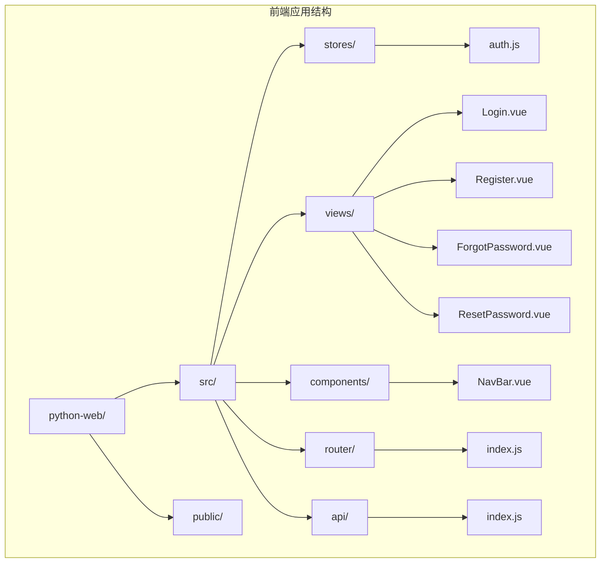

**图表来源**
- [auth.js:1-74](file://python-web/src/stores/auth.js#L1-L74)
- [index.js:1-150](file://python-web/src/router/index.js#L1-L150)

**章节来源**
- [auth.js:1-74](file://python-web/src/stores/auth.js#L1-L74)
- [index.js:1-150](file://python-web/src/router/index.js#L1-L150)
- [main.js:1-16](file://python-web/src/main.js#L1-L16)

## 核心组件

### 认证Store (Pinia)

认证Store是整个认证系统的核心，负责管理用户认证状态和相关操作：

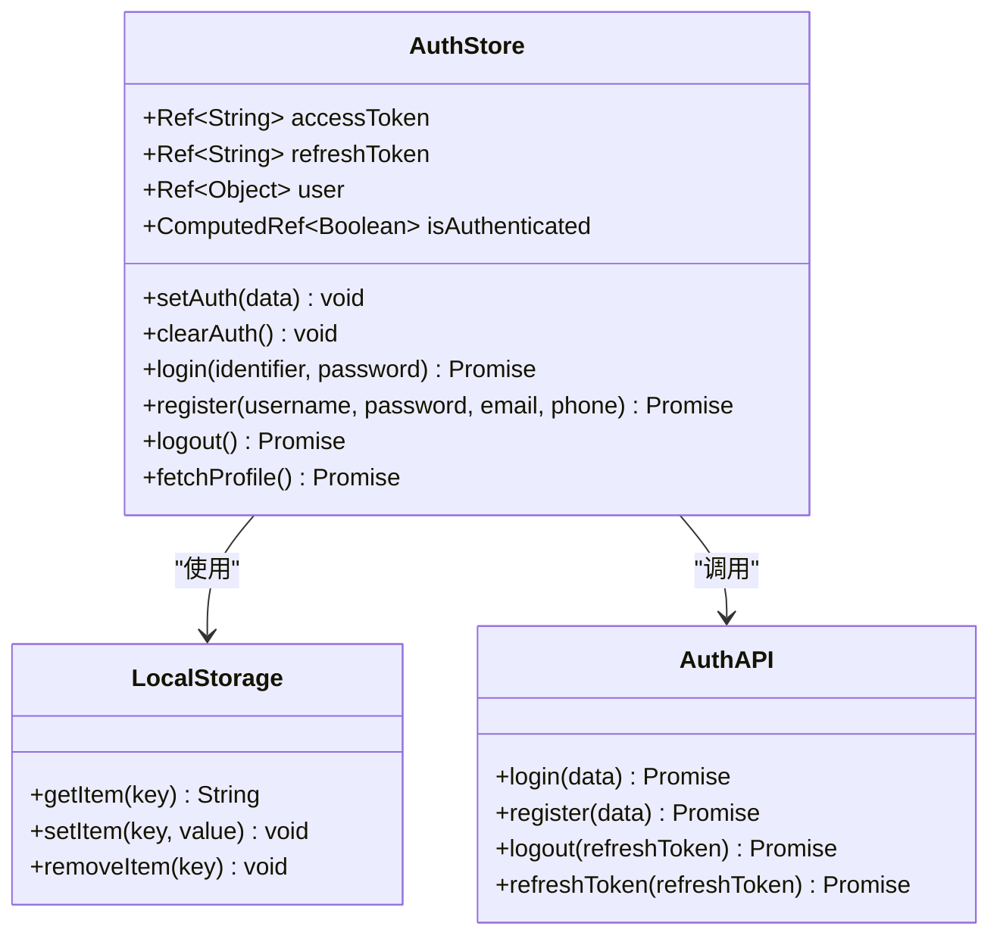

**图表来源**
- [auth.js:5-73](file://python-web/src/stores/auth.js#L5-L73)

认证Store的主要特性：
- **状态管理**：使用Pinia的响应式ref管理访问令牌、刷新令牌和用户信息
- **本地存储**：自动同步状态到localStorage，实现页面刷新后的状态保持
- **计算属性**：`isAuthenticated`根据令牌和用户信息动态计算登录状态
- **异步操作**：提供完整的登录、注册、登出和用户信息获取方法

**章节来源**
- [auth.js:5-73](file://python-web/src/stores/auth.js#L5-L73)

### API拦截器

系统通过Axios拦截器实现透明的令牌管理和自动刷新：

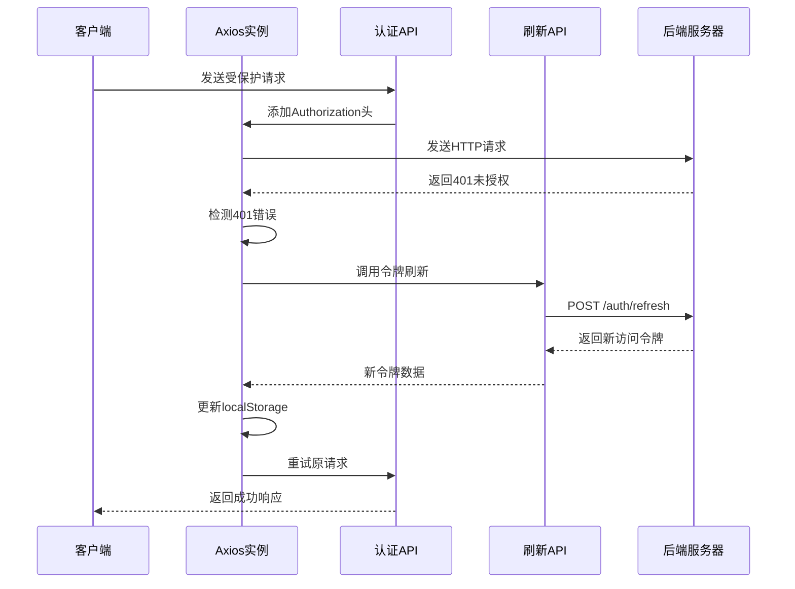

**图表来源**
- [index.js:22-59](file://python-web/src/api/index.js#L22-L59)

**章节来源**
- [index.js:11-59](file://python-web/src/api/index.js#L11-L59)

### 路由守卫

路由守卫实现基于元信息的权限控制：

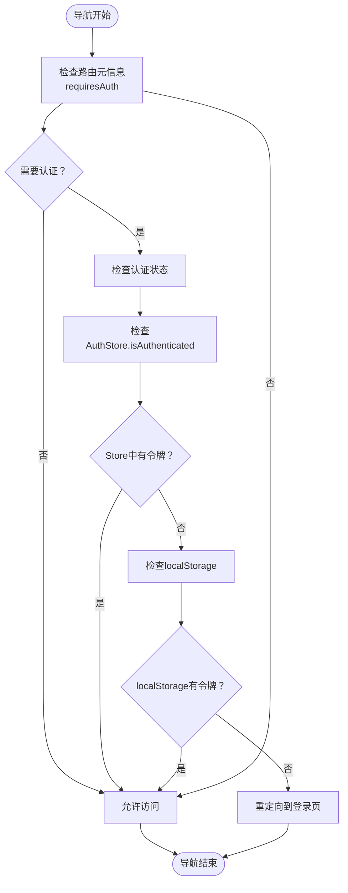

**图表来源**
- [index.js:134-147](file://python-web/src/router/index.js#L134-L147)

**章节来源**
- [index.js:134-147](file://python-web/src/router/index.js#L134-L147)

## 架构概览

认证系统的整体架构采用分层设计：

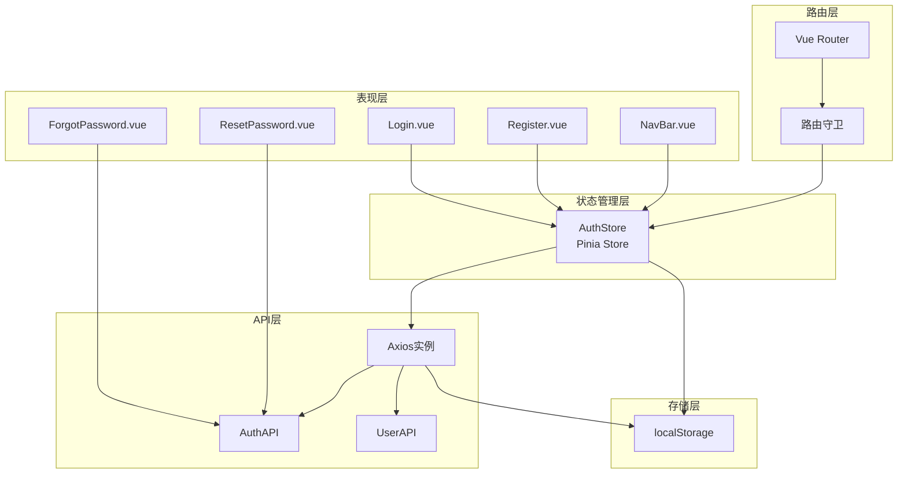

**图表来源**
- [auth.js:1-74](file://python-web/src/stores/auth.js#L1-L74)
- [index.js:1-150](file://python-web/src/router/index.js#L1-L150)
- [index.js:1-95](file://python-web/src/api/index.js#L1-L95)

系统特点：
- **模块化设计**：各组件职责明确，便于维护和扩展
- **状态集中管理**：所有认证状态统一由Pinia Store管理
- **透明API访问**：通过拦截器实现无感知的令牌处理
- **权限控制**：基于路由元信息的细粒度权限管理

## 详细组件分析

### 登录流程组件

登录组件实现了完整的用户登录体验：

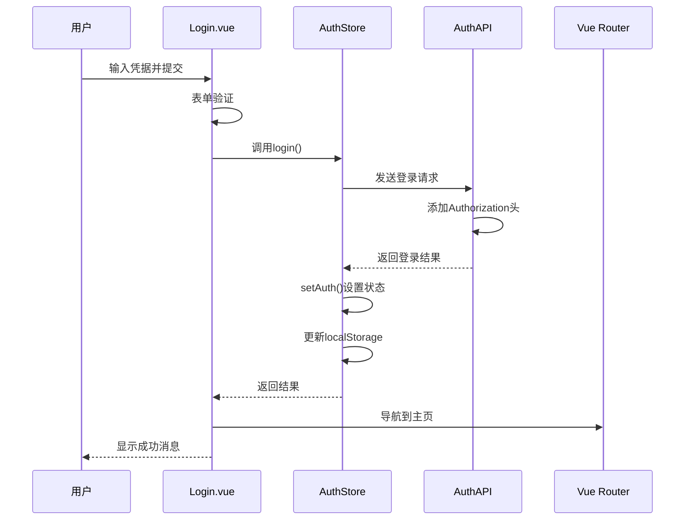

**图表来源**
- [Login.vue:100-119](file://python-web/src/views/Login.vue#L100-L119)
- [auth.js:30-36](file://python-web/src/stores/auth.js#L30-L36)

登录组件的关键特性：
- **表单验证**：客户端实时验证用户输入
- **错误处理**：优雅处理登录失败和网络错误
- **用户体验**：加载状态指示和成功反馈

**章节来源**
- [Login.vue:100-119](file://python-web/src/views/Login.vue#L100-L119)

### 注册流程组件

注册组件提供了完整的用户注册功能：

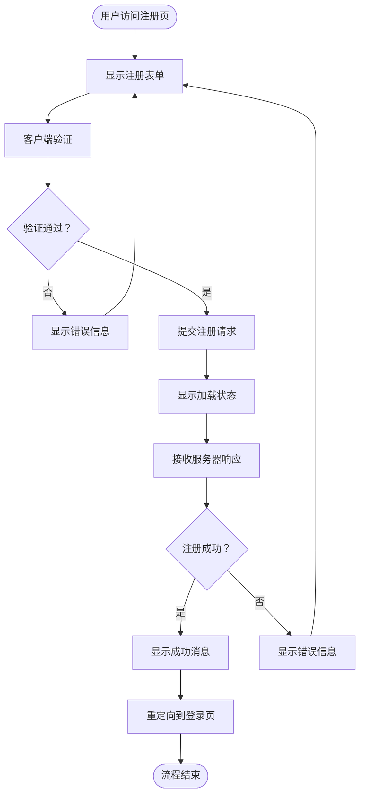

**图表来源**
- [Register.vue:234-260](file://python-web/src/views/Register.vue#L234-L260)

**章节来源**
- [Register.vue:185-232](file://python-web/src/views/Register.vue#L185-L232)

### 忘记密码流程

忘记密码流程实现了多步骤的身份验证：

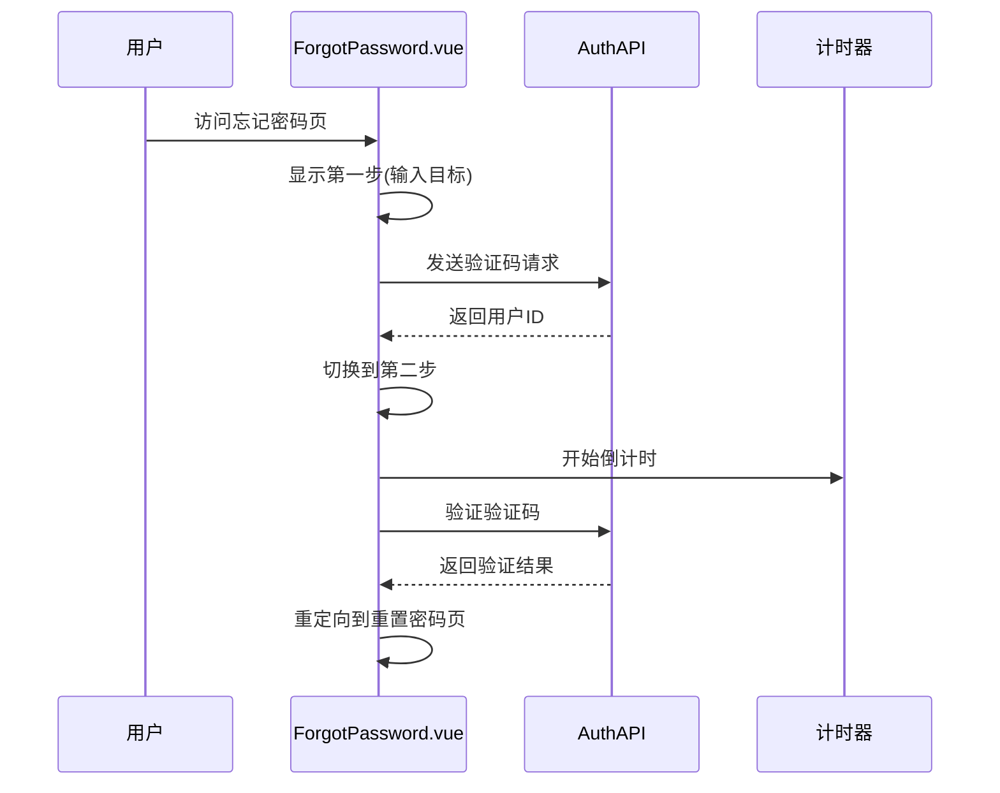

**图表来源**
- [ForgotPassword.vue:130-153](file://python-web/src/views/ForgotPassword.vue#L130-L153)

**章节来源**
- [ForgotPassword.vue:130-153](file://python-web/src/views/ForgotPassword.vue#L130-L153)

### 导航栏组件

导航栏组件集成了认证状态显示和登出功能：

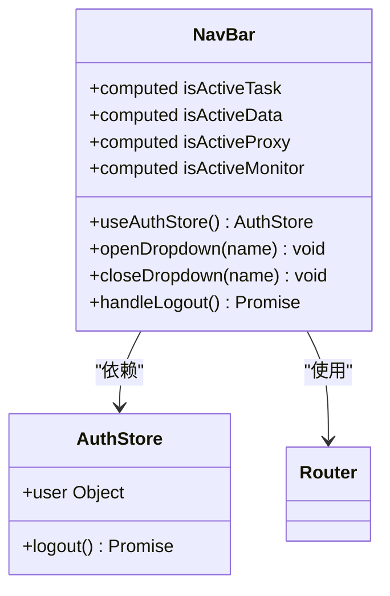

**图表来源**
- [NavBar.vue:84-121](file://python-web/src/components/NavBar.vue#L84-L121)

**章节来源**
- [NavBar.vue:117-120](file://python-web/src/components/NavBar.vue#L117-L120)

## 依赖关系分析

### 外部依赖

系统依赖的关键外部库：

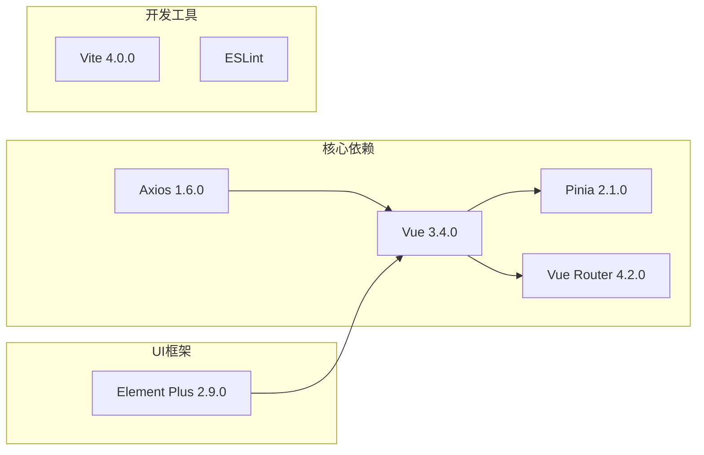

**图表来源**
- [package.json:11-22](file://python-web/package.json#L11-L22)

### 内部模块依赖

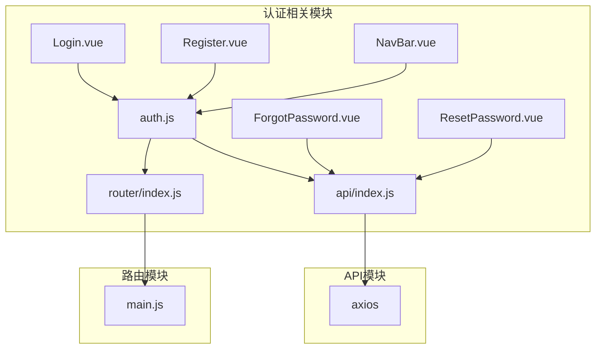

**图表来源**
- [auth.js:1-3](file://python-web/src/stores/auth.js#L1-L3)
- [index.js:1-2](file://python-web/src/router/index.js#L1-L2)
- [main.js:1-16](file://python-web/src/main.js#L1-L16)

**章节来源**
- [package.json:1-24](file://python-web/package.json#L1-L24)

## 性能考虑

### 状态管理优化

1. **响应式状态**：使用Pinia的响应式ref确保状态变更的高效更新
2. **计算属性缓存**：`isAuthenticated`作为计算属性自动缓存结果
3. **懒加载组件**：路由中的视图组件使用动态导入实现按需加载

### 网络请求优化

1. **请求拦截器**：避免重复添加Authorization头
2. **自动重试**：401错误时自动尝试令牌刷新
3. **超时控制**：10秒请求超时防止长时间挂起

### 存储策略优化

1. **增量更新**：只在状态真正改变时更新localStorage
2. **序列化优化**：用户对象使用JSON序列化存储
3. **内存管理**：及时清理计时器和事件监听器

## 故障排除指南

### 常见问题及解决方案

#### 登录失败
- **症状**：登录后立即被重定向到登录页
- **原因**：服务器返回401未授权或令牌无效
- **解决**：检查网络连接、服务器状态和凭据正确性

#### 令牌过期
- **症状**：访问受保护资源时出现401错误
- **原因**：访问令牌已过期但刷新令牌无效
- **解决**：清除浏览器存储的令牌并重新登录

#### 页面刷新丢失状态
- **症状**：刷新页面后需要重新登录
- **原因**：localStorage访问被阻止或存储空间不足
- **解决**：检查浏览器隐私设置和存储配额

#### 路由守卫失效
- **症状**：未登录用户可以访问受保护页面
- **原因**：路由守卫逻辑错误或AuthStore初始化问题
- **解决**：检查路由元信息配置和store初始化

**章节来源**
- [index.js:22-59](file://python-web/src/api/index.js#L22-L59)
- [index.js:134-147](file://python-web/src/router/index.js#L134-L147)

## 结论

该认证状态管理系统提供了完整的企业级用户认证解决方案。系统采用现代化的Vue 3技术栈，通过Pinia实现高效的状态管理，通过Axios拦截器实现透明的令牌处理，通过路由守卫实现细粒度的权限控制。

系统的主要优势：
- **安全性**：完整的JWT令牌生命周期管理
- **可用性**：自动令牌刷新和错误恢复机制
- **可维护性**：模块化的代码结构和清晰的职责分离
- **扩展性**：灵活的插件化架构支持功能扩展

建议的改进方向：
- 实现令牌刷新的防抖机制
- 添加认证状态的持久化策略
- 增强错误处理和用户反馈
- 实现更细粒度的权限控制