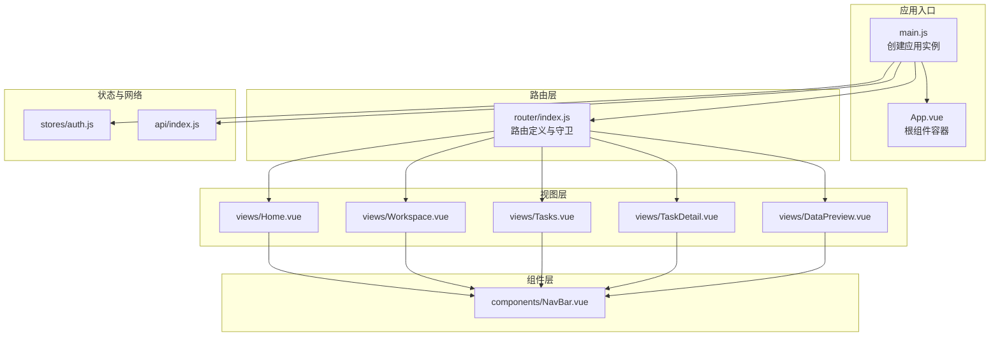
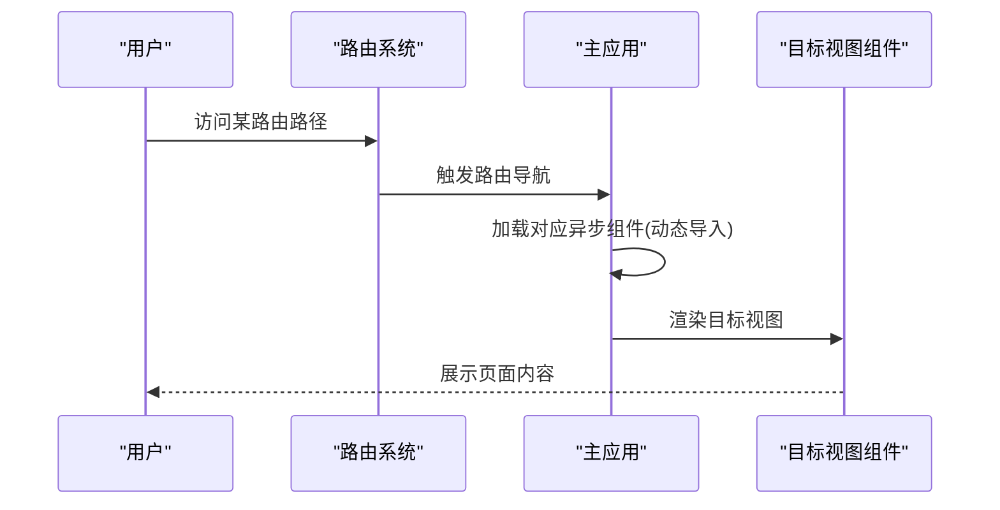
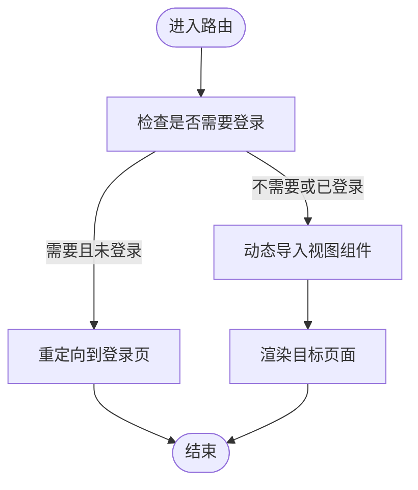
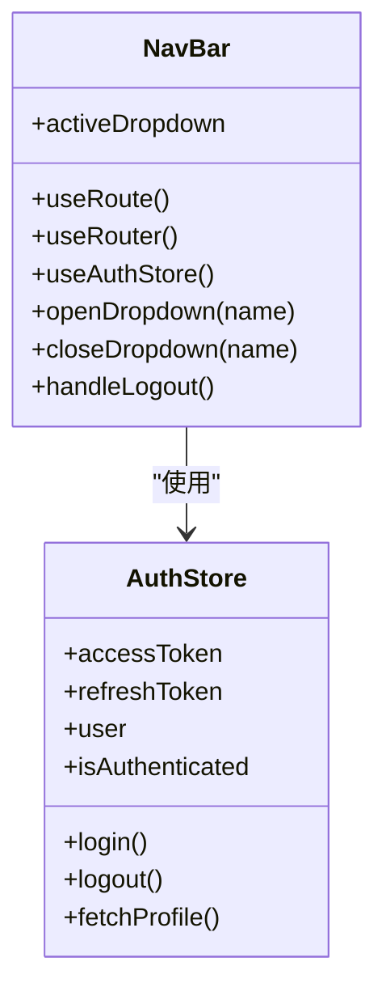
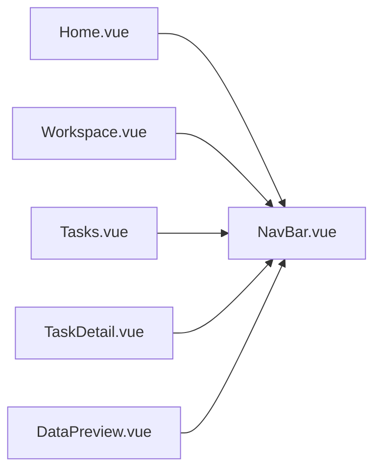
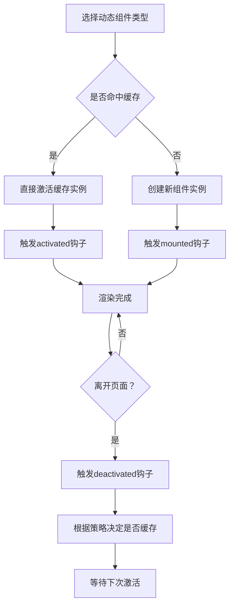
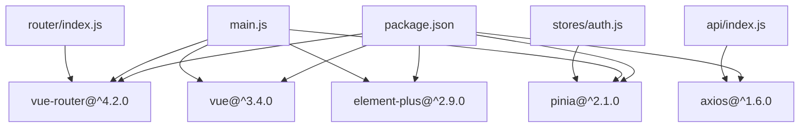

# 动态组件实现

<cite>
**本文档引用的文件**
- [App.vue](file://python-web/src/App.vue)
- [main.js](file://python-web/src/main.js)
- [router/index.js](file://python-web/src/router/index.js)
- [components/NavBar.vue](file://python-web/src/components/NavBar.vue)
- [views/Home.vue](file://python-web/src/views/Home.vue)
- [views/Workspace.vue](file://python-web/src/views/Workspace.vue)
- [views/Tasks.vue](file://python-web/src/views/Tasks.vue)
- [views/TaskDetail.vue](file://python-web/src/views/TaskDetail.vue)
- [views/DataPreview.vue](file://python-web/src/views/DataPreview.vue)
- [stores/auth.js](file://python-web/src/stores/auth.js)
- [api/index.js](file://python-web/src/api/index.js)
- [package.json](file://python-web/package.json)
</cite>

## 目录
1. [简介](#简介)
2. [项目结构](#项目结构)
3. [核心组件](#核心组件)
4. [架构总览](#架构总览)
5. [详细组件分析](#详细组件分析)
6. [依赖关系分析](#依赖关系分析)
7. [性能考虑](#性能考虑)
8. [故障排除指南](#故障排除指南)
9. [结论](#结论)
10. [附录](#附录)

## 简介
本项目是一个基于 Vue 3 的前端应用，采用 Vue Router 进行页面级导航与切换。虽然项目中未直接使用 Vue 的 `<component :is="">` 动态组件语法，但通过路由级别的按需加载（懒加载）与组件组合，实现了高效的界面切换与状态管理。本文档将从架构视角解析项目如何实现“动态加载”和“切换”的效果，并结合现有组件展示如何扩展为真正的动态组件场景（如多标签页、可复用面板等），同时给出 keep-alive 缓存策略、生命周期钩子处理、性能优化与内存泄漏防护建议。

## 项目结构
项目采用典型的 Vue 3 + Vite 前端工程结构，核心入口为 main.js，路由定义于 router/index.js，页面组件位于 views 目录，通用组件位于 components 目录，状态管理使用 Pinia，API 封装位于 api 目录。

**图表来源**
- [main.js:1-16](file://python-web/src/main.js#L1-L16)
- [App.vue:1-10](file://python-web/src/App.vue#L1-L10)
- [router/index.js:1-150](file://python-web/src/router/index.js#L1-L150)
- [components/NavBar.vue:1-352](file://python-web/src/components/NavBar.vue#L1-L352)
- [views/Home.vue:1-1055](file://python-web/src/views/Home.vue#L1-L1055)
- [views/Workspace.vue:1-247](file://python-web/src/views/Workspace.vue#L1-L247)
- [views/Tasks.vue:1-852](file://python-web/src/views/Tasks.vue#L1-L852)
- [views/TaskDetail.vue:1-836](file://python-web/src/views/TaskDetail.vue#L1-L836)
- [views/DataPreview.vue:1-524](file://python-web/src/views/DataPreview.vue#L1-L524)
- [stores/auth.js:1-74](file://python-web/src/stores/auth.js#L1-L74)
- [api/index.js:1-95](file://python-web/src/api/index.js#L1-L95)

**章节来源**
- [main.js:1-16](file://python-web/src/main.js#L1-L16)
- [router/index.js:1-150](file://python-web/src/router/index.js#L1-L150)

## 核心组件
- 应用入口与插件注册：在 main.js 中创建应用实例，挂载 Element Plus、Pinia、Vue Router。
- 路由系统：router/index.js 定义了完整的页面路由表，所有页面均采用动态导入（懒加载）以减少首屏体积。
- 导航栏组件：components/NavBar.vue 提供顶部导航与下拉菜单，配合路由高亮逻辑。
- 页面视图：views 下各页面负责具体业务展示与交互，如任务管理、数据预览等。
- 状态管理：stores/auth.js 使用 Pinia 管理认证状态与用户信息。
- 网络层：api/index.js 统一封装 Axios，包含鉴权拦截器与自动刷新逻辑。

**章节来源**
- [main.js:1-16](file://python-web/src/main.js#L1-L16)
- [router/index.js:1-150](file://python-web/src/router/index.js#L1-L150)
- [components/NavBar.vue:1-352](file://python-web/src/components/NavBar.vue#L1-L352)
- [stores/auth.js:1-74](file://python-web/src/stores/auth.js#L1-L74)
- [api/index.js:1-95](file://python-web/src/api/index.js#L1-L95)

## 架构总览
本项目通过“路由驱动的页面切换”实现“动态加载”的效果。每个路由对应一个异步组件（动态导入），首次访问时才加载对应模块，从而降低初始包体大小。页面内部通过组件组合（如 NavBar）实现导航与布局复用；Pinia 管理全局状态（如用户认证），Axios 拦截器统一处理鉴权与刷新。

**图表来源**
- [router/index.js:1-150](file://python-web/src/router/index.js#L1-L150)
- [main.js:1-16](file://python-web/src/main.js#L1-L16)

## 详细组件分析

### 路由与懒加载
- 路由表中所有页面均使用动态导入，实现按需加载与代码分割。
- 路由守卫根据认证状态控制访问权限，未登录用户跳转到登录页。
- 路由元信息用于标识页面是否需要登录保护。

**图表来源**
- [router/index.js:134-147](file://python-web/src/router/index.js#L134-L147)

**章节来源**
- [router/index.js:1-150](file://python-web/src/router/index.js#L1-L150)

### 导航栏组件与路由联动
- NavBar 通过 useRoute/useRouter 获取当前路由，计算下拉菜单激活状态与高亮样式。
- 通过 router-link 实现页面内导航，支持精确激活类名控制。

**图表来源**
- [components/NavBar.vue:84-121](file://python-web/src/components/NavBar.vue#L84-L121)
- [stores/auth.js:5-74](file://python-web/src/stores/auth.js#L5-L74)

**章节来源**
- [components/NavBar.vue:1-352](file://python-web/src/components/NavBar.vue#L1-L352)
- [stores/auth.js:1-74](file://python-web/src/stores/auth.js#L1-L74)

### 页面视图与组件组合
- 各页面视图（如 Home、Workspace、Tasks、TaskDetail、DataPreview）均引入 NavBar 并进行业务渲染。
- 页面内部通过条件渲染（v-if/v-else）、列表渲染（v-for）与事件绑定实现交互。

**图表来源**
- [views/Home.vue:269-357](file://python-web/src/views/Home.vue#L269-L357)
- [views/Workspace.vue:89-118](file://python-web/src/views/Workspace.vue#L89-L118)
- [views/Tasks.vue:178-200](file://python-web/src/views/Tasks.vue#L178-L200)
- [views/TaskDetail.vue:174-200](file://python-web/src/views/TaskDetail.vue#L174-L200)
- [views/DataPreview.vue:159-200](file://python-web/src/views/DataPreview.vue#L159-L200)

**章节来源**
- [views/Home.vue:1-1055](file://python-web/src/views/Home.vue#L1-L1055)
- [views/Workspace.vue:1-247](file://python-web/src/views/Workspace.vue#L1-L247)
- [views/Tasks.vue:1-852](file://python-web/src/views/Tasks.vue#L1-L852)
- [views/TaskDetail.vue:1-836](file://python-web/src/views/TaskDetail.vue#L1-L836)
- [views/DataPreview.vue:1-524](file://python-web/src/views/DataPreview.vue#L1-L524)

### 动态组件实现思路（扩展建议）
尽管当前项目未直接使用 `<component :is="">`，但可以基于现有路由与组件结构扩展为真正的动态组件场景。以下为实现要点与流程：

- 使用 keep-alive 缓存策略
  - 在路由出口处包裹 keep-alive，对频繁切换的页面进行缓存，避免重复渲染与状态丢失。
  - 对于需要严格隔离状态的页面，可通过 key 控制缓存失效。

- 动态组件切换机制
  - 通过一个变量绑定 is 属性，动态指向不同组件。
  - 结合路由参数或状态管理，决定当前渲染的组件类型。

- 生命周期钩子处理
  - 在组件卸载前清理定时器、事件监听与订阅。
  - 在激活/失活时同步状态，确保缓存组件的正确性。

- 状态保持方案
  - 将页面状态迁移至 Pinia 或路由查询参数，保证切换后恢复。
  - 对于复杂表单或长列表，使用持久化存储或分页策略。

- 性能优化技巧
  - 延迟初始化：仅在首次激活时加载数据。
  - 虚拟滚动：大数据量列表使用虚拟化。
  - 图片与资源懒加载：减少首屏压力。

- 内存泄漏防护
  - 组件销毁时移除全局事件、清理定时器与取消网络请求。
  - 避免闭包持有大对象导致无法回收。

[此图为概念性流程示意，不直接映射具体源码文件]

### 与路由集成的最佳实践
- 将动态组件的切换逻辑与路由参数解耦，通过状态管理统一调度。
- 对于多标签页场景，可将每个标签视为独立路由，使用 keep-alive 缓存多个页面实例。
- 使用路由元信息标记页面是否需要缓存，便于统一处理。

### 条件渲染优化
- 对于复杂面板，使用 v-show 与 v-if 合理搭配，避免不必要的 DOM 创建。
- 将昂贵的计算放入 computed，利用响应式缓存。

### 懒加载实现策略
- 页面级懒加载：通过动态导入实现代码分割。
- 组件级懒加载：对大型组件（如图表、编辑器）单独拆分并按需加载。
- 预加载：对即将访问的页面进行预加载，提升切换体验。

## 依赖关系分析
- 应用依赖：Vue 3、Vue Router、Pinia、Element Plus、Axios。
- 插件注册顺序：先安装路由与状态管理，再安装 UI 组件库。
- 路由与视图：路由表与视图组件一一对应，通过动态导入实现解耦。

**图表来源**
- [package.json:1-24](file://python-web/package.json#L1-L24)
- [main.js:1-16](file://python-web/src/main.js#L1-L16)
- [router/index.js:1-150](file://python-web/src/router/index.js#L1-L150)
- [stores/auth.js:1-74](file://python-web/src/stores/auth.js#L1-L74)
- [api/index.js:1-95](file://python-web/src/api/index.js#L1-L95)

**章节来源**
- [package.json:1-24](file://python-web/package.json#L1-L24)
- [main.js:1-16](file://python-web/src/main.js#L1-L16)

## 性能考虑
- 代码分割：路由级动态导入已实现按需加载，建议进一步拆分大型视图组件。
- 缓存策略：对频繁切换的页面使用 keep-alive，必要时按路由元信息控制缓存。
- 渲染优化：合理使用 v-show/v-if、computed 与 v-memo（Vue 3.2+）。
- 网络优化：Axios 拦截器统一处理鉴权与刷新，避免重复请求与无效重试。
- 资源优化：图片与静态资源使用合适的格式与尺寸，启用压缩与懒加载。

[本节为通用性能指导，不直接分析具体文件]

## 故障排除指南
- 登录状态异常
  - 检查鉴权拦截器是否正确设置 Authorization 头。
  - 确认刷新令牌逻辑与本地存储一致性。
- 路由跳转失败
  - 核对路由守卫逻辑与 requiresAuth 标记。
  - 确保动态导入的组件路径正确。
- 页面切换闪烁
  - 检查是否遗漏 keep-alive 包裹或 key 设置不当。
  - 确认组件 mounted/deactivated 钩子中是否存在阻塞操作。

**章节来源**
- [api/index.js:11-59](file://python-web/src/api/index.js#L11-L59)
- [router/index.js:134-147](file://python-web/src/router/index.js#L134-L147)
- [stores/auth.js:43-51](file://python-web/src/stores/auth.js#L43-L51)

## 结论
本项目通过路由驱动的页面切换与组件组合，实现了清晰的页面级动态加载效果。若需实现更灵活的“动态组件”场景（如多标签页、可切换面板），可在现有基础上引入 keep-alive 缓存、状态持久化与生命周期钩子管理，并结合路由参数与状态管理统一调度。同时，遵循性能优化与内存泄漏防护的最佳实践，可进一步提升用户体验与系统稳定性。

## 附录
- 推荐阅读：Vue Router 文档、Pinia 文档、Element Plus 文档。
- 扩展方向：将 NavBar 与各页面的交互抽象为可复用的动态面板组件，结合路由参数实现多实例缓存与切换。