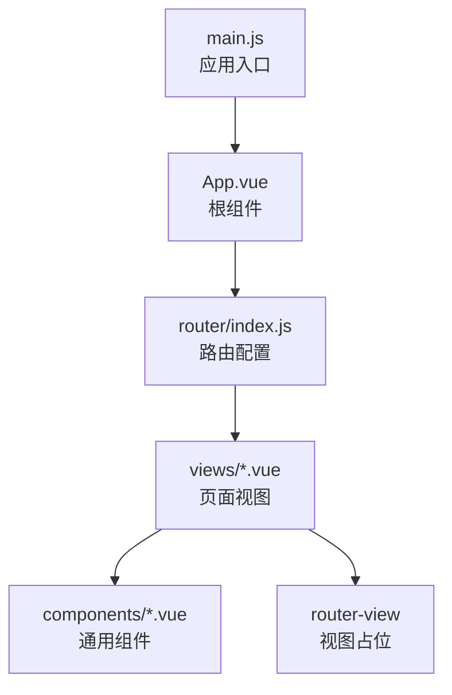
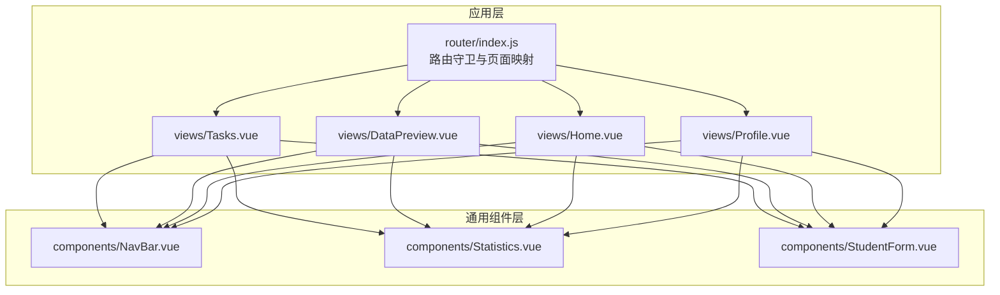
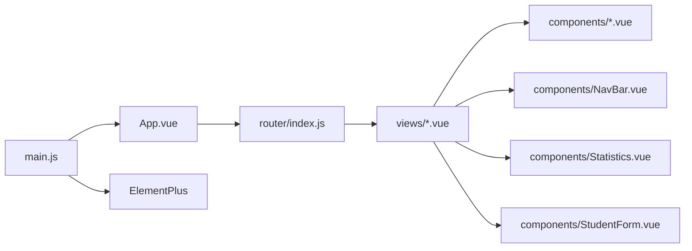

# 插槽系统使用

<cite>
**本文引用的文件**
- [App.vue](file://python-web/src/App.vue)
- [main.js](file://python-web/src/main.js)
- [NavBar.vue](file://python-web/src/components/NavBar.vue)
- [Statistics.vue](file://python-web/src/components/Statistics.vue)
- [StudentForm.vue](file://python-web/src/components/StudentForm.vue)
- [Tasks.vue](file://python-web/src/views/Tasks.vue)
- [DataPreview.vue](file://python-web/src/views/DataPreview.vue)
- [Home.vue](file://python-web/src/views/Home.vue)
- [Profile.vue](file://python-web/src/views/Profile.vue)
- [router/index.js](file://python-web/src/router/index.js)
</cite>

## 目录
1. [引言](#引言)
2. [项目结构](#项目结构)
3. [核心组件](#核心组件)
4. [架构总览](#架构总览)
5. [详细组件分析](#详细组件分析)
6. [依赖分析](#依赖分析)
7. [性能考量](#性能考量)
8. [故障排查指南](#故障排查指南)
9. [结论](#结论)
10. [附录](#附录)

## 引言
本文件面向希望提升组件灵活性的 Vue 开发者，系统梳理并讲解插槽（Slot）在项目中的使用方式与最佳实践。通过对现有组件的分析，我们将从默认插槽、具名插槽、作用域插槽三个维度出发，结合实际组件展示如何设计灵活的插槽接口，使组件具备更好的可定制性；同时覆盖插槽内容分发机制、插槽作用域数据传递、动态插槽名称等高级特性，并给出插槽设计规范、内容预设策略与回退处理建议，以及与 props 的组合模式与性能优化要点。

## 项目结构
本项目采用基于单文件组件（SFC）的组织方式，页面通过路由进行导航，通用布局与业务视图分别位于 views 与 components 目录。应用入口在 main.js 中挂载，App.vue 作为根组件承载路由视图。

图表来源
- [main.js:1-16](file://python-web/src/main.js#L1-L16)
- [App.vue:1-10](file://python-web/src/App.vue#L1-L10)
- [router/index.js:1-150](file://python-web/src/router/index.js#L1-L150)

章节来源
- [main.js:1-16](file://python-web/src/main.js#L1-L16)
- [App.vue:1-10](file://python-web/src/App.vue#L1-L10)
- [router/index.js:1-150](file://python-web/src/router/index.js#L1-L150)

## 核心组件
- 路由视图容器：App.vue 通过 router-view 占位，承载各页面视图。
- 通用头部导航：NavBar.vue 提供导航栏与用户信息区域，作为多个页面的顶部布局。
- 统计卡片：Statistics.vue 接收统计数据对象 props，渲染统计卡片，体现“以数据驱动内容”的思想，为后续插槽扩展提供参考。
- 学生表单：StudentForm.vue 展示了事件发射与表单交互，为插槽与事件协作提供范例。

章节来源
- [App.vue:1-10](file://python-web/src/App.vue#L1-L10)
- [NavBar.vue:1-352](file://python-web/src/components/NavBar.vue#L1-L352)
- [Statistics.vue:1-38](file://python-web/src/components/Statistics.vue#L1-L38)
- [StudentForm.vue:1-201](file://python-web/src/components/StudentForm.vue#L1-L201)

## 架构总览
下图展示了页面视图与通用组件之间的关系，以及插槽在布局中的潜在位置（例如在页面容器中插入自定义头部/侧边栏/底部内容）。

图表来源
- [router/index.js:1-150](file://python-web/src/router/index.js#L1-L150)
- [Tasks.vue:1-852](file://python-web/src/views/Tasks.vue#L1-L852)
- [DataPreview.vue:1-524](file://python-web/src/views/DataPreview.vue#L1-L524)
- [Home.vue:1-1055](file://python-web/src/views/Home.vue#L1-L1055)
- [Profile.vue:1-280](file://python-web/src/views/Profile.vue#L1-L280)
- [NavBar.vue:1-352](file://python-web/src/components/NavBar.vue#L1-L352)
- [Statistics.vue:1-38](file://python-web/src/components/Statistics.vue#L1-L38)
- [StudentForm.vue:1-201](file://python-web/src/components/StudentForm.vue#L1-L201)

## 详细组件分析

### 默认插槽（Default Slot）
默认插槽用于向组件内部插入任意内容，常用于页面容器或布局组件中，允许父组件自由替换默认内容。

- 设计要点
  - 在组件模板中使用默认插槽占位符，父组件直接在组件标签内写入内容即可生效。
  - 适用于“页面容器”类组件，如 App.vue 的 router-view 即为默认插槽的占位。
  - 建议提供合理的默认内容或空状态提示，避免父组件未提供内容时出现空白或异常。

- 实际参考
  - App.vue 使用 router-view 作为默认插槽占位，承载各页面视图。

- 最佳实践
  - 为默认插槽内容提供最小可用样式或骨架屏占位，保证在父组件未填充时仍具可读性。
  - 对于复杂容器，可提供“内容为空”的友好提示，便于调试与用户体验。

章节来源
- [App.vue:1-10](file://python-web/src/App.vue#L1-L10)

### 具名插槽（Named Slots）
具名插槽用于在组件内定义多个插槽出口，父组件通过带 name 的插槽指令选择性地替换特定区域。

- 设计要点
  - 在子组件中使用具名插槽出口，父组件通过 <template #name> 或 <template v-slot:name> 提供对应内容。
  - 适用于需要多区域定制的布局组件，如页面的头部、侧边栏、底部等。
  - 建议为每个具名插槽提供语义化名称，避免使用数字或无意义标识。

- 实际参考
  - 当前项目中未直接使用具名插槽语法，但可通过在页面容器中引入具名插槽来实现更灵活的布局定制（例如在页面容器中预留 header、sidebar、footer 等具名插槽）。

- 最佳实践
  - 为具名插槽提供默认内容或回退模板，确保父组件未提供时仍能正确渲染。
  - 对具名插槽的使用进行文档化，明确每个插槽的作用域与数据来源。

### 作用域插槽（Scoped Slots）
作用域插槽允许子组件向父组件暴露数据，父组件通过解构插槽作用域变量消费这些数据，实现“数据驱动内容”。

- 设计要点
  - 子组件在插槽上绑定数据，父组件通过 slot-scope 或 v-slot:default="{ ... }" 解构使用。
  - 适用于列表、表格、卡片等需要根据数据动态生成内容的场景。
  - 建议明确数据结构与字段含义，提供类型提示或注释，便于父组件正确消费。

- 实际参考
  - Statistics.vue 通过 props 接收统计对象，父组件可将其视为“作用域插槽”的数据来源（虽然未显式使用作用域插槽语法）。该模式体现了“数据由父组件传入，子组件负责渲染”的思想，可迁移为作用域插槽以增强灵活性。

- 最佳实践
  - 保持作用域插槽的数据最小化与稳定，避免频繁变更结构导致父组件适配成本上升。
  - 为作用域插槽提供清晰的命名与文档，标注每个字段的用途与约束。

### 动态插槽名称（Dynamic Slot Names）
动态插槽名称允许根据运行时条件选择不同的插槽出口，增强组件的灵活性。

- 设计要点
  - 使用 v-bind 将插槽名称绑定到变量，实现按需切换。
  - 适用于主题切换、语言切换、布局模式切换等场景。

- 实际参考
  - 当前项目未直接使用动态插槽名称，可在页面容器中引入动态插槽以支持多主题或多布局模式下的内容分发。

- 最佳实践
  - 控制动态插槽的可选范围，避免过度动态导致维护困难。
  - 为动态插槽提供默认分支与降级策略，确保异常情况下仍能正常渲染。

### 插槽与 props 的组合模式
- 组合模式
  - props 用于传递静态或受控数据，插槽用于传递结构化内容。
  - 二者结合可实现“数据由父组件提供，结构由父组件决定”的高灵活性设计。
- 性能考虑
  - 避免在插槽中进行重型计算，尽量将计算前置到父组件或通过响应式数据驱动。
  - 合理拆分插槽内容，减少不必要的重渲染。

- 实际参考
  - StudentForm.vue 通过 props 接收外部数据，通过 emit 事件向上反馈表单状态与结果，体现了 props 与事件的组合；若改为作用域插槽，可进一步让父组件决定表单的渲染结构与交互细节。

章节来源
- [StudentForm.vue:74-81](file://python-web/src/components/StudentForm.vue#L74-L81)
- [StudentForm.vue:187-200](file://python-web/src/components/StudentForm.vue#L187-L200)

### 插槽内容分发机制与作用域数据传递
- 分发机制
  - 默认插槽：父组件直接在子组件标签内书写内容，子组件通过默认插槽占位符接收。
  - 具名插槽：父组件通过具名插槽指令选择性提供内容，子组件按名称匹配分发。
  - 作用域插槽：子组件向父组件暴露数据，父组件通过解构作用域变量消费。
- 数据传递
  - 作用域插槽通过在插槽上绑定数据实现数据传递，父组件在 v-slot 中解构使用。
  - props 用于单向数据流，适合静态或受控数据的传递。

- 实际参考
  - Statistics.vue 通过 props 接收统计对象，父组件可将其视为作用域插槽的数据来源；若改为作用域插槽，父组件可更灵活地决定渲染结构。

章节来源
- [Statistics.vue:27-32](file://python-web/src/components/Statistics.vue#L27-L32)

### 回退内容与内容预设策略
- 回退内容
  - 为插槽提供默认内容或空状态提示，避免父组件未提供时出现空白。
- 内容预设
  - 在子组件中提供常见场景的默认模板，降低父组件的开发成本。
- 处理策略
  - 对于具名插槽，建议为每个插槽提供默认模板与回退方案。
  - 对于作用域插槽，提供默认数据结构与字段说明，便于父组件快速集成。

- 实际参考
  - Tasks.vue 与 DataPreview.vue 在加载与空状态时提供了骨架屏与空状态提示，体现了“内容预设与回退”的思路，可迁移到插槽中以增强灵活性。

章节来源
- [Tasks.vue:53-71](file://python-web/src/views/Tasks.vue#L53-L71)
- [DataPreview.vue:53-72](file://python-web/src/views/DataPreview.vue#L53-L72)

### 插槽命名规范与可维护性
- 命名规范
  - 使用语义化名称，避免使用数字或缩写。
  - 与组件职责相关联，如 header、sidebar、footer、actions 等。
- 可维护性
  - 为插槽提供文档与示例，明确数据来源与渲染规则。
  - 控制插槽数量与层级，避免过度复杂导致维护困难。

- 实际参考
  - 当前项目未直接使用具名插槽，可在页面容器中引入具名插槽并制定命名规范，提升组件复用性与一致性。

## 依赖分析
- 组件间依赖
  - 页面视图普遍依赖 NavBar 作为统一头部导航。
  - 视图与通用组件之间通过 props 与事件进行通信。
- 外部依赖
  - 应用通过 ElementPlus 提供 UI 组件库支持。
  - 路由通过 vue-router 进行页面导航。

图表来源
- [main.js:1-16](file://python-web/src/main.js#L1-L16)
- [App.vue:1-10](file://python-web/src/App.vue#L1-L10)
- [router/index.js:1-150](file://python-web/src/router/index.js#L1-L150)
- [NavBar.vue:1-352](file://python-web/src/components/NavBar.vue#L1-L352)
- [Statistics.vue:1-38](file://python-web/src/components/Statistics.vue#L1-L38)
- [StudentForm.vue:1-201](file://python-web/src/components/StudentForm.vue#L1-L201)

章节来源
- [main.js:1-16](file://python-web/src/main.js#L1-L16)
- [router/index.js:1-150](file://python-web/src/router/index.js#L1-L150)

## 性能考量
- 渲染开销控制
  - 避免在插槽中进行重型计算，尽量将计算前置到父组件或通过响应式数据驱动。
  - 合理拆分插槽内容，减少不必要的重渲染。
- 按需加载
  - 对于大型插槽内容，可结合异步组件与懒加载策略，降低首屏压力。
- 数据稳定性
  - 作用域插槽的数据结构应保持稳定，避免频繁变更导致父组件适配成本上升。

## 故障排查指南
- 插槽内容不显示
  - 检查是否正确使用具名插槽指令或作用域插槽语法。
  - 确认父组件是否提供了对应插槽内容。
- 数据无法解构
  - 检查子组件是否在插槽上正确绑定了数据。
  - 确认父组件在 v-slot 中的解构语法是否正确。
- 性能问题
  - 检查插槽中是否存在重型计算或大对象渲染。
  - 评估是否需要拆分插槽或引入懒加载策略。

## 结论
通过合理运用默认插槽、具名插槽与作用域插槽，可以显著提升组件的灵活性与可复用性。结合 props 与事件的组合模式，既能保证数据的可控性，又能赋予父组件足够的定制空间。建议在实际项目中逐步引入具名插槽与作用域插槽，并建立完善的命名规范与文档，以提升团队协作效率与长期维护性。

## 附录
- 插槽设计清单
  - 是否需要具名插槽或作用域插槽？
  - 是否提供默认内容与回退策略？
  - 数据结构是否稳定且文档化？
  - 是否存在性能风险并已优化？