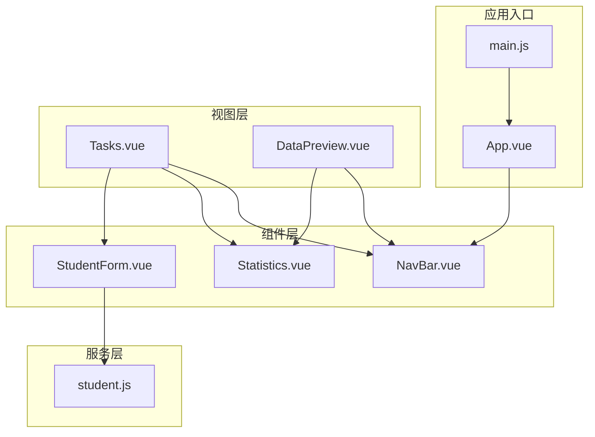
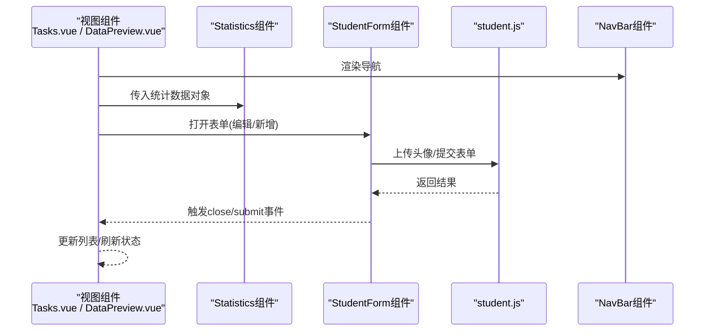
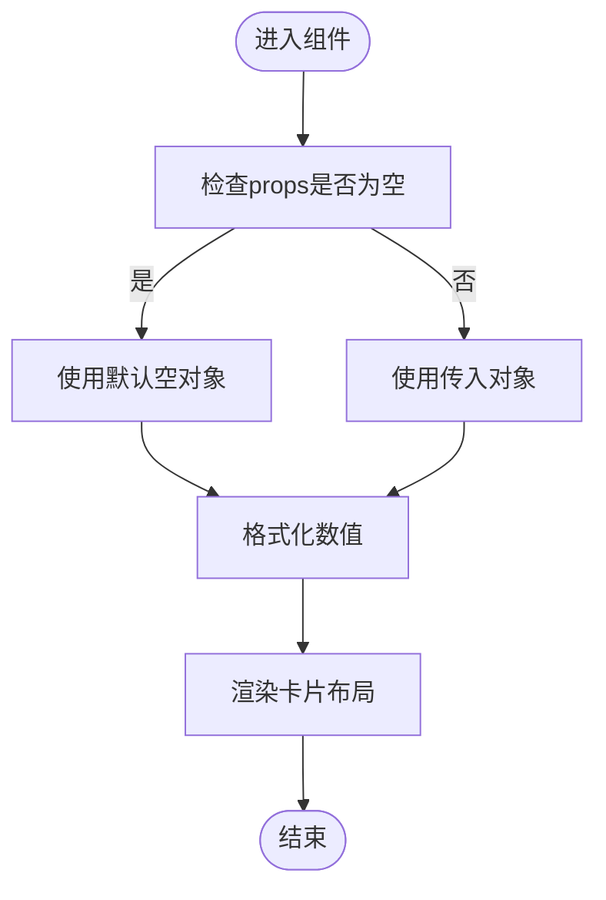
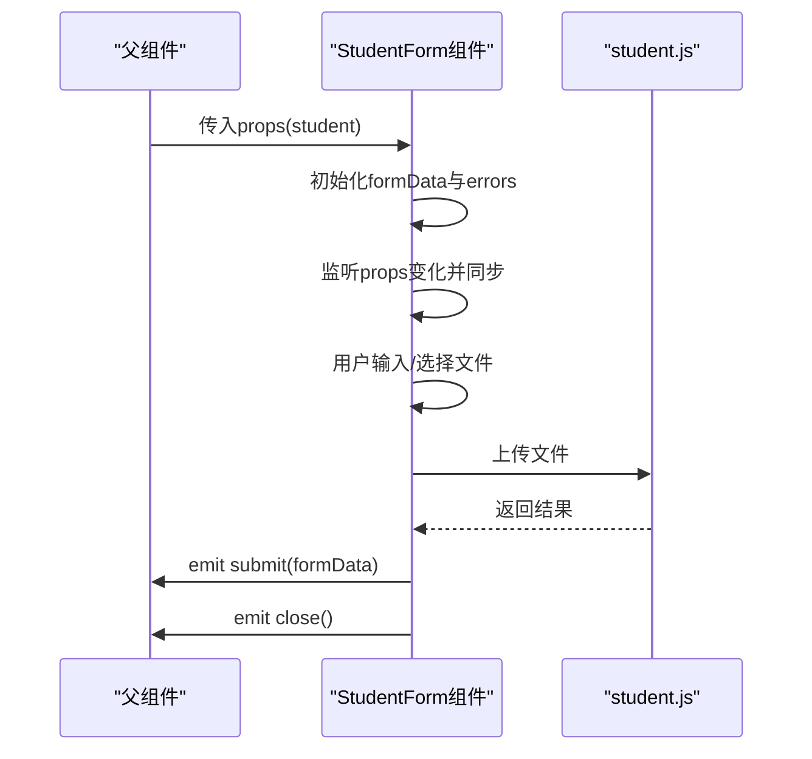
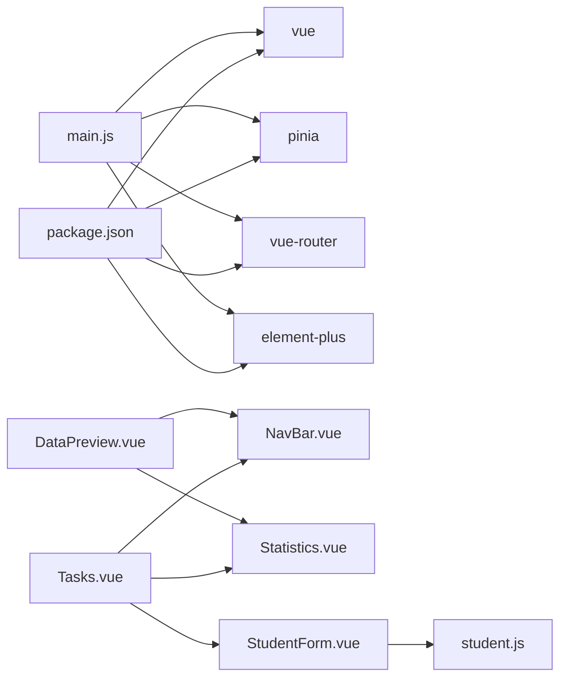

# 组件复用

<cite>
**本文引用的文件**
- [Statistics.vue](file://python-web/src/components/Statistics.vue)
- [StudentForm.vue](file://python-web/src/components/StudentForm.vue)
- [NavBar.vue](file://python-web/src/components/NavBar.vue)
- [student.js](file://python-web/src/api/student.js)
- [Tasks.vue](file://python-web/src/views/Tasks.vue)
- [DataPreview.vue](file://python-web/src/views/DataPreview.vue)
- [main.js](file://python-web/src/main.js)
- [style.css](file://python-web/src/style.css)
- [App.vue](file://python-web/src/App.vue)
- [package.json](file://python-web/package.json)
</cite>

## 目录
1. [引言](#引言)
2. [项目结构](#项目结构)
3. [核心组件](#核心组件)
4. [架构总览](#架构总览)
5. [详细组件分析](#详细组件分析)
6. [依赖关系分析](#依赖关系分析)
7. [性能考量](#性能考量)
8. [故障排查指南](#故障排查指南)
9. [结论](#结论)
10. [附录](#附录)

## 引言
本文件围绕Vue3项目中的组件复用策略展开，重点解析Statistics与StudentForm两个组件的设计与实现，并结合实际业务场景（任务管理、数据预览）说明如何通过高内聚低耦合的方式构建可复用组件。内容涵盖组件封装原则、props设计、插槽使用、动态组件实现、配置化与主题定制、条件渲染等技巧，并给出组件库设计思路、组件文档编写规范、组件测试策略与性能优化建议，帮助Vue开发者系统提升组件设计能力。

## 项目结构
该项目采用典型的单页应用结构，前端以Vue3 + Vite + Pinia + Element Plus为主栈，组件集中在src/components目录，页面视图集中在src/views目录，API封装在src/api目录，全局样式在src/style.css中集中定义。

图表来源
- [App.vue:1-10](file://python-web/src/App.vue#L1-L10)
- [main.js:1-16](file://python-web/src/main.js#L1-L16)
- [Statistics.vue:1-38](file://python-web/src/components/Statistics.vue#L1-L38)
- [StudentForm.vue:1-201](file://python-web/src/components/StudentForm.vue#L1-L201)
- [NavBar.vue:1-352](file://python-web/src/components/NavBar.vue#L1-L352)
- [Tasks.vue:1-852](file://python-web/src/views/Tasks.vue#L1-L852)
- [DataPreview.vue:1-517](file://python-web/src/views/DataPreview.vue#L1-L517)
- [student.js:1-102](file://python-web/src/api/student.js#L1-L102)

章节来源
- [main.js:1-16](file://python-web/src/main.js#L1-L16)
- [App.vue:1-10](file://python-web/src/App.vue#L1-L10)

## 核心组件
本节聚焦于Statistics与StudentForm两个组件，阐述其在复用性上的设计要点与实现细节。

- Statistics组件
  - 职责单一：仅负责展示统计指标卡片，不关心数据来源与业务上下文。
  - 输入约定：通过props接收一个对象，内部对缺失值进行安全处理与格式化。
  - 输出稳定：输出固定结构的卡片布局，便于在不同视图中复用。
  - 可扩展点：可通过外部传入更多指标字段，或在组件内增加格式化函数扩展。

- StudentForm组件
  - 表单驱动：以响应式数据与校验逻辑为核心，支持新增与编辑两种模式。
  - 文件上传：内置头像上传流程，包含类型与大小校验、预览与回退。
  - 事件发射：通过自定义事件向上抛出提交与关闭动作，解耦UI与父组件业务。
  - 复用潜力：可抽象为通用表单容器，配合不同schema与校验规则实现跨页面复用。

章节来源
- [Statistics.vue:1-38](file://python-web/src/components/Statistics.vue#L1-L38)
- [StudentForm.vue:1-201](file://python-web/src/components/StudentForm.vue#L1-L201)

## 架构总览
下图展示了组件与视图之间的交互关系，以及API层的数据流。

图表来源
- [Tasks.vue:1-852](file://python-web/src/views/Tasks.vue#L1-L852)
- [DataPreview.vue:1-517](file://python-web/src/views/DataPreview.vue#L1-L517)
- [Statistics.vue:1-38](file://python-web/src/components/Statistics.vue#L1-L38)
- [StudentForm.vue:1-201](file://python-web/src/components/StudentForm.vue#L1-L201)
- [student.js:1-102](file://python-web/src/api/student.js#L1-L102)
- [NavBar.vue:1-352](file://python-web/src/components/NavBar.vue#L1-L352)

## 详细组件分析

### Statistics组件分析
- 设计原则
  - 单一职责：只做展示，不参与数据获取与业务决策。
  - 安全访问：对空值与异常值进行兜底处理，避免渲染异常。
  - 可读性：数值格式化统一由组件内部函数完成，减少父组件负担。
- Props设计
  - 使用对象类型作为输入，default提供空对象，确保组件健壮性。
- 插槽与动态性
  - 当前未使用具名插槽；若需扩展，可在卡片层面引入具名插槽以支持自定义头部/尾部内容。
- 复用建议
  - 将卡片布局抽离为独立卡片组件，Statistics仅负责数据映射与格式化。
  - 支持主题变量注入，通过CSS变量或主题配置切换视觉风格。

图表来源
- [Statistics.vue:26-38](file://python-web/src/components/Statistics.vue#L26-L38)

章节来源
- [Statistics.vue:1-38](file://python-web/src/components/Statistics.vue#L1-L38)

### StudentForm组件分析
- 设计原则
  - 表单即组件：将表单状态、校验、提交、上传等逻辑收敛到组件内部。
  - 事件驱动：通过自定义事件与父组件通信，保持父子解耦。
  - 错误处理：对文件类型、大小、网络异常进行明确提示与回退。
- Props与事件
  - props接收student对象，用于编辑模式下的初始填充。
  - emits定义close与submit事件，分别用于关闭与提交。
- 数据与状态
  - 使用ref与computed组合管理表单数据、错误信息、上传状态与预览。
  - watch监听外部student变化，实现双向同步。
- 上传流程
  - 文件选择后本地预览，随后调用API上传，成功后回填URL，失败则回退到上次可用URL。
- 复用建议
  - 抽象为通用表单容器，支持schema驱动与动态校验规则。
  - 增加主题与样式变量注入，适配不同业务风格。

图表来源
- [StudentForm.vue:70-201](file://python-web/src/components/StudentForm.vue#L70-L201)
- [student.js:59-66](file://python-web/src/api/student.js#L59-L66)

章节来源
- [StudentForm.vue:1-201](file://python-web/src/components/StudentForm.vue#L1-L201)
- [student.js:1-102](file://python-web/src/api/student.js#L1-L102)

### NavBar组件分析
- 设计原则
  - 导航即服务：集中处理路由高亮、下拉菜单、用户信息等导航行为。
  - 状态集中：使用computed与ref管理激活态与下拉状态，降低重复逻辑。
- 复用建议
  - 将下拉菜单抽象为可复用子组件，支持传入菜单项与路由配置。
  - 支持主题切换与图标库统一管理。

章节来源
- [NavBar.vue:1-352](file://python-web/src/components/NavBar.vue#L1-L352)

## 依赖关系分析
- 运行时依赖
  - Vue3、Pinia、Element Plus、vue-router构成基础生态。
- 组件依赖
  - 视图组件依赖NavBar作为通用导航。
  - Tasks与DataPreview视图依赖Statistics组件进行数据概览。
  - StudentForm组件依赖student.js进行数据交互。
- 样式依赖
  - 全局style.css提供主题变量与通用样式，组件通过scoped样式隔离。

图表来源
- [package.json:1-24](file://python-web/package.json#L1-L24)
- [main.js:1-16](file://python-web/src/main.js#L1-L16)
- [Tasks.vue:1-852](file://python-web/src/views/Tasks.vue#L1-L852)
- [DataPreview.vue:1-517](file://python-web/src/views/DataPreview.vue#L1-L517)
- [Statistics.vue:1-38](file://python-web/src/components/Statistics.vue#L1-L38)
- [StudentForm.vue:1-201](file://python-web/src/components/StudentForm.vue#L1-L201)
- [student.js:1-102](file://python-web/src/api/student.js#L1-L102)
- [NavBar.vue:1-352](file://python-web/src/components/NavBar.vue#L1-L352)

章节来源
- [package.json:1-24](file://python-web/package.json#L1-L24)
- [main.js:1-16](file://python-web/src/main.js#L1-L16)

## 性能考量
- 渲染优化
  - 使用计算属性缓存过滤与分页结果，避免重复计算。
  - 在大数据列表中采用虚拟滚动或分页加载，减少DOM节点数量。
- 网络优化
  - 对上传文件进行类型与大小限制，减少无效请求。
  - 合理设置超时与重试策略，避免阻塞主线程。
- 样式与主题
  - 通过CSS变量集中管理主题色与阴影，减少样式切换成本。
  - 组件样式使用scoped，避免全局污染，同时注意样式穿透与覆盖成本。
- 事件与内存
  - 在组件销毁时清理定时器与事件监听，防止内存泄漏。
  - 对高频事件（如输入框输入）进行防抖/节流处理。

## 故障排查指南
- 表单校验失败
  - 检查输入范围与必填项，确认错误信息是否正确显示。
  - 确认v-model绑定的类型转换（如v-model.number）是否符合预期。
- 文件上传异常
  - 确认文件类型与大小限制是否合理。
  - 检查API返回码与message，确保错误提示清晰。
- 统计数据为空
  - 确认父组件传入的statistics对象结构是否一致。
  - 检查格式化函数对undefined/null的处理逻辑。
- 导航高亮异常
  - 检查路由匹配逻辑与computed表达式，确保路径前缀判断正确。

章节来源
- [StudentForm.vue:163-185](file://python-web/src/components/StudentForm.vue#L163-L185)
- [Statistics.vue:34-37](file://python-web/src/components/Statistics.vue#L34-L37)
- [NavBar.vue:96-99](file://python-web/src/components/NavBar.vue#L96-L99)

## 结论
通过Statistics与StudentForm两个组件的实践，可以提炼出以下组件复用的关键经验：
- 单一职责与清晰的输入输出约定，是高内聚低耦合的基础。
- 将格式化、校验、上传等横切逻辑收敛到组件内部，提升复用性。
- 通过props与事件实现父子解耦，配合API层抽象实现跨页面复用。
- 使用CSS变量与主题系统，实现配置化与主题定制。
- 在视图层通过组合与条件渲染，灵活拼装组件，形成可维护的界面骨架。

## 附录

### 组件封装原则清单
- 明确职责边界：每个组件只做一件事。
- 约定输入输出：props与emits清晰、稳定。
- 内聚逻辑：将格式化、校验、网络请求等逻辑收敛到组件内部。
- 解耦交互：通过事件与回调与父组件通信。
- 可配置：支持主题变量、样式类名、尺寸等配置。
- 可测试：暴露关键方法与状态，便于单元测试与E2E测试。

### 组件配置化与主题定制
- 主题变量
  - 在全局style.css中集中定义主色、辅助色、功能色与阴影变量。
  - 组件内部通过CSS变量引用，实现主题切换与样式复用。
- 组件属性
  - 通过props传入尺寸、颜色、文案等配置，避免硬编码。
- 样式隔离
  - 使用scoped样式与深度选择器，控制样式作用域与覆盖成本。

章节来源
- [style.css:1-45](file://python-web/src/style.css#L1-L45)

### 动态组件与条件渲染
- 动态组件
  - 在视图层根据状态动态渲染不同组件，减少分支复杂度。
- 条件渲染
  - 使用v-if/v-show控制加载态、空态与错误态，提升用户体验。
  - 对复杂条件使用计算属性封装，提高可读性与可维护性。

章节来源
- [Tasks.vue:53-71](file://python-web/src/views/Tasks.vue#L53-L71)
- [DataPreview.vue:53-72](file://python-web/src/views/DataPreview.vue#L53-L72)

### 组件库设计思路
- 规范化命名与目录结构：按功能模块划分组件，统一命名与导出。
- 文档与示例：为每个组件提供API文档、使用示例与最佳实践。
- 主题与样式：提供默认主题与可替换主题，支持暗色/亮色切换。
- 测试体系：建立单元测试、快照测试与端到端测试，保障质量。
- 版本与变更：记录breaking change与迁移指南，降低升级成本。

### 组件文档编写规范
- 组件概述：用途、适用场景、核心能力。
- API参考：props、emits、slots、events、methods、expose。
- 示例代码：最小可运行示例与常见用法。
- 最佳实践：性能优化、可访问性、可测试性建议。
- 常见问题：FAQ与排障指引。

### 组件测试策略
- 单元测试
  - 测试props默认值与校验逻辑。
  - 测试事件发射与回调触发。
- 快照测试
  - 对静态渲染结果进行快照对比，防止意外样式破坏。
- 端到端测试
  - 覆盖关键用户路径（新增/编辑/上传/提交），模拟真实交互。
- 性能测试
  - 对大数据渲染与高频事件进行基准测试，识别瓶颈。

### 组件性能优化建议
- 渲染层面
  - 使用计算属性缓存昂贵计算。
  - 对长列表使用虚拟滚动或分页。
- 网络层面
  - 合理设置超时与重试，避免阻塞。
  - 对上传文件进行本地预览与校验，减少无效请求。
- 样式层面
  - 使用CSS变量与主题系统，减少样式切换成本。
  - 避免深层样式穿透，减少样式计算复杂度。
- 事件层面
  - 对高频事件进行防抖/节流。
  - 在组件销毁时清理定时器与事件监听。