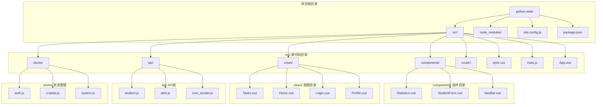
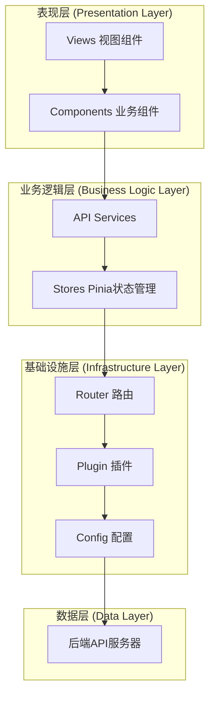
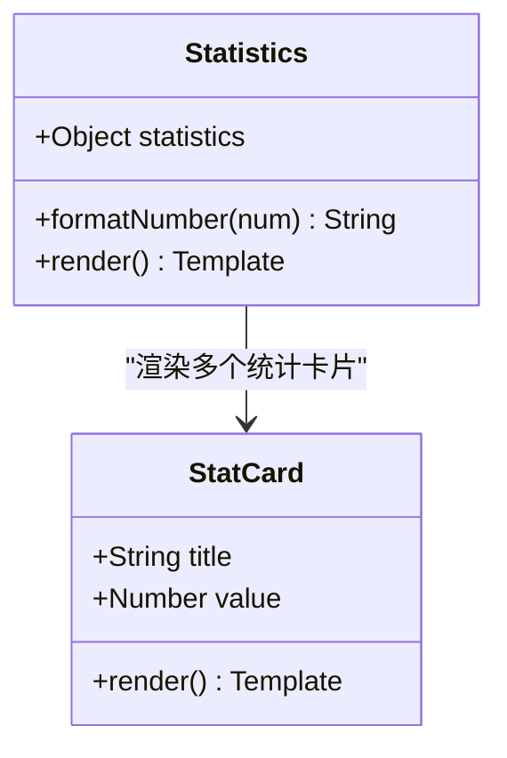
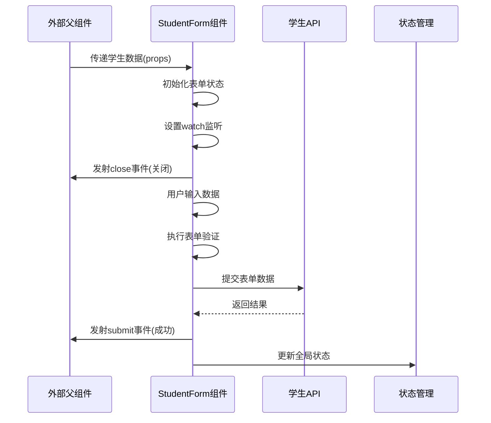
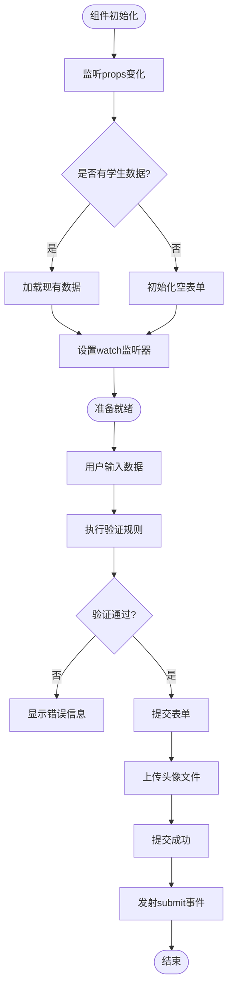
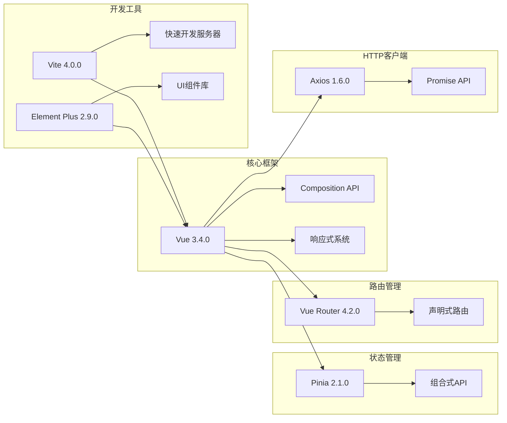
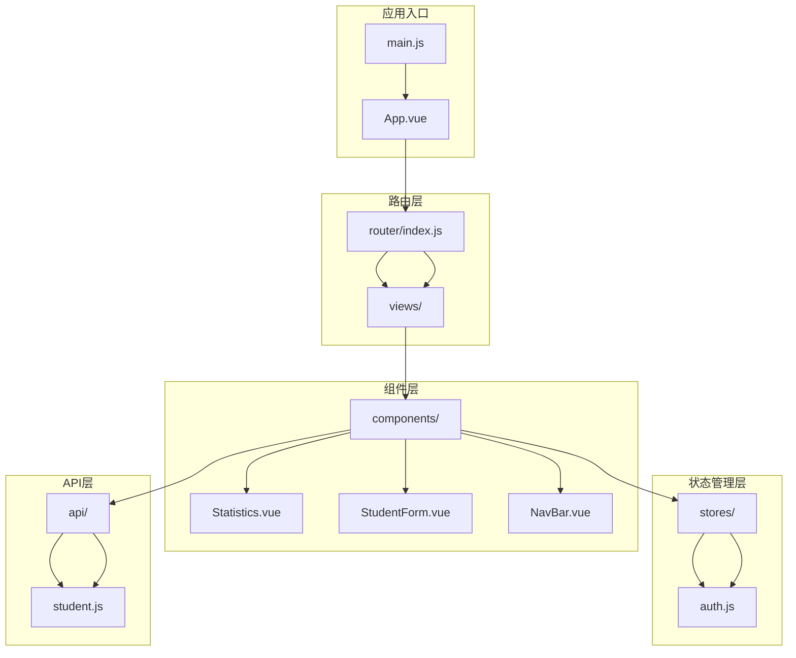

# 组件封装设计

<cite>
**本文档引用的文件**
- [Statistics.vue](file://python-web/src/components/Statistics.vue)
- [StudentForm.vue](file://python-web/src/components/StudentForm.vue)
- [NavBar.vue](file://python-web/src/components/NavBar.vue)
- [student.js](file://python-web/src/api/student.js)
- [main.js](file://python-web/src/main.js)
- [App.vue](file://python-web/src/App.vue)
- [router/index.js](file://python-web/src/router/index.js)
- [stores/auth.js](file://python-web/src/stores/auth.js)
- [style.css](file://python-web/src/style.css)
- [package.json](file://python-web/package.json)
- [vite.config.js](file://python-web/vite.config.js)
</cite>

## 目录
1. [引言](#引言)
2. [项目结构](#项目结构)
3. [核心组件](#核心组件)
4. [架构概览](#架构概览)
5. [详细组件分析](#详细组件分析)
6. [依赖关系分析](#依赖关系分析)
7. [性能考量](#性能考量)
8. [故障排除指南](#故障排除指南)
9. [结论](#结论)
10. [附录](#附录)

## 引言

本项目是一个基于Vue 3的前端应用，采用Composition API和现代前端技术栈构建。项目实现了完整的组件封装设计理念，包括Statistics通用数据展示组件和StudentForm表单组件的设计模式。本文档将深入解析组件封装的核心原则，包括单一职责、高内聚设计、接口清晰性，并通过具体示例展示如何设计可复用、可维护的Vue组件。

## 项目结构

该项目采用模块化组织方式，主要目录结构如下：

**图表来源**
- [main.js:1-16](file://python-web/src/main.js#L1-L16)
- [App.vue:1-10](file://python-web/src/App.vue#L1-L10)

**章节来源**
- [main.js:1-16](file://python-web/src/main.js#L1-L16)
- [package.json:1-24](file://python-web/package.json#L1-L24)

## 核心组件

### 组件封装基本原则

基于对项目中组件的分析，可以总结出以下核心设计原则：

#### 1. 单一职责原则
每个组件应该专注于完成一个特定的功能，避免功能混杂导致的复杂性增加。

#### 2. 高内聚设计
组件内部的逻辑、状态和方法应该紧密相关，形成统一的功能单元。

#### 3. 接口清晰性
组件的props、events和slots应该有明确的定义和用途，便于外部使用。

#### 4. 可配置性与扩展性
组件应该支持通过props进行配置，并预留扩展点以便于功能增强。

**章节来源**
- [Statistics.vue:1-38](file://python-web/src/components/Statistics.vue#L1-L38)
- [StudentForm.vue:1-201](file://python-web/src/components/StudentForm.vue#L1-L201)

## 架构概览

项目采用分层架构设计，各层职责明确：

**图表来源**
- [router/index.js:1-150](file://python-web/src/router/index.js#L1-L150)
- [stores/auth.js:1-74](file://python-web/src/stores/auth.js#L1-L74)

## 详细组件分析

### Statistics 组件分析

Statistics组件是一个典型的通用数据展示组件，专门用于展示统计数据信息。

#### 组件设计特点

**图表来源**
- [Statistics.vue:26-38](file://python-web/src/components/Statistics.vue#L26-L38)

#### Props 设计分析

组件的props设计体现了清晰的接口定义：

| 属性名 | 类型 | 默认值 | 必填 | 描述 |
|--------|------|--------|------|------|
| statistics | Object | {} | 否 | 包含统计信息的对象 |

#### 数据格式要求

组件期望的statistics对象应包含以下字段：
- total: 学生总数
- average_age: 平均年龄
- average_grade: 平均成绩  
- highest_grade: 最高成绩
- lowest_grade: 最低成绩

#### 格式化处理

组件提供了专门的数值格式化函数，确保数据显示的一致性和可读性。

**章节来源**
- [Statistics.vue:26-38](file://python-web/src/components/Statistics.vue#L26-L38)

### StudentForm 组件分析

StudentForm是一个复杂的表单组件，集成了用户输入、验证、文件上传等功能。

#### 组件架构设计

**图表来源**
- [StudentForm.vue:70-201](file://python-web/src/components/StudentForm.vue#L70-L201)

#### Props 设计原则

| 属性名 | 类型 | 默认值 | 必填 | 描述 |
|--------|------|--------|------|------|
| student | Object | null | 否 | 编辑模式下的学生数据 |

#### 事件发射机制

组件定义了两个重要的事件：

1. **close事件**: 当用户点击关闭按钮时触发
2. **submit事件**: 当表单验证通过并提交成功时触发

#### 表单状态管理

组件使用响应式状态管理表单数据：

**图表来源**
- [StudentForm.vue:102-185](file://python-web/src/components/StudentForm.vue#L102-L185)

#### 文件上传处理

组件实现了完整的文件上传流程，包括：

1. **文件类型验证**: 确保只接受图片文件
2. **文件大小限制**: 限制最大5MB
3. **预览功能**: 实时显示选择的图片
4. **异步上传**: 使用Promise处理上传过程
5. **错误处理**: 完善的异常捕获和用户提示

**章节来源**
- [StudentForm.vue:128-161](file://python-web/src/components/StudentForm.vue#L128-L161)

### 组件命名规范

项目遵循统一的命名约定：

#### 组件文件命名
- 使用PascalCase命名法：`StudentForm.vue`, `Statistics.vue`, `NavBar.vue`
- 文件扩展名为`.vue`

#### 组件导出命名
- 组件名称与文件名保持一致
- 使用默认导出方式

#### 样式命名
- 使用BEM(Block Element Modifier)命名法
- 统一前缀：`stat-card`, `modal-overlay`, `form-group`

**章节来源**
- [Statistics.vue:1-38](file://python-web/src/components/Statistics.vue#L1-L38)
- [StudentForm.vue:1-201](file://python-web/src/components/StudentForm.vue#L1-L201)

## 依赖关系分析

### 技术栈依赖

**图表来源**
- [package.json:11-18](file://python-web/package.json#L11-L18)

### 组件间依赖关系

**图表来源**
- [main.js:1-16](file://python-web/src/main.js#L1-L16)
- [router/index.js:1-150](file://python-web/src/router/index.js#L1-L150)

**章节来源**
- [package.json:1-24](file://python-web/package.json#L1-L24)

## 性能考量

### 组件性能优化策略

1. **懒加载**: 使用动态导入实现组件按需加载
2. **虚拟滚动**: 对大量数据列表使用虚拟滚动技术
3. **防抖节流**: 对高频事件使用防抖节流处理
4. **缓存策略**: 合理使用计算属性和缓存机制
5. **异步加载**: 将耗时操作异步化处理

### 内存管理

- 及时清理定时器和事件监听器
- 合理使用watch和computed
- 避免内存泄漏

## 故障排除指南

### 常见问题及解决方案

#### 1. 组件无法接收props

**问题症状**: 子组件显示默认值而非传入的值

**解决方法**:
- 检查父组件是否正确传递props
- 确认props类型定义是否匹配
- 验证数据绑定语法

#### 2. 表单验证不生效

**问题症状**: 表单提交时未显示错误信息

**解决方法**:
- 检查validate函数的返回值
- 确认错误状态的更新时机
- 验证v-model绑定的字段名

#### 3. 文件上传失败

**问题症状**: 图片上传后无法显示或报错

**解决方法**:
- 检查API端点配置
- 验证文件大小和类型限制
- 确认跨域配置

**章节来源**
- [StudentForm.vue:163-185](file://python-web/src/components/StudentForm.vue#L163-L185)
- [student.js:59-66](file://python-web/src/api/student.js#L59-L66)

## 结论

通过对该Vue项目的深入分析，我们可以看到组件封装设计的核心要点：

1. **明确的职责划分**: 每个组件都有清晰的功能边界
2. **统一的接口设计**: props、events、slots的标准化定义
3. **完善的错误处理**: 全面的异常捕获和用户反馈机制
4. **良好的可扩展性**: 为未来功能增强预留空间

这些设计原则不仅适用于当前项目，也为其他Vue项目的组件开发提供了宝贵的参考经验。

## 附录

### 组件开发最佳实践清单

#### Props设计
- 明确必需参数和可选参数
- 提供合理的默认值
- 进行类型验证和边界检查
- 文档化每个prop的用途

#### 事件设计
- 事件命名语义化
- 事件参数结构化
- 错误情况下的事件处理
- 事件生命周期管理

#### 样式封装
- 使用scoped样式
- 组件级样式隔离
- 全局样式的最小化使用
- 响应式设计考虑

#### 性能优化
- 合理使用计算属性
- 避免不必要的重渲染
- 异步处理耗时操作
- 内存泄漏预防