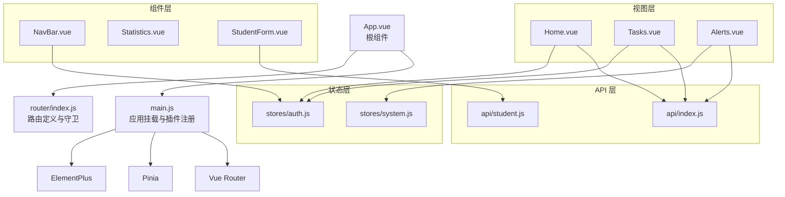
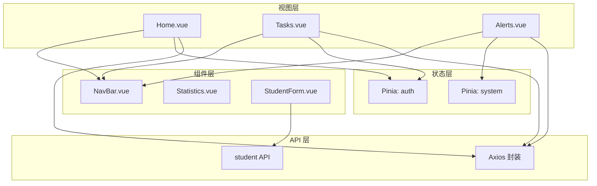
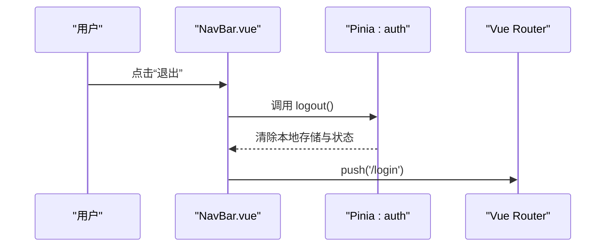
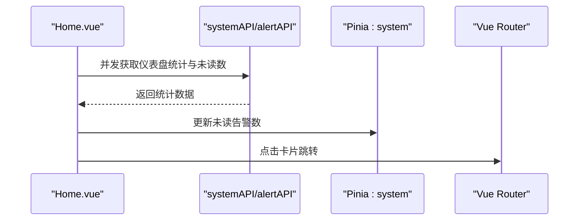
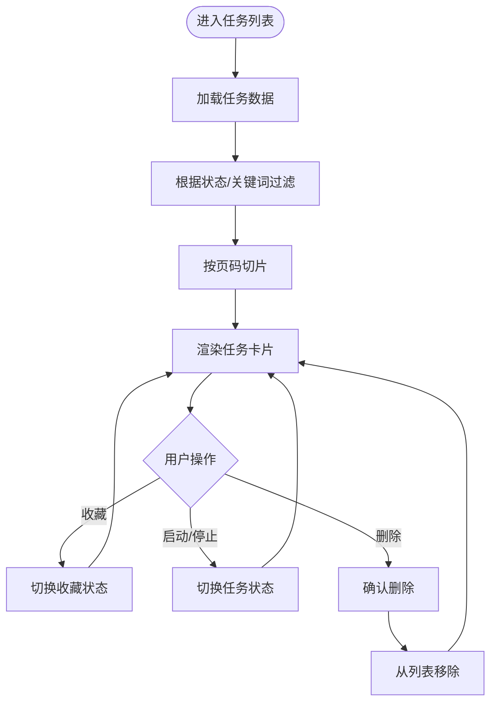
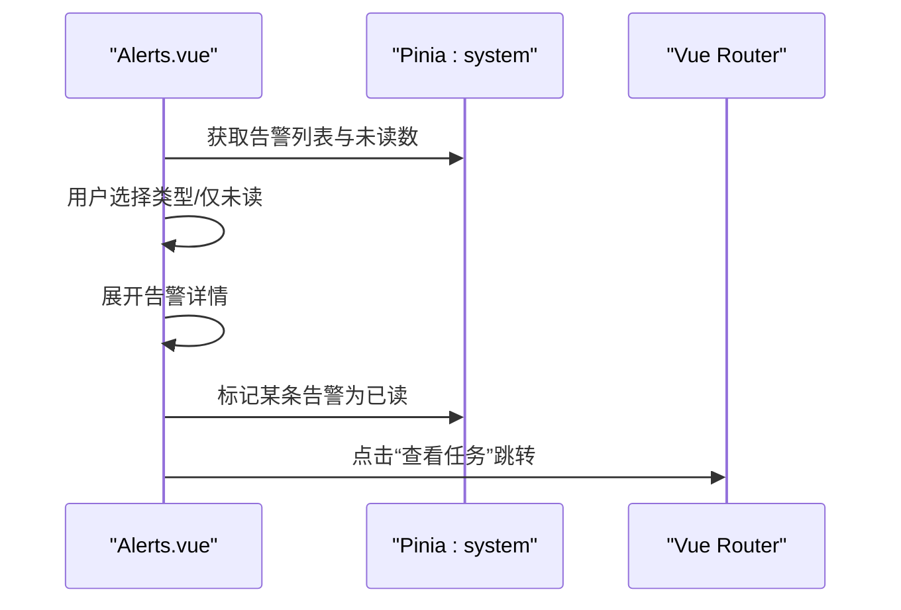
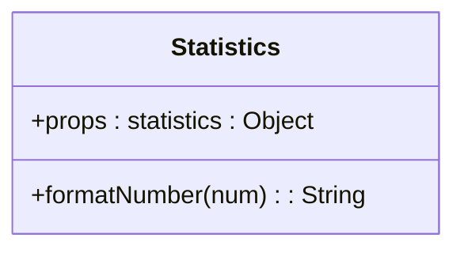
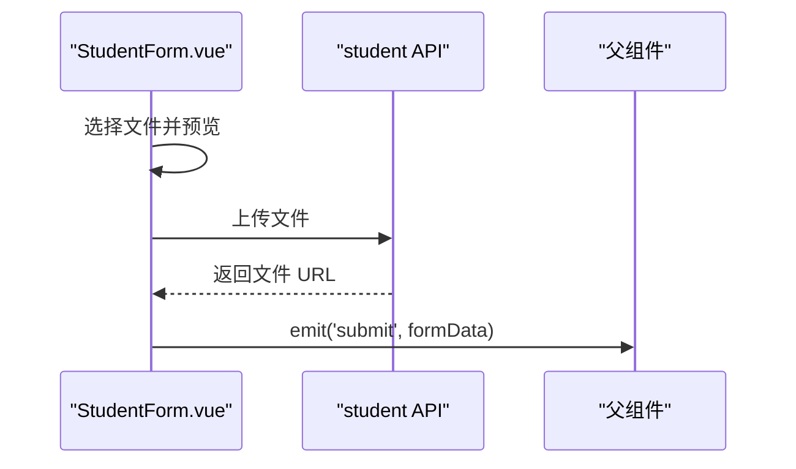
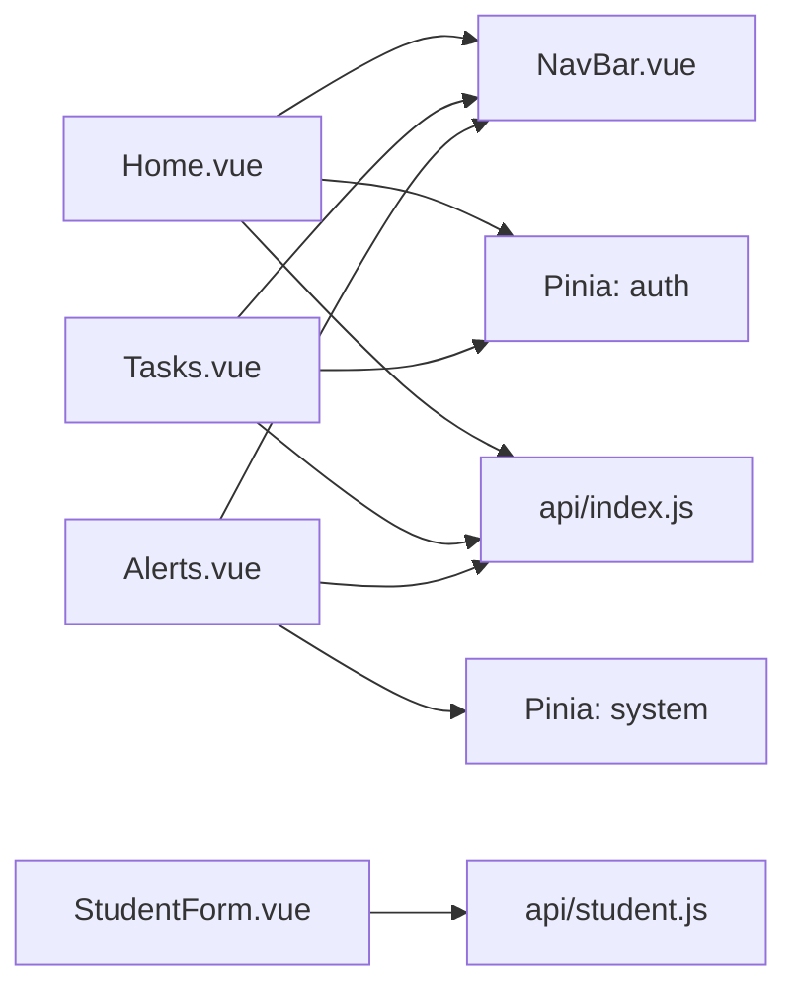
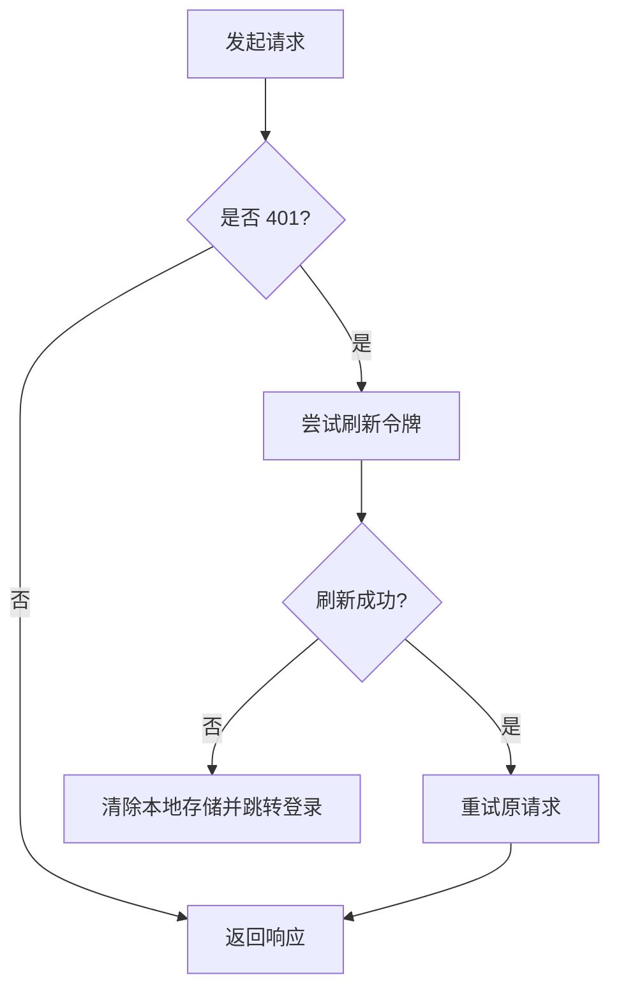

# 组件组合模式

<cite>
**本文引用的文件**
- [App.vue](file://python-web/src/App.vue)
- [main.js](file://python-web/src/main.js)
- [NavBar.vue](file://python-web/src/components/NavBar.vue)
- [Statistics.vue](file://python-web/src/components/Statistics.vue)
- [StudentForm.vue](file://python-web/src/components/StudentForm.vue)
- [Home.vue](file://python-web/src/views/Home.vue)
- [Tasks.vue](file://python-web/src/views/Tasks.vue)
- [Alerts.vue](file://python-web/src/views/Alerts.vue)
- [router/index.js](file://python-web/src/router/index.js)
- [stores/auth.js](file://python-web/src/stores/auth.js)
- [stores/system.js](file://python-web/src/stores/system.js)
- [api/index.js](file://python-web/src/api/index.js)
- [api/student.js](file://python-web/src/api/student.js)
- [package.json](file://python-web/package.json)
</cite>

## 目录
1. [简介](#简介)
2. [项目结构](#项目结构)
3. [核心组件](#核心组件)
4. [架构总览](#架构总览)
5. [详细组件分析](#详细组件分析)
6. [依赖分析](#依赖分析)
7. [性能考量](#性能考量)
8. [故障排查指南](#故障排查指南)
9. [结论](#结论)
10. [附录](#附录)

## 简介
本文件围绕“组件组合模式”展开，结合项目中的实际组件与状态管理实践，系统阐述：
- 父子组件通信（props/emits）
- 兄弟组件协作（通过共享状态）
- 跨层级通信（Pinia 全局状态）
- provide/inject 的使用场景与替代方案
- 事件总线与全局状态管理在组件组合中的应用
- 如何设计松耦合的组件架构
- 最佳实践、测试策略、调试技巧与性能监控方法

目标读者为希望构建大型 Vue 应用的架构师与高级开发者。

## 项目结构
该项目采用典型的 Vue3 + Vite 前端工程，采用单页应用（SPA）架构，使用 Vue Router 进行页面级导航，使用 Pinia 进行全局状态管理，Element Plus 提供 UI 组件库。

图表来源
- [App.vue:1-10](file://python-web/src/App.vue#L1-L10)
- [main.js:1-16](file://python-web/src/main.js#L1-L16)
- [router/index.js:1-150](file://python-web/src/router/index.js#L1-L150)
- [stores/auth.js:1-74](file://python-web/src/stores/auth.js#L1-L74)
- [stores/system.js:1-168](file://python-web/src/stores/system.js#L1-L168)
- [api/index.js:1-95](file://python-web/src/api/index.js#L1-L95)
- [api/student.js:1-102](file://python-web/src/api/student.js#L1-L102)

章节来源
- [package.json:1-24](file://python-web/package.json#L1-L24)
- [main.js:1-16](file://python-web/src/main.js#L1-L16)
- [router/index.js:1-150](file://python-web/src/router/index.js#L1-L150)

## 核心组件
- 根组件与入口
  - 根组件负责渲染路由出口，应用初始化时注册 Pinia、路由与 UI 插件。
- 导航栏组件
  - 提供全局导航、用户信息与登出流程，并与认证状态联动。
- 视图组件
  - 首页、任务列表、告警中心等页面组件，承担数据拉取、筛选与分页逻辑。
- 可复用组件
  - 统计卡片组件用于展示聚合指标；表单弹窗组件用于新增/编辑学生信息。
- 状态管理
  - 认证状态（登录态、用户信息、令牌）与系统状态（告警、代理、日志、资源）。
- API 层
  - Axios 封装与拦截器处理鉴权与自动刷新；独立的 student API 模块。

章节来源
- [App.vue:1-10](file://python-web/src/App.vue#L1-L10)
- [main.js:1-16](file://python-web/src/main.js#L1-L16)
- [NavBar.vue:1-352](file://python-web/src/components/NavBar.vue#L1-L352)
- [Home.vue:1-400](file://python-web/src/views/Home.vue#L1-L400)
- [Tasks.vue:1-800](file://python-web/src/views/Tasks.vue#L1-L800)
- [Alerts.vue:1-200](file://python-web/src/views/Alerts.vue#L1-L200)
- [Statistics.vue:1-38](file://python-web/src/components/Statistics.vue#L1-L38)
- [StudentForm.vue:1-201](file://python-web/src/components/StudentForm.vue#L1-L201)
- [stores/auth.js:1-74](file://python-web/src/stores/auth.js#L1-L74)
- [stores/system.js:1-168](file://python-web/src/stores/system.js#L1-L168)
- [api/index.js:1-95](file://python-web/src/api/index.js#L1-L95)
- [api/student.js:1-102](file://python-web/src/api/student.js#L1-L102)

## 架构总览
该应用采用“视图层-组件层-状态层-API 层”的分层架构：
- 视图层：页面组件负责业务编排与交互，调用 API 获取数据，使用 Pinia 管理局部或全局状态。
- 组件层：可复用 UI 组件通过 props 接收数据，通过 emits 向父组件传递事件。
- 状态层：Pinia Store 管理认证与系统状态，支持跨层级共享。
- API 层：统一的 HTTP 客户端与拦截器，集中处理鉴权、刷新与错误处理。

图表来源
- [Home.vue:1-400](file://python-web/src/views/Home.vue#L1-L400)
- [Tasks.vue:1-800](file://python-web/src/views/Tasks.vue#L1-L800)
- [Alerts.vue:1-200](file://python-web/src/views/Alerts.vue#L1-L200)
- [NavBar.vue:1-352](file://python-web/src/components/NavBar.vue#L1-L352)
- [Statistics.vue:1-38](file://python-web/src/components/Statistics.vue#L1-L38)
- [StudentForm.vue:1-201](file://python-web/src/components/StudentForm.vue#L1-L201)
- [stores/auth.js:1-74](file://python-web/src/stores/auth.js#L1-L74)
- [stores/system.js:1-168](file://python-web/src/stores/system.js#L1-L168)
- [api/index.js:1-95](file://python-web/src/api/index.js#L1-L95)
- [api/student.js:1-102](file://python-web/src/api/student.js#L1-L102)

## 详细组件分析

### 导航栏组件（父子通信与跨层级通信）
- 父子通信
  - 子组件通过 props 接收路由对象与认证状态，计算当前激活的导航项。
  - 父组件通过 emits 向上派发“登出”事件，触发路由跳转。
- 跨层级通信
  - 使用 Pinia 的认证 Store 提供用户信息与登录态，避免层层传递 props。
- 事件总线
  - 项目中未显式引入第三方事件总线库，但可通过 Pinia 或路由守卫实现跨组件通信。

图表来源
- [NavBar.vue:117-120](file://python-web/src/components/NavBar.vue#L117-L120)
- [stores/auth.js:43-51](file://python-web/src/stores/auth.js#L43-L51)
- [router/index.js:134-147](file://python-web/src/router/index.js#L134-L147)

章节来源
- [NavBar.vue:1-352](file://python-web/src/components/NavBar.vue#L1-L352)
- [stores/auth.js:1-74](file://python-web/src/stores/auth.js#L1-L74)
- [router/index.js:1-150](file://python-web/src/router/index.js#L1-L150)

### 首页视图（数据聚合与图表）
- 数据聚合
  - 通过 API 并发请求仪表盘统计与未读告警数，使用计算属性生成图表路径。
- 组件协作
  - 与导航栏组件配合，共享认证状态；与系统状态 Store 协作更新未读数。
- 事件与路由
  - 点击卡片跳转到对应页面，使用路由守卫进行权限控制。

图表来源
- [Home.vue:368-397](file://python-web/src/views/Home.vue#L368-L397)
- [stores/system.js:17-33](file://python-web/src/stores/system.js#L17-L33)
- [router/index.js:134-147](file://python-web/src/router/index.js#L134-L147)

章节来源
- [Home.vue:1-400](file://python-web/src/views/Home.vue#L1-L400)
- [stores/system.js:1-168](file://python-web/src/stores/system.js#L1-L168)
- [router/index.js:1-150](file://python-web/src/router/index.js#L1-L150)

### 任务列表视图（筛选、分页与状态切换）
- 筛选与分页
  - 通过计算属性实现状态过滤与关键词搜索；分页基于当前页与每页条数切片。
- 状态切换
  - 通过本地状态切换任务运行状态，模拟与后端交互。
- 事件处理
  - 支持收藏、启动/停止、删除等操作，均通过事件冒泡与阻止默认行为实现。

图表来源
- [Tasks.vue:200-236](file://python-web/src/views/Tasks.vue#L200-L236)
- [Tasks.vue:161-173](file://python-web/src/views/Tasks.vue#L161-L173)

章节来源
- [Tasks.vue:1-800](file://python-web/src/views/Tasks.vue#L1-L800)

### 告警中心视图（类型筛选、未读标记与分页）
- 类型筛选与未读过滤
  - 通过计算属性组合类型与未读条件，支持仅显示未读。
- 详情展开与标记已读
  - 点击卡片展开详情，未读状态自动标记。
- 分页与路由跳转
  - 支持分页导航，点击“查看任务”跳转到对应任务详情。

图表来源
- [Alerts.vue:162-178](file://python-web/src/views/Alerts.vue#L162-L178)
- [Alerts.vue:180-199](file://python-web/src/views/Alerts.vue#L180-L199)
- [stores/system.js:17-33](file://python-web/src/stores/system.js#L17-L33)

章节来源
- [Alerts.vue:1-200](file://python-web/src/views/Alerts.vue#L1-L200)
- [stores/system.js:1-168](file://python-web/src/stores/system.js#L1-L168)

### 统计卡片组件（props 输入与格式化）
- props 输入
  - 接收统计对象，内部进行数值格式化与占位符处理。
- 复用性
  - 通过统一的 props 接口，可在不同视图中复用。

图表来源
- [Statistics.vue:27-37](file://python-web/src/components/Statistics.vue#L27-L37)

章节来源
- [Statistics.vue:1-38](file://python-web/src/components/Statistics.vue#L1-L38)

### 学生表单组件（表单校验与文件上传）
- 表单校验
  - 内置字段校验规则，错误信息通过响应式对象维护。
- 文件上传
  - 通过原生 FormData 上传文件，上传成功后回填 URL。
- 事件发射
  - 通过 emits 向父组件提交表单数据。

图表来源
- [StudentForm.vue:128-161](file://python-web/src/components/StudentForm.vue#L128-L161)
- [StudentForm.vue:187-200](file://python-web/src/components/StudentForm.vue#L187-L200)
- [api/student.js:59-66](file://python-web/src/api/student.js#L59-L66)

章节来源
- [StudentForm.vue:1-201](file://python-web/src/components/StudentForm.vue#L1-L201)
- [api/student.js:1-102](file://python-web/src/api/student.js#L1-L102)

## 依赖分析
- 组件依赖
  - 视图组件依赖导航栏组件；统计卡片与表单组件作为通用组件被多个页面复用。
- 状态依赖
  - 认证状态由导航栏与多个视图共享；系统状态用于告警中心等模块。
- API 依赖
  - 所有页面通过 Axios 封装访问后端接口；学生相关操作使用独立的 student API 模块。
- 路由依赖
  - 路由守卫集中处理登录态与页面权限，避免在各组件中重复判断。

图表来源
- [Home.vue:1-400](file://python-web/src/views/Home.vue#L1-L400)
- [Tasks.vue:1-800](file://python-web/src/views/Tasks.vue#L1-L800)
- [Alerts.vue:1-200](file://python-web/src/views/Alerts.vue#L1-L200)
- [NavBar.vue:1-352](file://python-web/src/components/NavBar.vue#L1-L352)
- [stores/auth.js:1-74](file://python-web/src/stores/auth.js#L1-L74)
- [stores/system.js:1-168](file://python-web/src/stores/system.js#L1-L168)
- [api/index.js:1-95](file://python-web/src/api/index.js#L1-L95)
- [api/student.js:1-102](file://python-web/src/api/student.js#L1-L102)

章节来源
- [router/index.js:1-150](file://python-web/src/router/index.js#L1-L150)
- [stores/auth.js:1-74](file://python-web/src/stores/auth.js#L1-L74)
- [stores/system.js:1-168](file://python-web/src/stores/system.js#L1-L168)
- [api/index.js:1-95](file://python-web/src/api/index.js#L1-L95)
- [api/student.js:1-102](file://python-web/src/api/student.js#L1-L102)

## 性能考量
- 渲染优化
  - 使用计算属性缓存筛选结果与分页切片，避免重复计算。
  - 图表路径通过计算属性一次性生成，减少 DOM 操作。
- 网络优化
  - Axios 拦截器统一处理鉴权与刷新，减少重复请求与错误处理成本。
- 状态优化
  - Pinia Store 将全局状态集中管理，避免多层 props 传递带来的重渲染。
- 资源优化
  - Element Plus 按需引入图标与组件，降低打包体积。

章节来源
- [Home.vue:291-320](file://python-web/src/views/Home.vue#L291-L320)
- [Tasks.vue:200-217](file://python-web/src/views/Tasks.vue#L200-L217)
- [Alerts.vue:162-178](file://python-web/src/views/Alerts.vue#L162-L178)
- [api/index.js:11-59](file://python-web/src/api/index.js#L11-L59)

## 故障排查指南
- 登录态失效
  - Axios 拦截器检测 401 自动刷新令牌；若刷新失败则清空本地存储并跳转登录页。
- 请求失败
  - 统一捕获错误并提示，避免异常中断页面渲染。
- 文件上传失败
  - 表单组件在上传失败时回滚预览与状态，保证界面一致性。
- 路由守卫
  - 未登录访问受保护页面将被重定向至登录页；已登录访问登录/注册页会被重定向至首页。

图表来源
- [api/index.js:22-59](file://python-web/src/api/index.js#L22-L59)
- [router/index.js:134-147](file://python-web/src/router/index.js#L134-L147)

章节来源
- [api/index.js:1-95](file://python-web/src/api/index.js#L1-L95)
- [StudentForm.vue:132-158](file://python-web/src/components/StudentForm.vue#L132-L158)
- [router/index.js:1-150](file://python-web/src/router/index.js#L1-L150)

## 结论
本项目通过清晰的分层架构与 Pinia 全局状态管理，实现了父子组件通信、兄弟组件协作与跨层级通信的平衡。组件边界划分明确，通信协议简洁，状态管理模式稳定，适合构建大型 Vue 应用。建议在后续迭代中：
- 引入 provide/inject 在特定场景替代深层 props 传递
- 对高频组件引入虚拟滚动与懒加载
- 增加单元测试与端到端测试覆盖
- 使用性能监控工具（如浏览器性能面板、Lighthouse）持续优化

## 附录
- 组件边界划分
  - 视图组件只负责编排与交互；通用 UI 组件通过 props 与 emits 解耦。
- 通信协议设计
  - 父子通信使用 props/emits；跨层级使用 Pinia；路由守卫统一处理权限。
- 状态管理模式
  - 认证状态与系统状态分别管理，职责清晰；通过 Store 方法封装 API 调用。
- 测试策略
  - 单元测试：针对计算属性、事件处理函数与 Store 方法
  - 端到端测试：覆盖登录、导航、数据筛选与提交流程
- 调试技巧
  - 使用 Vue DevTools 查看组件树与状态变化
  - 利用浏览器 Network 面板观察请求与拦截器行为
- 性能监控
  - 使用 Performance 面板分析渲染与重绘
  - 使用 Lighthouse 评估首屏加载与交互性能