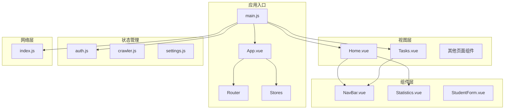
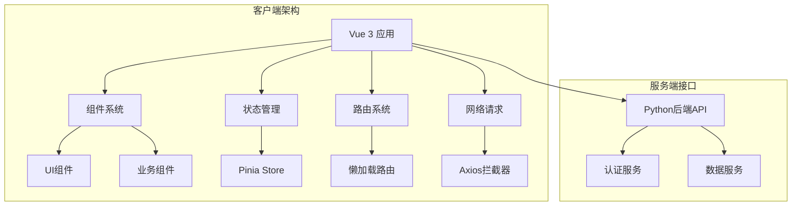
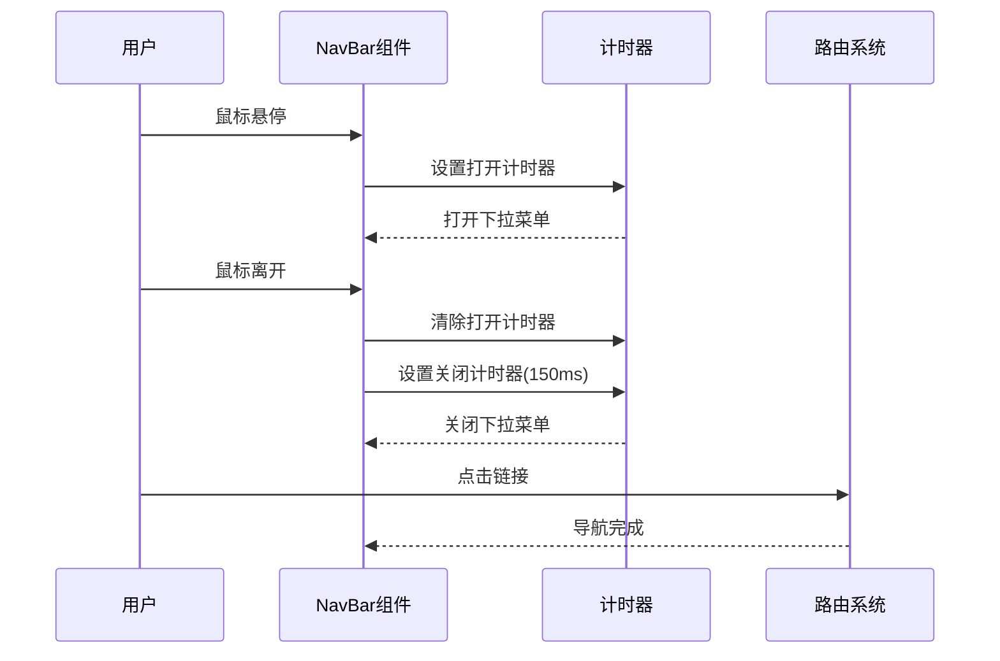
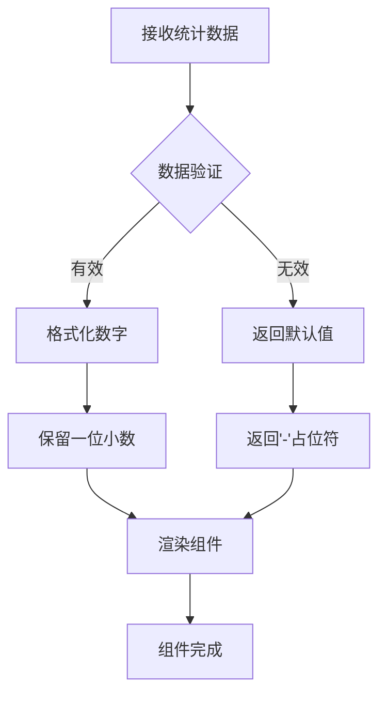
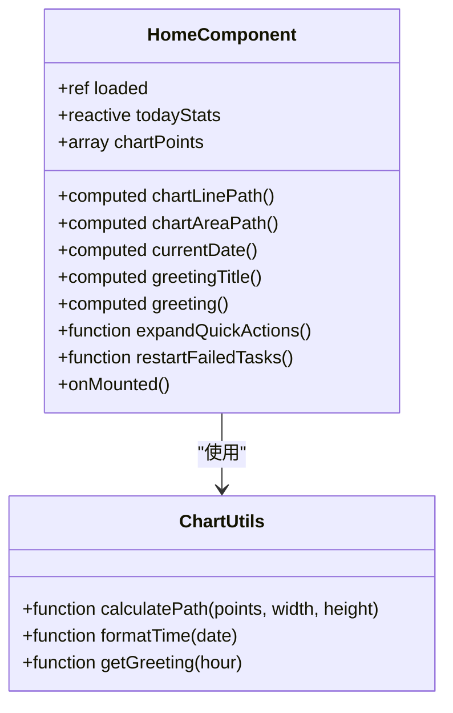
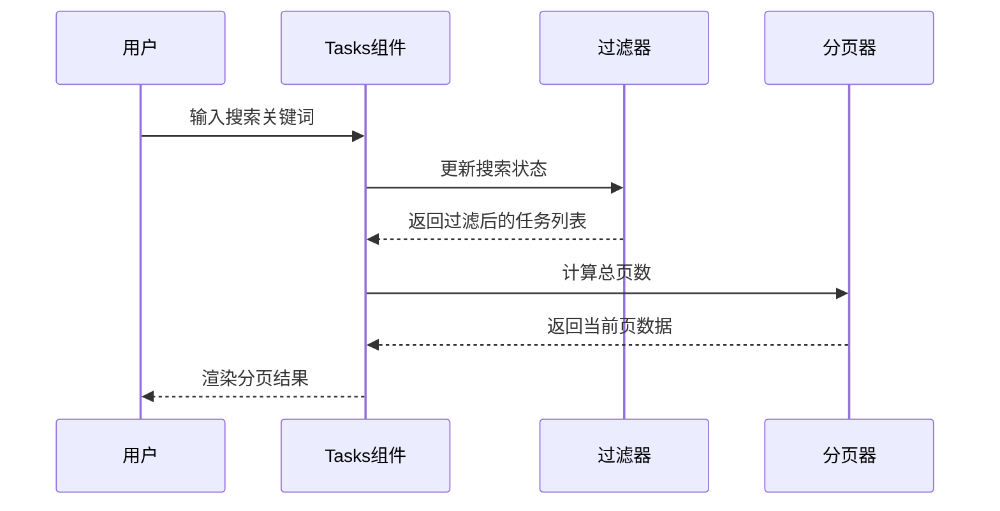
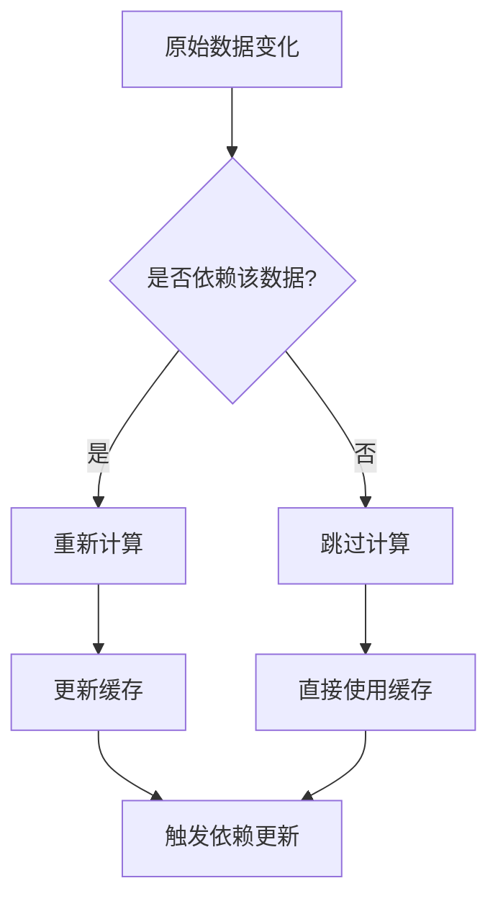
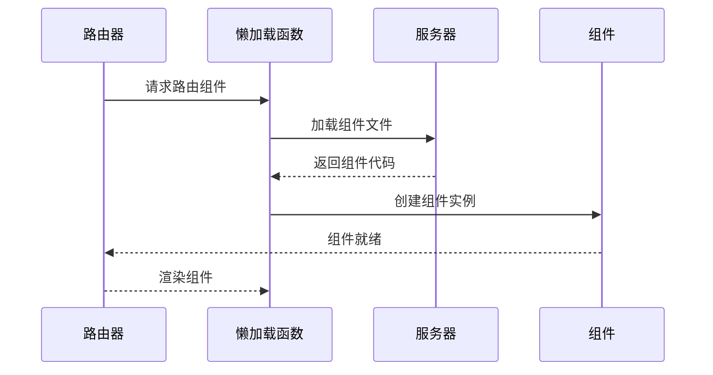
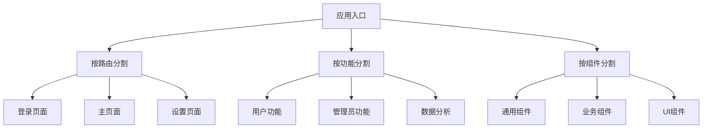

# 组件性能优化

<cite>
**本文档引用的文件**
- [NavBar.vue](file://python-web/src/components/NavBar.vue)
- [Statistics.vue](file://python-web/src/components/Statistics.vue)
- [Home.vue](file://python-web/src/views/Home.vue)
- [Tasks.vue](file://python-web/src/views/Tasks.vue)
- [auth.js](file://python-web/src/stores/auth.js)
- [index.js](file://python-web/src/router/index.js)
- [main.js](file://python-web/src/main.js)
- [vite.config.js](file://python-web/vite.config.js)
- [index.js](file://python-web/src/api/index.js)
- [style.css](file://python-web/src/style.css)
</cite>

## 目录
1. [引言](#引言)
2. [项目结构](#项目结构)
3. [核心组件](#核心组件)
4. [架构概览](#架构概览)
5. [详细组件分析](#详细组件分析)
6. [依赖关系分析](#依赖关系分析)
7. [性能考虑因素](#性能考虑因素)
8. [故障排除指南](#故障排除指南)
9. [结论](#结论)
10. [附录](#附录)

## 引言

本文件面向追求高性能的Vue开发者，深入分析Vue组件性能优化策略与实践。通过对NavBar导航栏组件和Statistics统计组件的实际案例分析，结合项目中的路由懒加载、计算属性缓存、侦听器优化等技术，提供一套完整的性能优化方案。内容涵盖组件渲染优化、防抖节流、虚拟滚动、图片懒加载、组件拆分原则、代码分割、缓存策略、性能监控工具使用以及移动端和SEO优化技巧。

## 项目结构

该项目采用标准的Vue 3 + Vite项目结构，主要由以下部分组成：



**图表来源**
- [main.js:1-16](file://python-web/src/main.js#L1-L16)
- [index.js:1-150](file://python-web/src/router/index.js#L1-L150)

**章节来源**
- [main.js:1-16](file://python-web/src/main.js#L1-L16)
- [vite.config.js:1-11](file://python-web/vite.config.js#L1-L11)

## 核心组件

### 导航栏组件 (NavBar)

NavBar组件展示了优秀的性能设计模式：

- **事件处理优化**: 使用防抖机制避免频繁的鼠标事件触发
- **计算属性缓存**: 通过computed属性动态计算活动状态
- **条件渲染**: 下拉菜单仅在需要时显示
- **样式优化**: 使用CSS变量和backdrop-filter减少重绘

### 统计组件 (Statistics)

Statistics组件体现了轻量级组件的最佳实践：
- **最小化响应式**: 仅使用props接收数据
- **简单逻辑**: 格式化函数保持纯函数特性
- **无副作用**: 不直接操作DOM或外部状态

**章节来源**
- [NavBar.vue:84-121](file://python-web/src/components/NavBar.vue#L84-L121)
- [Statistics.vue:26-38](file://python-web/src/components/Statistics.vue#L26-L38)

## 架构概览



**图表来源**
- [main.js:9-15](file://python-web/src/main.js#L9-L15)
- [auth.js:1-74](file://python-web/src/stores/auth.js#L1-L74)
- [index.js:1-150](file://python-web/src/router/index.js#L1-L150)

## 详细组件分析

### 导航栏组件深度分析

#### 性能优化策略



**图表来源**
- [NavBar.vue:101-115](file://python-web/src/components/NavBar.vue#L101-L115)

#### 关键优化点

1. **防抖机制实现**:
   - 打开操作立即执行
   - 关闭操作延迟150ms
   - 避免快速移动鼠标时的闪烁问题

2. **计算属性优化**:
   ```javascript
   const isActiveTask = computed(() => 
     ['/tasks', '/task-templates', '/tasks/'].some(p => route.path.startsWith(p)) || 
     /^\/tasks\/\d+/.test(route.path)
   )
   ```

3. **内存管理**:
   - 及时清理定时器
   - 使用ref而非reactive存储简单状态

**章节来源**
- [NavBar.vue:84-121](file://python-web/src/components/NavBar.vue#L84-L121)

### 统计组件深度分析

#### 数据处理流程



**图表来源**
- [Statistics.vue:34-37](file://python-web/src/components/Statistics.vue#L34-L37)

#### 性能特点

1. **纯函数设计**: formatNumber函数无副作用
2. **最小化依赖**: 仅依赖Vue的setup语法糖
3. **类型安全**: 明确的props类型定义

**章节来源**
- [Statistics.vue:26-38](file://python-web/src/components/Statistics.vue#L26-L38)

### 主页组件性能分析

#### 渲染优化策略

主页组件展示了多种性能优化技术：

1. **骨架屏加载**: 使用skeleton动画提升用户体验
2. **延迟渲染**: 页面加载后100ms才显示主要内容
3. **计算属性缓存**: 多个computed属性避免重复计算



**图表来源**
- [Home.vue:269-357](file://python-web/src/views/Home.vue#L269-L357)

**章节来源**
- [Home.vue:269-357](file://python-web/src/views/Home.vue#L269-L357)

### 任务管理组件分析

#### 分页与过滤优化

任务管理组件实现了高效的分页和过滤机制：



**图表来源**
- [Tasks.vue:200-217](file://python-web/src/views/Tasks.vue#L200-L217)

#### 关键优化技术

1. **本地过滤**: 在客户端进行数据过滤，减少服务器压力
2. **分页渲染**: 每页仅渲染10条记录
3. **状态管理**: 使用ref管理简单状态，computed管理派生状态

**章节来源**
- [Tasks.vue:178-261](file://python-web/src/views/Tasks.vue#L178-L261)

## 依赖关系分析

```mermaid
graph LR
subgraph "运行时依赖"
A[vue@^3.4.0]
B[vue-router@^4.2.0]
C[pinia@^2.1.0]
D[element-plus@^2.9.0]
E[axios@^1.6.0]
end
subgraph "开发依赖"
F[@vitejs/plugin-vue]
G[vite@^4.0.0]
end
subgraph "应用模块"
H[main.js]
I[router/index.js]
J[stores/auth.js]
K[api/index.js]
L[components/NavBar.vue]
M[components/Statistics.vue]
end
H --> A
H --> B
H --> C
H --> D
I --> B
J --> C
K --> E
L --> A
M --> A
```

**图表来源**
- [package.json:11-22](file://python-web/package.json#L11-L22)

**章节来源**
- [package.json:1-24](file://python-web/package.json#L1-L24)

## 性能考虑因素

### 渲染性能优化

1. **组件拆分原则**:
   - 将大型组件拆分为多个小型、可复用的子组件
   - 避免单个组件承担过多职责
   - 使用组合式API实现逻辑复用

2. **条件渲染优化**:
   ```javascript
   // 推荐：条件渲染
   <template v-if="showContent">
     <!-- 内容 -->
   </template>
   
   // 避免：v-show导致的DOM保留
   <template v-show="showContent">
     <!-- 内容 -->
   </template>
   ```

3. **列表渲染优化**:
   - 为每个列表项提供稳定的key
   - 避免在列表项中创建新的函数
   - 使用计算属性缓存列表数据

### 计算属性缓存策略



**图表来源**
- [NavBar.vue:96-99](file://python-web/src/components/NavBar.vue#L96-L99)
- [Tasks.vue:200-210](file://python-web/src/views/Tasks.vue#L200-L210)

### 侦听器优化

1. **防抖节流实现**:
   ```javascript
   // 防抖示例
   const debouncedHandler = debounce(handler, 300)
   
   // 节流示例
   const throttledHandler = throttle(handler, 100)
   ```

2. **监听器最佳实践**:
   - 使用immediate选项避免不必要的初始调用
   - 合理设置深度监听，避免深层对象的昂贵比较
   - 在组件卸载时清理监听器

### 组件懒加载策略



**图表来源**
- [index.js:8-8](file://python-web/src/router/index.js#L8-L8)

**章节来源**
- [index.js:8-8](file://python-web/src/router/index.js#L8-L8)

### 图片懒加载技术

虽然当前项目中没有实现图片懒加载，但可以采用以下策略：

1. **Intersection Observer API**:
   ```javascript
   const observer = new IntersectionObserver((entries) => {
     entries.forEach(entry => {
       if (entry.isIntersecting) {
         loadLazyImage(entry.target)
       }
     })
   })
   ```

2. **Native Lazy Loading**:
   ```html
   
   ```

### 虚拟滚动实现

对于大量数据的列表，建议实现虚拟滚动：

```javascript
// 虚拟滚动核心概念
const visibleRange = calculateVisibleRange(scrollTop, itemHeight, containerHeight)
const visibleItems = items.slice(visibleRange.start, visibleRange.end)
```

## 故障排除指南

### 常见性能问题诊断

1. **组件渲染缓慢**:
   - 检查是否有不必要的计算属性
   - 验证事件处理器是否正确清理
   - 确认没有内存泄漏

2. **内存占用过高**:
   - 检查定时器是否及时清理
   - 验证事件监听器是否移除
   - 确认大对象引用是否释放

3. **路由切换卡顿**:
   - 检查懒加载组件的大小
   - 验证路由守卫的异步操作
   - 确认全局状态更新频率

### 性能监控工具使用

1. **Vue DevTools**:
   - 使用组件时间线分析渲染性能
   - 监控组件更新频率
   - 检查计算属性缓存命中率

2. **浏览器性能面板**:
   - 分析长任务阻塞
   - 检查内存分配模式
   - 监控网络请求性能

3. **Lighthouse审计**:
   - 运行性能、SEO、可访问性测试
   - 分析首屏加载时间
   - 检查移动端性能

### 代码分割最佳实践



**图表来源**
- [index.js:8-126](file://python-web/src/router/index.js#L8-L126)

**章节来源**
- [index.js:8-126](file://python-web/src/router/index.js#L8-L126)

## 结论

通过深入分析NavBar和Statistics组件的实现，我们可以看到Vue应用性能优化的关键在于：

1. **合理的组件设计**: 小而专的组件更容易维护和优化
2. **有效的缓存策略**: 计算属性和组件缓存显著提升性能
3. **智能的懒加载**: 减少初始包体积，提升首屏速度
4. **事件处理优化**: 防抖节流避免过度渲染
5. **状态管理优化**: 合理的状态划分和更新策略

这些优化策略不仅适用于当前项目，也为其他Vue应用提供了可复用的性能优化框架。建议在实际开发中根据具体场景选择合适的优化技术，并持续监控应用性能表现。

## 附录

### 移动端性能优化技巧

1. **触摸事件优化**:
   - 使用passive事件监听器
   - 避免在触摸事件中执行重操作
   - 合理使用transform替代布局变更

2. **内存管理**:
   - 及时清理DOM引用
   - 避免闭包循环引用
   - 监控内存使用情况

3. **网络优化**:
   - 使用HTTP/2多路复用
   - 实现请求合并和去重
   - 优化图片资源

### SEO优化策略

1. **服务端渲染(SSR)**:
   - 考虑使用Nuxt.js或类似框架
   - 实现静态站点生成
   - 优化首屏渲染时间

2. **元数据管理**:
   - 动态设置页面标题和描述
   - 实现Open Graph标签
   - 优化结构化数据

3. **性能指标**:
   - 监控Core Web Vitals
   - 优化CLS、LCP、FID指标
   - 实现渐进式增强