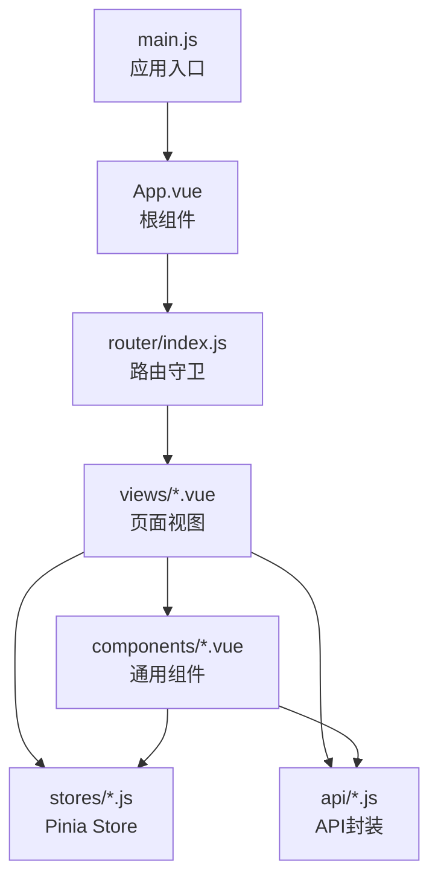
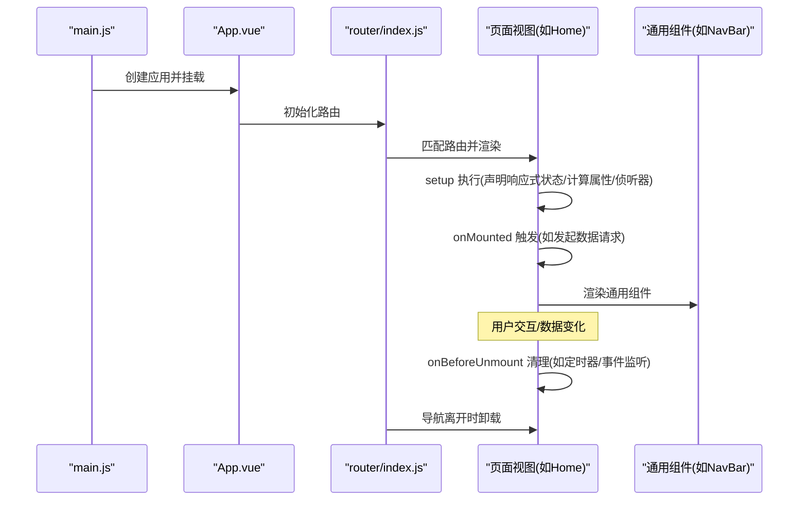
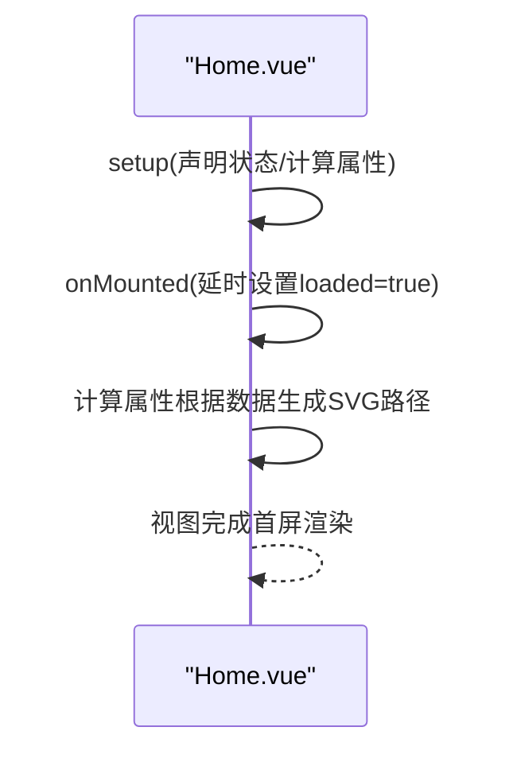
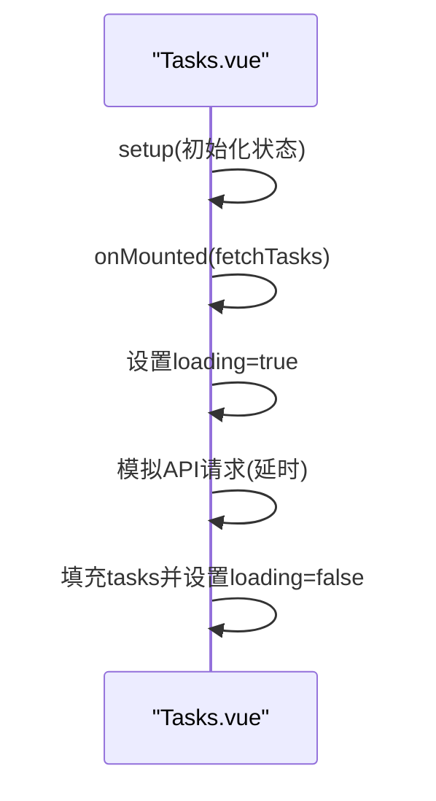
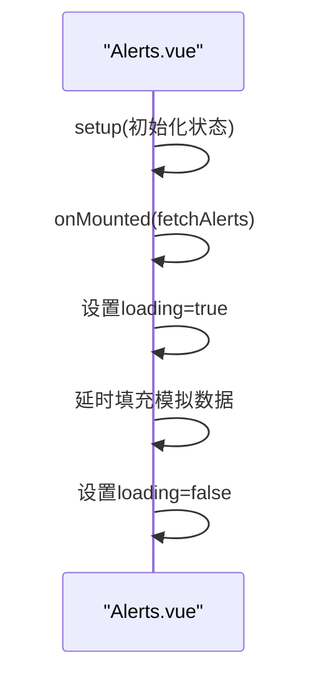
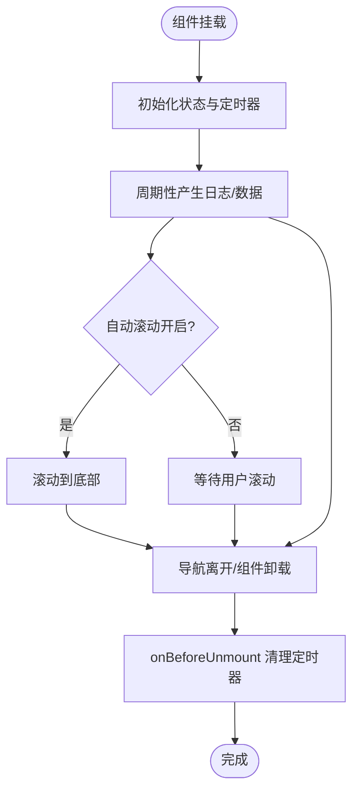
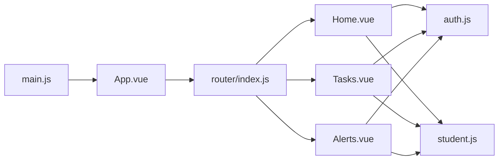

# 组件生命周期

<cite>
**本文引用的文件**
- [App.vue](file://python-web/src/App.vue)
- [main.js](file://python-web/src/main.js)
- [Home.vue](file://python-web/src/views/Home.vue)
- [Tasks.vue](file://python-web/src/views/Tasks.vue)
- [Alerts.vue](file://python-web/src/views/Alerts.vue)
- [TaskDetail.vue](file://python-web/src/views/TaskDetail.vue)
- [DataPreview.vue](file://python-web/src/views/DataPreview.vue)
- [NavBar.vue](file://python-web/src/components/NavBar.vue)
- [StudentForm.vue](file://python-web/src/components/StudentForm.vue)
- [Statistics.vue](file://python-web/src/components/Statistics.vue)
- [auth.js](file://python-web/src/stores/auth.js)
- [router/index.js](file://python-web/src/router/index.js)
- [student.js](file://python-web/src/api/student.js)
- [package.json](file://python-web/package.json)
</cite>

## 目录
1. [简介](#简介)
2. [项目结构](#项目结构)
3. [核心组件](#核心组件)
4. [架构总览](#架构总览)
5. [详细组件分析](#详细组件分析)
6. [依赖分析](#依赖分析)
7. [性能考量](#性能考量)
8. [故障排查指南](#故障排查指南)
9. [结论](#结论)
10. [附录](#附录)

## 简介
本文件面向Vue开发者，系统梳理Composition API下的组件生命周期使用方法，重点围绕setup函数执行时机、onMounted、onUpdated、onUnmounted等钩子在数据获取、DOM操作、资源清理中的最佳实践，并结合仓库中的真实组件示例进行说明。同时给出避免内存泄漏与性能问题的建议、调试技巧与常见陷阱，帮助读者建立完整的生命周期管理能力。

## 项目结构
该项目采用Vue 3 + Vite + Pinia + Element Plus的现代前端栈，页面通过vue-router进行路由管理，全局状态由Pinia提供。生命周期相关的关键位置集中在各页面视图组件（如Home、Tasks、Alerts）以及通用组件（如NavBar、StudentForm、Statistics）中。

图表来源
- [main.js:1-16](file://python-web/src/main.js#L1-L16)
- [App.vue:1-10](file://python-web/src/App.vue#L1-L10)
- [router/index.js:1-150](file://python-web/src/router/index.js#L1-L150)

章节来源
- [main.js:1-16](file://python-web/src/main.js#L1-L16)
- [App.vue:1-10](file://python-web/src/App.vue#L1-L10)
- [router/index.js:1-150](file://python-web/src/router/index.js#L1-L150)

## 核心组件
- 页面视图组件：Home、Tasks、Alerts、TaskDetail、DataPreview等，集中演示生命周期钩子的典型用法（如onMounted触发数据拉取、定时器/滚动控制等）。
- 通用组件：NavBar、StudentForm、Statistics等，展示事件处理、表单校验、DOM引用等与生命周期密切相关的场景。
- 状态与路由：auth.js提供认证状态管理；router/index.js提供鉴权守卫，影响组件挂载与卸载时机。

章节来源
- [Home.vue:269-357](file://python-web/src/views/Home.vue#L269-L357)
- [Tasks.vue:178-261](file://python-web/src/views/Tasks.vue#L178-L261)
- [Alerts.vue:138-220](file://python-web/src/views/Alerts.vue#L138-L220)
- [TaskDetail.vue:174-200](file://python-web/src/views/TaskDetail.vue#L174-L200)
- [DataPreview.vue:159-200](file://python-web/src/views/DataPreview.vue#L159-L200)
- [NavBar.vue:84-121](file://python-web/src/components/NavBar.vue#L84-L121)
- [StudentForm.vue:70-201](file://python-web/src/components/StudentForm.vue#L70-L201)
- [Statistics.vue:26-38](file://python-web/src/components/Statistics.vue#L26-L38)
- [auth.js:1-74](file://python-web/src/stores/auth.js#L1-L74)
- [router/index.js:134-147](file://python-web/src/router/index.js#L134-L147)

## 架构总览
下面的序列图展示了从应用启动到页面渲染、再到用户交互与资源清理的生命周期流程，体现setup、onMounted、onBeforeUnmount等钩子在不同阶段的作用。

图表来源
- [main.js:1-16](file://python-web/src/main.js#L1-L16)
- [App.vue:1-10](file://python-web/src/App.vue#L1-L10)
- [router/index.js:134-147](file://python-web/src/router/index.js#L134-L147)
- [Home.vue:269-357](file://python-web/src/views/Home.vue#L269-L357)
- [NavBar.vue:84-121](file://python-web/src/components/NavBar.vue#L84-L121)

## 详细组件分析

### Home.vue：生命周期在数据获取与动画中的应用
- setup阶段：定义响应式状态（如todayStats）、计算属性（chartLinePath/chartAreaPath/currentDate/greeting），声明加载标志loaded。
- onMounted阶段：在挂载后延时设置loaded为true，配合样式动画实现首屏渐显效果。
- 使用场景：首次数据渲染、SVG路径计算、首屏动画。

图表来源
- [Home.vue:269-357](file://python-web/src/views/Home.vue#L269-L357)

章节来源
- [Home.vue:269-357](file://python-web/src/views/Home.vue#L269-L357)

### Tasks.vue：生命周期在数据拉取与分页中的应用
- setup阶段：定义loading、tasks、过滤与分页参数。
- onMounted阶段：组件挂载即触发fetchTasks异步拉取数据，随后loading结束。
- 使用场景：首次进入页面时的数据拉取、本地过滤与分页。

图表来源
- [Tasks.vue:178-261](file://python-web/src/views/Tasks.vue#L178-L261)

章节来源
- [Tasks.vue:178-261](file://python-web/src/views/Tasks.vue#L178-L261)

### Alerts.vue：生命周期在告警列表加载中的应用
- setup阶段：定义loading、alerts、过滤与分页参数。
- onMounted阶段：组件挂载后调用fetchAlerts加载模拟数据。
- 使用场景：列表类页面的首次数据加载。

图表来源
- [Alerts.vue:138-220](file://python-web/src/views/Alerts.vue#L138-L220)

章节来源
- [Alerts.vue:138-220](file://python-web/src/views/Alerts.vue#L138-L220)

### TaskDetail.vue：生命周期在日志滚动与资源清理中的应用
- setup阶段：定义activeTab、editing、autoScroll、logViewerRef等。
- onMounted阶段：启动定时器logTimer用于模拟日志追加。
- onBeforeUnmount阶段：清理定时器，避免组件卸载后仍执行定时任务造成内存泄漏。
- 使用场景：需要定时刷新或订阅外部事件的组件，务必在卸载时清理。

图表来源
- [TaskDetail.vue:174-200](file://python-web/src/views/TaskDetail.vue#L174-L200)

章节来源
- [TaskDetail.vue:174-200](file://python-web/src/views/TaskDetail.vue#L174-L200)

### DataPreview.vue：生命周期在表格渲染与分页中的应用
- setup阶段：定义loading、filters、sortKey/sortDir、columns、currentPage等。
- onMounted阶段：触发数据加载逻辑（此处为演示，实际可接入API）。
- 使用场景：复杂表格的首屏渲染与分页控制。

章节来源
- [DataPreview.vue:159-200](file://python-web/src/views/DataPreview.vue#L159-L200)

### NavBar.vue：生命周期在用户交互与事件处理中的应用
- setup阶段：使用useRouter/useRoute/useAuthStore，声明activeDropdown、closeTimer等。
- 交互行为：mouseenter/mouseleave控制下拉菜单显示；handleLogout触发登出并跳转登录页。
- 使用场景：与路由/状态联动的UI组件，生命周期主要用于绑定/解绑事件与清理定时器。

章节来源
- [NavBar.vue:84-121](file://python-web/src/components/NavBar.vue#L84-L121)

### StudentForm.vue：生命周期在表单校验与文件上传中的应用
- setup阶段：定义formData、errors、avatarPreview、uploading、fileInput等。
- 侦听与校验：watch监听props.student变化，同步表单初始值；validate函数进行输入校验。
- 文件上传：handleFileChange中触发上传并回填URL，涉及URL对象的创建与释放。
- 使用场景：表单组件的初始化、校验与资源清理。

章节来源
- [StudentForm.vue:70-201](file://python-web/src/components/StudentForm.vue#L70-L201)

### Statistics.vue：生命周期在静态展示中的应用
- setup阶段：通过defineProps接收统计数据，formatNumber格式化数值。
- 使用场景：纯展示组件，通常无需生命周期钩子，但可作为对比参考。

章节来源
- [Statistics.vue:26-38](file://python-web/src/components/Statistics.vue#L26-L38)

## 依赖分析
- 应用入口与根组件：main.js负责创建应用、安装插件并挂载；App.vue作为根容器承载router-view。
- 路由与鉴权：router/index.js在导航前置守卫中判断登录态，影响页面组件的挂载与卸载时机。
- 状态管理：auth.js提供认证状态与持久化，影响组件是否需要登录才能访问。
- API封装：student.js统一处理请求与错误，供组件在生命周期中调用。

图表来源
- [main.js:1-16](file://python-web/src/main.js#L1-L16)
- [App.vue:1-10](file://python-web/src/App.vue#L1-L10)
- [router/index.js:1-150](file://python-web/src/router/index.js#L1-L150)
- [auth.js:1-74](file://python-web/src/stores/auth.js#L1-L74)
- [student.js:1-102](file://python-web/src/api/student.js#L1-L102)

章节来源
- [main.js:1-16](file://python-web/src/main.js#L1-L16)
- [router/index.js:134-147](file://python-web/src/router/index.js#L134-L147)
- [auth.js:1-74](file://python-web/src/stores/auth.js#L1-L74)
- [student.js:1-102](file://python-web/src/api/student.js#L1-L102)

## 性能考量
- 避免在setup中执行昂贵的同步操作，尽量推迟到onMounted中进行。
- 对于需要定时刷新的组件，务必在onBeforeUnmount中清理定时器，防止内存泄漏。
- 合理使用计算属性与侦听器，避免不必要的重渲染。
- 在列表类页面，优先采用虚拟滚动或分页策略，减少一次性渲染的数据量。
- 图形绘制（如SVG路径）可在onMounted后进行，避免在SSR或首屏渲染期间阻塞。

## 故障排查指南
- 组件未按预期渲染：检查路由守卫是否拦截、鉴权状态是否正确。
- 数据未加载：确认onMounted中是否正确调用异步函数，且在finally中恢复loading状态。
- 内存泄漏：检查是否存在定时器、事件监听器、订阅未在onBeforeUnmount清理。
- DOM引用失效：确保在onMounted后再访问ref绑定的DOM元素，避免在setup阶段访问。
- 登录/登出异常：核对auth.js中的setAuth/clearAuth与localStorage的交互，以及router守卫逻辑。

章节来源
- [router/index.js:134-147](file://python-web/src/router/index.js#L134-L147)
- [auth.js:1-74](file://python-web/src/stores/auth.js#L1-L74)
- [TaskDetail.vue:174-200](file://python-web/src/views/TaskDetail.vue#L174-L200)

## 结论
- setup是声明期，适合定义响应式数据与计算属性；onMounted是首次渲染后的执行点，适合发起数据请求与DOM操作；onBeforeUnmount是清理期，必须清理定时器、事件与订阅。
- 在列表、日志、图表等组件中，生命周期的正确使用能显著提升用户体验与性能。
- 通过路由守卫与状态管理，可以有效控制组件的挂载与卸载时机，避免不必要的资源占用。

## 附录
- 项目技术栈：Vue 3、Pinia、Element Plus、vue-router、Vite。
- 推荐阅读：Vue官方文档关于Composition API与生命周期的部分。

章节来源
- [package.json:1-24](file://python-web/package.json#L1-L24)