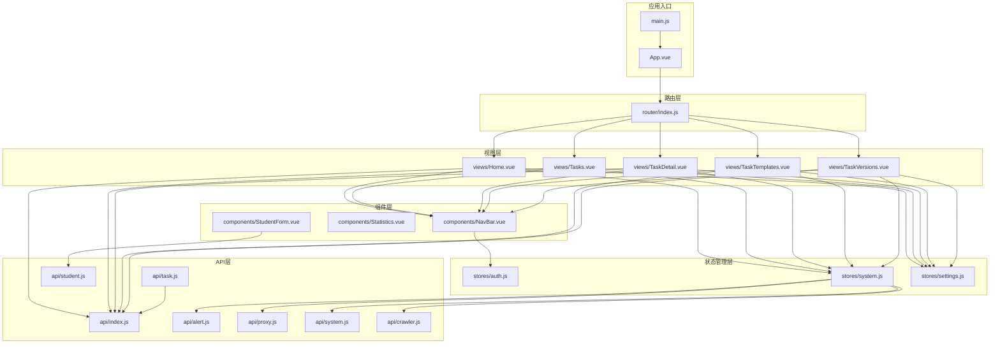
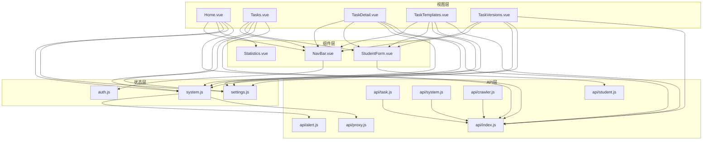
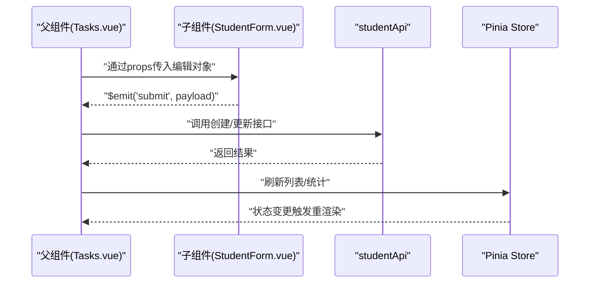
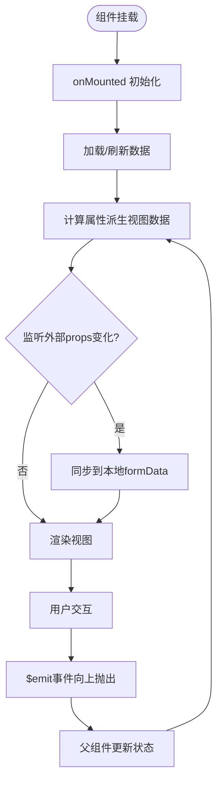
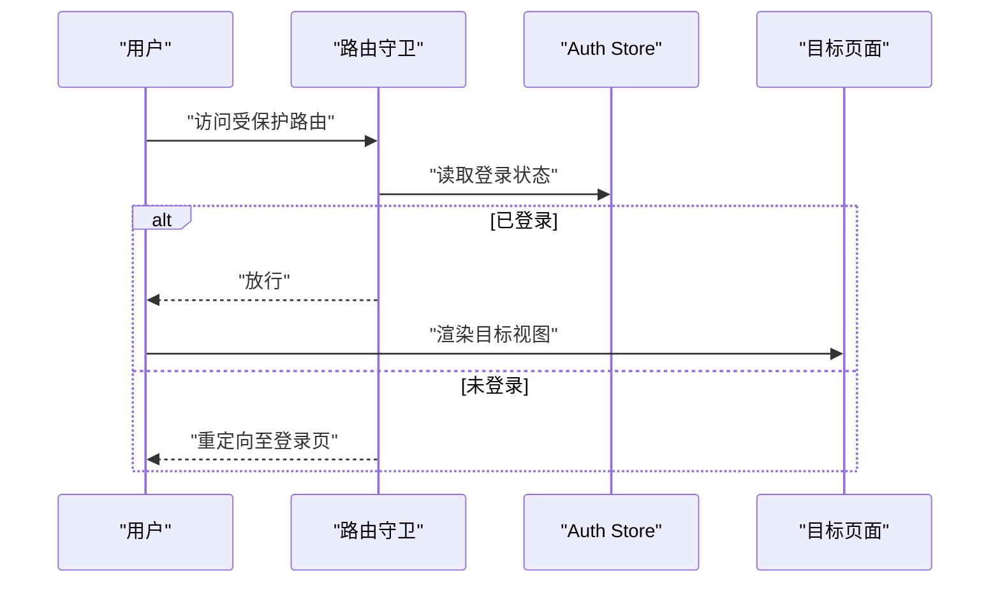
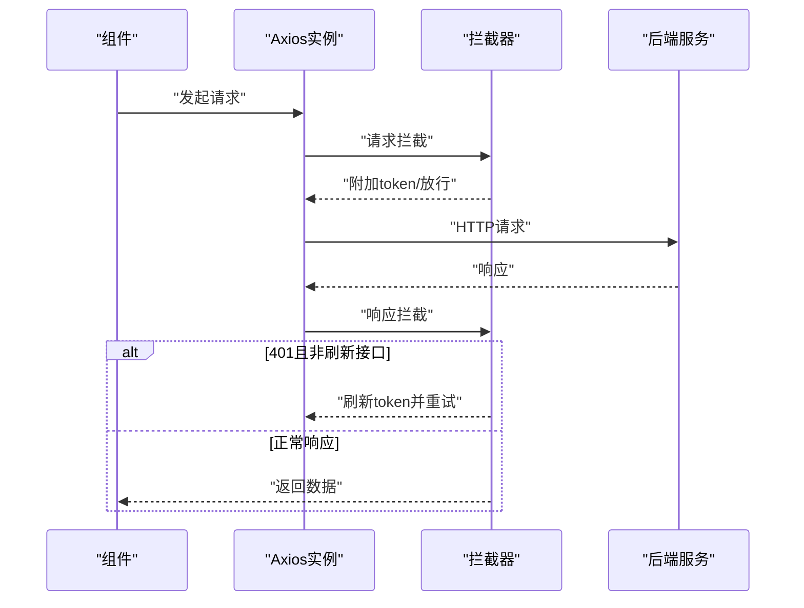
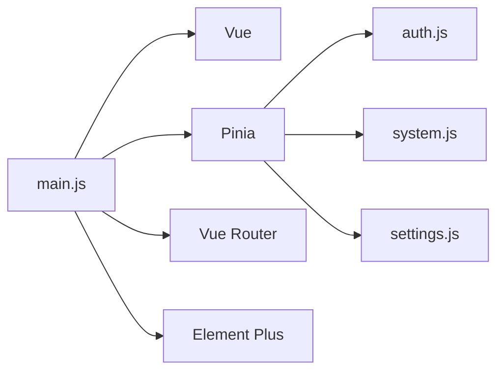

# 组件系统

<cite>
**本文引用的文件**
- [App.vue](file://python-web/src/App.vue)
- [main.js](file://python-web/src/main.js)
- [NavBar.vue](file://python-web/src/components/NavBar.vue)
- [Statistics.vue](file://python-web/src/components/Statistics.vue)
- [StudentForm.vue](file://python-web/src/components/StudentForm.vue)
- [Home.vue](file://python-web/src/views/Home.vue)
- [Tasks.vue](file://python-web/src/views/Tasks.vue)
- [TaskDetail.vue](file://python-web/src/views/TaskDetail.vue)
- [TaskTemplates.vue](file://python-web/src/views/TaskTemplates.vue)
- [TaskVersions.vue](file://python-web/src/views/TaskVersions.vue)
- [index.js（路由）](file://python-web/src/router/index.js)
- [auth.js（Pinia）](file://python-web/src/stores/auth.js)
- [system.js（Pinia）](file://python-web/src/stores/system.js)
- [settings.js（Pinia）](file://python-web/src/stores/settings.js)
- [index.js（API）](file://python-web/src/api/index.js)
- [alert.js（API）](file://python-web/src/api/alert.js)
- [proxy.js（API）](file://python-web/src/api/proxy.js)
- [student.js（API）](file://python-web/src/api/student.js)
- [task.js（API）](file://python-web/src/api/task.js)
- [system.js（API）](file://python-web/src/api/system.js)
- [crawler.js（API）](file://python-web/src/api/crawler.js)
- [package.json](file://python-web/package.json)
- [vite.config.js](file://python-web/vite.config.js)
</cite>

## 目录
1. [简介](#简介)
2. [项目结构](#项目结构)
3. [核心组件](#核心组件)
4. [架构总览](#架构总览)
5. [详细组件分析](#详细组件分析)
6. [依赖关系分析](#依赖关系分析)
7. [性能考虑](#性能考虑)
8. [故障排查指南](#故障排查指南)
9. [结论](#结论)
10. [附录](#附录)

## 简介
本文件面向中级Vue开发者，系统梳理该前端项目的组件系统与工程实践，覆盖以下主题：
- 组件设计原则与Composition API使用模式
- 组件通信机制：父子、兄弟、跨级
- 生命周期、响应式数据管理、计算属性与侦听器
- 组件复用策略、插槽与动态组件
- 组件测试方法、性能优化技巧、可访问性最佳实践
- 基于Pinia的状态管理与Axios拦截器的认证流程

## 项目结构
该项目采用基于功能模块的组织方式，核心目录如下：
- 源码根目录：python-web/src
  - components：通用UI组件（如导航栏、统计卡片、表单弹窗）
  - views：页面级视图（如首页、任务列表、任务详情等）
  - stores：Pinia状态仓库（认证、系统、设置）
  - api：Axios封装与后端接口定义
  - router：Vue Router路由配置
  - 入口：main.js、App.vue
- 构建工具：Vite（vite.config.js）
- 依赖：Vue 3、Pinia、Vue Router、Element Plus、Axios

**图表来源**
- [main.js:1-16](file://python-web/src/main.js#L1-L16)
- [App.vue:1-10](file://python-web/src/App.vue#L1-L10)
- [index.js（路由）:1-156](file://python-web/src/router/index.js#L1-L156)
- [Home.vue:1-1055](file://python-web/src/views/Home.vue#L1-L1055)
- [Tasks.vue:1-1111](file://python-web/src/views/Tasks.vue#L1-L1111)
- [TaskDetail.vue:1-887](file://python-web/src/views/TaskDetail.vue#L1-L887)
- [TaskTemplates.vue:1-591](file://python-web/src/views/TaskTemplates.vue#L1-L591)
- [TaskVersions.vue:1-637](file://python-web/src/views/TaskVersions.vue#L1-L637)
- [NavBar.vue:1-352](file://python-web/src/components/NavBar.vue#L1-L352)
- [Statistics.vue:1-38](file://python-web/src/components/Statistics.vue#L1-L38)
- [StudentForm.vue:1-201](file://python-web/src/components/StudentForm.vue#L1-L201)
- [auth.js（Pinia）:1-74](file://python-web/src/stores/auth.js#L1-L74)
- [system.js（Pinia）:1-168](file://python-web/src/stores/system.js#L1-L168)
- [settings.js（Pinia）:1-59](file://python-web/src/stores/settings.js#L1-L59)
- [index.js（API）:1-95](file://python-web/src/api/index.js#L1-L95)
- [task.js（API）:1-71](file://python-web/src/api/task.js#L1-L71)
- [system.js（API）:1-35](file://python-web/src/api/system.js#L1-L35)
- [crawler.js（API）:1-22](file://python-web/src/api/crawler.js#L1-L22)

**章节来源**
- [main.js:1-16](file://python-web/src/main.js#L1-L16)
- [App.vue:1-10](file://python-web/src/App.vue#L1-L10)
- [index.js（路由）:1-156](file://python-web/src/router/index.js#L1-L156)

## 核心组件
本节聚焦关键组件及其职责与实现要点。

- 导航栏组件（NavBar.vue）
  - 职责：全局导航、下拉菜单、用户信息与登出
  - 关键点：使用Composition API管理下拉状态与路由高亮；通过Pinia store读取用户信息；触发登出并跳转登录页
  - 通信：与路由（useRouter/useRoute）、Pinia（useAuthStore）交互

- 统计卡片组件（Statistics.vue）
  - 职责：展示统计数据（总数、均值、最值），格式化数字
  - 关键点：defineProps接收对象型统计数据；内部函数格式化数值显示

- 学生表单组件（StudentForm.vue）
  - 职责：新增/编辑学生信息，头像上传，表单校验，事件向上抛出
  - 关键点：defineProps/defineEmits；watch监听外部传入的编辑对象；文件上传与错误回退；表单验证与提交

- 首页视图（Home.vue）
  - 职责：欢迎信息、今日统计、快捷操作、图表路径计算
  - 关键点：计算属性生成图表路径；响应式数据与生命周期钩子；与NavBar组合

- 任务列表视图（Tasks.vue）
  - 职责：任务过滤、分页、状态切换、删除确认、实时状态更新
  - 关键点：计算属性过滤与分页；本地模拟数据加载；实时定时器更新运行中任务状态；搜索关键词过滤；收藏功能

- 任务详情视图（TaskDetail.vue）
  - 职责：任务配置管理、运行日志查看、执行记录、数据预览
  - 关键点：多标签页设计（基础信息、运行日志、执行记录、数据预览）；配置表单编辑；日志自动滚动；版本历史链接

- 任务模板视图（TaskTemplates.vue）
  - 职责：任务模板管理、模板创建、编辑、删除、使用模板快速创建任务
  - 关键点：模板网格布局；模态框创建/编辑；模板使用参数传递；模板统计信息

- 任务版本视图（TaskVersions.vue）
  - 职责：版本历史查看、版本对比、版本回滚
  - 关键点：时间线展示版本历史；版本对比面板；回滚确认模态框；当前版本标识

**章节来源**
- [NavBar.vue:84-121](file://python-web/src/components/NavBar.vue#L84-L121)
- [Statistics.vue:26-38](file://python-web/src/components/Statistics.vue#L26-L38)
- [StudentForm.vue:70-201](file://python-web/src/components/StudentForm.vue#L70-L201)
- [Home.vue:269-357](file://python-web/src/views/Home.vue#L269-L357)
- [Tasks.vue:178-261](file://python-web/src/views/Tasks.vue#L178-L261)
- [TaskDetail.vue:179-365](file://python-web/src/views/TaskDetail.vue#L179-L365)
- [TaskTemplates.vue:141-292](file://python-web/src/views/TaskTemplates.vue#L141-L292)
- [TaskVersions.vue:160-290](file://python-web/src/views/TaskVersions.vue#L160-L290)

## 架构总览
该系统采用"视图-组件-状态-API"分层架构：
- 视图层：页面组件负责布局与业务编排
- 组件层：通用UI组件负责可复用交互
- 状态层：Pinia Store集中管理认证、系统与设置
- API层：Axios统一请求/响应拦截，处理鉴权与刷新

**图表来源**
- [Home.vue:1-1055](file://python-web/src/views/Home.vue#L1-L1055)
- [Tasks.vue:1-1111](file://python-web/src/views/Tasks.vue#L1-L1111)
- [TaskDetail.vue:1-887](file://python-web/src/views/TaskDetail.vue#L1-L887)
- [TaskTemplates.vue:1-591](file://python-web/src/views/TaskTemplates.vue#L1-L591)
- [TaskVersions.vue:1-637](file://python-web/src/views/TaskVersions.vue#L1-L637)
- [NavBar.vue:1-352](file://python-web/src/components/NavBar.vue#L1-L352)
- [Statistics.vue:1-38](file://python-web/src/components/Statistics.vue#L1-L38)
- [StudentForm.vue:1-201](file://python-web/src/components/StudentForm.vue#L1-L201)
- [auth.js（Pinia）:1-74](file://python-web/src/stores/auth.js#L1-L74)
- [system.js（Pinia）:1-168](file://python-web/src/stores/system.js#L1-L168)
- [settings.js（Pinia）:1-59](file://python-web/src/stores/settings.js#L1-L59)
- [index.js（API）:1-95](file://python-web/src/api/index.js#L1-L95)
- [task.js（API）:1-71](file://python-web/src/api/task.js#L1-L71)
- [system.js（API）:1-35](file://python-web/src/api/system.js#L1-L35)
- [crawler.js（API）:1-22](file://python-web/src/api/crawler.js#L1-L22)
- [student.js（API）:1-102](file://python-web/src/api/student.js#L1-L102)
- [alert.js（API）:1-35](file://python-web/src/api/alert.js#L1-L35)
- [proxy.js（API）:1-63](file://python-web/src/api/proxy.js#L1-L63)

## 详细组件分析

### 组件通信机制
- 父子通信
  - 子向父：通过defineEmits向上抛出事件（如StudentForm的提交事件）
  - 父向子：通过defineProps传递只读数据（如Statistics的statistics对象）
- 兄弟组件通信
  - 通过共同父组件协调（如Tasks中的过滤与分页逻辑由同一视图维护）
- 跨级组件通信
  - 使用Pinia Store（如useAuthStore、useSystemStore）进行跨层级共享状态

**图表来源**
- [Tasks.vue:178-261](file://python-web/src/views/Tasks.vue#L178-L261)
- [StudentForm.vue:70-201](file://python-web/src/components/StudentForm.vue#L70-L201)
- [student.js（API）:1-102](file://python-web/src/api/student.js#L1-L102)
- [system.js（Pinia）:1-168](file://python-web/src/stores/system.js#L1-L168)

**章节来源**
- [StudentForm.vue:70-201](file://python-web/src/components/StudentForm.vue#L70-L201)
- [Tasks.vue:178-261](file://python-web/src/views/Tasks.vue#L178-L261)

### 生命周期与响应式数据
- 生命周期钩子
  - onMounted用于延迟加载与动画触发（如Home.vue）
  - Tasks.vue中使用onMounted启动定时器进行实时状态更新
  - TaskDetail.vue中使用onMounted获取任务详情
  - TaskVersions.vue中使用onMounted获取版本历史
- 响应式数据
  - ref：局部状态（如loading、formData、errors、定时器）
  - computed：派生数据（如图表路径、路由高亮、过滤后的任务列表、实时计算的执行时间、成功率）
  - watch：监听props变化以同步表单初始值（如StudentForm.vue）

**图表来源**
- [Home.vue:269-357](file://python-web/src/views/Home.vue#L269-L357)
- [StudentForm.vue:70-201](file://python-web/src/components/StudentForm.vue#L70-L201)
- [Tasks.vue:178-261](file://python-web/src/views/Tasks.vue#L178-L261)
- [TaskDetail.vue:179-365](file://python-web/src/views/TaskDetail.vue#L179-L365)
- [TaskVersions.vue:160-290](file://python-web/src/views/TaskVersions.vue#L160-L290)

**章节来源**
- [Home.vue:269-357](file://python-web/src/views/Home.vue#L269-L357)
- [StudentForm.vue:70-201](file://python-web/src/components/StudentForm.vue#L70-L201)
- [Tasks.vue:178-261](file://python-web/src/views/Tasks.vue#L178-L261)
- [TaskDetail.vue:179-365](file://python-web/src/views/TaskDetail.vue#L179-L365)
- [TaskVersions.vue:160-290](file://python-web/src/views/TaskVersions.vue#L160-L290)

### 计算属性与侦听器使用
- 计算属性
  - 图表路径：根据点集动态生成SVG路径（Home.vue）
  - 路由高亮：根据当前路径判断导航项激活态（NavBar.vue）
  - 过滤与分页：根据关键词与状态筛选任务，再切片分页（Tasks.vue）
  - 实时计算：执行时间、数据量、成功率的实时计算（Tasks.vue）
  - 版本对比：比较两个版本的配置差异（TaskVersions.vue）
- 侦听器
  - 监听props.student以初始化表单（StudentForm.vue）
  - 监听任务状态变化以启动/停止定时器（Tasks.vue）
  - 监听活动标签变化以自动滚动日志（TaskDetail.vue）

**章节来源**
- [Home.vue:285-314](file://python-web/src/views/Home.vue#L285-L314)
- [NavBar.vue:96-99](file://python-web/src/components/NavBar.vue#L96-L99)
- [Tasks.vue:200-217](file://python-web/src/views/Tasks.vue#L200-L217)
- [StudentForm.vue:102-116](file://python-web/src/components/StudentForm.vue#L102-L116)
- [TaskDetail.vue:353-364](file://python-web/src/views/TaskDetail.vue#L353-L364)
- [TaskVersions.vue:177-191](file://python-web/src/views/TaskVersions.vue#L177-L191)

### 组件复用策略、插槽与动态组件
- 复用策略
  - 将通用UI抽象为独立组件（如Statistics、StudentForm），通过props与emits解耦
  - 任务相关组件共享相同的样式主题和交互模式
- 插槽
  - 当前未使用具名/作用域插槽；可在需要时扩展为具名插槽以增强可定制性
- 动态组件
  - 当前未使用<component :is="...">；可在多视图切换场景引入以减少重复代码

**章节来源**
- [Statistics.vue:1-38](file://python-web/src/components/Statistics.vue#L1-L38)
- [StudentForm.vue:1-201](file://python-web/src/components/StudentForm.vue#L1-L201)

### 路由与权限控制
- 路由守卫
  - 在导航前检查登录状态与页面权限，未登录跳转登录页，已登录禁止重复进入登录注册页
- 路由与视图
  - Home与Tasks等视图通过router-view渲染，配合NavBar实现导航
  - 新增任务详情、模板、版本管理等路由

**图表来源**
- [index.js（路由）:140-153](file://python-web/src/router/index.js#L140-L153)
- [auth.js（Pinia）:1-74](file://python-web/src/stores/auth.js#L1-L74)

**章节来源**
- [index.js（路由）:1-156](file://python-web/src/router/index.js#L1-L156)
- [auth.js（Pinia）:1-74](file://python-web/src/stores/auth.js#L1-L74)

### 状态管理（Pinia）
- 认证状态（auth.js）
  - 管理token与用户信息，提供登录、注册、登出、获取资料等方法
- 系统状态（system.js）
  - 管理告警、代理、黑白名单、速率限制、日志与资源等
- 设置状态（settings.js）
  - 主题切换、偏好设置与全局设置读写

**章节来源**
- [auth.js（Pinia）:1-74](file://python-web/src/stores/auth.js#L1-L74)
- [system.js（Pinia）:1-168](file://python-web/src/stores/system.js#L1-L168)
- [settings.js（Pinia）:1-59](file://python-web/src/stores/settings.js#L1-L59)

### API与拦截器
- Axios封装
  - 统一基础URL、超时与请求头
  - 请求拦截：自动附加Authorization头
  - 响应拦截：401自动刷新token或强制跳转登录
- 接口模块
  - authAPI、userAPI、alertAPI、proxyAPI、studentApi、taskAPI、systemAPI、crawlerAPI等

**图表来源**
- [index.js（API）:11-59](file://python-web/src/api/index.js#L11-L59)
- [auth.js（Pinia）:30-51](file://python-web/src/stores/auth.js#L30-L51)

**章节来源**
- [index.js（API）:1-95](file://python-web/src/api/index.js#L1-L95)
- [auth.js（Pinia）:1-74](file://python-web/src/stores/auth.js#L1-L74)

### 任务管理系统增强功能
- 实时状态更新
  - Tasks.vue使用1秒定时器轮询爬虫引擎状态，实时更新运行中任务的数据量、状态和成功率
  - 支持任务启动/停止操作的即时反馈
- 搜索与过滤
  - 支持按任务名称和URL关键词搜索
  - 支持按状态（全部、运行中、待执行、已完成、失败）过滤
  - 支持收藏任务的快速标记
- 任务详情管理
  - TaskDetail.vue提供完整的任务配置管理界面
  - 支持运行日志查看和自动滚动
  - 提供执行记录的时间线展示
  - 集成数据预览功能
- 模板系统
  - TaskTemplates.vue实现任务模板的创建、编辑、删除和使用
  - 支持模板参数的快速传递到新任务创建
- 版本管理
  - TaskVersions.vue提供版本历史查看和对比功能
  - 支持版本回滚操作的安全确认

**章节来源**
- [Tasks.vue:406-471](file://python-web/src/views/Tasks.vue#L406-L471)
- [TaskDetail.vue:288-365](file://python-web/src/views/TaskDetail.vue#L288-L365)
- [TaskTemplates.vue:174-292](file://python-web/src/views/TaskTemplates.vue#L174-L292)
- [TaskVersions.vue:266-290](file://python-web/src/views/TaskVersions.vue#L266-L290)

## 依赖关系分析
- 运行时依赖
  - Vue 3、Pinia、Vue Router、Element Plus、Axios
- 构建工具
  - Vite插件支持Vue单文件组件开发与热更新
- 入口装配
  - main.js创建应用实例，安装Pinia、Router与UI库，挂载根组件

**图表来源**
- [main.js:1-16](file://python-web/src/main.js#L1-L16)
- [package.json:11-22](file://python-web/package.json#L11-L22)

**章节来源**
- [package.json:1-24](file://python-web/package.json#L1-L24)
- [vite.config.js:1-11](file://python-web/vite.config.js#L1-L11)
- [main.js:1-16](file://python-web/src/main.js#L1-L16)

## 性能考虑
- 渲染优化
  - 合理使用计算属性避免重复计算（如图表路径、实时状态计算）
  - 列表渲染使用稳定key，减少DOM重排
  - 任务列表使用虚拟滚动和分页减少一次性渲染压力
- 网络优化
  - Axios统一拦截与重试策略，避免频繁重复请求
  - 实时状态更新使用1秒间隔，避免过度轮询
- 资源加载
  - 路由按需加载（动态import）降低首屏体积
- 可访问性
  - 为交互元素提供语义化标签与键盘可达性（建议在现有组件基础上补充aria-label、tabindex等）

## 故障排查指南
- 登录态异常
  - 检查localStorage中的token是否正确存储与传递
  - 查看路由守卫逻辑与拦截器刷新流程
- 请求失败
  - 观察拦截器对401的处理与重定向行为
  - 核对后端接口返回结构与错误提示
- 表单上传失败
  - 检查文件类型与大小限制，确认上传回调中的错误回退逻辑
- 实时状态不更新
  - 检查定时器是否正常启动和清理
  - 验证爬虫引擎状态接口的可用性
- 任务模板操作失败
  - 确认模板参数格式正确，特别是cron表达式的转换
- 版本回滚问题
  - 检查回滚目标版本的有效性，确认用户权限

**章节来源**
- [index.js（路由）:140-153](file://python-web/src/router/index.js#L140-L153)
- [index.js（API）:11-59](file://python-web/src/api/index.js#L11-L59)
- [StudentForm.vue:128-161](file://python-web/src/components/StudentForm.vue#L128-L161)
- [Tasks.vue:440-471](file://python-web/src/views/Tasks.vue#L440-L471)
- [TaskTemplates.vue:219-243](file://python-web/src/views/TaskTemplates.vue#L219-L243)
- [TaskVersions.vue:198-213](file://python-web/src/views/TaskVersions.vue#L198-L213)

## 结论
该组件系统以Composition API为核心，结合Pinia与Vue Router实现了清晰的职责分离与可维护的架构。通过统一的API拦截与状态管理，提升了开发效率与用户体验。新增的任务管理系统功能进一步增强了系统的实用性，包括实时状态更新、搜索过滤、模板管理和版本控制等特性。建议后续在插槽、动态组件与可访问性方面进一步完善，以支撑更复杂的业务场景。

## 附录
- 开发与构建
  - dev：npm run dev（Vite热更新）
  - build：npm run build（生产打包）
  - preview：npm run preview（本地预览）
- 浏览器兼容性
  - 建议使用现代浏览器以获得最佳体验

**章节来源**
- [package.json:6-10](file://python-web/package.json#L6-L10)
- [vite.config.js:1-11](file://python-web/vite.config.js#L1-L11)