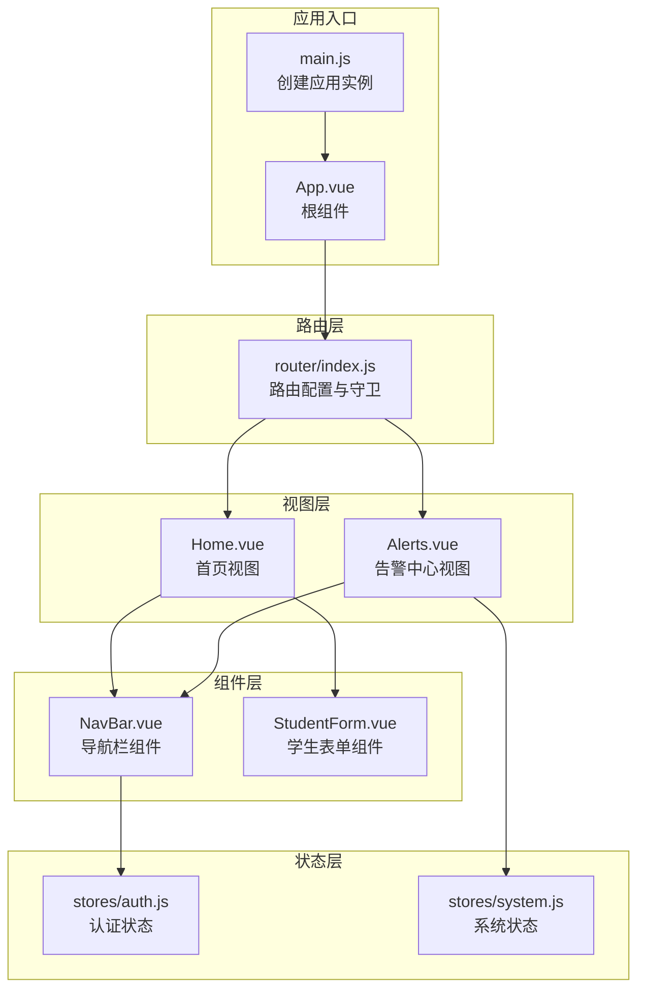
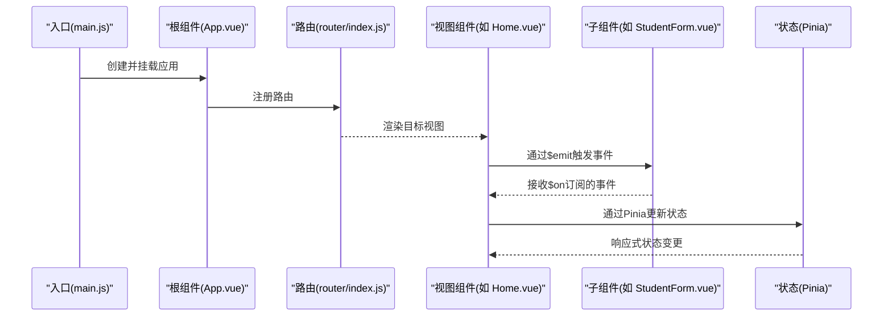
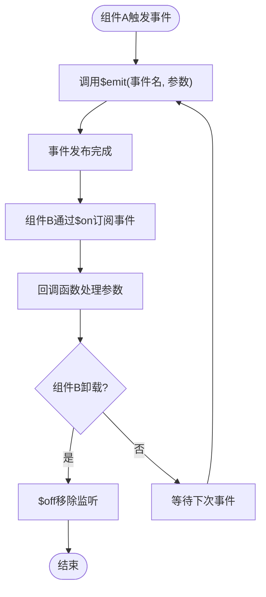
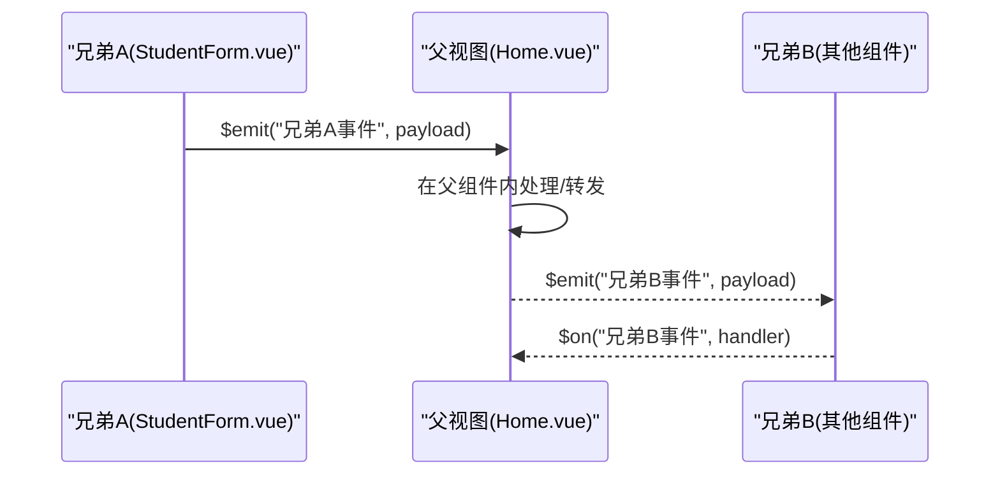
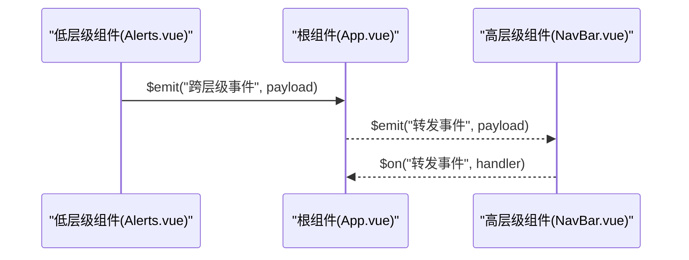
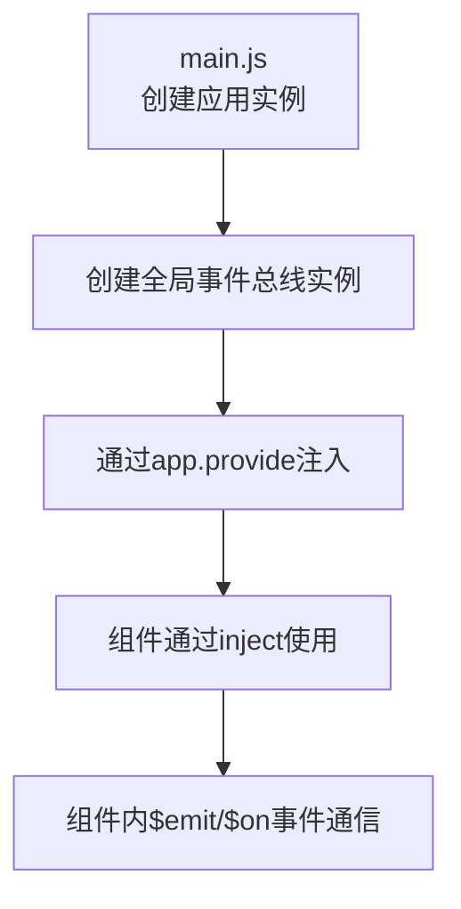
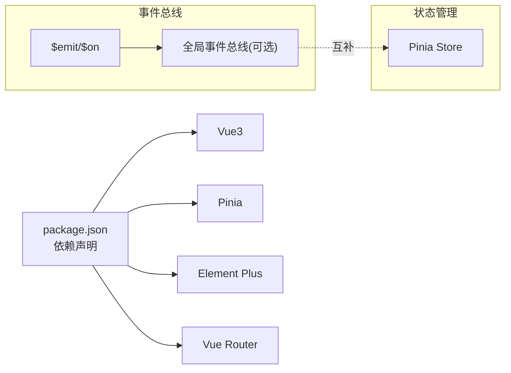

# 事件总线通信

<cite>
**本文引用的文件**
- [main.js](file://python-web/src/main.js)
- [App.vue](file://python-web/src/App.vue)
- [NavBar.vue](file://python-web/src/components/NavBar.vue)
- [Home.vue](file://python-web/src/views/Home.vue)
- [Alerts.vue](file://python-web/src/views/Alerts.vue)
- [router/index.js](file://python-web/src/router/index.js)
- [stores/auth.js](file://python-web/src/stores/auth.js)
- [stores/system.js](file://python-web/src/stores/system.js)
- [StudentForm.vue](file://python-web/src/components/StudentForm.vue)
- [package.json](file://python-web/package.json)
</cite>

## 目录
1. [简介](#简介)
2. [项目结构](#项目结构)
3. [核心组件](#核心组件)
4. [架构总览](#架构总览)
5. [详细组件分析](#详细组件分析)
6. [依赖分析](#依赖分析)
7. [性能考虑](#性能考虑)
8. [故障排查指南](#故障排查指南)
9. [结论](#结论)
10. [附录](#附录)

## 简介
本文件围绕Vue事件总线通信机制展开，系统阐述$emit/$on事件监听、全局事件总线、事件命名规范与发布订阅模式在项目中的实践。结合实际场景（兄弟组件通信、跨层级组件通信）给出可落地的实现思路与最佳实践，同时指出事件总线的常见问题（内存泄漏、命名冲突、调试困难）及其规避方案。

## 项目结构
该项目为基于Vue3 + Pinia + Vue Router的前端工程，采用单页应用架构，组件通过路由组织，状态通过Pinia集中管理。事件总线在本项目中以“发布-订阅”模式在组件间传递消息，典型用于兄弟组件或跨层级组件之间的松耦合通信。

**图表来源**
- [main.js:1-16](file://python-web/src/main.js#L1-L16)
- [App.vue:1-10](file://python-web/src/App.vue#L1-L10)
- [router/index.js:1-150](file://python-web/src/router/index.js#L1-L150)
- [Home.vue:1-1055](file://python-web/src/views/Home.vue#L1-L1055)
- [Alerts.vue:1-540](file://python-web/src/views/Alerts.vue#L1-L540)
- [NavBar.vue:1-352](file://python-web/src/components/NavBar.vue#L1-L352)
- [StudentForm.vue:1-160](file://python-web/src/components/StudentForm.vue#L1-L160)
- [stores/auth.js:1-74](file://python-web/src/stores/auth.js#L1-L74)
- [stores/system.js:1-168](file://python-web/src/stores/system.js#L1-L168)

**章节来源**
- [main.js:1-16](file://python-web/src/main.js#L1-L16)
- [App.vue:1-10](file://python-web/src/App.vue#L1-L10)
- [router/index.js:1-150](file://python-web/src/router/index.js#L1-L150)

## 核心组件
- 应用入口与挂载：在应用入口创建并挂载根实例，注册路由、状态与UI库，为事件总线提供统一的运行环境。
- 根组件：作为所有页面的容器，承载全局布局与通用逻辑。
- 路由与视图：通过路由组织页面，视图组件负责业务交互与状态展示。
- 组件与事件：组件通过$emit向外发布事件，其他组件通过$on订阅事件，形成发布-订阅模式。
- 状态管理：Pinia Store集中管理用户认证与系统状态，避免事件总线过度承担状态职责。

**章节来源**
- [main.js:1-16](file://python-web/src/main.js#L1-L16)
- [App.vue:1-10](file://python-web/src/App.vue#L1-L10)
- [StudentForm.vue:1-160](file://python-web/src/components/StudentForm.vue#L1-L160)
- [stores/auth.js:1-74](file://python-web/src/stores/auth.js#L1-L74)
- [stores/system.js:1-168](file://python-web/src/stores/system.js#L1-L168)

## 架构总览
事件总线在本项目中的作用定位清晰：用于组件间松耦合通信，不替代Pinia等状态管理工具。下图展示了从应用入口到组件的事件流：

**图表来源**
- [main.js:1-16](file://python-web/src/main.js#L1-L16)
- [App.vue:1-10](file://python-web/src/App.vue#L1-L10)
- [router/index.js:1-150](file://python-web/src/router/index.js#L1-L150)
- [Home.vue:1-1055](file://python-web/src/views/Home.vue#L1-L1055)
- [StudentForm.vue:1-160](file://python-web/src/components/StudentForm.vue#L1-L160)
- [stores/auth.js:1-74](file://python-web/src/stores/auth.js#L1-L74)
- [stores/system.js:1-168](file://python-web/src/stores/system.js#L1-L168)

## 详细组件分析

### 发布-订阅模式与$emit/$on
- 发布方：组件内部通过$emit触发事件，携带事件名与参数。
- 订阅方：其他组件通过$on订阅事件，接收参数并执行相应逻辑。
- 解绑机制：在组件卸载前调用$off移除事件监听，防止内存泄漏。

**图表来源**
- [StudentForm.vue:1-160](file://python-web/src/components/StudentForm.vue#L1-L160)

**章节来源**
- [StudentForm.vue:1-160](file://python-web/src/components/StudentForm.vue#L1-L160)

### 兄弟组件通信（通过父组件中转）
兄弟组件之间可通过共同父组件进行事件中转，实现松耦合通信。例如：父视图监听子组件A的事件，再向子组件B派发事件。

**图表来源**
- [Home.vue:1-1055](file://python-web/src/views/Home.vue#L1-L1055)
- [StudentForm.vue:1-160](file://python-web/src/components/StudentForm.vue#L1-L160)

**章节来源**
- [Home.vue:1-1055](file://python-web/src/views/Home.vue#L1-L1055)
- [StudentForm.vue:1-160](file://python-web/src/components/StudentForm.vue#L1-L160)

### 跨层级组件通信（通过根组件或状态）
对于跨层级通信，推荐优先使用Pinia集中状态管理；若确需事件总线，可在根组件或全局状态中建立事件通道，确保事件传播路径清晰且可控。

**图表来源**
- [Alerts.vue:1-540](file://python-web/src/views/Alerts.vue#L1-L540)
- [App.vue:1-10](file://python-web/src/App.vue#L1-L10)
- [NavBar.vue:1-352](file://python-web/src/components/NavBar.vue#L1-L352)

**章节来源**
- [Alerts.vue:1-540](file://python-web/src/views/Alerts.vue#L1-L540)
- [App.vue:1-10](file://python-web/src/App.vue#L1-L10)
- [NavBar.vue:1-352](file://python-web/src/components/NavBar.vue#L1-L352)

### 事件命名规范
- 命名风格：采用领域化、动宾结构，如“任务:创建成功”、“系统:代理刷新完成”。
- 前缀策略：按模块划分前缀，避免冲突，如“告警:”、“数据:”、“代理:”。
- 一致性：在团队内约定统一格式，确保可读性与可维护性。

（本节为规范建议，不直接分析具体文件）

### 事件参数传递
- 单值参数：适用于简单状态同步。
- 对象参数：适用于复杂数据结构，便于扩展字段。
- 最佳实践：参数尽量轻量化，避免传递大型对象；必要时拆分为多个事件分批传递。

（本节为通用实践，不直接分析具体文件）

### 事件解绑机制
- 生命周期绑定：在组件挂载时绑定事件监听，在卸载时解除监听。
- 条件解绑：根据业务状态动态增删监听，减少无效事件处理。
- 全局清理：在路由切换或应用关闭时，统一清理全局事件监听。

**章节来源**
- [StudentForm.vue:1-160](file://python-web/src/components/StudentForm.vue#L1-L160)

### 在main.js中配置全局事件总线
- 当前项目未显式引入第三方事件总线库，事件通信主要通过$emit/$on与Pinia实现。
- 若需要全局事件总线，可在入口文件创建一个全局事件实例并挂载到应用上下文，供全组件树使用。

（本图为概念示意，不对应具体源码）

## 依赖分析
- 运行时依赖：Vue3、Pinia、Element Plus、Vue Router。
- 事件总线与状态管理的边界：事件总线用于组件间松耦合通信，Pinia用于集中状态管理，二者互补而非互斥。

**图表来源**
- [package.json:1-24](file://python-web/package.json#L1-L24)

**章节来源**
- [package.json:1-24](file://python-web/package.json#L1-L24)

## 性能考虑
- 事件频率控制：对高频事件进行节流/防抖，避免频繁渲染与计算。
- 参数优化：传递轻量参数，必要时延迟加载或分片传输。
- 监听数量：避免在同一组件上注册过多监听器，及时解绑不再使用的监听。
- 内存回收：在组件销毁时彻底清理事件监听，防止内存泄漏。

（本节为通用指导，不直接分析具体文件）

## 故障排查指南
- 症状：事件未触发或未生效
  - 检查事件名是否一致、大小写是否正确。
  - 确认$on绑定位置与生命周期时机。
- 症状：内存占用持续增长
  - 检查是否存在未解绑的事件监听。
  - 关注组件频繁创建/销毁场景下的监听清理。
- 症状：调试困难
  - 为事件添加日志记录，标注来源与去向。
  - 使用统一的事件命名规范，便于检索与定位。
- 症状：跨层级通信混乱
  - 优先使用Pinia集中管理共享状态。
  - 事件总线仅用于必要的跨层级通知。

**章节来源**
- [StudentForm.vue:1-160](file://python-web/src/components/StudentForm.vue#L1-L160)

## 结论
事件总线在Vue项目中是实现组件间松耦合通信的有效手段。结合本项目现状，建议：
- 将事件总线用于兄弟组件与跨层级组件的轻量通信；
- 将Pinia作为主要的状态管理方案；
- 建立统一的事件命名规范与解绑流程；
- 在入口文件中按需引入全局事件总线，确保全组件树可用。

## 附录
- 实际代码示例路径（不含具体代码内容）：
  - [main.js:1-16](file://python-web/src/main.js#L1-L16)
  - [App.vue:1-10](file://python-web/src/App.vue#L1-L10)
  - [router/index.js:1-150](file://python-web/src/router/index.js#L1-L150)
  - [Home.vue:1-1055](file://python-web/src/views/Home.vue#L1-L1055)
  - [Alerts.vue:1-540](file://python-web/src/views/Alerts.vue#L1-L540)
  - [NavBar.vue:1-352](file://python-web/src/components/NavBar.vue#L1-L352)
  - [StudentForm.vue:1-160](file://python-web/src/components/StudentForm.vue#L1-L160)
  - [stores/auth.js:1-74](file://python-web/src/stores/auth.js#L1-L74)
  - [stores/system.js:1-168](file://python-web/src/stores/system.js#L1-L168)