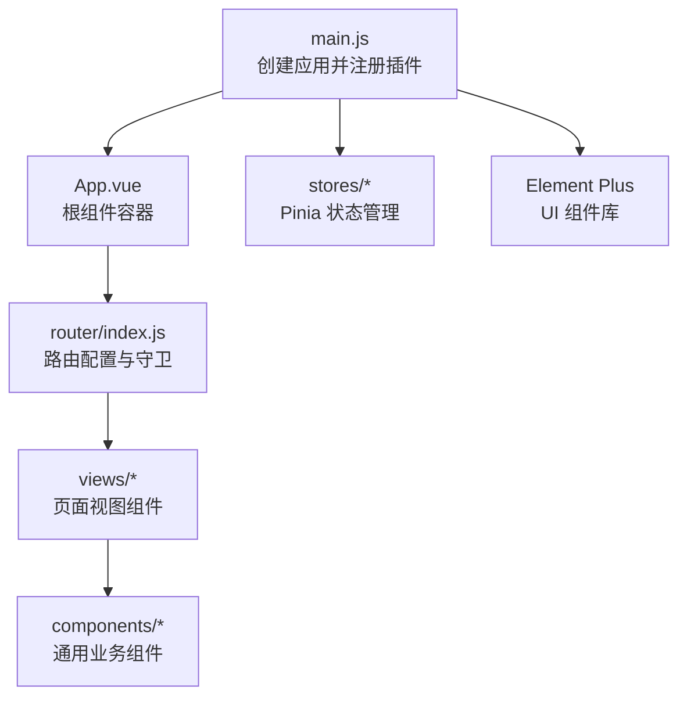
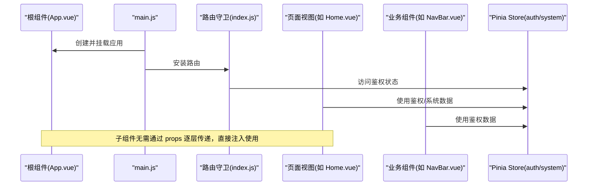
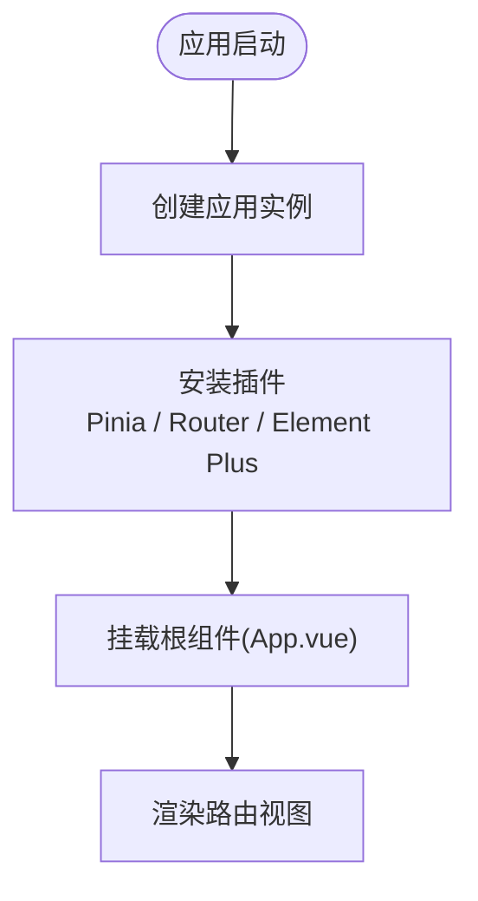
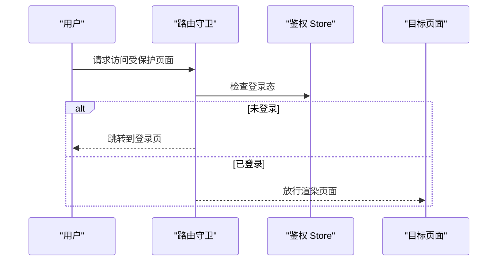
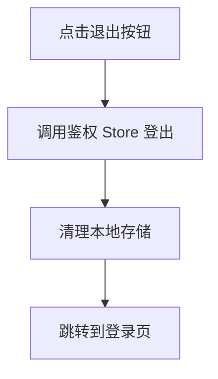
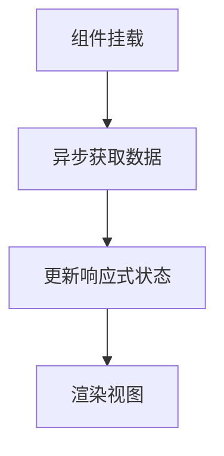
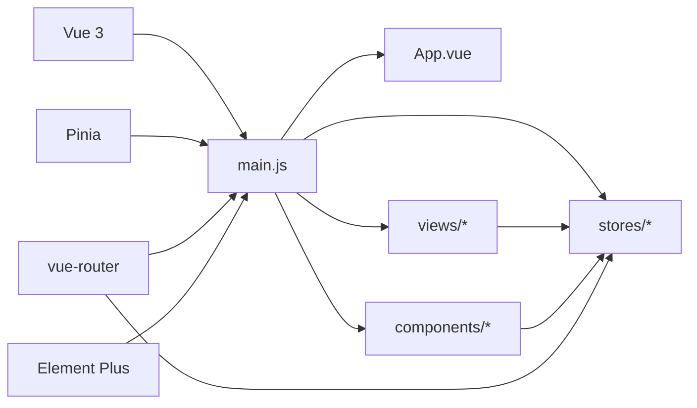

# 依赖注入通信

<cite>
**本文引用的文件**
- [App.vue](file://python-web/src/App.vue)
- [main.js](file://python-web/src/main.js)
- [NavBar.vue](file://python-web/src/components/NavBar.vue)
- [Home.vue](file://python-web/src/views/Home.vue)
- [Alerts.vue](file://python-web/src/views/Alerts.vue)
- [auth.js](file://python-web/src/stores/auth.js)
- [system.js](file://python-web/src/stores/system.js)
- [index.js](file://python-web/src/router/index.js)
- [package.json](file://python-web/package.json)
</cite>

## 目录
1. [引言](#引言)
2. [项目结构](#项目结构)
3. [核心组件](#核心组件)
4. [架构总览](#架构总览)
5. [详细组件分析](#详细组件分析)
6. [依赖分析](#依赖分析)
7. [性能考量](#性能考量)
8. [故障排查指南](#故障排查指南)
9. [结论](#结论)
10. [附录](#附录)

## 引言
本文件围绕 Vue 的 provide/inject 依赖注入通信机制进行深入讲解，结合项目中的实际场景（如认证态、系统状态、路由守卫等）说明如何在根组件中提供共享数据，以及子组件如何注入这些数据。文档同时覆盖跨层级组件通信的优势（避免 props 层层传递、组件解耦、数据共享）、与 Composition API 的结合使用、最佳实践（数据类型检查、默认值设置、响应式数据处理），并提供可视化流程图帮助理解。

## 项目结构
该项目采用 Vue 3 + Vite + Pinia + Element Plus 的现代前端栈，采用单页应用（SPA）架构，通过 vue-router 进行页面级导航。根组件负责挂载应用并注册插件，全局状态通过 Pinia 管理，路由守卫基于鉴权 store 控制访问。

图表来源
- [main.js:1-16](file://python-web/src/main.js#L1-L16)
- [App.vue:1-10](file://python-web/src/App.vue#L1-L10)
- [index.js:1-150](file://python-web/src/router/index.js#L1-L150)

章节来源
- [main.js:1-16](file://python-web/src/main.js#L1-L16)
- [package.json:1-24](file://python-web/package.json#L1-L24)

## 核心组件
- 根组件 App.vue：作为应用入口，承载路由视图渲染。
- 主入口 main.js：创建应用实例，安装路由、状态管理、UI 插件。
- 鉴权 Store（auth.js）：集中管理用户登录态、令牌与用户信息。
- 系统 Store（system.js）：集中管理告警、代理、日志、资源等系统级数据。
- 路由（router/index.js）：定义路由表并基于鉴权 store 实施前置守卫。
- 导航栏组件（components/NavBar.vue）：展示用户信息、下拉菜单、登出逻辑。
- 首页与告警视图（views/Home.vue、views/Alerts.vue）：演示如何消费 store 数据与交互。

章节来源
- [App.vue:1-10](file://python-web/src/App.vue#L1-L10)
- [main.js:1-16](file://python-web/src/main.js#L1-L16)
- [auth.js:1-74](file://python-web/src/stores/auth.js#L1-L74)
- [system.js:1-168](file://python-web/src/stores/system.js#L1-L168)
- [index.js:1-150](file://python-web/src/router/index.js#L1-L150)
- [NavBar.vue:1-352](file://python-web/src/components/NavBar.vue#L1-L352)
- [Home.vue:1-800](file://python-web/src/views/Home.vue#L1-L800)
- [Alerts.vue:1-540](file://python-web/src/views/Alerts.vue#L1-L540)

## 架构总览
下面的序列图展示了“根组件提供数据 → 子组件注入数据 → 视图消费”的典型流程。虽然本项目未直接使用 provide/inject API，但其思想与实现方式完全一致：根组件通过响应式数据（store）向子孙组件提供共享能力，子组件通过组合式 API 注入并使用。

图表来源
- [main.js:1-16](file://python-web/src/main.js#L1-L16)
- [index.js:134-147](file://python-web/src/router/index.js#L134-L147)
- [auth.js:5-74](file://python-web/src/stores/auth.js#L5-L74)
- [system.js:7-168](file://python-web/src/stores/system.js#L7-L168)

## 详细组件分析

### 根组件与应用初始化
- 根组件 App.vue 仅包含一个路由视图出口，用于渲染当前路由对应的页面组件。
- main.js 中完成应用创建、插件安装（Pinia、Router、Element Plus）与挂载。

图表来源
- [main.js:1-16](file://python-web/src/main.js#L1-L16)
- [App.vue:1-10](file://python-web/src/App.vue#L1-L10)

章节来源
- [App.vue:1-10](file://python-web/src/App.vue#L1-L10)
- [main.js:1-16](file://python-web/src/main.js#L1-L16)

### 鉴权状态与路由守卫
- 鉴权 Store 提供登录态、用户信息、登录/注册/登出等方法。
- 路由守卫在导航前检查登录态，决定放行或跳转至登录页。

图表来源
- [index.js:134-147](file://python-web/src/router/index.js#L134-L147)
- [auth.js:5-74](file://python-web/src/stores/auth.js#L5-L74)

章节来源
- [index.js:1-150](file://python-web/src/router/index.js#L1-L150)
- [auth.js:1-74](file://python-web/src/stores/auth.js#L1-L74)

### 导航栏组件与用户信息
- 导航栏组件通过组合式 API 获取路由、路由参数与鉴权 Store，展示用户名首字母头像与登出按钮。
- 登出后跳转到登录页，体现路由守卫对登录态的约束。

图表来源
- [NavBar.vue:117-120](file://python-web/src/components/NavBar.vue#L117-L120)
- [auth.js:43-51](file://python-web/src/stores/auth.js#L43-L51)
- [index.js:140-146](file://python-web/src/router/index.js#L140-L146)

章节来源
- [NavBar.vue:1-352](file://python-web/src/components/NavBar.vue#L1-L352)
- [auth.js:1-74](file://python-web/src/stores/auth.js#L1-L74)
- [index.js:1-150](file://python-web/src/router/index.js#L1-L150)

### 页面视图与数据消费
- 首页视图与告警视图均通过组合式 API 使用鉴权 Store 与系统 Store，实现数据展示与交互。
- 例如首页视图计算问候语、日期、图表路径，告警视图过滤与分页展示告警列表。

图表来源
- [Home.vue:368-397](file://python-web/src/views/Home.vue#L368-L397)
- [Alerts.vue:201-219](file://python-web/src/views/Alerts.vue#L201-L219)

章节来源
- [Home.vue:1-800](file://python-web/src/views/Home.vue#L1-L800)
- [Alerts.vue:1-540](file://python-web/src/views/Alerts.vue#L1-L540)

### 依赖注入原理与最佳实践
- 原理概述
  - provide：在父组件（根组件或更高层）提供共享数据或方法，通常使用响应式数据（ref/computed/reactive）。
  - inject：在任意层级的子组件中注入这些数据，无需通过 props 逐层传递。
  - 优势：避免 props 穿透、降低组件耦合、统一数据来源、便于测试与维护。
- 与 Composition API 结合
  - 在 setup 中使用 provide/inject，配合 ref/computed/reactive 保持响应式。
  - 将共享逻辑抽象为可复用的 provide/inject 组合函数，提升可复用性。
- 最佳实践
  - 类型检查：为注入的数据设置合理的类型与默认值，确保类型安全。
  - 默认值：为 inject 设置默认值，防止未提供时的空引用。
  - 响应式数据：确保 provide 的数据为响应式，保证子组件能感知变化。
  - 作用域隔离：合理划分 provide 的作用域，避免全局污染。
  - 文档与注释：为 provide/inject 的键名与用途编写清晰注释，便于团队协作。

## 依赖分析
- 应用依赖
  - Vue 3：框架核心
  - Pinia：状态管理
  - vue-router：路由
  - Element Plus：UI 组件库
- 项目内依赖关系
  - main.js 依赖 App.vue、router、stores、Element Plus
  - router/index.js 依赖 stores/auth
  - views 与 components 依赖 stores 与 router
  - stores 依赖 api 模块（未在本文展开）

图表来源
- [package.json:11-17](file://python-web/package.json#L11-L17)
- [main.js:1-16](file://python-web/src/main.js#L1-L16)

章节来源
- [package.json:1-24](file://python-web/package.json#L1-L24)
- [main.js:1-16](file://python-web/src/main.js#L1-L16)

## 性能考量
- 响应式数据粒度：尽量将 provide 的数据拆分为细粒度的响应式对象，减少不必要的重渲染。
- 计算属性：使用 computed 缓存派生数据，避免重复计算。
- 异步加载：对需要异步获取的数据采用骨架屏或占位符，提升用户体验。
- 组件懒加载：对非关键页面采用动态导入，降低首屏体积。
- 路由守卫：在守卫中尽量减少 IO 操作，必要时使用缓存策略。

## 故障排查指南
- 登录态失效导致页面无法访问
  - 检查路由守卫中的登录态判断逻辑与本地存储。
  - 确认鉴权 Store 的清理逻辑是否正确触发。
- 数据未更新或视图未刷新
  - 确保 provide 的数据为响应式（ref/computed/reactive）。
  - 检查子组件是否正确注入并使用响应式数据。
- 注入数据为空或类型不符
  - 为 inject 设置默认值与类型断言，避免空引用。
  - 在 provide 侧确保数据类型与结构符合预期。

章节来源
- [index.js:134-147](file://python-web/src/router/index.js#L134-L147)
- [auth.js:21-28](file://python-web/src/stores/auth.js#L21-L28)

## 结论
本项目通过 Pinia 与 vue-router 实现了类似依赖注入的共享数据机制：根组件提供应用上下文（路由、状态），子组件按需注入使用。虽然未直接使用 provide/inject API，但其思想与实现方式一致。结合 Composition API，可以进一步将共享逻辑封装为可复用的组合函数，提升代码的可维护性与可测试性。遵循类型检查、默认值、响应式数据与作用域隔离等最佳实践，能够有效避免常见问题并提升开发体验。

## 附录
- 示例参考路径（不展示具体代码内容）
  - 根组件与应用初始化：[main.js:1-16](file://python-web/src/main.js#L1-L16)，[App.vue:1-10](file://python-web/src/App.vue#L1-L10)
  - 鉴权 Store 与路由守卫：[auth.js:5-74](file://python-web/src/stores/auth.js#L5-L74)，[index.js:134-147](file://python-web/src/router/index.js#L134-L147)
  - 导航栏组件与用户信息：[NavBar.vue:117-120](file://python-web/src/components/NavBar.vue#L117-L120)
  - 页面视图数据消费：[Home.vue:368-397](file://python-web/src/views/Home.vue#L368-L397)，[Alerts.vue:201-219](file://python-web/src/views/Alerts.vue#L201-L219)