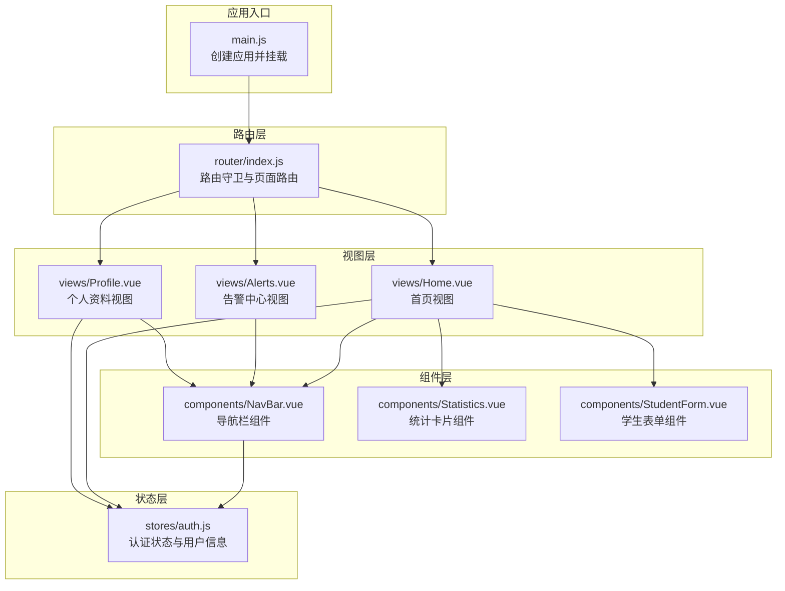
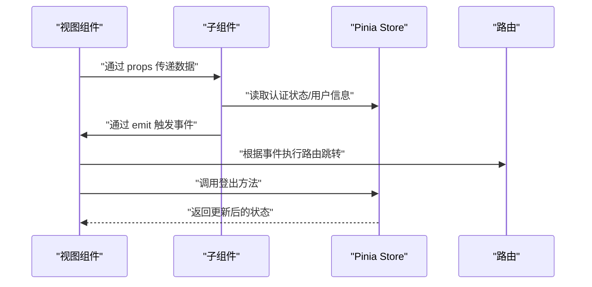
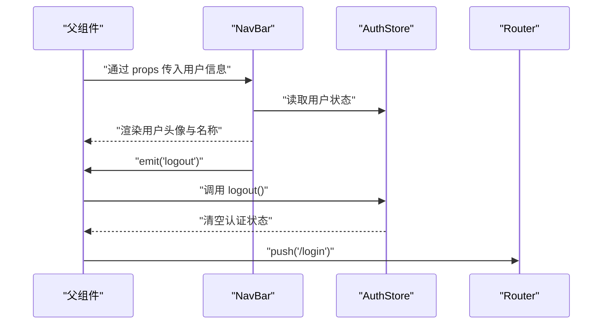
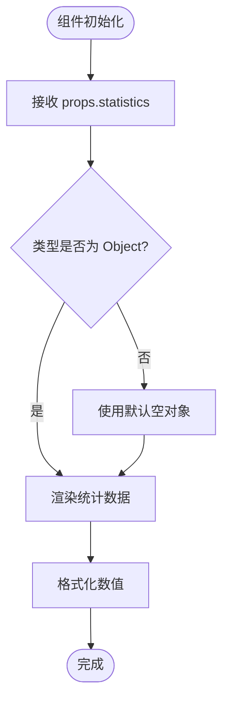
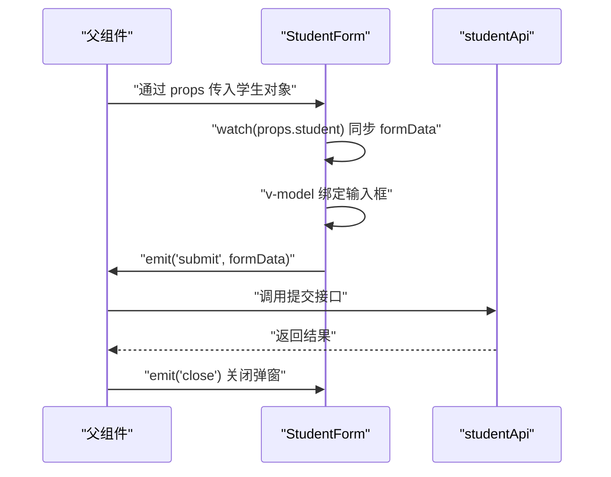
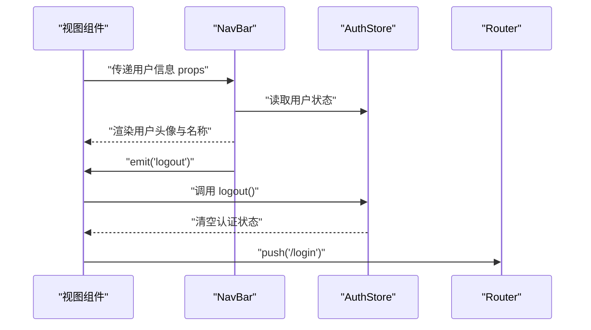
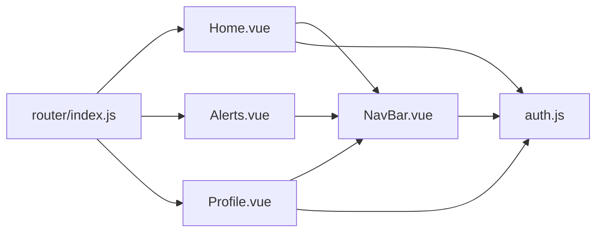

# 父子组件通信

<cite>
**本文档引用的文件**
- [NavBar.vue](file://python-web/src/components/NavBar.vue)
- [Home.vue](file://python-web/src/views/Home.vue)
- [Statistics.vue](file://python-web/src/components/Statistics.vue)
- [StudentForm.vue](file://python-web/src/components/StudentForm.vue)
- [Alerts.vue](file://python-web/src/views/Alerts.vue)
- [Profile.vue](file://python-web/src/views/Profile.vue)
- [auth.js](file://python-web/src/stores/auth.js)
- [index.js](file://python-web/src/router/index.js)
- [main.js](file://python-web/src/main.js)
</cite>

## 目录
1. [简介](#简介)
2. [项目结构](#项目结构)
3. [核心组件](#核心组件)
4. [架构总览](#架构总览)
5. [详细组件分析](#详细组件分析)
6. [依赖关系分析](#依赖关系分析)
7. [性能考虑](#性能考虑)
8. [故障排除指南](#故障排除指南)
9. [结论](#结论)

## 简介
本文件系统性阐述 Vue 组件间父子通信机制，围绕 props 属性传递、emit 事件触发、v-model 双向绑定展开，结合 NavBar 组件展示如何接收父组件传入的数据（如用户信息、权限状态等），并详细说明子组件向父组件传递数据的事件机制（自定义事件命名规范、事件参数传递、事件监听器绑定）。同时提供实际代码示例路径，展示父子组件间的单向数据流与事件冒泡模式，解释 props 验证、默认值设置、类型检查的最佳实践。

## 项目结构
该项目采用基于文件系统的组织方式，前端使用 Vite + Vue 3 + Pinia + Element Plus 技术栈。组件主要位于 `src/components`，页面视图位于 `src/views`，全局状态通过 `src/stores` 管理，路由在 `src/router` 中配置。

图表来源
- [main.js:1-16](file://python-web/src/main.js#L1-L16)
- [index.js:1-150](file://python-web/src/router/index.js#L1-L150)
- [Home.vue:1-1055](file://python-web/src/views/Home.vue#L1-L1055)
- [Alerts.vue:1-540](file://python-web/src/views/Alerts.vue#L1-L540)
- [Profile.vue:1-280](file://python-web/src/views/Profile.vue#L1-L280)
- [NavBar.vue:1-352](file://python-web/src/components/NavBar.vue#L1-L352)
- [Statistics.vue:1-38](file://python-web/src/components/Statistics.vue#L1-L38)
- [StudentForm.vue:1-201](file://python-web/src/components/StudentForm.vue#L1-L201)
- [auth.js:1-74](file://python-web/src/stores/auth.js#L1-L74)

章节来源
- [main.js:1-16](file://python-web/src/main.js#L1-L16)
- [index.js:1-150](file://python-web/src/router/index.js#L1-L150)

## 核心组件
- 导航栏组件 NavBar：负责渲染导航菜单、用户信息展示、下拉菜单交互以及登出逻辑；内部通过 Pinia 认证状态与路由进行交互。
- 统计卡片组件 Statistics：接收父组件传入的统计数据对象，进行格式化展示。
- 学生表单组件 StudentForm：演示 props 接收、emit 事件触发、v-model 双向绑定与表单校验。
- 视图组件 Home/Alerts/Profile：作为父组件，引入并使用子组件，传递数据与处理事件。

章节来源
- [NavBar.vue:1-352](file://python-web/src/components/NavBar.vue#L1-L352)
- [Statistics.vue:1-38](file://python-web/src/components/Statistics.vue#L1-L38)
- [StudentForm.vue:1-201](file://python-web/src/components/StudentForm.vue#L1-L201)
- [Home.vue:1-1055](file://python-web/src/views/Home.vue#L1-L1055)
- [Alerts.vue:1-540](file://python-web/src/views/Alerts.vue#L1-L540)
- [Profile.vue:1-280](file://python-web/src/views/Profile.vue#L1-L280)

## 架构总览
本项目采用“视图层-组件层-状态层”的分层架构：
- 视图层：各页面视图负责业务场景与布局，引入子组件并处理用户交互。
- 组件层：通用 UI 组件封装可复用逻辑，通过 props 接收数据，通过 emit 向父组件传递事件。
- 状态层：Pinia Store 管理认证状态与用户信息，供组件读取与更新。

图表来源
- [Home.vue:269-357](file://python-web/src/views/Home.vue#L269-L357)
- [NavBar.vue:84-121](file://python-web/src/components/NavBar.vue#L84-L121)
- [auth.js:1-74](file://python-web/src/stores/auth.js#L1-L74)
- [index.js:129-147](file://python-web/src/router/index.js#L129-L147)

## 详细组件分析

### 导航栏组件（NavBar）与父组件通信
- 父组件通过 props 向子组件传递数据：例如用户信息、权限状态等。在 NavBar 中，父组件会传入用户对象以供展示。
- 子组件通过 emit 向父组件传递事件：例如用户点击退出按钮时，子组件发出登出事件，父组件处理路由跳转。
- v-model 使用：在其他组件中演示了 v-model 的使用，NavBar 本身未直接使用 v-model，但其交互行为体现了事件冒泡与状态更新的模式。

图表来源
- [Home.vue:3,271](file://python-web/src/views/Home.vue#L3,L271)
- [NavBar.vue:67-78,117-120](file://python-web/src/components/NavBar.vue#L67-L78,L117-L120)
- [auth.js:43-51](file://python-web/src/stores/auth.js#L43-L51)
- [index.js:134-147](file://python-web/src/router/index.js#L134-L147)

章节来源
- [NavBar.vue:1-352](file://python-web/src/components/NavBar.vue#L1-L352)
- [Home.vue:1-1055](file://python-web/src/views/Home.vue#L1-L1055)
- [auth.js:1-74](file://python-web/src/stores/auth.js#L1-L74)
- [index.js:1-150](file://python-web/src/router/index.js#L1-L150)

### 统计卡片组件（Statistics）：props 接收与类型验证
- 接收父组件传入的统计对象，包含 total、average_age、average_grade、highest_grade、lowest_grade 等字段。
- 通过 defineProps 对传入的 statistics 进行类型与默认值约束，确保组件健壮性。

图表来源
- [Statistics.vue:27-32](file://python-web/src/components/Statistics.vue#L27-L32)

章节来源
- [Statistics.vue:1-38](file://python-web/src/components/Statistics.vue#L1-L38)

### 学生表单组件（StudentForm）：props、emit、v-model 综合示例
- props 接收：接收父组件传入的学生对象，用于编辑模式下的数据回填。
- emit 事件：当用户点击关闭或提交时，通过 emit('close') 或 emit('submit', payload) 向父组件传递事件与数据。
- v-model 双向绑定：使用 v-model、v-model.number 实现输入框与表单数据的双向绑定，配合 watch 监听 props 变化，实现编辑态数据同步。
- 表单校验：在提交前进行字段校验，错误信息通过局部状态反馈给用户。

图表来源
- [StudentForm.vue:74-81,102-116,187-200](file://python-web/src/components/StudentForm.vue#L74-L81,L102-L116,L187-L200)

章节来源
- [StudentForm.vue:1-201](file://python-web/src/components/StudentForm.vue#L1-L201)

### 视图组件中的通信实践
- Home/Alerts/Profile 等视图作为父组件，引入 NavBar 等子组件，通过 props 传递用户信息、统计数据等，通过 emit 处理子组件事件（如登出、提交等）。
- 路由守卫与认证状态联动：视图组件通过 Pinia Store 判断用户是否已登录，未登录时重定向到登录页。

图表来源
- [Home.vue:3,271](file://python-web/src/views/Home.vue#L3,L271)
- [NavBar.vue:67-78,117-120](file://python-web/src/components/NavBar.vue#L67-L78,L117-L120)
- [auth.js:43-51](file://python-web/src/stores/auth.js#L43-L51)
- [index.js:134-147](file://python-web/src/router/index.js#L134-L147)

章节来源
- [Home.vue:1-1055](file://python-web/src/views/Home.vue#L1-L1055)
- [Alerts.vue:1-540](file://python-web/src/views/Alerts.vue#L1-L540)
- [Profile.vue:1-280](file://python-web/src/views/Profile.vue#L1-L280)
- [NavBar.vue:1-352](file://python-web/src/components/NavBar.vue#L1-L352)
- [auth.js:1-74](file://python-web/src/stores/auth.js#L1-L74)
- [index.js:1-150](file://python-web/src/router/index.js#L1-L150)

## 依赖关系分析
- 组件依赖：视图组件依赖 NavBar、Statistics、StudentForm 等子组件；子组件依赖 Pinia Store 提供的认证状态。
- 状态依赖：NavBar 与 Home/Profile 等视图通过 useAuthStore 获取用户信息与认证状态。
- 路由依赖：路由守卫根据认证状态控制页面访问，NavBar 登出后触发路由跳转。

图表来源
- [Home.vue:271](file://python-web/src/views/Home.vue#L271)
- [Alerts.vue:141](file://python-web/src/views/Alerts.vue#L141)
- [Profile.vue:149](file://python-web/src/views/Profile.vue#L149)
- [NavBar.vue:87](file://python-web/src/components/NavBar.vue#L87)
- [auth.js:1-74](file://python-web/src/stores/auth.js#L1-L74)
- [index.js:1-150](file://python-web/src/router/index.js#L1-L150)

章节来源
- [Home.vue:1-1055](file://python-web/src/views/Home.vue#L1-L1055)
- [Alerts.vue:1-540](file://python-web/src/views/Alerts.vue#L1-L540)
- [Profile.vue:1-280](file://python-web/src/views/Profile.vue#L1-L280)
- [NavBar.vue:1-352](file://python-web/src/components/NavBar.vue#L1-L352)
- [auth.js:1-74](file://python-web/src/stores/auth.js#L1-L74)
- [index.js:1-150](file://python-web/src/router/index.js#L1-L150)

## 性能考虑
- 单向数据流：props 自上而下传递，避免跨层级状态共享带来的复杂度与性能损耗。
- 事件冒泡：emit 事件只在父子层级传播，减少不必要的组件重渲染。
- 计算属性与响应式：合理使用 computed 与 ref，避免在模板中进行复杂计算。
- 路由守卫：在路由层面进行认证判断，减少无效渲染与请求。
- 组件拆分：将通用 UI 拆分为独立组件（如 Statistics、StudentForm），提升复用性与可维护性。

## 故障排除指南
- props 类型不匹配：确保父组件传入的类型与 defineProps 声明一致，必要时提供默认值。
- emit 事件未触发：检查子组件是否正确声明 defineEmits，并在合适时机调用 emit。
- v-model 绑定失效：确认 v-model 修饰符（如 number）与输入类型匹配，避免字符串与数字混用。
- 认证状态不同步：检查 Pinia Store 的状态更新与本地存储同步逻辑，确保登出后状态一致。
- 路由跳转异常：确认路由守卫逻辑与认证状态判断条件，避免死循环或错误跳转。

章节来源
- [Statistics.vue:27-32](file://python-web/src/components/Statistics.vue#L27-L32)
- [StudentForm.vue:74-81,187-200](file://python-web/src/components/StudentForm.vue#L74-L81,L187-L200)
- [auth.js:12-28](file://python-web/src/stores/auth.js#L12-L28)
- [index.js:134-147](file://python-web/src/router/index.js#L134-L147)

## 结论
本项目通过 NavBar、Statistics、StudentForm 等组件展示了 Vue 父子组件通信的核心机制：props 单向数据流、emit 事件冒泡、v-model 双向绑定。结合 Pinia Store 与路由守卫，实现了清晰的状态管理与页面控制。遵循 props 验证、默认值与类型检查的最佳实践，能够显著提升组件的健壮性与可维护性。建议在实际项目中持续优化组件职责边界，保持单向数据流与事件冒泡的清晰路径，以获得更好的开发体验与运行性能。