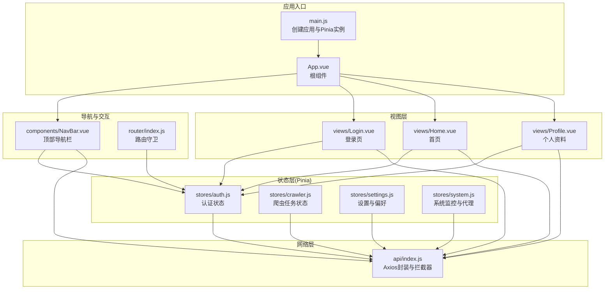
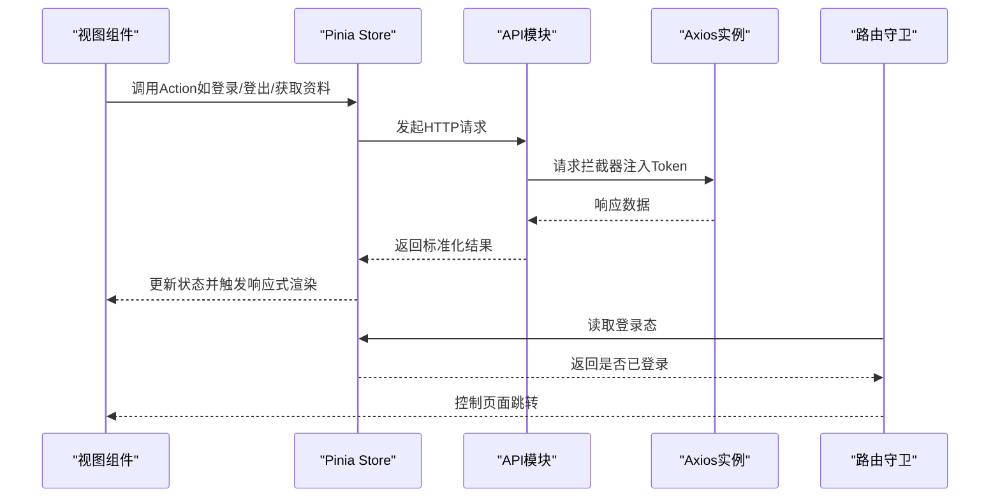
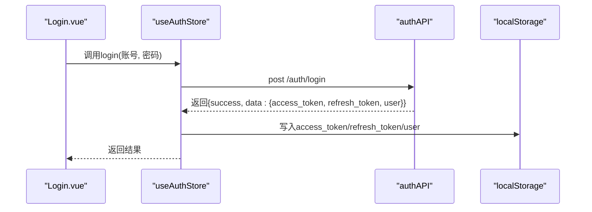
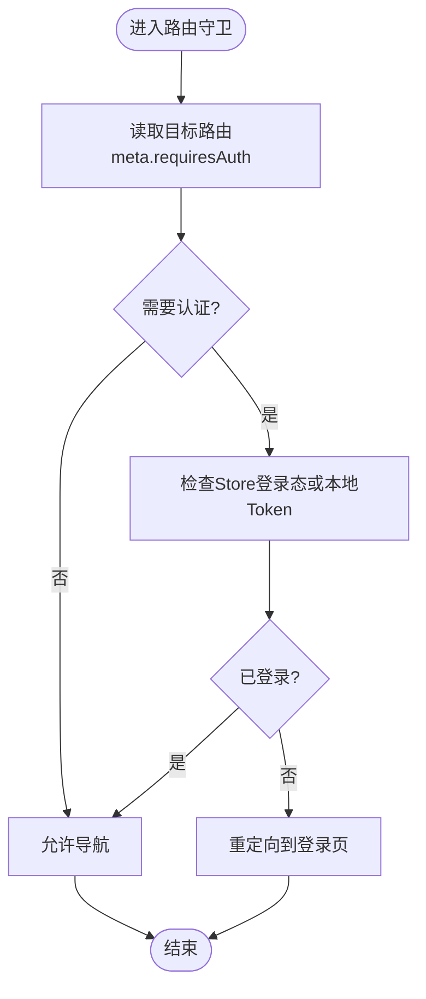
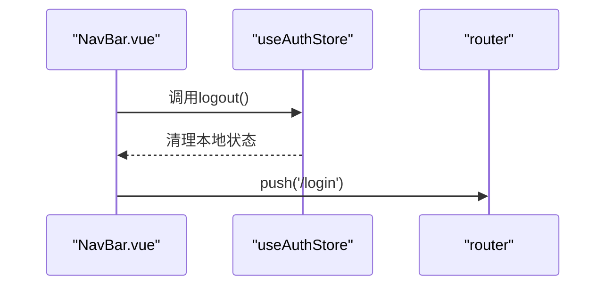
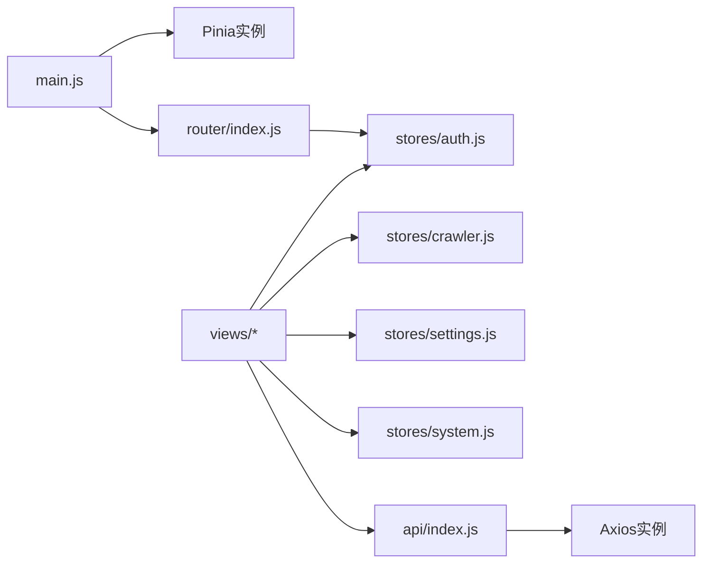

# 状态管理通信

<cite>
**本文引用的文件**
- [auth.js](file://python-web/src/stores/auth.js)
- [main.js](file://python-web/src/main.js)
- [package.json](file://python-web/package.json)
- [App.vue](file://python-web/src/App.vue)
- [NavBar.vue](file://python-web/src/components/NavBar.vue)
- [Login.vue](file://python-web/src/views/Login.vue)
- [Home.vue](file://python-web/src/views/Home.vue)
- [Profile.vue](file://python-web/src/views/Profile.vue)
- [index.js](file://python-web/src/api/index.js)
- [router/index.js](file://python-web/src/router/index.js)
- [crawler.js](file://python-web/src/stores/crawler.js)
- [settings.js](file://python-web/src/stores/settings.js)
- [system.js](file://python-web/src/stores/system.js)
</cite>

## 目录
1. [简介](#简介)
2. [项目结构](#项目结构)
3. [核心组件](#核心组件)
4. [架构总览](#架构总览)
5. [详细组件分析](#详细组件分析)
6. [依赖关系分析](#依赖关系分析)
7. [性能考量](#性能考量)
8. [故障排查指南](#故障排查指南)
9. [结论](#结论)
10. [附录](#附录)

## 简介
本文件面向具有一定Vue开发经验的工程师，系统性讲解基于Vue 3与Pinia的状态管理实践，重点围绕以下主题展开：
- Store设计模式与Composition API风格的实现
- 状态定义、Action方法与Getter计算属性的组织方式
- 用户认证状态管理（auth.js）：登录状态、权限信息、Token管理
- 跨组件状态共享：订阅、响应式更新与持久化策略
- 实际用法示例：在不同组件中访问与修改共享状态
- 最佳实践：状态结构设计、Action异步处理、状态调试技巧

## 项目结构
该前端工程采用Vue 3 + Vite + Pinia的现代组合，核心入口在应用根目录，状态管理集中在stores目录，API封装于api目录，路由守卫与导航组件位于router与components目录。

图表来源
- [main.js:1-16](file://python-web/src/main.js#L1-L16)
- [App.vue:1-10](file://python-web/src/App.vue#L1-L10)
- [auth.js:1-74](file://python-web/src/stores/auth.js#L1-L74)
- [Login.vue:1-121](file://python-web/src/views/Login.vue#L1-L121)
- [Home.vue:1-800](file://python-web/src/views/Home.vue#L1-L800)
- [Profile.vue:1-280](file://python-web/src/views/Profile.vue#L1-L280)
- [NavBar.vue:1-352](file://python-web/src/components/NavBar.vue#L1-L352)
- [router/index.js:1-150](file://python-web/src/router/index.js#L1-L150)
- [index.js:1-95](file://python-web/src/api/index.js#L1-L95)

章节来源
- [main.js:1-16](file://python-web/src/main.js#L1-L16)
- [package.json:1-24](file://python-web/package.json#L1-L24)

## 核心组件
本节聚焦Pinia Store的设计与实现要点，涵盖状态定义、Action与Getter的组织方式，以及与API层的协作。

- 认证Store（auth.js）
  - 状态：访问令牌、刷新令牌、用户对象
  - Getter：登录态判断
  - Action：登录、注册、登出、拉取个人资料、设置/清理认证信息
  - 持久化：本地存储同步
- 爬虫任务Store（crawler.js）
  - 状态：任务列表、模板、版本、收藏、加载状态、当前任务
  - Action：查询、增删改、启停、模板与收藏管理等
- 设置Store（settings.js）
  - 状态：主题、全局设置、用户偏好
  - Action：读取/更新设置与偏好，切换主题
- 系统Store（system.js）
  - 状态：告警、未读数、代理、黑白名单、速率限制、系统日志、资源信息
  - Action：告警标记已读、代理增删改、黑名单/白名单维护、速率限制、日志清理、资源查询

章节来源
- [auth.js:1-74](file://python-web/src/stores/auth.js#L1-L74)
- [crawler.js:1-174](file://python-web/src/stores/crawler.js#L1-L174)
- [settings.js:1-59](file://python-web/src/stores/settings.js#L1-L59)
- [system.js:1-168](file://python-web/src/stores/system.js#L1-L168)

## 架构总览
下图展示了从组件到Store再到API的整体调用链路，以及路由守卫对认证状态的约束。

图表来源
- [Login.vue:100-119](file://python-web/src/views/Login.vue#L100-L119)
- [auth.js:30-51](file://python-web/src/stores/auth.js#L30-L51)
- [index.js:11-59](file://python-web/src/api/index.js#L11-L59)
- [router/index.js:134-147](file://python-web/src/router/index.js#L134-L147)

## 详细组件分析

### 认证状态管理（auth.js）
- 设计模式
  - 使用组合式风格的defineStore，返回响应式状态与方法，便于在setup中直接使用
  - 将Token与用户信息持久化至localStorage，并在Store内保持同步
- 状态与Getter
  - 访问令牌、刷新令牌、用户对象
  - 登录态通过计算属性推导，避免重复判断
- Action流程
  - 登录：调用API登录接口，成功后写入Token与用户信息
  - 注册：调用注册接口，返回结果
  - 登出：先尝试服务端登出（若存在刷新令牌），最终清理本地状态
  - 获取个人资料：调用用户资料接口，更新本地用户信息
  - 设置/清理认证信息：统一写入/移除本地存储
- 与API交互
  - 通过authAPI与userAPI发起请求
  - Store内部不关心具体URL，只关注返回结构

图表来源
- [Login.vue:100-119](file://python-web/src/views/Login.vue#L100-L119)
- [auth.js:30-41](file://python-web/src/stores/auth.js#L30-L41)
- [index.js:61-86](file://python-web/src/api/index.js#L61-L86)

章节来源
- [auth.js:1-74](file://python-web/src/stores/auth.js#L1-L74)
- [Login.vue:1-121](file://python-web/src/views/Login.vue#L1-L121)

### 路由守卫与登录态校验
- 守卫逻辑
  - 在导航前检查目标路由是否需要认证
  - 通过Store的登录态或本地存储判断是否放行
  - 已登录用户访问登录/注册页时重定向首页
- 与Store的耦合
  - 守卫中直接使用useAuthStore读取登录态
  - 保证全局一致的认证判定

图表来源
- [router/index.js:134-147](file://python-web/src/router/index.js#L134-L147)
- [auth.js:10](file://python-web/src/stores/auth.js#L10)

章节来源
- [router/index.js:1-150](file://python-web/src/router/index.js#L1-L150)
- [auth.js:1-74](file://python-web/src/stores/auth.js#L1-L74)

### 组件中使用认证状态
- 导航栏（NavBar.vue）
  - 展示当前用户头像与名称
  - 触发登出动作并跳转登录页
- 首页（Home.vue）
  - 展示欢迎语与用户信息
  - 通过计算属性动态生成问候语
- 个人资料（Profile.vue）
  - 展示用户基本信息
  - 提供修改密码表单与强度提示

图表来源
- [NavBar.vue:117-120](file://python-web/src/components/NavBar.vue#L117-L120)
- [auth.js:43-51](file://python-web/src/stores/auth.js#L43-L51)
- [router/index.js:149](file://python-web/src/router/index.js#L149)

章节来源
- [NavBar.vue:1-352](file://python-web/src/components/NavBar.vue#L1-L352)
- [Home.vue:269-357](file://python-web/src/views/Home.vue#L269-L357)
- [Profile.vue:145-280](file://python-web/src/views/Profile.vue#L145-L280)

### 其他Store示例（爬虫、设置、系统）
- 爬虫任务Store（crawler.js）
  - 管理任务列表、模板、版本、收藏与当前任务
  - 提供查询、创建、更新、删除、启停、模板与收藏操作
  - 统一loading状态，确保UI反馈一致
- 设置Store（settings.js）
  - 主题切换与持久化
  - 全局设置与用户偏好的读取/更新
- 系统Store（system.js）
  - 告警管理、代理与黑白名单、速率限制、系统日志、资源信息
  - 提供批量操作与状态同步

章节来源
- [crawler.js:1-174](file://python-web/src/stores/crawler.js#L1-L174)
- [settings.js:1-59](file://python-web/src/stores/settings.js#L1-L59)
- [system.js:1-168](file://python-web/src/stores/system.js#L1-L168)

## 依赖关系分析
- 应用初始化
  - main.js中创建应用与Pinia实例，并挂载Element Plus与路由
- 组件与Store
  - 各视图与导航组件通过useAuthStore/useCrawlerStore等访问状态与Action
- API层
  - api/index.js统一创建Axios实例，注入请求拦截器携带Token
  - 响应拦截器处理401自动刷新Token或强制登出
- 路由
  - router/index.js在导航前检查认证状态，控制页面访问

图表来源
- [main.js:1-16](file://python-web/src/main.js#L1-L16)
- [router/index.js:1-150](file://python-web/src/router/index.js#L1-L150)
- [auth.js:1-74](file://python-web/src/stores/auth.js#L1-L74)
- [index.js:1-95](file://python-web/src/api/index.js#L1-L95)

章节来源
- [main.js:1-16](file://python-web/src/main.js#L1-L16)
- [router/index.js:1-150](file://python-web/src/router/index.js#L1-L150)
- [index.js:1-95](file://python-web/src/api/index.js#L1-L95)

## 性能考量
- 响应式粒度
  - 将大对象拆分为细粒度状态，减少不必要的重渲染
- 异步Action
  - 使用loading状态与finally块确保UI状态一致
- 缓存与去抖
  - 对频繁查询的接口进行缓存或合并请求
- 持久化策略
  - 仅持久化必要字段，避免localStorage过大影响启动性能
- 调试与可观测性
  - 使用浏览器调试工具观察Store变化，定位渲染热点

## 故障排查指南
- 登录后仍被重定向到登录页
  - 检查路由守卫中的登录态判断逻辑
  - 确认Store的isAuthenticated与本地Token一致性
- Token过期导致请求失败
  - 查看响应拦截器是否正确触发刷新流程
  - 确保刷新接口未被拦截器二次处理
- 页面无法访问受保护路由
  - 检查路由meta.requiresAuth配置
  - 确认导航前守卫逻辑与Store状态同步

章节来源
- [router/index.js:134-147](file://python-web/src/router/index.js#L134-L147)
- [index.js:22-59](file://python-web/src/api/index.js#L22-L59)
- [auth.js:10](file://python-web/src/stores/auth.js#L10)

## 结论
本项目以Pinia为核心构建了清晰、可维护的状态管理方案：
- 采用组合式Store，简化状态与Action的组织
- 通过API拦截器统一处理认证与Token刷新
- 路由守卫保障页面访问安全
- 多个Store覆盖业务域，职责清晰、边界明确
建议在团队内推广此模式，并配合TypeScript进一步增强类型安全与开发体验。

## 附录
- 在组件中访问与修改共享状态的步骤
  - 在setup中导入并使用对应Store
  - 通过ref/computed暴露状态，通过Action修改状态
  - 在模板中直接绑定状态与事件
- 最佳实践清单
  - 状态结构扁平化，避免深层嵌套
  - 所有异步Action统一处理loading与错误
  - 仅持久化必要状态，避免污染本地存储
  - 使用计算属性派生派生状态，减少重复逻辑
  - 为关键Action添加单元测试与集成测试