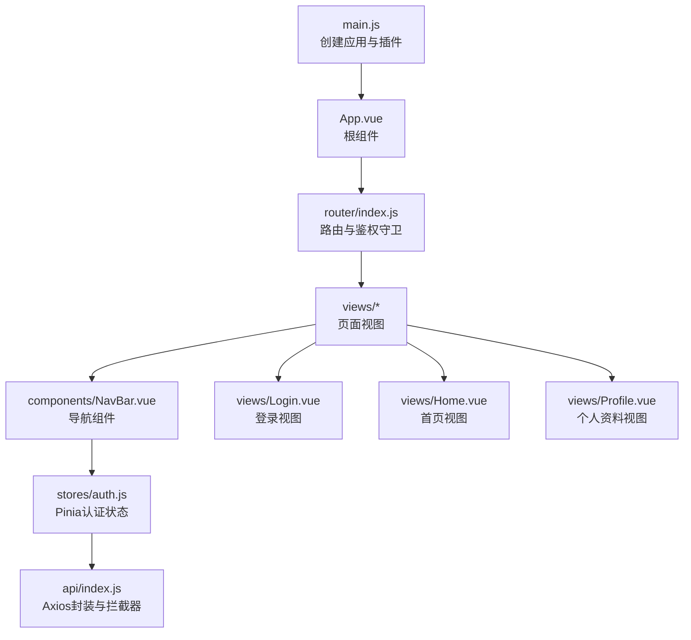
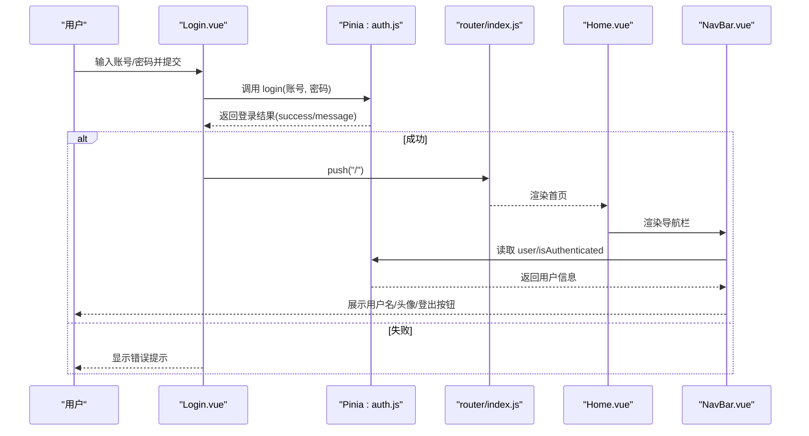
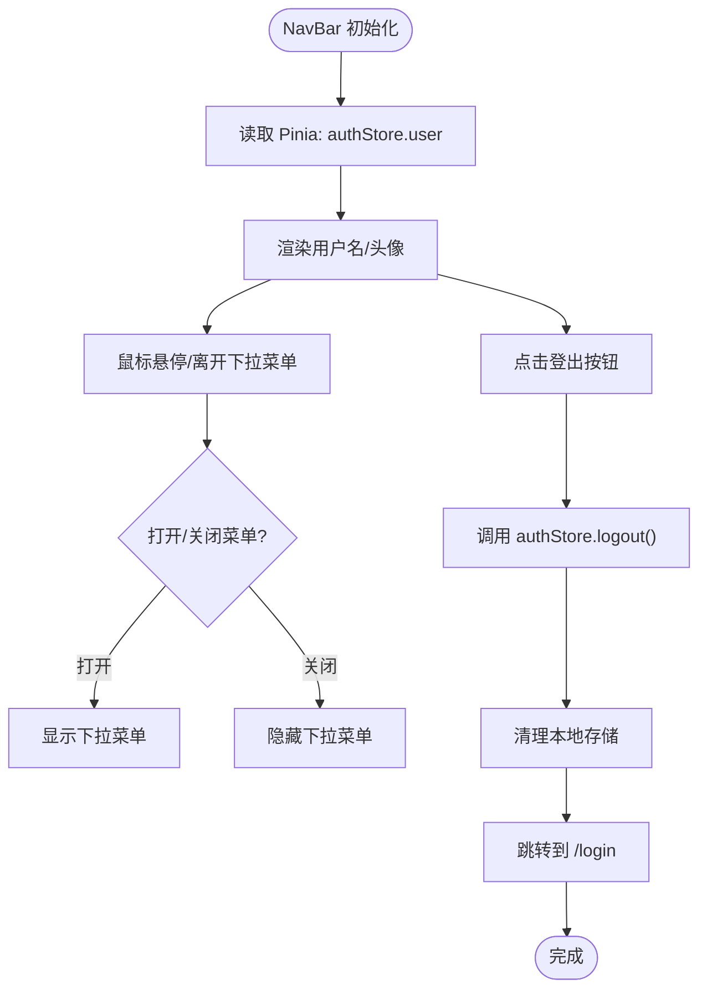
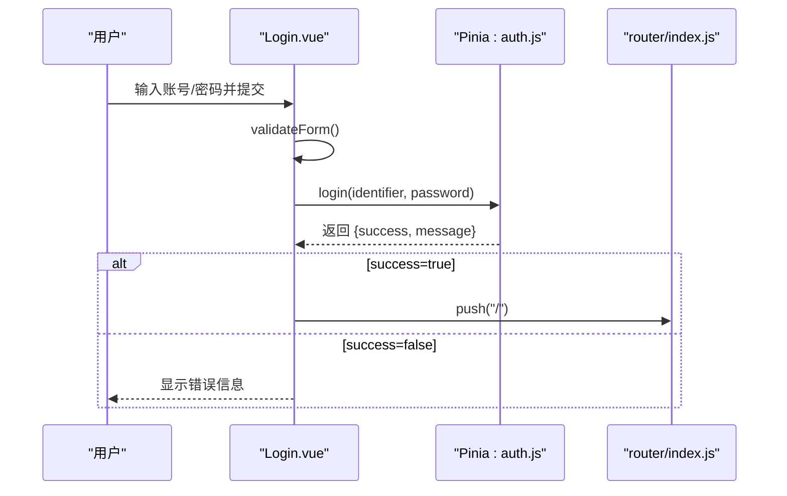
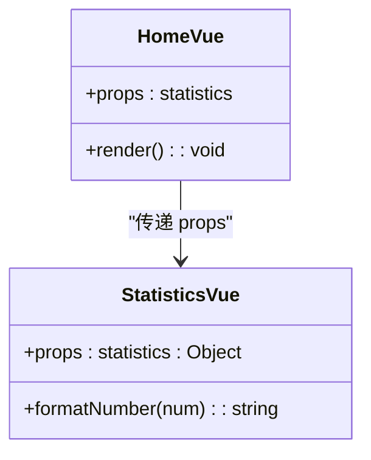
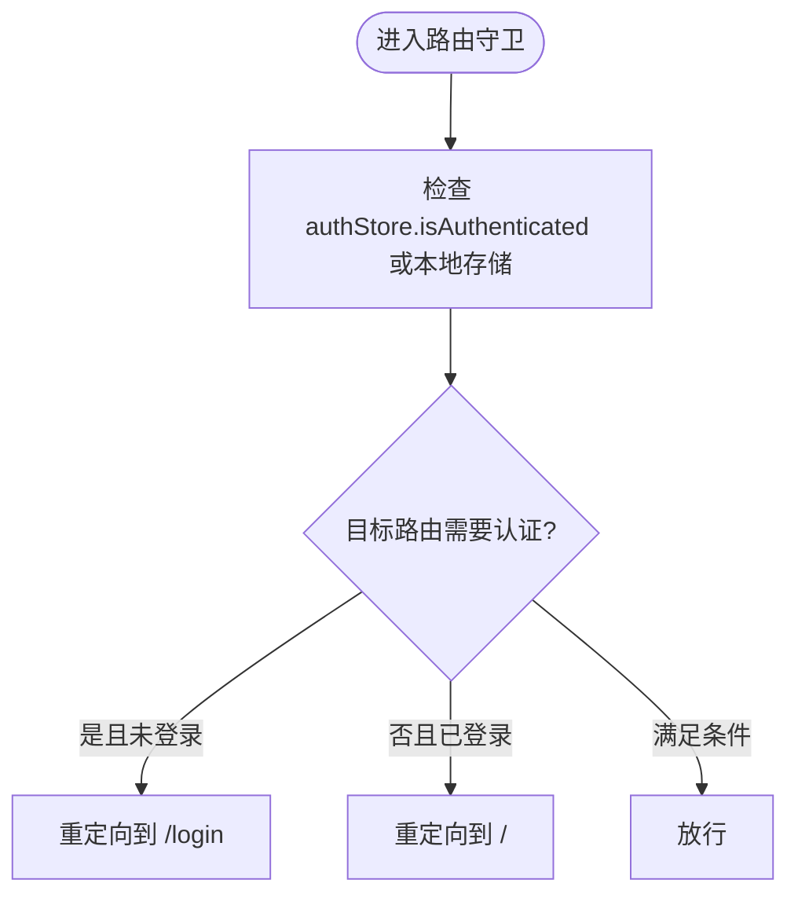
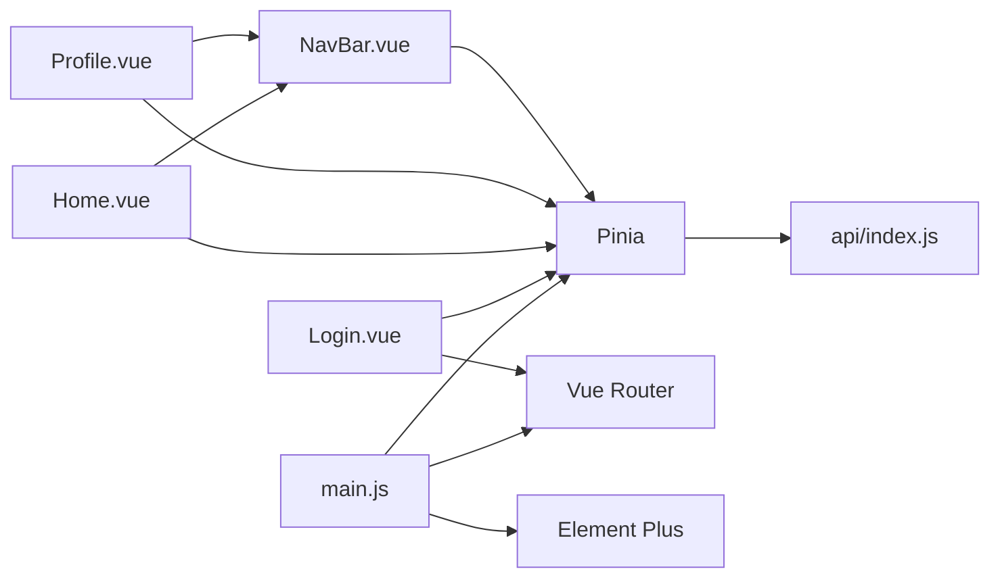

# 组件通信

<cite>
**本文引用的文件**
- [NavBar.vue](file://python-web/src/components/NavBar.vue)
- [auth.js](file://python-web/src/stores/auth.js)
- [App.vue](file://python-web/src/App.vue)
- [main.js](file://python-web/src/main.js)
- [index.js](file://python-web/src/router/index.js)
- [Home.vue](file://python-web/src/views/Home.vue)
- [Profile.vue](file://python-web/src/views/Profile.vue)
- [Login.vue](file://python-web/src/views/Login.vue)
- [Statistics.vue](file://python-web/src/components/Statistics.vue)
- [index.js](file://python-web/src/api/index.js)
- [package.json](file://python-web/package.json)
</cite>

## 目录
1. [简介](#简介)
2. [项目结构](#项目结构)
3. [核心组件](#核心组件)
4. [架构总览](#架构总览)
5. [详细组件分析](#详细组件分析)
6. [依赖关系分析](#依赖关系分析)
7. [性能考量](#性能考量)
8. [故障排查指南](#故障排查指南)
9. [结论](#结论)
10. [附录](#附录)

## 简介
本文件围绕Vue组件通信机制展开，结合项目中的NavBar导航组件与Pinia状态管理，系统阐述父子组件通信（props/emit）、兄弟组件通信（事件总线）、跨级组件通信（provide/inject），以及通过状态管理实现的组件间数据共享（用户态、路由态）。文档同时给出数据流向、事件处理流程、状态提升策略、最佳实践与常见陷阱，帮助具备一定Vue经验的开发者深入理解组件通信。

## 项目结构
该项目采用典型的Vue3 + Vite + Pinia + Vue Router单页应用结构：
- 应用入口在 main.js 中创建应用实例并挂载到DOM
- 路由定义在 router/index.js 中，包含鉴权守卫
- 根组件 App.vue 仅承载路由视图
- 导航组件 NavBar.vue 在多个页面中复用
- 状态管理使用 Pinia，认证状态集中在 stores/auth.js
- API层通过 axios 封装，统一拦截器处理鉴权与刷新

图表来源
- [main.js:1-16](file://python-web/src/main.js#L1-L16)
- [App.vue:1-10](file://python-web/src/App.vue#L1-L10)
- [index.js:1-150](file://python-web/src/router/index.js#L1-L150)
- [NavBar.vue:1-352](file://python-web/src/components/NavBar.vue#L1-L352)
- [auth.js:1-74](file://python-web/src/stores/auth.js#L1-L74)
- [index.js:1-95](file://python-web/src/api/index.js#L1-L95)
- [Login.vue:1-121](file://python-web/src/views/Login.vue#L1-L121)
- [Home.vue:1-1055](file://python-web/src/views/Home.vue#L1-L1055)
- [Profile.vue:1-280](file://python-web/src/views/Profile.vue#L1-L280)

章节来源
- [main.js:1-16](file://python-web/src/main.js#L1-L16)
- [App.vue:1-10](file://python-web/src/App.vue#L1-L10)
- [index.js:1-150](file://python-web/src/router/index.js#L1-L150)

## 核心组件
- 导航组件 NavBar.vue：负责用户头像、用户名展示、下拉菜单、路由跳转与登出逻辑；直接消费 Pinia 认证状态。
- 登录视图 Login.vue：表单校验、调用 Pinia 认证store发起登录，登录成功后跳转首页。
- 首页 Home.vue：展示欢迎语、统计数据、快捷操作等，内部包含 NavBar 组件。
- 个人资料 Profile.vue：展示用户信息、修改密码，内部包含 NavBar 组件。
- 认证状态 stores/auth.js：集中管理用户态（用户信息、令牌、是否已认证）、登录/注册/登出/刷新等方法。
- 路由 router/index.js：定义所有页面路由，设置鉴权守卫，控制访问权限。
- API封装 api/index.js：统一请求头注入、401自动刷新与兜底跳转。

章节来源
- [NavBar.vue:1-352](file://python-web/src/components/NavBar.vue#L1-L352)
- [Login.vue:1-121](file://python-web/src/views/Login.vue#L1-L121)
- [Home.vue:1-1055](file://python-web/src/views/Home.vue#L1-L1055)
- [Profile.vue:1-280](file://python-web/src/views/Profile.vue#L1-L280)
- [auth.js:1-74](file://python-web/src/stores/auth.js#L1-L74)
- [index.js:1-150](file://python-web/src/router/index.js#L1-L150)
- [index.js:1-95](file://python-web/src/api/index.js#L1-L95)

## 架构总览
该应用采用“状态驱动”的组件通信模式：
- 父子通信：NavBar 作为子组件被多个页面复用，页面向 NavBar 传递用户态（通过 Pinia store），NavBar 内部读取并渲染。
- 兄弟通信：页面之间通过路由跳转实现“兄弟”级切换，无需额外事件总线。
- 跨级通信：NavBar 与各页面通过 Pinia store 实现跨级共享状态，避免层层 props 下传。
- 路由状态同步：路由守卫根据认证状态决定放行或重定向，确保导航与路由状态一致。

图表来源
- [Login.vue:100-119](file://python-web/src/views/Login.vue#L100-L119)
- [auth.js:30-41](file://python-web/src/stores/auth.js#L30-L41)
- [index.js:134-147](file://python-web/src/router/index.js#L134-L147)
- [Home.vue:3,270-275](file://python-web/src/views/Home.vue#L3,L270-L275)
- [NavBar.vue:67-78,87,91](file://python-web/src/components/NavBar.vue#L67-L78,L87,L91)

## 详细组件分析

### 导航组件 NavBar 的组件通信与状态管理
- 父子通信：NavBar 作为子组件被 Home.vue、Profile.vue 等页面引入，页面通过 Pinia store 提供用户态，NavBar 直接读取并渲染。
- 跨级通信：NavBar 与各页面通过 Pinia store 实现跨级共享，无需层层 props。
- 事件处理：NavBar 内部处理鼠标进入/离开下拉菜单、点击登出等交互事件；登出时调用 Pinia store 的 logout 方法并跳转登录页。
- 路由状态同步：NavBar 基于当前路由计算激活状态，用于高亮导航项。

图表来源
- [NavBar.vue:84-121](file://python-web/src/components/NavBar.vue#L84-L121)
- [auth.js:43-51](file://python-web/src/stores/auth.js#L43-L51)
- [index.js:134-147](file://python-web/src/router/index.js#L134-L147)

章节来源
- [NavBar.vue:1-352](file://python-web/src/components/NavBar.vue#L1-L352)
- [auth.js:1-74](file://python-web/src/stores/auth.js#L1-L74)
- [index.js:134-147](file://python-web/src/router/index.js#L134-L147)

### 登录视图 Login 与认证状态的联动
- 表单校验：Login.vue 对账号/密码进行前端校验，避免无效请求。
- 调用 Pinia：登录成功后，Login.vue 通过 Pinia store 设置用户态并持久化到本地存储。
- 路由跳转：登录成功后，Login.vue 使用路由跳转至首页。
- 错误处理：捕获异常并显示错误信息。

图表来源
- [Login.vue:82-98](file://python-web/src/views/Login.vue#L82-L98)
- [Login.vue:100-119](file://python-web/src/views/Login.vue#L100-L119)
- [auth.js:30-41](file://python-web/src/stores/auth.js#L30-L41)

章节来源
- [Login.vue:1-121](file://python-web/src/views/Login.vue#L1-L121)
- [auth.js:1-74](file://python-web/src/stores/auth.js#L1-L74)

### 首页 Home 与统计组件 Statistics 的父子通信
- 父子通信：Home.vue 作为父组件，向子组件 Statistics.vue 传递统计对象 props，子组件负责渲染。
- 数据格式：Statistics.vue 接收对象类型 props，包含 total、average_age、average_grade、highest_grade、lowest_grade 等字段。
- 渲染策略：子组件内部对数值进行格式化处理，缺失值以占位符显示。

图表来源
- [Home.vue:1-1055](file://python-web/src/views/Home.vue#L1-L1055)
- [Statistics.vue:1-38](file://python-web/src/components/Statistics.vue#L1-L38)

章节来源
- [Home.vue:1-1055](file://python-web/src/views/Home.vue#L1-L1055)
- [Statistics.vue:1-38](file://python-web/src/components/Statistics.vue#L1-L38)

### 路由守卫与状态同步
- 鉴权守卫：router/index.js 的 beforeEach 根据 Pinia 认证状态与本地存储判断是否允许访问受保护路由。
- 路由状态：守卫根据目标路由 meta.requiresAuth 决定重定向至登录或首页。
- 与 NavBar 协同：NavBar 依赖认证状态渲染用户信息与登出按钮，路由守卫保证 NavBar 所见状态与路由一致。

图表来源
- [index.js:134-147](file://python-web/src/router/index.js#L134-L147)
- [auth.js:10](file://python-web/src/stores/auth.js#L10)

章节来源
- [index.js:1-150](file://python-web/src/router/index.js#L1-L150)
- [auth.js:1-74](file://python-web/src/stores/auth.js#L1-L74)

## 依赖关系分析
- 应用启动：main.js 注册 Pinia、Vue Router、Element Plus 插件，创建并挂载应用。
- 组件依赖：NavBar 依赖 Vue Router 与 Pinia；Login 依赖 Router 与 Pinia；Home/Profile 依赖 NavBar 与 Pinia。
- 状态依赖：所有页面与组件通过 Pinia 认证 store 获取用户态，避免跨组件传递 props。
- API依赖：api/index.js 提供统一拦截器，自动注入 Authorization 头并处理401刷新。

图表来源
- [main.js:1-16](file://python-web/src/main.js#L1-L16)
- [Login.vue:67-72](file://python-web/src/views/Login.vue#L67-L72)
- [Home.vue:270-275](file://python-web/src/views/Home.vue#L270-L275)
- [Profile.vue:147-149](file://python-web/src/views/Profile.vue#L147-L149)
- [NavBar.vue:84-91](file://python-web/src/components/NavBar.vue#L84-L91)
- [index.js:1-95](file://python-web/src/api/index.js#L1-L95)

章节来源
- [main.js:1-16](file://python-web/src/main.js#L1-L16)
- [package.json:11-17](file://python-web/package.json#L11-L17)

## 性能考量
- 状态粒度：Pinia store 将用户态与令牌集中管理，减少重复请求与跨组件传递成本。
- 计算属性：NavBar 与 Home 中大量使用 computed，基于响应式数据派生状态，避免不必要的重渲染。
- 懒加载路由：路由组件按需动态导入，降低首屏体积。
- 本地存储：认证令牌与用户信息持久化到 localStorage，减少重复登录开销。
- 图标与样式：Element Plus 与 scoped 样式减少全局污染，提升渲染效率。

## 故障排查指南
- 登录失败：检查 Login.vue 表单校验与错误提示；确认 auth.js 的 login 返回值；查看 api/index.js 的拦截器是否正确处理401。
- 无法访问受保护页面：检查 router/index.js 的鉴权守卫逻辑与 authStore.isAuthenticated。
- 登出后仍显示用户信息：确认 NavBar 读取的是 Pinia store 的 user 字段；检查 authStore.clearAuth 是否清除了本地存储。
- 401自动刷新失败：检查 api/index.js 的刷新逻辑与本地存储键名；确认刷新接口返回成功后再重试原请求。
- 路由跳转异常：确认 router.push 的路径与路由表一致；检查 beforeEach 守卫的条件分支。

章节来源
- [Login.vue:100-119](file://python-web/src/views/Login.vue#L100-L119)
- [auth.js:30-51](file://python-web/src/stores/auth.js#L30-L51)
- [index.js:134-147](file://python-web/src/router/index.js#L134-L147)
- [index.js:22-59](file://python-web/src/api/index.js#L22-L59)

## 结论
本项目通过 Pinia 实现跨级组件通信与状态共享，结合 Vue Router 的鉴权守卫，形成清晰的数据流与事件流。NavBar 作为导航中枢，通过 Pinia 读取用户态并驱动 UI 更新；登录视图与页面视图通过 Pinia 与路由协同，实现用户态与路由态的同步。该模式降低了组件间的耦合度，提升了可维护性与可扩展性。

## 附录
- 最佳实践
  - 优先使用 Pinia 管理跨级共享状态，避免层层 props。
  - 在组件内使用 computed 派生状态，减少重复计算。
  - 使用路由守卫统一处理鉴权，保持导航与状态一致。
  - 对敏感操作（如登出）先更新状态再跳转，避免闪烁。
- 常见陷阱
  - 忘记在 Pinia store 中持久化令牌，导致刷新后状态丢失。
  - 在组件内直接读取 localStorage，应统一通过 store 管理。
  - 忽略 401 自动刷新的边界情况，导致死循环或无响应。
  - 在多处重复设置相同的路由守卫逻辑，应集中管理。