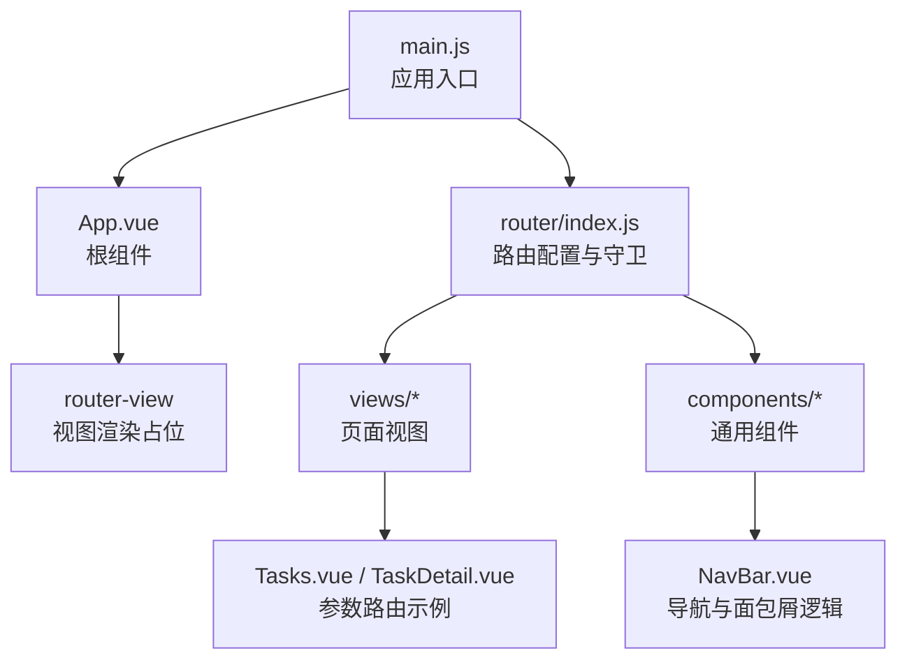
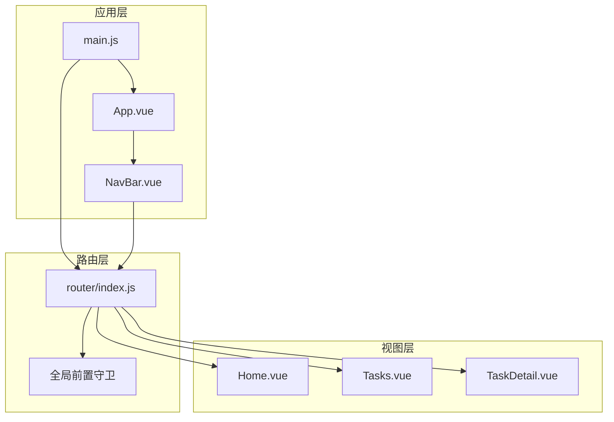
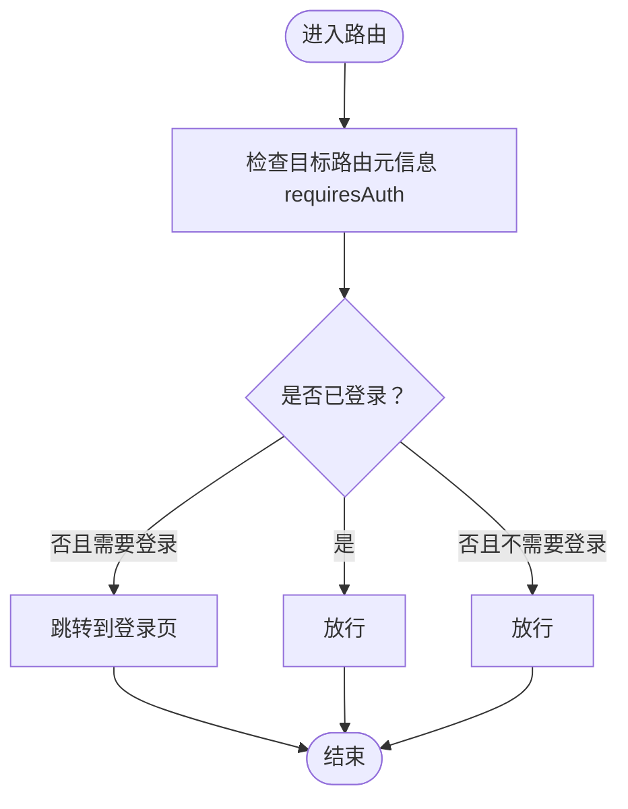
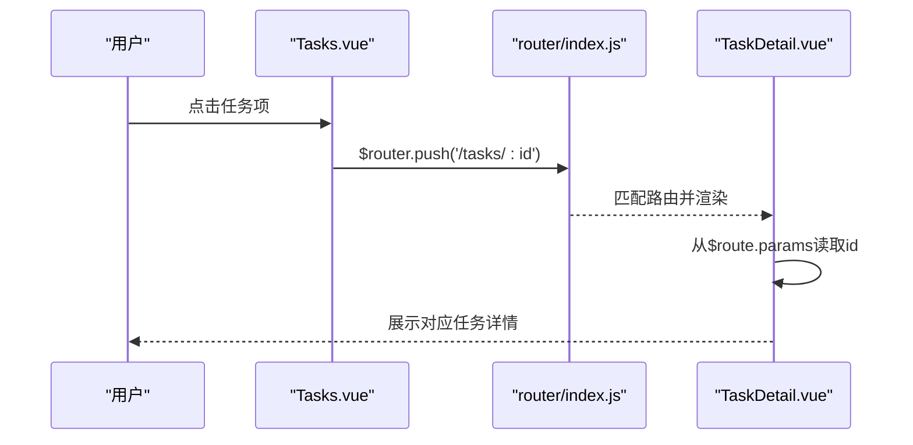
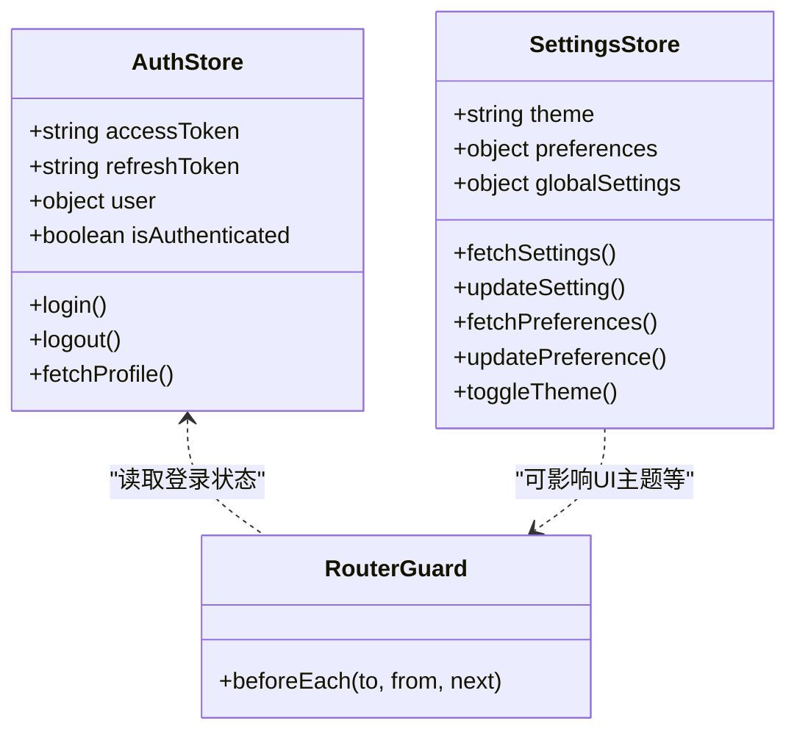
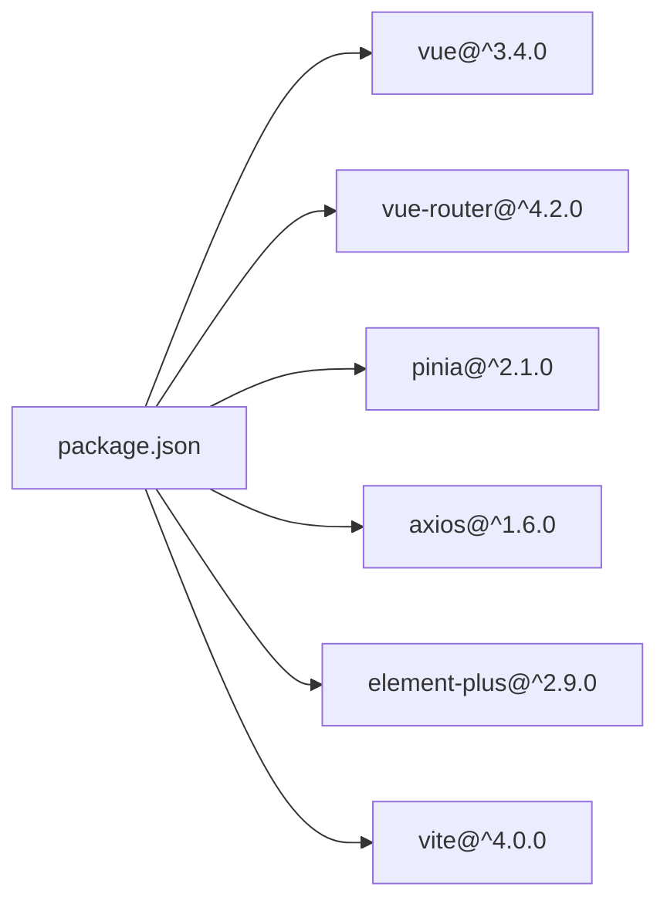

# 路由管理

<cite>
**本文引用的文件**
- [router/index.js](file://python-web/src/router/index.js)
- [main.js](file://python-web/src/main.js)
- [App.vue](file://python-web/src/App.vue)
- [NavBar.vue](file://python-web/src/components/NavBar.vue)
- [Home.vue](file://python-web/src/views/Home.vue)
- [Tasks.vue](file://python-web/src/views/Tasks.vue)
- [TaskDetail.vue](file://python-web/src/views/TaskDetail.vue)
- [auth.js](file://python-web/src/stores/auth.js)
- [settings.js](file://python-web/src/stores/settings.js)
- [index.js](file://python-web/src/api/index.js)
- [package.json](file://python-web/package.json)
- [vite.config.js](file://python-web/vite.config.js)
</cite>

## 目录
1. [简介](#简介)
2. [项目结构](#项目结构)
3. [核心组件](#核心组件)
4. [架构总览](#架构总览)
5. [详细组件分析](#详细组件分析)
6. [依赖分析](#依赖分析)
7. [性能考虑](#性能考虑)
8. [故障排查指南](#故障排查指南)
9. [结论](#结论)
10. [附录](#附录)

## 简介
本文件面向Vue路由开发人员，系统化梳理该前端项目的路由配置与实践，覆盖以下主题：
- 路由配置结构与懒加载
- 导航守卫与权限控制
- 动态路由与路由参数传递
- 嵌套路由与面包屑导航思路
- 路由状态管理与UI联动
- 路由动画与SEO、历史模式部署注意事项
- 性能优化与最佳实践

## 项目结构
该项目采用基于文件系统的路由组织方式，路由定义集中在路由器入口文件中，配合应用挂载、导航栏与视图组件协同工作。

图表来源
- [main.js:1-16](file://python-web/src/main.js#L1-L16)
- [router/index.js:1-150](file://python-web/src/router/index.js#L1-L150)
- [App.vue:1-10](file://python-web/src/App.vue#L1-L10)
- [NavBar.vue:1-352](file://python-web/src/components/NavBar.vue#L1-L352)
- [Tasks.vue:1-200](file://python-web/src/views/Tasks.vue#L1-L200)
- [TaskDetail.vue:1-200](file://python-web/src/views/TaskDetail.vue#L1-L200)

章节来源
- [main.js:1-16](file://python-web/src/main.js#L1-L16)
- [router/index.js:1-150](file://python-web/src/router/index.js#L1-L150)
- [App.vue:1-10](file://python-web/src/App.vue#L1-L10)

## 核心组件
- 路由器与路由表：集中定义所有静态路由，使用函数式组件导入实现懒加载；在全局前置守卫中进行权限校验。
- 应用入口：注册路由、状态管理与UI库，完成应用挂载。
- 根组件：通过router-view承载当前路由视图。
- 导航栏组件：提供导航链接、下拉菜单与用户操作，并根据当前路由路径计算激活状态（为面包屑导航提供思路）。
- 视图组件：展示业务页面，使用$router/$route与参数路由交互。

章节来源
- [router/index.js:1-150](file://python-web/src/router/index.js#L1-L150)
- [main.js:1-16](file://python-web/src/main.js#L1-L16)
- [App.vue:1-10](file://python-web/src/App.vue#L1-L10)
- [NavBar.vue:1-352](file://python-web/src/components/NavBar.vue#L1-L352)

## 架构总览
整体架构围绕“路由驱动视图”的模式展开：路由表定义页面映射，守卫统一处理鉴权，导航栏与视图组件通过$router/$route与路由系统解耦协作。

图表来源
- [main.js:1-16](file://python-web/src/main.js#L1-L16)
- [router/index.js:1-150](file://python-web/src/router/index.js#L1-L150)
- [App.vue:1-10](file://python-web/src/App.vue#L1-L10)
- [NavBar.vue:1-352](file://python-web/src/components/NavBar.vue#L1-L352)
- [Home.vue:1-1055](file://python-web/src/views/Home.vue#L1-L1055)
- [Tasks.vue:1-200](file://python-web/src/views/Tasks.vue#L1-L200)
- [TaskDetail.vue:1-200](file://python-web/src/views/TaskDetail.vue#L1-L200)

## 详细组件分析

### 路由配置与懒加载
- 路由表集中定义于路由器入口，每个路由通过函数式导入实现按需加载，降低首屏体积。
- 路由元信息meta包含requiresAuth字段，用于全局守卫判断是否需要登录。
- 使用history模式，结合服务端正确配置可支持历史模式部署。

章节来源
- [router/index.js:4-127](file://python-web/src/router/index.js#L4-L127)
- [router/index.js:129-132](file://python-web/src/router/index.js#L129-L132)

### 全局导航守卫与权限控制
- 在全局前置守卫中读取认证状态，若目标路由要求登录且未登录则跳转登录页；若已登录访问登录/注册页则重定向至首页；否则放行。
- 认证状态来源于Pinia Store与本地存储，确保页面刷新后仍可维持会话状态。

图表来源
- [router/index.js:134-147](file://python-web/src/router/index.js#L134-L147)
- [auth.js:1-74](file://python-web/src/stores/auth.js#L1-L74)

章节来源
- [router/index.js:134-147](file://python-web/src/router/index.js#L134-L147)
- [auth.js:1-74](file://python-web/src/stores/auth.js#L1-L74)

### 动态路由与参数传递
- 定义了带参数的路由（如任务详情、版本列表），在视图组件中通过$route.params读取参数值，实现动态内容渲染。
- 视图组件内部通过$router.push携带参数或返回上一页，体现参数路由的典型用法。

图表来源
- [Tasks.vue:78](file://python-web/src/views/Tasks.vue#L78)
- [TaskDetail.vue:179-196](file://python-web/src/views/TaskDetail.vue#L179-L196)
- [router/index.js:50-60](file://python-web/src/router/index.js#L50-L60)

章节来源
- [Tasks.vue:78](file://python-web/src/views/Tasks.vue#L78)
- [TaskDetail.vue:179-196](file://python-web/src/views/TaskDetail.vue#L179-L196)
- [router/index.js:50-60](file://python-web/src/router/index.js#L50-L60)

### 嵌套路由与子路由
- 当前路由表未显式声明嵌套路由结构（如children）。若需实现嵌套路由，可在某父级路由下添加children数组，子路由将作为其子视图渲染。
- 若存在嵌套场景，建议在父级路由设置router-view以承载子视图。

章节来源
- [router/index.js:1-150](file://python-web/src/router/index.js#L1-L150)

### 面包屑导航思路
- 导航栏组件通过计算当前路由路径，判断各导航分组的激活状态，为面包屑导航提供思路：可基于当前路由路径逐级解析父级路由名称与链接，动态生成面包屑。
- 该思路不直接绑定具体代码，仅提供实现建议。

章节来源
- [NavBar.vue:96-99](file://python-web/src/components/NavBar.vue#L96-L99)

### 路由状态管理与UI联动
- 认证状态通过Pinia Store维护，同时持久化到localStorage，保证刷新后仍可识别登录状态。
- 设置存储支持主题切换与偏好设置，可与路由状态联动（例如根据主题调整导航样式）。

图表来源
- [auth.js:1-74](file://python-web/src/stores/auth.js#L1-L74)
- [settings.js:1-59](file://python-web/src/stores/settings.js#L1-L59)
- [router/index.js:134-147](file://python-web/src/router/index.js#L134-L147)

章节来源
- [auth.js:1-74](file://python-web/src/stores/auth.js#L1-L74)
- [settings.js:1-59](file://python-web/src/stores/settings.js#L1-L59)
- [router/index.js:134-147](file://python-web/src/router/index.js#L134-L147)

### 路由动画效果
- 项目未内置路由过渡动画。可在router-view外层包裹transition组件并配置mode与类名，实现页面切换动画。
- 示例思路：为不同页面或模块配置不同的进入/离开动画，提升用户体验。

章节来源
- [App.vue:1-10](file://python-web/src/App.vue#L1-L10)

### SEO友好配置与历史模式部署
- 路由使用history模式，需在生产环境服务器正确配置，使所有前端路由均回退到index.html，避免404。
- SEO方面可结合服务端渲染或预渲染策略，但当前仓库未包含相关实现。

章节来源
- [router/index.js:129-132](file://python-web/src/router/index.js#L129-L132)
- [vite.config.js:1-11](file://python-web/vite.config.js#L1-L11)

## 依赖分析
- 运行时依赖：Vue 3、Vue Router 4、Pinia、Element Plus、Axios。
- 构建工具：Vite，提供开发服务器与打包能力。

图表来源
- [package.json:11-22](file://python-web/package.json#L11-L22)

章节来源
- [package.json:1-24](file://python-web/package.json#L1-L24)

## 性能考虑
- 懒加载：通过函数式导入实现按需加载，减少首屏资源体积。
- 路由守卫：尽量避免复杂逻辑，必要时使用异步加载与缓存策略。
- 组件复用：将通用导航与布局抽离为独立组件，减少重复渲染。
- 图片与静态资源：结合构建工具的资源内联与压缩策略，进一步优化加载速度。

章节来源
- [router/index.js:8-127](file://python-web/src/router/index.js#L8-L127)

## 故障排查指南
- 登录状态异常：检查localStorage中的令牌与用户信息是否存在；确认守卫逻辑与Store状态同步。
- 401未授权：检查API拦截器与刷新流程，确保刷新令牌有效且请求头携带正确。
- 历史模式404：确认服务器已将所有路由回退到index.html。

章节来源
- [auth.js:12-28](file://python-web/src/stores/auth.js#L12-L28)
- [index.js:11-59](file://python-web/src/api/index.js#L11-L59)
- [router/index.js:129-132](file://python-web/src/router/index.js#L129-L132)

## 结论
该路由体系以简洁清晰的配置与全局守卫为核心，结合Pinia状态管理与导航组件，实现了良好的权限控制与用户体验。建议后续补充：
- 嵌套路由结构与子视图渲染
- 路由过渡动画与面包屑导航
- SEO与历史模式部署的完整配置
- 动态路由与权限矩阵的扩展

## 附录
- 开发与构建命令：dev、build、preview
- 开发服务器端口：3000

章节来源
- [package.json:6-10](file://python-web/package.json#L6-L10)
- [vite.config.js:6-9](file://python-web/vite.config.js#L6-L9)