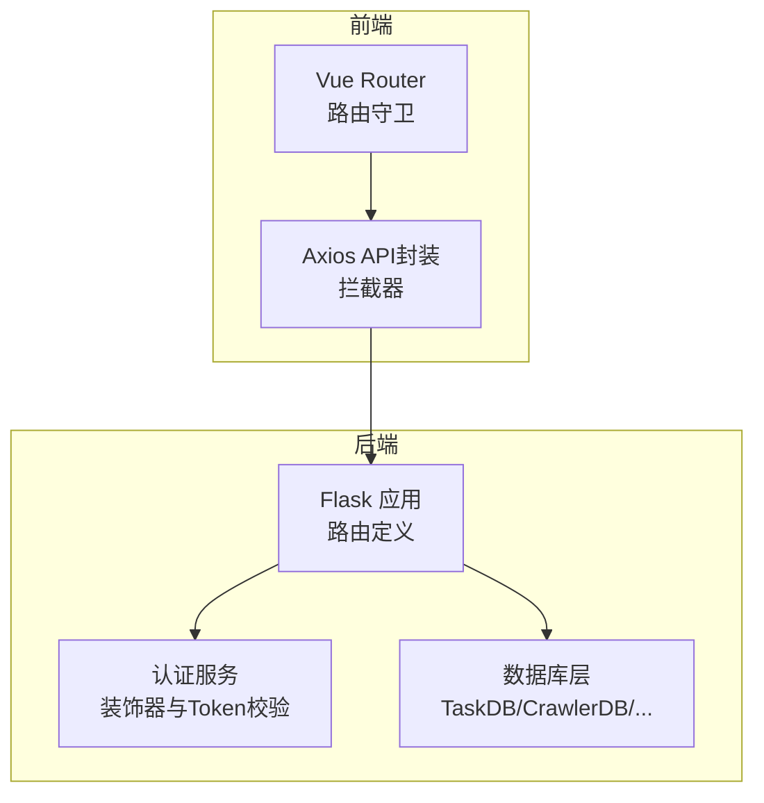
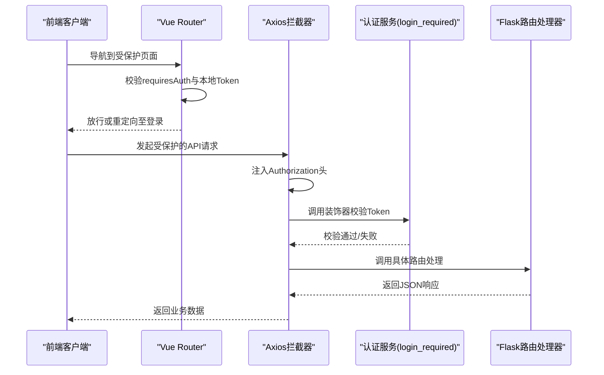
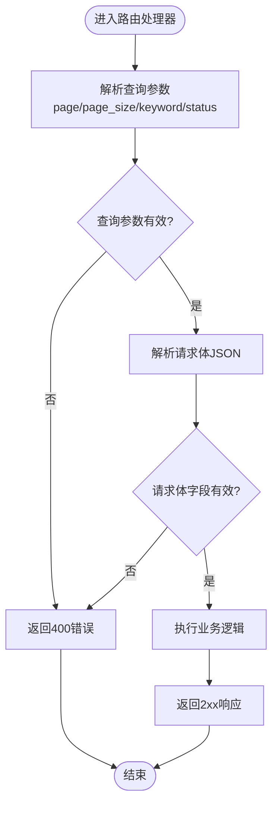
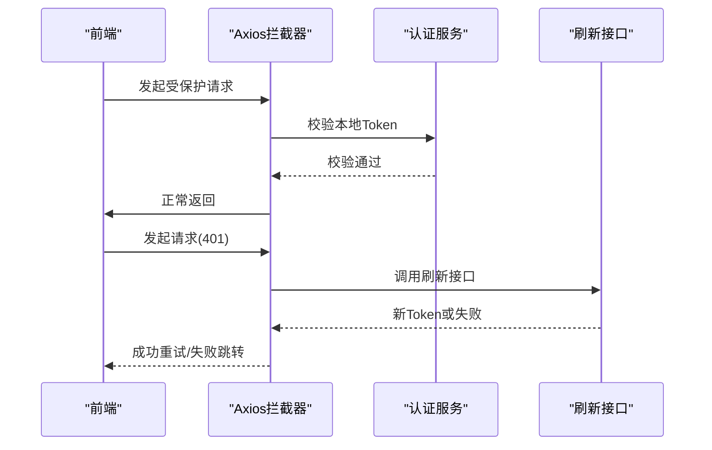
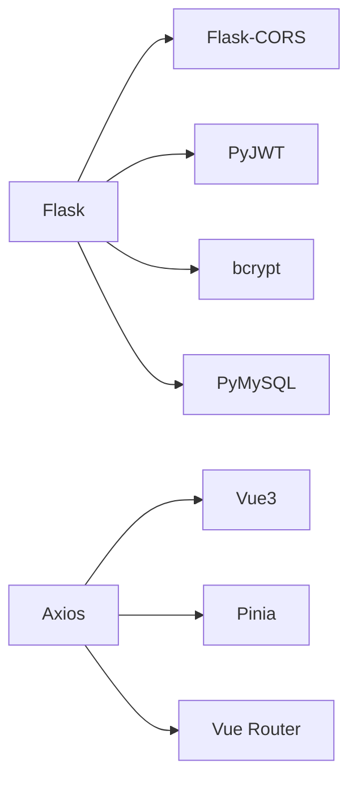

# API路由设计

<cite>
**本文档引用的文件**
- [app.py](file://python/app.py)
- [auth_server.py](file://python/auth_server.py)
- [src/auth_service.py](file://python/src/auth_service.py)
- [src/models.py](file://python/src/models.py)
- [src/student_db.py](file://python/src/student_db.py)
- [task_db.py](file://python/task_db.py)
- [crawler_db.py](file://python/crawler_db.py)
- [python-web/src/router/index.js](file://python-web/src/router/index.js)
- [python-web/src/api/index.js](file://python-web/src/api/index.js)
- [python-web/src/api/task.js](file://python-web/src/api/task.js)
- [python-web/src/api/system.js](file://python-web/src/api/system.js)
- [requirements.txt](file://python/requirements.txt)
- [python-web/package.json](file://python-web/package.json)
</cite>

## 目录
1. [简介](#简介)
2. [项目结构](#项目结构)
3. [核心组件](#核心组件)
4. [架构总览](#架构总览)
5. [详细组件分析](#详细组件分析)
6. [依赖分析](#依赖分析)
7. [性能考虑](#性能考虑)
8. [故障排查指南](#故障排查指南)
9. [结论](#结论)
10. [附录](#附录)

## 简介
本文件面向开发者，系统化梳理该Python项目的API路由设计实践，涵盖RESTful设计原则、HTTP方法使用、URL命名约定、路由参数与查询参数处理、请求体验证、错误响应格式与状态码使用、API版本管理建议、路由中间件与权限控制、请求限流策略等主题。文档同时结合现有代码实现，给出可操作的设计规范与最佳实践。

## 项目结构
该项目采用前后端分离架构：后端基于Flask提供REST API，前端使用Vue3+Element Plus构建，通过Axios统一发起HTTP请求，并在拦截器中处理鉴权与刷新逻辑。后端路由集中在app.py与auth_server.py中定义，业务模块通过db层进行数据持久化。

**图表来源**
- [app.py:1-1719](file://python/app.py#L1-L1719)
- [auth_server.py:1-431](file://python/auth_server.py#L1-L431)
- [src/auth_service.py:1-187](file://python/src/auth_service.py#L1-L187)
- [task_db.py:1-533](file://python/task_db.py#L1-L533)
- [crawler_db.py:1-238](file://python/crawler_db.py#L1-L238)
- [python-web/src/router/index.js:1-150](file://python-web/src/router/index.js#L1-L150)
- [python-web/src/api/index.js:1-95](file://python-web/src/api/index.js#L1-L95)

**章节来源**
- [app.py:1-1719](file://python/app.py#L1-L1719)
- [auth_server.py:1-431](file://python/auth_server.py#L1-L431)
- [python-web/src/router/index.js:1-150](file://python-web/src/router/index.js#L1-L150)
- [python-web/src/api/index.js:1-95](file://python-web/src/api/index.js#L1-L95)

## 核心组件
- Flask后端路由：集中于app.py与auth_server.py，覆盖认证、用户资料、爬虫任务、数据管理等模块。
- 认证服务：提供Token生成、刷新、黑名单校验、登录装饰器等能力，统一处理权限控制。
- 数据库层：TaskDB、CrawlerDB等负责SQL建表、查询、分页、导入导出等。
- 前端路由与API封装：Vue Router实现页面级鉴权守卫；Axios拦截器统一注入Authorization头、处理401自动刷新与跳转。

**章节来源**
- [app.py:53-966](file://python/app.py#L53-L966)
- [auth_server.py:47-424](file://python/auth_server.py#L47-L424)
- [src/auth_service.py:9-187](file://python/src/auth_service.py#L9-L187)
- [task_db.py:7-533](file://python/task_db.py#L7-L533)
- [crawler_db.py:6-238](file://python/crawler_db.py#L6-L238)
- [python-web/src/router/index.js:129-147](file://python-web/src/router/index.js#L129-L147)
- [python-web/src/api/index.js:11-59](file://python-web/src/api/index.js#L11-L59)

## 架构总览
后端路由遵循RESTful风格，资源路径采用名词复数形式，动词通过HTTP方法体现。认证采用Bearer Token，通过装饰器实现全局登录校验。前端通过Axios拦截器自动携带Token并在401时触发刷新流程。

**图表来源**
- [python-web/src/router/index.js:134-147](file://python-web/src/router/index.js#L134-L147)
- [python-web/src/api/index.js:11-59](file://python-web/src/api/index.js#L11-L59)
- [src/auth_service.py:158-183](file://python/src/auth_service.py#L158-L183)
- [app.py:53-966](file://python/app.py#L53-L966)

## 详细组件分析

### RESTful设计原则与HTTP方法使用
- 资源命名：使用名词复数（如/tasks、/tasks/templates、/crawler/data），体现资源导向。
- 方法映射：
  - GET：查询列表/详情（如任务列表、模板详情、数据分页查询）
  - POST：创建/启动（如创建任务、启动任务、发送验证码）
  - PUT：更新（如更新任务）
  - DELETE：删除（如删除任务、清空爬虫数据）
- 动作扩展：通过子路径表达动作（如/tasks/{id}/start、/tasks/{id}/stop、/tasks/{id}/versions/rollback）

**章节来源**
- [app.py:475-966](file://python/app.py#L475-L966)
- [task_db.py:123-282](file://python/task_db.py#L123-L282)
- [crawler_db.py:141-201](file://python/crawler_db.py#L141-L201)

### URL命名约定
- 统一前缀：/api，便于区分静态资源与API。
- 层级清晰：按功能域划分（/auth、/user、/tasks、/crawler、/system）。
- 子资源：通过层级表达关联关系（/tasks/{id}/versions）。
- 查询参数：使用语义化参数名（page、page_size、keyword、status）。

**章节来源**
- [app.py:18-28](file://python/app.py#L18-L28)
- [app.py:475-966](file://python/app.py#L475-L966)
- [task_db.py:123-164](file://python/task_db.py#L123-L164)
- [crawler_db.py:141-179](file://python/crawler_db.py#L141-L179)

### 路由参数处理与查询参数解析
- 路径参数：通过Flask路由变量捕获（如/tasks/<task_id>），在处理器中读取并校验。
- 查询参数：通过request.args获取（如page、page_size、keyword），并做边界校验与默认值处理。
- 请求体解析：通过request.get_json()获取JSON负载，逐字段校验必填与格式。

**图表来源**
- [app.py:382-410](file://python/app.py#L382-L410)
- [app.py:513-550](file://python/app.py#L513-L550)
- [app.py:553-622](file://python/app.py#L553-L622)

**章节来源**
- [app.py:382-410](file://python/app.py#L382-L410)
- [app.py:513-550](file://python/app.py#L513-L550)
- [app.py:553-622](file://python/app.py#L553-L622)

### 请求体验证与错误响应格式
- 统一响应结构：success、message、code、data/error字段，便于前端统一处理。
- 错误码规范：使用业务含义明确的字符串标识（如INVALID_USERNAME、MISSING_PARAMS、USER_NOT_FOUND）。
- 状态码映射：200/201/400/401/404/500，与业务结果一致。
- 典型校验点：必填字段、长度限制、格式校验（邮箱/手机号）、范围约束（页码/页大小）。

**章节来源**
- [app.py:54-96](file://python/app.py#L54-L96)
- [app.py:100-123](file://python/app.py#L100-L123)
- [app.py:170-239](file://python/app.py#L170-L239)
- [app.py:306-351](file://python/app.py#L306-L351)

### 权限控制与中间件
- 登录装饰器：auth_service.login_required从Authorization头解析Bearer Token，解码并校验黑名单，将用户信息注入request对象。
- 页面级守卫：Vue Router在导航时检查本地存储中的Token与用户信息，未登录重定向至登录页。
- 响应拦截器：Axios在收到401时尝试刷新Token，失败则清除本地存储并跳转登录。

**图表来源**
- [src/auth_service.py:158-183](file://python/src/auth_service.py#L158-L183)
- [python-web/src/router/index.js:134-147](file://python-web/src/router/index.js#L134-L147)
- [python-web/src/api/index.js:22-59](file://python-web/src/api/index.js#L22-L59)

**章节来源**
- [src/auth_service.py:158-183](file://python/src/auth_service.py#L158-L183)
- [python-web/src/router/index.js:134-147](file://python-web/src/router/index.js#L134-L147)
- [python-web/src/api/index.js:22-59](file://python-web/src/api/index.js#L22-L59)

### API版本管理建议
- 当前未见显式版本前缀（如/v1），建议在路由前增加版本号（/api/v1/...），以便未来演进。
- 版本策略：向后兼容优先，新增端点不破坏旧接口；废弃接口保留过渡期并标注弃用。

（本节为通用建议，无需特定文件来源）

### 请求限流策略
- 当前未见内置限流中间件或速率限制逻辑。
- 建议方案：在Flask层使用第三方扩展（如Flask-Limiter）或在网关层实现；针对敏感接口（登录、验证码）设置更严格阈值。

（本节为通用建议，无需特定文件来源）

## 依赖分析
后端依赖主要来自Flask生态与数据库驱动，前端依赖Vue3与Axios。路由与拦截器形成稳定的请求链路。

**图表来源**
- [requirements.txt:1-14](file://python/requirements.txt#L1-L14)
- [python-web/package.json:11-17](file://python-web/package.json#L11-L17)

**章节来源**
- [requirements.txt:1-14](file://python/requirements.txt#L1-L14)
- [python-web/package.json:11-17](file://python-web/package.json#L11-L17)

## 性能考虑
- 数据库索引：任务表按status、user_id、name建立索引，有利于分页与过滤。
- SQL参数化：使用参数化查询避免注入风险，提升安全性。
- 分页与边界：前端传入page/page_size需做边界校验，防止过大请求导致性能问题。
- 导出与批量：CSV导出与批量插入需注意内存与事务开销，建议异步处理或分批提交。

**章节来源**
- [task_db.py:68-71](file://python/task_db.py#L68-L71)
- [task_db.py:123-164](file://python/task_db.py#L123-L164)
- [crawler_db.py:141-179](file://python/crawler_db.py#L141-L179)
- [crawler_db.py:96-139](file://python/crawler_db.py#L96-L139)

## 故障排查指南
- 常见错误码定位：
  - INVALID_USERNAME/INVALID_PASSWORD：检查请求体字段与长度限制。
  - MISSING_PARAMS/MISSING_TOKEN：确认前端是否正确传递参数与Authorization头。
  - USER_NOT_FOUND/TASK_NOT_FOUND：确认资源ID是否存在。
  - REGISTER_FAILED/LOGIN_FAILED：查看后端异常栈与数据库连接状态。
- 前端401处理：若刷新失败，拦截器会清除本地Token并跳转登录页，需检查刷新接口可用性与Token有效性。
- 跨域问题：确认CORS配置允许的origin/methods/headers与实际请求一致。

**章节来源**
- [app.py:54-96](file://python/app.py#L54-L96)
- [app.py:100-123](file://python/app.py#L100-L123)
- [python-web/src/api/index.js:22-59](file://python-web/src/api/index.js#L22-L59)

## 结论
该代码库在API设计上体现了良好的RESTful实践：资源命名清晰、HTTP方法语义明确、统一的响应结构与错误码、完善的权限控制与前端拦截器配合。建议后续引入版本化路由、速率限制与更细粒度的鉴权策略，以进一步提升系统的可维护性与安全性。

## 附录

### API端点概览（节选）
- 认证相关
  - POST /api/auth/register
  - POST /api/auth/login
  - POST /api/auth/refresh
  - POST /api/auth/logout
  - POST /api/auth/forgot-password/send-code
  - POST /api/auth/forgot-password/verify-code
  - POST /api/auth/forgot-password/reset
  - POST /api/auth/change-password
  - GET /api/user/profile
- 爬虫任务
  - GET /api/tasks
  - POST /api/tasks
  - GET /api/tasks/<task_id>
  - PUT /api/tasks/<task_id>
  - DELETE /api/tasks/<task_id>
  - POST /api/tasks/<task_id>/start
  - POST /api/tasks/<task_id>/stop
  - GET /api/tasks/templates
  - POST /api/tasks/templates
  - GET /api/tasks/templates/<template_id>
  - DELETE /api/tasks/templates/<template_id>
  - GET /api/tasks/<task_id>/versions
  - POST /api/tasks/<task_id>/versions/rollback
  - GET /api/tasks/favorites
- 爬虫数据
  - GET /api/crawler/data
  - DELETE /api/crawler/data
  - GET /api/crawler/export
  - GET /api/crawler/status
  - POST /api/crawler/start
  - POST /api/crawler/stop

**章节来源**
- [app.py:53-966](file://python/app.py#L53-L966)