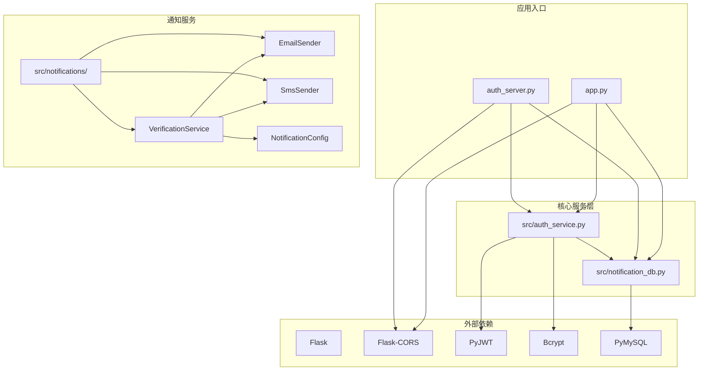
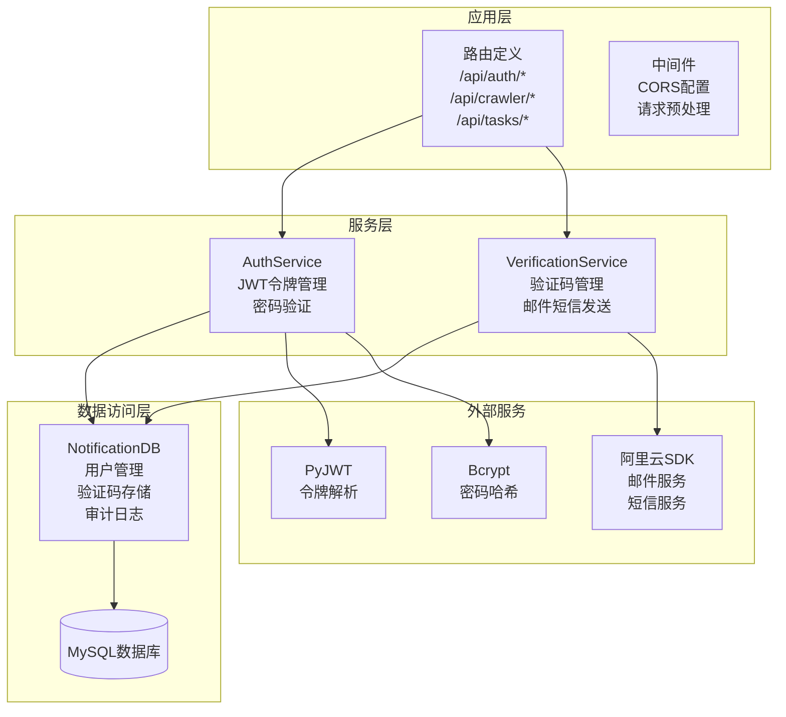
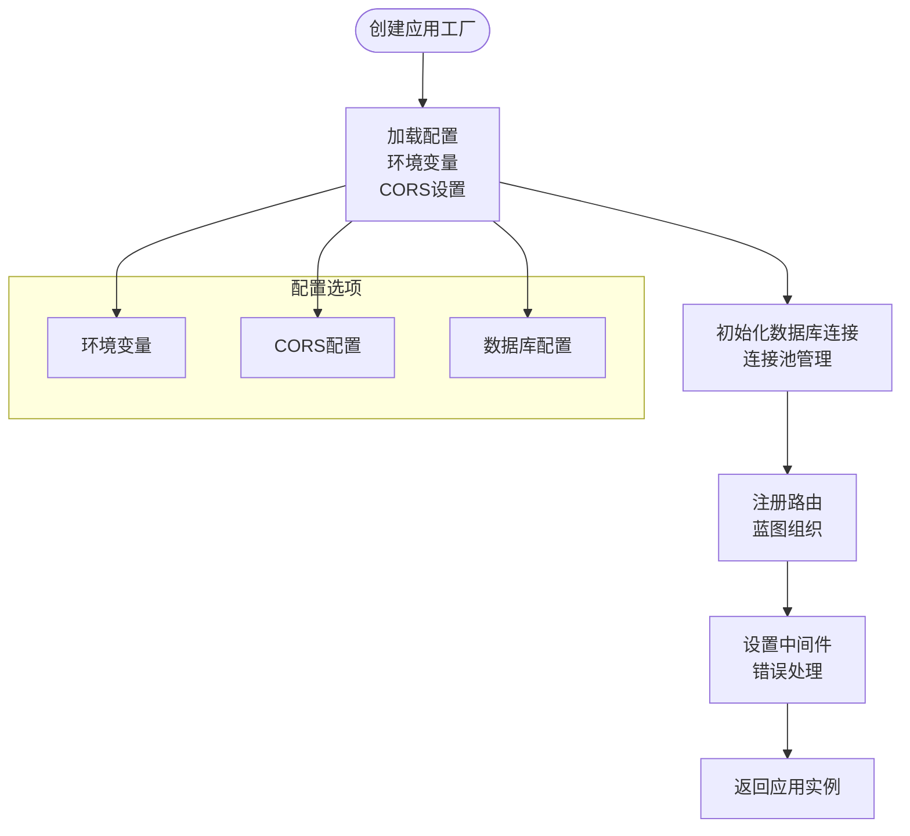
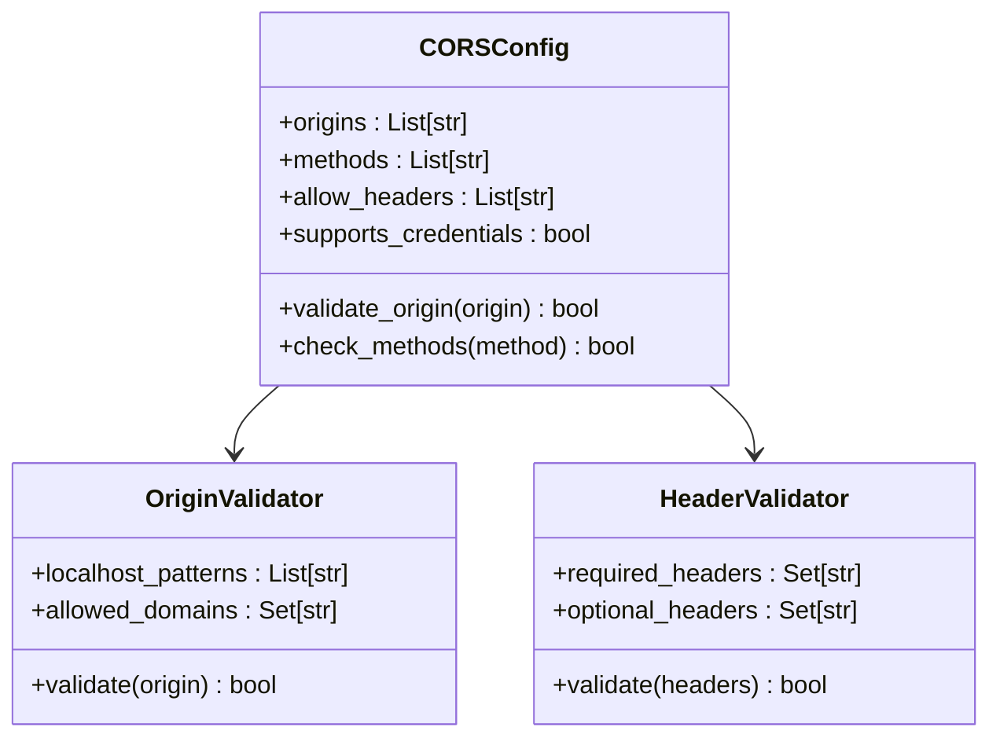
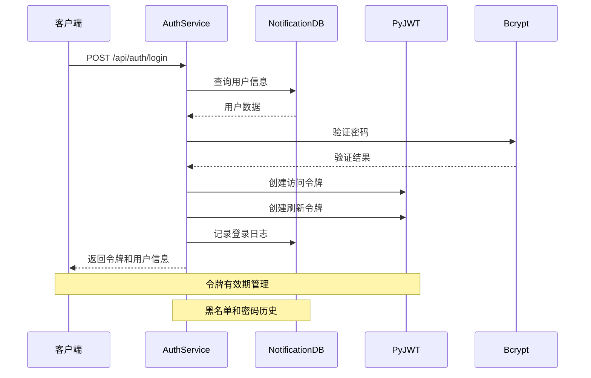
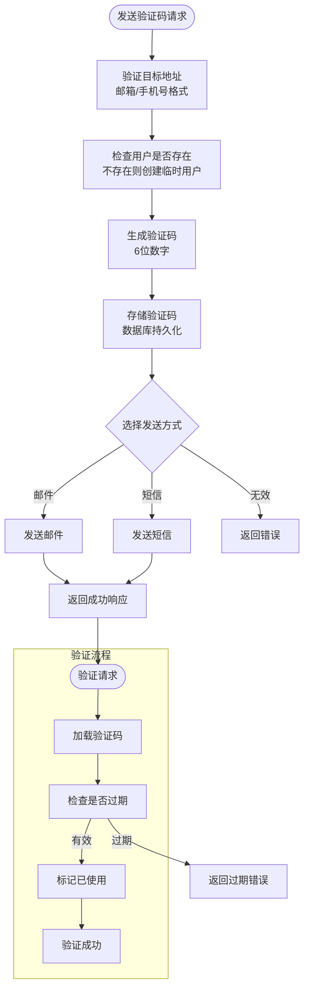
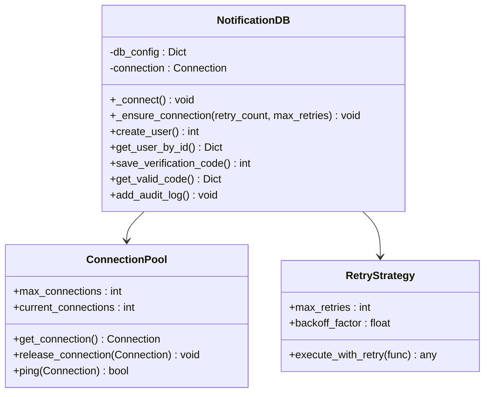
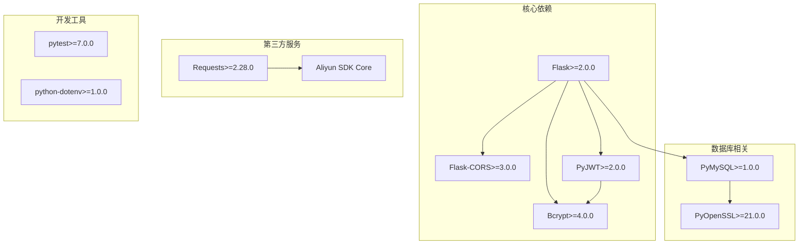

# Flask应用结构

<cite>
**本文档引用的文件**
- [app.py](file://python/app.py)
- [auth_server.py](file://python/auth_server.py)
- [src/auth_service.py](file://python/src/auth_service.py)
- [src/notification_db.py](file://python/src/notification_db.py)
- [src/notifications/__init__.py](file://python/src/notifications/__init__.py)
- [src/notifications/config.py](file://python/src/notifications/config.py)
- [src/notifications/email_sender.py](file://python/src/notifications/email_sender.py)
- [src/notifications/sms_sender.py](file://python/src/notifications/sms_sender.py)
- [src/notifications/verification_service.py](file://python/src/notifications/verification_service.py)
- [requirements.txt](file://python/requirements.txt)
- [start.sh](file://python/start.sh)
- [.gitignore](file://python/.gitignore)
</cite>

## 目录
1. [简介](#简介)
2. [项目结构](#项目结构)
3. [核心组件](#核心组件)
4. [架构总览](#架构总览)
5. [详细组件分析](#详细组件分析)
6. [依赖分析](#依赖分析)
7. [性能考虑](#性能考虑)
8. [故障排除指南](#故障排除指南)
9. [结论](#结论)
10. [附录](#附录)

## 简介
本项目是一个基于Flask的Web应用，采用模块化设计，包含认证系统、通知服务、数据库操作等核心功能。应用采用CORS跨域配置、JWT令牌认证、数据库连接池管理等现代Web开发实践。项目提供了完整的启动脚本、环境变量配置和生产部署建议，适合初学者理解Flask项目的整体架构和最佳实践。

## 项目结构
项目采用清晰的目录组织结构，将业务逻辑、数据模型、工具函数等分离到不同的模块中：



**图表来源**
- [app.py:1-50](file://python/app.py#L1-L50)
- [auth_server.py:1-20](file://python/auth_server.py#L1-L20)
- [src/auth_service.py:1-20](file://python/src/auth_service.py#L1-L20)
- [src/notification_db.py:1-20](file://python/src/notification_db.py#L1-L20)

**章节来源**
- [app.py:1-50](file://python/app.py#L1-L50)
- [auth_server.py:1-20](file://python/auth_server.py#L1-L20)
- [requirements.txt:1-14](file://python/requirements.txt#L1-L14)

## 核心组件
本项目的核心组件包括应用实例、认证服务、通知服务和数据库管理器。每个组件都有明确的职责分工和接口定义。

### 应用实例初始化
应用通过Flask构造函数创建应用实例，并配置CORS跨域策略。CORS配置支持多个前端域名，允许特定的HTTP方法和请求头。

### 认证服务架构
认证服务采用JWT令牌机制，提供密码哈希、令牌生成、令牌验证等功能。服务包含登录限制、黑名单管理、密码历史记录等安全特性。

### 通知服务系统
通知服务支持邮件和短信两种验证方式，通过阿里云SDK实现消息发送。服务包含验证码生成、存储、验证等完整流程。

**章节来源**
- [app.py:18-28](file://python/app.py#L18-L28)
- [src/auth_service.py:9-60](file://python/src/auth_service.py#L9-L60)
- [src/notifications/verification_service.py:7-25](file://python/src/notifications/verification_service.py#L7-L25)

## 架构总览
项目采用分层架构设计，从上到下分别为：应用层、服务层、数据访问层和外部服务层。



**图表来源**
- [app.py:53-100](file://python/app.py#L53-L100)
- [src/auth_service.py:76-118](file://python/src/auth_service.py#L76-L118)
- [src/notifications/verification_service.py:25-81](file://python/src/notifications/verification_service.py#L25-L81)

## 详细组件分析

### 应用工厂模式分析
虽然当前项目直接创建了应用实例，但可以轻松改造为应用工厂模式：



**图表来源**
- [app.py:18-35](file://python/app.py#L18-L35)
- [src/notification_db.py:6-17](file://python/src/notification_db.py#L6-L17)

### CORS配置详解
应用采用灵活的CORS配置策略，支持多域名访问和自定义请求头：



**图表来源**
- [app.py:19-28](file://python/app.py#L19-L28)
- [auth_server.py:10-17](file://python/auth_server.py#L10-L17)

**章节来源**
- [app.py:19-28](file://python/app.py#L19-L28)
- [auth_server.py:10-17](file://python/auth_server.py#L10-L17)

### 认证服务实现
认证服务是整个应用的核心安全组件，实现了完整的JWT令牌生命周期管理：



**图表来源**
- [src/auth_service.py:76-118](file://python/src/auth_service.py#L76-L118)
- [src/notification_db.py:288-295](file://python/src/notification_db.py#L288-L295)

**章节来源**
- [src/auth_service.py:76-183](file://python/src/auth_service.py#L76-L183)
- [src/notification_db.py:288-353](file://python/src/notification_db.py#L288-L353)

### 通知服务架构
通知服务提供了完整的验证码发送和验证流程，支持邮件和短信两种方式：



**图表来源**
- [src/notifications/verification_service.py:25-101](file://python/src/notifications/verification_service.py#L25-L101)
- [src/notifications/email_sender.py:13-62](file://python/src/notifications/email_sender.py#L13-L62)
- [src/notifications/sms_sender.py:14-60](file://python/src/notifications/sms_sender.py#L14-L60)

**章节来源**
- [src/notifications/verification_service.py:25-101](file://python/src/notifications/verification_service.py#L25-L101)
- [src/notifications/email_sender.py:13-62](file://python/src/notifications/email_sender.py#L13-L62)
- [src/notifications/sms_sender.py:14-60](file://python/src/notifications/sms_sender.py#L14-L60)

### 数据库连接管理
数据库采用连接池管理策略，确保高并发场景下的稳定性：



**图表来源**
- [src/notification_db.py:6-40](file://python/src/notification_db.py#L6-L40)
- [src/notification_db.py:19-39](file://python/src/notification_db.py#L19-L39)

**章节来源**
- [src/notification_db.py:6-104](file://python/src/notification_db.py#L6-L104)

## 依赖分析
项目依赖关系清晰，主要依赖包括Web框架、数据库连接、加密库和第三方服务SDK。



**图表来源**
- [requirements.txt:1-14](file://python/requirements.txt#L1-L14)

**章节来源**
- [requirements.txt:1-14](file://python/requirements.txt#L1-L14)

## 性能考虑
项目在性能方面采用了多项优化措施：

### 连接池管理
- 数据库连接采用自动重连机制
- 最大重试次数控制在3次以内
- 连接超时和断线检测

### 缓存策略
- JWT令牌黑名单缓存
- 验证码缓存避免重复发送
- 用户会话状态缓存

### 错误处理
- 统一的异常处理机制
- 详细的错误日志记录
- 友好的错误响应格式

## 故障排除指南
常见问题及解决方案：

### CORS跨域问题
- 检查前端请求域名是否在允许列表中
- 确认请求头是否包含必要的认证信息
- 验证OPTIONS预检请求是否正确处理

### 认证失败
- 检查JWT密钥配置是否正确
- 验证用户密码是否正确
- 确认用户账户状态正常

### 数据库连接问题
- 检查数据库服务是否正常运行
- 验证连接参数配置
- 查看连接池状态和最大连接数

**章节来源**
- [app.py:95-123](file://python/app.py#L95-L123)
- [src/auth_service.py:158-183](file://python/src/auth_service.py#L158-L183)
- [src/notification_db.py:19-39](file://python/src/notification_db.py#L19-L39)

## 结论
本Flask应用项目展现了现代Web应用的最佳实践，包括清晰的架构分层、完善的认证机制、灵活的通知服务和稳健的数据库管理。项目结构易于理解和扩展，适合学习Flask框架的核心概念和实际应用场景。通过遵循项目中的设计模式和最佳实践，开发者可以构建更加健壮和可维护的Web应用。

## 附录

### 启动脚本使用方法
项目提供了完整的启动脚本，支持自动化环境准备和应用启动：

```bash
# Linux/Mac系统
./start.sh

# Windows系统
start.bat
```

启动脚本执行流程：
1. 检查Python环境版本
2. 自动安装依赖包
3. 启动Flask应用服务
4. 显示访问地址和API文档

### 环境变量配置
项目支持通过环境变量进行配置管理：

| 变量名 | 默认值 | 用途 |
|--------|--------|------|
| ALIYUN_ACCESS_KEY_ID | your_access_key_id | 阿里云访问密钥ID |
| ALIYUN_ACCESS_KEY_SECRET | your_access_key_secret | 阿里云访问密钥 |
| ALIYUN_REGION | cn-hangzhou | 阿里云服务区域 |
| EMAIL_ENABLED | false | 是否启用邮件服务 |
| SMS_ENABLED | false | 是否启用短信服务 |

### 生产部署注意事项
1. **安全配置**
   - 更改默认JWT密钥
   - 配置生产环境数据库连接
   - 设置适当的CORS白名单

2. **性能优化**
   - 配置反向代理和负载均衡
   - 启用Gunicorn或类似WSGI服务器
   - 设置数据库连接池大小

3. **监控和日志**
   - 配置应用日志输出
   - 设置错误监控告警
   - 监控数据库连接状态

**章节来源**
- [start.sh:1-39](file://python/start.sh#L1-L39)
- [src/notifications/config.py:4-19](file://python/src/notifications/config.py#L4-L19)
- [.gitignore:48-51](file://python/.gitignore#L48-L51)