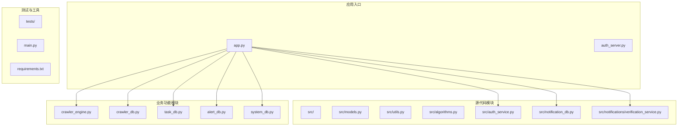
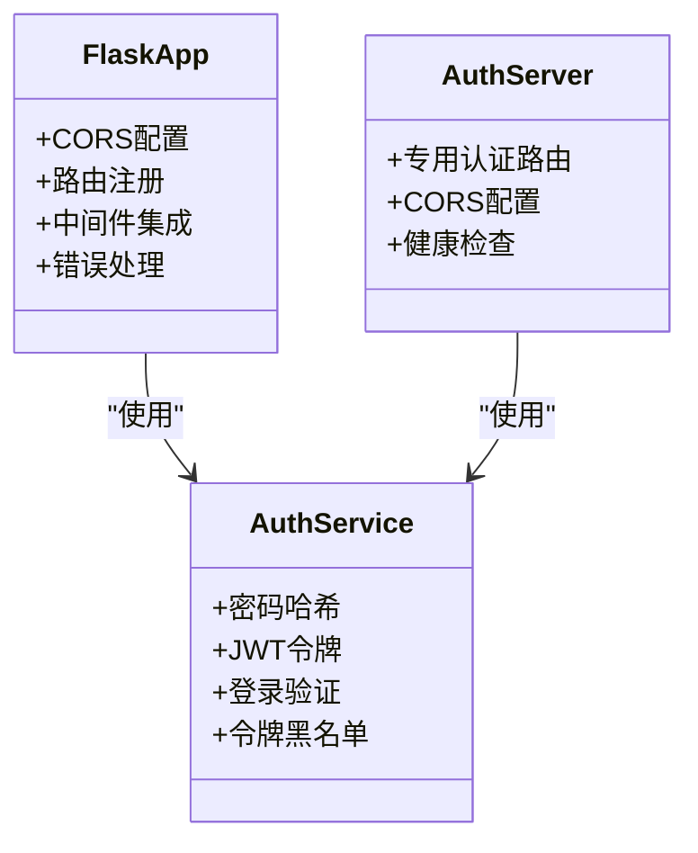
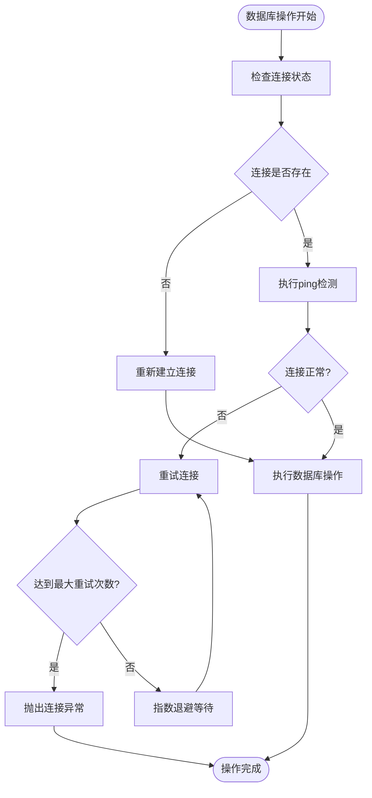
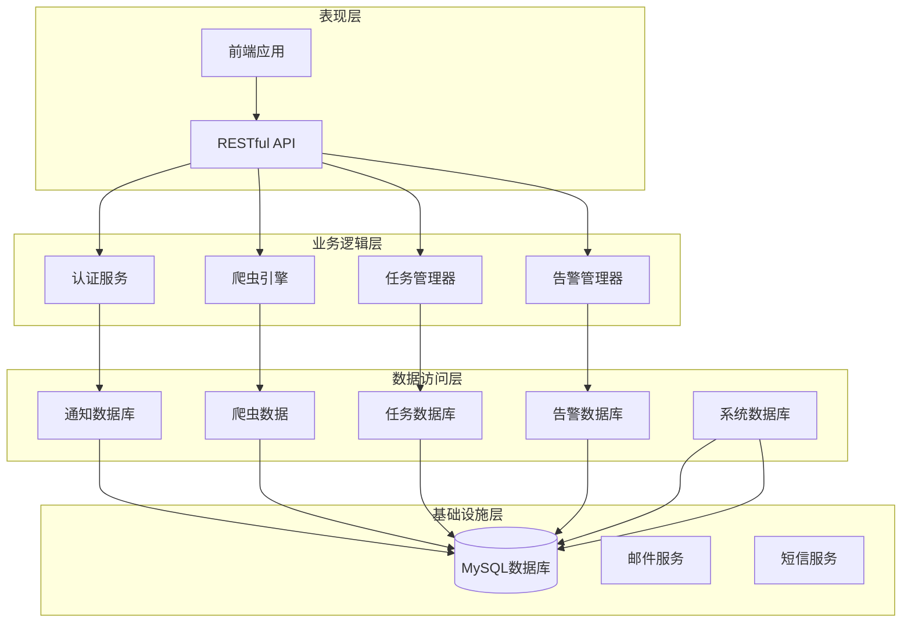
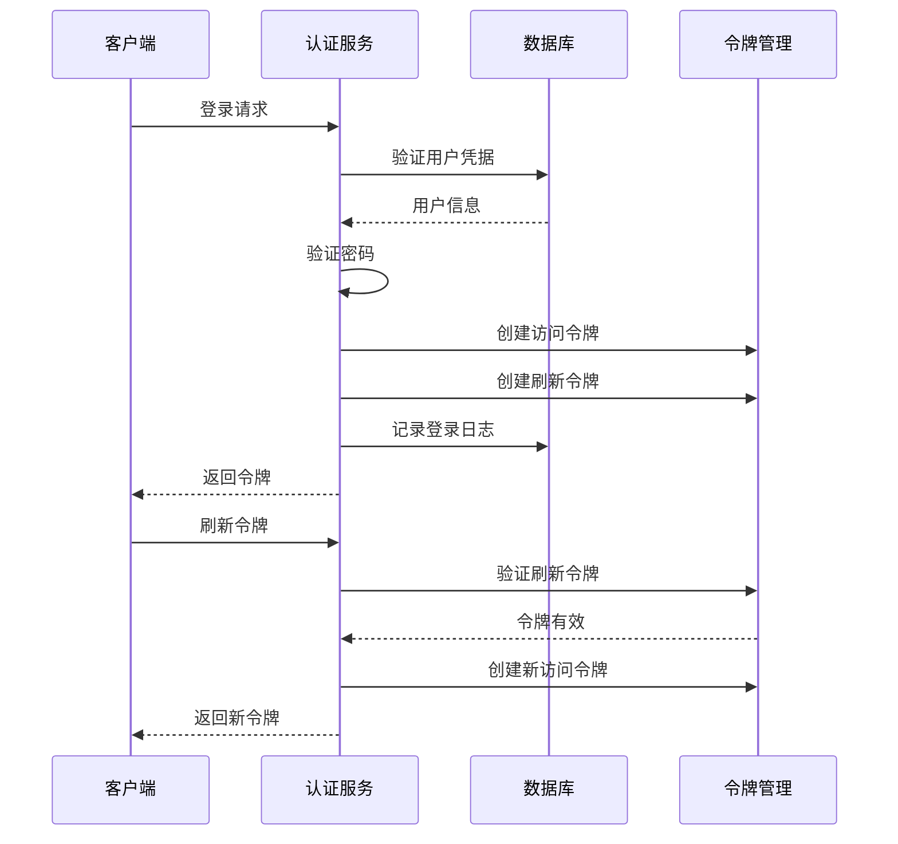
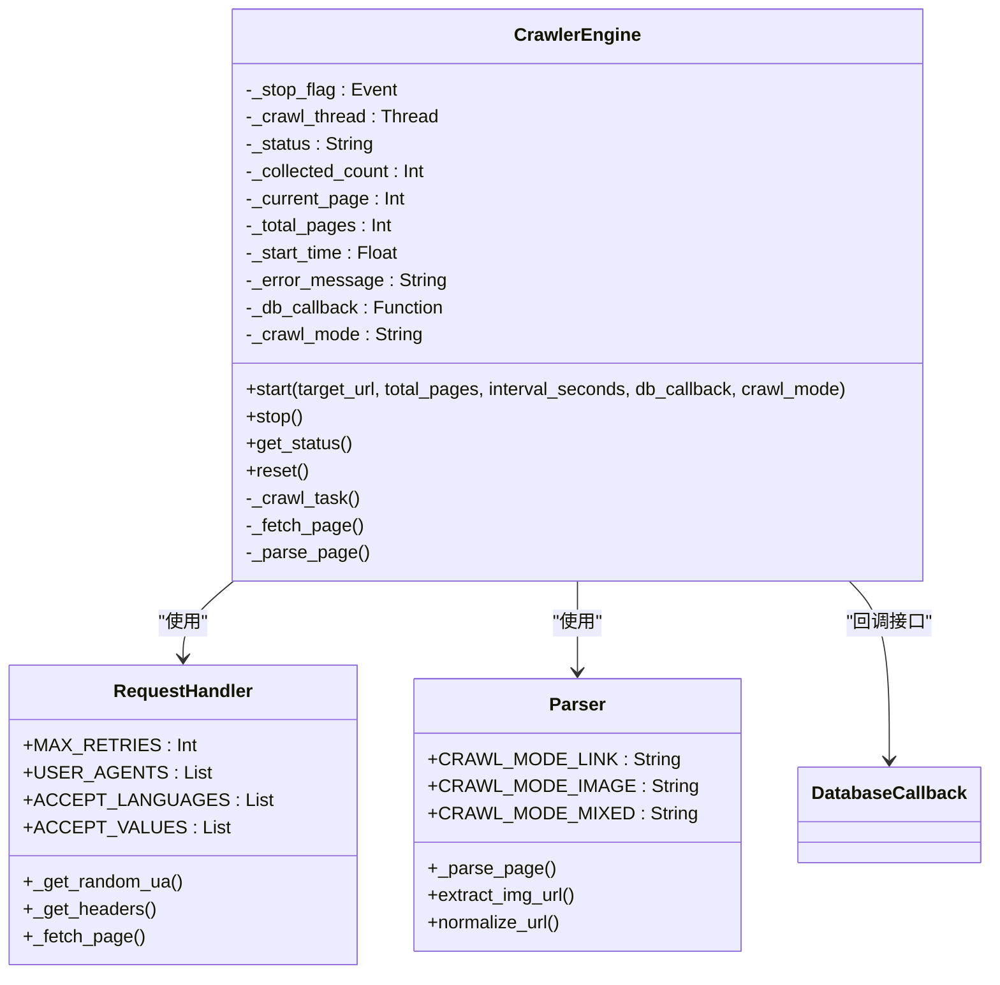
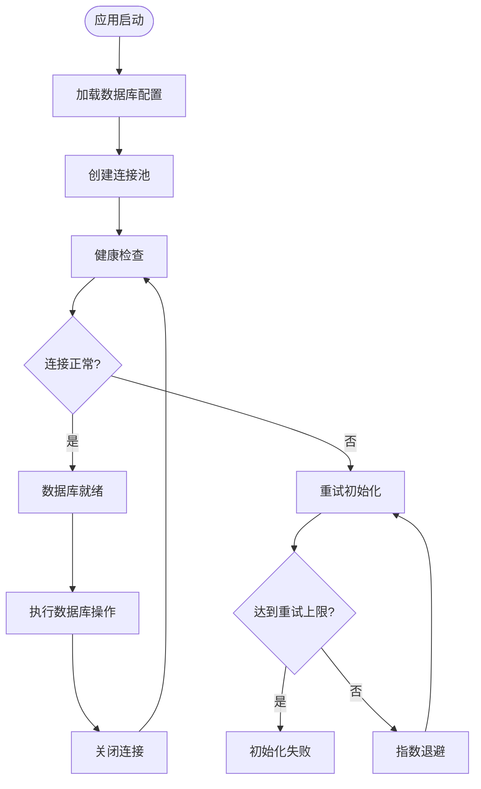
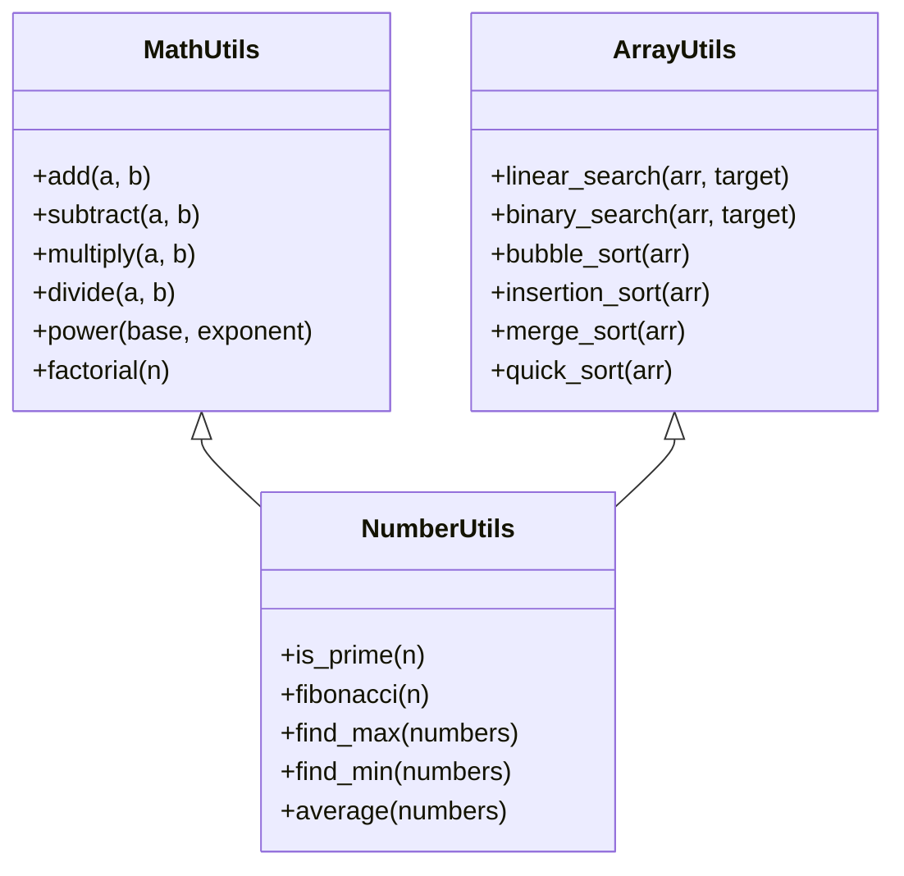
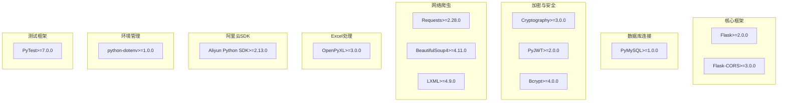
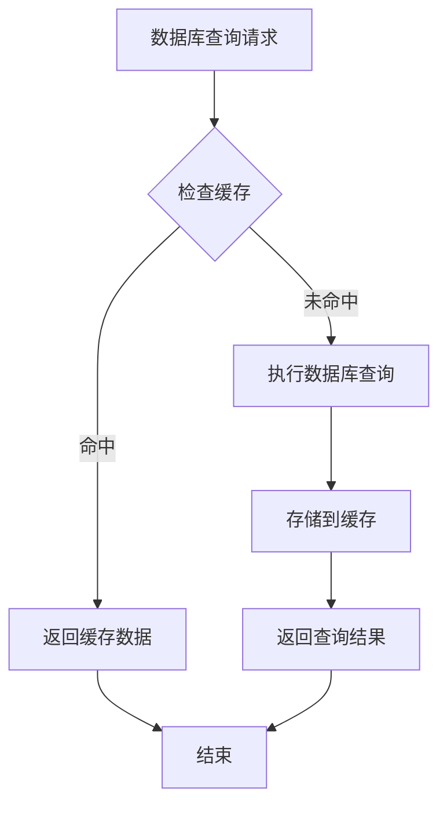

# 后端开发指南

<cite>
**本文档引用的文件**
- [app.py](file://python/app.py)
- [auth_server.py](file://python/auth_server.py)
- [main.py](file://python/main.py)
- [requirements.txt](file://python/requirements.txt)
- [src/auth_service.py](file://python/src/auth_service.py)
- [src/notification_db.py](file://python/src/notification_db.py)
- [src/notifications/verification_service.py](file://python/src/notifications/verification_service.py)
- [src/models.py](file://python/src/models.py)
- [src/utils.py](file://python/src/utils.py)
- [src/algorithms.py](file://python/src/algorithms.py)
- [crawler_engine.py](file://python/crawler_engine.py)
- [crawler_db.py](file://python/crawler_db.py)
- [task_db.py](file://python/task_db.py)
- [alert_db.py](file://python/alert_db.py)
- [system_db.py](file://python/system_db.py)
</cite>

## 目录
1. [简介](#简介)
2. [项目结构](#项目结构)
3. [核心组件](#核心组件)
4. [架构概览](#架构概览)
5. [详细组件分析](#详细组件分析)
6. [依赖分析](#依赖分析)
7. [性能考虑](#性能考虑)
8. [故障排除指南](#故障排除指南)
9. [结论](#结论)
10. [附录](#附录)

## 简介

本指南面向具备Python开发经验的工程师，提供基于Flask的完整后端开发实践文档。项目采用模块化架构，包含认证服务、数据库操作封装、爬虫引擎、任务管理等核心功能模块。文档详细说明了Flask应用结构、蓝图组织、路由设计模式，以及认证服务实现、数据库操作封装、工具函数库的使用方法。

## 项目结构

项目采用清晰的分层架构设计，主要目录结构如下：



**图表来源**
- [app.py:1-1715](file://python/app.py#L1-L1715)
- [auth_server.py:1-431](file://python/auth_server.py#L1-L431)

**章节来源**
- [app.py:1-1715](file://python/app.py#L1-L1715)
- [auth_server.py:1-431](file://python/auth_server.py#L1-L431)

## 核心组件

### Flask应用初始化与配置

项目提供了两个主要的应用入口：通用Web应用和专用认证服务器。



**图表来源**
- [app.py:1-1715](file://python/app.py#L1-L1715)
- [auth_server.py:1-431](file://python/auth_server.py#L1-L431)
- [src/auth_service.py:1-187](file://python/src/auth_service.py#L1-L187)

### 数据库连接管理

采用统一的数据库连接管理策略，确保连接的稳定性和可靠性：



**图表来源**
- [src/notification_db.py:28-39](file://python/src/notification_db.py#L28-L39)
- [crawler_db.py:24-31](file://python/crawler_db.py#L24-L31)

**章节来源**
- [src/notification_db.py:1-357](file://python/src/notification_db.py#L1-L357)
- [crawler_db.py:1-238](file://python/crawler_db.py#L1-L238)

## 架构概览

项目采用分层架构设计，各层职责明确，便于维护和扩展：



**图表来源**
- [app.py:1-1715](file://python/app.py#L1-L1715)
- [src/auth_service.py:1-187](file://python/src/auth_service.py#L1-L187)
- [crawler_engine.py:1-533](file://python/crawler_engine.py#L1-L533)

## 详细组件分析

### 认证服务实现

认证服务是整个系统的核心安全组件，实现了完整的用户认证和授权流程。

#### JWT令牌管理



**图表来源**
- [src/auth_service.py:27-45](file://python/src/auth_service.py#L27-L45)
- [src/auth_service.py:120-136](file://python/src/auth_service.py#L120-L136)

#### 密码安全策略

认证服务实现了多层安全保护机制：

| 安全特性 | 实现方式 | 配置参数 |
|---------|---------|----------|
| 密码哈希 | bcrypt算法 | 自动盐值生成 |
| 登录尝试限制 | 最大5次尝试，15分钟锁定 | MAX_LOGIN_ATTEMPTS=5, LOCKOUT_MINUTES=15 |
| 令牌黑名单 | Redis存储，过期时间管理 | 自动清理过期令牌 |
| 会话管理 | JWT令牌，30分钟有效期 | ACCESS_TOKEN_EXPIRE_MINUTES=30 |

**章节来源**
- [src/auth_service.py:1-187](file://python/src/auth_service.py#L1-L187)
- [src/notification_db.py:261-295](file://python/src/notification_db.py#L261-L295)

### 爬虫引擎架构

爬虫引擎是项目的核心业务组件，实现了高性能的数据采集功能。

#### 多线程爬取架构



**图表来源**
- [crawler_engine.py:10-63](file://python/crawler_engine.py#L10-L63)
- [crawler_engine.py:400-463](file://python/crawler_engine.py#L400-L463)

#### 反爬虫策略实现

爬虫引擎采用了多层次的反爬虫策略：

| 策略类型 | 实现细节 | 配置参数 |
|---------|---------|----------|
| User-Agent轮换 | 8种不同UA，随机选择 | USER_AGENTS数组 |
| 请求头伪装 | Accept-Language、Accept等动态生成 | ACCEPT_LANGUAGES、ACCEPT_VALUES |
| 请求间隔控制 | 1-60秒随机间隔 | interval_seconds参数 |
| 错误重试机制 | 最多重试5次，指数退避 | MAX_RETRIES=5 |
| 403错误处理 | 特殊处理，延长等待时间 | 403 Forbidden处理 |

**章节来源**
- [crawler_engine.py:1-533](file://python/crawler_engine.py#L1-L533)

### 数据库操作封装

项目实现了统一的数据库操作抽象层，支持多种业务场景的数据访问需求。

#### 数据库连接池管理



**图表来源**
- [crawler_db.py:12-23](file://python/crawler_db.py#L12-L23)
- [task_db.py:13-24](file://python/task_db.py#L13-L24)

#### 表结构设计模式

每个业务模块都遵循统一的表结构设计规范：

| 业务模块 | 主要表 | 关键字段 | 索引策略 |
|---------|--------|----------|----------|
| 用户管理 | users | id, username, email, password_hash | 唯一索引(username, email) |
| 爬虫数据 | crawler_data | title, link, content, source_url | 复合索引(type, collected_at) |
| 任务管理 | crawler_tasks | name, status, user_id | 复合索引(status, user_id) |
| 告警系统 | alert_rules, alert_records | type, task_id, is_read | 多字段索引优化查询 |
| 系统日志 | system_logs | level, source, created_at | 时间序列索引 |

**章节来源**
- [crawler_db.py:48-88](file://python/crawler_db.py#L48-L88)
- [task_db.py:47-112](file://python/task_db.py#L47-L112)
- [alert_db.py:46-82](file://python/alert_db.py#L46-L82)
- [system_db.py:47-88](file://python/system_db.py#L47-L88)

### 工具函数库

项目提供了丰富的工具函数库，支持基础计算、算法实现和数据处理。

#### 数学计算工具



**图表来源**
- [src/utils.py:1-76](file://python/src/utils.py#L1-L76)
- [src/algorithms.py:1-73](file://python/src/algorithms.py#L1-L73)

#### 数据结构示例

项目包含了经典的数据结构实现，用于教学和演示目的：

| 数据结构 | 方法数量 | 复杂度分析 | 应用场景 |
|---------|----------|-----------|----------|
| Person类 | 4个方法 | O(1)操作 | 基础继承示例 |
| Student类 | 4个方法 | O(1)操作 | 继承关系演示 |
| Rectangle类 | 4个方法 | O(1)操作 | 几何计算示例 |
| Circle类 | 4个方法 | O(1)操作 | 几何计算示例 |

**章节来源**
- [src/utils.py:1-76](file://python/src/utils.py#L1-L76)
- [src/algorithms.py:1-73](file://python/src/algorithms.py#L1-L73)
- [src/models.py:1-59](file://python/src/models.py#L1-L59)

## 依赖分析

项目使用pip进行包管理，核心依赖包括Flask框架及其扩展。



**图表来源**
- [requirements.txt:1-13](file://python/requirements.txt#L1-L13)

### 依赖版本管理策略

项目采用严格的版本管理策略，确保依赖的兼容性和稳定性：

| 依赖类别 | 版本范围 | 选择理由 |
|---------|---------|----------|
| Web框架 | >=2.0.0 | 支持现代Python特性，性能优化 |
| 数据库驱动 | >=1.0.0 | 稳定的MySQL连接，UTF-8mb4支持 |
| 加密库 | >=3.0.0 | 安全的密码哈希和令牌处理 |
| 爬虫库 | >=2.28.0 | 强大的HTTP客户端和HTML解析 |
| 测试框架 | >=7.0.0 | 全面的测试支持和报告功能 |

**章节来源**
- [requirements.txt:1-13](file://python/requirements.txt#L1-L13)

## 性能考虑

### 数据库性能优化

项目在数据库层面实施了多项性能优化策略：

1. **连接池管理**：使用PyMySQL的连接池机制，减少连接开销
2. **索引优化**：为常用查询字段建立复合索引
3. **查询优化**：使用LIMIT和OFFSET实现分页查询
4. **数据类型优化**：选择合适的数据类型减少存储空间

### 缓存策略



### 并发处理

爬虫引擎采用多线程架构处理高并发请求：

| 并发特性 | 实现方式 | 性能收益 |
|---------|---------|----------|
| 多线程爬取 | threading.Thread | 提高数据采集效率 |
| 线程安全 | Event对象控制 | 防止竞态条件 |
| 资源管理 | 上下文管理器 | 自动资源清理 |
| 错误隔离 | 异常捕获和处理 | 提升系统稳定性 |

## 故障排除指南

### 常见问题诊断

#### 数据库连接问题

**症状**：应用启动时报数据库连接错误
**解决方案**：
1. 检查数据库服务状态
2. 验证连接配置参数
3. 确认防火墙设置
4. 查看连接池状态

#### 认证失败问题

**症状**：用户登录失败或令牌验证错误
**排查步骤**：
1. 检查用户凭据是否正确
2. 验证密码哈希算法
3. 确认JWT密钥配置
4. 检查令牌黑名单状态

#### 爬虫异常问题

**症状**：爬虫任务执行失败或数据采集异常
**诊断方法**：
1. 检查目标网站状态
2. 验证反爬虫策略配置
3. 查看请求头伪装效果
4. 监控网络连接质量

**章节来源**
- [src/notification_db.py:28-39](file://python/src/notification_db.py#L28-L39)
- [crawler_engine.py:113-169](file://python/crawler_engine.py#L113-L169)

### 日志记录策略

项目实现了完善的日志记录机制，便于问题追踪和性能监控：

| 日志级别 | 使用场景 | 输出位置 |
|---------|---------|----------|
| DEBUG | 详细调试信息 | 控制台输出 |
| INFO | 正常操作日志 | 控制台输出 |
| WARNING | 警告信息 | 控制台输出 |
| ERROR | 错误信息 | 文件日志 |
| CRITICAL | 严重错误 | 文件日志 |

**章节来源**
- [system_db.py:99-122](file://python/system_db.py#L99-L122)

## 结论

本指南详细介绍了基于Flask的完整后端开发实践，涵盖了从应用架构到具体实现的各个方面。项目采用模块化设计，具有良好的可维护性和扩展性。通过统一的认证服务、完善的数据库操作封装、高性能的爬虫引擎，以及丰富的工具函数库，为后续的功能扩展奠定了坚实基础。

建议开发者在实际项目中：
1. 严格遵循代码规范和最佳实践
2. 定期进行性能优化和安全审计
3. 完善测试覆盖和文档维护
4. 建立完善的监控和告警机制

## 附录

### API路由设计模式

项目采用RESTful API设计模式，路由命名遵循统一规范：

```mermaid
flowchart LR
subgraph "认证相关"
REG[/api/auth/register]
LOG[/api/auth/login]
REF[/api/auth/refresh]
LOGOUT[/api/auth/logout]
end
subgraph "用户管理"
PROFILE[/api/user/profile]
CHANGEPW[/api/auth/change-password]
FORGOTPW[/api/auth/forgot-password]
end
subgraph "爬虫功能"
START[/api/crawler/start]
STOP[/api/crawler/stop]
STATUS[/api/crawler/status]
DATA[/api/crawler/data]
EXPORT[/api/crawler/export]
end
subgraph "任务管理"
TASKLIST[/api/tasks]
TASKCREATE[/api/tasks]
TASKDETAIL[/api/tasks/{task_id}]
TEMPLATE[/api/tasks/templates]
VERSIONS[/api/tasks/{task_id}/versions]
end
```

### 开发环境配置

建议的开发环境配置：
1. Python 3.8+
2. MySQL 5.7+
3. Redis（可选，用于缓存）
4. IDE推荐：VSCode或PyCharm
5. 调试工具：Postman或Insomnia