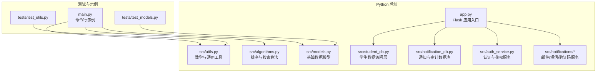
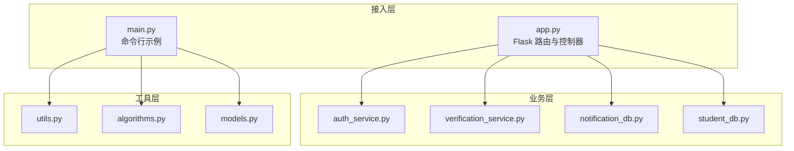
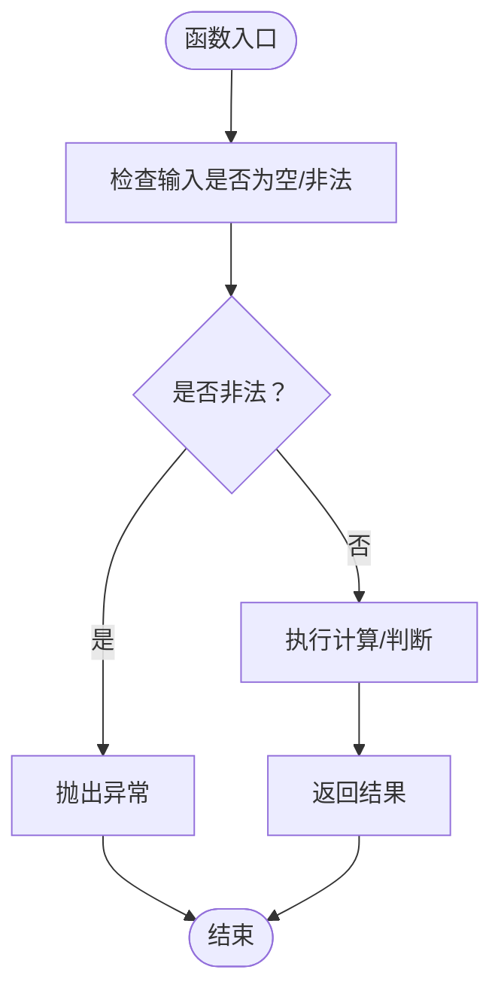
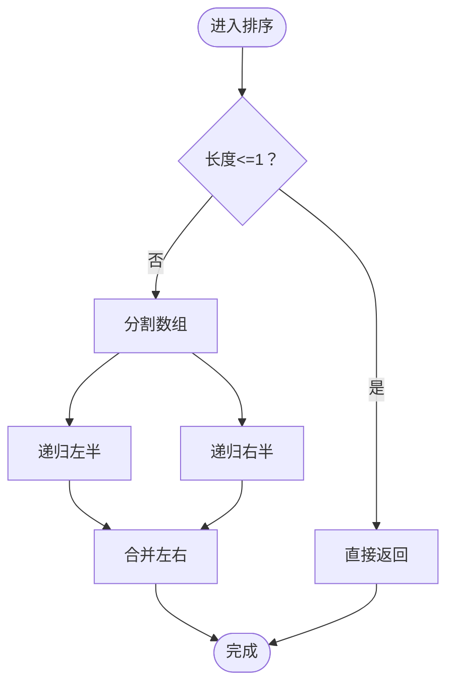
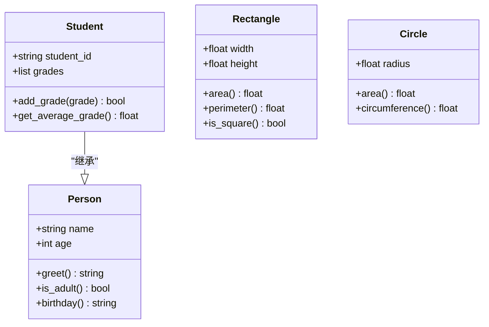
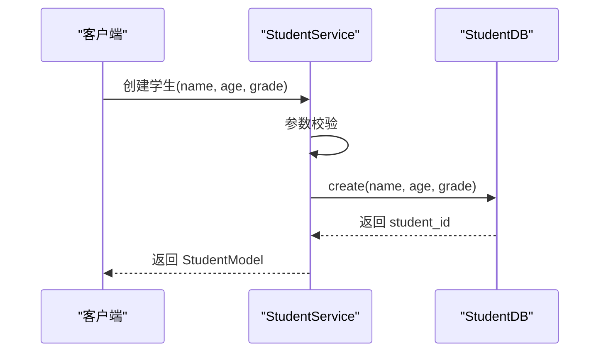
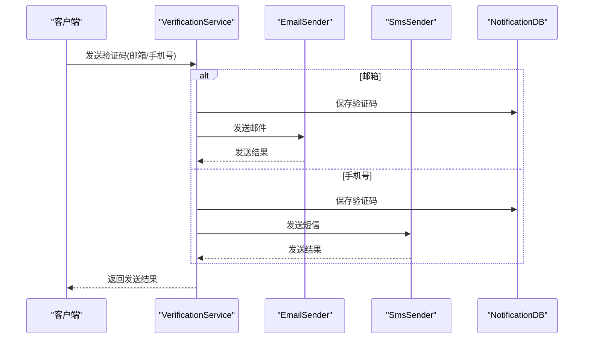
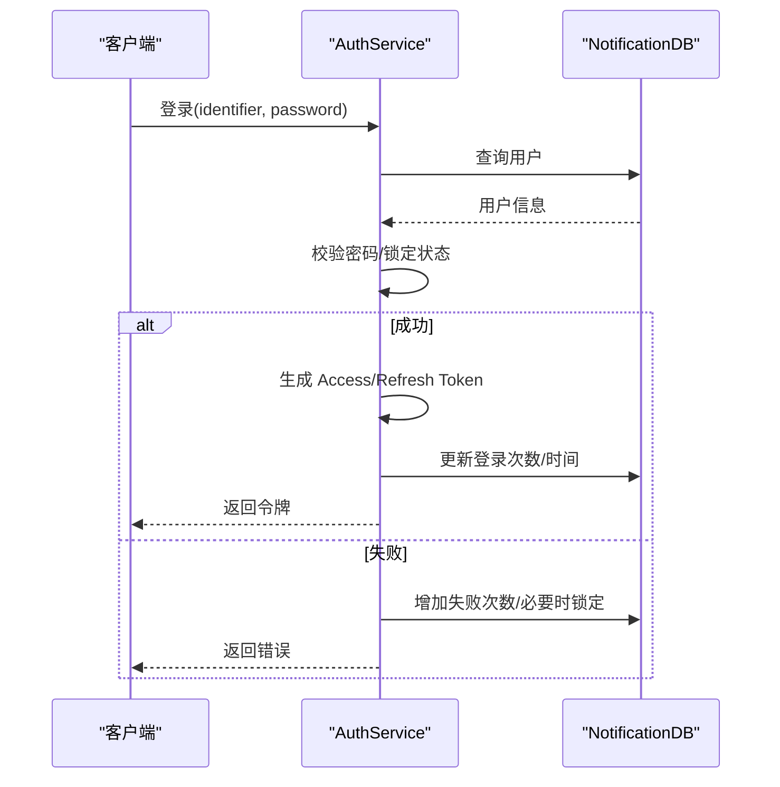
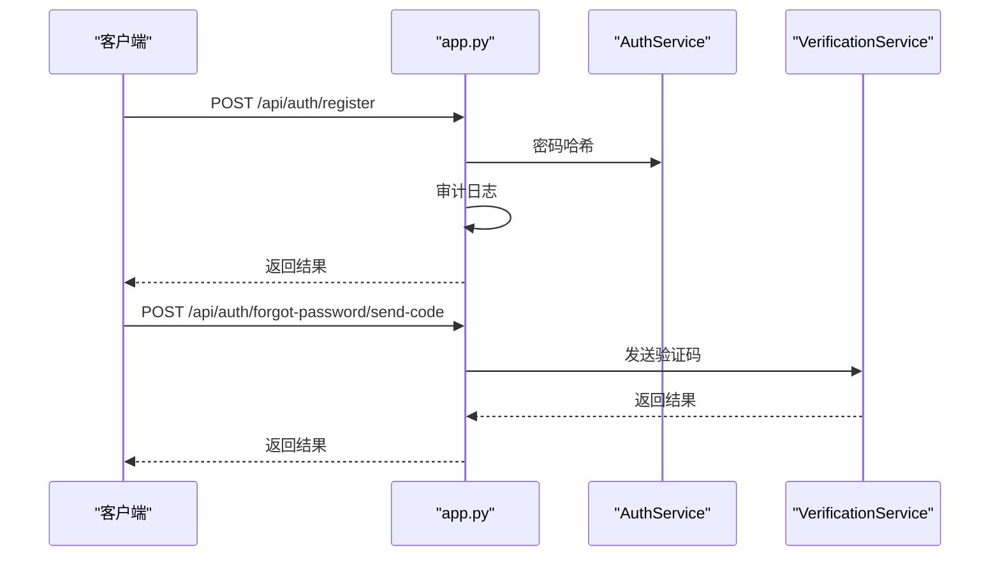
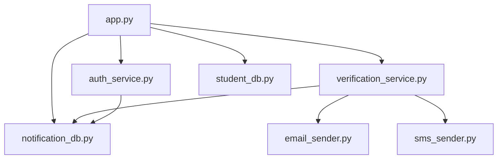

# 工具函数库

<cite>
**本文引用的文件**
- [utils.py](file://python/src/utils.py)
- [algorithms.py](file://python/src/algorithms.py)
- [models.py](file://python/src/models.py)
- [student_db.py](file://python/src/student_db.py)
- [notification_db.py](file://python/src/notification_db.py)
- [email_sender.py](file://python/src/notifications/email_sender.py)
- [sms_sender.py](file://python/src/notifications/sms_sender.py)
- [verification_service.py](file://python/src/notifications/verification_service.py)
- [auth_service.py](file://python/src/auth_service.py)
- [config.py](file://python/src/notifications/config.py)
- [app.py](file://python/app.py)
- [main.py](file://python/main.py)
- [test_utils.py](file://python/tests/test_utils.py)
- [test_models.py](file://python/tests/test_models.py)
- [requirements.txt](file://python/requirements.txt)
</cite>

## 目录
1. [简介](#简介)
2. [项目结构](#项目结构)
3. [核心组件](#核心组件)
4. [架构总览](#架构总览)
5. [详细组件分析](#详细组件分析)
6. [依赖分析](#依赖分析)
7. [性能考虑](#性能考虑)
8. [故障排查指南](#故障排查指南)
9. [结论](#结论)
10. [附录](#附录)

## 简介
本工具函数库面向开发者提供常用工具能力，覆盖以下方面：
- 数值与字符串处理：基础运算、阶乘、素数判断、斐波那契等
- 数据验证：邮箱、手机号格式校验
- 排序与搜索：线性/二分查找、冒泡/插入/归并/快排
- 数据模型：人员、学生、矩形、圆形等基础对象
- 业务封装：验证码发送与校验、用户认证与鉴权、审计日志
- 文件与网络：CSV 导出、HTTP 接口、阿里云短信/邮件 SDK 集成
- 测试与示例：单元测试与命令行示例程序

本库既可作为独立模块使用，也可与 Web 应用集成，提供统一的工具与业务封装。

## 项目结构
仓库采用按功能域划分的组织方式，核心代码位于 python/src，包含工具函数、算法、模型、通知与认证服务；Web 入口在 python/app.py，命令行示例在 python/main.py；测试位于 python/tests。

图表来源
- [app.py:1-800](file://python/app.py#L1-L800)
- [utils.py:1-76](file://python/src/utils.py#L1-L76)
- [algorithms.py:1-73](file://python/src/algorithms.py#L1-L73)
- [models.py:1-59](file://python/src/models.py#L1-L59)
- [student_db.py:1-259](file://python/src/student_db.py#L1-L259)
- [notification_db.py:1-357](file://python/src/notification_db.py#L1-L357)
- [auth_service.py:1-187](file://python/src/auth_service.py#L1-L187)
- [email_sender.py:1-67](file://python/src/notifications/email_sender.py#L1-L67)
- [sms_sender.py:1-65](file://python/src/notifications/sms_sender.py#L1-L65)
- [verification_service.py:1-108](file://python/src/notifications/verification_service.py#L1-L108)
- [main.py:1-60](file://python/main.py#L1-L60)
- [test_utils.py:1-41](file://python/tests/test_utils.py#L1-L41)
- [test_models.py:1-42](file://python/tests/test_models.py#L1-L42)

章节来源
- [requirements.txt:1-14](file://python/requirements.txt#L1-L14)
- [app.py:1-800](file://python/app.py#L1-L800)

## 核心组件
- 数学与通用工具：加减乘除、幂运算、阶乘、素数判断、斐波那契、最值与平均等
- 排序与搜索：线性/二分查找、冒泡/插入/归并/快排
- 数据模型：Person、Student、Rectangle、Circle
- 学生数据访问：StudentDB 提供 CRUD、批量删除、统计等
- 通知与验证码：NotificationDB 提供用户、验证码、黑名单、审计日志；VerificationService 组合 Email/SMS 发送器
- 认证与鉴权：AuthService 提供密码哈希、JWT 签发/刷新、黑名单、登录控制
- Web 接口：app.py 暴露注册/登录/验证码/爬虫/任务等接口
- 示例与测试：main.py 展示工具函数用法；tests 提供断言验证

章节来源
- [utils.py:1-76](file://python/src/utils.py#L1-L76)
- [algorithms.py:1-73](file://python/src/algorithms.py#L1-L73)
- [models.py:1-59](file://python/src/models.py#L1-L59)
- [student_db.py:1-259](file://python/src/student_db.py#L1-L259)
- [notification_db.py:1-357](file://python/src/notification_db.py#L1-L357)
- [verification_service.py:1-108](file://python/src/notifications/verification_service.py#L1-L108)
- [auth_service.py:1-187](file://python/src/auth_service.py#L1-L187)
- [app.py:1-800](file://python/app.py#L1-L800)
- [main.py:1-60](file://python/main.py#L1-L60)
- [test_utils.py:1-41](file://python/tests/test_utils.py#L1-L41)
- [test_models.py:1-42](file://python/tests/test_models.py#L1-L42)

## 架构总览
系统由“工具层”“业务层”“接入层”三层组成：
- 工具层：utils、algorithms、models 提供基础能力
- 业务层：student_db、notification_db、verification_service、auth_service 封装领域逻辑
- 接入层：app.py 提供 HTTP 接口，main.py 提供命令行示例

图表来源
- [app.py:1-800](file://python/app.py#L1-L800)
- [main.py:1-60](file://python/main.py#L1-L60)
- [auth_service.py:1-187](file://python/src/auth_service.py#L1-L187)
- [verification_service.py:1-108](file://python/src/notifications/verification_service.py#L1-L108)
- [notification_db.py:1-357](file://python/src/notification_db.py#L1-L357)
- [student_db.py:1-259](file://python/src/student_db.py#L1-L259)
- [utils.py:1-76](file://python/src/utils.py#L1-L76)
- [algorithms.py:1-73](file://python/src/algorithms.py#L1-L73)
- [models.py:1-59](file://python/src/models.py#L1-L59)

## 详细组件分析

### 数学与通用工具（utils）
- 功能清单
  - 基础运算：加、减、乘、除（含除零保护）
  - 幂运算与阶乘（负数输入抛异常）
  - 素数判断（含偶数与开方优化）
  - 斐波那契（负数输入抛异常）
  - 最值与平均（空列表抛异常）

图表来源
- [utils.py:1-76](file://python/src/utils.py#L1-L76)

章节来源
- [utils.py:1-76](file://python/src/utils.py#L1-L76)
- [test_utils.py:1-41](file://python/tests/test_utils.py#L1-L41)

### 排序与搜索算法（algorithms）
- 线性搜索：遍历数组返回索引或未找到
- 二分搜索：有序数组折半查找
- 冒泡排序：相邻交换，稳定排序
- 插入排序：逐个插入到已排序部分
- 归并排序：分治合并，稳定 O(n log n)
- 快速排序：分而治之，平均 O(n log n)

图表来源
- [algorithms.py:41-62](file://python/src/algorithms.py#L41-L62)

章节来源
- [algorithms.py:1-73](file://python/src/algorithms.py#L1-L73)

### 数据模型（models）
- Person：姓名、年龄，问候、成年判断、生日
- Student：继承 Person，成绩集合、平均分
- Rectangle：宽高、面积、周长、正方形判定
- Circle：半径、面积、周长

图表来源
- [models.py:1-59](file://python/src/models.py#L1-L59)

章节来源
- [models.py:1-59](file://python/src/models.py#L1-L59)
- [test_models.py:1-42](file://python/tests/test_models.py#L1-L42)

### 学生数据访问（student_db）
- 表结构：id、name、age、grade、avatar_url、create_time、update_time
- 支持：创建、全量查询、按 id/name 查询、更新（动态字段）、删除、批量删除、存在性与计数
- 服务层：StudentService 对外暴露业务方法，进行参数校验与异常抛出

图表来源
- [student_db.py:160-174](file://python/src/student_db.py#L160-L174)

章节来源
- [student_db.py:1-259](file://python/src/student_db.py#L1-L259)

### 通知与验证码（notification_db + verification_service + email_sender + sms_sender）
- 数据库层：用户表、验证码表、黑名单表、密码历史、审计日志
- 验证码服务：生成 6 位数字验证码，5 分钟有效期，支持邮箱/短信发送与校验
- 邮件发送：基于阿里云邮件推送 SDK，HTML 内容模板化
- 短信发送：基于阿里云短信 SDK，签名与模板可配置
- 配置：从环境变量读取密钥、区域、开关与默认模板

图表来源
- [verification_service.py:22-52](file://python/src/notifications/verification_service.py#L22-L52)
- [email_sender.py:13-24](file://python/src/notifications/email_sender.py#L13-L24)
- [sms_sender.py:14-24](file://python/src/notifications/sms_sender.py#L14-L24)
- [notification_db.py:147-157](file://python/src/notification_db.py#L147-L157)

章节来源
- [notification_db.py:1-357](file://python/src/notification_db.py#L1-L357)
- [verification_service.py:1-108](file://python/src/notifications/verification_service.py#L1-L108)
- [email_sender.py:1-67](file://python/src/notifications/email_sender.py#L1-L67)
- [sms_sender.py:1-65](file://python/src/notifications/sms_sender.py#L1-L65)
- [config.py:1-20](file://python/src/notifications/config.py#L1-L20)

### 认证与鉴权（auth_service）
- 密码：bcrypt 哈希与校验
- JWT：Access/Refresh Token，带过期与黑名单
- 登录控制：最大失败次数、临时锁定、审计日志
- 装饰器：登录态校验，注入用户上下文

图表来源
- [auth_service.py:76-118](file://python/src/auth_service.py#L76-L118)
- [notification_db.py:261-295](file://python/src/notification_db.py#L261-L295)

章节来源
- [auth_service.py:1-187](file://python/src/auth_service.py#L1-L187)
- [notification_db.py:1-357](file://python/src/notification_db.py#L1-L357)

### Web 接口与数据导出（app.py）
- 路由：注册、登录、刷新、登出、忘记密码验证码发送/校验/重置、修改密码、用户资料、爬虫控制、任务管理等
- 数据导出：将爬取数据导出为 CSV 文件流
- 工具函数：邮箱/手机号校验、客户端 IP 获取

图表来源
- [app.py:53-96](file://python/app.py#L53-L96)
- [app.py:170-189](file://python/app.py#L170-L189)
- [auth_service.py:138-156](file://python/src/auth_service.py#L138-L156)
- [verification_service.py:25-52](file://python/src/notifications/verification_service.py#L25-L52)

章节来源
- [app.py:1-800](file://python/app.py#L1-L800)

### 命令行示例与测试（main.py + tests）
- main.py：演示工具函数、模型与算法的基本用法
- test_utils.py/test_models.py：对工具与模型进行断言验证

章节来源
- [main.py:1-60](file://python/main.py#L1-L60)
- [test_utils.py:1-41](file://python/tests/test_utils.py#L1-L41)
- [test_models.py:1-42](file://python/tests/test_models.py#L1-L42)

## 依赖分析
- 运行时依赖：Flask、CORS、PyMySQL、bcrypt、PyJWT、阿里云 SDK、Requests、BeautifulSoup、lxml、psutil、openpyxl 等
- 组件耦合：
  - app.py 依赖 auth_service、notification_db、verification_service、student_db 等
  - verification_service 依赖 notification_db 与邮件/短信发送器
  - auth_service 依赖 notification_db
  - 各模块内部低耦合，跨模块通过服务类与 DB 类交互

图表来源
- [app.py:1-12](file://python/app.py#L1-L12)
- [auth_service.py:1-6](file://python/src/auth_service.py#L1-L6)
- [verification_service.py:1-14](file://python/src/notifications/verification_service.py#L1-L14)
- [email_sender.py:1-3](file://python/src/notifications/email_sender.py#L1-L3)
- [sms_sender.py:1-4](file://python/src/notifications/sms_sender.py#L1-L4)
- [notification_db.py:1-16](file://python/src/notification_db.py#L1-L16)
- [student_db.py:1-15](file://python/src/student_db.py#L1-L15)

章节来源
- [requirements.txt:1-14](file://python/requirements.txt#L1-L14)

## 性能考虑
- 排序算法
  - 归并/快速排序平均 O(n log n)，适合大数据集；冒泡/插入排序适合小规模或基本有序数据
- 数据库访问
  - 使用参数化 SQL，避免拼接；批量删除使用占位符拼接，减少往返
  - 连接池与 ping 重连机制降低连接抖动
- 网络请求
  - 阿里云 SDK 请求异常捕获与重试策略，避免阻塞主流程
- 缓存与序列化
  - 可在上层引入缓存（如 Redis）与更高效的序列化方案（如 msgpack），减少数据库压力
- 日志与审计
  - 审计日志异步写入，避免阻塞主业务路径

## 故障排查指南
- 除零异常
  - 现象：除法报错
  - 处理：调用前确保除数非零
- 负数阶乘/斐波那契
  - 现象：抛出异常
  - 处理：输入校验，避免传入负数
- 空列表最值/平均
  - 现象：抛出异常
  - 处理：调用前判空
- 验证码发送失败
  - 现象：返回失败消息
  - 处理：检查邮箱/短信配置、模板与签名、目标号码/邮箱格式
- 登录失败与锁定
  - 现象：失败次数过多被锁定
  - 处理：等待锁定时间结束或联系管理员；检查密码历史限制
- 数据库连接异常
  - 现象：连接错误或超时
  - 处理：检查数据库配置、网络连通性、重试策略生效情况

章节来源
- [utils.py:13-16](file://python/src/utils.py#L13-L16)
- [utils.py:23-31](file://python/src/utils.py#L23-L31)
- [utils.py:47-57](file://python/src/utils.py#L47-L57)
- [utils.py:60-75](file://python/src/utils.py#L60-L75)
- [verification_service.py:25-52](file://python/src/notifications/verification_service.py#L25-L52)
- [auth_service.py:88-97](file://python/src/auth_service.py#L88-L97)
- [notification_db.py:28-39](file://python/src/notification_db.py#L28-L39)

## 结论
该工具函数库提供了从基础数学运算、排序搜索、数据模型到业务封装（验证码、认证、通知、审计）的一体化能力，配合 Web 接口与命令行示例，便于开发者快速集成与扩展。建议在生产环境中结合缓存、异步审计、连接池与完善的监控体系进一步提升稳定性与性能。

## 附录
- 使用示例参考
  - 命令行示例：[main.py:6-59](file://python/main.py#L6-L59)
  - 单元测试：[test_utils.py:5-36](file://python/tests/test_utils.py#L5-L36), [test_models.py:5-37](file://python/tests/test_models.py#L5-L37)
- 关键接口参考
  - 注册/登录/验证码/重置密码：[app.py:53-239](file://python/app.py#L53-L239)
  - 爬虫与数据导出：[app.py:306-465](file://python/app.py#L306-L465)
- 配置参考
  - 通知配置：[config.py:4-16](file://python/src/notifications/config.py#L4-L16)