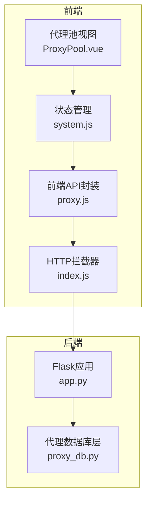
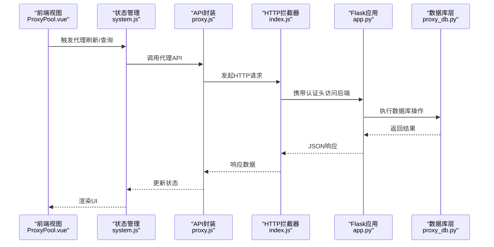
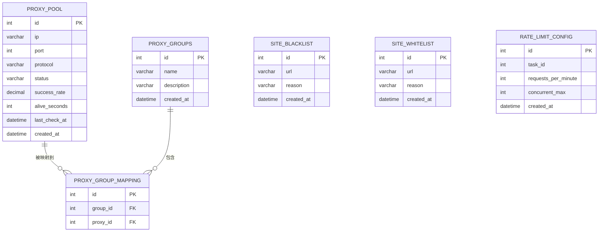
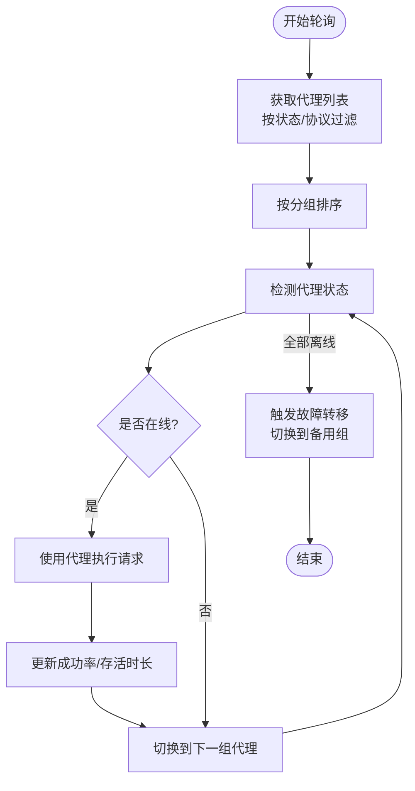
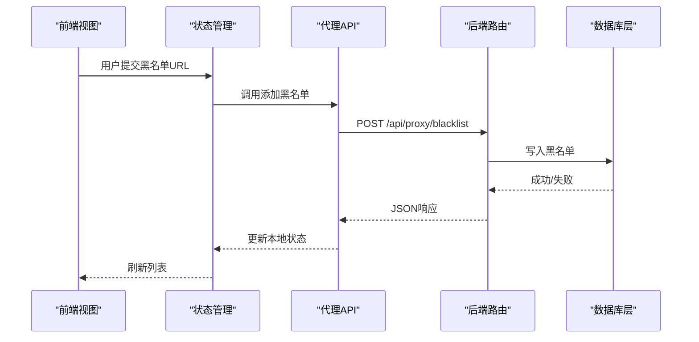
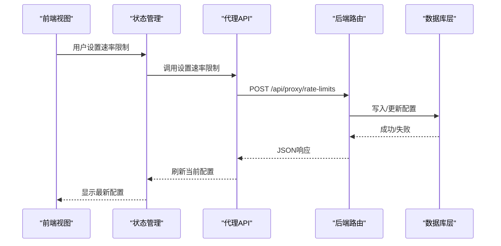
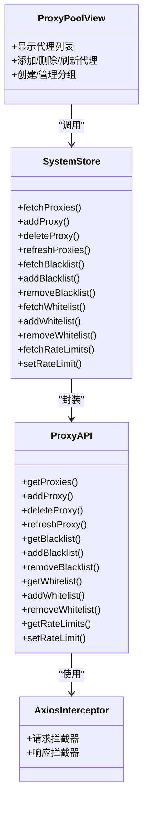
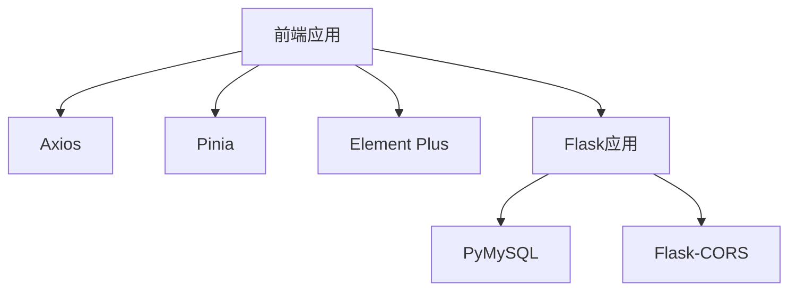

# 代理管理数据操作

<cite>
**本文档引用的文件**
- [proxy_db.py](file://python/proxy_db.py)
- [app.py](file://python/app.py)
- [proxy.js](file://python-web/src/api/proxy.js)
- [ProxyPool.vue](file://python-web/src/views/ProxyPool.vue)
- [system.js](file://python-web/src/stores/system.js)
- [index.js](file://python-web/src/api/index.js)
</cite>

## 更新摘要
**变更内容**
- 更新了API端点结构，简化了代理管理相关路由
- 改进了参数结构，移除了不必要的嵌套
- 优化了前端界面，增强了代理池管理功能
- 完善了状态管理和错误处理机制

## 目录
1. [简介](#简介)
2. [项目结构](#项目结构)
3. [核心组件](#核心组件)
4. [架构概览](#架构概览)
5. [详细组件分析](#详细组件分析)
6. [依赖关系分析](#依赖关系分析)
7. [性能考量](#性能考量)
8. [故障排查指南](#故障排查指南)
9. [结论](#结论)
10. [附录](#附录)

## 简介
本文件面向代理管理系统的数据操作与管理，聚焦于代理IP数据的存储结构、质量评估与使用管理。系统提供代理类型分类、可用性检测、响应时间统计、代理池管理、轮询策略与故障转移机制等能力，并配套代理查询与管理API，涵盖代理获取、质量评估、黑名单管理等操作。同时，文档阐述安全考虑与性能优化策略，帮助读者快速理解并高效使用该代理管理系统。

## 项目结构
后端采用Flask框架，前端基于Vue 3 + Pinia构建，代理管理模块位于Python后端的数据库层与API路由层，前端通过Axios封装的API进行交互。

**图表来源**
- [proxy.js:1-63](file://python-web/src/api/proxy.js#L1-L63)
- [ProxyPool.vue:1-507](file://python-web/src/views/ProxyPool.vue#L1-L507)
- [system.js:1-168](file://python-web/src/stores/system.js#L1-L168)
- [index.js:1-95](file://python-web/src/api/index.js#L1-L95)
- [app.py:1346-1651](file://python/app.py#L1346-L1651)
- [proxy_db.py:1-528](file://python/proxy_db.py#L1-L528)

**章节来源**
- [proxy_db.py:1-528](file://python/proxy_db.py#L1-L528)
- [app.py:1346-1651](file://python/app.py#L1346-L1651)
- [proxy.js:1-63](file://python-web/src/api/proxy.js#L1-L63)
- [ProxyPool.vue:1-507](file://python-web/src/views/ProxyPool.vue#L1-L507)
- [system.js:1-168](file://python-web/src/stores/system.js#L1-L168)
- [index.js:1-95](file://python-web/src/api/index.js#L1-L95)

## 核心组件
- 数据库层：负责代理池、分组、黑白名单、速率限制等数据的持久化与查询。
- API层：提供代理管理相关REST接口，统一鉴权与错误处理。
- 前端层：提供代理池可视化界面、状态管理与API调用封装。

**章节来源**
- [proxy_db.py:6-528](file://python/proxy_db.py#L6-L528)
- [app.py:1346-1651](file://python/app.py#L1346-L1651)
- [proxy.js:1-63](file://python-web/src/api/proxy.js#L1-L63)
- [ProxyPool.vue:1-507](file://python-web/src/views/ProxyPool.vue#L1-L507)
- [system.js:1-168](file://python-web/src/stores/system.js#L1-L168)

## 架构概览
系统采用前后端分离架构，前端通过Axios发起HTTP请求，后端Flask路由接收请求并调用数据库层执行具体操作，最终返回JSON响应。

**图表来源**
- [ProxyPool.vue:1-507](file://python-web/src/views/ProxyPool.vue#L1-L507)
- [system.js:1-168](file://python-web/src/stores/system.js#L1-L168)
- [proxy.js:1-63](file://python-web/src/api/proxy.js#L1-L63)
- [index.js:1-95](file://python-web/src/api/index.js#L1-L95)
- [app.py:1346-1651](file://python/app.py#L1346-L1651)
- [proxy_db.py:1-528](file://python/proxy_db.py#L1-L528)

## 详细组件分析

### 数据存储结构与表设计
系统包含以下核心表：
- 代理池表：存储代理IP、端口、协议、状态、成功率、存活时长、最后检测时间等字段，并建立索引以提升查询效率。
- 代理分组表：用于对代理进行逻辑分组，便于策略化管理。
- 代理分组映射表：实现代理与分组的多对多关系。
- 黑名单表：记录禁止访问的目标URL及原因。
- 白名单表：记录允许访问的目标URL及原因。
- 速率限制配置表：支持按任务维度或全局维度配置请求频率与并发限制。

**图表来源**
- [proxy_db.py:50-120](file://python/proxy_db.py#L50-L120)

**章节来源**
- [proxy_db.py:50-120](file://python/proxy_db.py#L50-L120)

### 代理类型分类与可用性检测
- 代理类型：支持HTTP、HTTPS、SOCKS5等协议类型，便于适配不同网络场景。
- 可用性检测：通过状态字段区分在线/离线；成功率与存活时长用于衡量代理质量；最后检测时间用于追踪维护周期。
- 响应时间统计：系统提供存活时长字段，可用于估算代理响应性能。

**章节来源**
- [proxy_db.py:51-65](file://python/proxy_db.py#L51-L65)
- [proxy_db.py:221-246](file://python/proxy_db.py#L221-L246)

### 代理池管理与轮询策略
- 代理池管理：支持批量查询、新增、删除、刷新代理，以及按状态与协议筛选。
- 分组管理：支持创建分组、分配代理至分组，便于实现按组轮询与优先级调度。
- 轮询策略：前端视图提供"全部刷新"与单个代理刷新功能，结合分组可实现多组轮询与优先级切换。
- 故障转移：通过状态字段与分组机制，可在某组代理全部离线时自动切换至其他可用组。

**图表来源**
- [proxy_db.py:132-167](file://python/proxy_db.py#L132-L167)
- [proxy_db.py:291-315](file://python/proxy_db.py#L291-L315)
- [ProxyPool.vue:241-248](file://python-web/src/views/ProxyPool.vue#L241-L248)

**章节来源**
- [proxy_db.py:132-167](file://python/proxy_db.py#L132-L167)
- [proxy_db.py:291-315](file://python/proxy_db.py#L291-L315)
- [ProxyPool.vue:241-248](file://python-web/src/views/ProxyPool.vue#L241-L248)

### 黑名单与白名单管理
- 黑名单：记录禁止访问的目标URL，支持添加、删除与查询。
- 白名单：记录允许访问的目标URL，支持添加、删除与查询。
- 应用场景：在代理请求前进行URL匹配，避免命中黑名单或确保仅访问白名单目标。

**图表来源**
- [proxy.js:32-42](file://python-web/src/api/proxy.js#L32-L42)
- [app.py:1396-1451](file://python/app.py#L1396-L1451)
- [proxy_db.py:317-379](file://python/proxy_db.py#L317-L379)

**章节来源**
- [proxy.js:32-42](file://python-web/src/api/proxy.js#L32-L42)
- [app.py:1396-1451](file://python/app.py#L1396-L1451)
- [proxy_db.py:317-379](file://python/proxy_db.py#L317-L379)

### 速率限制配置
- 支持按任务维度或全局维度配置每分钟请求数与最大并发数。
- 前端通过设置接口更新配置，后端持久化并生效。

**图表来源**
- [proxy.js:56-62](file://python-web/src/api/proxy.js#L56-L62)
- [app.py:1624-1651](file://python/app.py#L1624-L1651)
- [proxy_db.py:443-526](file://python/proxy_db.py#L443-L526)

**章节来源**
- [proxy.js:56-62](file://python-web/src/api/proxy.js#L56-L62)
- [app.py:1624-1651](file://python/app.py#L1624-L1651)
- [proxy_db.py:443-526](file://python/proxy_db.py#L443-L526)

### 前端交互与状态管理
- 代理池视图：展示代理列表、状态、成功率、存活时间等关键指标，并提供添加、删除、刷新等操作。
- 状态管理：集中管理代理、黑名单、白名单、速率限制等状态，统一调用API完成数据同步。
- HTTP拦截器：自动注入认证头，处理401重试与跳转。

**图表来源**
- [ProxyPool.vue:1-507](file://python-web/src/views/ProxyPool.vue#L1-L507)
- [system.js:1-168](file://python-web/src/stores/system.js#L1-L168)
- [proxy.js:1-63](file://python-web/src/api/proxy.js#L1-L63)
- [index.js:1-95](file://python-web/src/api/index.js#L1-L95)

**章节来源**
- [ProxyPool.vue:1-507](file://python-web/src/views/ProxyPool.vue#L1-L507)
- [system.js:1-168](file://python-web/src/stores/system.js#L1-L168)
- [proxy.js:1-63](file://python-web/src/api/proxy.js#L1-L63)
- [index.js:1-95](file://python-web/src/api/index.js#L1-L95)

## 依赖关系分析
- 前端依赖：Axios用于HTTP通信，Pinia用于状态管理，Element Plus用于UI组件。
- 后端依赖：Flask用于Web框架，PyMySQL用于MySQL连接，Flask-CORS用于跨域支持。
- 数据库依赖：各表之间通过外键与索引建立关系，保证查询与维护效率。

**图表来源**
- [index.js:1-95](file://python-web/src/api/index.js#L1-L95)
- [system.js:1-168](file://python-web/src/stores/system.js#L1-L168)
- [app.py:1-28](file://python/app.py#L1-L28)
- [proxy_db.py:1-30](file://python/proxy_db.py#L1-L30)

**章节来源**
- [index.js:1-95](file://python-web/src/api/index.js#L1-L95)
- [system.js:1-168](file://python-web/src/stores/system.js#L1-L168)
- [app.py:1-28](file://python/app.py#L1-L28)
- [proxy_db.py:1-30](file://python/proxy_db.py#L1-L30)

## 性能考量
- 查询优化：为状态与协议字段建立索引，减少全表扫描；按创建时间倒序查询，便于获取最新代理。
- 连接管理：数据库连接在每次操作后及时关闭，避免连接泄漏。
- 前端缓存：状态管理集中维护代理与黑白名单数据，减少重复请求。
- 并发控制：速率限制配置支持最大并发数，避免对目标服务器造成过大压力。
- 响应时间：通过存活时长与成功率指标辅助选择高质量代理，降低整体延迟。

**章节来源**
- [proxy_db.py:61-62](file://python/proxy_db.py#L61-L62)
- [proxy_db.py:165-167](file://python/proxy_db.py#L165-L167)
- [proxy_db.py:468-526](file://python/proxy_db.py#L468-L526)

## 故障排查指南
- 数据库连接失败：检查环境变量中的数据库主机、端口、用户名、密码与数据库名是否正确。
- 表创建失败：确认MySQL权限与字符集设置，确保具备创建数据库与表的权限。
- API返回401：确认前端本地存储的访问令牌与刷新令牌有效，拦截器会自动尝试刷新。
- 代理状态异常：检查代理池中状态字段与最后检测时间，确认是否存在长时间未检测的情况。
- 黑/白名单不生效：确认URL匹配规则与大小写敏感性，避免因路径差异导致误判。

**章节来源**
- [proxy_db.py:12-22](file://python/proxy_db.py#L12-L22)
- [proxy_db.py:46-128](file://python/proxy_db.py#L46-L128)
- [index.js:22-59](file://python-web/src/api/index.js#L22-L59)
- [proxy_db.py:221-246](file://python/proxy_db.py#L221-L246)
- [proxy_db.py:317-379](file://python/proxy_db.py#L317-L379)

## 结论
本代理管理系统通过清晰的数据模型与完善的API接口，实现了代理IP的全生命周期管理。系统支持代理类型分类、可用性检测、响应时间统计、代理池管理、轮询策略与故障转移机制，并提供黑名单与白名单管理、速率限制配置等高级功能。前端通过状态管理与HTTP拦截器，提供了良好的用户体验与健壮的错误处理机制。建议在生产环境中进一步完善代理质量评估算法与自动化检测流程，持续优化性能与稳定性。

## 附录
- 代理查询与管理API使用示例（路径）
  - 获取代理列表：[GET /api/proxy/list:1348-1359](file://python/app.py#L1348-L1359)
  - 新增代理：[POST /api/proxy/add:1362-1401](file://python/app.py#L1362-L1401)
  - 删除代理：[DELETE /api/proxy/{proxy_id}:1404-1415](file://python/app.py#L1404-L1415)
  - 刷新代理：[POST /api/proxy/{proxy_id}/refresh:1418-1429](file://python/app.py#L1418-L1429)
  - 获取代理分组：[GET /api/proxy/groups:1432-1443](file://python/app.py#L1432-L1443)
  - 创建代理分组：[POST /api/proxy/groups:1446-1472](file://python/app.py#L1446-L1472)
  - 分组分配代理：[POST /api/proxy/groups/assign:1475-1495](file://python/app.py#L1475-L1495)
  - 获取黑名单：[GET /api/proxy/blacklist:1498-1509](file://python/app.py#L1498-L1509)
  - 添加黑名单：[POST /api/proxy/blacklist:1512-1538](file://python/app.py#L1512-L1538)
  - 移除黑名单：[DELETE /api/proxy/blacklist/{item_id}:1541-1552](file://python/app.py#L1541-L1552)
  - 获取白名单：[GET /api/proxy/whitelist:1555-1566](file://python/app.py#L1555-L1566)
  - 添加白名单：[POST /api/proxy/whitelist:1569-1594](file://python/app.py#L1569-L1594)
  - 移除白名单：[DELETE /api/proxy/whitelist/{item_id}:1597-1608](file://python/app.py#L1597-L1608)
  - 获取速率限制：[GET /api/proxy/rate-limits:1611-1622](file://python/app.py#L1611-L1622)
  - 设置速率限制：[POST /api/proxy/rate-limits:1625-1650](file://python/app.py#L1625-L1650)