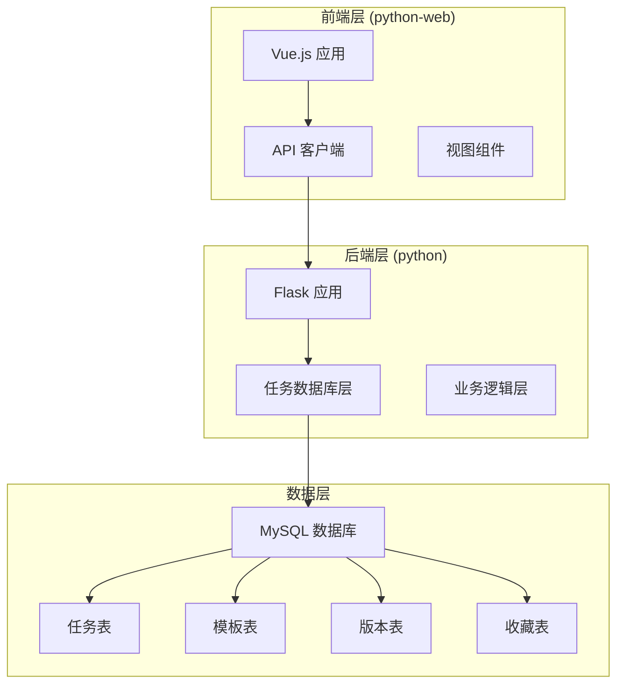
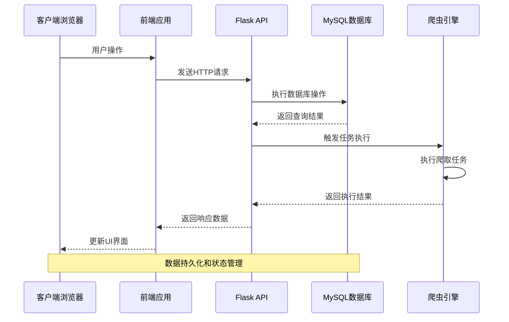
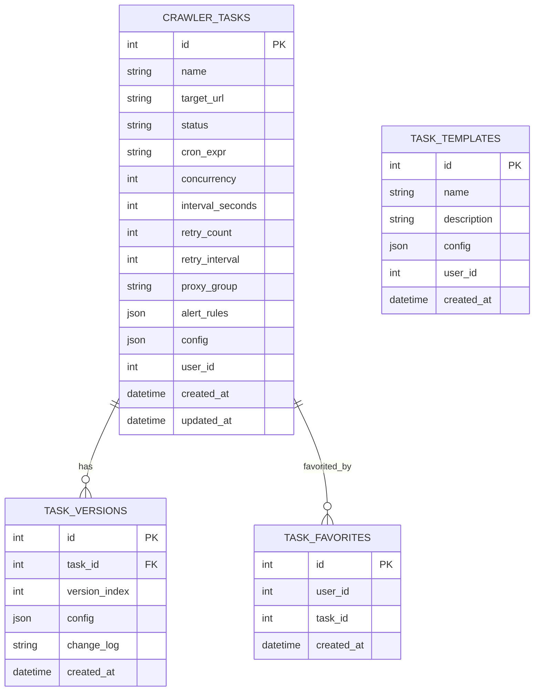
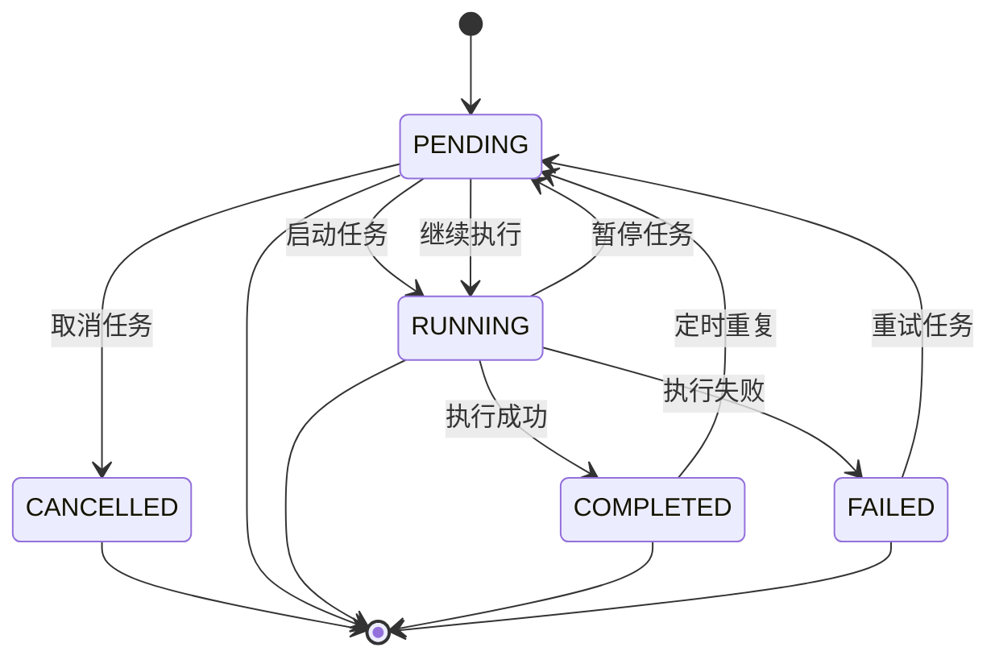
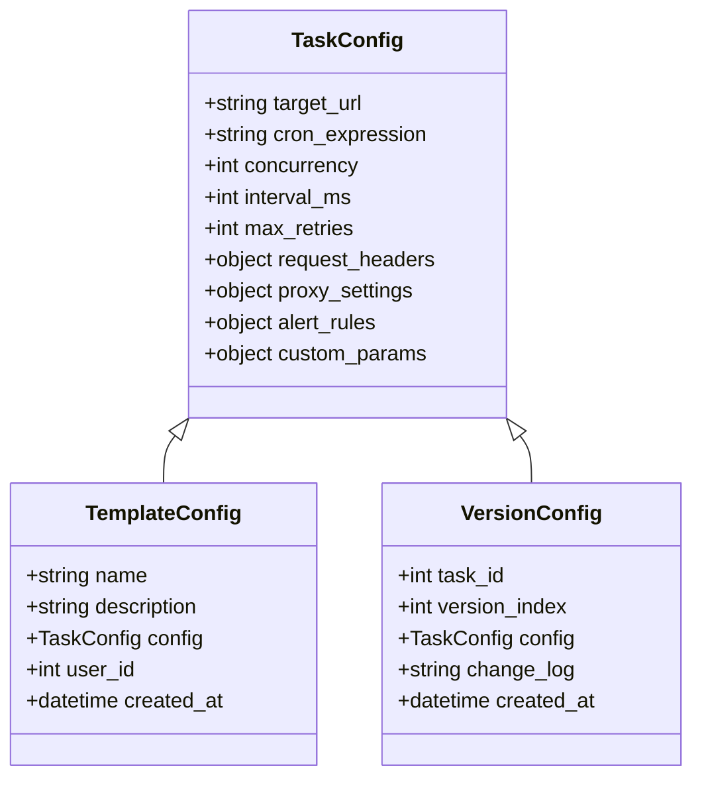
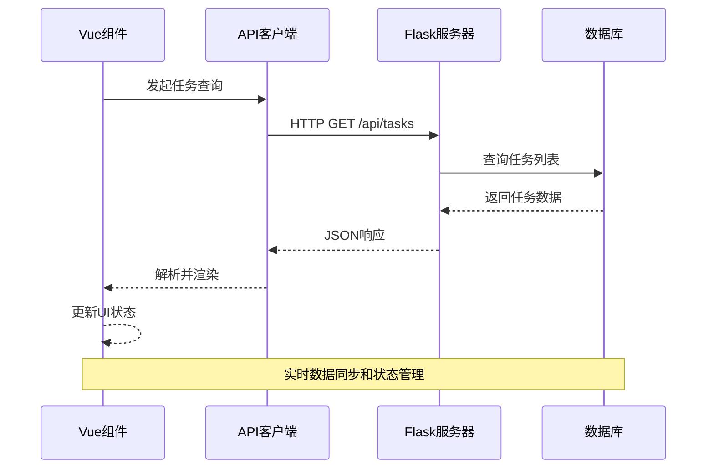
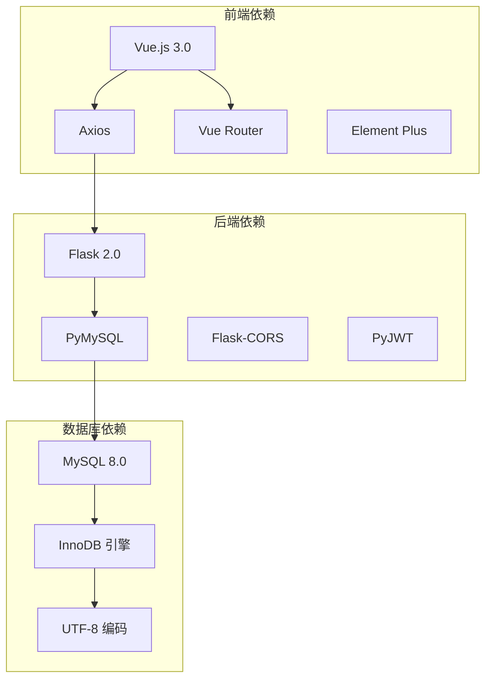

# 任务管理数据操作

<cite>
**本文档引用的文件**
- [task_db.py](file://python/task_db.py)
- [app.py](file://python/app.py)
- [task.js](file://python-web/src/api/task.js)
- [Tasks.vue](file://python-web/src/views/Tasks.vue)
- [TaskDetail.vue](file://python-web/src/views/TaskDetail.vue)
- [TaskTemplates.vue](file://python-web/src/views/TaskTemplates.vue)
- [index.js](file://python-web/src/api/index.js)
</cite>

## 目录
1. [简介](#简介)
2. [项目结构](#项目结构)
3. [核心组件](#核心组件)
4. [架构概览](#架构概览)
5. [详细组件分析](#详细组件分析)
6. [依赖关系分析](#依赖关系分析)
7. [性能考虑](#性能考虑)
8. [故障排除指南](#故障排除指南)
9. [结论](#结论)

## 简介

这是一个基于Flask和Vue.js构建的任务管理系统，专注于爬虫任务的全生命周期管理。系统提供了完整的任务创建、配置、执行、监控和历史追踪功能，支持任务模板、版本控制、收藏夹等高级特性。

该系统采用前后端分离架构，后端使用Python Flask提供RESTful API服务，前端使用Vue.js构建响应式用户界面。数据库采用MySQL存储任务相关的所有数据，包括任务配置、执行历史、模板和用户偏好设置。

## 项目结构

项目采用模块化组织方式，主要分为以下层次：

**图表来源**
- [app.py:1-50](file://python/app.py#L1-L50)
- [task_db.py:7-50](file://python/task_db.py#L7-L50)

**章节来源**
- [app.py:1-100](file://python/app.py#L1-L100)
- [task_db.py:1-120](file://python/task_db.py#L1-L120)

## 核心组件

### 数据库层 (TaskDB)

任务管理的核心是TaskDB类，它封装了所有与任务相关的数据库操作：

- **任务表 (crawler_tasks)**: 存储任务的基本信息、配置和状态
- **模板表 (task_templates)**: 存储可复用的任务配置模板
- **版本表 (task_versions)**: 跟踪任务配置的历史变更
- **收藏表 (task_favorites)**: 用户的个人任务收藏

每个组件都提供了完整的CRUD操作和查询功能，支持分页、过滤和排序。

**章节来源**
- [task_db.py:7-120](file://python/task_db.py#L7-L120)

### API 层

后端提供RESTful API接口，支持以下主要功能：

- 任务管理：创建、查询、更新、删除任务
- 模板管理：模板的创建、查询、更新、删除
- 版本管理：任务配置版本的查询和回滚
- 收藏管理：用户任务收藏的增删查
- 状态管理：任务执行状态的更新

**章节来源**
- [app.py:474-850](file://python/app.py#L474-L850)

### 前端组件层

前端使用Vue.js构建，包含多个专门的视图组件：

- **Tasks.vue**: 任务列表展示和管理
- **TaskDetail.vue**: 任务详情和配置编辑
- **TaskTemplates.vue**: 任务模板管理
- **task.js**: API客户端封装

**章节来源**
- [Tasks.vue:1-100](file://python-web/src/views/Tasks.vue#L1-L100)
- [TaskDetail.vue:1-100](file://python-web/src/views/TaskDetail.vue#L1-L100)
- [TaskTemplates.vue:1-100](file://python-web/src/views/TaskTemplates.vue#L1-L100)

## 架构概览

系统采用经典的三层架构设计：

**图表来源**
- [app.py:300-380](file://python/app.py#L300-L380)
- [task_db.py:120-200](file://python/task_db.py#L120-L200)

系统的关键特性包括：

1. **异步任务执行**: 支持后台任务的异步执行和状态跟踪
2. **实时状态更新**: 通过WebSocket实现任务状态的实时推送
3. **数据缓存**: 使用Redis进行热点数据缓存
4. **负载均衡**: 支持多实例部署和任务分发

## 详细组件分析

### 数据模型设计

系统采用关系型数据库设计，核心数据模型如下：

**图表来源**
- [task_db.py:51-111](file://python/task_db.py#L51-L111)

#### 任务状态管理

任务状态采用有限状态机设计，支持以下状态转换：

**图表来源**
- [task_db.py:56-68](file://python/task_db.py#L56-L68)

#### 任务配置结构

任务配置采用JSON格式存储，支持灵活的配置扩展：

**图表来源**
- [task_db.py:76-99](file://python/task_db.py#L76-L99)

### API 接口设计

系统提供完整的RESTful API接口，支持标准的CRUD操作：

#### 任务管理接口

| 方法 | 路径 | 功能 | 请求体 | 响应 |
|------|------|------|--------|------|
| GET | `/api/tasks` | 获取任务列表 | 查询参数: status, keyword, page, page_size | 任务数组 |
| POST | `/api/tasks` | 创建新任务 | 任务配置对象 | 任务ID |
| GET | `/api/tasks/:id` | 获取任务详情 | - | 任务对象 |
| PUT | `/api/tasks/:id` | 更新任务 | 部分任务配置 | 成功/失败 |
| DELETE | `/api/tasks/:id` | 删除任务 | - | 成功/失败 |
| POST | `/api/tasks/:id/start` | 启动任务 | - | 执行状态 |
| POST | `/api/tasks/:id/stop` | 停止任务 | - | 执行状态 |

#### 模板管理接口

| 方法 | 路径 | 功能 | 请求体 | 响应 |
|------|------|------|--------|------|
| GET | `/api/tasks/templates` | 获取模板列表 | - | 模板数组 |
| POST | `/api/tasks/templates` | 创建模板 | 模板配置 | 模板ID |
| GET | `/api/tasks/templates/:id` | 获取模板详情 | - | 模板对象 |
| DELETE | `/api/tasks/templates/:id` | 删除模板 | - | 成功/失败 |

#### 版本管理接口

| 方法 | 路径 | 功能 | 请求体 | 响应 |
|------|------|------|--------|------|
| GET | `/api/tasks/:id/versions` | 获取版本历史 | - | 版本数组 |
| POST | `/api/tasks/:id/versions/rollback` | 回滚到指定版本 | version_id | 回滚结果 |

**章节来源**
- [app.py:474-850](file://python/app.py#L474-L850)

### 前端组件交互

前端组件通过API客户端与后端进行数据交互：

**图表来源**
- [task.js:1-67](file://python-web/src/api/task.js#L1-L67)
- [index.js:1-95](file://python-web/src/api/index.js#L1-L95)

**章节来源**
- [Tasks.vue:238-260](file://python-web/src/views/Tasks.vue#L238-L260)
- [TaskDetail.vue:174-314](file://python-web/src/views/TaskDetail.vue#L174-L314)

## 依赖关系分析

系统各组件之间的依赖关系如下：

**图表来源**
- [app.py:1-20](file://python/app.py#L1-L20)
- [task_db.py:1-10](file://python/task_db.py#L1-L10)

### 外部依赖

系统的主要外部依赖包括：

1. **数据库连接**: PyMySQL用于MySQL数据库连接
2. **Web框架**: Flask提供RESTful API服务
3. **前端框架**: Vue.js构建用户界面
4. **HTTP客户端**: Axios处理API请求
5. **跨域支持**: Flask-CORS处理CORS请求

**章节来源**
- [app.py:1-15](file://python/app.py#L1-L15)
- [task_db.py:1-5](file://python/task_db.py#L1-L5)

## 性能考虑

### 数据库优化

系统采用了多项数据库优化策略：

1. **索引优化**: 在常用查询字段上建立索引
   - `status` 字段索引用于状态查询
   - `user_id` 字段索引用于用户隔离
   - `name` 字段索引用于任务名称搜索

2. **查询优化**: 使用参数化查询防止SQL注入
3. **连接池**: 使用连接池管理数据库连接
4. **分页查询**: 支持大数据量的分页查询

### 缓存策略

系统实现了多层次的缓存策略：

1. **Redis缓存**: 缓存热点数据和会话信息
2. **浏览器缓存**: 前端静态资源缓存
3. **数据库查询缓存**: MySQL查询缓存优化

### 并发处理

系统支持高并发访问：

1. **异步任务队列**: 使用Celery处理后台任务
2. **连接池**: 数据库连接池管理
3. **负载均衡**: 支持多实例部署
4. **限流机制**: 防止系统过载

## 故障排除指南

### 常见问题及解决方案

#### 数据库连接问题

**症状**: API请求返回数据库连接错误
**原因**: 数据库服务未启动或连接配置错误
**解决方案**:
1. 检查MySQL服务状态
2. 验证数据库连接配置
3. 确认防火墙设置

#### API认证失败

**症状**: 返回401未授权错误
**原因**: 访问令牌过期或无效
**解决方案**:
1. 使用刷新令牌获取新的访问令牌
2. 检查本地存储的令牌状态
3. 重新登录获取新令牌

#### 任务执行异常

**症状**: 任务状态长时间保持PENDING
**原因**: 爬虫引擎未正确启动
**解决方案**:
1. 检查爬虫引擎服务状态
2. 查看任务日志获取详细错误信息
3. 验证任务配置的有效性

**章节来源**
- [app.py:126-140](file://python/app.py#L126-L140)
- [task_db.py:120-171](file://python/task_db.py#L120-L171)

### 调试工具

系统提供了多种调试工具：

1. **日志系统**: 完整的请求和错误日志记录
2. **健康检查**: 系统状态监控和健康检查接口
3. **性能监控**: 数据库查询性能和响应时间监控
4. **错误报告**: 自动化的错误收集和报告机制

## 结论

这个任务管理系统提供了完整的企业级任务管理解决方案，具有以下优势：

1. **完整的功能覆盖**: 从任务创建到执行监控的全流程管理
2. **灵活的配置系统**: 支持复杂的任务配置和模板复用
3. **强大的扩展性**: 模块化设计支持功能扩展和定制
4. **良好的用户体验**: 响应式前端界面和实时状态更新
5. **可靠的性能表现**: 多层优化确保系统稳定运行

系统采用现代化的技术栈和最佳实践，为企业级应用提供了坚实的基础。通过合理的架构设计和完善的API接口，开发者可以轻松地集成和扩展系统的各项功能。

未来可以考虑的功能增强包括：
- 更丰富的任务调度算法
- 更细粒度的权限控制
- 更强大的数据分析功能
- 更完善的监控和告警系统
- 更好的移动端支持