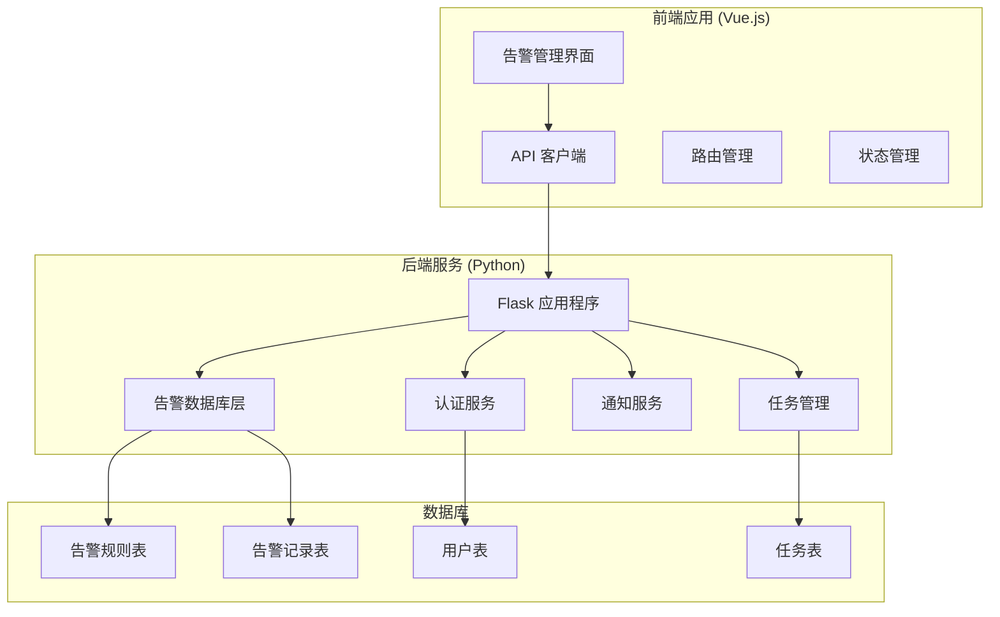
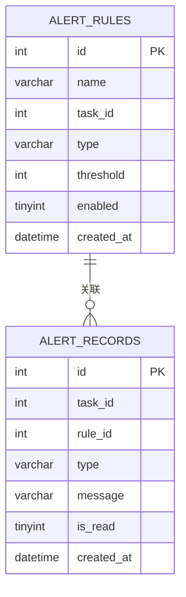
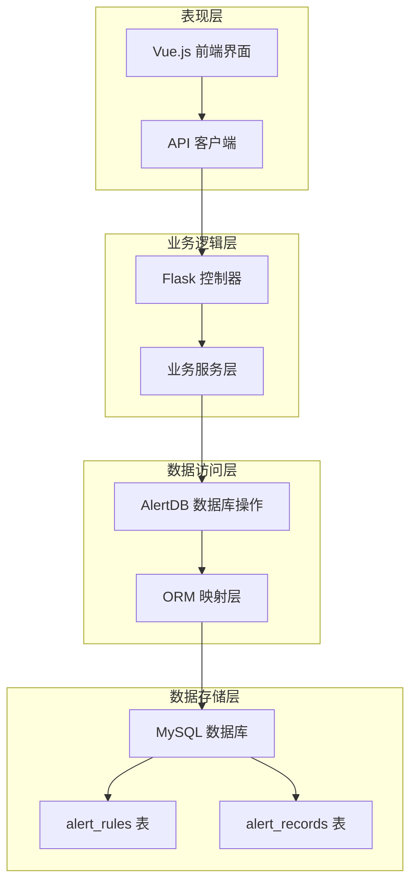
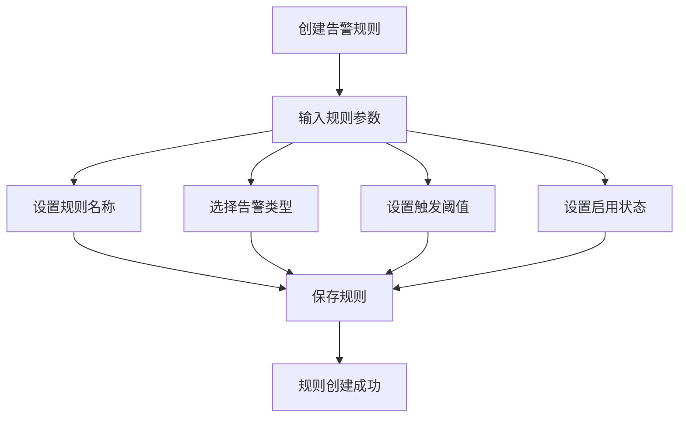
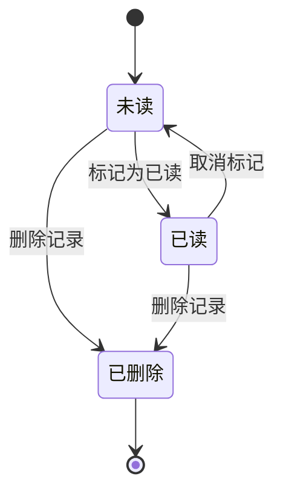
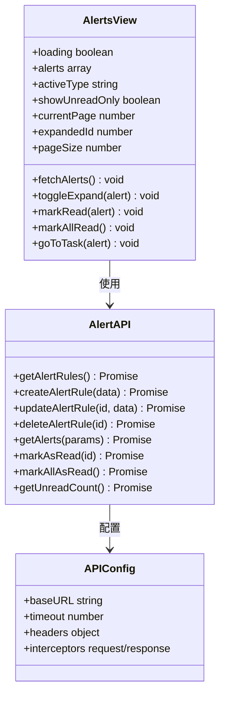
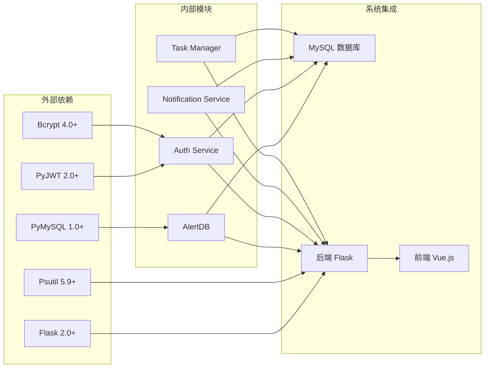
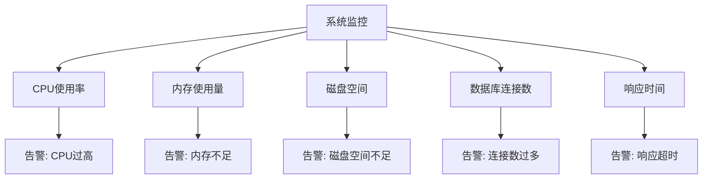

# 告警系统数据操作

<cite>
**本文档引用的文件**
- [alert_db.py](file://python/alert_db.py)
- [app.py](file://python/app.py)
- [alert.js](file://python-web/src/api/alert.js)
- [Alerts.vue](file://python-web/src/views/Alerts.vue)
- [index.js](file://python-web/src/api/index.js)
- [requirements.txt](file://python/requirements.txt)
</cite>

## 目录
1. [简介](#简介)
2. [项目结构](#项目结构)
3. [核心组件](#核心组件)
4. [架构概览](#架构概览)
5. [详细组件分析](#详细组件分析)
6. [依赖关系分析](#依赖关系分析)
7. [性能考虑](#性能考虑)
8. [故障排除指南](#故障排除指南)
9. [结论](#结论)

## 简介

本告警系统是一个基于Python Flask框架构建的完整告警管理解决方案，提供了告警规则配置、告警记录管理、状态跟踪和通知集成等功能。系统采用前后端分离架构，后端使用Flask提供RESTful API，前端使用Vue.js构建用户界面。

系统的核心功能包括：
- 告警规则的创建、查询、更新和删除
- 告警记录的存储、查询和状态管理
- 实时告警通知和历史记录查询
- 用户友好的Web界面管理
- 数据库连接管理和事务处理

## 项目结构

告警系统采用模块化的项目结构，主要分为以下几个部分：

**图表来源**
- [app.py:18-35](file://python/app.py#L18-L35)
- [alert_db.py:6-314](file://python/alert_db.py#L6-L314)

**章节来源**
- [app.py:18-35](file://python/app.py#L18-L35)
- [requirements.txt:1-14](file://python/requirements.txt#L1-14)

## 核心组件

### 数据库层 (AlertDB)

AlertDB是告警系统的核心数据库操作层，负责处理所有与告警相关的数据操作。该类提供了完整的CRUD操作和高级查询功能。

#### 主要特性：
- 自动数据库和表结构初始化
- 告警规则管理（增删改查）
- 告警记录管理（增删改查）
- 分页查询和条件过滤
- 未读状态统计

#### 数据表结构：

**图表来源**
- [alert_db.py:50-81](file://python/alert_db.py#L50-L81)

**章节来源**
- [alert_db.py:6-314](file://python/alert_db.py#L6-L314)

### Web API 层

系统提供了完整的RESTful API接口，支持告警规则和告警记录的管理操作。

#### 告警规则API：
- `GET /api/alerts/rules` - 获取告警规则列表
- `POST /api/alerts/rules` - 创建新的告警规则
- `PUT /api/alerts/rules/<rule_id>` - 更新告警规则
- `DELETE /api/alerts/rules/<rule_id>` - 删除告警规则

#### 告警记录API：
- `GET /api/alerts` - 获取告警记录列表
- `PUT /api/alerts/<alert_id>/read` - 标记告警为已读
- `PUT /api/alerts/read-all` - 标记所有告警为已读
- `GET /api/alerts/unread-count` - 获取未读告警数量

**章节来源**
- [app.py:853-1039](file://python/app.py#L853-L1039)

### 前端管理界面

前端使用Vue.js构建，提供了直观的告警管理界面，支持：
- 告警列表的分页显示
- 告警类型的筛选
- 未读状态的标记
- 告警详情的展开查看
- 批量操作功能

**章节来源**
- [Alerts.vue:1-540](file://python-web/src/views/Alerts.vue#L1-L540)

## 架构概览

告警系统采用分层架构设计，确保了良好的可维护性和扩展性：

**图表来源**
- [app.py:1-1719](file://python/app.py#L1-L1719)
- [alert_db.py:6-314](file://python/alert_db.py#L6-L314)

## 详细组件分析

### 告警规则管理系统

告警规则是系统的核心配置，用于定义何时触发告警以及如何处理告警。

#### 规则类型定义：

| 类型 | 描述 | 触发条件 |
|------|------|----------|
| task_failed | 任务失败 | 任务执行失败次数超过阈值 |
| timeout | 请求超时 | 请求响应时间超过设定阈值 |
| data_error | 数据异常 | 数据解析或处理出现错误 |
| ip_blocked | IP被封 | 代理IP被目标网站封禁 |

#### 规则配置参数：

**图表来源**
- [alert_db.py:93-117](file://python/alert_db.py#L93-L117)
- [app.py:871-896](file://python/app.py#L871-L896)

**章节来源**
- [alert_db.py:93-181](file://python/alert_db.py#L93-L181)
- [app.py:855-956](file://python/app.py#L855-L956)

### 告警记录管理系统

告警记录用于存储系统产生的所有告警信息，支持完整的生命周期管理。

#### 记录状态管理：

#### 查询和过滤功能：

系统支持多种查询条件组合：
- 按任务ID过滤
- 按告警类型过滤  
- 按已读状态过滤
- 分页查询和排序

**章节来源**
- [alert_db.py:199-314](file://python/alert_db.py#L199-L314)
- [app.py:959-1039](file://python/app.py#L959-L1039)

### 前端告警管理界面

前端界面提供了丰富的交互功能，支持用户对告警进行高效管理。

#### 界面功能特性：

**图表来源**
- [Alerts.vue:138-220](file://python-web/src/views/Alerts.vue#L138-L220)
- [alert.js:3-35](file://python-web/src/api/alert.js#L3-L35)
- [index.js:3-95](file://python-web/src/api/index.js#L3-L95)

**章节来源**
- [Alerts.vue:1-540](file://python-web/src/views/Alerts.vue#L1-L540)
- [alert.js:1-35](file://python-web/src/api/alert.js#L1-L35)
- [index.js:1-95](file://python-web/src/api/index.js#L1-L95)

## 依赖关系分析

告警系统的主要依赖关系如下：

**图表来源**
- [requirements.txt:1-14](file://python/requirements.txt#L1-L14)
- [app.py:1-15](file://python/app.py#L1-L15)

**章节来源**
- [requirements.txt:1-14](file://python/requirements.txt#L1-L14)
- [app.py:1-15](file://python/app.py#L1-L15)

## 性能考虑

### 数据库优化策略

1. **索引优化**：
   - 在`alert_rules`表上建立复合索引
   - 在`alert_records`表上建立多列索引
   - 优化常用查询条件的索引策略

2. **查询优化**：
   - 使用分页查询避免大量数据传输
   - 实现条件过滤减少不必要的数据加载
   - 缓存常用的查询结果

3. **连接管理**：
   - 实现连接池管理
   - 合理的连接超时设置
   - 异常连接的自动重连机制

### 前端性能优化

1. **虚拟滚动**：
   - 对大量告警记录实现虚拟滚动
   - 减少DOM元素数量提升渲染性能

2. **懒加载**：
   - 告警详情的按需加载
   - 图标和图片的延迟加载

3. **状态缓存**：
   - 本地状态缓存减少API调用
   - 防抖和节流优化用户交互

### 系统监控

**章节来源**
- [app.py:1555-1590](file://python/app.py#L1555-L1590)

## 故障排除指南

### 常见问题及解决方案

#### 数据库连接问题
- **症状**：API调用失败，数据库连接超时
- **原因**：数据库服务不可用或连接池耗尽
- **解决方案**：检查数据库服务状态，调整连接池配置

#### 权限认证问题
- **症状**：401未授权错误
- **原因**：访问令牌过期或无效
- **解决方案**：使用刷新令牌获取新的访问令牌

#### 告警规则冲突
- **症状**：告警规则创建失败
- **原因**：规则配置不符合要求
- **解决方案**：检查规则名称、类型和阈值的有效性

#### 前端界面问题
- **症状**：告警列表显示异常
- **原因**：API响应格式不匹配
- **解决方案**：检查API接口版本兼容性

**章节来源**
- [app.py:855-1039](file://python/app.py#L855-L1039)
- [alert_db.py:93-181](file://python/alert_db.py#L93-L181)

## 结论

告警系统通过其模块化的设计和完善的API接口，为用户提供了一个功能完整、易于使用的告警管理解决方案。系统的主要优势包括：

1. **完整的功能覆盖**：从规则配置到记录管理，提供了一站式的告警管理体验
2. **良好的扩展性**：清晰的架构设计便于功能扩展和定制
3. **用户友好**：直观的前端界面和丰富的交互功能
4. **性能优化**：合理的数据库设计和查询优化策略
5. **可靠性保障**：完善的错误处理和监控机制

该系统适用于各种规模的企业级应用场景，能够有效帮助用户及时发现和处理系统中的异常情况，提升系统的稳定性和可靠性。