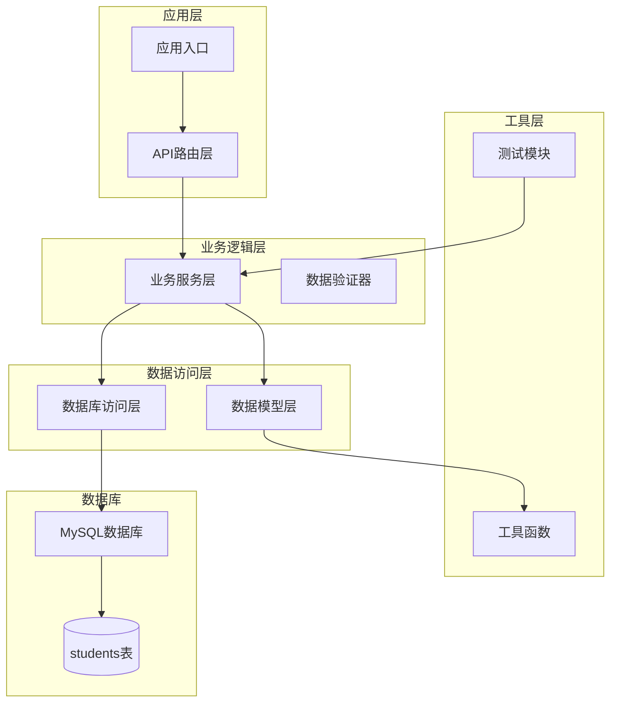
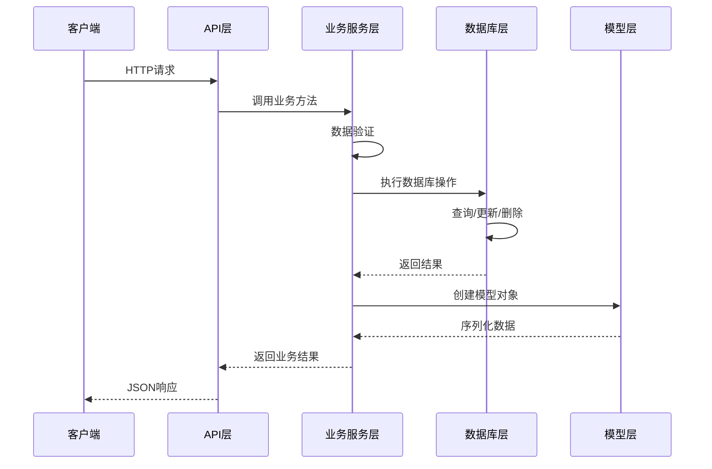
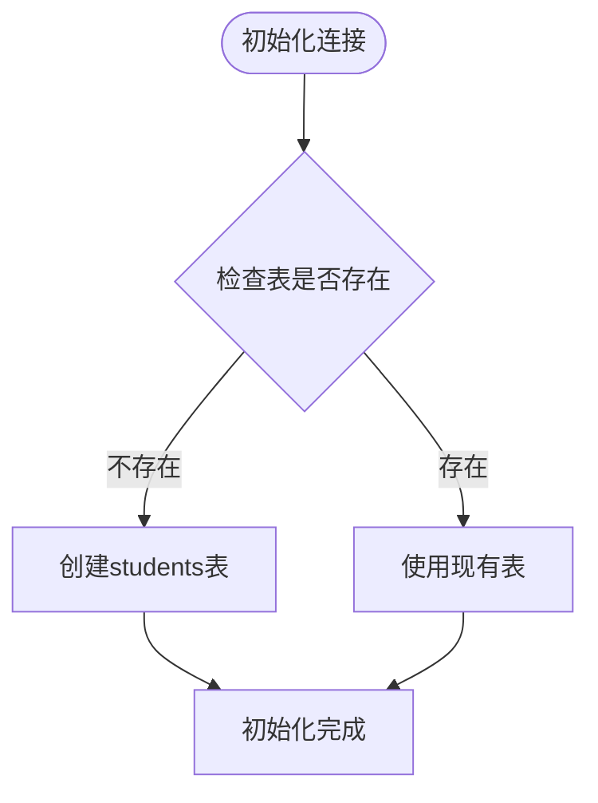
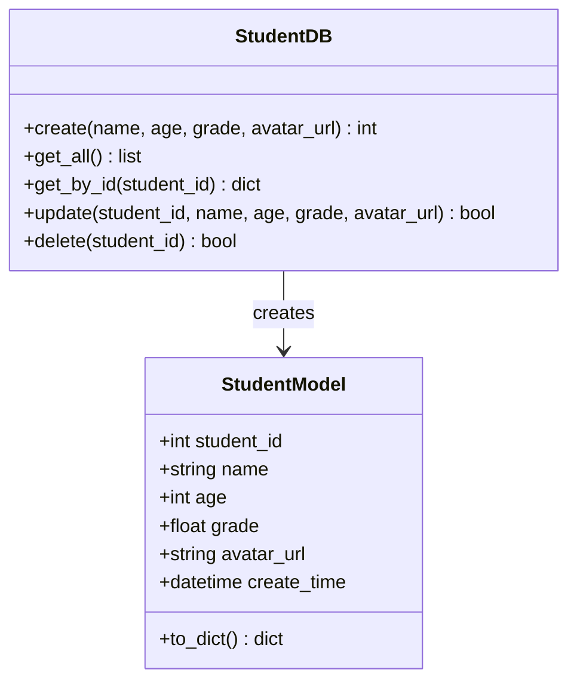
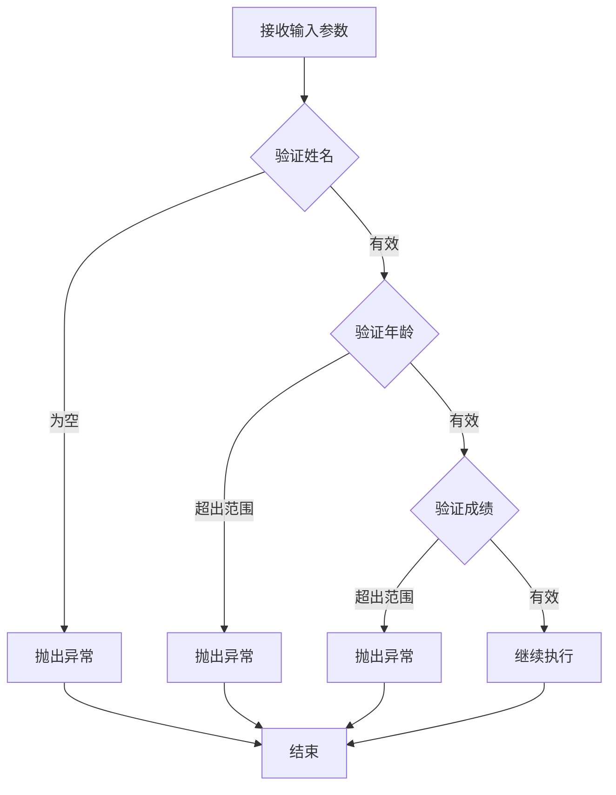
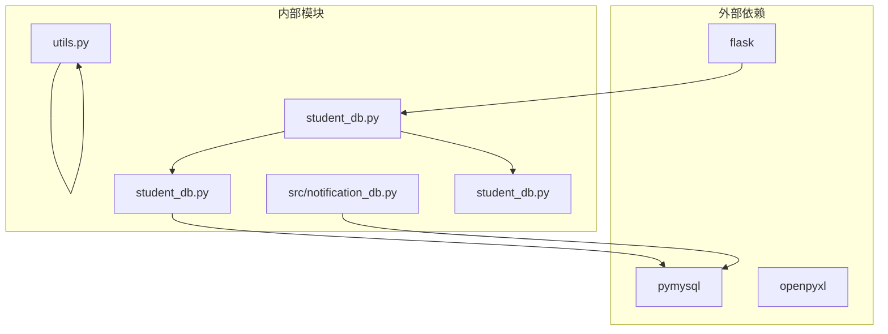

# 学生数据操作

<cite>
**本文档引用的文件**
- [student_db.py](file://python/src/student_db.py)
- [models.py](file://python/src/models.py)
- [utils.py](file://python/src/utils.py)
- [app_db.py](file://python/app_db.py)
- [test_models.py](file://python/tests/test_models.py)
- [test_utils.py](file://python/tests/test_utils.py)
- [main.py](file://python/main.py)
- [notification_db.py](file://python/src/notification_db.py)
</cite>

## 目录
1. [简介](#简介)
2. [项目结构](#项目结构)
3. [核心组件](#核心组件)
4. [架构概览](#架构概览)
5. [详细组件分析](#详细组件分析)
6. [依赖关系分析](#依赖关系分析)
7. [性能考虑](#性能考虑)
8. [故障排除指南](#故障排除指南)
9. [结论](#结论)

## 简介

本项目是一个基于Python的完整学生数据管理系统，提供了RESTful API接口用于学生信息的增删改查操作。系统采用Flask框架构建，使用MySQL作为数据存储，实现了完整的CRUD操作、数据验证、批量操作和统计功能。

该系统的核心功能包括：
- 学生信息的完整CRUD操作
- 数据验证规则（姓名非空、年龄1-150、成绩0-100）
- 批量删除和统计计算
- 完整的错误处理和异常管理
- 数据库连接管理和事务处理

## 项目结构

项目采用模块化设计，主要包含以下核心模块：



**图表来源**
- [app_db.py:336-462](file://python/app_db.py#L336-L462)
- [student_db.py:5-259](file://python/src/student_db.py#L5-L259)

**章节来源**
- [app_db.py:1-726](file://python/app_db.py#L1-L726)
- [student_db.py:1-259](file://python/src/student_db.py#L1-L259)

## 核心组件

### StudentDB 数据访问层

StudentDB类是整个系统的核心数据访问组件，负责与MySQL数据库进行交互。它实现了完整的CRUD操作和扩展功能。

**主要特性：**
- 自动初始化数据库表结构
- 支持单条和批量数据操作
- 内置数据存在性检查
- 基础的统计查询功能

**章节来源**
- [student_db.py:5-138](file://python/src/student_db.py#L5-L138)

### StudentModel 数据模型

StudentModel类定义了学生实体的数据结构和行为，提供了数据序列化功能。

**核心属性：**
- student_id: 学生唯一标识符
- name: 学生姓名
- age: 学生年龄
- grade: 学生成绩
- avatar_url: 头像URL
- create_time: 创建时间

**章节来源**
- [student_db.py:140-157](file://python/src/student_db.py#L140-L157)

### StudentService 业务逻辑层

StudentService类是业务逻辑的核心，负责数据验证、业务规则执行和跨多个数据访问操作的协调。

**主要职责：**
- 实施数据验证规则
- 协调数据库操作
- 提供高级业务功能
- 错误处理和异常管理

**章节来源**
- [student_db.py:160-259](file://python/src/student_db.py#L160-L259)

## 架构概览

系统采用经典的三层架构设计，清晰分离了关注点：



**图表来源**
- [app_db.py:338-461](file://python/app_db.py#L338-L461)
- [student_db.py:160-259](file://python/src/student_db.py#L160-L259)

## 详细组件分析

### StudentDB 类详细分析

StudentDB类实现了完整的数据库操作功能：

#### 数据库初始化


**图表来源**
- [student_db.py:17-30](file://python/src/student_db.py#L17-L30)

#### CRUD操作实现

**创建操作 (create):**
- 插入新学生记录
- 自动设置创建和更新时间
- 返回新记录的ID

**查询操作 (get_all, get_by_id, get_by_name):**
- 支持全量查询、按ID查询、按姓名模糊查询
- 返回标准化的数据结构

**更新操作 (update):**
- 支持部分字段更新
- 动态构建SQL语句
- 自动更新时间戳

**删除操作 (delete, delete_batch):**
- 支持单条和批量删除
- 返回受影响的记录数量

**章节来源**
- [student_db.py:32-124](file://python/src/student_db.py#L32-L124)

### StudentModel 类分析

StudentModel类提供了数据模型的完整实现：



**图表来源**
- [student_db.py:140-157](file://python/src/student_db.py#L140-L157)
- [student_db.py:32-124](file://python/src/student_db.py#L32-L124)

**to_dict方法用途：**
- 将模型对象转换为字典格式
- 便于JSON序列化和API响应
- 统一数据输出格式

**章节来源**
- [student_db.py:149-157](file://python/src/student_db.py#L149-L157)

### StudentService 类详细分析

StudentService类实现了业务逻辑的核心功能：

#### 数据验证规则

**姓名验证：**
- 必须非空
- 去除首尾空白字符后不能为空

**年龄验证：**
- 必须在1-150范围内
- 支持整数验证

**成绩验证：**
- 必须在0-100范围内
- 支持浮点数验证



**图表来源**
- [student_db.py:164-216](file://python/src/student_db.py#L164-L216)

#### 批量删除功能

**批量删除流程：**
1. 验证传入的ID列表
2. 过滤存在的学生ID
3. 执行批量删除操作
4. 返回删除结果

**章节来源**
- [student_db.py:230-234](file://python/src/student_db.py#L230-L234)

#### 统计计算功能

**统计指标：**
- 总学生数
- 平均年龄
- 平均成绩
- 最高成绩
- 最低成绩

**统计算法：**
- 使用内置函数计算平均值
- 使用内置函数找到极值
- 处理空数据集的情况

**章节来源**
- [student_db.py:236-256](file://python/src/student_db.py#L236-L256)

### API路由层分析

系统提供了完整的RESTful API接口：

```mermaid
graph LR
subgraph "学生管理API"
GET_ALL[GET /students<br/>获取所有学生]
GET_BY_ID[GET /students/{id}<br/>按ID获取学生]
SEARCH[GET /students/search<br/>按姓名搜索]
CREATE[POST /students<br/>创建学生]
UPDATE[PUT /students/{id}<br/>更新学生]
DELETE[DELETE /students/{id}<br/>删除学生]
BATCH_DELETE[DELETE /students/batch<br/>批量删除]
STATS[GET /students/statistics<br/>统计信息]
end
subgraph "文件操作API"
UPLOAD[POST /upload<br/>文件上传]
EXPORT[GET /students/export<br/>导出Excel]
IMPORT[POST /students/import<br/>导入CSV]
end
```

**图表来源**
- [app_db.py:338-461](file://python/app_db.py#L338-L461)

**API响应格式：**
- 成功响应：包含code、message、data字段
- 错误响应：包含相应的HTTP状态码和错误信息

**章节来源**
- [app_db.py:338-461](file://python/app_db.py#L338-L461)

## 依赖关系分析

系统采用松耦合的设计，各组件之间的依赖关系清晰：



**图表来源**
- [student_db.py:1-2](file://python/src/student_db.py#L1-L2)
- [app_db.py:9](file://python/app_db.py#L9)

**依赖特点：**
- StudentDB直接依赖pymysql进行数据库操作
- StudentService依赖StudentDB进行数据访问
- API层依赖StudentService进行业务处理
- 各模块间保持单一职责原则

**章节来源**
- [student_db.py:1-2](file://python/src/student_db.py#L1-L2)
- [app_db.py:9](file://python/app_db.py#L9)

## 性能考虑

### 数据库优化策略

**索引设计：**
- 主键索引自动创建（id字段）
- 建议为常用查询字段添加索引
- 考虑在name字段上创建索引以优化搜索

**查询优化：**
- 使用参数化查询防止SQL注入
- 批量操作使用IN子句减少查询次数
- 合理使用LIMIT限制返回结果数量

### 缓存策略

**建议实现：**
- 对频繁查询的结果进行缓存
- 实现LRU缓存机制
- 设置合理的缓存过期时间

### 连接池管理

**当前实现：**
- 每次操作创建新的数据库连接
- 建议实现连接池以提高性能

## 故障排除指南

### 常见错误类型

**数据库连接错误：**
- 检查MySQL服务器是否启动
- 验证连接参数配置
- 确认数据库权限设置

**数据验证错误：**
- 姓名为空或只包含空白字符
- 年龄不在有效范围内
- 成绩不在有效范围内

**数据不存在错误：**
- 尝试操作不存在的学生ID
- 检查数据库中是否存在对应记录

### 异常处理机制

**错误分类：**
- ValueError: 数据验证失败
- 数据库操作异常
- 文件操作异常

**处理策略：**
- 统一的异常捕获和处理
- 返回友好的错误信息
- 记录详细的错误日志

**章节来源**
- [student_db.py:164-228](file://python/src/student_db.py#L164-L228)
- [app_db.py:357-432](file://python/app_db.py#L357-L432)

### 调试技巧

**开发环境调试：**
- 启用Flask的debug模式
- 使用浏览器开发者工具查看网络请求
- 检查服务器端控制台输出

**生产环境监控：**
- 实现详细的日志记录
- 监控数据库连接状态
- 设置性能指标监控

## 结论

本学生数据管理系统提供了完整、健壮的学生信息管理解决方案。系统采用清晰的分层架构设计，实现了以下关键特性：

**技术优势：**
- 清晰的职责分离和模块化设计
- 完善的数据验证和错误处理机制
- 支持批量操作和统计计算
- RESTful API设计符合现代Web标准

**业务价值：**
- 提供完整的CRUD操作能力
- 支持多种数据导入导出格式
- 实现了必要的业务规则验证
- 具备良好的扩展性和维护性

**改进建议：**
- 实现数据库连接池管理
- 添加缓存机制提升性能
- 增强日志记录和监控功能
- 考虑添加数据备份和恢复机制

该系统为学生信息管理提供了坚实的技术基础，可以根据具体需求进一步扩展和完善。