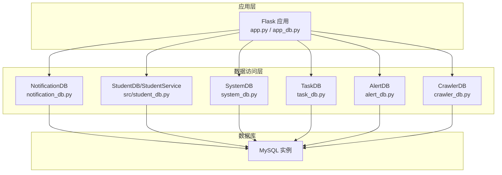
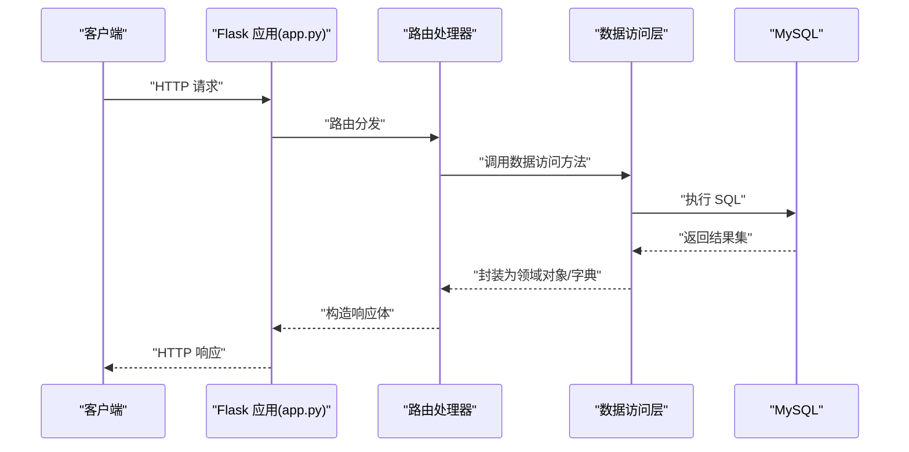
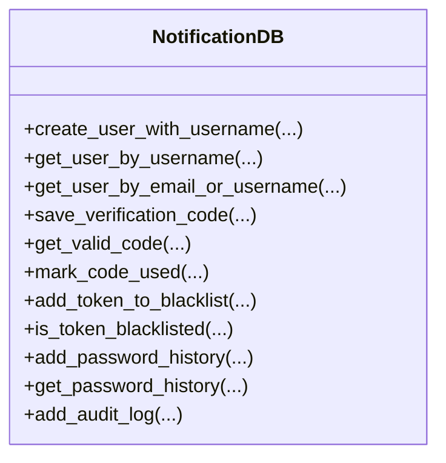
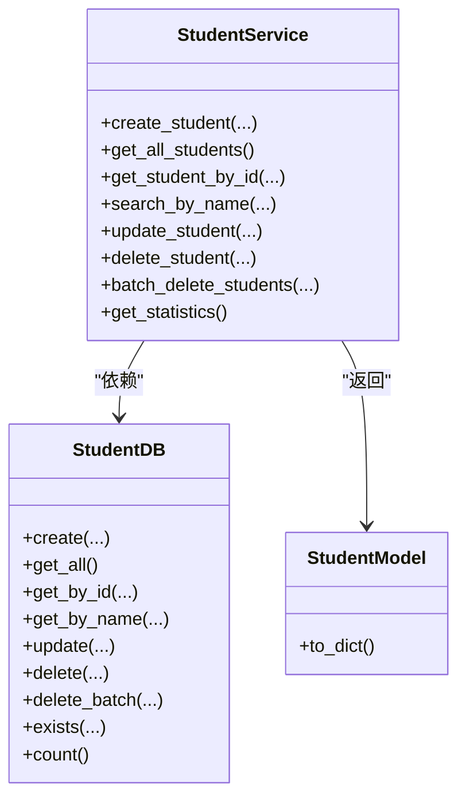
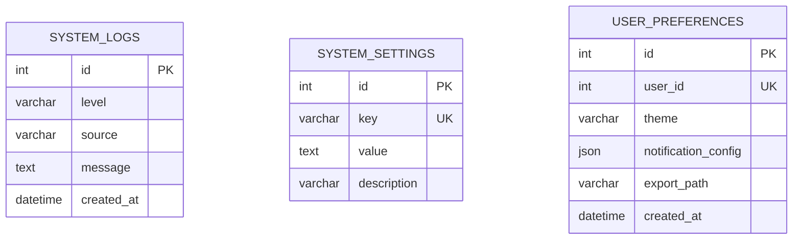
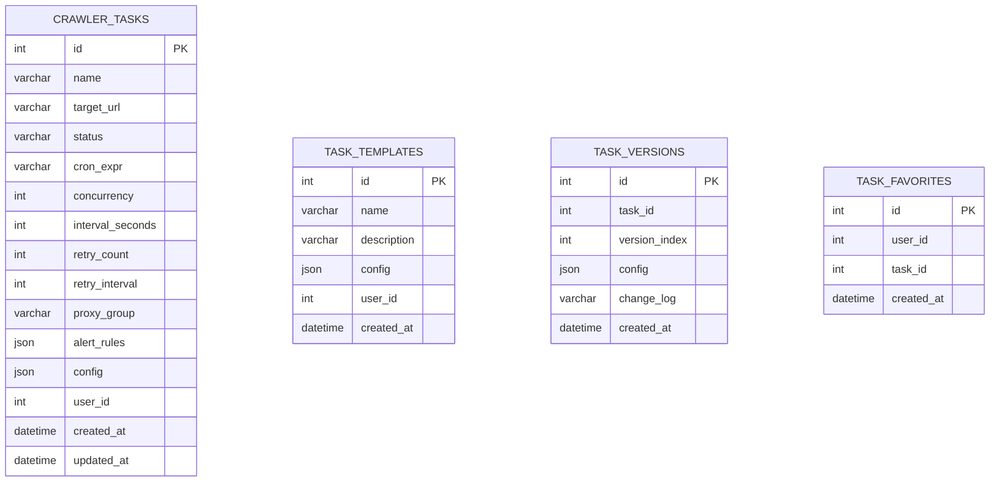
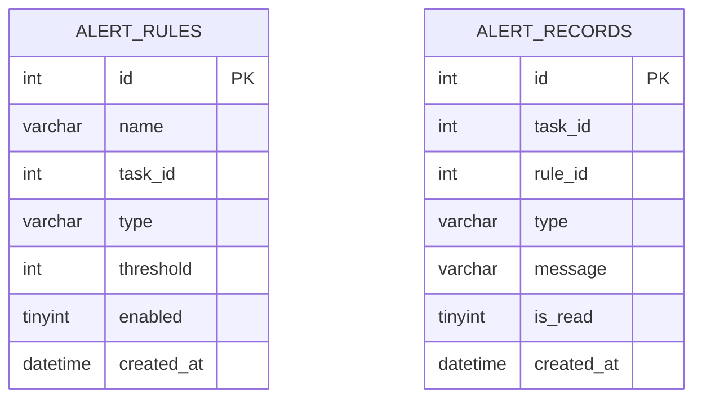
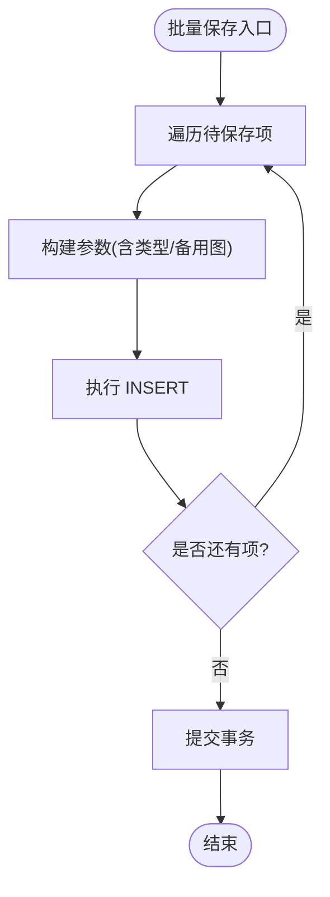
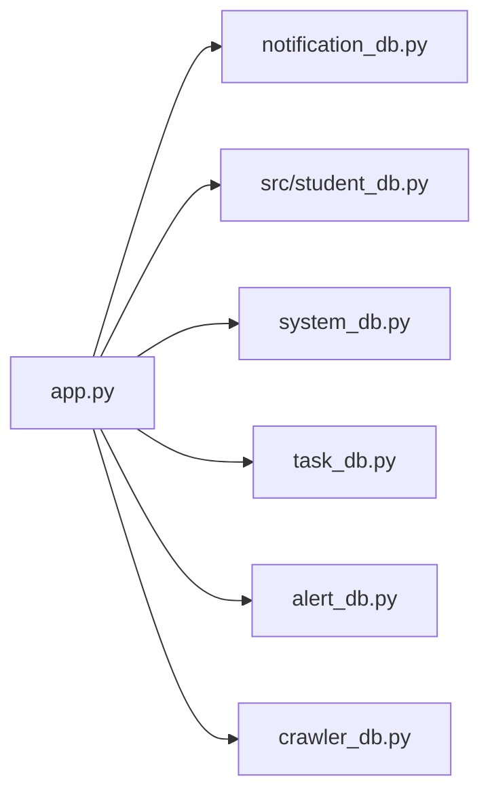

# 数据库操作

<cite>
**本文引用的文件**
- [app_db.py](file://python/app_db.py)
- [student_db.py](file://python/src/student_db.py)
- [notification_db.py](file://python/src/notification_db.py)
- [system_db.py](file://python/system_db.py)
- [task_db.py](file://python/task_db.py)
- [alert_db.py](file://python/alert_db.py)
- [crawler_db.py](file://python/crawler_db.py)
- [add_column.py](file://python/add_column.py)
- [app.py](file://python/app.py)
- [models.py](file://python/src/models.py)
</cite>

## 目录
1. [简介](#简介)
2. [项目结构](#项目结构)
3. [核心组件](#核心组件)
4. [架构总览](#架构总览)
5. [详细组件分析](#详细组件分析)
6. [依赖分析](#依赖分析)
7. [性能考虑](#性能考虑)
8. [故障排查指南](#故障排查指南)
9. [结论](#结论)
10. [附录](#附录)

## 简介
本文件面向开发者，系统化梳理项目中的数据库操作与相关能力，覆盖以下主题：
- 连接池与连接管理：现有实现采用直接连接方式，未使用连接池；建议在生产环境引入连接池。
- 事务处理机制：当前未显式使用事务控制；建议在需要一致性的写入场景中引入事务。
- ORM 使用模式：未使用 ORM；建议统一使用 SQLAlchemy 或 Peewee 提升可维护性。
- 数据表封装与 CRUD：各模块均提供独立的数据访问类，封装了增删改查与批量处理。
- 数据验证与约束：业务层进行输入校验，数据库层面通过唯一索引、非空约束等保障一致性。
- 索引优化策略：针对高频查询字段建立索引，避免全表扫描。
- 迁移与兼容：提供表结构自动创建与列兼容性处理脚本。
- 备份与恢复：建议结合数据库工具进行定期备份与恢复演练。
- 性能监控：建议接入慢查询日志、连接数监控与查询执行计划分析。

## 项目结构
项目采用按功能域划分的模块化组织方式，数据库相关能力分布在多个独立模块中：
- 认证与审计：notification_db.py
- 学生管理：src/student_db.py
- 系统监控：system_db.py
- 任务管理：task_db.py
- 告警管理：alert_db.py
- 爬虫数据：crawler_db.py
- 应用入口与路由：app.py、app_db.py
- 表结构兼容脚本：add_column.py

**图表来源**
- [app.py](file://python/app.py)
- [app_db.py](file://python/app_db.py)
- [notification_db.py](file://python/src/notification_db.py)
- [student_db.py](file://python/src/student_db.py)
- [system_db.py](file://python/system_db.py)
- [task_db.py](file://python/task_db.py)
- [alert_db.py](file://python/alert_db.py)
- [crawler_db.py](file://python/crawler_db.py)

**章节来源**
- [app.py](file://python/app.py)
- [app_db.py](file://python/app_db.py)
- [notification_db.py](file://python/src/notification_db.py)
- [student_db.py](file://python/src/student_db.py)
- [system_db.py](file://python/system_db.py)
- [task_db.py](file://python/task_db.py)
- [alert_db.py](file://python/alert_db.py)
- [crawler_db.py](file://python/crawler_db.py)

## 核心组件
- NotificationDB：用户、验证码、令牌黑名单、密码历史、审计日志等表的封装，提供连接重试与自动初始化。
- StudentDB/StudentService：学生表的 CRUD 与统计，服务层负责业务校验与模型转换。
- SystemDB：系统日志、系统设置、用户偏好设置的增删改查与分页查询。
- TaskDB：爬虫任务、模板、版本、收藏的管理，支持状态更新与版本回滚。
- AlertDB：告警规则与告警记录的增删改查、分页与未读计数。
- CrawlerDB：爬虫数据表的自动建表、列兼容、批量插入、分页查询、清空与导出。
- 迁移与兼容：add_column.py 脚本演示如何检测并添加列，确保表结构演进。

**章节来源**
- [notification_db.py](file://python/src/notification_db.py)
- [student_db.py](file://python/src/student_db.py)
- [system_db.py](file://python/system_db.py)
- [task_db.py](file://python/task_db.py)
- [alert_db.py](file://python/alert_db.py)
- [crawler_db.py](file://python/crawler_db.py)
- [add_column.py](file://python/add_column.py)

## 架构总览
整体采用“应用层路由 + 数据访问层 + MySQL”的三层结构。应用层负责请求处理与业务编排，数据访问层封装 SQL 与表结构，MySQL 承载持久化数据。

**图表来源**
- [app.py](file://python/app.py)
- [notification_db.py](file://python/src/notification_db.py)
- [student_db.py](file://python/src/student_db.py)
- [system_db.py](file://python/system_db.py)
- [task_db.py](file://python/task_db.py)
- [alert_db.py](file://python/alert_db.py)
- [crawler_db.py](file://python/crawler_db.py)

## 详细组件分析

### 认证与审计模块（NotificationDB）
- 连接管理：提供连接重试与 ping 保活，确保长连接稳定性。
- 表结构：users、verification_codes、token_blacklist、password_history、audit_logs。
- 关键能力：
  - 用户注册/登录/登出/重置密码/修改密码。
  - 验证码发送与校验。
  - 令牌拉黑与历史密码校验。
  - 审计日志记录。
- 事务建议：当前未使用显式事务；对于注册/重置密码等多表写入，建议开启事务保证原子性。

**图表来源**
- [notification_db.py](file://python/src/notification_db.py)

**章节来源**
- [notification_db.py](file://python/src/notification_db.py)

### 学生管理模块（StudentDB/StudentService）
- 表结构：students（含唯一索引与自增主键）。
- 关键能力：
  - CRUD：创建、查询、更新、删除。
  - 批量删除：传入 ID 列表一次性删除。
  - 统计：总数、平均年龄、平均成绩、最高/最低分。
- 输入校验：服务层对姓名、年龄、成绩范围进行校验，抛出异常提示。
- 模型转换：返回领域模型 StudentModel，便于接口序列化。

**图表来源**
- [student_db.py](file://python/src/student_db.py)

**章节来源**
- [student_db.py](file://python/src/student_db.py)

### 系统监控模块（SystemDB）
- 表结构：system_logs、system_settings、user_preferences。
- 关键能力：
  - 日志：新增、分页查询、清理。
  - 设置：新增/更新、查询、列出。
  - 偏好：新增/更新、查询。
- 索引策略：日志表对 level、source、created_at 建有索引，提升筛选与排序效率。

**图表来源**
- [system_db.py](file://python/system_db.py)

**章节来源**
- [system_db.py](file://python/system_db.py)

### 任务管理模块（TaskDB）
- 表结构：crawler_tasks、task_templates、task_versions、task_favorites。
- 关键能力：
  - 任务：创建、更新、删除、按关键字/状态分页查询、状态更新。
  - 模板：创建、删除、查询详情、按用户查询。
  - 版本：保存版本、查询版本列表、版本回滚。
  - 收藏：添加/取消收藏、查询收藏列表。
- 索引策略：任务表对 status、user_id、name 建有索引，模板/版本/收藏表对 user_id、task_id 建有索引。

**图表来源**
- [task_db.py](file://python/task_db.py)

**章节来源**
- [task_db.py](file://python/task_db.py)

### 告警管理模块（AlertDB）
- 表结构：alert_rules、alert_records。
- 关键能力：
  - 规则：新增、查询（支持按任务/启用状态）、更新、删除。
  - 记录：新增、分页查询、标记已读、未读计数。
- 索引策略：规则表对 task_id、type、enabled 建有索引；记录表对 task_id、rule_id、is_read、created_at 建有索引。

**图表来源**
- [alert_db.py](file://python/alert_db.py)

**章节来源**
- [alert_db.py](file://python/alert_db.py)

### 爬虫数据模块（CrawlerDB）
- 表结构：crawler_data（含 title/link/image_url/content/source_url/page_number/type/collected_at）。
- 关键能力：
  - 自动建表与列兼容（向后兼容旧表）。
  - 批量保存：逐条插入并提交，失败项跳过。
  - 分页查询：支持关键词模糊匹配。
  - 清空与导出：清空表、导出全部数据。
- 索引策略：对 source_url、collected_at、page_number、type 建有索引。

**图表来源**
- [crawler_db.py](file://python/crawler_db.py)

**章节来源**
- [crawler_db.py](file://python/crawler_db.py)

### 迁移与兼容（add_column.py）
- 功能：检测 students 表是否存在 avatar_url 列，若不存在则添加。
- 适用场景：数据库结构演进时的列兼容处理。

**章节来源**
- [add_column.py](file://python/add_column.py)

## 依赖分析
- 模块内聚：各模块围绕单一职责（用户、学生、系统、任务、告警、爬虫）封装，内聚度高。
- 模块耦合：应用层通过路由调用各数据访问层；数据访问层直接依赖 MySQL，无第三方 ORM 依赖。
- 可扩展性：新增表/模块时，遵循现有封装模式即可快速集成。

**图表来源**
- [app.py](file://python/app.py)
- [notification_db.py](file://python/src/notification_db.py)
- [student_db.py](file://python/src/student_db.py)
- [system_db.py](file://python/system_db.py)
- [task_db.py](file://python/task_db.py)
- [alert_db.py](file://python/alert_db.py)
- [crawler_db.py](file://python/crawler_db.py)

**章节来源**
- [app.py](file://python/app.py)
- [notification_db.py](file://python/src/notification_db.py)
- [student_db.py](file://python/src/student_db.py)
- [system_db.py](file://python/system_db.py)
- [task_db.py](file://python/task_db.py)
- [alert_db.py](file://python/alert_db.py)
- [crawler_db.py](file://python/crawler_db.py)

## 性能考虑
- 连接管理
  - 现状：每次操作新建连接，未复用连接。
  - 建议：引入连接池（如 PyMySQL 的连接池或 SQLAlchemy 的 Engine pool），降低连接开销。
- 事务控制
  - 现状：未显式使用事务。
  - 建议：在多步写入（如注册、密码历史、审计）场景使用事务，确保原子性。
- 索引优化
  - 已有索引：日志表(level, source, created_at)、任务表(status, user_id, name)、规则表(task_id, type, enabled)、记录表(task_id, rule_id, is_read, created_at)、爬虫表(source_url, collected_at, page_number, type)。
  - 建议：根据实际查询模式持续评估并补充复合索引。
- 查询优化
  - 分页：使用 LIMIT/OFFSET，注意大偏移场景的性能问题，可考虑基于游标或基于主键的分页。
  - 模糊查询：对 keywords 使用 LIKE 时尽量避免前缀通配，必要时考虑全文索引或搜索引擎。
- 写入优化
  - 批量插入：使用批量语句或事务批处理，减少往返。
  - 错误容忍：当前批量保存对单条失败进行跳过，建议记录失败明细以便重试。

[本节为通用指导，无需具体文件引用]

## 故障排查指南
- 连接失败
  - 现象：数据库连接异常或超时。
  - 排查：确认主机、端口、用户名、密码、数据库名配置正确；检查防火墙与网络连通性。
  - 参考：NotificationDB 的连接重试逻辑与 ping 保活。
- 表不存在或结构不一致
  - 现象：首次运行报错或字段缺失。
  - 排查：确认各模块的 _ensure_table/_ensure_database 是否执行；使用 add_column.py 进行列兼容处理。
- 事务相关问题
  - 现象：部分写入成功，部分失败。
  - 排查：在多表写入场景引入事务，确保原子性。
- 性能问题
  - 现象：查询慢、分页卡顿。
  - 排查：检查索引使用情况，分析执行计划；对高频字段增加索引；优化分页策略。
- 导入/导出异常
  - 现象：CSV 导出乱码或导入解析失败。
  - 排查：导出使用 UTF-8-BOM；导入严格校验字段与范围；记录错误行号便于修复。

**章节来源**
- [notification_db.py](file://python/src/notification_db.py)
- [add_column.py](file://python/add_column.py)
- [crawler_db.py](file://python/crawler_db.py)

## 结论
本项目在数据库层实现了清晰的功能域划分与基础 CRUD 能力，具备良好的可扩展性。建议在生产环境中引入连接池与事务控制，并逐步迁移到 ORM，以提升一致性与可维护性。同时，持续完善索引策略与查询优化，配合完善的监控与备份流程，确保系统稳定高效运行。

[本节为总结性内容，无需具体文件引用]

## 附录

### 数据表与索引一览
- students（学生表）
  - 字段：id、name、age、grade、avatar_url、create_time、update_time
  - 约束：主键、唯一索引（如 username/email/phone 在 users 表中）
- system_logs（系统日志）
  - 字段：id、level、source、message、created_at
  - 索引：level、source、created_at
- system_settings（系统设置）
  - 字段：id、key、value、description
  - 索引：key（唯一）
- user_preferences（用户偏好）
  - 字段：id、user_id、theme、notification_config、export_path、created_at
  - 索引：user_id（唯一）
- crawler_tasks（任务）
  - 字段：id、name、target_url、status、cron_expr、concurrency、interval_seconds、retry_count、retry_interval、proxy_group、alert_rules、config、user_id、created_at、updated_at
  - 索引：status、user_id、name
- task_templates（模板）
  - 字段：id、name、description、config、user_id、created_at
  - 索引：user_id
- task_versions（版本）
  - 字段：id、task_id、version_index、config、change_log、created_at
  - 索引：task_id
- task_favorites（收藏）
  - 字段：id、user_id、task_id、created_at
  - 索引：user_id、task_id
- alert_rules（告警规则）
  - 字段：id、name、task_id、type、threshold、enabled、created_at
  - 索引：task_id、type、enabled
- alert_records（告警记录）
  - 字段：id、task_id、rule_id、type、message、is_read、created_at
  - 索引：task_id、rule_id、is_read、created_at
- crawler_data（爬虫数据）
  - 字段：id、title、link、image_url、content、source_url、page_number、type、collected_at
  - 索引：source_url、collected_at、page_number、type

**章节来源**
- [student_db.py](file://python/src/student_db.py)
- [system_db.py](file://python/system_db.py)
- [task_db.py](file://python/task_db.py)
- [alert_db.py](file://python/alert_db.py)
- [crawler_db.py](file://python/crawler_db.py)

### API 与数据访问映射（示例）
- 学生管理
  - GET /students → StudentService.get_all_students()
  - GET /students/<id> → StudentService.get_student_by_id()
  - POST /students → StudentService.create_student()
  - PUT /students/<id> → StudentService.update_student()
  - DELETE /students/<id> → StudentService.delete_student()
  - DELETE /students/batch → StudentService.batch_delete_students()
  - GET /students/statistics → StudentService.get_statistics()
- 系统监控
  - GET /api/system/logs → SystemDB.get_logs()
  - GET /api/system/settings → SystemDB.get_all_settings()
  - GET /api/system/preferences → SystemDB.get_user_preferences()
  - POST /api/system/preferences → SystemDB.save_user_preferences()
- 任务管理
  - GET /api/tasks → TaskDB.get_task_list()
  - POST /api/tasks → TaskDB.create_task()
  - GET /api/tasks/<id> → TaskDB.get_task_by_id()
  - PUT /api/tasks/<id> → TaskDB.update_task()
  - DELETE /api/tasks/<id> → TaskDB.delete_task()
  - GET /api/tasks/<id>/versions → TaskDB.get_task_versions()
  - POST /api/tasks/<id>/versions/rollback → TaskDB.rollback_version()
- 告警管理
  - GET /api/alert/rules → AlertDB.get_alert_rules()
  - POST /api/alert/rules → AlertDB.add_alert_rule()
  - PUT /api/alert/rules → AlertDB.update_alert_rule()
  - DELETE /api/alert/rules → AlertDB.delete_alert_rule()
  - GET /api/alert/records → AlertDB.get_alert_records()
  - POST /api/alert/records → AlertDB.add_alert_record()
  - POST /api/alert/records/mark-as-read → AlertDB.mark_as_read()
  - GET /api/alert/unread-count → AlertDB.get_unread_count()
- 爬虫数据
  - GET /api/crawler/data → CrawlerDB.get_list()
  - DELETE /api/crawler/data → CrawlerDB.clear_all()
  - GET /api/crawler/export → 导出 CSV
- 认证与审计
  - POST /api/auth/register → NotificationDB.create_user_with_username()
  - POST /api/auth/login → NotificationDB.get_user_by_email_or_username()
  - POST /api/auth/logout → NotificationDB.add_audit_log()
  - POST /api/auth/forgot-password/send-code → VerificationService.send_email/sms_code()
  - POST /api/auth/forgot-password/verify-code → VerificationService.verify_code()
  - POST /api/auth/forgot-password/reset → NotificationDB.add_password_history()

**章节来源**
- [app.py](file://python/app.py)
- [app_db.py](file://python/app_db.py)
- [student_db.py](file://python/src/student_db.py)
- [system_db.py](file://python/system_db.py)
- [task_db.py](file://python/task_db.py)
- [alert_db.py](file://python/alert_db.py)
- [crawler_db.py](file://python/crawler_db.py)
- [notification_db.py](file://python/src/notification_db.py)