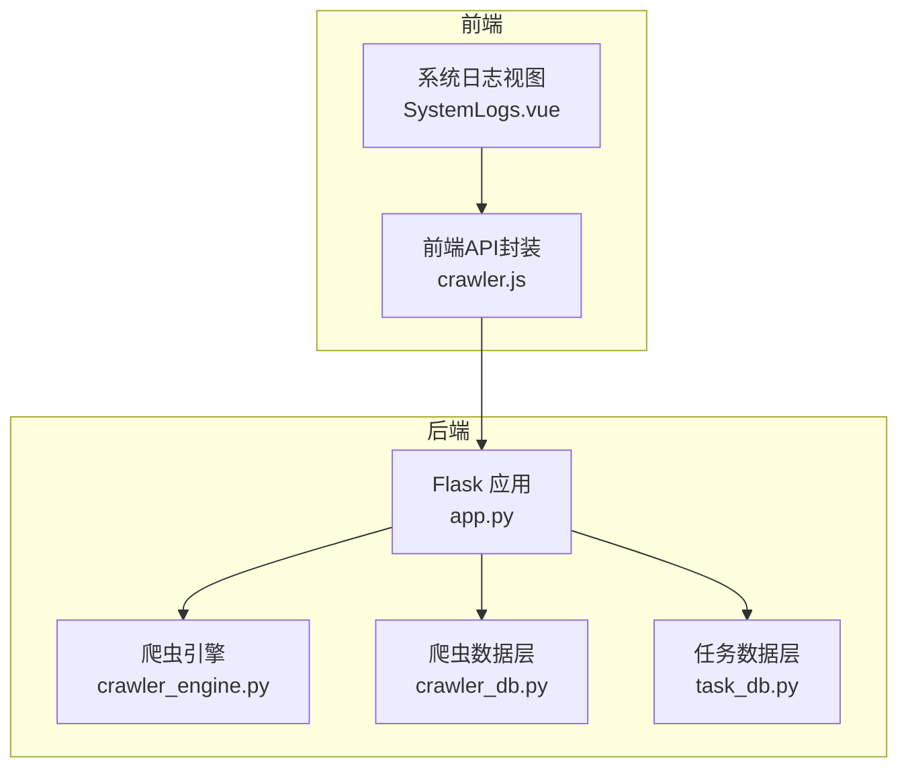
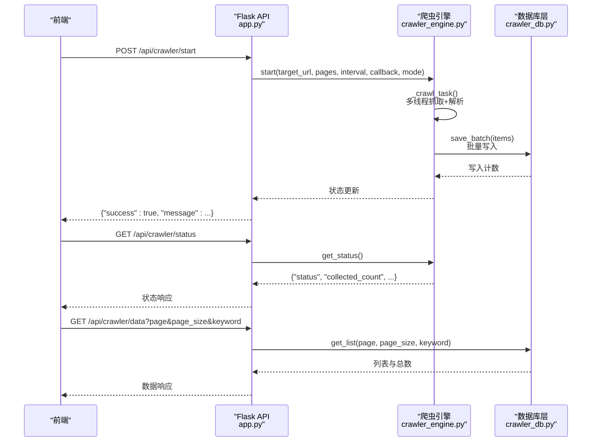
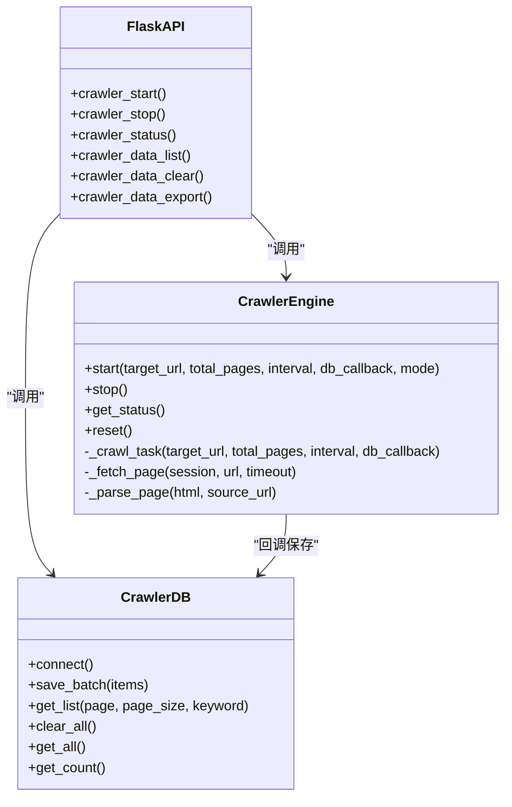
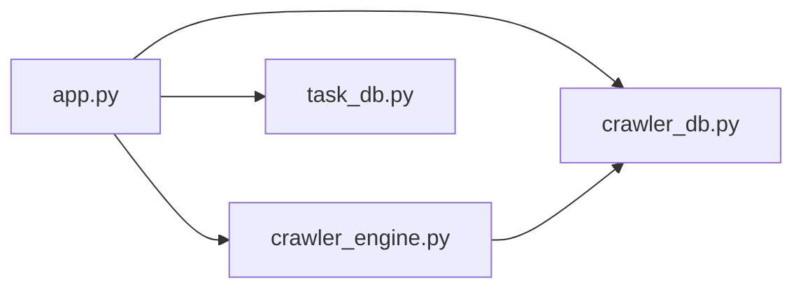

# 爬虫数据操作

<cite>
**本文引用的文件**
- [app.py](file://python/app.py)
- [crawler_db.py](file://python/crawler_db.py)
- [crawler_engine.py](file://python/crawler_engine.py)
- [task_db.py](file://python/task_db.py)
- [crawler.js](file://python-web/src/api/crawler.js)
- [SystemLogs.vue](file://python-web/src/views/SystemLogs.vue)
</cite>

## 目录
1. [简介](#简介)
2. [项目结构](#项目结构)
3. [核心组件](#核心组件)
4. [架构总览](#架构总览)
5. [详细组件分析](#详细组件分析)
6. [依赖分析](#依赖分析)
7. [性能考虑](#性能考虑)
8. [故障排查指南](#故障排查指南)
9. [结论](#结论)
10. [附录](#附录)

## 简介
本文件面向爬虫数据操作场景，系统性梳理数据存储结构、查询接口与状态管理，解释爬虫任务的数据模型、URL去重机制、解析结果存储，以及运行状态跟踪、错误日志记录与重试队列管理等核心能力。同时提供基于现有API的查询示例与性能优化策略，帮助在大数据量场景下稳定高效地进行数据采集与管理。

## 项目结构
后端采用Flask提供REST API，前端使用Vue+Pinia构建管理界面。爬虫引擎负责多线程抓取与解析，数据库层封装MySQL访问与表结构维护，任务管理模块提供任务生命周期与版本控制。

图表来源
- [app.py:30-35](file://python/app.py#L30-L35)
- [crawler_engine.py:10-20](file://python/crawler_engine.py#L10-L20)
- [crawler_db.py:6-238](file://python/crawler_db.py#L6-L238)
- [task_db.py:7-122](file://python/task_db.py#L7-L122)
- [crawler.js:1-22](file://python-web/src/api/crawler.js#L1-L22)
- [SystemLogs.vue:119-128](file://python-web/src/views/SystemLogs.vue#L119-L128)

章节来源
- [app.py:18-35](file://python/app.py#L18-L35)
- [crawler_engine.py:10-20](file://python/crawler_engine.py#L10-L20)
- [crawler_db.py:6-238](file://python/crawler_db.py#L6-L238)
- [task_db.py:7-122](file://python/task_db.py#L7-L122)
- [crawler.js:1-22](file://python-web/src/api/crawler.js#L1-L22)
- [SystemLogs.vue:119-128](file://python-web/src/views/SystemLogs.vue#L119-L128)

## 核心组件
- 爬虫引擎（CrawlerEngine）
  - 多线程抓取、UA伪装、请求延时、解析模式（链接/图片/混合）、状态跟踪与错误消息。
- 爬虫数据层（CrawlerDB）
  - 自动建库建表、索引维护、批量保存、分页查询、关键词检索、全量导出、清空数据。
- 任务数据层（TaskDB）
  - 任务表、模板表、版本表、收藏表，支持分页、过滤、增删改查与状态更新。
- Flask API（app.py）
  - 提供爬虫启动/停止/状态查询、数据列表/清空/导出、任务管理、告警、数据清洗与导出等接口。
- 前端API封装（crawler.js）
  - 封装启动、停止、状态、数据列表、清空、导出等调用方法。

章节来源
- [crawler_engine.py:51-533](file://python/crawler_engine.py#L51-L533)
- [crawler_db.py:6-238](file://python/crawler_db.py#L6-L238)
- [task_db.py:7-533](file://python/task_db.py#L7-L533)
- [app.py:306-466](file://python/app.py#L306-L466)
- [crawler.js:1-22](file://python-web/src/api/crawler.js#L1-L22)

## 架构总览
后端通过Flask路由将前端请求转发至爬虫引擎与数据库层；爬虫引擎在独立线程中执行抓取与解析，并通过回调将结果批量写入数据库。状态信息通过属性暴露，前端定时轮询获取最新状态。

图表来源
- [app.py:306-411](file://python/app.py#L306-L411)
- [crawler_engine.py:400-463](file://python/crawler_engine.py#L400-L463)
- [crawler_db.py:96-186](file://python/crawler_db.py#L96-L186)

章节来源
- [app.py:306-411](file://python/app.py#L306-L411)
- [crawler_engine.py:400-463](file://python/crawler_engine.py#L400-L463)
- [crawler_db.py:96-186](file://python/crawler_db.py#L96-L186)

## 详细组件分析

### 数据存储结构与模型
- 爬虫数据表（crawler_data）
  - 字段：自增主键、标题、链接、图片URL、内容摘要、来源URL、页码、数据类型（link/image/mixed/page）、采集时间。
  - 索引：来源URL前缀、采集时间、页码、类型，提升查询与排序效率。
  - 兼容性：自动检测并新增缺失列（如图片URL、类型字段）。
- 任务表（crawler_tasks）
  - 字段：任务名、目标URL、状态、Cron表达式、并发数、间隔秒数、重试次数与间隔、代理组、告警规则、配置、用户ID、创建/更新时间。
  - 索引：状态、用户ID、名称，支持快速筛选与排序。
- 模板表（task_templates）、版本表（task_versions）、收藏表（task_favorites）
  - 支持模板化配置、版本回滚与收藏管理。

章节来源
- [crawler_db.py:54-87](file://python/crawler_db.py#L54-L87)
- [task_db.py:52-111](file://python/task_db.py#L52-L111)

### 爬虫任务数据模型与解析
- 解析模式
  - 链接模式：提取页面中的链接与上下文文本。
  - 图片模式：从多种懒加载属性与CSS背景中提取图片URL。
  - 混合模式：同时提取链接与图片。
- URL去重机制
  - 使用集合记录已见过的链接与图片URL，避免重复采集。
- 结果存储
  - 将解析结果按类型（链接/图片/page）写入数据库，自动补全图片URL备用字段。

章节来源
- [crawler_engine.py:171-398](file://python/crawler_engine.py#L171-L398)
- [crawler_engine.py:183-196](file://python/crawler_engine.py#L183-L196)
- [crawler_engine.py:260-344](file://python/crawler_engine.py#L260-L344)

### 状态管理与错误日志
- 状态属性
  - 状态（idle/running/stopping/completed/error）、已采集数量、当前页、总页数、耗时、错误消息。
- 错误处理
  - 对HTTP 403、超时、连接错误、5xx等进行分级处理与重试；异常时设置错误消息并进入错误状态。
- 日志记录
  - 前端系统日志视图展示各类运行日志（如代理池、调度器、数据清洗、告警等），便于问题定位。

章节来源
- [crawler_engine.py:51-88](file://python/crawler_engine.py#L51-L88)
- [crawler_engine.py:113-169](file://python/crawler_engine.py#L113-L169)
- [SystemLogs.vue:119-128](file://python-web/src/views/SystemLogs.vue#L119-L128)

### 查询接口与使用示例
- 爬虫数据查询
  - 接口：GET /api/crawler/data
  - 参数：page、page_size、keyword
  - 返回：列表、总数、当前页、页大小
- 清空数据
  - 接口：DELETE /api/crawler/data
  - 行为：清空表并重置引擎状态
- 导出数据
  - 接口：GET /api/crawler/export
  - 行为：CSV导出全部数据
- 爬虫控制
  - 启动：POST /api/crawler/start（参数：target_url、total_pages、interval_seconds、crawl_mode）
  - 停止：POST /api/crawler/stop
  - 状态：GET /api/crawler/status

示例（按任务ID/状态/时间范围筛选）
- 说明：当前爬虫数据查询接口支持关键词筛选与分页，不直接支持按任务ID与时间范围筛选。
- 替代方案：
  - 任务维度：通过任务管理模块（/api/tasks）获取任务列表与状态，结合任务配置与版本信息进行关联。
  - 时间范围：可在前端对返回数据进行二次过滤或扩展后端接口增加时间范围参数。

章节来源
- [app.py:382-466](file://python/app.py#L382-L466)
- [crawler.js:3-22](file://python-web/src/api/crawler.js#L3-L22)

### 重试队列管理
- 引擎内部重试
  - 针对超时、连接错误、5xx服务器错误进行有限次重试，指数退避式等待。
- 403特殊处理
  - 遇到403时延长等待并更换请求头后重试。
- 任务层面重试
  - 任务表支持重试次数与重试间隔配置，可通过任务管理接口更新任务配置实现重试策略调整。

章节来源
- [crawler_engine.py:113-169](file://python/crawler_engine.py#L113-L169)
- [task_db.py:172-209](file://python/task_db.py#L172-L209)

### 类关系与数据流（代码级）

图表来源
- [crawler_engine.py:464-533](file://python/crawler_engine.py#L464-L533)
- [crawler_db.py:89-238](file://python/crawler_db.py#L89-L238)
- [app.py:306-466](file://python/app.py#L306-L466)

## 依赖分析
- 组件耦合
  - Flask API与爬虫引擎通过回调函数解耦，引擎仅依赖外部保存函数签名。
  - 数据库层独立封装SQL细节，提供统一的批量写入与查询接口。
- 外部依赖
  - requests、BeautifulSoup、PyMySQL、Flask、psutil（系统监控）。
- 潜在循环依赖
  - 当前模块间无循环导入，职责清晰。

图表来源
- [app.py:306-466](file://python/app.py#L306-L466)
- [crawler_engine.py:400-463](file://python/crawler_engine.py#L400-L463)
- [crawler_db.py:96-186](file://python/crawler_db.py#L96-L186)
- [task_db.py:123-171](file://python/task_db.py#L123-L171)

章节来源
- [app.py:306-466](file://python/app.py#L306-L466)
- [crawler_engine.py:400-463](file://python/crawler_engine.py#L400-L463)
- [crawler_db.py:96-186](file://python/crawler_db.py#L96-L186)
- [task_db.py:123-171](file://python/task_db.py#L123-L171)

## 性能考虑
- 数据库层面
  - 已建立多处索引（来源URL前缀、采集时间、页码、类型），有利于高频查询与排序。
  - 批量插入使用循环逐条执行，建议在数据量较大时评估事务合并与批量提交策略。
- 爬取层面
  - 请求间隔与并发数可控，避免触发目标站点限速。
  - 解析阶段对URL进行规范化与去重，减少无效请求与重复入库。
- 前端交互
  - 状态轮询周期（默认1.5秒）可根据实际需求调整，避免频繁请求造成压力。
- 大数据量处理
  - 建议分页查询与关键词检索配合使用，避免一次性加载过多数据。
  - 导出接口建议按需字段导出，减少内存占用。

章节来源
- [crawler_db.py:65-68](file://python/crawler_db.py#L65-L68)
- [app.py:326-341](file://python/app.py#L326-L341)
- [crawler.js:10-11](file://python-web/src/api/crawler.js#L10-L11)

## 故障排查指南
- 爬虫状态异常
  - 检查状态接口返回的错误消息字段，定位具体失败阶段（请求、解析、保存）。
  - 若出现403，考虑更换UA或增加等待时间。
- 数据查询异常
  - 确认分页参数合法性（page≥1，page_size在1-100范围内）。
  - 关键词查询使用模糊匹配，注意SQL性能影响。
- 导出失败
  - 确认数据库中有数据；若为空则提示“暂无数据可导出”。
- 系统日志辅助
  - 查看系统日志视图中的错误级别日志，定位网络、代理、调度等问题。

章节来源
- [app.py:376-379](file://python/app.py#L376-L379)
- [app.py:407-410](file://python/app.py#L407-L410)
- [app.py:462-465](file://python/app.py#L462-L465)
- [SystemLogs.vue:119-128](file://python-web/src/views/SystemLogs.vue#L119-L128)

## 结论
该系统通过清晰的模块划分实现了稳定的爬虫数据采集与管理：引擎负责高可靠抓取与解析，数据库层提供高效的存储与查询能力，API层对外暴露简洁的控制与查询接口。在大数据量场景下，建议结合索引、分页与关键词检索、合理设置并发与间隔，并利用系统日志与状态轮询进行可观测性建设。

## 附录
- 常用接口一览
  - 启动：POST /api/crawler/start（参数：target_url、total_pages、interval_seconds、crawl_mode）
  - 停止：POST /api/crawler/stop
  - 状态：GET /api/crawler/status
  - 数据列表：GET /api/crawler/data?page&page_size&keyword
  - 清空数据：DELETE /api/crawler/data
  - 导出数据：GET /api/crawler/export

章节来源
- [app.py:306-466](file://python/app.py#L306-L466)
- [crawler.js:3-22](file://python-web/src/api/crawler.js#L3-L22)