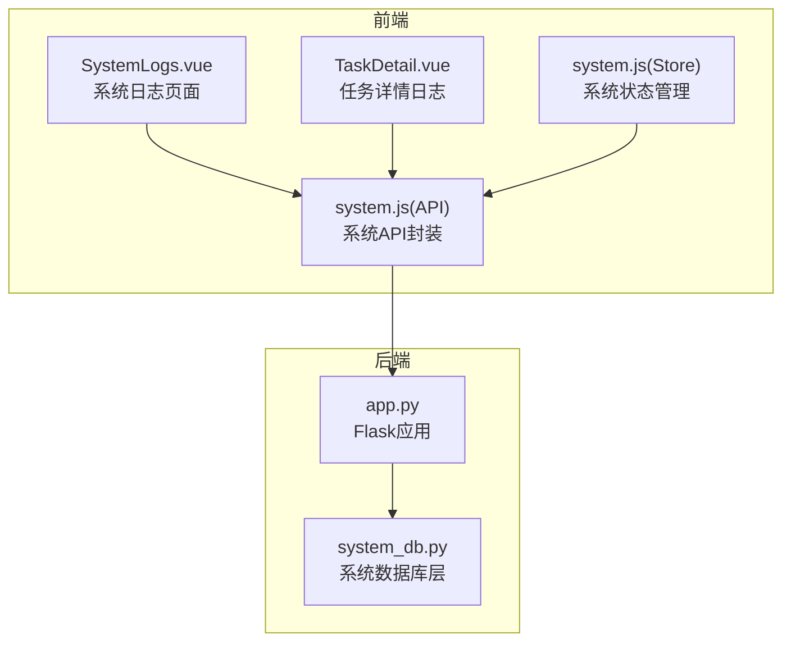
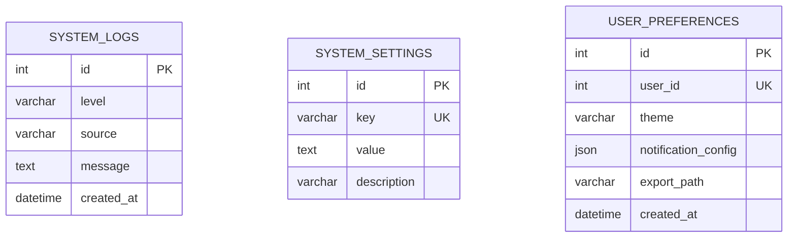
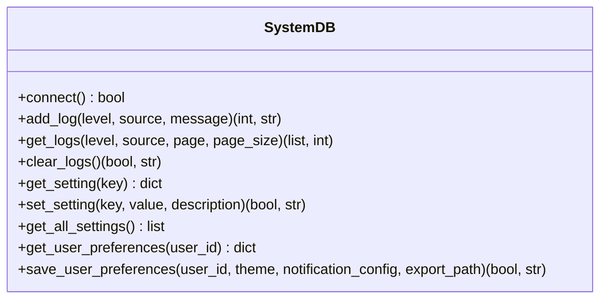
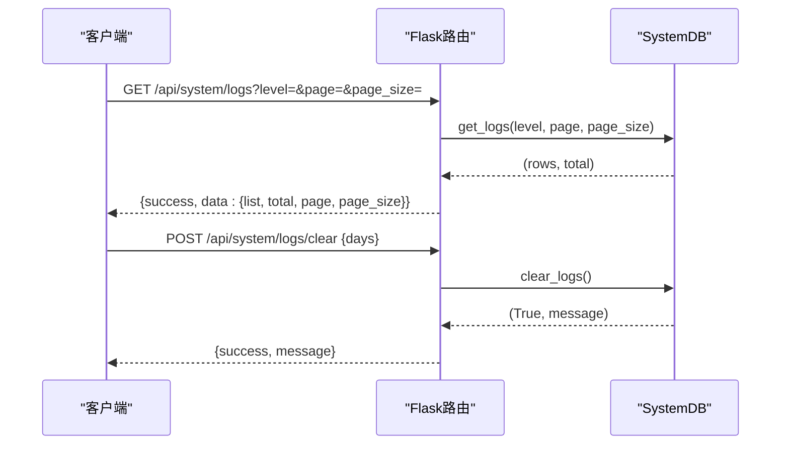
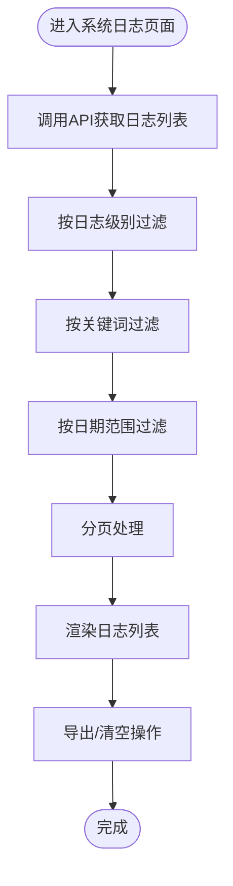
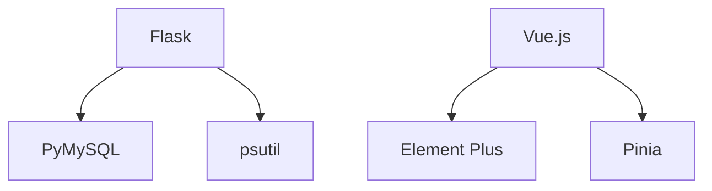

# 系统日志操作

<cite>
**本文档引用的文件**
- [app.py](file://python/app.py)
- [system_db.py](file://python/system_db.py)
- [SystemLogs.vue](file://python-web/src/views/SystemLogs.vue)
- [system.js](file://python-web/src/api/system.js)
- [system.js](file://python-web/src/stores/system.js)
- [TaskDetail.vue](file://python-web/src/views/TaskDetail.vue)
- [.gitignore](file://python/.gitignore)
- [requirements.txt](file://python/requirements.txt)
</cite>

## 目录
1. [简介](#简介)
2. [项目结构](#项目结构)
3. [核心组件](#核心组件)
4. [架构概览](#架构概览)
5. [详细组件分析](#详细组件分析)
6. [依赖关系分析](#依赖关系分析)
7. [性能考虑](#性能考虑)
8. [故障排查指南](#故障排查指南)
9. [结论](#结论)
10. [附录](#附录)

## 简介
本文件详细说明系统日志的记录机制、查询接口与管理功能。涵盖日志级别分类（DEBUG、INFO、WARNING、ERROR）、日志格式规范、时间戳处理等技术细节，并文档化日志清理策略、归档机制与性能影响评估。同时提供日志查询API的使用示例，包括按时间范围、日志级别、关键词搜索等功能，并总结系统监控与故障排查中的日志使用最佳实践。

## 项目结构
该系统采用前后端分离架构：后端使用Flask提供REST API，前端使用Vue.js构建管理界面。日志功能主要由后端数据库层负责存储与查询，前端提供可视化展示与交互。

**图表来源**
- [app.py:1593-1684](file://python/app.py#L1593-L1684)
- [system_db.py:47-199](file://python/system_db.py#L47-L199)
- [SystemLogs.vue:1-360](file://python-web/src/views/SystemLogs.vue#L1-L360)
- [system.js:1-23](file://python-web/src/api/system.js#L1-L23)
- [system.js:1-168](file://python-web/src/stores/system.js#L1-L168)

**章节来源**
- [app.py:1-800](file://python/app.py#L1-L800)
- [system_db.py:1-317](file://python/system_db.py#L1-L317)
- [SystemLogs.vue:1-360](file://python-web/src/views/SystemLogs.vue#L1-L360)
- [system.js:1-23](file://python-web/src/api/system.js#L1-L23)
- [system.js:1-168](file://python-web/src/stores/system.js#L1-L168)

## 核心组件
- 后端日志数据库层：负责系统日志的创建、查询、清理与设置管理。
- 前端日志展示组件：提供日志级别的筛选、关键词搜索、日期范围过滤与分页显示。
- 日志API封装：统一管理日志查询与清理的HTTP接口。
- 状态管理：集中管理日志数据与资源信息。

**章节来源**
- [system_db.py:99-183](file://python/system_db.py#L99-L183)
- [SystemLogs.vue:102-181](file://python-web/src/views/SystemLogs.vue#L102-L181)
- [system.js:3-23](file://python-web/src/api/system.js#L3-L23)
- [system.js:121-133](file://python-web/src/stores/system.js#L121-L133)

## 架构概览
系统日志架构围绕数据库表system_logs展开，后端提供REST接口，前端通过API进行数据交互与展示。

**图表来源**
- [system_db.py:52-87](file://python/system_db.py#L52-L87)

**章节来源**
- [system_db.py:47-97](file://python/system_db.py#L47-L97)

## 详细组件分析

### 后端日志数据库层（system_db.py）
- 表结构设计
  - 主键ID、日志级别（INFO/WARNING/ERROR）、来源、消息体、创建时间。
  - 为level、source、created_at建立索引以优化查询性能。
- 日志写入
  - 提供add_log方法，支持指定level、source与message。
- 日志查询
  - 支持按level与source过滤，分页查询，按创建时间倒序排列。
  - 将created_at转换为字符串格式返回。
- 日志清理
  - 提供clear_logs方法用于清空所有日志记录。
- 设置与偏好
  - 提供系统设置与用户偏好的读写接口。

**图表来源**
- [system_db.py:99-314](file://python/system_db.py#L99-L314)

**章节来源**
- [system_db.py:47-199](file://python/system_db.py#L47-L199)

### 后端API路由（app.py）
- 日志查询接口
  - GET /api/system/logs：支持level、page、page_size参数，返回分页结果。
- 日志清理接口
  - POST /api/system/logs/clear：接收days参数，清理指定天数前的日志。
- 系统设置接口
  - GET /api/system/settings：获取系统设置。
  - PUT /api/system/settings/<key>：更新指定设置项。

**图表来源**
- [app.py:1593-1648](file://python/app.py#L1593-L1648)
- [system_db.py:123-183](file://python/system_db.py#L123-L183)

**章节来源**
- [app.py:1593-1684](file://python/app.py#L1593-L1684)

### 前端日志展示组件（SystemLogs.vue）
- 功能特性
  - 统计信息：总日志数、今日日志数、今日错误数。
  - 过滤器：日志级别筛选、关键词搜索、日期范围过滤。
  - 分页显示：每页固定条目数，支持上一页/下一页导航。
  - 导出与清空：提供导出与清空日志的操作入口。
- 数据流
  - 通过system.js API获取日志数据，计算统计与过滤结果，渲染终端样式界面。

**图表来源**
- [SystemLogs.vue:119-219](file://python-web/src/views/SystemLogs.vue#L119-L219)
- [SystemLogs.vue:148-181](file://python-web/src/views/SystemLogs.vue#L148-L181)

**章节来源**
- [SystemLogs.vue:1-360](file://python-web/src/views/SystemLogs.vue#L1-L360)

### 前端API封装与状态管理（system.js）
- API封装
  - getLogs(params)：获取日志列表。
  - clearLogs(beforeDays)：清理日志。
  - getResources()：获取系统资源信息。
  - getSettings()/updateSetting(key, data)：系统设置读取与更新。
- 状态管理
  - fetchLogs(params)/clearLogs(beforeDays)：与API交互并更新store中的systemLogs。

**章节来源**
- [system.js:1-23](file://python-web/src/api/system.js#L1-L23)
- [system.js:121-133](file://python-web/src/stores/system.js#L121-L133)

### 任务详情中的实时日志（TaskDetail.vue）
- 实时生成日志：定时生成模拟日志，支持自动滚动与清空。
- 展示样式：按日志级别着色，支持时间戳与消息内容展示。

**章节来源**
- [TaskDetail.vue:112-149](file://python-web/src/views/TaskDetail.vue#L112-L149)
- [TaskDetail.vue:271-314](file://python-web/src/views/TaskDetail.vue#L271-L314)

## 依赖关系分析
- 后端依赖
  - Flask：Web框架与路由。
  - PyMySQL：MySQL数据库连接与操作。
  - psutil：系统资源监控（在app.py中导入，可用于系统资源查询API）。
- 前端依赖
  - Vue.js + Element Plus：组件化开发与UI交互。
  - Pinia：状态管理。

**图表来源**
- [requirements.txt:1-14](file://python/requirements.txt#L1-L14)
- [app.py:16](file://python/app.py#L16)

**章节来源**
- [requirements.txt:1-14](file://python/requirements.txt#L1-L14)

## 性能考虑
- 查询性能
  - system_logs表对level、source、created_at建立了索引，有助于按级别、来源与时间范围的高效查询。
  - 分页查询避免一次性加载大量日志，减少内存占用。
- 写入性能
  - 单条日志插入为O(1)操作，批量写入可通过事务优化（当前实现逐条插入）。
- 存储与清理
  - 建议定期清理历史日志，控制表规模；可结合业务需求设置保留周期。
- 前端渲染
  - 对于大量日志，建议虚拟滚动或服务端分页，避免DOM节点过多导致卡顿。

[本节为通用性能指导，不直接分析具体文件]

## 故障排查指南
- 日志查询失败
  - 检查后端数据库连接配置与表是否存在。
  - 确认API参数（page/page_size）是否合法。
- 日志清理无效
  - 确认清理接口传入的天数参数是否为正整数。
  - 检查数据库权限与事务提交情况。
- 前端显示异常
  - 检查API响应格式与store数据绑定。
  - 确认过滤逻辑（级别、关键词、日期）是否正确匹配。

**章节来源**
- [system_db.py:163-165](file://python/system_db.py#L163-L165)
- [app.py:1623-1626](file://python/app.py#L1623-L1626)

## 结论
本系统提供了完整的日志记录、查询与管理能力：后端以MySQL为存储核心，提供高效的索引查询与清理接口；前端通过直观的界面支持多维过滤与分页展示。建议在生产环境中结合业务需求制定日志保留策略与归档方案，确保日志系统的长期稳定运行。

[本节为总结性内容，不直接分析具体文件]

## 附录

### 日志级别与格式规范
- 日志级别
  - INFO：普通信息类日志。
  - WARNING：警告类日志。
  - ERROR：错误类日志。
- 日志字段
  - level：日志级别（INFO/WARNING/ERROR）。
  - source：日志来源（模块或组件标识）。
  - message：日志消息文本。
  - created_at：日志创建时间（数据库默认当前时间）。

**章节来源**
- [system_db.py:52-62](file://python/system_db.py#L52-L62)

### 时间戳处理
- 存储：数据库默认使用DATETIME类型并自动记录当前时间。
- 查询：后端将created_at格式化为字符串返回，前端可基于字符串进行日期过滤。

**章节来源**
- [system_db.py:158-161](file://python/system_db.py#L158-L161)

### 日志清理策略与归档机制
- 清理策略
  - 支持按天数清理历史日志，建议根据磁盘容量与合规要求设定保留周期。
- 归档机制
  - 可扩展为定期导出CSV或压缩文件，然后清理对应历史数据。
- 性能影响
  - TRUNCATE TABLE清理速度快但无法按时间点精确控制；建议结合业务场景选择合适策略。

**章节来源**
- [system_db.py:170-183](file://python/system_db.py#L170-L183)

### 日志查询API使用示例
- 获取日志列表
  - GET /api/system/logs?level=&page=&page_size=
  - 返回：success、data.list、data.total、data.page、data.page_size
- 清理日志
  - POST /api/system/logs/clear {days: N}
  - 返回：success、message
- 获取系统设置
  - GET /api/system/settings
  - 返回：success、data
- 更新系统设置
  - PUT /api/system/settings/{key} {value: ...}
  - 返回：success、message

**章节来源**
- [app.py:1593-1684](file://python/app.py#L1593-L1684)

### 系统监控与故障排查最佳实践
- 监控指标
  - 使用psutil监控CPU、内存、磁盘使用率，结合日志中的WARNING/ERROR级别快速定位问题。
- 日志分级
  - INFO用于常规操作记录，WARNING用于潜在风险提示，ERROR用于异常与错误事件。
- 关键词搜索
  - 在前端通过关键词过滤快速定位特定模块或错误信息。
- 归档与保留
  - 建立定期归档与清理策略，避免日志表无限增长影响查询性能。

**章节来源**
- [app.py:16](file://python/app.py#L16)
- [SystemLogs.vue:148-164](file://python-web/src/views/SystemLogs.vue#L148-L164)