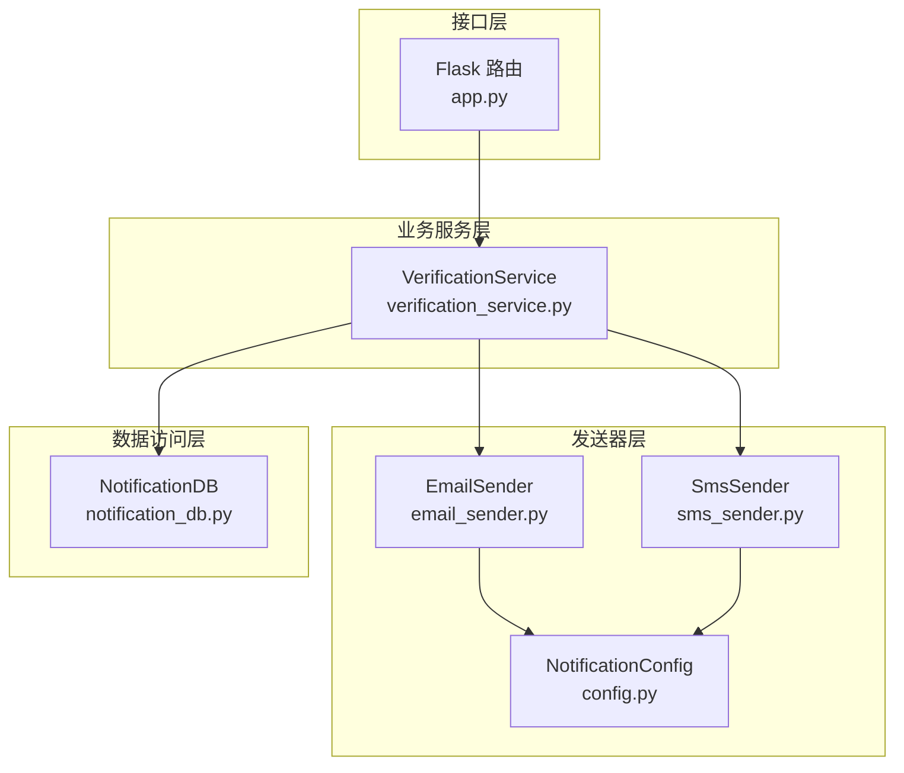
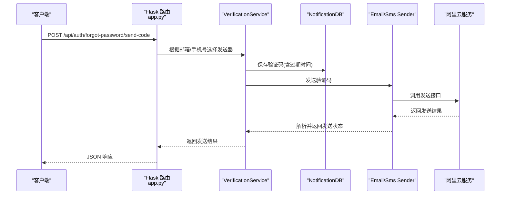
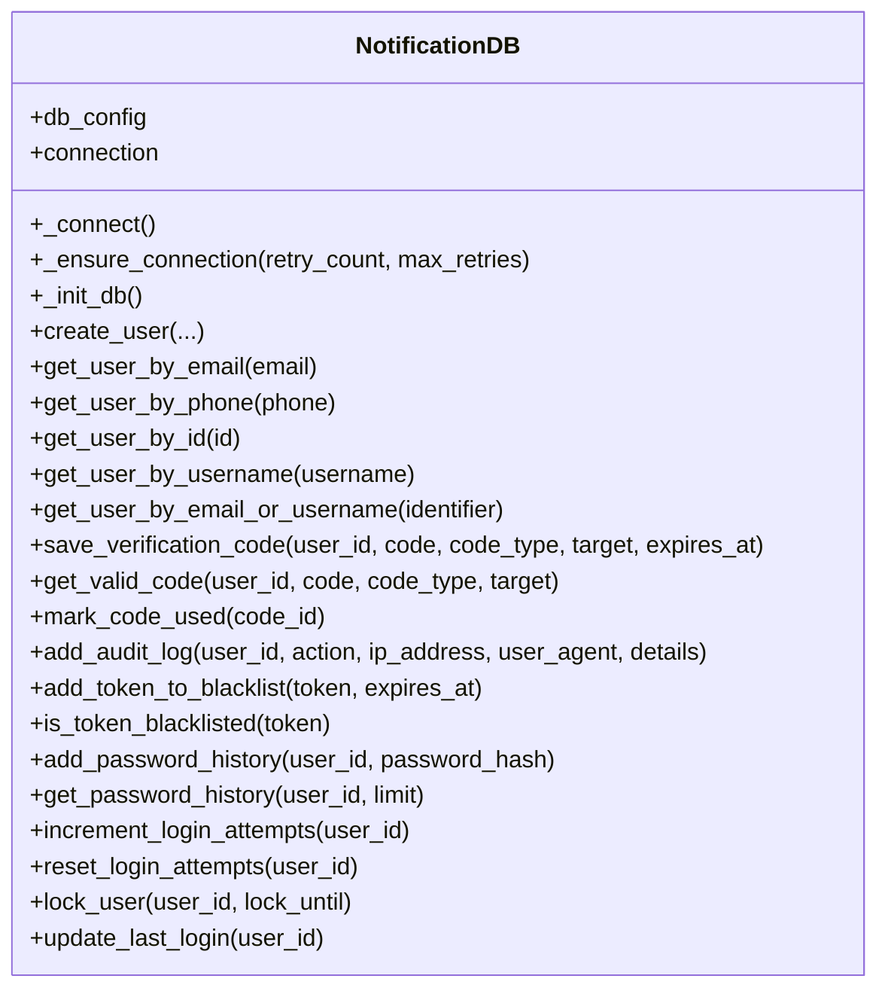
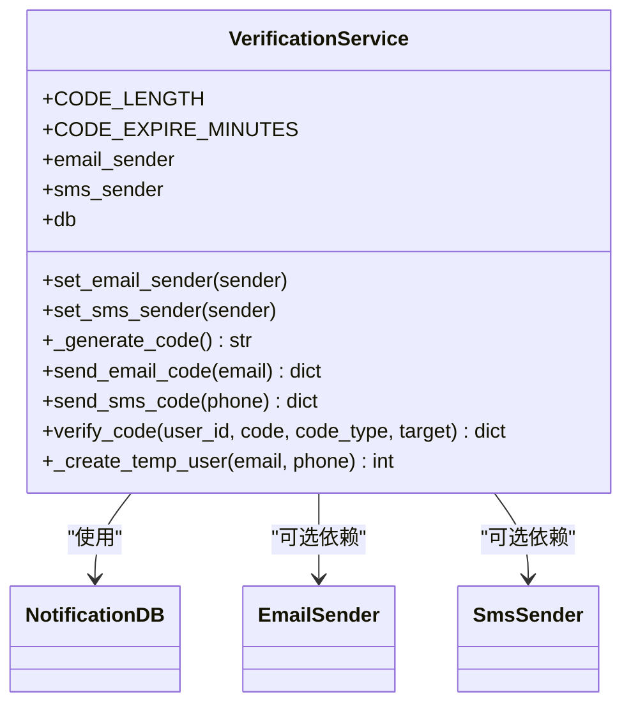
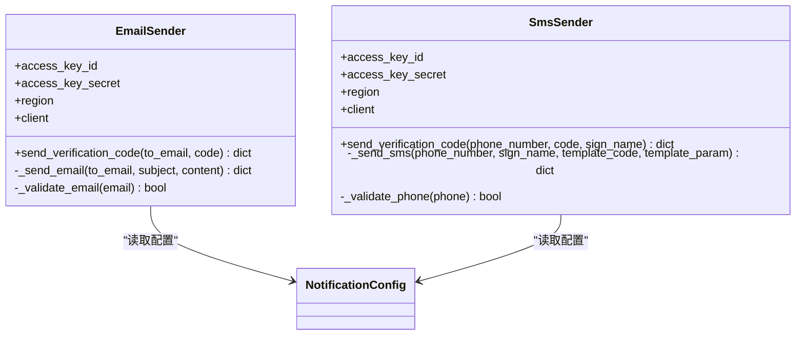
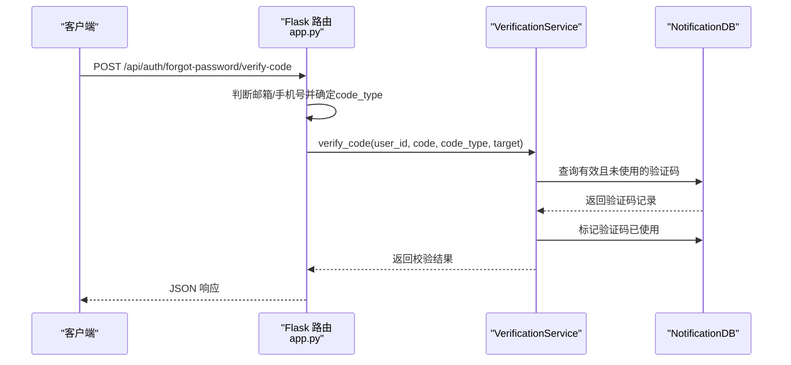
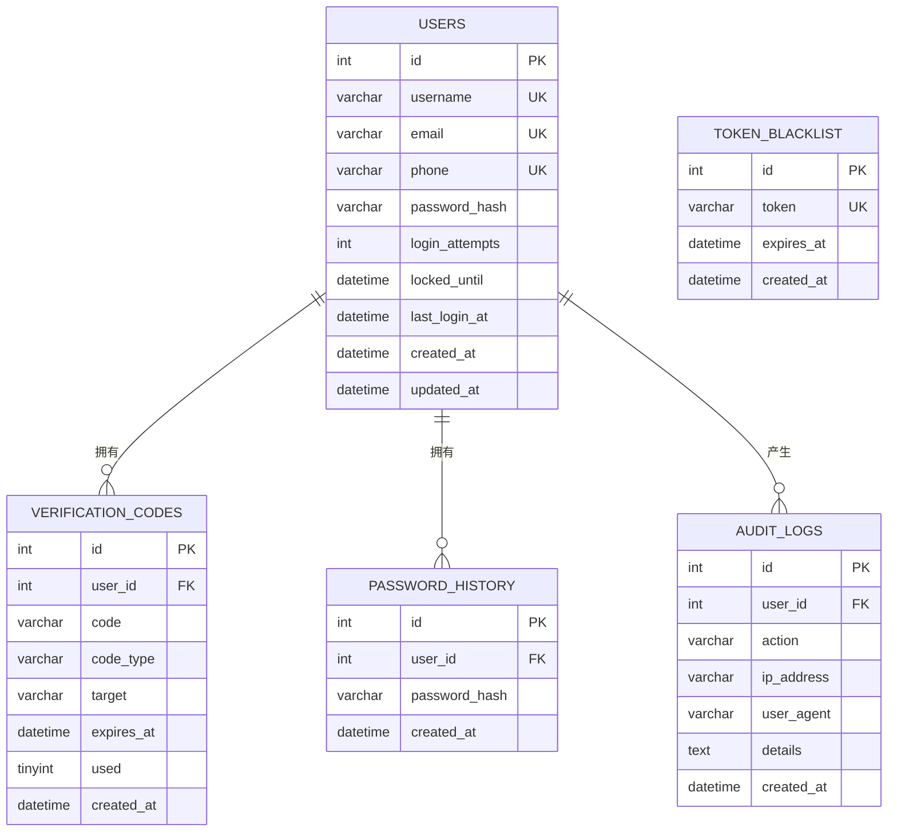
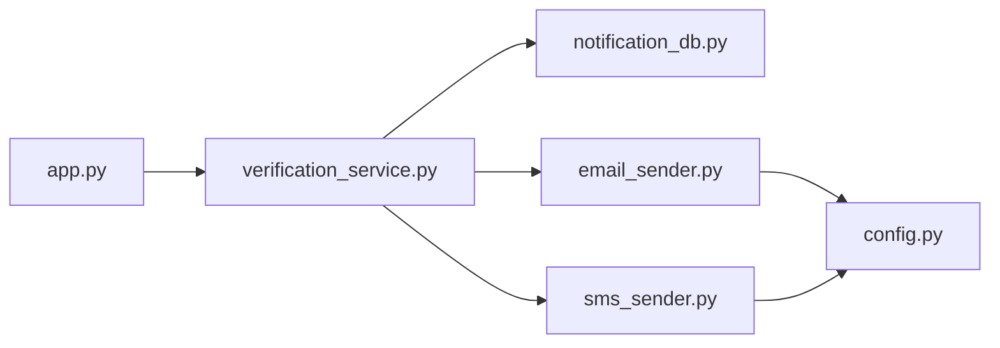

# 通知数据操作

<cite>
**本文引用的文件**
- [notification_db.py](file://python/src/notification_db.py)
- [verification_service.py](file://python/src/notifications/verification_service.py)
- [email_sender.py](file://python/src/notifications/email_sender.py)
- [sms_sender.py](file://python/src/notifications/sms_sender.py)
- [config.py](file://python/src/notifications/config.py)
- [app.py](file://python/app.py)
- [alert_db.py](file://python/alert_db.py)
</cite>

## 目录
1. [简介](#简介)
2. [项目结构](#项目结构)
3. [核心组件](#核心组件)
4. [架构总览](#架构总览)
5. [详细组件分析](#详细组件分析)
6. [依赖分析](#依赖分析)
7. [性能考虑](#性能考虑)
8. [故障排查指南](#故障排查指南)
9. [结论](#结论)
10. [附录](#附录)

## 简介
本文件聚焦于通知系统的数据操作实现，涵盖验证码生成与存储、验证状态管理、发送状态与重试机制、模板与接收者处理、以及批量发送等高级能力。文档同时给出通知数据模型设计说明、使用示例路径与最佳实践，并提供性能优化策略与监控指标建议。

## 项目结构
通知系统由三层组成：
- 数据访问层：负责与数据库交互，提供用户、验证码、审计日志等表的增删改查。
- 业务服务层：封装验证码发送与校验流程，协调邮件/短信发送器。
- 发送器层：对接阿里云邮件/短信服务，完成实际发送与返回结果解析。
- 接口层：对外提供REST接口，驱动验证码发送与校验流程。

图表来源
- [app.py:170-210](file://python/app.py#L170-L210)
- [verification_service.py:1-108](file://python/src/notifications/verification_service.py#L1-L108)
- [email_sender.py:1-67](file://python/src/notifications/email_sender.py#L1-L67)
- [sms_sender.py:1-65](file://python/src/notifications/sms_sender.py#L1-L65)
- [config.py:1-20](file://python/src/notifications/config.py#L1-L20)
- [notification_db.py:1-357](file://python/src/notification_db.py#L1-L357)

章节来源
- [app.py:170-210](file://python/app.py#L170-L210)
- [verification_service.py:1-108](file://python/src/notifications/verification_service.py#L1-L108)
- [notification_db.py:1-357](file://python/src/notification_db.py#L1-L357)

## 核心组件
- NotificationDB：数据库访问类，提供用户、验证码、令牌黑名单、密码历史、审计日志等表的CRUD与辅助方法。
- VerificationService：验证码业务服务，负责生成验证码、持久化、调用发送器、校验验证码与标记使用。
- EmailSender/SmsSender：邮件/短信发送器，封装阿里云SDK调用与返回解析。
- NotificationConfig：通知配置，集中管理阿里云密钥、区域、签名、模板、开关与验证码参数。
- Flask路由：对外暴露发送验证码、校验验证码、重置密码等接口。

章节来源
- [notification_db.py:6-357](file://python/src/notification_db.py#L6-L357)
- [verification_service.py:7-108](file://python/src/notifications/verification_service.py#L7-L108)
- [email_sender.py:6-67](file://python/src/notifications/email_sender.py#L6-L67)
- [sms_sender.py:7-65](file://python/src/notifications/sms_sender.py#L7-L65)
- [config.py:4-20](file://python/src/notifications/config.py#L4-L20)
- [app.py:170-210](file://python/app.py#L170-L210)

## 架构总览
通知系统采用“接口层-业务层-发送器层-数据层”的分层架构。接口层接收请求后，业务层根据目标类型选择邮件或短信发送器，发送器调用阿里云服务并返回结果；业务层将验证码写入数据库并返回响应；接口层统一返回JSON结果。

图表来源
- [app.py:170-190](file://python/app.py#L170-L190)
- [verification_service.py:25-81](file://python/src/notifications/verification_service.py#L25-L81)
- [email_sender.py:13-62](file://python/src/notifications/email_sender.py#L13-L62)
- [sms_sender.py:14-60](file://python/src/notifications/sms_sender.py#L14-L60)
- [notification_db.py:147-156](file://python/src/notification_db.py#L147-L156)

## 详细组件分析

### 数据访问层：NotificationDB
- 连接管理：自动重连与健康检查，支持最大重试次数。
- 用户管理：创建用户、按邮箱/手机号/用户名/ID查询用户。
- 验证码管理：保存验证码、查询有效且未使用的验证码、标记验证码已使用。
- 审计日志：记录用户行为（注册、登录、登出、重置密码、修改密码）。
- 其他：令牌黑名单、密码历史、登录尝试与锁定等。

图表来源
- [notification_db.py:6-357](file://python/src/notification_db.py#L6-L357)

章节来源
- [notification_db.py:19-40](file://python/src/notification_db.py#L19-L40)
- [notification_db.py:106-156](file://python/src/notification_db.py#L106-L156)
- [notification_db.py:158-189](file://python/src/notification_db.py#L158-L189)
- [notification_db.py:334-343](file://python/src/notification_db.py#L334-L343)

### 业务服务层：VerificationService
- 功能职责：生成验证码、持久化验证码、调用发送器发送、校验验证码并标记使用、临时用户创建。
- 配置参数：验证码长度与过期时间来自类属性。
- 依赖注入：可设置EmailSender与SmsSender实例。

图表来源
- [verification_service.py:7-108](file://python/src/notifications/verification_service.py#L7-L108)
- [notification_db.py:6-15](file://python/src/notification_db.py#L6-L15)
- [email_sender.py:6-12](file://python/src/notifications/email_sender.py#L6-L12)
- [sms_sender.py:7-12](file://python/src/notifications/sms_sender.py#L7-L12)

章节来源
- [verification_service.py:22-104](file://python/src/notifications/verification_service.py#L22-L104)

### 发送器层：EmailSender 与 SmsSender
- EmailSender：校验邮箱格式，构造邮件请求，调用阿里云邮件推送接口，解析返回并返回标准化结果。
- SmsSender：校验手机号格式，构造短信请求，调用阿里云短信接口，解析返回并返回标准化结果。
- 配置：从NotificationConfig读取密钥、区域、签名、模板等参数。

图表来源
- [email_sender.py:6-67](file://python/src/notifications/email_sender.py#L6-L67)
- [sms_sender.py:7-65](file://python/src/notifications/sms_sender.py#L7-L65)
- [config.py:4-19](file://python/src/notifications/config.py#L4-L19)

章节来源
- [email_sender.py:13-62](file://python/src/notifications/email_sender.py#L13-L62)
- [sms_sender.py:14-60](file://python/src/notifications/sms_sender.py#L14-L60)
- [config.py:5-13](file://python/src/notifications/config.py#L5-L13)

### 接口层：Flask 路由
- 发送验证码：根据目标类型（邮箱/手机号）选择对应发送器，调用VerificationService发送验证码。
- 校验验证码：根据目标类型推断验证码类型，调用VerificationService校验并标记使用。
- 重置密码：校验通过后调用认证服务重置密码，并记录审计日志。

图表来源
- [app.py:192-210](file://python/app.py#L192-L210)
- [verification_service.py:83-101](file://python/src/notifications/verification_service.py#L83-L101)
- [notification_db.py:158-189](file://python/src/notification_db.py#L158-L189)

章节来源
- [app.py:170-210](file://python/app.py#L170-L210)
- [app.py:212-239](file://python/app.py#L212-L239)

### 数据模型与表结构
- users：用户基本信息与安全控制字段。
- verification_codes：验证码记录，包含用户ID、验证码、类型（email/sms）、目标地址、过期时间、使用状态。
- token_blacklist：令牌黑名单，用于登出与刷新Token失效。
- password_history：密码历史，防止重复使用旧密码。
- audit_logs：审计日志，记录用户关键行为。

图表来源
- [notification_db.py:44-103](file://python/src/notification_db.py#L44-L103)

章节来源
- [notification_db.py:44-103](file://python/src/notification_db.py#L44-L103)

### 通知类型分类与发送状态管理
- 类型分类：email（邮箱）、sms（短信），通过code_type字段区分。
- 发送状态：发送器返回success/message/data，接口层统一包装为JSON响应。
- 过期与使用：验证码带过期时间，校验时仅允许未使用且未过期的记录。

章节来源
- [verification_service.py:25-81](file://python/src/notifications/verification_service.py#L25-L81)
- [notification_db.py:147-189](file://python/src/notification_db.py#L147-L189)

### 重试机制
- 数据库连接：_ensure_connection支持最多3次重试，每次指数退避等待。
- 失败处理：发送器捕获异常并返回失败信息，接口层根据success字段决定HTTP状态码。

章节来源
- [notification_db.py:28-39](file://python/src/notification_db.py#L28-L39)
- [email_sender.py:44-62](file://python/src/notifications/email_sender.py#L44-L62)
- [sms_sender.py:37-60](file://python/src/notifications/sms_sender.py#L37-L60)

### 模板管理与接收者处理
- 模板：发送器使用固定模板编码与签名，配置来源于NotificationConfig。
- 接收者：邮箱/手机号格式校验，发送前进行正则验证。
- 扩展点：可通过NotificationConfig调整模板与签名，便于多模板场景。

章节来源
- [config.py:5-13](file://python/src/notifications/config.py#L5-L13)
- [email_sender.py:13-23](file://python/src/notifications/email_sender.py#L13-L23)
- [sms_sender.py:14-23](file://python/src/notifications/sms_sender.py#L14-L23)

### 批量发送与高级功能
- 当前实现：单条验证码生成与发送，未见批量发送逻辑。
- 建议扩展：在VerificationService中增加批量发送入口，按类型拆分接收者列表，分别调用EmailSender/SmsSender，结合异步队列与重试策略提升吞吐。

章节来源
- [verification_service.py:25-81](file://python/src/notifications/verification_service.py#L25-L81)

### 实际使用示例（路径）
- 发送邮箱验证码：POST /api/auth/forgot-password/send-code（目标为邮箱）
  - 参考：[app.py:170-189](file://python/app.py#L170-L189)
- 发送短信验证码：POST /api/auth/forgot-password/send-code（目标为手机号）
  - 参考：[app.py:170-189](file://python/app.py#L170-L189)
- 校验验证码：POST /api/auth/forgot-password/verify-code
  - 参考：[app.py:192-210](file://python/app.py#L192-L210)
- 重置密码：POST /api/auth/forgot-password/reset
  - 参考：[app.py:212-239](file://python/app.py#L212-L239)

## 依赖分析
- VerificationService依赖NotificationDB与可选的EmailSender/SmsSender。
- EmailSender/SmsSender依赖NotificationConfig与阿里云SDK。
- Flask路由依赖VerificationService与NotificationDB。

图表来源
- [app.py:170-210](file://python/app.py#L170-L210)
- [verification_service.py:11-14](file://python/src/notifications/verification_service.py#L11-L14)
- [email_sender.py:7-11](file://python/src/notifications/email_sender.py#L7-L11)
- [sms_sender.py:8-12](file://python/src/notifications/sms_sender.py#L8-L12)
- [config.py:4-19](file://python/src/notifications/config.py#L4-L19)
- [notification_db.py:6-15](file://python/src/notification_db.py#L6-L15)

章节来源
- [verification_service.py:11-14](file://python/src/notifications/verification_service.py#L11-L14)
- [email_sender.py:7-11](file://python/src/notifications/email_sender.py#L7-L11)
- [sms_sender.py:8-12](file://python/src/notifications/sms_sender.py#L8-L12)
- [config.py:4-19](file://python/src/notifications/config.py#L4-L19)
- [notification_db.py:6-15](file://python/src/notification_db.py#L6-L15)

## 性能考虑
- 连接池与重连：当前使用单连接并定期ping，建议引入连接池与超时配置，减少频繁重建连接的开销。
- 查询索引：verification_codes按(user_id, code, code_type, target, used)组合查询，建议建立复合索引以加速校验。
- 异步发送：将发送器调用改为异步任务队列，避免阻塞HTTP请求线程。
- 缓存：对频繁校验的验证码进行短期缓存，降低数据库压力。
- 批量处理：实现批量发送与批量校验，合并事务提交，减少往返开销。
- 监控指标：统计发送成功率、失败原因分布、平均耗时、数据库连接数与等待时间。

## 故障排查指南
- 发送失败：检查阿里云凭证与网络连通性；查看发送器返回的错误信息；确认模板编码与签名配置。
- 验证失败：确认验证码未过期且未被使用；核对code_type与target匹配；检查数据库记录是否存在。
- 连接异常：查看NotificationDB的重连日志；确认数据库服务可用性与防火墙策略。
- 审计缺失：确认接口层是否正确调用add_audit_log；检查数据库事务是否提交。

章节来源
- [email_sender.py:44-62](file://python/src/notifications/email_sender.py#L44-L62)
- [sms_sender.py:37-60](file://python/src/notifications/sms_sender.py#L37-L60)
- [notification_db.py:28-39](file://python/src/notification_db.py#L28-L39)
- [notification_db.py:334-343](file://python/src/notification_db.py#L334-L343)

## 结论
通知系统通过清晰的分层设计实现了验证码的生成、存储、发送与校验闭环。当前实现具备良好的扩展性，可在保持现有接口稳定的基础上，引入异步队列、连接池与缓存等优化手段，进一步提升性能与可靠性。建议在生产环境中完善监控与告警体系，持续跟踪关键指标并迭代优化。

## 附录
- 相关告警数据库模块（AlertDB）用于系统级告警管理，与通知系统协同保障系统稳定性。
  - 参考：[alert_db.py:6-314](file://python/alert_db.py#L6-L314)