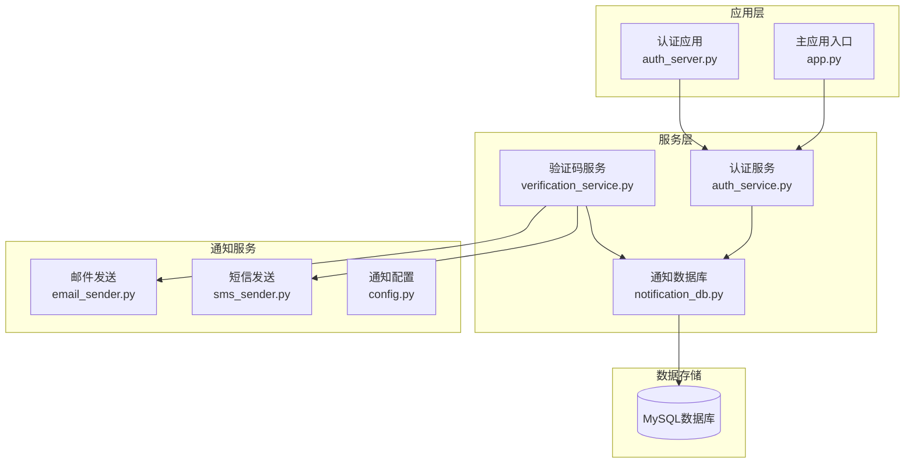
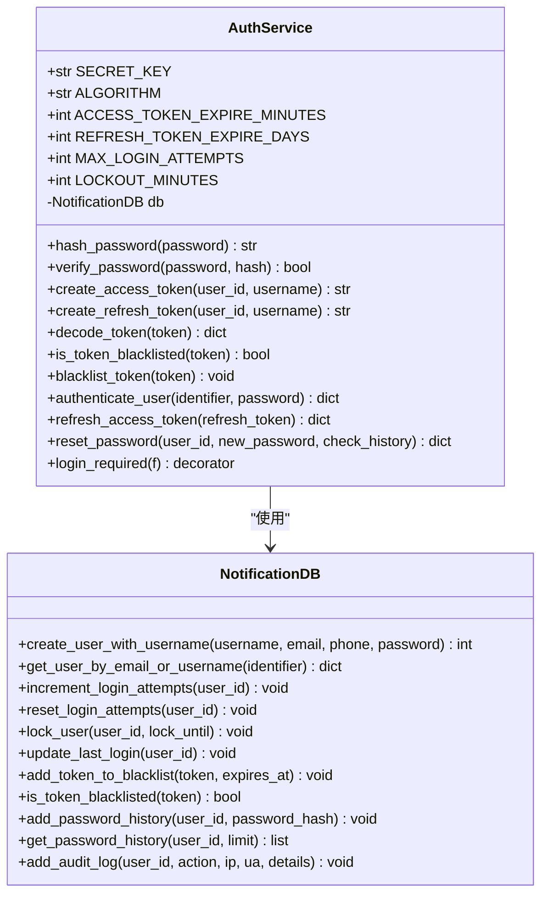
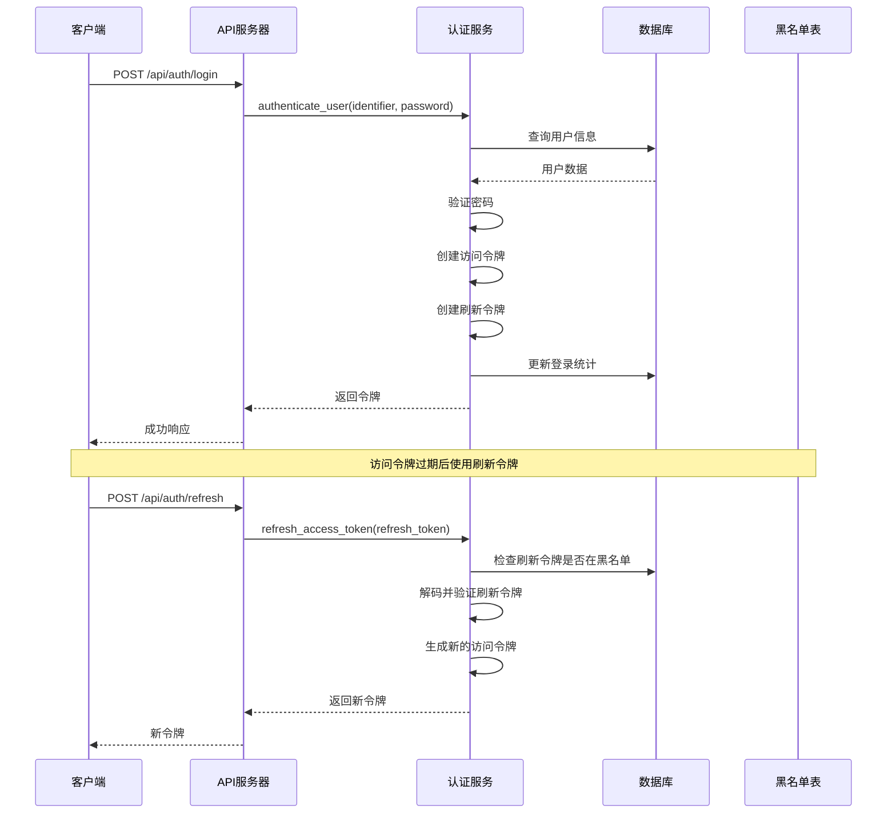
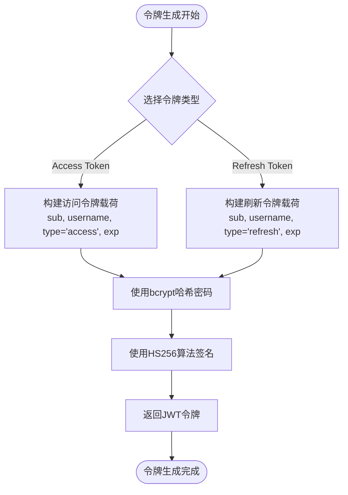
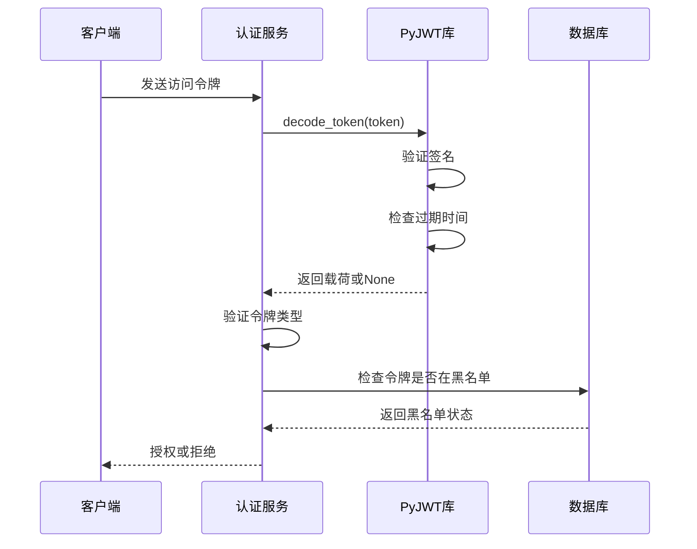
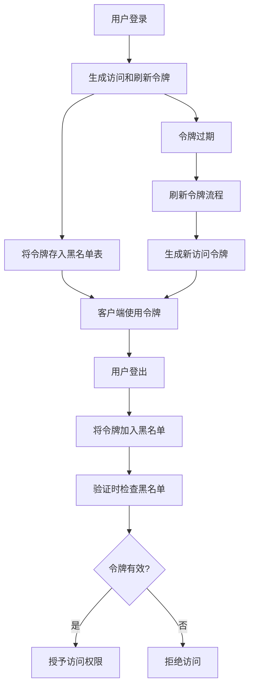
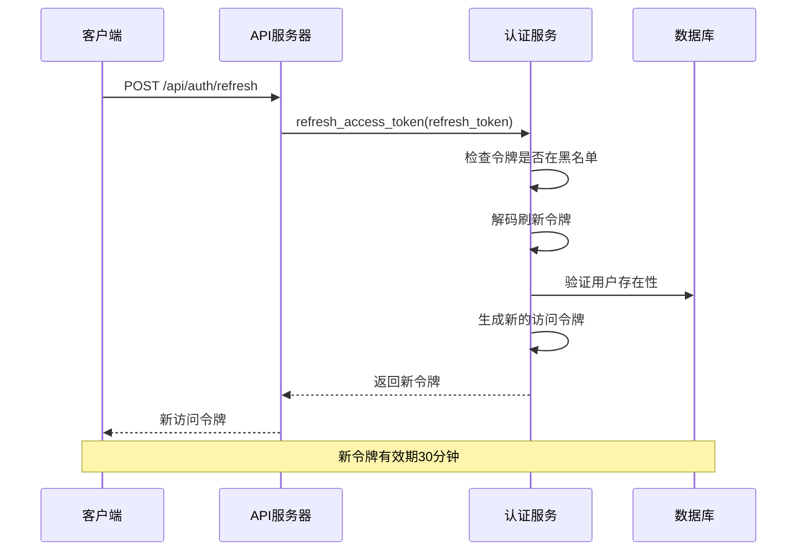
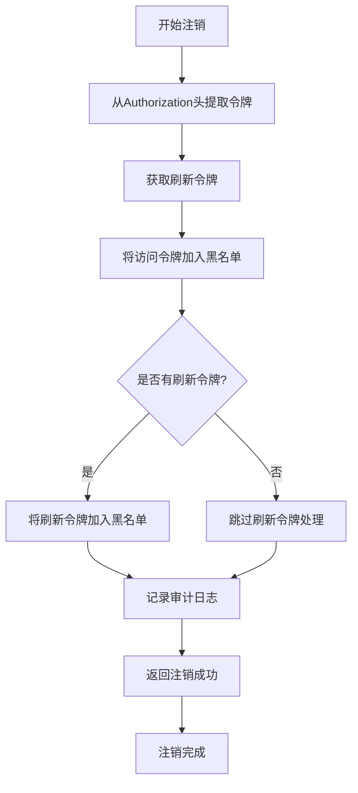
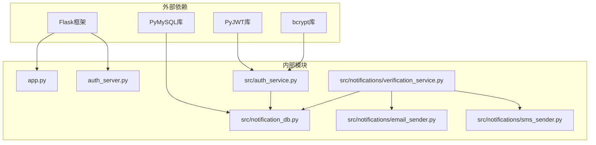

# Token认证

<cite>
**本文档引用的文件**
- [app.py](file://python/app.py)
- [auth_server.py](file://python/auth_server.py)
- [auth_service.py](file://python/src/auth_service.py)
- [notification_db.py](file://python/src/notification_db.py)
- [verification_service.py](file://python/src/notifications/verification_service.py)
- [email_sender.py](file://python/src/notifications/email_sender.py)
- [sms_sender.py](file://python/src/notifications/sms_sender.py)
- [config.py](file://python/src/notifications/config.py)
</cite>

## 目录
1. [简介](#简介)
2. [项目结构](#项目结构)
3. [核心组件](#核心组件)
4. [架构概览](#架构概览)
5. [详细组件分析](#详细组件分析)
6. [依赖关系分析](#依赖关系分析)
7. [性能考虑](#性能考虑)
8. [故障排除指南](#故障排除指南)
9. [结论](#结论)

## 简介

本项目是一个基于Flask的完整Token认证系统，实现了现代Web应用所需的JWT（JSON Web Token）认证机制。系统支持用户注册、登录、密码管理、令牌刷新、安全注销等功能，并提供了完整的黑名单管理策略来增强安全性。

该认证系统采用双令牌模型：访问令牌（Access Token）用于短期API访问，刷新令牌（Refresh Token）用于长期会话管理。系统内置了密码哈希、登录尝试限制、令牌黑名单等安全特性。

## 项目结构

项目采用模块化设计，主要分为以下几个部分：



**图表来源**
- [app.py:1-50](file://python/app.py#L1-L50)
- [auth_server.py:1-20](file://python/auth_server.py#L1-L20)
- [auth_service.py:1-20](file://python/src/auth_service.py#L1-L20)

**章节来源**
- [app.py:1-800](file://python/app.py#L1-L800)
- [auth_server.py:1-431](file://python/auth_server.py#L1-L431)

## 核心组件

### 认证服务类（AuthService）

认证服务是整个系统的核心，负责处理所有认证相关的逻辑：



**图表来源**
- [auth_service.py:9-186](file://python/src/auth_service.py#L9-L186)
- [notification_db.py:6-357](file://python/src/notification_db.py#L6-L357)

### 数据库连接管理

系统使用NotificationDB类管理所有数据库操作，包括用户管理、令牌黑名单、密码历史记录等：

**章节来源**
- [auth_service.py:1-187](file://python/src/auth_service.py#L1-L187)
- [notification_db.py:1-357](file://python/src/notification_db.py#L1-L357)

## 架构概览

系统采用分层架构设计，确保关注点分离和代码可维护性：



**图表来源**
- [app.py:99-140](file://python/app.py#L99-L140)
- [auth_service.py:76-136](file://python/src/auth_service.py#L76-L136)

## 详细组件分析

### JWT令牌生成机制

系统实现了完整的JWT令牌生成和验证流程：

#### 访问令牌（Access Token）
- **有效期**：30分钟
- **用途**：短期API访问授权
- **载荷字段**：
  - `sub`：用户ID（字符串形式）
  - `username`：用户名
  - `type`：令牌类型（固定为"access"）
  - `exp`：过期时间戳

#### 刷新令牌（Refresh Token）
- **有效期**：7天
- **用途**：获取新的访问令牌
- **载荷字段**：
  - `sub`：用户ID（字符串形式）
  - `username`：用户名
  - `type`：令牌类型（固定为"refresh"）
  - `exp`：过期时间戳



**图表来源**
- [auth_service.py:27-45](file://python/src/auth_service.py#L27-L45)

**章节来源**
- [auth_service.py:27-45](file://python/src/auth_service.py#L27-L45)

### 令牌编码解码过程

系统使用PyJWT库进行令牌的编码和解码：

#### 编码过程
1. 创建JWT载荷字典
2. 使用HS256算法和密钥进行签名
3. 返回Base64URL编码的JWT字符串

#### 解码过程
1. 验证签名完整性
2. 检查令牌是否过期
3. 提取载荷信息
4. 进行类型验证



**图表来源**
- [auth_service.py:47-56](file://python/src/auth_service.py#L47-L56)

**章节来源**
- [auth_service.py:47-56](file://python/src/auth_service.py#L47-L56)

### 签名验证机制

系统实现了多层安全验证：

#### 基础验证
- **令牌存在性检查**：确保Authorization头存在且格式正确
- **令牌类型验证**：确认使用Bearer令牌
- **令牌内容验证**：验证JWT格式和签名

#### 高级验证
- **黑名单检查**：防止已注销用户的令牌继续使用
- **令牌类型检查**：区分访问令牌和刷新令牌
- **过期时间检查**：拒绝过期令牌

**章节来源**
- [auth_service.py:158-183](file://python/src/auth_service.py#L158-L183)

### 黑名单管理策略

系统实现了完整的令牌黑名单管理：

#### 黑名单表结构
- `id`: 主键
- `token`: 令牌内容（唯一约束）
- `expires_at`: 令牌过期时间
- `created_at`: 创建时间

#### 黑名单管理流程



**图表来源**
- [notification_db.py:74-80](file://python/src/notification_db.py#L74-L80)
- [auth_service.py:61-65](file://python/src/auth_service.py#L61-L65)

**章节来源**
- [notification_db.py:297-311](file://python/src/notification_db.py#L297-L311)
- [auth_service.py:58-65](file://python/src/auth_service.py#L58-L65)

### 令牌刷新流程

系统支持安全的令牌刷新机制：

#### 刷新流程
1. **输入验证**：检查刷新令牌是否存在
2. **黑名单检查**：确保刷新令牌未被注销
3. **令牌解码**：验证刷新令牌的有效性
4. **用户验证**：确认用户仍然存在
5. **新令牌生成**：创建新的访问令牌
6. **响应返回**：返回新令牌



**图表来源**
- [app.py:126-139](file://python/app.py#L126-L139)
- [auth_service.py:120-136](file://python/src/auth_service.py#L120-L136)

**章节来源**
- [app.py:126-139](file://python/app.py#L126-L139)
- [auth_service.py:120-136](file://python/src/auth_service.py#L120-L136)

### 自动续期机制

系统提供了令牌自动续期功能：

#### 续期策略
- **访问令牌过期前**：客户端可以使用刷新令牌获取新令牌
- **刷新令牌过期**：需要重新登录获取新的刷新令牌
- **安全续期**：每次续期都会生成全新的令牌

#### 实现要点
- 刷新令牌比访问令牌有效期长得多
- 续期过程中保持用户会话状态
- 防止令牌泄露导致的长期滥用

**章节来源**
- [auth_service.py:120-136](file://python/src/auth_service.py#L120-L136)

### 安全注销处理

系统实现了安全的注销机制：

#### 注销流程
1. **令牌提取**：从Authorization头中获取访问令牌
2. **令牌加入黑名单**：将当前访问令牌加入黑名单
3. **可选刷新令牌处理**：如果提供刷新令牌，也加入黑名单
4. **审计日志**：记录注销事件
5. **响应返回**：确认注销成功



**图表来源**
- [app.py:142-167](file://python/app.py#L142-L167)
- [auth_service.py:61-65](file://python/src/auth_service.py#L61-L65)

**章节来源**
- [app.py:142-167](file://python/app.py#L142-L167)
- [auth_service.py:61-65](file://python/src/auth_service.py#L61-L65)

### 错误处理策略

系统实现了完善的错误处理机制：

#### 认证错误分类
- **用户相关错误**：用户不存在、密码错误、账户锁定
- **令牌相关错误**：令牌缺失、令牌无效、令牌过期
- **系统相关错误**：数据库连接失败、加密错误

#### 错误响应格式
所有错误都返回统一的JSON格式：
```json
{
  "success": false,
  "message": "错误描述",
  "code": "错误代码",
  "error": "详细错误信息"
}
```

**章节来源**
- [auth_service.py:76-118](file://python/src/auth_service.py#L76-L118)

## 依赖关系分析

系统的主要依赖关系如下：



**图表来源**
- [auth_service.py:1-6](file://python/src/auth_service.py#L1-L6)
- [notification_db.py:1-4](file://python/src/notification_db.py#L1-L4)

**章节来源**
- [auth_service.py:1-6](file://python/src/auth_service.py#L1-L6)
- [notification_db.py:1-4](file://python/src/notification_db.py#L1-L4)

## 性能考虑

### 令牌验证性能
- **内存缓存**：可以考虑在内存中缓存最近使用的令牌验证结果
- **数据库优化**：为token_blacklist表的token列建立索引
- **连接池**：使用数据库连接池减少连接开销

### 安全性能平衡
- **盐值长度**：bcrypt的盐值长度影响计算复杂度
- **令牌过期时间**：合理的过期时间平衡安全性和性能
- **黑名单查询**：定期清理过期的黑名单条目

## 故障排除指南

### 常见问题及解决方案

#### 令牌验证失败
**症状**：返回"无效的Token"错误
**可能原因**：
- 令牌格式不正确
- 密钥不匹配
- 令牌已过期
- 令牌在黑名单中

**解决方法**：
1. 检查Authorization头格式：`Bearer <token>`
2. 确认使用正确的密钥
3. 验证令牌是否过期
4. 检查令牌是否被注销

#### 登录失败
**症状**：多次登录失败后账户被锁定
**可能原因**：
- 密码错误次数过多
- 账户被管理员锁定

**解决方法**：
1. 等待锁定时间结束（15分钟）
2. 联系管理员解锁
3. 使用忘记密码功能重置密码

#### 数据库连接问题
**症状**：数据库操作失败
**可能原因**：
- MySQL服务器不可达
- 凭据错误
- 连接超时

**解决方法**：
1. 检查数据库连接配置
2. 验证MySQL服务状态
3. 确认网络连接正常

**章节来源**
- [auth_service.py:76-118](file://python/src/auth_service.py#L76-L118)
- [notification_db.py:19-39](file://python/src/notification_db.py#L19-L39)

## 结论

本Token认证系统提供了完整的JWT认证解决方案，具有以下特点：

### 安全特性
- 双令牌模型（访问令牌+刷新令牌）
- 令牌黑名单管理
- 登录尝试限制和账户锁定
- 密码历史记录防止重复使用

### 功能完整性
- 用户注册和登录
- 密码管理和重置
- 令牌刷新和注销
- 审计日志记录

### 可扩展性
- 模块化设计便于扩展
- 支持多种通知方式
- 易于集成第三方认证服务

该系统为开发者提供了一个坚实的基础，可以根据具体需求进行定制和扩展。