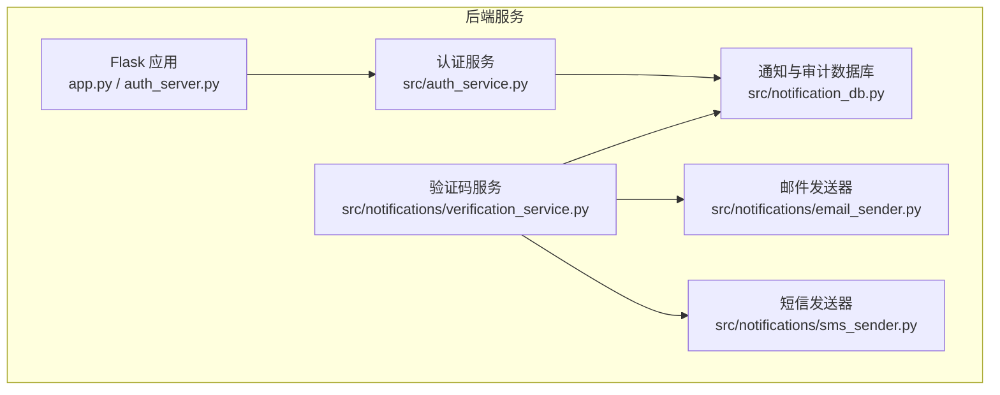
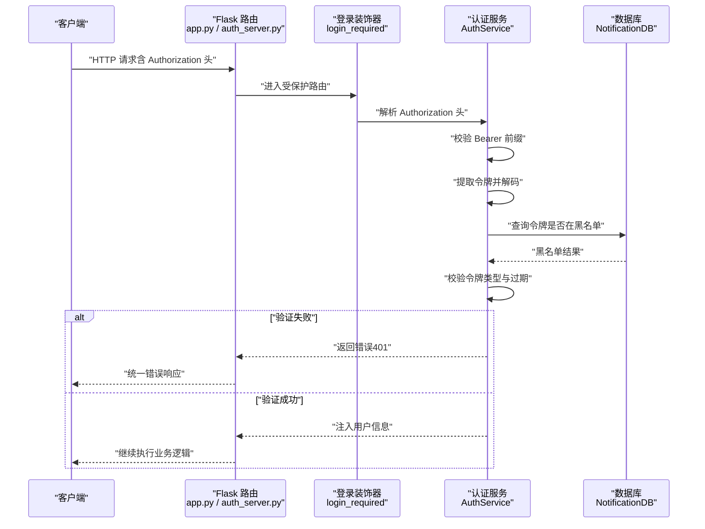
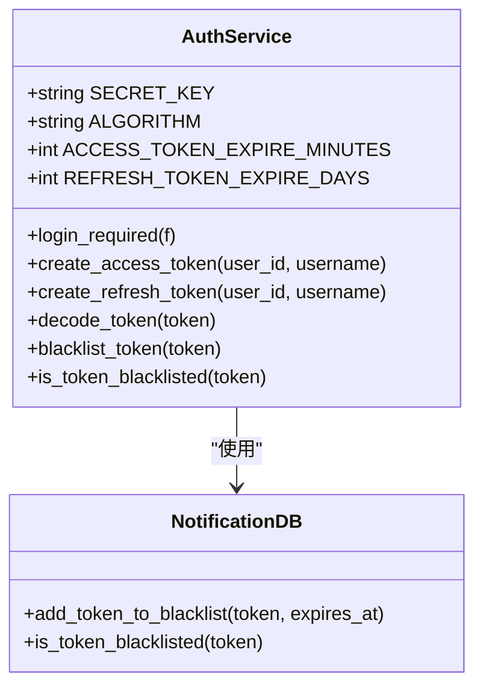
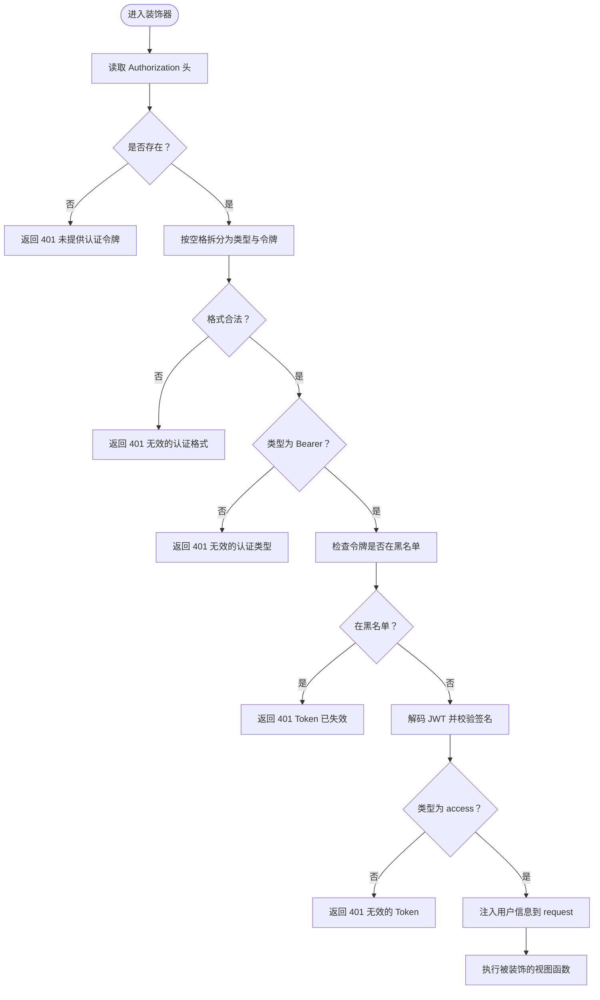
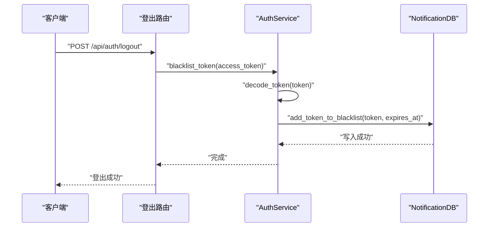
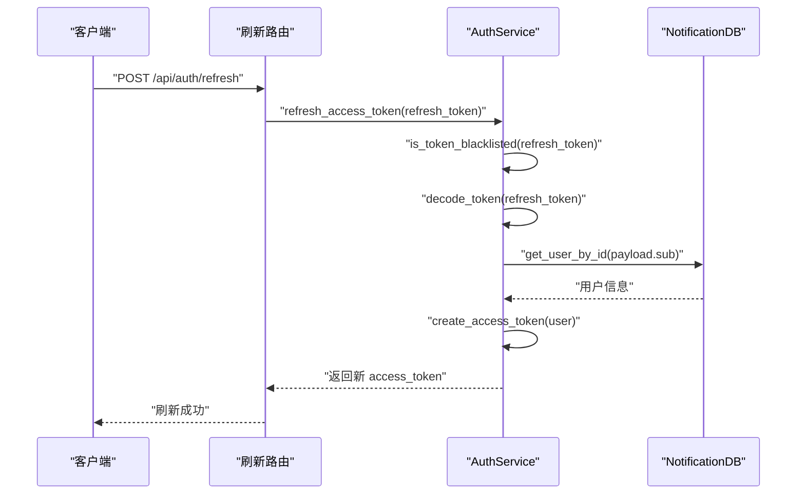
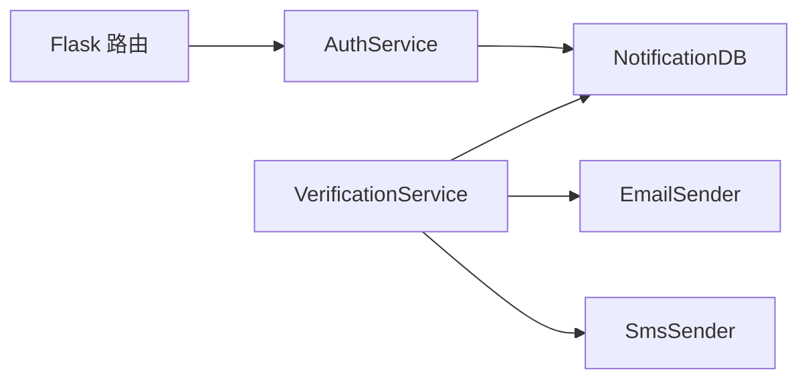

# 令牌验证

<cite>
**本文引用的文件**
- [app.py](file://python/app.py)
- [auth_server.py](file://python/auth_server.py)
- [src/auth_service.py](file://python/src/auth_service.py)
- [src/notification_db.py](file://python/src/notification_db.py)
- [src/notifications/verification_service.py](file://python/src/notifications/verification_service.py)
- [src/notifications/email_sender.py](file://python/src/notifications/email_sender.py)
- [src/notifications/sms_sender.py](file://python/src/notifications/sms_sender.py)
- [tests/test_models.py](file://python/tests/test_models.py)
- [tests/test_utils.py](file://python/tests/test_utils.py)
- [main.py](file://python/main.py)
</cite>

## 目录
1. [引言](#引言)
2. [项目结构](#项目结构)
3. [核心组件](#核心组件)
4. [架构总览](#架构总览)
5. [详细组件分析](#详细组件分析)
6. [依赖分析](#依赖分析)
7. [性能考虑](#性能考虑)
8. [故障排查指南](#故障排查指南)
9. [结论](#结论)
10. [附录](#附录)

## 引言
本文件面向开发者，系统性阐述该代码库中的令牌验证体系，覆盖以下要点：
- 令牌格式检查：Authorization 头解析、Bearer 前缀处理、令牌提取
- 签名验证：基于 HS256 的 JWT 解码与过期判断
- 过期时间判断：基于 exp 字段的到期校验
- 类型验证：区分 access 与 refresh 令牌
- 黑名单检测：登出/刷新时将令牌加入黑名单，后续请求直接拦截
- 错误码与统一返回格式：标准化的响应结构与错误码
- 异常与安全：失败路径的处理策略、审计日志与用户体验设计
- 性能与可观测性：建议的监控指标与日志实践

## 项目结构
该项目采用前后端分离架构，后端使用 Flask 提供 REST API，认证与授权逻辑集中在认证服务模块中，数据库访问通过独立的数据层封装。

图表来源
- [app.py:1-1791](file://python/app.py#L1-L1791)
- [auth_server.py:1-431](file://python/auth_server.py#L1-L431)
- [src/auth_service.py:1-187](file://python/src/auth_service.py#L1-L187)
- [src/notification_db.py:1-357](file://python/src/notification_db.py#L1-L357)
- [src/notifications/verification_service.py:1-108](file://python/src/notifications/verification_service.py#L1-L108)
- [src/notifications/email_sender.py:1-67](file://python/src/notifications/email_sender.py#L1-L67)
- [src/notifications/sms_sender.py:1-65](file://python/src/notifications/sms_sender.py#L1-L65)

章节来源
- [app.py:1-1791](file://python/app.py#L1-L1791)
- [auth_server.py:1-431](file://python/auth_server.py#L1-L431)

## 核心组件
- 认证服务（AuthService）
  - 负责密码哈希、JWT 签发与解码、令牌黑名单管理、登录拦截装饰器等
- 数据层（NotificationDB）
  - 提供用户、验证码、令牌黑名单、密码历史、审计日志等表的 CRUD 封装
- 验证码服务（VerificationService）
  - 生成验证码、发送邮件/短信、校验有效期与使用状态
- Flask 路由与装饰器
  - 在路由上应用 @auth_service.login_required 实现统一鉴权

章节来源
- [src/auth_service.py:1-187](file://python/src/auth_service.py#L1-L187)
- [src/notification_db.py:1-357](file://python/src/notification_db.py#L1-L357)
- [src/notifications/verification_service.py:1-108](file://python/src/notifications/verification_service.py#L1-L108)

## 架构总览
下图展示从客户端发起请求到后端执行业务逻辑的完整链路，重点标注了令牌验证的关键步骤。

图表来源
- [app.py:142-168](file://python/app.py#L142-L168)
- [src/auth_service.py:158-183](file://python/src/auth_service.py#L158-L183)
- [src/auth_service.py:47-56](file://python/src/auth_service.py#L47-L56)
- [src/auth_service.py:58-65](file://python/src/auth_service.py#L58-L65)

## 详细组件分析

### 认证服务（AuthService）
AuthService 是令牌验证的核心，负责：
- 令牌签发：access_token（短时）、refresh_token（长时）
- 令牌解码：HS256 签名校验与过期判断
- 黑名单管理：登出/刷新时将令牌写入黑名单，后续请求拦截
- 登录装饰器：统一解析 Authorization 头、校验令牌类型与黑名单

图表来源
- [src/auth_service.py:9-187](file://python/src/auth_service.py#L9-L187)
- [src/notification_db.py:297-311](file://python/src/notification_db.py#L297-L311)

章节来源
- [src/auth_service.py:27-45](file://python/src/auth_service.py#L27-L45)
- [src/auth_service.py:47-56](file://python/src/auth_service.py#L47-L56)
- [src/auth_service.py:58-65](file://python/src/auth_service.py#L58-L65)
- [src/auth_service.py:158-183](file://python/src/auth_service.py#L158-L183)

### 登录装饰器实现原理
装饰器负责：
- 从 Authorization 头解析令牌类型与值
- 校验前缀是否为 Bearer
- 检查令牌是否在黑名单
- 解码并校验令牌类型为 access
- 将用户标识注入到 request 对象，供后续处理器使用

图表来源
- [src/auth_service.py:158-183](file://python/src/auth_service.py#L158-L183)

章节来源
- [src/auth_service.py:158-183](file://python/src/auth_service.py#L158-L183)

### 令牌格式检查与提取
- Authorization 头解析：从请求头中读取 Authorization，并按空格拆分为两部分
- Bearer 前缀处理：仅接受 Bearer 类型，大小写不敏感
- 令牌提取：第二部分即为待验证的 JWT

章节来源
- [src/auth_service.py:161-170](file://python/src/auth_service.py#L161-L170)

### 签名验证与过期时间判断
- 使用 HS256 算法解码 JWT，若签名无效或过期则视为非法
- 过期时间字段 exp 用于判断令牌是否仍有效

章节来源
- [src/auth_service.py:47-56](file://python/src/auth_service.py#L47-L56)

### 类型验证
- access 令牌：用于访问受保护资源
- refresh 令牌：用于换取新的 access 令牌
- 装饰器要求令牌类型为 access；刷新接口要求令牌类型为 refresh

章节来源
- [src/auth_service.py:176-177](file://python/src/auth_service.py#L176-L177)
- [src/auth_service.py:120-136](file://python/src/auth_service.py#L120-L136)

### 黑名单令牌检测
- 登出/刷新时，将令牌加入黑名单，同时记录过期时间
- 后续请求若命中黑名单，直接返回 401

图表来源
- [app.py:142-168](file://python/app.py#L142-L168)
- [src/auth_service.py:61-65](file://python/src/auth_service.py#L61-L65)
- [src/notification_db.py:297-305](file://python/src/notification_db.py#L297-L305)

章节来源
- [src/auth_service.py:61-65](file://python/src/auth_service.py#L61-L65)
- [src/notification_db.py:297-311](file://python/src/notification_db.py#L297-L311)

### 刷新令牌流程
- 校验 refresh 令牌是否在黑名单
- 解码并确认类型为 refresh
- 查询用户并签发新的 access 令牌

图表来源
- [app.py:126-139](file://python/app.py#L126-L139)
- [src/auth_service.py:120-136](file://python/src/auth_service.py#L120-L136)

章节来源
- [src/auth_service.py:120-136](file://python/src/auth_service.py#L120-L136)

### 验证场景与示例（以路径代替代码）
- 有效令牌验证
  - 路由：[app.py:277-299](file://python/app.py#L277-L299)
  - 装饰器：[src/auth_service.py:158-183](file://python/src/auth_service.py#L158-L183)
- 过期令牌处理
  - 解码阶段：[src/auth_service.py:47-56](file://python/src/auth_service.py#L47-L56)
  - 返回 401：[src/auth_service.py:176-177](file://python/src/auth_service.py#L176-L177)
- 无效令牌拦截
  - 前缀校验：[src/auth_service.py:167-170](file://python/src/auth_service.py#L167-L170)
  - 类型校验：[src/auth_service.py:176-177](file://python/src/auth_service.py#L176-L177)
- 黑名单令牌检测
  - 登出路由：[app.py:142-168](file://python/app.py#L142-L168)
  - 黑名单写入：[src/auth_service.py:61-65](file://python/src/auth_service.py#L61-L65)
  - 黑名单查询：[src/notification_db.py:307-311](file://python/src/notification_db.py#L307-L311)

## 依赖分析
- 组件耦合
  - Flask 路由依赖认证服务提供的装饰器
  - 认证服务依赖数据层进行用户与令牌黑名单查询
  - 验证码服务依赖通知数据库与外部邮件/短信 SDK
- 外部依赖
  - bcrypt：密码哈希
  - PyJWT：JWT 编解码
  - PyMySQL：数据库连接
  - 阿里云 SDK：邮件/短信发送

图表来源
- [src/auth_service.py:1-187](file://python/src/auth_service.py#L1-L187)
- [src/notification_db.py:1-357](file://python/src/notification_db.py#L1-L357)
- [src/notifications/verification_service.py:1-108](file://python/src/notifications/verification_service.py#L1-L108)
- [src/notifications/email_sender.py:1-67](file://python/src/notifications/email_sender.py#L1-L67)
- [src/notifications/sms_sender.py:1-65](file://python/src/notifications/sms_sender.py#L1-L65)

章节来源
- [src/auth_service.py:1-187](file://python/src/auth_service.py#L1-L187)
- [src/notification_db.py:1-357](file://python/src/notification_db.py#L1-L357)
- [src/notifications/verification_service.py:1-108](file://python/src/notifications/verification_service.py#L1-L108)

## 性能考虑
- 令牌解码与黑名单查询均为 O(1) 或 O(log N)，整体开销低
- 建议
  - 将黑名单表建立索引（token、expires_at）
  - 使用连接池减少数据库连接成本
  - 对频繁访问的路由启用缓存（如 access_token 的轻量校验结果）
  - 监控装饰器耗时与 401 比例，识别异常流量

## 故障排查指南
- 常见错误码与含义
  - TOKEN_MISSING：未提供 Authorization 头
  - TOKEN_INVALID：令牌无效、类型不匹配、已过期、已在黑名单
  - USER_NOT_FOUND：用户不存在
  - ACCOUNT_LOCKED：账户因多次失败被临时锁定
  - INVALID_PASSWORD：密码错误
  - PASSWORD_REUSED：新密码与历史密码重复
  - REGISTER_FAILED / LOGIN_FAILED / LOGOUT_FAILED 等：通用失败码
- 统一返回格式
  - 成功：{ success: true, data: {...} }
  - 失败：{ success: false, message: "...", code: "..." }
  - 可选 error 字段用于调试
- 审计日志
  - 登录、登出、重置密码、修改密码等关键动作均写入审计日志
- 日志与监控
  - 建议记录：请求 ID、IP、User-Agent、令牌类型、处理耗时、错误码
  - 监控指标：请求总量、401 比例、鉴权耗时 P95/P99、黑名单命中率

章节来源
- [src/auth_service.py:158-183](file://python/src/auth_service.py#L158-L183)
- [src/notification_db.py:334-342](file://python/src/notification_db.py#L334-L342)
- [app.py:95-96](file://python/app.py#L95-L96)
- [auth_server.py:113-120](file://python/auth_server.py#L113-L120)

## 结论
该令牌验证体系以装饰器为核心，结合 HS256 签名、黑名单与类型校验，提供了简洁可靠的 API 保护机制。配合统一的错误码与审计日志，既保证了安全性，也便于运维与问题定位。建议在生产环境中进一步完善监控与告警，确保高可用与高安全。

## 附录

### 错误码定义与处理策略
- TOKEN_MISSING：缺失 Authorization 头，直接返回 401
- TOKEN_INVALID：令牌无效、类型不符、过期、黑名单，返回 401
- USER_NOT_FOUND：用户不存在，返回 401 或 404 视场景而定
- ACCOUNT_LOCKED：账户锁定，返回 401
- INVALID_PASSWORD：密码错误，记录失败次数并可能触发锁定
- PASSWORD_REUSED：新密码与历史重复，拒绝变更
- 其他通用错误：REGISTER_FAILED、LOGIN_FAILED、LOGOUT_FAILED 等，返回 500 并附带 error 字段

章节来源
- [src/auth_service.py:76-118](file://python/src/auth_service.py#L76-L118)
- [src/auth_service.py:120-136](file://python/src/auth_service.py#L120-L136)
- [src/auth_service.py:158-183](file://python/src/auth_service.py#L158-L183)

### 用户体验设计
- 明确提示：在前端根据 code 展示友好文案（如“令牌已过期，请重新登录”）
- 自动刷新：在支持 refresh 的场景，自动尝试刷新 access_token
- 登录态保持：合理设置 access_token 过期时间，平衡安全与体验

### 安全审计与日志
- 关键操作审计：登录、登出、密码变更、重置密码
- 日志字段建议：用户 ID、操作类型、IP、User-Agent、时间戳、结果

章节来源
- [src/notification_db.py:334-342](file://python/src/notification_db.py#L334-L342)
- [app.py:85-91](file://python/app.py#L85-L91)
- [auth_server.py:99-105](file://python/auth_server.py#L99-L105)