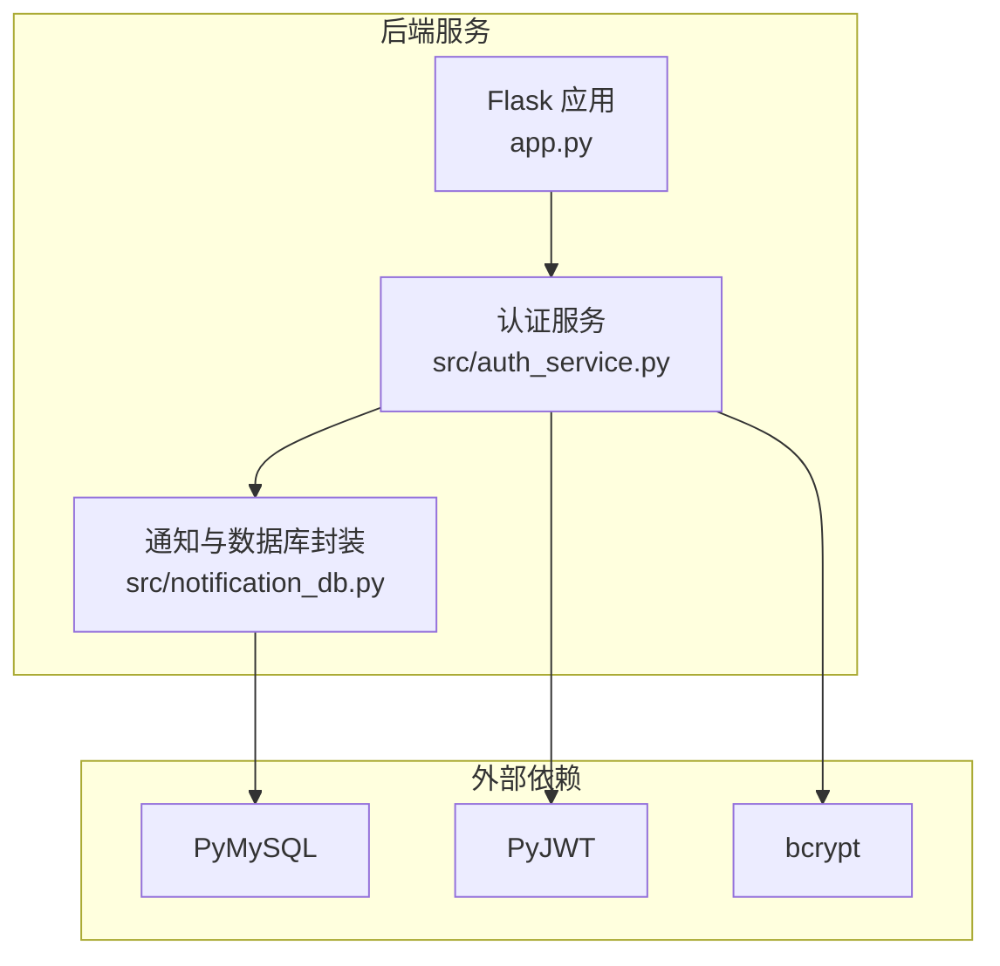
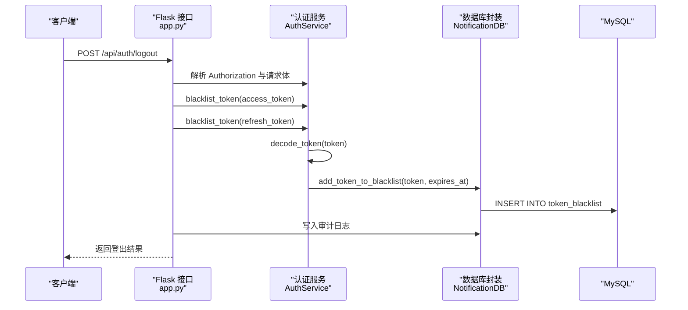
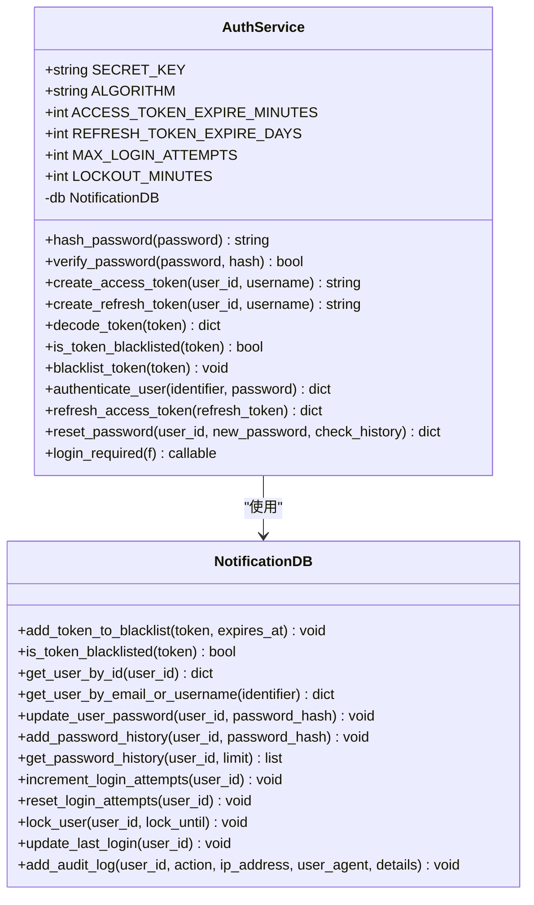
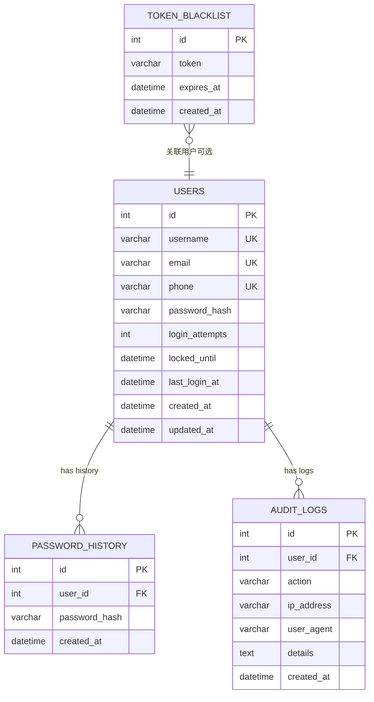
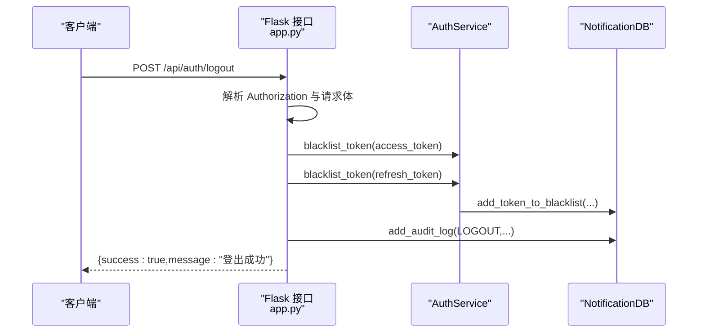
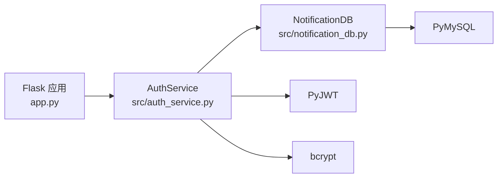

# 令牌黑名单

<cite>
**本文引用的文件**
- [app.py](file://python/app.py)
- [auth_server.py](file://python/auth_server.py)
- [auth_service.py](file://python/src/auth_service.py)
- [notification_db.py](file://python/src/notification_db.py)
- [requirements.txt](file://python/requirements.txt)
- [models.py](file://python/src/models.py)
- [utils.py](file://python/src/utils.py)
</cite>

## 目录
1. [简介](#简介)
2. [项目结构](#项目结构)
3. [核心组件](#核心组件)
4. [架构总览](#架构总览)
5. [详细组件分析](#详细组件分析)
6. [依赖分析](#依赖分析)
7. [性能考虑](#性能考虑)
8. [故障排查指南](#故障排查指南)
9. [结论](#结论)
10. [附录](#附录)

## 简介
本文件面向开发者，系统性阐述“令牌黑名单”在本项目中的设计与实现，覆盖以下主题：
- 设计原理与安全意义：通过黑名单阻止已失效或被撤销的令牌继续访问受保护资源，实现强制登出、密码修改后的会话撤销、安全风险触发后的即时下线。
- 令牌失效处理与强制登出：登出接口将当前访问令牌与刷新令牌一并加入黑名单，并记录审计日志。
- 会话管理策略：基于 JWT 的访问令牌与刷新令牌配合，黑名单用于快速阻断已撤销令牌。
- 黑名单数据库表结构：token_blacklist 表的字段、索引与约束；令牌存储格式与过期时间管理。
- 触发条件：用户主动登出、密码修改（历史密码校验后自动撤销旧令牌）、安全风险检测（可扩展）。
- 查询机制与清理策略：按令牌与过期时间查询黑名单；当前实现未包含自动清理，建议结合业务需求制定定期清理策略。
- API 使用示例：登出接口的调用方式与返回结构。
- 性能优化与内存缓存：建议引入 Redis 缓存黑名单，减少数据库压力。
- 外部存储与分布式同步：Redis 集成方案、分布式一致性与故障恢复策略。
- 实现建议：如何在现有基础上扩展黑名单能力，满足生产级安全与性能要求。

## 项目结构
本项目采用后端服务与前端页面分离的结构，认证相关的后端逻辑集中在 Python 后端，认证服务与数据库操作分别由独立模块提供。

图表来源
- [app.py:1-1719](file://python/app.py#L1-L1719)
- [auth_service.py:1-187](file://python/src/auth_service.py#L1-L187)
- [notification_db.py:1-357](file://python/src/notification_db.py#L1-L357)
- [requirements.txt:1-14](file://python/requirements.txt#L1-L14)

章节来源
- [app.py:1-1719](file://python/app.py#L1-L1719)
- [auth_service.py:1-187](file://python/src/auth_service.py#L1-L187)
- [notification_db.py:1-357](file://python/src/notification_db.py#L1-L357)
- [requirements.txt:1-14](file://python/requirements.txt#L1-L14)

## 核心组件
- 认证服务（AuthService）
  - 负责 JWT 生成与解码、令牌黑名单判定、令牌加入黑名单、登录拦截中间件等。
  - 关键方法路径：[AuthService.create_access_token:27-36](file://python/src/auth_service.py#L27-L36)、[AuthService.create_refresh_token:37-45](file://python/src/auth_service.py#L37-L45)、[AuthService.decode_token:47-56](file://python/src/auth_service.py#L47-L56)、[AuthService.is_token_blacklisted:58-59](file://python/src/auth_service.py#L58-L59)、[AuthService.blacklist_token:61-65](file://python/src/auth_service.py#L61-L65)、[AuthService.login_required:158-183](file://python/src/auth_service.py#L158-L183)。
- 数据库封装（NotificationDB）
  - 提供用户、验证码、令牌黑名单、密码历史、审计日志等表的 CRUD 操作。
  - 关键方法路径：[NotificationDB.add_token_to_blacklist:297-305](file://python/src/notification_db.py#L297-L305)、[NotificationDB.is_token_blacklisted:307-311](file://python/src/notification_db.py#L307-L311)。
- 登出 API
  - 在登出时将访问令牌与刷新令牌加入黑名单，并记录审计日志。
  - 关键路径：[app.py 登出路由:142-167](file://python/app.py#L142-L167)、[auth_server.py 登出路由:188-222](file://python/auth_server.py#L188-L222)。

章节来源
- [auth_service.py:1-187](file://python/src/auth_service.py#L1-L187)
- [notification_db.py:1-357](file://python/src/notification_db.py#L1-L357)
- [app.py:142-167](file://python/app.py#L142-L167)
- [auth_server.py:188-222](file://python/auth_server.py#L188-L222)

## 架构总览
下图展示从客户端到认证服务再到数据库的调用链路，以及令牌黑名单在其中的关键位置。

图表来源
- [app.py:142-167](file://python/app.py#L142-L167)
- [auth_service.py:61-65](file://python/src/auth_service.py#L61-L65)
- [notification_db.py:297-305](file://python/src/notification_db.py#L297-L305)

## 详细组件分析

### 组件一：AuthService（认证服务）
AuthService 是令牌黑名单的核心执行者，负责：
- 令牌生成与解码
- 黑名单判定与加入
- 登录拦截中间件，确保访问令牌未被撤销

图表来源
- [auth_service.py:9-187](file://python/src/auth_service.py#L9-L187)
- [notification_db.py:6-357](file://python/src/notification_db.py#L6-L357)

章节来源
- [auth_service.py:9-187](file://python/src/auth_service.py#L9-L187)
- [notification_db.py:6-357](file://python/src/notification_db.py#L6-L357)

### 组件二：NotificationDB（数据库封装）
NotificationDB 提供令牌黑名单的持久化能力：
- 插入黑名单：[add_token_to_blacklist:297-305](file://python/src/notification_db.py#L297-L305)
- 查询黑名单：[is_token_blacklisted:307-311](file://python/src/notification_db.py#L307-L311)
- 其他认证相关表：users、verification_codes、password_history、audit_logs

图表来源
- [notification_db.py:44-103](file://python/src/notification_db.py#L44-L103)
- [notification_db.py:297-311](file://python/src/notification_db.py#L297-L311)

章节来源
- [notification_db.py:44-103](file://python/src/notification_db.py#L44-L103)
- [notification_db.py:297-311](file://python/src/notification_db.py#L297-L311)

### 组件三：登出 API（强制登出）
登出接口在服务端将访问令牌与刷新令牌加入黑名单，并记录审计日志，实现强制登出。

图表来源
- [app.py:142-167](file://python/app.py#L142-L167)
- [auth_service.py:61-65](file://python/src/auth_service.py#L61-L65)
- [notification_db.py:297-311](file://python/src/notification_db.py#L297-L311)

章节来源
- [app.py:142-167](file://python/app.py#L142-L167)
- [auth_server.py:188-222](file://python/auth_server.py#L188-L222)
- [auth_service.py:61-65](file://python/src/auth_service.py#L61-L65)
- [notification_db.py:297-311](file://python/src/notification_db.py#L297-L311)

### 组件四：令牌加入黑名单的触发条件
- 用户主动登出：登出接口调用 AuthService.blacklist_token 将访问令牌与刷新令牌加入黑名单。
- 密码修改：AuthService.reset_password 在更新密码前会检查历史密码，若通过则将旧密码对应的令牌加入黑名单（此逻辑在当前实现中未直接体现，但可通过扩展在密码变更后撤销相关会话）。
- 安全风险检测：可在检测到高风险行为时调用 AuthService.blacklist_token 主动撤销相关令牌。

章节来源
- [app.py:142-167](file://python/app.py#L142-L167)
- [auth_service.py:138-156](file://python/src/auth_service.py#L138-L156)
- [auth_service.py:61-65](file://python/src/auth_service.py#L61-L65)

### 组件五：黑名单查询机制与清理策略
- 查询机制：NotificationDB.is_token_blacklisted 通过 token 与当前时间比较 expires_at 判断是否在黑名单中。
- 清理策略：当前实现未包含自动清理过期黑名单条目。建议结合业务场景制定定期清理策略（例如定时任务删除过期记录），以控制表规模与查询性能。

章节来源
- [notification_db.py:307-311](file://python/src/notification_db.py#L307-L311)

## 依赖分析
- Flask 应用层：提供路由与中间件，调用认证服务与数据库封装。
- 认证服务层：负责令牌生命周期管理与黑名单判定。
- 数据库封装层：提供统一的数据库连接与表操作。
- 外部依赖：PyJWT（令牌生成与解码）、bcrypt（密码哈希）、PyMySQL（数据库驱动）。

图表来源
- [app.py:1-1719](file://python/app.py#L1-L1719)
- [auth_service.py:1-187](file://python/src/auth_service.py#L1-L187)
- [notification_db.py:1-357](file://python/src/notification_db.py#L1-L357)
- [requirements.txt:1-14](file://python/requirements.txt#L1-L14)

章节来源
- [requirements.txt:1-14](file://python/requirements.txt#L1-L14)

## 性能考虑
- 黑名单查询复杂度：当前黑名单查询基于单列 token 与过期时间比较，建议在 token 字段建立唯一索引以提升查询效率。
- 数据库压力：频繁的黑名单写入与查询可能成为瓶颈。建议引入 Redis 作为内存缓存层：
  - 写入：AuthService.blacklist_token 成功后同时写入 Redis（key: token，value: expires_at）。
  - 查询：AuthService.is_token_blacklisted 优先查 Redis，命中即返回；未命中再查数据库。
  - 过期：Redis 自动过期，无需手动清理。
- 批量与异步：大批量令牌撤销可考虑异步队列或批量写入策略，降低主流程阻塞。
- 连接池与重连：NotificationDB 已具备连接重试机制，建议结合 Redis 连接池与超时配置优化整体性能。

[本节为通用性能建议，不直接分析具体文件，故无章节来源]

## 故障排查指南
- 登出后仍可访问
  - 检查 AuthService.blacklist_token 是否被调用，确认 token 是否正确解析与入库。
  - 核对 NotificationDB.is_token_blacklisted 的查询逻辑与时间比较。
- 登录拦截失效
  - 确认 login_required 中间件是否正确调用 is_token_blacklisted。
  - 检查 JWT 解码是否抛出异常导致中间件误判。
- 数据库连接问题
  - NotificationDB._ensure_connection 会在连接断开时尝试重连，若持续失败，检查数据库配置与网络。
- 审计日志缺失
  - 登出接口调用 add_audit_log，确认调用链路与参数传递。

章节来源
- [auth_service.py:158-183](file://python/src/auth_service.py#L158-L183)
- [notification_db.py:297-311](file://python/src/notification_db.py#L297-L311)
- [app.py:142-167](file://python/app.py#L142-L167)

## 结论
本项目已实现基础的令牌黑名单能力：通过登出接口将访问与刷新令牌加入黑名单，并在登录拦截中进行判定。为进一步增强安全性与性能，建议：
- 引入 Redis 作为黑名单缓存层，显著降低数据库压力。
- 建立定期清理策略，控制黑名单表规模。
- 在密码修改等关键事件后扩展撤销旧令牌的逻辑。
- 在分布式环境下通过 Redis 实现跨节点同步与故障恢复。

[本节为总结性内容，不直接分析具体文件，故无章节来源]

## 附录

### 黑名单数据库表结构设计要点
- 表名：token_blacklist
- 字段：
  - id：自增主键
  - token：令牌字符串（建议唯一索引）
  - expires_at：过期时间（用于快速过滤过期项）
  - created_at：记录创建时间
- 索引与约束：
  - 建议在 token 上建立唯一索引，加速查询与去重。
  - 在 expires_at 上建立索引，便于按时间清理。

章节来源
- [notification_db.py:74-80](file://python/src/notification_db.py#L74-L80)

### 令牌存储格式与过期时间管理
- 存储格式：完整 JWT 字符串（访问令牌或刷新令牌）。
- 过期时间：从令牌载荷中的 exp 字段解析得到，入库时转换为本地时间存入 expires_at。

章节来源
- [auth_service.py:61-65](file://python/src/auth_service.py#L61-L65)
- [notification_db.py:297-305](file://python/src/notification_db.py#L297-L305)

### 黑名单查询机制
- 查询逻辑：根据 token 查找记录，且 expires_at > 当前时间。
- 返回值：存在匹配记录则视为在黑名单中。

章节来源
- [notification_db.py:307-311](file://python/src/notification_db.py#L307-L311)

### 定期清理策略建议
- 清理范围：删除 expires_at 早于当前时间的黑名单记录。
- 触发方式：定时任务（如每日凌晨）或后台作业。
- 影响评估：清理前应统计过期记录数量，避免对数据库造成瞬时压力。

[本节为通用建议，不直接分析具体文件，故无章节来源]

### 黑名单 API 使用示例
- 登出接口
  - 方法与路径：POST /api/auth/logout
  - 请求头：Authorization: Bearer <access_token>
  - 请求体：{ refresh_token: "<refresh_token>" }
  - 返回：{ success: true, message: "登出成功" }

章节来源
- [app.py:142-167](file://python/app.py#L142-L167)
- [auth_server.py:188-222](file://python/auth_server.py#L188-L222)

### 性能优化与内存缓存策略
- Redis 缓存
  - 写入：key=token，value=expires_at（Unix 时间戳或本地时间字符串）
  - 查询：exists(token) 且 expires_at > now
  - 过期：利用 Redis TTL 自动过期
- 缓存穿透防护：对不存在的 token 可设置短 TTL 的占位，避免频繁查库
- 缓存一致性：黑名单写入成功后再写入 Redis；失败时回滚或延迟重试

[本节为通用建议，不直接分析具体文件，故无章节来源]

### 与 Redis 等外部存储的集成方案
- 写入流程：AuthService.blacklist_token 成功后，同时写入 Redis 与数据库。
- 读取流程：AuthService.is_token_blacklisted 优先查 Redis，未命中再查数据库。
- 分布式同步：Redis 集群或哨兵模式保障高可用；跨节点一致性通过 Redis 事务或消息队列保证最终一致。
- 故障恢复：Redis 宕机时降级为仅数据库查询；恢复后补齐缓存。

[本节为通用建议，不直接分析具体文件，故无章节来源]