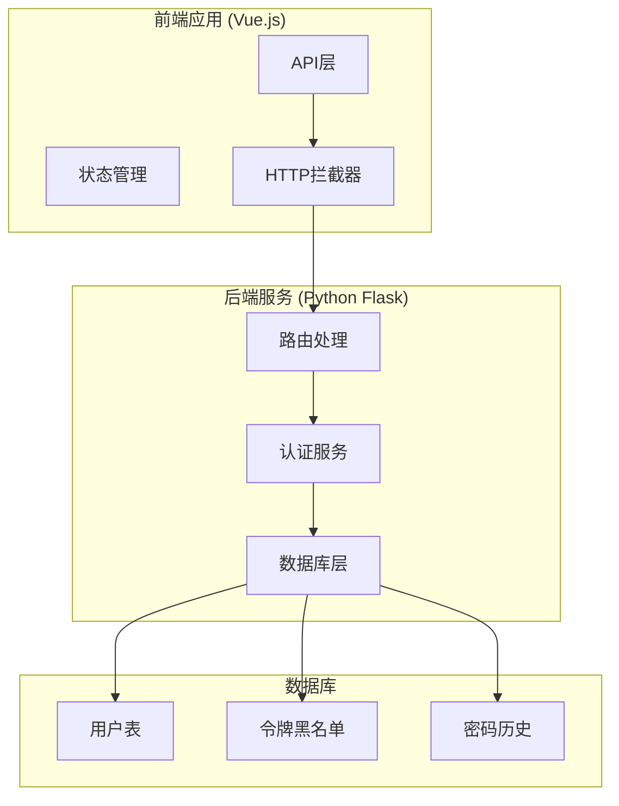
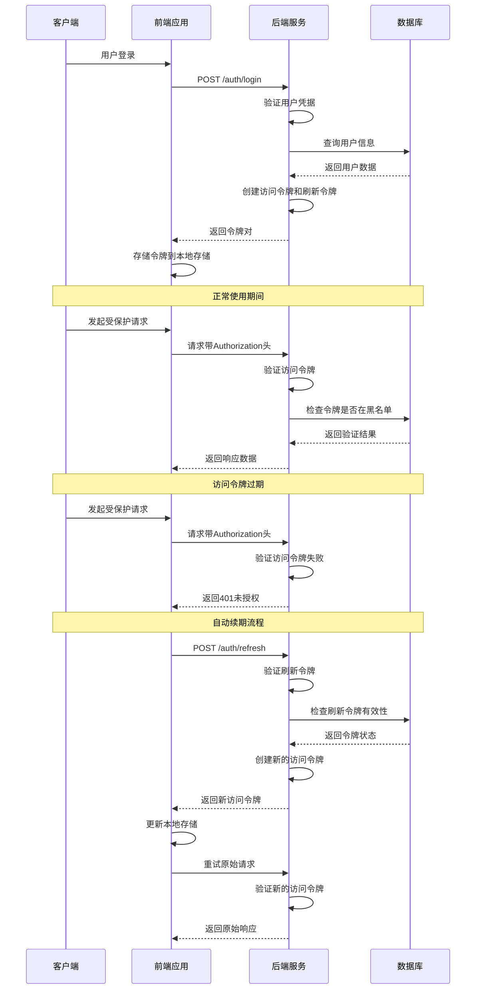
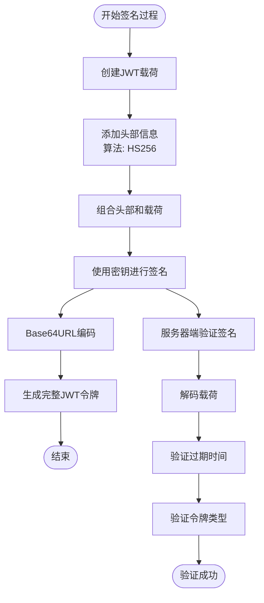
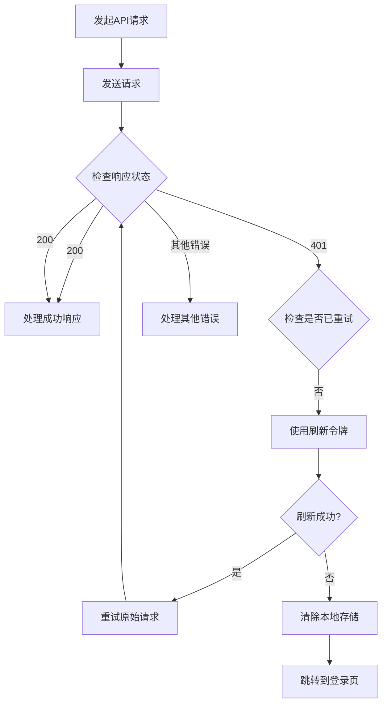
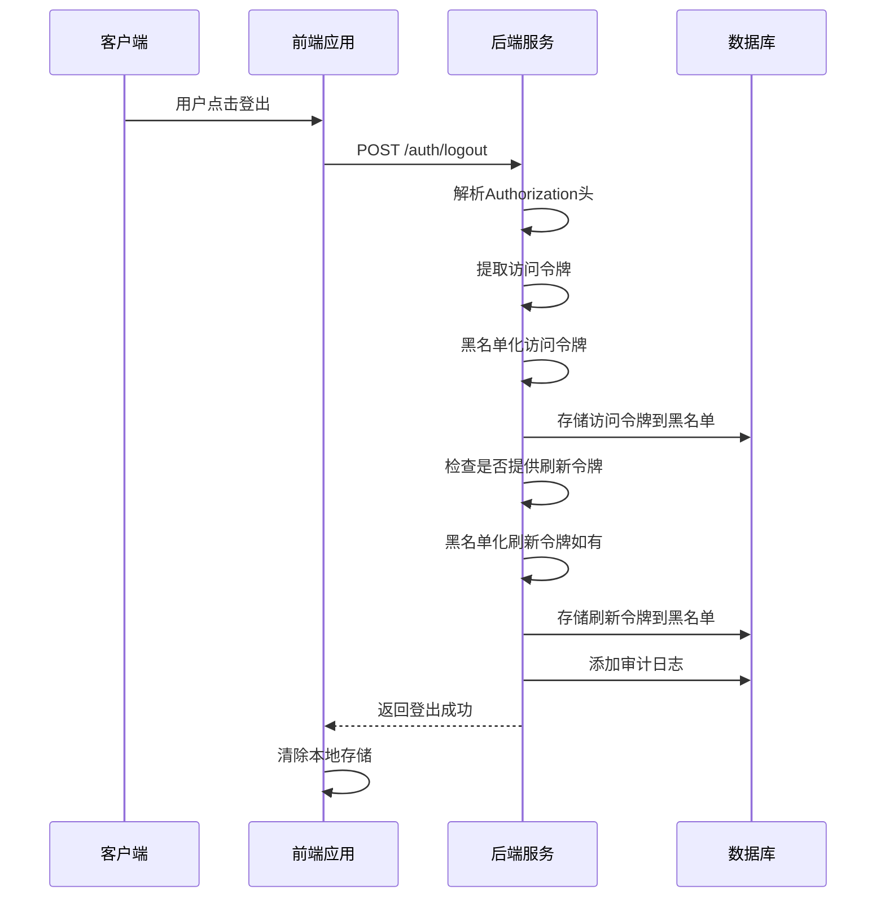
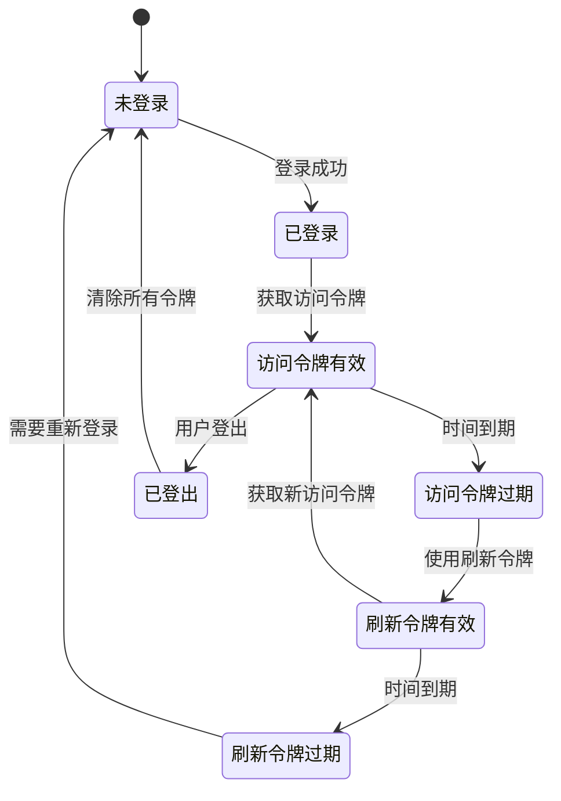
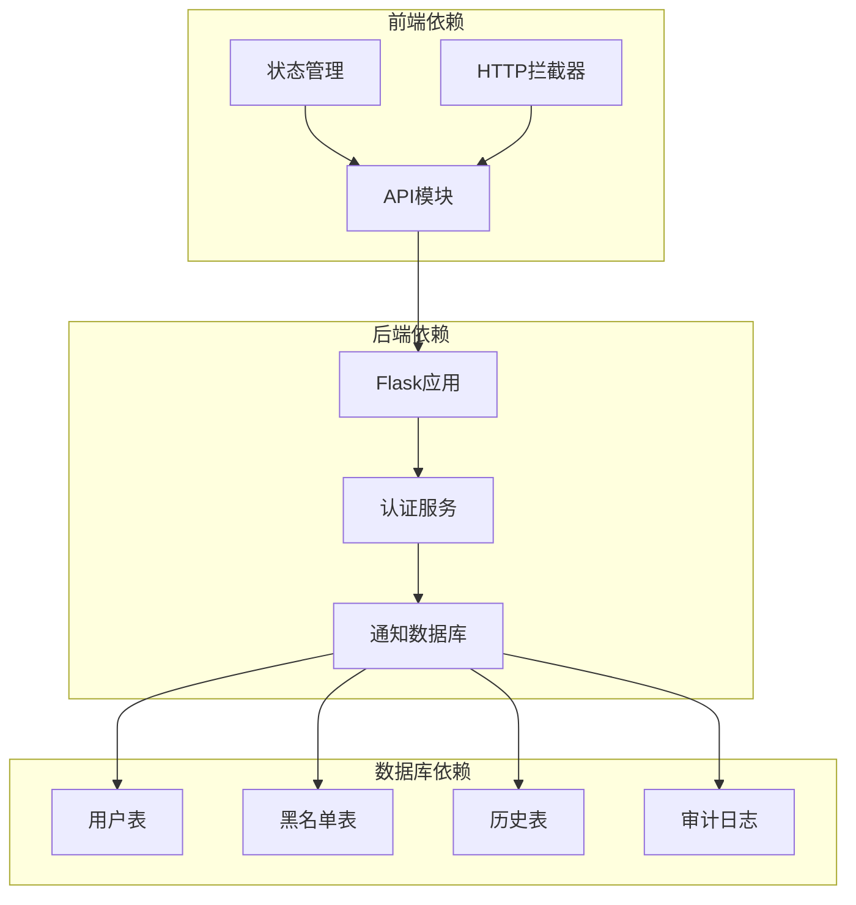

# 刷新令牌

<cite>
**本文档引用的文件**
- [auth_service.py](file://python/src/auth_service.py)
- [notification_db.py](file://python/src/notification_db.py)
- [app.py](file://python/app.py)
- [auth_server.py](file://python/auth_server.py)
- [index.js](file://python-web/src/api/index.js)
- [auth.js](file://python-web/src/stores/auth.js)
</cite>

## 目录
1. [简介](#简介)
2. [项目结构](#项目结构)
3. [核心组件](#核心组件)
4. [架构概览](#架构概览)
5. [详细组件分析](#详细组件分析)
6. [依赖关系分析](#依赖关系分析)
7. [性能考虑](#性能考虑)
8. [故障排除指南](#故障排除指南)
9. [结论](#结论)

## 简介

刷新令牌系统是现代Web应用中实现安全令牌续期的核心机制。该系统通过分离短期访问令牌和长期刷新令牌，实现了在保证安全性的同时提供良好的用户体验。本系统采用JWT（JSON Web Token）技术，其中访问令牌有效期较短（30分钟），刷新令牌有效期较长（7天），并通过黑名单机制确保令牌的安全性。

刷新令牌系统的主要设计目的是：
- 提供短期访问令牌以减少敏感信息暴露时间
- 允许长期会话维持，避免频繁重新登录
- 实现令牌过期后的自动续期机制
- 通过黑名单机制防止已泄露令牌的滥用
- 支持安全的用户注销流程

## 项目结构

该项目采用前后端分离的架构设计，主要分为Python后端服务和Vue.js前端应用两部分：



**图表来源**
- [auth_service.py:1-187](file://python/src/auth_service.py#L1-L187)
- [notification_db.py:1-357](file://python/src/notification_db.py#L1-L357)
- [app.py:1-1719](file://python/app.py#L1-L1719)

**章节来源**
- [auth_service.py:1-187](file://python/src/auth_service.py#L1-L187)
- [notification_db.py:1-357](file://python/src/notification_db.py#L1-L357)
- [app.py:1-1719](file://python/app.py#L1-L1719)

## 核心组件

### 认证服务 (AuthService)

认证服务是整个刷新令牌系统的核心，负责令牌的创建、验证和管理。它包含了以下关键功能：

- **令牌创建**: 生成访问令牌和刷新令牌
- **令牌验证**: 验证令牌的有效性和完整性
- **令牌续期**: 基于刷新令牌生成新的访问令牌
- **黑名单管理**: 维护失效令牌列表
- **安全控制**: 实现登录尝试限制和账户锁定机制

### 数据库层 (NotificationDB)

数据库层提供了完整的令牌管理和用户数据存储功能：

- **用户管理**: 用户注册、登录验证、个人信息维护
- **令牌黑名单**: 存储失效令牌及其过期时间
- **审计日志**: 记录用户操作和系统事件
- **密码历史**: 存储用户密码变更历史，防止重复使用

### 前端API拦截器

前端实现了智能的HTTP请求拦截机制，能够自动处理401未授权错误并执行令牌续期：

- **自动续期**: 检测到401错误时自动使用刷新令牌获取新访问令牌
- **重试机制**: 成功续期后自动重试原始请求
- **错误处理**: 处理续期失败的情况并引导用户重新登录

**章节来源**
- [auth_service.py:9-187](file://python/src/auth_service.py#L9-L187)
- [notification_db.py:6-357](file://python/src/notification_db.py#L6-L357)
- [index.js:1-95](file://python-web/src/api/index.js#L1-L95)

## 架构概览

刷新令牌系统采用分层架构设计，确保了高内聚低耦合的代码组织：



**图表来源**
- [auth_service.py:76-136](file://python/src/auth_service.py#L76-L136)
- [index.js:22-59](file://python-web/src/api/index.js#L22-L59)
- [app.py:126-139](file://python/app.py#L126-L139)

## 详细组件分析

### 访问令牌与刷新令牌的payload结构

#### 访问令牌 (Access Token) 结构
访问令牌用于短期身份验证，包含以下关键字段：

| 字段名 | 类型 | 描述 | 示例值 |
|--------|------|------|--------|
| sub | String | 用户标识符 | "123" |
| username | String | 用户名 | "john_doe" |
| type | String | 令牌类型 | "access" |
| exp | Integer | 过期时间戳 | 1703678400 |

#### 刷新令牌 (Refresh Token) 结构
刷新令牌用于获取新的访问令牌，具有更长的有效期：

| 字段名 | 类型 | 描述 | 示例值 |
|--------|------|------|--------|
| sub | String | 用户标识符 | "123" |
| username | String | 用户名 | "john_doe" |
| type | String | 令牌类型 | "refresh" |
| exp | Integer | 过期时间戳 | 1703678400 |

**章节来源**
- [auth_service.py:27-45](file://python/src/auth_service.py#L27-L45)

### HS256签名过程

系统使用HS256算法进行JWT签名，确保令牌的完整性和真实性：



**图表来源**
- [auth_service.py:27-45](file://python/src/auth_service.py#L27-L45)

**章节来源**
- [auth_service.py:27-56](file://python/src/auth_service.py#L27-L56)

### 过期时间管理

系统实现了严格的过期时间管理机制：

#### 访问令牌配置
- **有效期**: 30分钟
- **用途**: 短期API访问
- **特点**: 高频续期需求

#### 刷新令牌配置  
- **有效期**: 7天
- **用途**: 获取新的访问令牌
- **特点**: 低频使用，长期有效

#### 黑名单机制
- **存储**: 数据库存储失效令牌
- **过期**: 使用令牌的实际过期时间
- **清理**: 自动清理过期的黑名单记录

**章节来源**
- [auth_service.py:12-13](file://python/src/auth_service.py#L12-L13)
- [notification_db.py:297-311](file://python/src/notification_db.py#L297-L311)

### 刷新令牌API调用示例

#### 基础API端点
系统提供了标准的RESTful API端点：

| 端点 | 方法 | 描述 | 请求体 | 响应 |
|------|------|------|--------|------|
| `/api/auth/login` | POST | 用户登录 | `{identifier, password}` | `{access_token, refresh_token}` |
| `/api/auth/refresh` | POST | 刷新访问令牌 | `{refresh_token}` | `{access_token}` |
| `/api/auth/logout` | POST | 用户登出 | `{refresh_token}` | `{success}` |

#### 前端调用示例
```javascript
// 登录获取令牌
const loginResponse = await authAPI.login({
  identifier: 'john_doe',
  password: 'secure_password'
});

// 使用刷新令牌续期
const refreshResponse = await authAPI.refreshToken(refreshToken);
localStorage.setItem('access_token', refreshResponse.data.access_token);

// 安全登出
await authAPI.logout(refreshToken);
```

**章节来源**
- [app.py:126-167](file://python/app.py#L126-L167)
- [auth_server.py:161-223](file://python/auth_server.py#L161-L223)

### 错误处理策略

系统实现了多层次的错误处理机制：

#### 令牌验证错误
- **TOKEN_INVALID**: 无效的令牌格式或类型
- **TOKEN_EXPIRED**: 令牌已过期
- **TOKEN_BLACKLISTED**: 令牌在黑名单中
- **USER_NOT_FOUND**: 关联用户不存在

#### 登录相关错误
- **INVALID_CREDENTIALS**: 用户名或密码错误
- **ACCOUNT_LOCKED**: 账户被锁定
- **PASSWORD_NOT_SET**: 用户未设置密码

#### API错误处理
前端通过HTTP拦截器自动处理401错误，实现透明的令牌续期：



**图表来源**
- [index.js:22-59](file://python-web/src/api/index.js#L22-L59)

**章节来源**
- [auth_service.py:120-136](file://python/src/auth_service.py#L120-L136)
- [index.js:22-59](file://python-web/src/api/index.js#L22-L59)

### 安全注销流程

系统实现了安全的令牌注销机制，防止令牌滥用：



**图表来源**
- [auth_service.py:61-65](file://python/src/auth_service.py#L61-L65)
- [notification_db.py:297-311](file://python/src/notification_db.py#L297-L311)

**章节来源**
- [auth_service.py:61-65](file://python/src/auth_service.py#L61-L65)
- [notification_db.py:297-311](file://python/src/notification_db.py#L297-L311)

### 生命周期管理与自动续期

#### 令牌生命周期
系统实现了完整的令牌生命周期管理：



#### 自动续期机制
前端实现了智能的自动续期机制：

1. **401错误检测**: 监听API响应中的401状态码
2. **刷新令牌检查**: 验证本地存储中的刷新令牌
3. **令牌续期**: 调用刷新API获取新的访问令牌
4. **请求重试**: 使用新令牌重试原始请求
5. **错误处理**: 处理续期失败的情况

**章节来源**
- [index.js:22-59](file://python-web/src/api/index.js#L22-L59)
- [auth_service.py:120-136](file://python/src/auth_service.py#L120-L136)

### 令牌轮换策略

系统支持灵活的令牌轮换策略：

#### 密码轮换
- **历史检查**: 防止用户重复使用最近的密码
- **历史长度**: 默认保留最近5个密码
- **验证机制**: 新密码与历史密码进行比较

#### 登录尝试限制
- **最大尝试次数**: 5次错误登录
- **锁定时间**: 15分钟
- **自动解锁**: 锁定时间过后自动解锁

#### 令牌轮换触发条件
- **密码更改**: 更改密码时轮换所有令牌
- **账户锁定**: 账户被锁定时轮换令牌
- **管理员操作**: 管理员强制轮换令牌

**章节来源**
- [auth_service.py:138-156](file://python/src/auth_service.py#L138-L156)
- [auth_service.py:67-74](file://python/src/auth_service.py#L67-L74)

### 长时间在线场景处理

系统针对用户长时间在线场景进行了专门优化：

#### 令牌预刷新
- **提前刷新**: 在访问令牌过期前10分钟自动刷新
- **后台刷新**: 在用户不活跃时进行令牌刷新
- **智能策略**: 根据用户活动模式调整刷新频率

#### 会话保持机制
- **心跳检测**: 定期发送轻量级请求保持会话活跃
- **自动续期**: 在后台自动续期访问令牌
- **错误恢复**: 处理网络中断后的会话恢复

#### 性能优化
- **缓存策略**: 缓存用户信息减少数据库查询
- **批量操作**: 批量处理多个API请求
- **连接池**: 使用数据库连接池提高性能

## 依赖关系分析

### 组件依赖图



**图表来源**
- [auth_service.py:17-18](file://python/src/auth_service.py#L17-L18)
- [notification_db.py:6-17](file://python/src/notification_db.py#L6-L17)

### 外部依赖

系统依赖的关键外部库：

| 依赖库 | 版本 | 用途 |
|--------|------|------|
| Flask | 最新版 | Web框架 |
| PyMySQL | 最新版 | MySQL数据库驱动 |
| bcrypt | 最新版 | 密码哈希 |
| PyJWT | 最新版 | JWT令牌处理 |

**章节来源**
- [auth_service.py:1-6](file://python/src/auth_service.py#L1-L6)
- [notification_db.py:1-4](file://python/src/notification_db.py#L1-L4)

## 性能考虑

### 令牌性能优化

#### 缓存策略
- **用户信息缓存**: 缓存用户基本信息减少数据库查询
- **令牌验证缓存**: 缓存令牌验证结果提高性能
- **配置缓存**: 缓存系统配置参数

#### 数据库优化
- **索引优化**: 为常用查询字段建立索引
- **连接池**: 使用数据库连接池减少连接开销
- **批量操作**: 批量处理相似操作

#### 前端性能
- **懒加载**: 按需加载模块和组件
- **内存管理**: 及时清理不再使用的资源
- **异步处理**: 使用异步操作避免阻塞UI

### 安全性能平衡

系统在保证安全性的同时优化性能：

- **令牌大小**: 保持JWT令牌最小化
- **加密强度**: 平衡加密强度和性能
- **验证策略**: 优化令牌验证流程

## 故障排除指南

### 常见问题诊断

#### 令牌验证失败
**症状**: API返回401未授权错误
**可能原因**:
- 访问令牌已过期
- 令牌格式不正确
- 令牌被加入黑名单
- 服务器时间不同步

**解决方法**:
1. 检查本地存储中的令牌
2. 验证令牌格式和签名
3. 确认服务器时间设置
4. 检查令牌黑名单状态

#### 刷新令牌失效
**症状**: 刷新API返回错误
**可能原因**:
- 刷新令牌已过期（7天）
- 刷新令牌被注销
- 数据库连接问题
- 服务器配置错误

**解决方法**:
1. 引导用户重新登录
2. 检查数据库连接状态
3. 验证服务器配置
4. 查看服务器日志

#### 前端自动续期失败
**症状**: 应用无法自动续期令牌
**可能原因**:
- 本地存储中的刷新令牌丢失
- 网络连接问题
- 前端代码错误
- 服务器API不可用

**解决方法**:
1. 检查浏览器本地存储
2. 验证网络连接
3. 检查前端JavaScript错误
4. 测试服务器API可用性

### 调试工具和技巧

#### 服务器端调试
- **日志记录**: 启用详细的日志记录
- **错误监控**: 设置错误监控和告警
- **性能分析**: 使用性能分析工具

#### 客户端调试
- **浏览器开发者工具**: 检查网络请求和响应
- **本地存储检查**: 验证令牌存储状态
- **控制台日志**: 查看JavaScript错误

**章节来源**
- [auth_service.py:47-56](file://python/src/auth_service.py#L47-L56)
- [index.js:22-59](file://python-web/src/api/index.js#L22-L59)

## 结论

刷新令牌系统通过精心设计的架构和实现，为现代Web应用提供了安全可靠的令牌管理解决方案。系统的主要优势包括：

### 核心优势
- **安全性**: 通过分离短期访问令牌和长期刷新令牌，减少了敏感信息的暴露风险
- **用户体验**: 自动续期机制避免了频繁重新登录的困扰
- **可扩展性**: 模块化的架构设计便于功能扩展和维护
- **可靠性**: 完善的错误处理和故障恢复机制

### 技术亮点
- **JWT集成**: 标准化的JWT实现确保了跨平台兼容性
- **黑名单机制**: 有效的令牌撤销和安全控制
- **智能续期**: 前端自动续期机制提升用户体验
- **审计日志**: 完整的操作记录便于安全审计

### 最佳实践建议
1. **生产环境配置**: 在生产环境中使用更强的密钥和更严格的安全配置
2. **监控和告警**: 建立完善的监控体系及时发现和处理问题
3. **定期审计**: 定期审查令牌使用情况和安全策略
4. **性能优化**: 根据实际使用情况进行性能调优

该系统为开发者实现安全的令牌续期功能提供了完整的参考实现，可以根据具体需求进行定制和扩展。