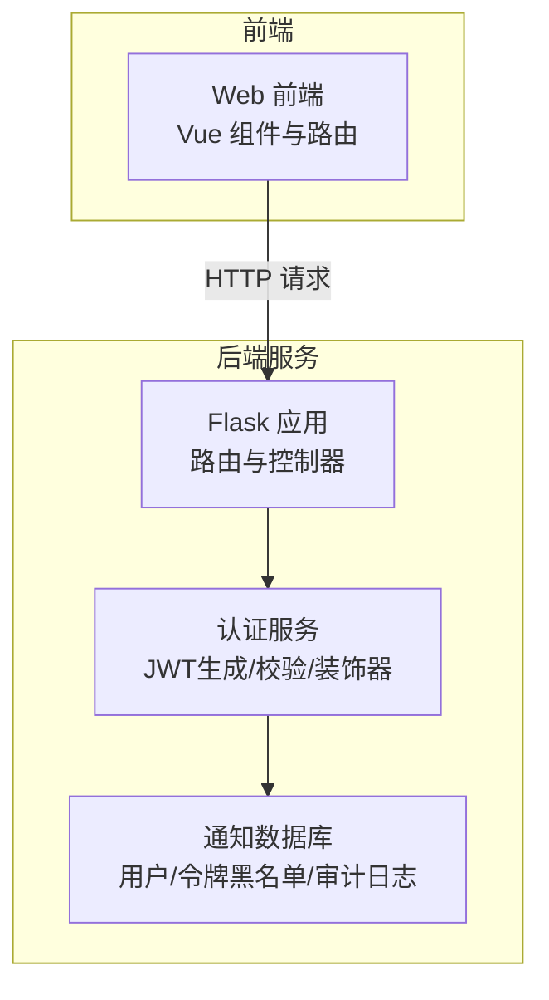
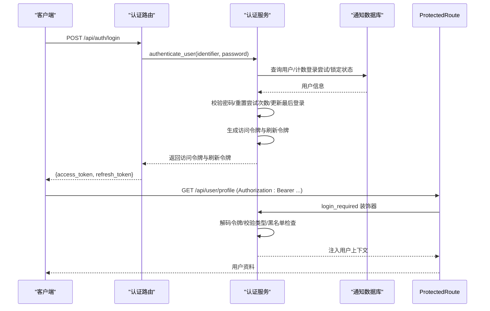
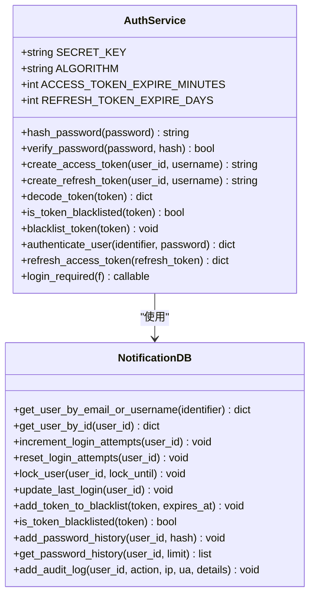
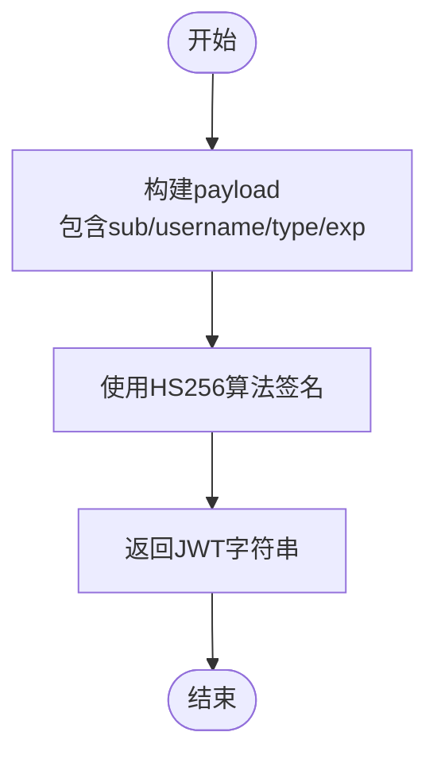
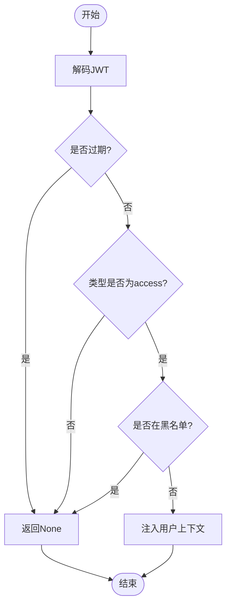
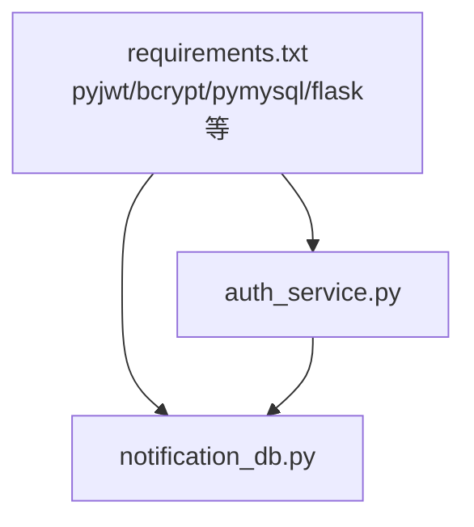

# 访问令牌

<cite>
**本文引用的文件**
- [auth_service.py](file://python/src/auth_service.py)
- [notification_db.py](file://python/src/notification_db.py)
- [app.py](file://python/app.py)
- [auth_server.py](file://python/auth_server.py)
- [requirements.txt](file://python/requirements.txt)
</cite>

## 目录
1. [简介](#简介)
2. [项目结构](#项目结构)
3. [核心组件](#核心组件)
4. [架构总览](#架构总览)
5. [详细组件分析](#详细组件分析)
6. [依赖分析](#依赖分析)
7. [性能考量](#性能考量)
8. [故障排查指南](#故障排查指南)
9. [结论](#结论)
10. [附录](#附录)

## 简介
本文件围绕访问令牌系统进行深入说明，重点覆盖以下方面：
- JWT访问令牌的生成机制：payload结构设计（用户ID、用户名、令牌类型、过期时间）
- HS256算法签名过程与密钥管理
- 令牌有效期管理：默认30分钟
- 令牌编码与解码流程、payload字段含义、过期时间计算方式
- 在API请求中的使用示例：Authorization头格式、Bearer前缀规范
- 令牌验证装饰器实现原理、错误处理策略、安全注意事项
- 面向开发者的实践建议与最佳实践

## 项目结构
该系统采用前后端分离架构，后端由Flask应用提供REST接口，认证相关逻辑集中在认证服务模块中，数据库操作封装在通知数据库模块中。

图表来源
- [app.py:1-800](file://python/app.py#L1-L800)
- [auth_service.py:1-187](file://python/src/auth_service.py#L1-L187)
- [notification_db.py:1-357](file://python/src/notification_db.py#L1-L357)

章节来源
- [app.py:1-800](file://python/app.py#L1-L800)
- [auth_service.py:1-187](file://python/src/auth_service.py#L1-L187)
- [notification_db.py:1-357](file://python/src/notification_db.py#L1-L357)

## 核心组件
- 认证服务（AuthService）：负责密码哈希、JWT生成与解码、令牌黑名单、登录装饰器等
- 通知数据库（NotificationDB）：提供用户、验证码、令牌黑名单、密码历史、审计日志等数据访问能力
- Flask应用（app.py / auth_server.py）：定义认证相关路由，如登录、刷新、登出、修改密码等，并使用认证装饰器保护受保护接口

章节来源
- [auth_service.py:1-187](file://python/src/auth_service.py#L1-L187)
- [notification_db.py:1-357](file://python/src/notification_db.py#L1-L357)
- [app.py:1-800](file://python/app.py#L1-L800)
- [auth_server.py:1-431](file://python/auth_server.py#L1-L431)

## 架构总览
访问令牌系统的关键交互如下：

图表来源
- [app.py:99-124](file://python/app.py#L99-L124)
- [auth_service.py:76-118](file://python/src/auth_service.py#L76-L118)
- [auth_service.py:158-183](file://python/src/auth_service.py#L158-L183)
- [notification_db.py:190-249](file://python/src/notification_db.py#L190-L249)

## 详细组件分析

### 认证服务（AuthService）
AuthService负责JWT访问令牌的生成、解码、验证以及登录所需的装饰器实现。其关键点如下：
- 密钥与算法：使用对称密钥与HS256算法进行签名
- 访问令牌payload字段：
  - sub：用户ID（字符串形式）
  - username：用户名
  - type：令牌类型（access）
  - exp：过期时间（UTC时间戳）
- 刷新令牌payload字段：
  - sub：用户ID（字符串形式）
  - username：用户名
  - type：令牌类型（refresh）
  - exp：过期时间（UTC时间戳）
- 过期时间：
  - 访问令牌：默认30分钟
  - 刷新令牌：默认7天
- 解码与黑名单：
  - 解码异常统一返回None，避免泄露内部错误
  - 黑名单基于数据库表token_blacklist存储，按exp时间判断是否仍有效
- 登录装饰器：
  - 从Authorization头解析Bearer令牌
  - 校验令牌类型为access
  - 检查是否在黑名单中
  - 将用户上下文注入到request对象

图表来源
- [auth_service.py:9-187](file://python/src/auth_service.py#L9-L187)
- [notification_db.py:6-357](file://python/src/notification_db.py#L6-L357)

章节来源
- [auth_service.py:9-187](file://python/src/auth_service.py#L9-L187)
- [notification_db.py:1-357](file://python/src/notification_db.py#L1-L357)

### 令牌生成与编码流程
- payload构建：包含用户ID、用户名、令牌类型、过期时间
- 使用HS256算法与对称密钥进行签名
- 返回JWT字符串

图表来源
- [auth_service.py:27-45](file://python/src/auth_service.py#L27-L45)

章节来源
- [auth_service.py:27-45](file://python/src/auth_service.py#L27-L45)

### 令牌解码与验证流程
- 使用对称密钥与HS256算法解码
- 捕获过期与无效令牌异常，统一返回None
- 登录装饰器进一步校验令牌类型与黑名单

图表来源
- [auth_service.py:47-56](file://python/src/auth_service.py#L47-L56)
- [auth_service.py:158-183](file://python/src/auth_service.py#L158-L183)

章节来源
- [auth_service.py:47-56](file://python/src/auth_service.py#L47-L56)
- [auth_service.py:158-183](file://python/src/auth_service.py#L158-L183)

### 访问令牌在API请求中的使用
- Authorization头格式：Bearer <access_token>
- 路由层通过装饰器login_required自动校验令牌有效性
- 成功后，路由函数可通过request.user_id与request.username获取用户上下文

章节来源
- [app.py:142-167](file://python/app.py#L142-L167)
- [auth_service.py:158-183](file://python/src/auth_service.py#L158-L183)

### 刷新令牌与登出
- 刷新访问令牌：使用refresh_token换取新的access_token
- 登出：将access_token与可选refresh_token加入黑名单

章节来源
- [auth_service.py:120-136](file://python/src/auth_service.py#L120-L136)
- [app.py:142-167](file://python/app.py#L142-L167)

## 依赖分析
- 外部依赖：pyjwt用于JWT生成与解码；bcrypt用于密码哈希；pymysql用于MySQL连接；flask/flask-cors用于Web框架与跨域支持
- 内部依赖：认证服务依赖通知数据库进行用户信息、登录尝试、锁定状态、密码历史、审计日志与令牌黑名单的读写

图表来源
- [requirements.txt:1-14](file://python/requirements.txt#L1-L14)
- [auth_service.py:1-187](file://python/src/auth_service.py#L1-L187)
- [notification_db.py:1-357](file://python/src/notification_db.py#L1-L357)

章节来源
- [requirements.txt:1-14](file://python/requirements.txt#L1-L14)
- [auth_service.py:1-187](file://python/src/auth_service.py#L1-L187)
- [notification_db.py:1-357](file://python/src/notification_db.py#L1-L357)

## 性能考量
- JWT解码为纯CPU计算，开销极低，适合高并发场景
- 黑名单查询依赖数据库，建议对token字段建立索引以提升查询效率
- 登录尝试与锁定逻辑在数据库层面完成，注意合理设置最大尝试次数与锁定时长
- 建议将SECRET_KEY置于环境变量中，避免硬编码

## 故障排查指南
- 未提供认证令牌：返回401，提示未提供认证令牌
- 无效的认证类型或格式：返回401，提示无效的认证类型或格式
- 无效的Token或非access类型：返回401，提示无效的Token
- Token已失效（在黑名单中）：返回401，提示Token已失效
- 登录失败次数过多：账户被锁定，提示剩余锁定时长
- 密码重置重复：新密码与历史密码冲突，提示不可重复使用

章节来源
- [auth_service.py:158-183](file://python/src/auth_service.py#L158-L183)
- [auth_service.py:76-118](file://python/src/auth_service.py#L76-L118)
- [notification_db.py:261-286](file://python/src/notification_db.py#L261-L286)

## 结论
该访问令牌系统以JWT为核心，结合HS256签名与对称密钥管理，提供了简洁高效的认证方案。通过登录装饰器与黑名单机制，确保了安全性与可维护性。开发者在实际使用中应严格遵循Bearer前缀规范，妥善管理密钥与令牌生命周期，并结合业务需求调整过期时间与安全策略。

## 附录
- payload字段说明
  - sub：用户标识（字符串）
  - username：用户名
  - type：令牌类型（access/refresh）
  - exp：过期时间（UTC时间戳）
- 默认有效期
  - 访问令牌：30分钟
  - 刷新令牌：7天
- 安全建议
  - 使用HTTPS传输
  - 将SECRET_KEY置于环境变量
  - 合理设置最大登录尝试次数与锁定时长
  - 定期轮换密钥并清理过期令牌