# 令牌管理

<cite>
**本文档引用的文件**
- [app.py](file://python/app.py)
- [auth_server.py](file://python/auth_server.py)
- [src/auth_service.py](file://python/src/auth_service.py)
- [src/notification_db.py](file://python/src/notification_db.py)
- [src/notifications/verification_service.py](file://python/src/notifications/verification_service.py)
- [python-web/src/stores/auth.js](file://python-web/src/stores/auth.js)
- [python-web/src/api/index.js](file://python-web/src/api/index.js)
</cite>

## 目录
1. [简介](#简介)
2. [项目结构](#项目结构)
3. [核心组件](#核心组件)
4. [架构概览](#架构概览)
5. [详细组件分析](#详细组件分析)
6. [依赖关系分析](#依赖关系分析)
7. [性能考虑](#性能考虑)
8. [故障排除指南](#故障排除指南)
9. [结论](#结论)

## 简介

本项目是一个基于Flask和Vue.js的完整令牌管理系统，实现了JWT（JSON Web Token）访问令牌和刷新令牌的安全认证机制。系统提供了用户注册、登录、密码管理、令牌刷新、令牌撤销等完整的认证功能，并包含了令牌黑名单机制、安全存储策略和自动续期功能。

该系统采用前后端分离架构，后端使用Python Flask提供RESTful API，前端使用Vue.js配合Pinia状态管理和Axios进行HTTP通信，实现了现代化的企业级认证解决方案。

## 项目结构

项目采用模块化设计，主要分为以下几个部分：

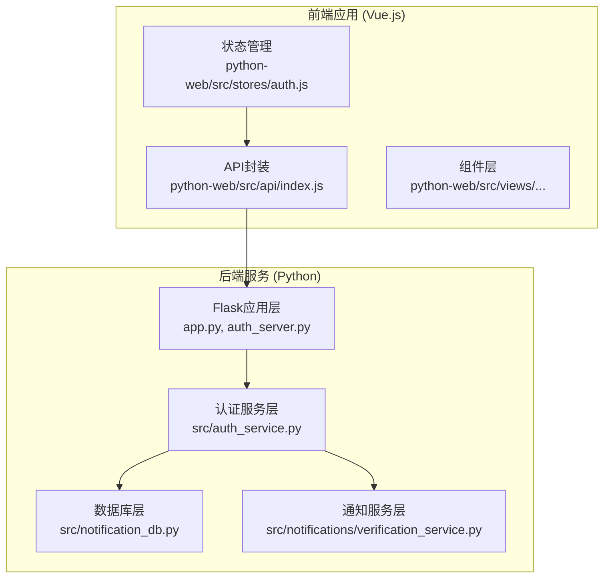

**图表来源**
- [app.py:1-800](file://python/app.py#L1-L800)
- [auth_server.py:1-431](file://python/auth_server.py#L1-L431)
- [src/auth_service.py:1-187](file://python/src/auth_service.py#L1-L187)

**章节来源**
- [app.py:1-800](file://python/app.py#L1-L800)
- [auth_server.py:1-431](file://python/auth_server.py#L1-L431)

## 核心组件

### 认证服务核心类

认证服务是整个系统的核心，负责令牌的生成、验证和管理：

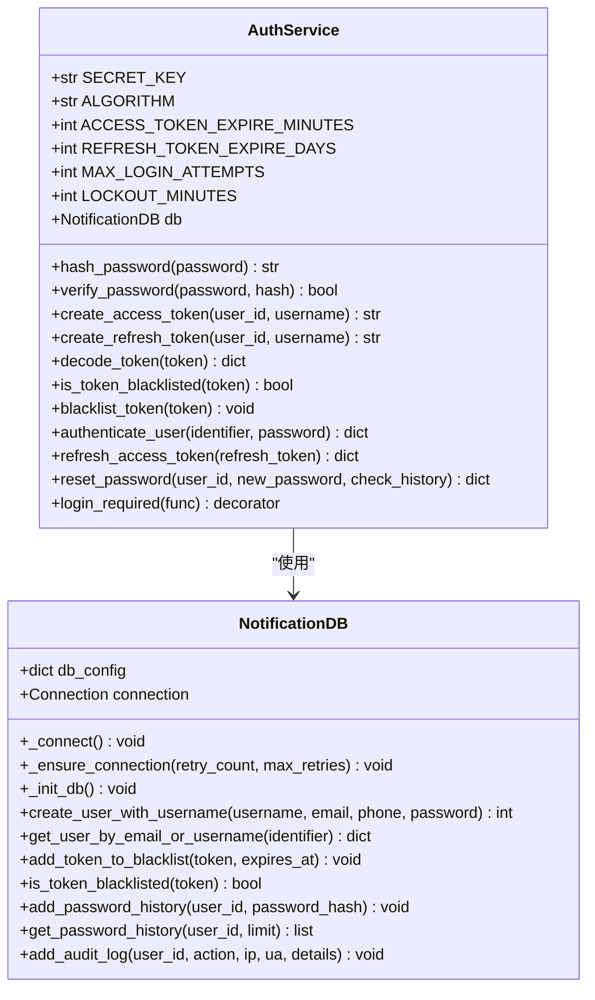

**图表来源**
- [src/auth_service.py:9-187](file://python/src/auth_service.py#L9-L187)
- [src/notification_db.py:6-357](file://python/src/notification_db.py#L6-L357)

### 前端状态管理

前端使用Pinia进行状态管理，实现了令牌的本地存储和自动续期：

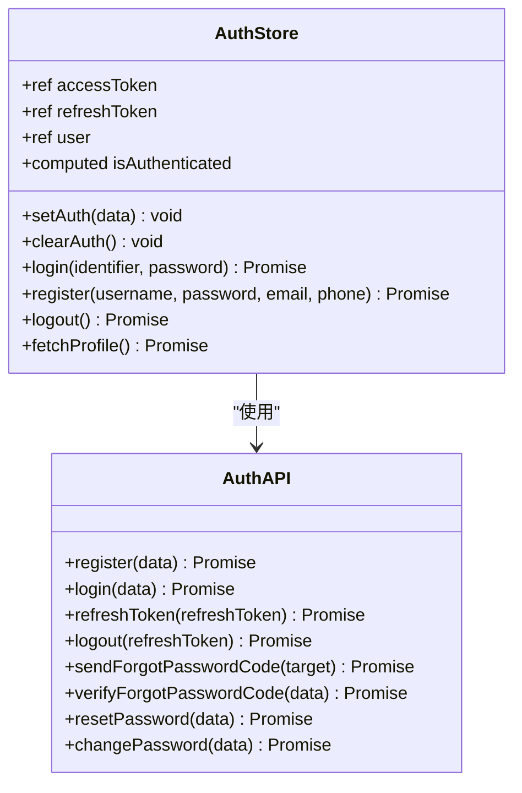

**图表来源**
- [python-web/src/stores/auth.js:5-74](file://python-web/src/stores/auth.js#L5-L74)
- [python-web/src/api/index.js:61-95](file://python-web/src/api/index.js#L61-L95)

**章节来源**
- [src/auth_service.py:9-187](file://python/src/auth_service.py#L9-L187)
- [python-web/src/stores/auth.js:5-74](file://python-web/src/stores/auth.js#L5-L74)

## 架构概览

系统采用分层架构设计，实现了清晰的关注点分离：

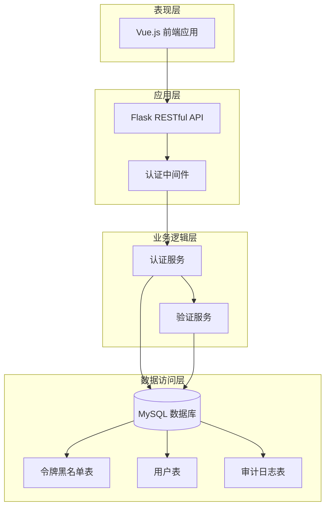

**图表来源**
- [app.py:1-800](file://python/app.py#L1-L800)
- [src/auth_service.py:1-187](file://python/src/auth_service.py#L1-L187)
- [src/notification_db.py:1-357](file://python/src/notification_db.py#L1-L357)

## 详细组件分析

### 令牌生成与验证机制

系统实现了完整的JWT令牌生命周期管理：

#### 访问令牌生成流程

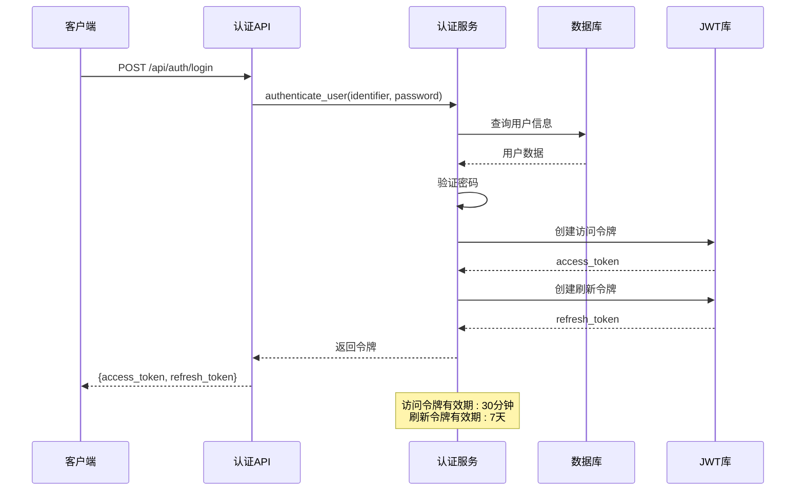

**图表来源**
- [src/auth_service.py:76-118](file://python/src/auth_service.py#L76-L118)
- [src/auth_service.py:27-45](file://python/src/auth_service.py#L27-L45)

#### 令牌验证流程

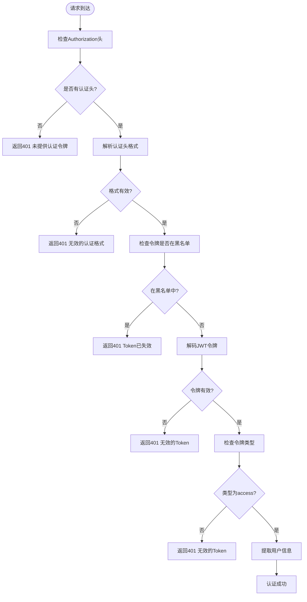

**图表来源**
- [src/auth_service.py:158-183](file://python/src/auth_service.py#L158-L183)

### 令牌刷新机制

系统支持基于刷新令牌的自动续期：

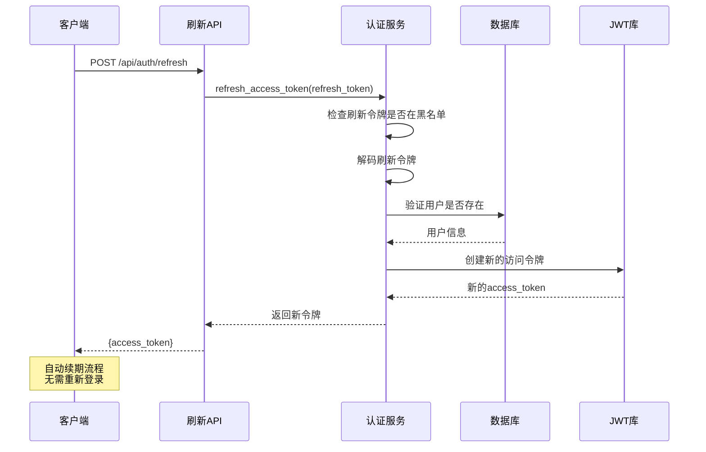

**图表来源**
- [src/auth_service.py:120-136](file://python/src/auth_service.py#L120-L136)

### 令牌撤销与黑名单机制

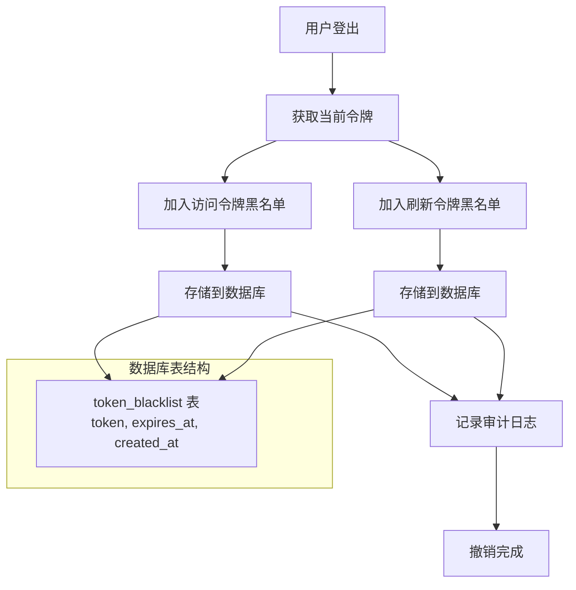

**图表来源**
- [src/auth_service.py:61-65](file://python/src/auth_service.py#L61-L65)
- [src/notification_db.py:297-311](file://python/src/notification_db.py#L297-L311)

**章节来源**
- [src/auth_service.py:27-136](file://python/src/auth_service.py#L27-L136)
- [src/notification_db.py:297-311](file://python/src/notification_db.py#L297-L311)

### 前端自动续期机制

前端实现了智能的令牌续期和错误处理：

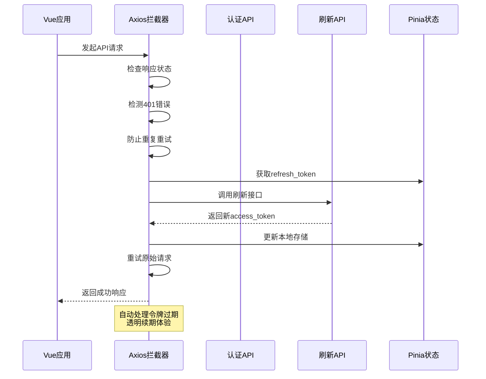

**图表来源**
- [python-web/src/api/index.js:22-59](file://python-web/src/api/index.js#L22-L59)

**章节来源**
- [python-web/src/api/index.js:22-59](file://python-web/src/api/index.js#L22-L59)
- [python-web/src/stores/auth.js:43-51](file://python-web/src/stores/auth.js#L43-L51)

## 依赖关系分析

系统各组件之间的依赖关系如下：

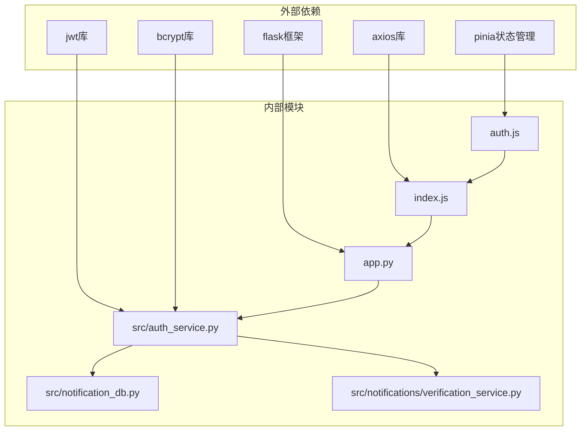

**图表来源**
- [src/auth_service.py:1-6](file://python/src/auth_service.py#L1-L6)
- [python-web/src/api/index.js:1-95](file://python-web/src/api/index.js#L1-L95)

**章节来源**
- [src/auth_service.py:1-6](file://python/src/auth_service.py#L1-L6)
- [python-web/src/api/index.js:1-95](file://python-web/src/api/index.js#L1-L95)

## 性能考虑

### 令牌存储优化

系统采用了多层缓存策略来提升性能：

1. **内存缓存**: 使用Python字典缓存常用用户信息
2. **数据库索引**: 在令牌黑名单表上建立token和expires_at索引
3. **连接池**: 使用pymysql连接池减少数据库连接开销

### 并发处理

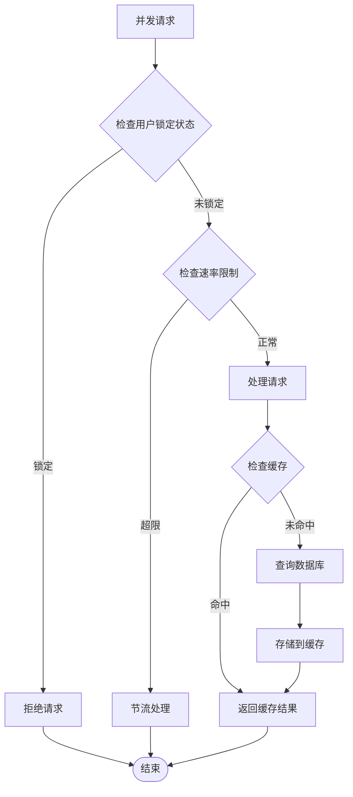

### 安全配置建议

1. **环境变量配置**: 将SECRET_KEY存储在环境变量中
2. **HTTPS强制**: 生产环境中强制使用HTTPS
3. **CORS配置**: 严格限制允许的源和方法
4. **令牌安全**: 设置合适的过期时间和刷新策略

## 故障排除指南

### 常见问题及解决方案

#### 令牌过期问题

**症状**: API返回401状态码
**原因**: 访问令牌已过期
**解决方案**: 
1. 检查前端是否正确处理401错误
2. 确认刷新令牌是否有效
3. 验证服务器时间同步

#### 登录失败问题

**症状**: 用户无法登录
**可能原因**:
1. 密码错误超过最大尝试次数
2. 账户被临时锁定
3. 用户名或邮箱不存在

**解决步骤**:
1. 检查用户输入的凭据
2. 查看登录尝试计数
3. 验证账户状态

#### 令牌撤销问题

**症状**: 用户登出后仍能访问受保护资源
**原因**: 令牌未正确加入黑名单
**解决方案**:
1. 确认logout接口调用
2. 检查数据库连接
3. 验证黑名单查询逻辑

**章节来源**
- [src/auth_service.py:76-118](file://python/src/auth_service.py#L76-L118)
- [src/notification_db.py:297-311](file://python/src/notification_db.py#L297-L311)

## 结论

本令牌管理系统实现了企业级的JWT认证解决方案，具有以下特点：

### 主要优势

1. **安全性**: 实现了完整的令牌生命周期管理，包括生成、验证、撤销和续期
2. **可靠性**: 采用多层防护机制，包括速率限制、账户锁定和审计日志
3. **可用性**: 提供自动续期功能，改善用户体验
4. **可维护性**: 清晰的分层架构和模块化设计

### 技术亮点

- **双令牌模型**: 访问令牌（短期）+ 刷新令牌（长期）
- **智能续期**: 前端自动处理令牌过期和续期
- **黑名单机制**: 支持令牌撤销和即时生效
- **审计追踪**: 完整的操作日志记录

### 改进建议

1. **分布式支持**: 考虑使用Redis等缓存存储令牌状态
2. **多因子认证**: 集成短信或邮箱验证码
3. **权限控制**: 实现基于角色的访问控制(RBAC)
4. **监控告警**: 添加令牌使用情况的监控指标

该系统为企业级应用提供了坚实的基础，可以根据具体需求进行扩展和定制。