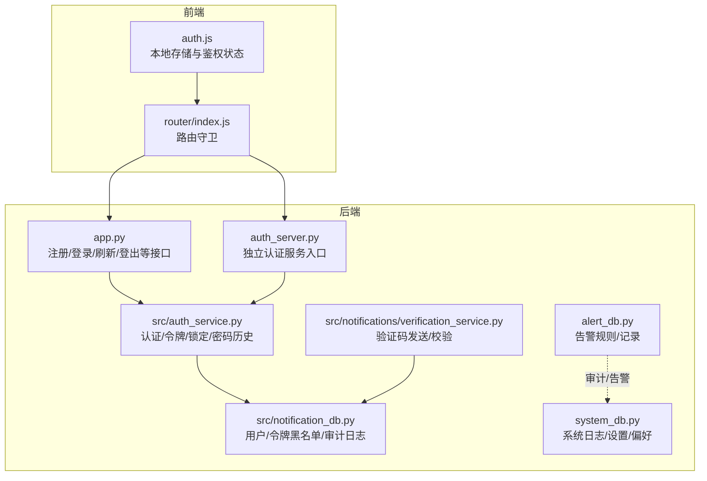
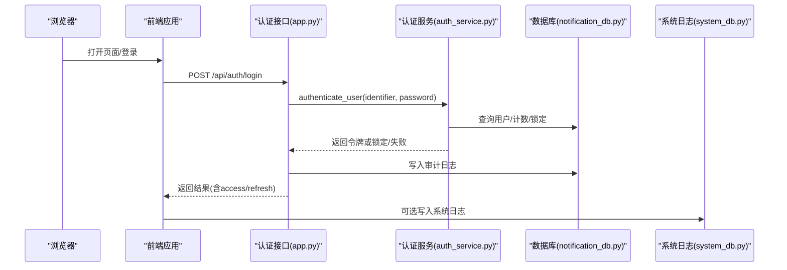
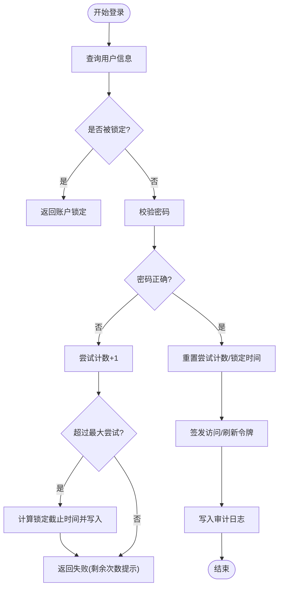
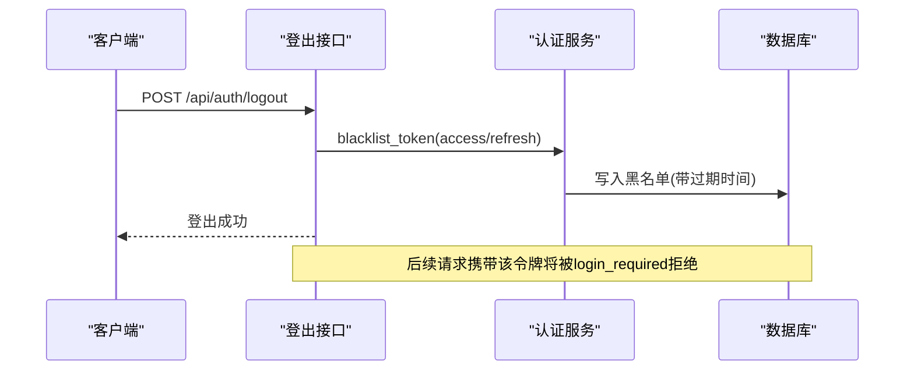
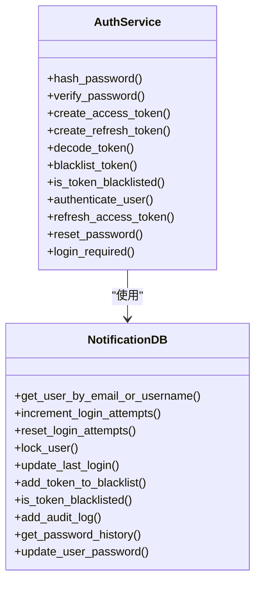
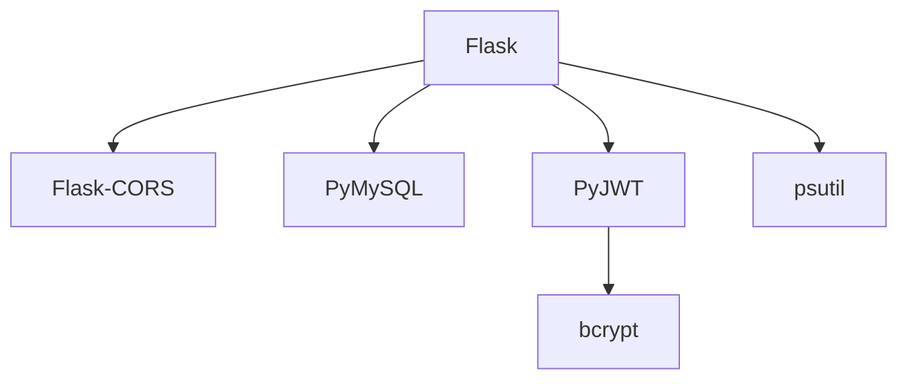

# 安全控制

<cite>
**本文引用的文件**
- [app.py](file://python/app.py)
- [auth_server.py](file://python/auth_server.py)
- [src/auth_service.py](file://python/src/auth_service.py)
- [src/notification_db.py](file://python/src/notification_db.py)
- [src/notifications/verification_service.py](file://python/src/notifications/verification_service.py)
- [alert_db.py](file://python/alert_db.py)
- [system_db.py](file://python/system_db.py)
- [python-web/src/stores/auth.js](file://python-web/src/stores/auth.js)
- [python-web/src/router/index.js](file://python-web/src/router/index.js)
- [requirements.txt](file://python/requirements.txt)
</cite>

## 目录
1. [简介](#简介)
2. [项目结构](#项目结构)
3. [核心组件](#核心组件)
4. [架构总览](#架构总览)
5. [详细组件分析](#详细组件分析)
6. [依赖分析](#依赖分析)
7. [性能考虑](#性能考虑)
8. [故障排查指南](#故障排查指南)
9. [结论](#结论)
10. [附录](#附录)

## 简介
本文件面向开发者，系统化梳理该代码库中的安全控制机制，覆盖账户锁定与登录尝试限制、防暴力破解策略、令牌黑名单管理、会话安全管理、安全审计日志、异常检测与安全事件响应、风险评估策略，并提供安全配置示例、防护措施实现与监控告警建议。目标是帮助构建企业级安全认证系统。

## 项目结构
后端采用 Python+Flask 构建，前端使用 Vue+Pinia+Vue Router。安全相关逻辑集中在认证服务、数据库层与前端路由守卫中；同时提供系统日志与告警数据库用于安全审计与监控。

图表来源
- [app.py:1-800](file://python/app.py#L1-L800)
- [auth_server.py:1-431](file://python/auth_server.py#L1-L431)
- [src/auth_service.py:1-187](file://python/src/auth_service.py#L1-L187)
- [src/notification_db.py:1-357](file://python/src/notification_db.py#L1-L357)
- [src/notifications/verification_service.py:1-108](file://python/src/notifications/verification_service.py#L1-L108)
- [alert_db.py:1-314](file://python/alert_db.py#L1-L314)
- [system_db.py:1-317](file://python/system_db.py#L1-L317)
- [python-web/src/stores/auth.js:1-74](file://python-web/src/stores/auth.js#L1-L74)
- [python-web/src/router/index.js:1-150](file://python-web/src/router/index.js#L1-L150)

章节来源
- [app.py:1-800](file://python/app.py#L1-L800)
- [auth_server.py:1-431](file://python/auth_server.py#L1-L431)
- [src/auth_service.py:1-187](file://python/src/auth_service.py#L1-L187)
- [src/notification_db.py:1-357](file://python/src/notification_db.py#L1-L357)
- [src/notifications/verification_service.py:1-108](file://python/src/notifications/verification_service.py#L1-L108)
- [alert_db.py:1-314](file://python/alert_db.py#L1-L314)
- [system_db.py:1-317](file://python/system_db.py#L1-L317)
- [python-web/src/stores/auth.js:1-74](file://python-web/src/stores/auth.js#L1-L74)
- [python-web/src/router/index.js:1-150](file://python-web/src/router/index.js#L1-L150)

## 核心组件
- 认证服务：负责密码哈希、JWT 生成与校验、访问/刷新令牌、登录尝试计数与账户锁定、令牌黑名单、密码历史校验、登录中间件。
- 数据库层：用户表（含登录尝试计数、锁定时间、最后登录时间）、令牌黑名单表、密码历史表、审计日志表；以及系统日志、告警规则与记录表。
- 前端鉴权：Pinia Store 存储访问/刷新令牌与用户信息；路由守卫拦截未授权访问。
- 验证码服务：支持邮箱/短信验证码发送与校验，配合找回密码流程。

章节来源
- [src/auth_service.py:1-187](file://python/src/auth_service.py#L1-L187)
- [src/notification_db.py:1-357](file://python/src/notification_db.py#L1-L357)
- [src/notifications/verification_service.py:1-108](file://python/src/notifications/verification_service.py#L1-L108)
- [python-web/src/stores/auth.js:1-74](file://python-web/src/stores/auth.js#L1-L74)
- [python-web/src/router/index.js:1-150](file://python-web/src/router/index.js#L1-L150)

## 架构总览
下图展示从浏览器到后端服务、数据库与审计/告警系统的整体交互。

图表来源
- [app.py:99-124](file://python/app.py#L99-L124)
- [src/auth_service.py:76-118](file://python/src/auth_service.py#L76-L118)
- [src/notification_db.py:334-343](file://python/src/notification_db.py#L334-L343)
- [system_db.py:99-117](file://python/system_db.py#L99-L117)

## 详细组件分析

### 账户锁定与登录尝试限制
- 登录尝试上限与锁定时长：在认证服务中定义最大尝试次数与锁定分钟数，失败则递增尝试计数，达到阈值即锁定。
- 锁定判断：若当前时间早于 locked_until，则拒绝登录。
- 成功登录后重置尝试计数与锁定时间，并更新最后登录时间。
- 审计日志：登录成功/失败均写入审计日志，便于追踪。

图表来源
- [src/auth_service.py:76-118](file://python/src/auth_service.py#L76-L118)
- [src/notification_db.py:261-295](file://python/src/notification_db.py#L261-L295)
- [app.py:109-120](file://python/app.py#L109-L120)

章节来源
- [src/auth_service.py:14-15](file://python/src/auth_service.py#L14-L15)
- [src/auth_service.py:67-74](file://python/src/auth_service.py#L67-L74)
- [src/auth_service.py:88-97](file://python/src/auth_service.py#L88-L97)
- [src/auth_service.py:99-100](file://python/src/auth_service.py#L99-L100)
- [src/notification_db.py:261-295](file://python/src/notification_db.py#L261-L295)
- [app.py:109-120](file://python/app.py#L109-L120)

### 防暴力破解策略
- 密码错误计数与锁定：失败即计数+1，达阈值锁定，避免持续爆破。
- 令牌黑名单：登出时将访问/刷新令牌加入黑名单，立即失效。
- 刷新令牌校验：刷新前检查是否在黑名单，防止旧令牌复用。
- 登录中间件：每次受保护请求均校验令牌类型与有效性，黑名单直接拒绝。

图表来源
- [app.py:142-167](file://python/app.py#L142-L167)
- [src/auth_service.py:61-65](file://python/src/auth_service.py#L61-L65)
- [src/auth_service.py:120-136](file://python/src/auth_service.py#L120-L136)
- [src/auth_service.py:158-183](file://python/src/auth_service.py#L158-L183)
- [src/notification_db.py:297-311](file://python/src/notification_db.py#L297-L311)

章节来源
- [src/auth_service.py:14-15](file://python/src/auth_service.py#L14-L15)
- [src/auth_service.py:88-97](file://python/src/auth_service.py#L88-L97)
- [src/auth_service.py:120-136](file://python/src/auth_service.py#L120-L136)
- [src/auth_service.py:158-183](file://python/src/auth_service.py#L158-L183)
- [src/notification_db.py:297-311](file://python/src/notification_db.py#L297-L311)

### 令牌黑名单管理
- 黑名单表结构：token、expires_at、created_at。
- 加入黑名单：解析令牌获取过期时间，写入黑名单。
- 校验黑名单：请求时检查令牌是否在有效期内存在于黑名单。
- 登出/刷新流程：主动将令牌加入黑名单，确保立即失效。

章节来源
- [src/notification_db.py:74-80](file://python/src/notification_db.py#L74-L80)
- [src/notification_db.py:297-311](file://python/src/notification_db.py#L297-L311)
- [src/auth_service.py:58-65](file://python/src/auth_service.py#L58-L65)
- [src/auth_service.py:120-136](file://python/src/auth_service.py#L120-L136)

### 会话安全管理
- 令牌类型区分：access 与 refresh，分别用于短期访问与换取新令牌。
- 访问令牌过期：较短有效期，降低泄露风险。
- 刷新令牌过期：较长有效期，但受黑名单与用户态约束。
- 前端存储：使用 localStorage 持久化令牌与用户信息；路由守卫拦截未授权访问。

图表来源
- [src/auth_service.py:1-187](file://python/src/auth_service.py#L1-L187)
- [src/notification_db.py:1-357](file://python/src/notification_db.py#L1-L357)

章节来源
- [src/auth_service.py:27-45](file://python/src/auth_service.py#L27-L45)
- [src/auth_service.py:158-183](file://python/src/auth_service.py#L158-L183)
- [python-web/src/stores/auth.js:1-74](file://python-web/src/stores/auth.js#L1-L74)
- [python-web/src/router/index.js:134-147](file://python-web/src/router/index.js#L134-L147)

### 安全审计日志
- 审计日志表：包含用户ID、动作、IP、UA、详情、时间。
- 写入时机：注册、登录、登出、重置密码、修改密码等关键动作。
- 查询与统计：可用于安全事件回溯与合规审计。

章节来源
- [src/notification_db.py:93-103](file://python/src/notification_db.py#L93-L103)
- [src/notification_db.py:334-343](file://python/src/notification_db.py#L334-L343)
- [app.py:85-91](file://python/app.py#L85-L91)
- [app.py:112-118](file://python/app.py#L112-L118)
- [app.py:156-162](file://python/app.py#L156-L162)
- [app.py:228-234](file://python/app.py#L228-L234)
- [app.py:263-269](file://python/app.py#L263-L269)

### 异常检测机制与安全事件响应
- 告警规则与记录：支持按任务/类型/阈值配置告警规则，记录告警并标记未读。
- 系统日志：统一记录系统级别日志，便于问题定位与安全分析。
- 建议：结合登录失败率、异常IP、异常UA等指标建立动态阈值与自动化处置（如临时封禁、二次验证）。

章节来源
- [alert_db.py:50-81](file://python/alert_db.py#L50-L81)
- [alert_db.py:199-223](file://python/alert_db.py#L199-L223)
- [alert_db.py:224-279](file://python/alert_db.py#L224-L279)
- [system_db.py:51-63](file://python/system_db.py#L51-L63)
- [system_db.py:99-162](file://python/system_db.py#L99-L162)

### 风险评估策略
- 密码策略：强制长度、禁止重复使用近期密码。
- 令牌策略：短有效期访问令牌、刷新令牌黑名单、登出即失效。
- 行为风控：登录失败阈值、锁定时间、审计日志、异常检测与告警联动。
- 建议：引入设备指纹、地理位置、UA特征等多维因子进行风险评分与动态阻断。

章节来源
- [src/auth_service.py:138-156](file://python/src/auth_service.py#L138-L156)
- [src/notification_db.py:323-332](file://python/src/notification_db.py#L323-L332)
- [alert_db.py:50-81](file://python/alert_db.py#L50-L81)

## 依赖分析
后端依赖包括 Flask、CORS、PyMySQL、bcrypt、PyJWT、psutil 等，为认证、数据库连接、加密与系统监控提供基础能力。

图表来源
- [requirements.txt:1-14](file://python/requirements.txt#L1-L14)

章节来源
- [requirements.txt:1-14](file://python/requirements.txt#L1-L14)

## 性能考虑
- 令牌黑名单查询：建议对 token 建唯一索引并定期清理过期条目，避免查询膨胀。
- 登录尝试计数：批量更新与缓存热点用户信息，减少频繁写库。
- 审计日志与告警：异步写入或批处理，避免阻塞主业务链路。
- 前端存储：localStorage 大小限制与跨标签页同步，建议统一 Pinia Store 管理。

## 故障排查指南
- 登录失败/被锁定
  - 检查用户是否存在与密码是否正确。
  - 查看登录尝试计数与 locked_until 是否生效。
  - 审核审计日志定位异常来源。
- 令牌无效/无法刷新
  - 确认令牌类型为 Bearer 且未在黑名单。
  - 校验密钥与算法一致性。
  - 检查刷新令牌是否过期。
- 前端无法访问受保护页面
  - 检查路由守卫与鉴权状态。
  - 确认 localStorage 中 access_token 与 user 是否存在。

章节来源
- [src/auth_service.py:158-183](file://python/src/auth_service.py#L158-L183)
- [src/notification_db.py:307-311](file://python/src/notification_db.py#L307-L311)
- [python-web/src/router/index.js:134-147](file://python-web/src/router/index.js#L134-L147)
- [python-web/src/stores/auth.js:1-74](file://python-web/src/stores/auth.js#L1-L74)

## 结论
该代码库已具备企业级认证系统的核心安全能力：账户锁定与登录限制、令牌黑名单、会话安全、审计日志与告警体系。建议在此基础上进一步完善行为风控、动态阈值与自动化处置，并加强密钥管理与传输安全，以满足更严格的企业安全要求。

## 附录

### 安全配置示例
- 密钥与算法
  - 在生产环境替换默认密钥，确保算法一致。
- 令牌有效期
  - 访问令牌短周期，刷新令牌中等周期，结合黑名单实现即时失效。
- 登录策略
  - 设置合理的最大尝试次数与锁定时长，开启审计日志。
- 数据库
  - 为 token_blacklist 的 token 字段建立唯一索引，定期清理过期项。

章节来源
- [src/auth_service.py:10-15](file://python/src/auth_service.py#L10-L15)
- [src/notification_db.py:74-80](file://python/src/notification_db.py#L74-L80)

### 防护措施实现清单
- 后端
  - 实现登录失败计数与锁定、令牌黑名单、登录中间件校验。
  - 关键操作写入审计日志。
- 前端
  - 统一存储与清理令牌，路由守卫拦截未授权访问。
- 数据库
  - 用户表、令牌黑名单表、审计日志表、系统日志表、告警规则与记录表。

章节来源
- [src/auth_service.py:76-118](file://python/src/auth_service.py#L76-L118)
- [src/notification_db.py:44-103](file://python/src/notification_db.py#L44-L103)
- [python-web/src/stores/auth.js:1-74](file://python-web/src/stores/auth.js#L1-L74)
- [python-web/src/router/index.js:134-147](file://python-web/src/router/index.js#L134-L147)

### 监控告警设置建议
- 登录失败率突增：触发临时锁定与二次验证。
- 异常IP/UA：加入白名单/灰名单策略，必要时封禁。
- 审计日志：对高危操作（重置密码、修改权限）实时告警。
- 系统日志：统一收集与分级，保留归档周期。

章节来源
- [alert_db.py:50-81](file://python/alert_db.py#L50-L81)
- [alert_db.py:199-223](file://python/alert_db.py#L199-L223)
- [system_db.py:51-63](file://python/system_db.py#L51-L63)